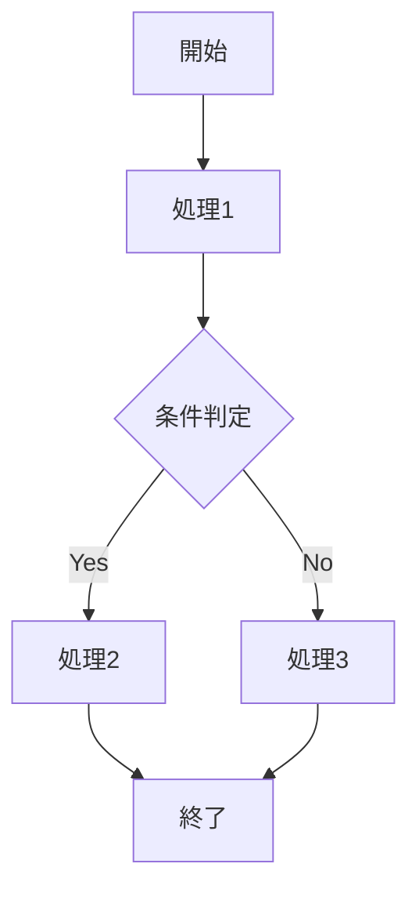
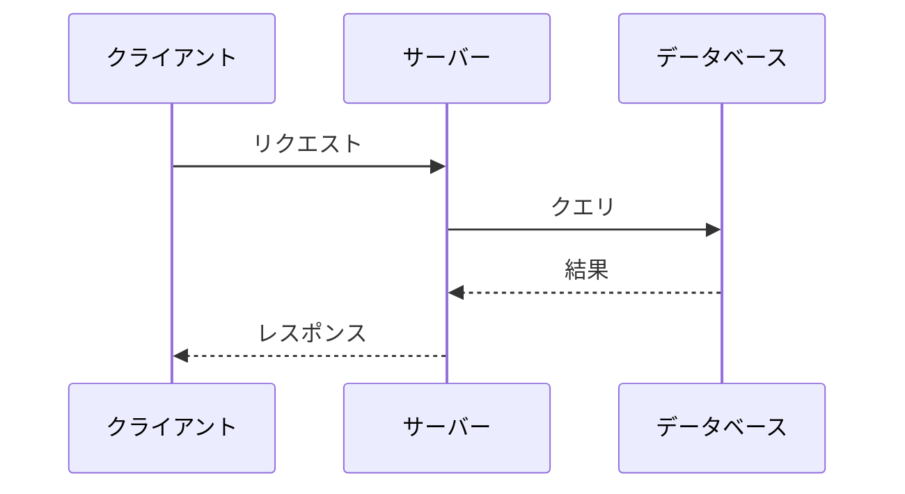
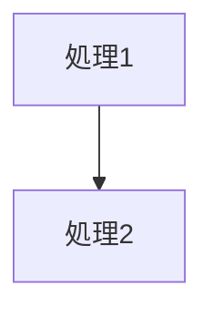
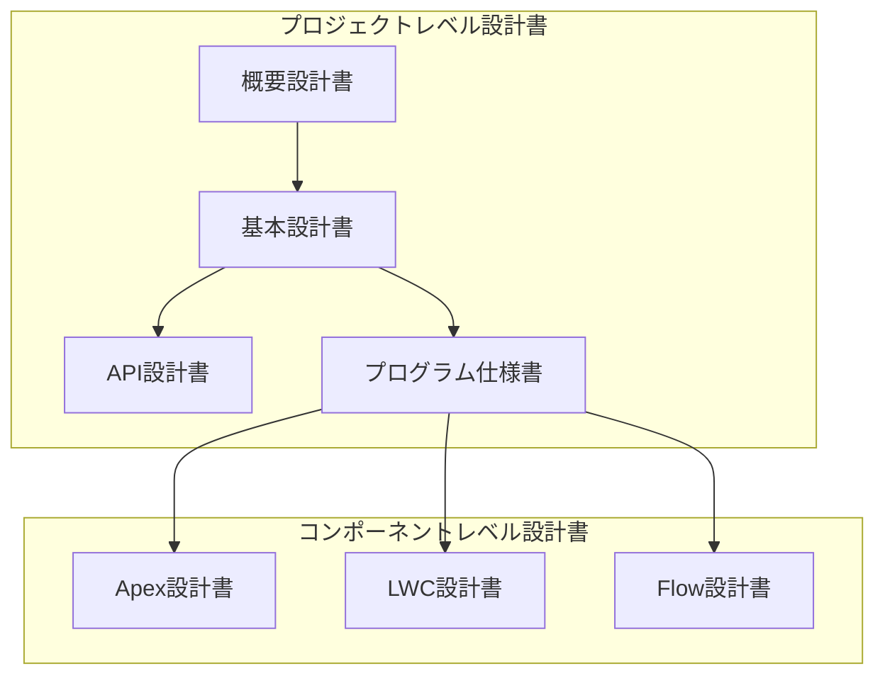

# ドキュメント生成ルール

このファイルは、AI アシスタントがドキュメントを生成する際のルールを定義します。

## 1. 図表作成ルール（Mermaid 必須）

### 1.1. 必須要件

**すべてのフロー図、チャート、グラフ、UML は Mermaid 記法で作成すること。**

以下の図表を作成する場合、必ず Mermaid を使用してください：

| 図表の種類 | Mermaid 記法 | 用途 |
|-----------|-------------|------|
| フローチャート | `flowchart TD/LR` | 処理フロー、条件分岐 |
| シーケンス図 | `sequenceDiagram` | API連携、処理順序 |
| クラス図 | `classDiagram` | クラス構成、継承関係 |
| ER図 | `erDiagram` | データモデル、オブジェクト関係 |
| 状態遷移図 | `stateDiagram-v2` | ステータス遷移 |
| ガントチャート | `gantt` | スケジュール、タイムライン |
| 円グラフ | `pie` | 割合、分布 |
| マインドマップ | `mindmap` | 概念整理、構造化 |

### 1.2. Mermaid 記述ルール

```markdown
#### フローチャートの例


#### シーケンス図の例

```

### 1.3. アンカー参照

設計書内のフロー図では、各ノードに設計書内の処理節への参照用アンカーを設定してください。



### 1.4. 禁止事項

以下の方法での図表作成は禁止です：

- ASCII アート
- 外部ツール（draw.io, Lucidchart 等）で作成した画像の埋め込み
- PlantUML（Mermaid に統一）
- テキストベースの表で図を表現すること

## 2. doc / doc_draft フォルダの使い分け

### 2.1. 参照ルール（必須）

**コード生成・設計書作成時は、必ず以下のルールに従ってフォルダを参照すること。**

| フォルダ | 参照タイミング | 内容 |
|----------|---------------|------|
| `doc/` | **実装時に必ず参照** | 承認済みの正式な設計書・仕様書 |
| `doc/objects/` | **コード生成前に必ず参照** | オブジェクト定義書（API名、項目名、選択リスト値） |
| `doc_draft/` | **作業中の機能に関連する場合のみ参照** | レビュー前の設計書ドラフト |

### 2.2. 参照の優先順位

1. **`doc/`（正式版）を優先:** 実装の根拠となる仕様は正式版を使用
2. **`doc_draft/`（ドラフト）は補助:** 作業中の新機能の場合のみ参照
3. **競合時は質問:** 正式版とドラフトで内容が異なる場合は確認

### 2.3. ドラフト配置ルール

* **作成段階のドキュメントは `doc_draft/` に配置**
    - 設計書作成中・レビュー前のドキュメントは必ず `doc_draft/` に作成
    - レビュー完了・承認後に `doc/` へ移動
    - これにより、正式な設計書と作業中のドキュメントを明確に区別

### 2.4. ファイル命名規則

| 種類 | 命名パターン | 例 |
|------|-------------|-----|
| 機能設計書 | `{機能名}-design.md` | `ncreate-elec-on-design.md` |
| API仕様書 | `{API名}-api-spec.md` | `vacant-electricity-api-spec.md` |
| 概要設計書 | `{機能名}-overview.md` | `vacant-electricity-overview.md` |
| エラーケース | `{機能名}-error-cases.md` | `api-error-cases.md` |

## 3. 正式ドキュメント（doc）ルール

### 3.1. 配置とインデックス

* `doc/` 配下にドキュメントを追加した場合は `doc/readme.md` にリンクを追加
* マニュアルは `doc/manual/` 配下に作成

### 3.2. ディレクトリ構造

```
doc/
├── readme.md           # インデックス（必ず更新）
├── apex/               # Apex 設計書
├── lwc/                # LWC 設計書
├── flow/               # Flow 設計書
├── objects/            # オブジェクト定義書
└── manual/             # マニュアル
```

## 4. テンプレート使用ルール

### 4.1. テンプレート階層と使い分け

設計書は**プロジェクトレベル**と**コンポーネントレベル**の2階層で構成されます。



### 4.2. プロジェクトレベルテンプレート

**新規プロジェクト・大規模機能開発時に使用：**

| テンプレート | ファイル名 | 用途 | 作成タイミング |
|-------------|-----------|------|---------------|
| 概要設計書 | `overview_design.template.md` | システム全体構成、環境定義、データモデル、セキュリティ方針 | プロジェクト開始時 |
| 基本設計書 | `basic_design.template.md` | オブジェクト定義、画面設計、ビジネスロジック、権限設計 | 要件確定後 |
| API設計書 | `api_design.template.md` | 外部システム連携、Inbound/Outbound API仕様 | 連携機能設計時 |
| プログラム仕様書 | `program_spec.template.md` | Apex/LWC/Flow の全体構成、クラス構成図 | 実装前 |

### 4.3. コンポーネントレベルテンプレート

**個別コンポーネント開発時に使用：**

| カテゴリ | テンプレート | 用途 |
|---------|-------------|------|
| **Apex** | `apex_class.template.md` | サービスクラス、ユーティリティクラス |
| | `apex_trigger.template.md` | トリガー |
| | `apex_handler.template.md` | トリガーハンドラ |
| | `apex_rest_api.template.md` | REST API エンドポイント |
| | `apex_batch.template.md` | バッチ処理 |
| | `apex_schedulable.template.md` | スケジュール処理 |
| | `apex_invocable.template.md` | Flow呼び出し可能メソッド |
| | `apex_controller.template.md` | LWC/VFコントローラ |
| | `apex_utility.template.md` | ユーティリティクラス |
| | `apex_test.template.md` | テストクラス |
| **LWC** | `lwc.template.md` | Lightning Web Components |
| **Flow** | `flow.template.md` | フロー |
| **VF** | `visualforce.template.md` | Visualforce ページ |

### 4.4. テンプレート選択ガイド

| シナリオ | 使用するテンプレート |
|---------|---------------------|
| 新規プロジェクト立ち上げ | 概要設計書 → 基本設計書 → 各コンポーネント |
| 外部API連携機能追加 | API設計書 + apex_rest_api |
| 新規トリガー作成 | apex_trigger + apex_handler |
| 新規LWCコンポーネント追加 | lwc + apex_controller（必要時） |
| バッチ処理追加 | apex_batch + apex_schedulable |
| 単一クラスの修正 | 該当コンポーネントテンプレート |

### 4.5. テンプレート必須要素

- **Apex トリガと Flow の設計書:** Mermaid フロー図を必須作成
- **Mermaid 図のノード:** 設計書内の処理節への参照用アンカーを設定
- **プログラム仕様書:** クラス構成図（Mermaid classDiagram）を必須作成

## 5. ドキュメント記述ルール

### 5.1. 基本フォーマット

* **言語:** 日本語
* **形式:** Markdown
* **見出し:** `#` から `####` まで階層的に使用
* **コードブロック:** 言語指定付き（```apex, ```javascript 等）

### 5.2. 必須セクション（設計書）

1. **メタ情報:** タイトル、作成日、バージョン
2. **目次:** 各セクションへのリンク
3. **概要:** 目的、スコープ、非スコープ
4. **処理フロー:** Mermaid 図（必須）
5. **詳細仕様:** メソッド、データ、エラー処理
6. **テストケース:** 正常系・異常系
7. **改訂履歴:** バージョン、日付、変更内容

### 5.3. 表記ルール

| 項目 | ルール |
|------|--------|
| API名 | バッククォートで囲む（例: `doPost()`） |
| 日付形式 | `YYYY-MM-DD` |
| 時刻形式 | `HH:MM:SS` または ISO 8601 |

### 5.4. Salesforce API名の表記ルール（必須）

**オブジェクト名・項目名をドキュメントに記載する場合は、必ずラベルとAPI名を併記すること。**

#### 表記形式

| 対象 | 形式 | 例 |
|------|------|-----|
| オブジェクト名 | `ラベル（API名）` | 入居申込（`Movein__c`） |
| 項目名 | `ラベル（API名）` | 地点コード（`RealEstateId__c`） |
| 選択リスト値 | `ラベル` または `"値"` | 申込処理中、"申込処理中" |

#### 記述例

```markdown
## 良い例
- 入居申込（`Movein__c`）オブジェクトから地点コード（`RealEstateId__c`）を取得する
- サービス案内（`ServiceGuide__c`）の代理店ステータス（`AgencyStatus__c`）を「未対応」に設定

## 悪い例（禁止）
- `Movein__c` オブジェクトから `RealEstateId__c` を取得する
- 入居申込オブジェクトから地点コードを取得する
```

#### 理由

- ラベルのみ: 開発者がAPI名を特定できない
- API名のみ: 業務担当者が内容を理解できない
- 併記: 両者が理解でき、設計書として完全な情報を提供

### 5.5. テーブル形式の使用ルール（必須）

**構造化された情報は箇条書きではなくテーブル形式で記載すること。**

テーブル形式は視認性が高く、情報の比較・参照が容易になります。

#### テーブルを使用すべき場面

| 場面 | 理由 | 例 |
|------|------|-----|
| 項目と説明の対応 | 一覧性が高い | API一覧、パラメータ説明 |
| 複数属性を持つリスト | 比較しやすい | テーブル定義、カラム仕様 |
| 選択肢・オプション | 選択条件が明確 | コマンド一覧、設定項目 |
| ステータス・状態 | 状態遷移が明確 | 進捗状況、機能一覧 |
| 対比・比較 | 違いが分かりやすい | 良い例/悪い例、新旧比較 |

#### 良い例と悪い例

```markdown
## 悪い例（箇条書き）
- `make up`: 標準構成で起動
- `make dev`: 開発モードで起動
- `make down`: サービス停止
- `make logs`: ログ表示

## 良い例（テーブル形式）
| コマンド | 説明 |
|----------|------|
| `make up` | 標準構成で起動 |
| `make dev` | 開発モードで起動 |
| `make down` | サービス停止 |
| `make logs` | ログ表示 |
```

#### 箇条書きを使用すべき場面

| 場面 | 理由 |
|------|------|
| 手順・ステップ | 順序が重要な場合は番号付きリスト |
| 単純な列挙 | 属性が1つのみの場合 |
| 注意事項・補足 | 短い説明文の場合 |
| 階層構造 | ネストが深い場合（ディレクトリ構造等） |

#### テーブルの推奨フォーマット

```markdown
| 項目 | 説明 | 備考 |
|------|------|------|
| 内容1 | 説明1 | 備考1 |
| 内容2 | 説明2 | 備考2 |
```

- **ヘッダー行:** 必ず含める
- **区切り線:** `|------|` で列を区切る
- **アライメント:** 左揃え（デフォルト）で統一
- **空セル:** `-` または空白で表現
