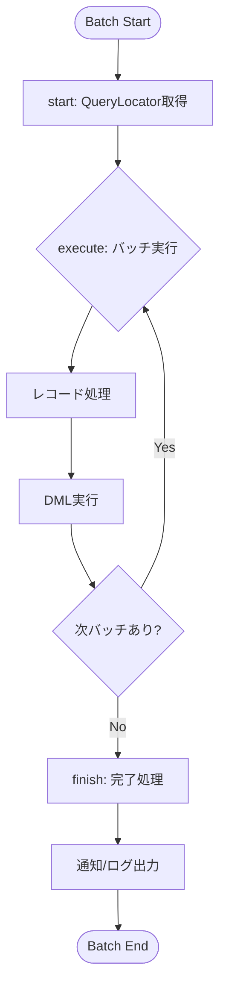

# APEX Batch 設計書テンプレート

目的: Apex バッチ処理の設計書を作成するためのテンプレート。バッチサイズ、クエリロケーター、実行スケジュールを明記する。

---

## メタ
```yaml
title: <short title>
feature_name: <FEATURE_NAME>
module: apex
apex_type: batch
source_path: force-app/main/default/classes/<ClassName>.cls
generated_at: <ISO8601>
```

---

## 目次
1. [概要](#1-概要)
2. [バッチ仕様](#2-バッチ仕様)
3. [実行スケジュール](#3-実行スケジュール)
4. [処理フロー](#4-処理フロー)
5. [メソッド詳細](#5-メソッド詳細)
6. [エラーハンドリング](#6-エラーハンドリング)
7. [ガバナ制限対策](#7-ガバナ制限対策)
8. [監視・運用](#8-監視運用)
9. [単体テスト](#9-単体テスト)
10. [変更仕様マトリクス](#10-変更仕様マトリクス)
11. [改訂履歴](#11-改訂履歴)

---

## 1. 概要

### 目的
<!-- バッチ処理の目的・実行背景を記載 -->

### 対象オブジェクト
- **オブジェクト名（API名）**
  - 参照: `doc/objects/オブジェクト名.md`

### 主なビジネスルール
<!-- 主要なビジネスルールを箇条書きで記載 -->

---

## 2. バッチ仕様

| 項目 | 値 |
|------|-----|
| クラス名 | BatchClassName |
| 実装インターフェース | Database.Batchable<sObject>, Database.Stateful, Database.AllowsCallouts |
| デフォルトバッチサイズ | 200 |
| 推奨バッチサイズ | 200 |
| Stateful | Yes/No（状態保持の有無） |
| Callout許可 | Yes/No |

### QueryLocator/Iterable
```apex
// start メソッドのクエリ
SELECT Id, Field1__c, Field2__c
FROM Object__c
WHERE Condition__c = true
```

---

## 3. 実行スケジュール

| 項目 | 値 |
|------|-----|
| 実行タイミング | 毎日 AM 3:00 / 手動 / イベント駆動 |
| Cron式 | `0 0 3 * * ?` |
| スケジューラクラス | ScheduleXxxBatch |
| 手動実行方法 | `Database.executeBatch(new BatchClassName(), 200);` |

---

## 4. 処理フロー



---

## 5. メソッド詳細

### 5.1 start メソッド (anchor: start-method)

**入力データ:**
- Database.BatchableContext bc

**出力データ:**
- Database.QueryLocator または Iterable<sObject>

**前提条件:**
- バッチ実行開始

**主要アルゴリズム:**
1. 対象レコードを取得するSOQL構築
2. QueryLocator を返却

**エラーとリカバリ:**
- SOQLエラー時はバッチ全体が失敗

```apex
public Database.QueryLocator start(Database.BatchableContext bc) {
    return Database.getQueryLocator([
        SELECT Id, Field__c FROM Object__c WHERE Condition__c = true
    ]);
}
```

### 5.2 execute メソッド (anchor: execute-method)

**入力データ:**
- Database.BatchableContext bc
- List<sObject> scope

**出力データ:**
- なし（DMLによるデータ更新）

**前提条件:**
- start で取得したレコードがスコープに渡される

**主要アルゴリズム:**
1. スコープ内レコードをループ
2. ビジネスロジック適用
3. 更新リストに追加
4. バルク DML 実行

**エラーとリカバリ:**
- DMLエラー時は Database.SaveResult で個別処理
- Stateful の場合はエラーカウントを保持

```apex
public void execute(Database.BatchableContext bc, List<Object__c> scope) {
    List<Object__c> updateList = new List<Object__c>();
    for (Object__c rec : scope) {
        rec.Field__c = '処理済み';
        updateList.add(rec);
    }
    update updateList;
}
```

### 5.3 finish メソッド (anchor: finish-method)

**入力データ:**
- Database.BatchableContext bc

**出力データ:**
- なし（通知・ログ出力）

**前提条件:**
- 全バッチ処理完了

**主要アルゴリズム:**
1. 処理結果の集計
2. 通知メール送信（必要時）
3. ログレコード作成（必要時）
4. 次バッチの起動（チェーン実行時）

**エラーとリカバリ:**
- 通知失敗時はログのみ出力

```apex
public void finish(Database.BatchableContext bc) {
    AsyncApexJob job = [SELECT Id, Status, NumberOfErrors FROM AsyncApexJob WHERE Id = :bc.getJobId()];
    // 通知処理
}
```

---

## 6. エラーハンドリング

| エラー種別 | 対処方法 | リトライ |
|-----------|---------|---------|
| SOQLエラー | ログ出力、管理者通知 | 手動 |
| DMLエラー | 個別レコードスキップ、エラーログ | 自動リトライなし |
| ガバナ制限 | バッチサイズ調整 | 手動 |
| 外部API失敗 | リトライ後にエラーログ | 最大3回 |

---

## 7. ガバナ制限対策

| 制限項目 | 上限 | 対策 |
|---------|------|------|
| SOQL (start) | 50,000,000 レコード | QueryLocator 使用 |
| SOQL (execute) | 100回/トランザクション | バルク化、Map活用 |
| DML | 10,000レコード/トランザクション | バッチサイズ200以下 |
| CPU時間 | 60,000ms | 処理の軽量化 |
| ヒープサイズ | 12MB | Stateful 最小化 |

---

## 8. 監視・運用

### 監視項目
- AsyncApexJob の Status 確認
- NumberOfErrors のモニタリング
- 実行時間の確認

### 運用手順
- **手動実行**: 開発者コンソールから `Database.executeBatch(new ClassName(), 200);`
- **停止方法**: Setup > Apex Jobs > Abort
- **ログ確認**: カスタムログオブジェクト / Debug Log

---

## 9. 単体テスト

### 正常系
- 対象レコードが正しく処理されること
- finish メソッドが正常完了すること

### 異常系
- 対象レコードが0件の場合の動作
- DMLエラー時の動作確認

### バルク
- 200件超のレコードで複数バッチ実行確認
- Test.startTest() / Test.stopTest() でバッチ完了を待機

```apex
@IsTest
static void testBatch() {
    // テストデータ作成
    Test.startTest();
    Database.executeBatch(new BatchClassName(), 200);
    Test.stopTest();
    // アサーション
}
```

---

## 10. 変更仕様マトリクス

| 発生場所(Where) | 発火タイミング/条件(When/If) | 方式 | 対象オブジェクト | 対象レコード特定条件 | 対象項目(Label/API/型) | 変更内容(Before→After/算出式) | 権限要件 | 例外時動作/リトライ | ログ/監査 | 備考 |
|---|---|---|---|---|---|---|---|---|---|---|

---

## 11. 改訂履歴

| バージョン | 日付 | セクション | 追加機能 | 変更者 | 備考 |
|---|---|---|---|---|---|
| 0.1 | YYYY-MM-DD | 全体 | 初版作成 | Author | - |

---

## 関連プログラム
- Batch: [BatchClassName.cls](../../force-app/main/default/classes/BatchClassName.cls) | 仕様書: 本書
- Scheduler: [ScheduleBatchClassName.cls](../../force-app/main/default/classes/ScheduleBatchClassName.cls) | 仕様書: xxx.md
- Test: [BatchClassNameTest.cls](../../force-app/main/default/classes/BatchClassNameTest.cls) | 仕様書なし

## 参考リンク
- 参照: doc/objects/関連オブジェクト.md
