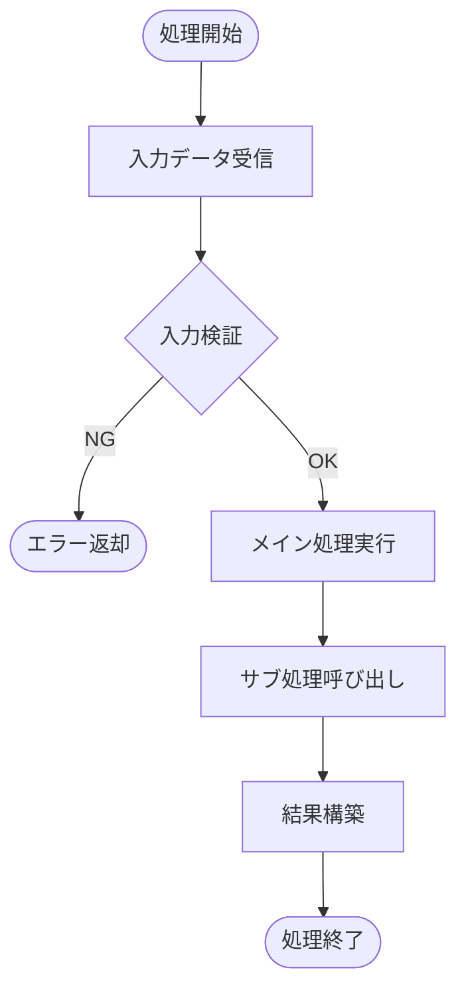

# APEX Class 設計書テンプレート（汎用）

目的: Apex クラスの設計書を作成するための汎用テンプレート。特定の種別に該当しない場合や、種別が判定できない場合に使用する。

---

## 種別別テンプレートの確認

**このテンプレートを使用する前に、以下の種別テンプレートが適切かどうか確認してください:**

| 種別 | テンプレート | 識別方法 |
|------|-------------|----------|
| REST API | `apex_rest_api.template.md` | `@RestResource` アノテーション |
| Batch | `apex_batch.template.md` | `Database.Batchable` インターフェース |
| Schedulable | `apex_schedulable.template.md` | `Schedulable` インターフェース |
| Controller | `apex_controller.template.md` | VF/LWC用コントローラ、`@AuraEnabled` |
| Handler | `apex_handler.template.md` | `*Handler`, `*TriggerHandler` 命名 |
| Utility | `apex_utility.template.md` | `*Utils`, `*Utility`, `*Helper` 命名 |
| Invocable | `apex_invocable.template.md` | `@InvocableMethod` アノテーション |
| Test | `apex_test.template.md` | `@IsTest` アノテーション |

上記に該当しない場合は、本テンプレート（汎用）を使用してください。

---

## メタ
```yaml
title: <short title>
feature_name: <FEATURE_NAME>
module: apex
apex_type: general
source_path: force-app/main/default/classes/<ClassName>.cls
generated_at: <ISO8601>
```

---

## 目次
1. [概要](#1-概要)
2. [関連項目・関連プログラム・フロー](#2-関連項目関連プログラムフロー)
3. [処理フロー](#3-処理フロー)
4. [API/メソッド一覧](#4-apiメソッド一覧)
5. [メソッド詳細](#5-メソッド詳細)
6. [内部設計](#6-内部設計)
7. [権限とセキュリティ](#7-権限とセキュリティ)
8. [単体テスト](#8-単体テスト)
9. [リリース手順](#9-リリース手順)
10. [備考/注意事項](#10-備考注意事項)
11. [変更仕様マトリクス](#11-変更仕様マトリクス)
12. [改訂履歴](#12-改訂履歴)

---

## 1. 概要
- 目的/スコープ/非スコープ

## 2. 関連項目・関連プログラム・フロー
- 関連オブジェクト: (例) ServiceGuide__c, MoveIn__c
- 関連 Apex クラス: `RecordModificationTrackHandler`, `WaterBureauService` (例)
- 関連トリガ: `SetIncentiveTrigger` (path: force-app/main/default/triggers/SetIncentiveTrigger.trigger)
- 関連フロー/Queueable: `formAutoSubmitQueue` 等

---

## 3. 処理フロー

本クラスの主要な処理フローを Mermaid 図で示す。図中の各ノードは、メソッド詳細セクションへのアンカーリンクを持つ。



### フローチャート作成ルール
- **必須**: 複雑なビジネスロジックを含む場合は図を必須とし、図中ノードは個別メソッドのアンカーへリンクすること
- **重要**: ノードラベル内に Markdown リンクを入れず、また HTML タグ（`<br/>` 含む）を使用しないこと。改行は `\\n` を使うこと
- 安全な実装方法:
  - `click` 指令でノードにアンカーを紐付ける（推奨）。例: `click S_calc "#calculate-incentive" "詳細を見る"`
  - ノード内改行は `\\n` を用いる。例: `S_map[結果マップ作成\\n詳細は下部参照]`
  - ノード内に Markdown リンクを直接記述しないこと
- **表記ルール**: 図中のオブジェクト名・項目名は表示ラベルで表記し、必要に応じ API 名を括弧併記すること
- **オブジェクト定義参照**: 設計書作成時は `doc/object/` の定義を参照し、必要情報が無ければオブジェクト定義書の更新を提案してください

---

## 4. API/メソッド一覧
- public static メソッド一覧（引数/戻り値/説明/例外）

## 5. メソッド詳細
各メソッドについて下記フォーマットで記載すること。
- メソッド名: <methodName>
  - シグネチャ: (public/protected/private) static? returnType methodName(params)
  - 概要: 何をするか
  - 入力: 各パラメータの説明
  - 出力: 戻り値の説明
  - 例外: 投げる例外と条件
  - バルク設計: 単体・バルク対応の説明
  - 副作用: DML/外部呼出し/静的キャッシュなど

### 5.1 個別処理（ステップ詳細）記述ルール
- 見出し（タイトル）は日本語で記載すること。
- Mermaid など他図表から参照する場合に備え、半角英数・ハイフンの英小文字スラッグをアンカー名として併記すること。
  - 例: `### インセンティブ計算処理 (anchor: calculate-incentive)` または 見出し直下に `Anchor: calculate-incentive`
- 各ステップは 入力/出力/前提/アルゴリズム/エラー/権限 を網羅すること。
 - 表記ルール: 本節内で記載するオブジェクト名・項目名は表示ラベルを原則とし、必要に応じ API 名を括弧で併記すること。

## 6. 内部設計
- 主要アルゴリズム、キャッシュ戦略、bulk 対応、ガバナ対応

## 7. 権限とセキュリティ
- 必要な CRUD/FLS/Sharing の説明

## 8. 単体テスト
- 必須テストケース（正常系、境界、エラー系、バルク）

### プログラム仕様チェックリスト（実施すべきテスト一覧）
- テストデータ: 必要な参照レコード(Service, MoveIn, IncentiveUnitPrice など)が揃っている
- 正常系呼び出し: 期待通りの DML が行われるか（INSERT/UPDATE の確認）
- 例外系: 無効パラメータで期待通り例外が発生するか
- バルク処理: 200 レコードなどのバルクでガバナ違反が発生しないか
- キャッシュ/静的値: 同一トランザクションで期待通り再利用されるか
- 外部依存: Apex コールアウト等はモックで期待通り動作するか
- 権限検証: CRUD/FLS による失敗ケースを再現
- ログと監査: 監査ログ/Platform Event 等の出力が正しいか
- パフォーマンス: 重い処理でタイムアウトや CPU 制限が出ないか

### バグチェック（プログラム観点での必須アサーション）
- 各メソッド/ユースケースに対して、以下を明記して自動テストで検証できるようにする。
  - 前提データ: どのオブジェクト/フィールドにどの値を入れてテストするか
  - 実行操作: どのメソッドを呼び出すか、またはどの DML を行うか
  - 期待アサーション: SOQL によるフィールド値検証（例: SELECT Amount__c FROM ServiceGuide__c WHERE Id = :id → Amount__c == 10000）
  - エラー系アサーション: addError 発生で DML がロールバックされること、例外タイプとメッセージの確認
  - バルクアサーション: 複数レコード実行後の集計・件数・NULL チェックなど（例: [SELECT COUNT() FROM ServiceGuide__c WHERE Amount__c = NULL] == 0）

## 9. リリース手順
- Lint/Deploy/テスト手順

## 10. 備考/注意事項
- 全ての SOQL はバルク対応を検証すること
- System.debug は本番で過度に残さない

---

## 11. 変更仕様マトリクス
| 発生場所 | 発火タイミング/条件 | 方式 | 対象オブジェクト | 対象条件(SOQL/疑似式) | 対象項目 | 変更内容 | 権限 | 例外処理 | ログ |
|---|---|---|---|---|---|---|---|---|---|

## 12. 改訂履歴
| バージョン | 日付 | セクション | 追加機能 | ヒアリング（相手/根拠） | 変更者 | 備考 |
|---|---|---|---|---|---|---|
| 0.1 | YYYY-MM-DD | 概要 | 初版 | Yes(<stakeholder>/meeting) | <author> | - |
