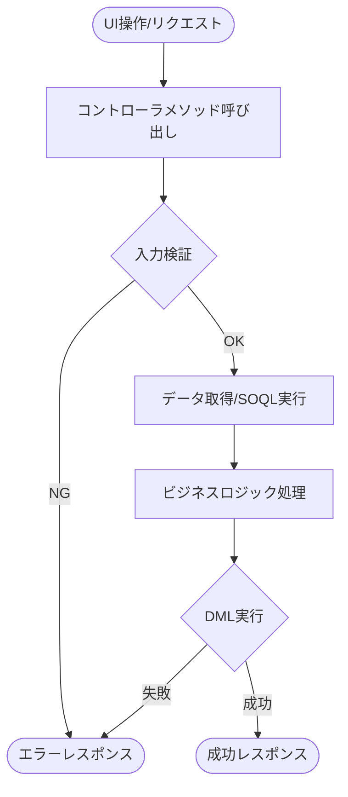

# APEX Controller 設計書テンプレート

目的: Apex コントローラの設計書を作成するためのテンプレート。VF/LWC との連携、@AuraEnabled メソッド、状態管理を明記する。

---

## メタ
```yaml
title: <short title>
feature_name: <FEATURE_NAME>
module: apex
apex_type: controller
source_path: force-app/main/default/classes/<ClassName>.cls
generated_at: <ISO8601>
```

---

## 目次
1. [概要](#1-概要)
2. [コントローラ仕様](#2-コントローラ仕様)
3. [関連UI/コンポーネント](#3-関連uiコンポーネント)
4. [処理フロー](#4-処理フロー)
5. [公開メソッド一覧](#5-公開メソッド一覧)
6. [メソッド詳細](#6-メソッド詳細)
7. [データアクセス](#7-データアクセス)
8. [エラーハンドリング](#8-エラーハンドリング)
9. [権限とセキュリティ](#9-権限とセキュリティ)
10. [単体テスト](#10-単体テスト)
11. [変更仕様マトリクス](#11-変更仕様マトリクス)
12. [改訂履歴](#12-改訂履歴)

---

## 1. 概要

### 目的
<!-- コントローラの目的・提供する機能を記載 -->

### コントローラ種別
- [ ] Visualforce 標準コントローラ拡張
- [ ] Visualforce カスタムコントローラ
- [ ] LWC / Aura コントローラ
- [ ] Queueable / 非同期コントローラ

### 対象オブジェクト
- **オブジェクト名（API名）**
  - 参照: `doc/objects/オブジェクト名.md`

---

## 2. コントローラ仕様

| 項目 | 値 |
|------|-----|
| クラス名 | ControllerClassName |
| sharing設定 | with sharing / without sharing / inherited sharing |
| テストクラス | ControllerClassNameTest |

### クラスアノテーション
```apex
public with sharing class ControllerClassName {
    // @AuraEnabled メソッドを含む
}
```

---

## 3. 関連UI/コンポーネント

| コンポーネント名 | 種別 | パス | 説明 |
|----------------|------|------|------|
| componentName | LWC | force-app/main/default/lwc/componentName/ | メインコンポーネント |
| PageName | VF | force-app/main/default/pages/PageName.page | VFページ |

---

## 4. 処理フロー

コントローラの主要な処理フローを Mermaid 図で示す。



### フローチャート作成ルール
- **必須**: 各公開メソッドの処理フローを図示すること
- `click` 指令でノードにアンカーを紐付ける（推奨）
- ノード内改行は `\\n` を使用
- 図中のオブジェクト名・項目名は表示ラベルで表記

---

## 5. 公開メソッド一覧

| メソッド名 | アノテーション | 戻り値 | 説明 |
|-----------|---------------|--------|------|
| getRecords | @AuraEnabled(cacheable=true) | List<SObject> | レコード取得 |
| saveRecord | @AuraEnabled | Id | レコード保存 |
| deleteRecord | @AuraEnabled | void | レコード削除 |

---

## 6. メソッド詳細

### 6.1 getRecords (anchor: get-records)

**シグネチャ:**
```apex
@AuraEnabled(cacheable=true)
public static List<Object__c> getRecords(String filterParam)
```

**入力データ:**
| パラメータ | 型 | 必須 | 説明 |
|-----------|-----|------|------|
| filterParam | String | No | 絞り込み条件 |

**出力データ:**
- List<Object__c>: 取得したレコードリスト

**前提条件:**
- ユーザーが対象オブジェクトの参照権限を持つこと

**主要アルゴリズム:**
1. パラメータ検証
2. SOQL クエリ構築
3. WITH SECURITY_ENFORCED でレコード取得
4. 結果返却

**エラーとリカバリ:**
- 権限不足時は AuraHandledException をスロー

### 6.2 saveRecord (anchor: save-record)

**シグネチャ:**
```apex
@AuraEnabled
public static Id saveRecord(Object__c record)
```

**入力データ:**
| パラメータ | 型 | 必須 | 説明 |
|-----------|-----|------|------|
| record | Object__c | Yes | 保存対象レコード |

**出力データ:**
- Id: 保存されたレコードの Id

**前提条件:**
- ユーザーが対象オブジェクトの作成/更新権限を持つこと

**主要アルゴリズム:**
1. 入力検証
2. FLS チェック
3. upsert 実行
4. Id 返却

**エラーとリカバリ:**
- 検証エラー: AuraHandledException で詳細メッセージ
- DML エラー: ロールバック、エラー通知

---

## 7. データアクセス

### SOQL パターン
```apex
// cacheable メソッドでの安全なクエリ
[SELECT Id, Name, Field__c
 FROM Object__c
 WHERE Condition__c = :param
 WITH SECURITY_ENFORCED
 LIMIT 200]
```

### DML パターン
```apex
// FLS チェック付き DML
if (Schema.sObjectType.Object__c.isCreateable()) {
    insert record;
}
```

---

## 8. エラーハンドリング

### LWC/Aura 向けエラー処理
```apex
@AuraEnabled
public static void methodName() {
    try {
        // 処理
    } catch (DmlException e) {
        throw new AuraHandledException('保存に失敗しました: ' + e.getMessage());
    } catch (Exception e) {
        throw new AuraHandledException('予期しないエラーが発生しました');
    }
}
```

### エラーコード体系
| エラーコード | 説明 | UI表示メッセージ |
|-------------|------|-----------------|
| ERR_001 | 必須項目未入力 | 必須項目を入力してください |
| ERR_002 | 権限不足 | この操作を行う権限がありません |
| ERR_003 | データ不整合 | データが不整合です。再度お試しください |

---

## 9. 権限とセキュリティ

### sharing 設定
| 設定 | 適用理由 |
|------|---------|
| with sharing | ユーザーの共有設定を尊重 |

### CRUD/FLS 確認
```apex
// オブジェクト権限チェック
Schema.sObjectType.Object__c.isAccessible()
Schema.sObjectType.Object__c.isCreateable()
Schema.sObjectType.Object__c.isUpdateable()
Schema.sObjectType.Object__c.isDeletable()

// 項目権限チェック
Schema.sObjectType.Object__c.fields.Field__c.isAccessible()
Schema.sObjectType.Object__c.fields.Field__c.isUpdateable()
```

---

## 10. 単体テスト

### 正常系
- レコード取得が成功すること
- レコード保存が成功すること
- キャッシュ可能メソッドが正しく動作すること

### 異常系
- 不正パラメータで適切なエラーが返ること
- 権限不足で AuraHandledException がスローされること

### セキュリティ
- FLS 違反時に適切にブロックされること
- sharing 設定が正しく適用されること

```apex
@IsTest
static void testGetRecords() {
    // テストデータ作成
    Object__c testRecord = new Object__c(Name = 'Test');
    insert testRecord;

    Test.startTest();
    List<Object__c> results = ControllerClassName.getRecords(null);
    Test.stopTest();

    System.assertEquals(1, results.size());
}
```

---

## 11. 変更仕様マトリクス

| 発生場所(Where) | 発火タイミング/条件(When/If) | 方式 | 対象オブジェクト | 対象レコード特定条件 | 対象項目(Label/API/型) | 変更内容(Before→After/算出式) | 権限要件 | 例外時動作/リトライ | ログ/監査 | 備考 |
|---|---|---|---|---|---|---|---|---|---|---|

---

## 12. 改訂履歴

| バージョン | 日付 | セクション | 追加機能 | 変更者 | 備考 |
|---|---|---|---|---|---|
| 0.1 | YYYY-MM-DD | 全体 | 初版作成 | Author | - |

---

## 関連プログラム
- Controller: [ControllerClassName.cls](../../force-app/main/default/classes/ControllerClassName.cls) | 仕様書: 本書
- LWC: [componentName](../../force-app/main/default/lwc/componentName/) | 仕様書: xxx.md
- Test: [ControllerClassNameTest.cls](../../force-app/main/default/classes/ControllerClassNameTest.cls) | 仕様書なし

## 参考リンク
- 参照: doc/objects/関連オブジェクト.md
- 参照: doc/lwc/component-name.md
