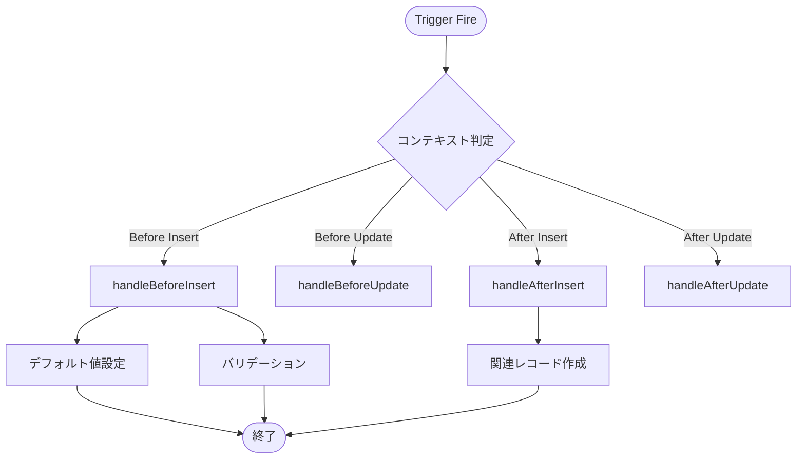

# APEX Handler 設計書テンプレート

目的: Apex トリガーハンドラの設計書を作成するためのテンプレート。トリガーコンテキスト、DML操作、バルク処理を明記する。

---

## メタ
```yaml
title: <short title>
feature_name: <FEATURE_NAME>
module: apex
apex_type: handler
source_path: force-app/main/default/classes/<ClassName>.cls
generated_at: <ISO8601>
```

---

## 目次
1. [概要](#1-概要)
2. [ハンドラ仕様](#2-ハンドラ仕様)
3. [対応トリガーコンテキスト](#3-対応トリガーコンテキスト)
4. [処理フロー](#4-処理フロー)
5. [メソッド詳細](#5-メソッド詳細)
6. [バルク & ガバナ設計](#6-バルク--ガバナ設計)
7. [エラーハンドリング](#7-エラーハンドリング)
8. [単体テスト](#8-単体テスト)
9. [変更仕様マトリクス](#9-変更仕様マトリクス)
10. [改訂履歴](#10-改訂履歴)

---

## 1. 概要

### 目的
<!-- ハンドラの目的・処理内容を記載 -->

### 対象オブジェクト
- **オブジェクト名（API名）**
  - 参照: `doc/objects/オブジェクト名.md`

### 主なビジネスルール
<!-- 主要なビジネスルールを箇条書きで記載 -->

---

## 2. ハンドラ仕様

| 項目 | 値 |
|------|-----|
| クラス名 | ObjectNameTriggerHandler |
| 対応トリガー | ObjectNameTrigger |
| sharing設定 | without sharing（トリガーコンテキスト） |
| テストクラス | ObjectNameTriggerHandlerTest |

### 呼び出し元トリガー
```apex
trigger ObjectNameTrigger on Object__c (before insert, before update, after insert, after update) {
    ObjectNameTriggerHandler handler = new ObjectNameTriggerHandler();
    if (Trigger.isBefore) {
        if (Trigger.isInsert) handler.handleBeforeInsert(Trigger.new);
        if (Trigger.isUpdate) handler.handleBeforeUpdate(Trigger.new, Trigger.oldMap);
    }
    if (Trigger.isAfter) {
        if (Trigger.isInsert) handler.handleAfterInsert(Trigger.new);
        if (Trigger.isUpdate) handler.handleAfterUpdate(Trigger.new, Trigger.oldMap);
    }
}
```

---

## 3. 対応トリガーコンテキスト

| コンテキスト | 対応 | メソッド | 処理内容 |
|-------------|------|---------|---------|
| Before Insert | ✅ | handleBeforeInsert | 初期値設定、バリデーション |
| Before Update | ✅ | handleBeforeUpdate | 値変更、バリデーション |
| Before Delete | ❌ | - | - |
| After Insert | ✅ | handleAfterInsert | 関連レコード作成 |
| After Update | ✅ | handleAfterUpdate | 関連レコード更新 |
| After Delete | ❌ | - | - |
| After Undelete | ❌ | - | - |

---

## 4. 処理フロー



---

## 5. メソッド詳細

### 5.1 handleBeforeInsert (anchor: handle-before-insert)

**シグネチャ:**
```apex
public void handleBeforeInsert(List<Object__c> newList)
```

**入力データ:**
- newList: Trigger.new（新規レコードリスト）

**出力データ:**
- なし（Trigger.new への直接更新）

**前提条件:**
- Before Insert コンテキスト

**主要アルゴリズム:**
1. レコードループ
2. デフォルト値設定
3. バリデーション実行
4. addError でエラー追加（バリデーション失敗時）

**エラーとリカバリ:**
- バリデーションエラー: record.addError() で保存ブロック

### 5.2 handleBeforeUpdate (anchor: handle-before-update)

**シグネチャ:**
```apex
public void handleBeforeUpdate(List<Object__c> newList, Map<Id, Object__c> oldMap)
```

**入力データ:**
- newList: Trigger.new
- oldMap: Trigger.oldMap

**出力データ:**
- なし（Trigger.new への直接更新）

**前提条件:**
- Before Update コンテキスト

**主要アルゴリズム:**
1. 変更検知（oldMap との比較）
2. 条件付き処理実行
3. 関連項目の再計算

### 5.3 handleAfterInsert (anchor: handle-after-insert)

**シグネチャ:**
```apex
public void handleAfterInsert(List<Object__c> newList)
```

**入力データ:**
- newList: Trigger.new（Id が確定済み）

**出力データ:**
- なし（別オブジェクトへの DML）

**前提条件:**
- After Insert コンテキスト
- レコード Id が確定済み

**主要アルゴリズム:**
1. 関連レコードの一括取得
2. 処理対象の抽出
3. 新規関連レコードの作成
4. バルク DML 実行

### 5.4 handleAfterUpdate (anchor: handle-after-update)

**シグネチャ:**
```apex
public void handleAfterUpdate(List<Object__c> newList, Map<Id, Object__c> oldMap)
```

**入力データ:**
- newList: Trigger.new
- oldMap: Trigger.oldMap

**出力データ:**
- なし（別オブジェクトへの DML）

**前提条件:**
- After Update コンテキスト

**主要アルゴリズム:**
1. 変更検知
2. 関連レコードの一括取得
3. 関連レコードの更新
4. バルク DML 実行

---

## 6. バルク & ガバナ設計

### SOQL 最適化
```apex
// NG: ループ内 SOQL
for (Object__c rec : newList) {
    Related__c rel = [SELECT Id FROM Related__c WHERE Parent__c = :rec.Id];
}

// OK: バルク SOQL
Map<Id, Related__c> relatedMap = new Map<Id, Related__c>([
    SELECT Id, Parent__c FROM Related__c WHERE Parent__c IN :parentIds
]);
```

### DML 最適化
```apex
// NG: ループ内 DML
for (Object__c rec : newList) {
    insert new Related__c(Parent__c = rec.Id);
}

// OK: バルク DML
List<Related__c> toInsert = new List<Related__c>();
for (Object__c rec : newList) {
    toInsert.add(new Related__c(Parent__c = rec.Id));
}
insert toInsert;
```

### ガバナ制限対策
| 制限項目 | 上限 | 対策 |
|---------|------|------|
| SOQL | 100回 | Map活用、バルク化 |
| DML | 150回 | リスト一括処理 |
| DML行数 | 10,000 | バッチ検討 |

---

## 7. エラーハンドリング

### Before トリガーでのエラー
```apex
// レコード単位エラー
record.addError('エラーメッセージ');

// 項目単位エラー
record.Field__c.addError('項目エラーメッセージ');
```

### After トリガーでのエラー
```apex
// DML エラーハンドリング
Database.SaveResult[] results = Database.update(records, false);
for (Database.SaveResult sr : results) {
    if (!sr.isSuccess()) {
        for (Database.Error err : sr.getErrors()) {
            System.debug('Error: ' + err.getMessage());
        }
    }
}
```

---

## 8. 単体テスト

### 正常系
- Insert トリガーで期待通りの処理が実行されること
- Update トリガーで変更検知が正しく動作すること
- 関連レコードが正しく作成/更新されること

### 異常系
- バリデーションエラー時に保存がブロックされること
- addError メッセージが正しく設定されること

### バルク
- 200件一括処理でガバナ制限に違反しないこと
- 全レコードに処理が適用されること

```apex
@IsTest
static void testBulkInsert() {
    List<Object__c> records = new List<Object__c>();
    for (Integer i = 0; i < 200; i++) {
        records.add(new Object__c(Name = 'Test ' + i));
    }

    Test.startTest();
    insert records;
    Test.stopTest();

    // アサーション
    List<Related__c> related = [SELECT Id FROM Related__c];
    System.assertEquals(200, related.size());
}
```

---

## 9. 変更仕様マトリクス

| 発生場所(Where) | 発火タイミング/条件(When/If) | 方式 | 対象オブジェクト | 対象レコード特定条件 | 対象項目(Label/API/型) | 変更内容(Before→After/算出式) | 権限要件 | 例外時動作/リトライ | ログ/監査 | 備考 |
|---|---|---|---|---|---|---|---|---|---|---|

---

## 10. 改訂履歴

| バージョン | 日付 | セクション | 追加機能 | 変更者 | 備考 |
|---|---|---|---|---|---|
| 0.1 | YYYY-MM-DD | 全体 | 初版作成 | Author | - |

---

## 関連プログラム
- Handler: [ObjectNameTriggerHandler.cls](../../force-app/main/default/classes/ObjectNameTriggerHandler.cls) | 仕様書: 本書
- Trigger: [ObjectNameTrigger.trigger](../../force-app/main/default/triggers/ObjectNameTrigger.trigger) | 仕様書: xxx.md
- Test: [ObjectNameTriggerHandlerTest.cls](../../force-app/main/default/classes/ObjectNameTriggerHandlerTest.cls) | 仕様書なし

## 参考リンク
- 参照: doc/objects/Object__c.md
- 参照: doc/trigger/object-name-trigger.md
