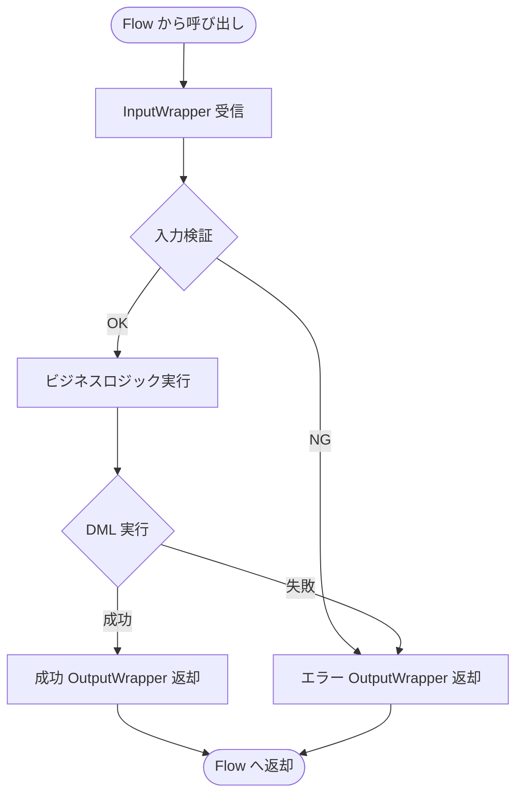

# APEX Invocable 設計書テンプレート

目的: Apex Invocable アクションの設計書を作成するためのテンプレート。Flow/ProcessBuilder からの呼び出し、入出力変数を明記する。

---

## メタ
```yaml
title: <short title>
feature_name: <FEATURE_NAME>
module: apex
apex_type: invocable
source_path: force-app/main/default/classes/<ClassName>.cls
generated_at: <ISO8601>
```

---

## 目次
1. [概要](#1-概要)
2. [Invocable 仕様](#2-invocable-仕様)
3. [入出力変数](#3-入出力変数)
4. [処理フロー](#4-処理フロー)
5. [メソッド詳細](#5-メソッド詳細)
6. [エラーハンドリング](#6-エラーハンドリング)
7. [使用箇所](#7-使用箇所)
8. [単体テスト](#8-単体テスト)
9. [変更仕様マトリクス](#9-変更仕様マトリクス)
10. [改訂履歴](#10-改訂履歴)

---

## 1. 概要

### 目的
<!-- Invocable アクションの目的・処理内容を記載 -->

### 対象オブジェクト
- **オブジェクト名（API名）**
  - 参照: `doc/objects/オブジェクト名.md`

### 主なビジネスルール
<!-- 主要なビジネスルールを箇条書きで記載 -->

---

## 2. Invocable 仕様

| 項目 | 値 |
|------|-----|
| クラス名 | InvocableClassName |
| アクション表示名 | アクション名（Flow で表示） |
| アクション説明 | アクションの説明文 |
| バルク対応 | Yes |

### メソッドシグネチャ
```apex
public class InvocableClassName {
    @InvocableMethod(
        label='アクション名'
        description='アクションの説明'
        category='カテゴリ名'
    )
    public static List<OutputWrapper> execute(List<InputWrapper> inputs) {
        // 処理
    }
}
```

---

## 3. 入出力変数

### 入力変数（InputWrapper）
```apex
public class InputWrapper {
    @InvocableVariable(label='レコードID' required=true)
    public Id recordId;

    @InvocableVariable(label='オプション値' required=false)
    public String optionValue;
}
```

| 変数名 | ラベル | 型 | 必須 | 説明 |
|--------|--------|-----|------|------|
| recordId | レコードID | Id | Yes | 処理対象のレコードID |
| optionValue | オプション値 | String | No | オプションパラメータ |

### 出力変数（OutputWrapper）
```apex
public class OutputWrapper {
    @InvocableVariable(label='成功フラグ')
    public Boolean isSuccess;

    @InvocableVariable(label='エラーメッセージ')
    public String errorMessage;

    @InvocableVariable(label='処理結果ID')
    public Id resultId;
}
```

| 変数名 | ラベル | 型 | 説明 |
|--------|--------|-----|------|
| isSuccess | 成功フラグ | Boolean | 処理成功/失敗 |
| errorMessage | エラーメッセージ | String | エラー時のメッセージ |
| resultId | 処理結果ID | Id | 作成/更新されたレコードID |

---

## 4. 処理フロー



---

## 5. メソッド詳細

### 5.1 execute メソッド (anchor: execute-method)

**シグネチャ:**
```apex
@InvocableMethod(label='アクション名' description='説明')
public static List<OutputWrapper> execute(List<InputWrapper> inputs)
```

**入力データ:**
- inputs: Flow からの入力リスト（バルク対応）

**出力データ:**
- List<OutputWrapper>: 各入力に対応する出力リスト

**前提条件:**
- Flow/Process Builder からの呼び出し

**主要アルゴリズム:**
1. 入力リストのループ処理（バルク対応）
2. 各入力に対してビジネスロジック実行
3. 結果を OutputWrapper に格納
4. 出力リストを返却

### 5.2 入力検証 (anchor: input-validation)

**入力データ:**
- InputWrapper

**出力データ:**
- Boolean: 検証結果

**主要アルゴリズム:**
1. 必須項目の null チェック
2. 値の妥当性検証
3. 関連レコードの存在確認

### 5.3 ビジネスロジック (anchor: business-logic)

**入力データ:**
- 検証済み InputWrapper

**出力データ:**
- 処理結果

**主要アルゴリズム:**
1. 関連データ取得
2. 計算/変換処理
3. DML 実行（必要時）
4. 結果構築

---

## 6. エラーハンドリング

### エラー返却パターン
```apex
try {
    // 処理
    output.isSuccess = true;
    output.resultId = record.Id;
} catch (DmlException e) {
    output.isSuccess = false;
    output.errorMessage = 'データ保存に失敗しました: ' + e.getMessage();
} catch (Exception e) {
    output.isSuccess = false;
    output.errorMessage = '予期しないエラーが発生しました';
}
```

### Flow でのエラーハンドリング
- Flow 側で `isSuccess` を判定
- false の場合は `errorMessage` をユーザーに表示
- Fault Path での処理を推奨

---

## 7. 使用箇所

### 呼び出し元 Flow/Process
| 名前 | 種別 | 呼び出しタイミング |
|------|------|-------------------|
| AccountProcess | Record-Triggered Flow | Account 作成時 |
| ManualAction | Screen Flow | ユーザー操作時 |

### Flow での設定例
1. Flow Builder でアクションを追加
2. 「Apex アクション」から対象を選択
3. 入力変数をマッピング
4. 出力変数を取得して後続処理に使用

---

## 8. 単体テスト

### 正常系
- 有効な入力で期待通りの結果が返ること
- バルク入力で全件処理されること

### 異常系
- 必須項目欠落で isSuccess=false となること
- DML エラー時に適切なエラーメッセージが返ること

### バルク
- 200件入力で正常動作すること

```apex
@IsTest
static void testInvocableSuccess() {
    // テストデータ作成
    Account acc = new Account(Name = 'Test');
    insert acc;

    // 入力準備
    InvocableClassName.InputWrapper input = new InvocableClassName.InputWrapper();
    input.recordId = acc.Id;

    Test.startTest();
    List<InvocableClassName.OutputWrapper> results =
        InvocableClassName.execute(new List<InvocableClassName.InputWrapper>{input});
    Test.stopTest();

    System.assertEquals(true, results[0].isSuccess);
}

@IsTest
static void testInvocableError() {
    // 無効な入力
    InvocableClassName.InputWrapper input = new InvocableClassName.InputWrapper();
    input.recordId = null; // 必須項目を null

    Test.startTest();
    List<InvocableClassName.OutputWrapper> results =
        InvocableClassName.execute(new List<InvocableClassName.InputWrapper>{input});
    Test.stopTest();

    System.assertEquals(false, results[0].isSuccess);
    System.assertNotEquals(null, results[0].errorMessage);
}
```

---

## 9. 変更仕様マトリクス

| 発生場所(Where) | 発火タイミング/条件(When/If) | 方式 | 対象オブジェクト | 対象レコード特定条件 | 対象項目(Label/API/型) | 変更内容(Before→After/算出式) | 権限要件 | 例外時動作/リトライ | ログ/監査 | 備考 |
|---|---|---|---|---|---|---|---|---|---|---|

---

## 10. 改訂履歴

| バージョン | 日付 | セクション | 追加機能 | 変更者 | 備考 |
|---|---|---|---|---|---|
| 0.1 | YYYY-MM-DD | 全体 | 初版作成 | Author | - |

---

## 関連プログラム
- Invocable: [InvocableClassName.cls](../../force-app/main/default/classes/InvocableClassName.cls) | 仕様書: 本書
- Flow: [FlowName](../../force-app/main/default/flows/FlowName.flow-meta.xml) | 仕様書: xxx.md
- Test: [InvocableClassNameTest.cls](../../force-app/main/default/classes/InvocableClassNameTest.cls) | 仕様書なし

## 参考リンク
- 参照: doc/objects/関連オブジェクト.md
- 参照: doc/flow/flow-name.md
