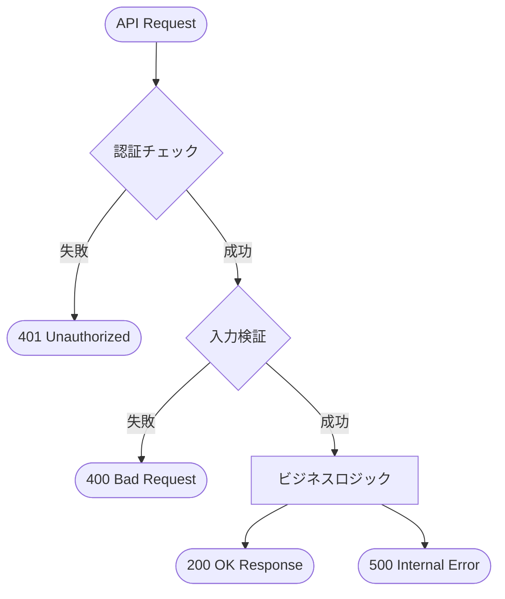

# APEX REST API 設計書テンプレート

目的: Apex REST API サービスの設計書を作成するためのテンプレート。エンドポイント、HTTPメソッド、リクエスト/レスポンス形式、認証を明記する。

---

## メタ
```yaml
title: <short title>
feature_name: <FEATURE_NAME>
module: apex
apex_type: rest-api
source_path: force-app/main/default/classes/<ClassName>.cls
generated_at: <ISO8601>
```

---

## 目次
1. [概要](#1-概要)
2. [エンドポイント定義](#2-エンドポイント定義)
3. [リクエスト/レスポンス仕様](#3-リクエストレスポンス仕様)
4. [認証・認可](#4-認証認可)
5. [処理フロー](#5-処理フロー)
6. [メソッド詳細](#6-メソッド詳細)
7. [エラーハンドリング](#7-エラーハンドリング)
8. [バルク & ガバナ設計](#8-バルク--ガバナ設計)
9. [単体テスト](#9-単体テスト)
10. [変更仕様マトリクス](#10-変更仕様マトリクス)
11. [改訂履歴](#11-改訂履歴)

---

## 1. 概要

### 目的
<!-- REST API の目的・提供する機能を記載 -->

### 対象オブジェクト
- **オブジェクト名（API名）**
  - 参照: `doc/objects/オブジェクト名.md`

### 主なビジネスルール
<!-- 主要なビジネスルールを箇条書きで記載 -->

---

## 2. エンドポイント定義

| 項目 | 値 |
|------|-----|
| URL Pattern | `/services/apexrest/<endpoint>` |
| HTTP Methods | GET / POST / PUT / DELETE / PATCH |
| Content-Type | application/json |
| API Version | v1 |

### URLパラメータ
| パラメータ | 型 | 必須 | 説明 |
|-----------|-----|------|------|
| param1 | String | Yes | パラメータ説明 |

---

## 3. リクエスト/レスポンス仕様

### リクエストボディ (POST/PUT/PATCH)
```json
{
  "field1": "string",
  "field2": 123
}
```

| フィールド | 型 | 必須 | 説明 |
|-----------|-----|------|------|
| field1 | String | Yes | フィールド説明 |
| field2 | Integer | No | フィールド説明 |

### レスポンスボディ (成功時)
```json
{
  "success": true,
  "data": {},
  "message": "処理が完了しました"
}
```

### レスポンスボディ (エラー時)
```json
{
  "success": false,
  "errorCode": "ERROR_001",
  "message": "エラーメッセージ"
}
```

---

## 4. 認証・認可

| 項目 | 内容 |
|------|------|
| 認証方式 | OAuth 2.0 / Session ID |
| 必要な権限 | ConnectedApp / API有効 |
| プロファイル/権限セット | 要件を記載 |
| ゲストユーザー | 許可/不許可 |

---

## 5. 処理フロー



---

## 6. メソッド詳細

### 6.1 入力検証処理 (anchor: input-validation)

**入力データ:**
- RestRequest パラメータ

**出力データ:**
- 検証済みパラメータ

**前提条件:**
- 認証済みコンテキスト

**主要アルゴリズム:**
1. 必須パラメータチェック
2. 型・形式検証
3. ビジネスルール検証

**エラーとリカバリ:**
- 検証エラー時は 400 Bad Request を返却

### 6.2 ビジネスロジック (anchor: business-logic)

**入力データ:**
- 検証済みパラメータ

**出力データ:**
- 処理結果

**前提条件:**
- 入力検証完了

**主要アルゴリズム:**
1. データ取得
2. ビジネスロジック実行
3. DML 操作（必要時）
4. レスポンス構築

**エラーとリカバリ:**
- DML エラー時は 500 Internal Server Error
- トランザクションロールバック

---

## 7. エラーハンドリング

| HTTPステータス | エラーコード | 説明 | 対処方法 |
|---------------|-------------|------|----------|
| 400 | INVALID_PARAM | 不正なパラメータ | パラメータ確認 |
| 401 | UNAUTHORIZED | 認証エラー | 認証情報確認 |
| 403 | FORBIDDEN | 権限不足 | 権限確認 |
| 404 | NOT_FOUND | リソース未存在 | ID確認 |
| 500 | INTERNAL_ERROR | サーバーエラー | 管理者連絡 |

---

## 8. バルク & ガバナ設計

- **SOQL**: 使用回数と最適化方針
- **DML**: 使用回数とバルク化方針
- **CPU制限**: 重い処理の考慮
- **ヒープサイズ**: 大量データ時の考慮
- **Callout**: 外部連携がある場合

---

## 9. 単体テスト

### 正常系
- 有効なパラメータでの正常レスポンス確認
- 各HTTPメソッドの動作確認

### 異常系
- 不正パラメータでの400エラー確認
- 認証エラーでの401確認
- 権限不足での403確認
- 存在しないリソースでの404確認

### バルク
- 大量データでのガバナ制限確認

### モック
- HttpCalloutMock 使用（外部連携がある場合）

---

## 10. 変更仕様マトリクス

| 発生場所(Where) | 発火タイミング/条件(When/If) | 方式 | 対象オブジェクト | 対象レコード特定条件 | 対象項目(Label/API/型) | 変更内容(Before→After/算出式) | 権限要件 | 例外時動作/リトライ | ログ/監査 | 備考 |
|---|---|---|---|---|---|---|---|---|---|---|

---

## 11. 改訂履歴

| バージョン | 日付 | セクション | 追加機能 | 変更者 | 備考 |
|---|---|---|---|---|---|
| 0.1 | YYYY-MM-DD | 全体 | 初版作成 | Author | - |

---

## 関連プログラム
- Class: [ClassName.cls](../../force-app/main/default/classes/ClassName.cls) | 仕様書: 本書
- Test: [ClassNameTest.cls](../../force-app/main/default/classes/ClassNameTest.cls) | 仕様書なし

## 参考リンク
- 参照: doc/objects/関連オブジェクト.md
