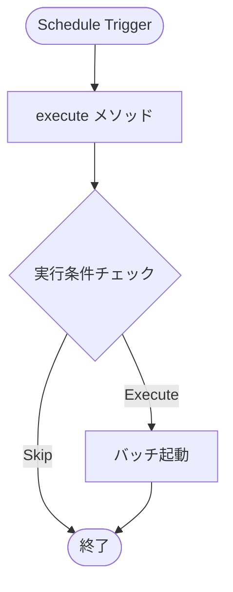

# APEX Schedulable 設計書テンプレート

目的: Apex スケジューラの設計書を作成するためのテンプレート。Cron式、実行タイミング、呼び出し対象を明記する。

---

## メタ
```yaml
title: <short title>
feature_name: <FEATURE_NAME>
module: apex
apex_type: schedulable
source_path: force-app/main/default/classes/<ClassName>.cls
generated_at: <ISO8601>
```

---

## 目次
1. [概要](#1-概要)
2. [スケジュール仕様](#2-スケジュール仕様)
3. [実行対象](#3-実行対象)
4. [処理フロー](#4-処理フロー)
5. [メソッド詳細](#5-メソッド詳細)
6. [エラーハンドリング](#6-エラーハンドリング)
7. [監視・運用](#7-監視運用)
8. [単体テスト](#8-単体テスト)
9. [変更仕様マトリクス](#9-変更仕様マトリクス)
10. [改訂履歴](#10-改訂履歴)

---

## 1. 概要

### 目的
<!-- スケジューラの目的・実行背景を記載 -->

### 呼び出し対象
- **バッチクラス**: BatchClassName
- **参照**: `doc/apex/batch-class-name.md`

### 主なビジネスルール
<!-- 主要なビジネスルールを箇条書きで記載 -->

---

## 2. スケジュール仕様

| 項目 | 値 |
|------|-----|
| クラス名 | ScheduleClassName |
| 実装インターフェース | Schedulable |
| ジョブ名 | Schedule_JobName |

### スケジュール設定

| 項目 | 値 | 説明 |
|------|-----|------|
| Cron式 | `0 0 3 * * ?` | 毎日 AM 3:00 |
| 実行頻度 | 日次 / 週次 / 月次 | 実行頻度 |
| タイムゾーン | Asia/Tokyo | 実行タイムゾーン |

### Cron式の構成
```
秒 分 時 日 月 曜日 [年]
0  0  3  *  *  ?
│  │  │  │  │  └─ 曜日（? = 指定なし）
│  │  │  │  └──── 月（* = 毎月）
│  │  │  └─────── 日（* = 毎日）
│  │  └────────── 時（3 = 3時）
│  └───────────── 分（0 = 0分）
└──────────────── 秒（0 = 0秒）
```

### スケジュール登録コマンド
```apex
// スケジュール登録
String jobId = System.schedule('Job Name', '0 0 3 * * ?', new ScheduleClassName());

// スケジュール解除
System.abortJob(jobId);
```

---

## 3. 実行対象

| 対象 | クラス名 | バッチサイズ | 説明 |
|------|---------|------------|------|
| バッチ1 | BatchClassName | 200 | メイン処理 |
| バッチ2 | BatchClassName2 | 100 | サブ処理（チェーン実行時） |

---

## 4. 処理フロー



---

## 5. メソッド詳細

### 5.1 execute メソッド (anchor: execute-method)

**入力データ:**
- SchedulableContext sc

**出力データ:**
- なし（バッチ起動）

**前提条件:**
- スケジュール時刻到達

**主要アルゴリズム:**
1. 実行条件チェック（必要時）
2. バッチインスタンス生成
3. Database.executeBatch 呼び出し

**エラーとリカバリ:**
- バッチ起動失敗時はログ出力

```apex
public void execute(SchedulableContext sc) {
    Database.executeBatch(new BatchClassName(), 200);
}
```

### 5.2 実行条件チェック (anchor: condition-check)

**入力データ:**
- カスタム設定 / カスタムメタデータ

**出力データ:**
- Boolean（実行可否）

**前提条件:**
- なし

**主要アルゴリズム:**
1. 実行フラグ確認
2. 営業日チェック（必要時）
3. 前回実行結果確認（必要時）

---

## 6. エラーハンドリング

| エラー種別 | 対処方法 | 通知 |
|-----------|---------|------|
| バッチ起動失敗 | ログ出力、リトライ | メール通知 |
| ガバナ制限 | ログ出力 | 管理者通知 |
| 設定エラー | 起動スキップ | ログのみ |

---

## 7. 監視・運用

### 監視項目
- Setup > Scheduled Jobs でジョブ状態確認
- AsyncApexJob でバッチ実行状況確認

### 運用手順

**スケジュール登録:**
```apex
// 開発者コンソール or Anonymous Apex
String jobId = System.schedule(
    'Daily Batch Job',
    '0 0 3 * * ?',
    new ScheduleClassName()
);
System.debug('Job ID: ' + jobId);
```

**スケジュール解除:**
```apex
// Job ID を指定して解除
System.abortJob('08e...');

// または名前で検索して解除
CronTrigger ct = [SELECT Id FROM CronTrigger WHERE CronJobDetail.Name = 'Daily Batch Job'];
System.abortJob(ct.Id);
```

**スケジュール一覧確認:**
```apex
List<CronTrigger> jobs = [
    SELECT Id, CronJobDetail.Name, NextFireTime, State
    FROM CronTrigger
    WHERE CronJobDetail.JobType = '7'
];
```

---

## 8. 単体テスト

### 正常系
- スケジューラが正常に実行されること
- バッチが起動されること

### 異常系
- 実行条件不成立時にスキップされること

```apex
@IsTest
static void testScheduler() {
    Test.startTest();
    String jobId = System.schedule(
        'Test Job',
        '0 0 3 * * ?',
        new ScheduleClassName()
    );
    Test.stopTest();

    CronTrigger ct = [SELECT Id, State FROM CronTrigger WHERE Id = :jobId];
    System.assertEquals('WAITING', ct.State);
}
```

---

## 9. 変更仕様マトリクス

| 発生場所(Where) | 発火タイミング/条件(When/If) | 方式 | 対象オブジェクト | 対象レコード特定条件 | 対象項目(Label/API/型) | 変更内容(Before→After/算出式) | 権限要件 | 例外時動作/リトライ | ログ/監査 | 備考 |
|---|---|---|---|---|---|---|---|---|---|---|
| Schedule[ClassName] | Cron式タイミング | Apex Schedulable | - | - | - | バッチ起動 | システム実行 | 失敗時ログ | 任意 | - |

---

## 10. 改訂履歴

| バージョン | 日付 | セクション | 追加機能 | 変更者 | 備考 |
|---|---|---|---|---|---|
| 0.1 | YYYY-MM-DD | 全体 | 初版作成 | Author | - |

---

## 関連プログラム
- Scheduler: [ScheduleClassName.cls](../../force-app/main/default/classes/ScheduleClassName.cls) | 仕様書: 本書
- Batch: [BatchClassName.cls](../../force-app/main/default/classes/BatchClassName.cls) | 仕様書: xxx.md
- Test: [ScheduleClassNameTest.cls](../../force-app/main/default/classes/ScheduleClassNameTest.cls) | 仕様書なし

## 参考リンク
- 参照: doc/apex/batch-class-name.md
