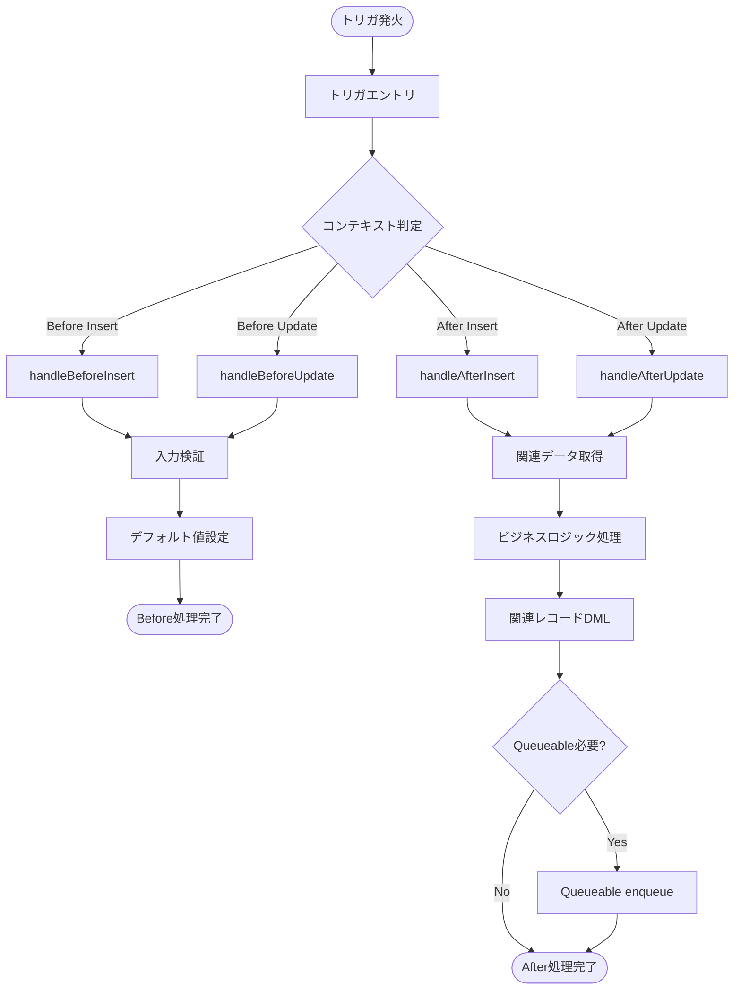

# APEX Trigger 設計書テンプレート

目的: トリガの責務、実行タイミング、bulk 設計、例外処理、関連クラスを明確にするテンプレート。

---

## メタ
- title: <short title>
- feature_name: <FEATURE_NAME>
- module: trigger
- source_path: force-app/main/default/triggers/<TriggerName>.trigger
- generated_at: <ISO8601>

---

## 目次
1. [概要](#1-概要)
2. [実行タイミングと条件](#2-実行タイミングと条件)
3. [関連クラスと責務](#3-関連クラスと責務)
4. [フロー（概略）](#4-フロー概略)
5. [個別処理（ステップ詳細）](#5-個別処理ステップ詳細)
6. [バルク & ガバナ設計](#6-バルク--ガバナ設計)
7. [エラーハンドリング](#7-エラーハンドリング)
8. [単体テストケース](#8-単体テストケース)
9. [既知の制約/注意点](#9-既知の制約注意点)
10. [変更仕様マトリクス](#10-変更仕様マトリクス)
11. [改訂履歴](#11-改訂履歴)

---

## 1. 概要
- トリガの説明、トリガが呼ぶハンドラ、主なビジネスルール

## 2. 実行タイミングと条件
- before insert / after insert / before update / after update / before delete / after delete のうち該当するタイミングを列挙
- 各タイミングでのフィルタ条件（例: isActive == true）

## 3. 関連クラスと責務
- ハンドラ: `SetIncentiveTriggerHandler`（path: force-app/main/default/classes/SetIncentiveTriggerHandler.cls）
- 依存クラス/ユーティリティ: `TriggerUtilities`, `BulkHandlerBase` など

## 4. フロー（概略）

トリガの処理フローを Mermaid 図で示す。

### フローチャート作成ルール
- **必須要件**: APEX トリガの設計書では、Mermaid による詳細フロー図を必ず含めること（高レベル図 + ステップ毎の詳細）
- 図内の各ノード/矢印は、設計書内の該当メソッド/処理節への Markdown アンカーリンクを持たせること
- **重要**: ノードラベル内に Markdown リンクを入れず、また HTML タグ（` ` 含む）を使用しないこと。改行は `\\n` を使うこと
- 安全な実装方法:
  - `click` 指令でノードにアンカーを紐付ける（推奨）。例: `click T_entry "#trigger-entry" "詳細を見る"`
  - ノード内改行は `\\n` を用いる。例: `T_validate[入力検証\\n詳細は下部参照]`
  - ノード内に Markdown リンクを直接記述しないこと
- **表記ルール**: 図中のオブジェクト名・項目名は表示ラベルで表記し、必要に応じ API 名を括弧併記すること（例: サービス案内（ServiceGuide__c））
- **オブジェクト定義参照**: 設計書作成時は `doc/object/` の定義を参照し、必要情報が無ければオブジェクト定義書の更新を提案してください

## 5. 個別処理（ステップ詳細）
- 見出し（タイトル）は日本語で記載すること。
- Mermaid `click` 参照のため、半角英数・ハイフンのみの英小文字スラッグをアンカー名として併記すること。
	- 記載例1（見出し末尾で併記）: `### 完了日変更時の営業日数再計算 (anchor: compute-business-days)`
	- 記載例2（見出し直下の行で併記）: `Anchor: compute-business-days`
- 各ステップには以下を必ず含める: 入出力データ／前提条件／主要アルゴリズム／エラーとリカバリ／権限・セキュリティ
 - 表記ルール: 本節内で記載するオブジェクト名・項目名は表示ラベルを原則とし、必要に応じ API 名を括弧で併記すること。

## 6. バルク & ガバナ設計
- SOQL/DML の最小化方針、まとめて処理する方法、コレクションサイズ、1 トランザクション内の処理量

## 7. エラーハンドリング
- 例外の分類（検証エラー/外部エラー/プラットフォームエラー）とリトライ戦略

## 8. 単体テストケース
- 正常系、NULL/空、境界（200レコード）、ロールバックシナリオ、例外シナリオ

### プログラム仕様チェックリスト（実施すべきテスト一覧）
- トリガが二重実行されていないか（ハンドラの static フラグなどで確認）
- 大量データでのパフォーマンステスト
- ロール/プロファイル別の動作確認
- 例外発生時のロールバック挙動の確認

### バグチェック（プログラム観点での必須アサーション）
- 各ユースケースについて「前提データの状態」「操作（API/Insert/Update/UI 操作）」「期待される DB の変化」を必ず記載し、プログラム的に検証できるアサーション例を用意すること。
	- 例（トリガー）: A オブジェクトの B 項目に値 X をセットして保存したとき、関連する C オブジェクトの D 項目が "XX" に更新されていること。
	- 例（バルク）: 200 レコードを一括で Insert したとき、全レコードの E 項目が Null にならないこと（例: Aggregate/Count で検証）。
	- 例（例外）: 条件不正で addError が発生するケースを作り、DML がロールバックされることを検証。

テスト設計時の必須出力:
- 前提データセット（どのレコードをどのフィールドで用意するか）
- 実行アクション（Insert/Update/Call API/Queueable の enqueue など）
- 期待アサーション（SOQL でのフィールド値比較、レコード数チェック、関連オブジェクトの状態確認）
- 実行後のクリーンアップ手順

## 9. 既知の制約/注意点
- 複雑なロジックはハンドラに移す
- トリガでは DML を直接多用しない

---

## 10. 変更仕様マトリクス
| 発生場所(Where) | 発火タイミング/条件(When/If) | 方式 | 対象オブジェクト | 対象レコード特定条件 | 対象項目(Label/API/型) | 変更内容(Before→After/算出式) | 権限要件 | 例外時動作/リトライ | ログ/監査 | 備考 |
|---|---|---|---|---|---|---|---|---|---|---|

## 11. 改訂履歴
| バージョン | 日付 | セクション | 追加機能 | ヒアリング（相手/根拠） | 変更者 | 備考 |
|---|---|---|---|---|---|---|
| 0.1 | YYYY-MM-DD | 概要 | 初版 | Yes(<stakeholder>/meeting) | <author> | - |
