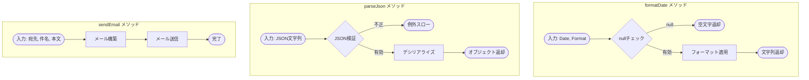

# APEX Utility 設計書テンプレート

目的: Apex ユーティリティ/ヘルパークラスの設計書を作成するためのテンプレート。再利用可能なメソッド、静的ユーティリティを明記する。

---

## メタ
```yaml
title: <short title>
feature_name: <FEATURE_NAME>
module: apex
apex_type: utility
source_path: force-app/main/default/classes/<ClassName>.cls
generated_at: <ISO8601>
```

---

## 目次
1. [概要](#1-概要)
2. [クラス仕様](#2-クラス仕様)
3. [処理フロー](#3-処理フロー)
4. [メソッド一覧](#4-メソッド一覧)
5. [メソッド詳細](#5-メソッド詳細)
6. [使用例](#6-使用例)
7. [依存関係](#7-依存関係)
8. [単体テスト](#8-単体テスト)
9. [変更仕様マトリクス](#9-変更仕様マトリクス)
10. [改訂履歴](#10-改訂履歴)

---

## 1. 概要

### 目的
<!-- ユーティリティクラスの目的・提供する機能を記載 -->

### 提供機能
- 機能1の説明
- 機能2の説明

### 使用箇所
- 使用元クラス/トリガー一覧

---

## 2. クラス仕様

| 項目 | 値 |
|------|-----|
| クラス名 | UtilityClassName |
| 種別 | static utility / instance utility |
| sharing設定 | inherited sharing |
| テストクラス | UtilityClassNameTest |

### クラス構造
```apex
public inherited sharing class UtilityClassName {
    // プライベートコンストラクタ（インスタンス化禁止の場合）
    private UtilityClassName() {}

    // 静的メソッド群
    public static ReturnType methodName(params) { ... }
}
```

---

## 3. 処理フロー

ユーティリティクラスの主要メソッドの処理フローを Mermaid 図で示す。



### フローチャート作成ルール
- **必須**: 各ユーティリティメソッドの処理フローを図示すること
- `subgraph` を使用してメソッドごとにグループ化
- `click` 指令でノードにアンカーを紐付ける（推奨）

---

## 4. メソッド一覧

| メソッド名 | 戻り値 | 説明 |
|-----------|--------|------|
| formatDate | String | 日付を指定フォーマットに変換 |
| parseJson | Object | JSON文字列をパース |
| buildQuery | String | 動的SOQLを構築 |
| sendEmail | void | メール送信 |

---

## 5. メソッド詳細

### 5.1 formatDate (anchor: format-date)

**シグネチャ:**
```apex
public static String formatDate(Date inputDate, String format)
```

**入力データ:**
| パラメータ | 型 | 必須 | 説明 |
|-----------|-----|------|------|
| inputDate | Date | Yes | 変換対象の日付 |
| format | String | Yes | 出力フォーマット（yyyy/MM/dd など） |

**出力データ:**
- String: フォーマット済み日付文字列

**主要アルゴリズム:**
1. null チェック
2. フォーマット適用
3. 文字列返却

**エラーとリカバリ:**
- null 入力時は空文字を返却
- 不正フォーマット時は例外スロー

**使用例:**
```apex
String formatted = UtilityClassName.formatDate(Date.today(), 'yyyy/MM/dd');
// 結果: "2025/12/15"
```

### 5.2 parseJson (anchor: parse-json)

**シグネチャ:**
```apex
public static Object parseJson(String jsonString, Type apexType)
```

**入力データ:**
| パラメータ | 型 | 必須 | 説明 |
|-----------|-----|------|------|
| jsonString | String | Yes | パース対象のJSON文字列 |
| apexType | Type | Yes | 変換先の Apex 型 |

**出力データ:**
- Object: デシリアライズされたオブジェクト

**使用例:**
```apex
MyWrapper wrapper = (MyWrapper) UtilityClassName.parseJson(jsonStr, MyWrapper.class);
```

### 5.3 buildQuery (anchor: build-query)

**シグネチャ:**
```apex
public static String buildQuery(String objectName, List<String> fields, String whereClause)
```

**入力データ:**
| パラメータ | 型 | 必須 | 説明 |
|-----------|-----|------|------|
| objectName | String | Yes | オブジェクトAPI名 |
| fields | List<String> | Yes | 取得項目リスト |
| whereClause | String | No | WHERE句（WHERE キーワード除く） |

**出力データ:**
- String: 構築されたSOQL文字列

**セキュリティ考慮:**
- SOQLインジェクション対策としてバインド変数使用を推奨
- WITH SECURITY_ENFORCED の付与を検討

### 5.4 sendEmail (anchor: send-email)

**シグネチャ:**
```apex
public static void sendEmail(List<String> toAddresses, String subject, String body)
```

**入力データ:**
| パラメータ | 型 | 必須 | 説明 |
|-----------|-----|------|------|
| toAddresses | List<String> | Yes | 宛先メールアドレス |
| subject | String | Yes | 件名 |
| body | String | Yes | 本文 |

**出力データ:**
- なし

**ガバナ考慮:**
- 1トランザクションあたり 5,000 通の制限
- 1日あたりの組織全体メール制限

---

## 6. 使用例

### 基本的な使用方法
```apex
// 日付フォーマット
String dateStr = UtilityClassName.formatDate(Date.today(), 'yyyy年MM月dd日');

// メール送信
UtilityClassName.sendEmail(
    new List<String>{'user@example.com'},
    '件名',
    '本文'
);
```

### トリガーでの使用
```apex
trigger ObjectTrigger on Object__c (after insert) {
    for (Object__c rec : Trigger.new) {
        String formatted = UtilityClassName.formatDate(rec.Date__c, 'yyyy/MM/dd');
        // ...
    }
}
```

---

## 7. 依存関係

### 依存先
| クラス/機能 | 用途 |
|------------|------|
| CustomSetting__c | 設定値取得 |
| EmailTemplate | メールテンプレート |

### 依存元（このクラスを使用）
| クラス名 | 用途 |
|---------|------|
| TriggerHandler | 日付フォーマット |
| BatchClass | メール送信 |

---

## 8. 単体テスト

### 正常系
- 各メソッドが期待通りの結果を返すこと
- 境界値での動作確認

### 異常系
- null 入力時の動作
- 不正入力時の例外確認

### カバレッジ
- 全メソッドのカバレッジ確保
- 分岐網羅

```apex
@IsTest
static void testFormatDate() {
    // 正常系
    String result = UtilityClassName.formatDate(Date.newInstance(2025, 12, 15), 'yyyy/MM/dd');
    System.assertEquals('2025/12/15', result);

    // null 入力
    String nullResult = UtilityClassName.formatDate(null, 'yyyy/MM/dd');
    System.assertEquals('', nullResult);
}
```

---

## 9. 変更仕様マトリクス

| 発生場所(Where) | 発火タイミング/条件(When/If) | 方式 | 対象オブジェクト | 対象レコード特定条件 | 対象項目(Label/API/型) | 変更内容(Before→After/算出式) | 権限要件 | 例外時動作/リトライ | ログ/監査 | 備考 |
|---|---|---|---|---|---|---|---|---|---|---|
| - | メソッド呼び出し時 | Apex Utility | - | - | - | データ変換/メール送信等 | 呼び出し元に依存 | 例外スロー | - | 副作用なし |

---

## 10. 改訂履歴

| バージョン | 日付 | セクション | 追加機能 | 変更者 | 備考 |
|---|---|---|---|---|---|
| 0.1 | YYYY-MM-DD | 全体 | 初版作成 | Author | - |

---

## 関連プログラム
- Utility: [UtilityClassName.cls](../../force-app/main/default/classes/UtilityClassName.cls) | 仕様書: 本書
- Test: [UtilityClassNameTest.cls](../../force-app/main/default/classes/UtilityClassNameTest.cls) | 仕様書なし

## 参考リンク
- 使用元: doc/apex/xxx.md
