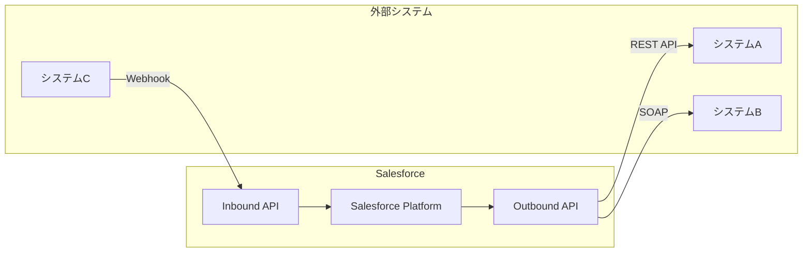
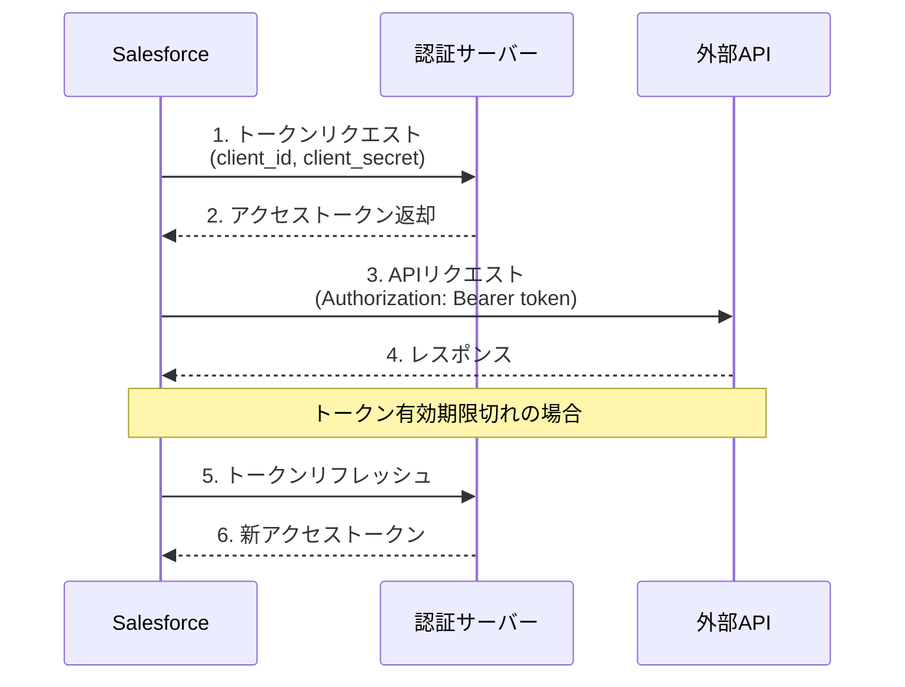
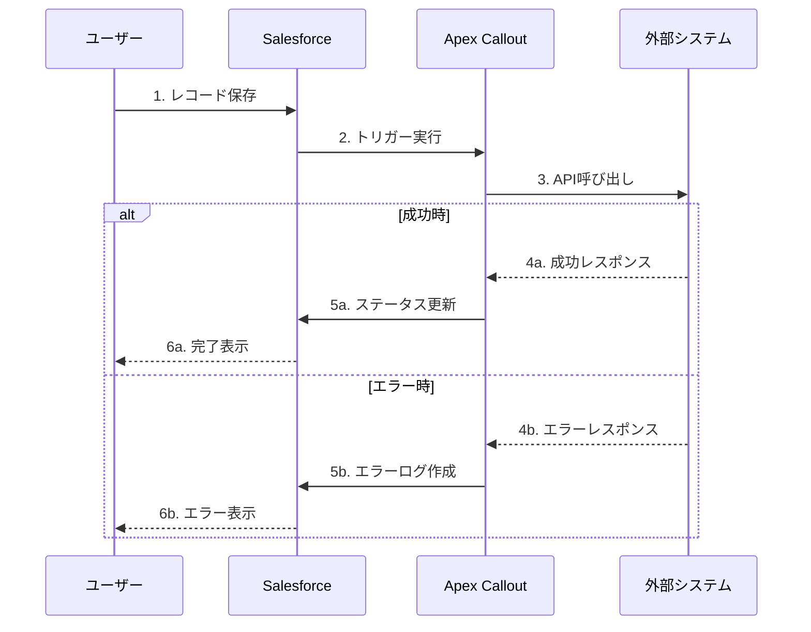
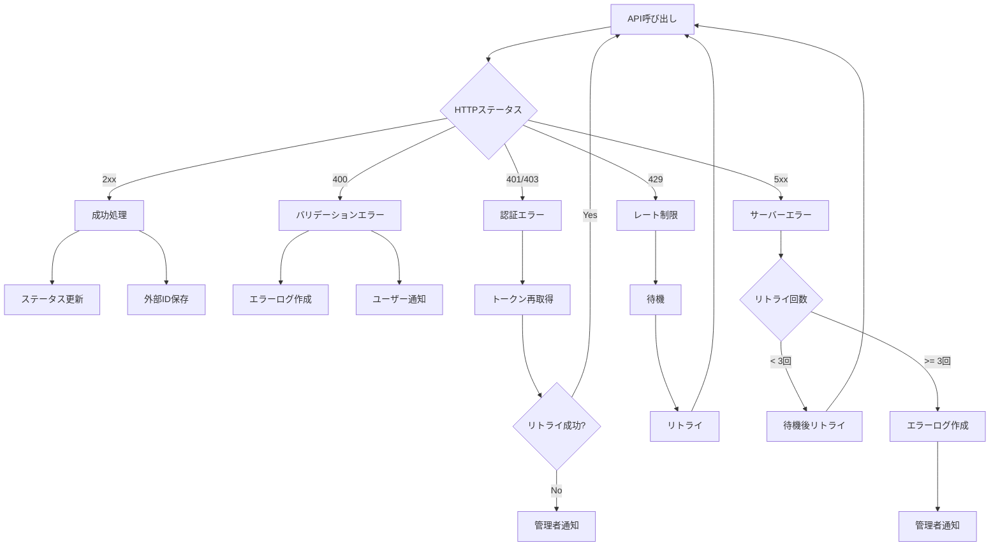
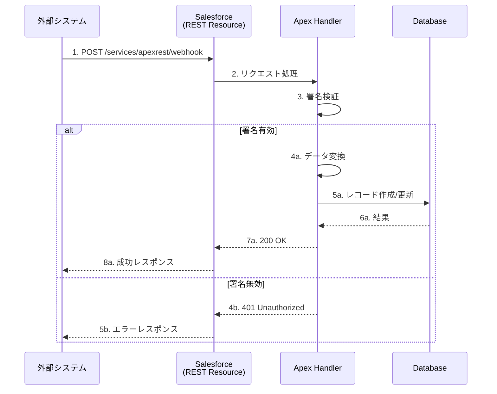
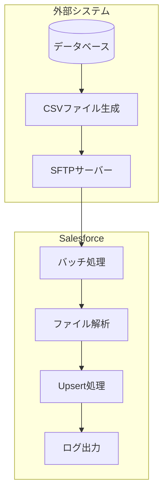

# ③-1 API設計書 (API Design Specification)

**目的：** 外部システムとの連携インターフェース仕様を定義

---

## 1. 連携概要

### 1.1 システム連携図



### 1.2 連携一覧

| 連携ID | 連携名 | 連携先 | プロトコル | 認証方式 | 連携方向 | 同期/非同期 |
|-------|-------|-------|----------|---------|---------|-----------|
| IF-001 | （連携名） | （システム名） | REST | OAuth 2.0 | Outbound | 同期 |
| IF-002 | （連携名） | （システム名） | REST | API Key | Inbound | 非同期 |
| IF-003 | （連携名） | （システム名） | SOAP | WS-Security | 双方向 | 同期 |

---

## 2. 認証・セキュリティ設計

### 2.1 認証フロー



### 2.2 認証方式一覧

| 連携ID | 認証方式 | 認証情報管理 | トークン有効期限 | リフレッシュ |
|-------|---------|------------|----------------|------------|
| IF-001 | OAuth 2.0 (Client Credentials) | Named Credential | 1時間 | 自動 |
| IF-002 | API Key | カスタム設定 | 無期限 | - |
| IF-003 | WS-Security | Named Credential | - | - |

### 2.3 Named Credential設定

| 項目 | 値 |
|-----|-----|
| 名前 | ExternalSystemA_Credential |
| URL | https://api.example.com |
| 認証プロトコル | OAuth 2.0 |
| 認証プロバイダ | （プロバイダ名） |
| 証明書 | （必要な場合） |

---

## 3. Outbound API設計

### 3.1 IF-001: （連携名）

#### 3.1.1 連携フロー



#### 3.1.2 エンドポイント仕様

| 項目 | 値 |
|-----|-----|
| エンドポイント | `https://api.example.com/v1/customers` |
| メソッド | POST |
| Content-Type | application/json |
| タイムアウト | 30秒 |
| リトライ回数 | 3回 |

#### 3.1.3 リクエストヘッダー

| ヘッダー名 | 値 | 必須 |
|-----------|-----|-----|
| Authorization | Bearer {access_token} | ○ |
| Content-Type | application/json | ○ |
| X-Request-Id | {UUID} | ○ |
| X-Timestamp | {ISO8601} | - |

#### 3.1.4 リクエストボディ

```json
{
  "customer_name": "株式会社サンプル",
  "phone_number": "0312345678",
  "email": "sample@example.com",
  "address": {
    "postal_code": "100-0001",
    "prefecture": "東京都",
    "city": "千代田区",
    "street": "丸の内1-1-1"
  },
  "custom_field": "2024-01-15",
  "metadata": {
    "source": "Salesforce",
    "salesforce_id": "001XXXXXXXXXXXX",
    "created_at": "2024-01-15T10:30:00Z"
  }
}
```

#### 3.1.5 項目マッピング

| Salesforce項目 | API名 | JSON項目 | 変換ルール | 必須 |
|---------------|------|---------|-----------|-----|
| Account.Name | Name | customer_name | そのまま | ○ |
| Account.Phone | Phone | phone_number | ハイフン除去 | ○ |
| Account.PersonEmail | PersonEmail | email | そのまま | - |
| Account.BillingPostalCode | BillingPostalCode | address.postal_code | そのまま | - |
| Account.BillingState | BillingState | address.prefecture | そのまま | - |
| Account.BillingCity | BillingCity | address.city | そのまま | - |
| Account.BillingStreet | BillingStreet | address.street | そのまま | - |
| CustomField__c | CustomField__c | custom_field | 日付→ISO8601 | - |

#### 3.1.6 レスポンス（成功時）

**HTTPステータス：** 201 Created

```json
{
  "status": "success",
  "customer_id": "CUS-12345",
  "message": "Customer created successfully",
  "timestamp": "2024-01-15T10:30:05Z"
}
```

#### 3.1.7 レスポンス（エラー時）

**HTTPステータス：** 400 Bad Request

```json
{
  "status": "error",
  "error_code": "VALIDATION_ERROR",
  "message": "Invalid phone number format",
  "details": [
    {
      "field": "phone_number",
      "error": "Must be 10-11 digits"
    }
  ],
  "timestamp": "2024-01-15T10:30:05Z"
}
```

#### 3.1.8 エラーハンドリング



| HTTPステータス | エラーコード | 対処 | リトライ |
|--------------|------------|------|---------|
| 400 | VALIDATION_ERROR | エラーログ作成、データ修正を促す | × |
| 401 | UNAUTHORIZED | トークン再取得後リトライ | ○（1回） |
| 403 | FORBIDDEN | 管理者通知、権限確認 | × |
| 404 | NOT_FOUND | エラーログ作成 | × |
| 429 | RATE_LIMITED | Exponential Backoff後リトライ | ○（3回） |
| 500 | SERVER_ERROR | Exponential Backoff後リトライ | ○（3回） |
| 502/503/504 | GATEWAY_ERROR | Exponential Backoff後リトライ | ○（3回） |

---

## 4. Inbound API設計

### 4.1 IF-002: （連携名）

#### 4.1.1 Webhook受信フロー



#### 4.1.2 エンドポイント仕様

| 項目 | 値 |
|-----|-----|
| エンドポイント | `/services/apexrest/api/v1/webhook` |
| メソッド | POST |
| Content-Type | application/json |
| 認証 | API Key (X-API-Key ヘッダー) |

#### 4.1.3 リクエストヘッダー

| ヘッダー名 | 値 | 必須 | 説明 |
|-----------|-----|-----|------|
| Content-Type | application/json | ○ | - |
| X-API-Key | {api_key} | ○ | 認証キー |
| X-Signature | {hmac_signature} | ○ | リクエスト署名 |
| X-Timestamp | {unix_timestamp} | ○ | リプレイ攻撃防止 |

#### 4.1.4 リクエストボディ

```json
{
  "event_type": "customer.created",
  "event_id": "evt-12345",
  "timestamp": "2024-01-15T10:30:00Z",
  "data": {
    "customer_id": "CUS-12345",
    "name": "株式会社サンプル",
    "email": "sample@example.com",
    "status": "active"
  }
}
```

#### 4.1.5 項目マッピング

| JSON項目 | Salesforce項目 | API名 | 変換ルール | 必須 |
|---------|---------------|------|-----------|-----|
| data.customer_id | 外部ID | ExternalId__c | そのまま | ○ |
| data.name | 取引先名 | Name | そのまま | ○ |
| data.email | メール | Email__c | そのまま | - |
| data.status | ステータス | Status__c | マッピング変換 | - |

#### 4.1.6 レスポンス（成功時）

**HTTPステータス：** 200 OK

```json
{
  "status": "success",
  "salesforce_id": "001XXXXXXXXXXXX",
  "message": "Record processed successfully"
}
```

#### 4.1.7 レスポンス（エラー時）

**HTTPステータス：** 400 Bad Request

```json
{
  "status": "error",
  "error_code": "INVALID_PAYLOAD",
  "message": "Required field 'customer_id' is missing"
}
```

---

## 5. バッチ連携設計

### 5.1 ファイル連携フロー



### 5.2 ファイルフォーマット

| 項目 | 値 |
|-----|-----|
| ファイル形式 | CSV |
| 文字コード | UTF-8 (BOM付き) |
| 区切り文字 | カンマ (,) |
| 囲み文字 | ダブルクォート (") |
| 改行コード | CRLF |
| ヘッダー行 | あり |

### 5.3 ファイルレイアウト

| No | 項目名 | 型 | 桁数 | 必須 | 説明 |
|----|-------|-----|-----|-----|------|
| 1 | customer_id | 文字列 | 20 | ○ | 顧客ID（外部キー） |
| 2 | name | 文字列 | 255 | ○ | 顧客名 |
| 3 | email | 文字列 | 255 | - | メールアドレス |
| 4 | status | 文字列 | 20 | ○ | ステータス |
| 5 | updated_at | 日時 | - | ○ | 更新日時（ISO8601） |

### 5.4 サンプルファイル

```csv
"customer_id","name","email","status","updated_at"
"CUS-001","株式会社A","a@example.com","active","2024-01-15T10:00:00Z"
"CUS-002","株式会社B","b@example.com","inactive","2024-01-15T11:00:00Z"
```

---

## 6. エラーコード一覧

| エラーコード | HTTPステータス | 説明 | 対処方法 |
|------------|--------------|------|---------|
| VALIDATION_ERROR | 400 | リクエストデータ不正 | リクエストデータを確認し修正 |
| INVALID_PAYLOAD | 400 | ペイロード形式不正 | JSON形式を確認 |
| MISSING_REQUIRED_FIELD | 400 | 必須項目欠損 | 必須項目を追加 |
| UNAUTHORIZED | 401 | 認証失敗 | 認証情報を確認 |
| INVALID_SIGNATURE | 401 | 署名検証失敗 | 署名生成ロジックを確認 |
| FORBIDDEN | 403 | アクセス権限なし | 権限設定を確認 |
| NOT_FOUND | 404 | リソース未存在 | URLを確認 |
| DUPLICATE_RECORD | 409 | 重複レコード | 外部IDを確認 |
| RATE_LIMITED | 429 | レート制限超過 | 待機後リトライ |
| INTERNAL_ERROR | 500 | サーバー内部エラー | 時間をおいてリトライ |
| SERVICE_UNAVAILABLE | 503 | サービス利用不可 | 時間をおいてリトライ |

---

## 7. 監視・ログ設計

### 7.1 ログ出力項目

| 項目 | 説明 | 例 |
|-----|------|-----|
| timestamp | ログ出力日時 | 2024-01-15T10:30:00.000Z |
| request_id | リクエスト識別子 | req-abc123 |
| integration_id | 連携ID | IF-001 |
| direction | 連携方向 | outbound / inbound |
| endpoint | エンドポイント | /v1/customers |
| method | HTTPメソッド | POST |
| status_code | HTTPステータス | 200 |
| response_time_ms | 応答時間(ms) | 150 |
| salesforce_id | SalesforceレコードID | 001XXXXXXXXXXXX |
| external_id | 外部システムID | CUS-12345 |
| error_code | エラーコード | VALIDATION_ERROR |
| error_message | エラーメッセージ | Invalid phone number |

### 7.2 アラート設定

| 条件 | 閾値 | 通知先 | 対応 |
|-----|-----|-------|------|
| エラー率 | 5%以上 | システム管理者 | 原因調査 |
| 応答時間 | 10秒以上 | システム管理者 | パフォーマンス確認 |
| 連続エラー | 5回以上 | システム管理者 | 即時対応 |
| 認証エラー | 発生時 | システム管理者 | 認証情報確認 |

---

**作成日：** YYYY年MM月DD日
**作成者：** （作成者名）
**承認者：** （承認者名）
