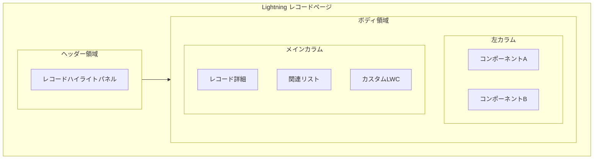
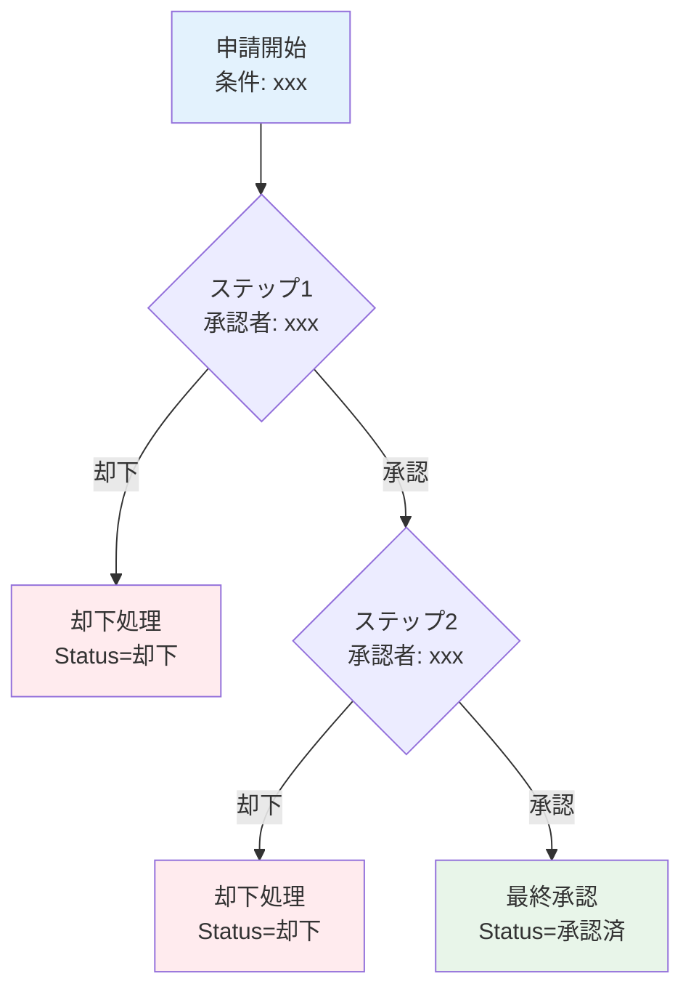
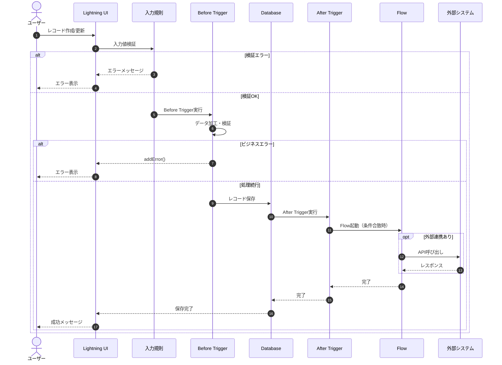
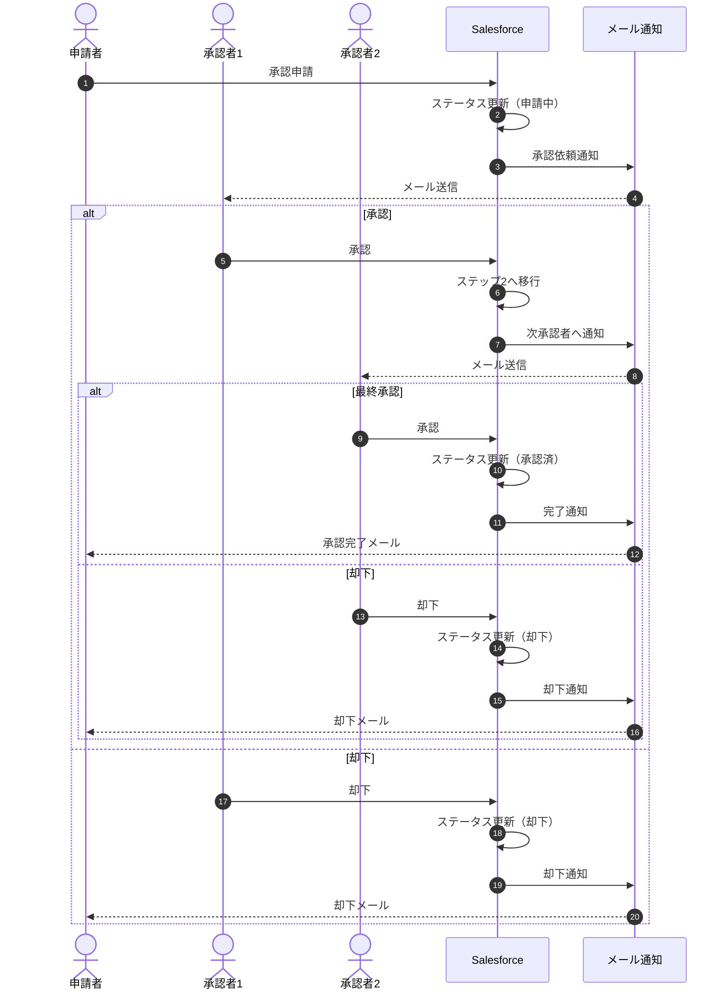
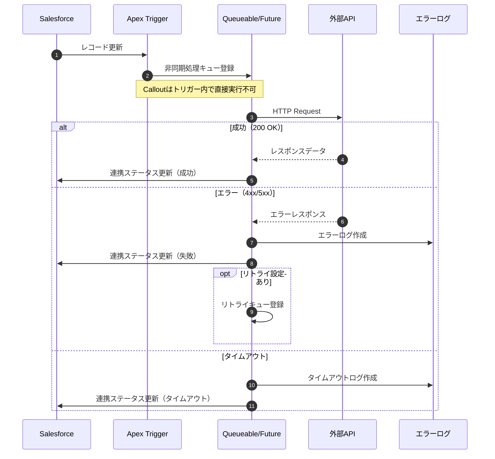
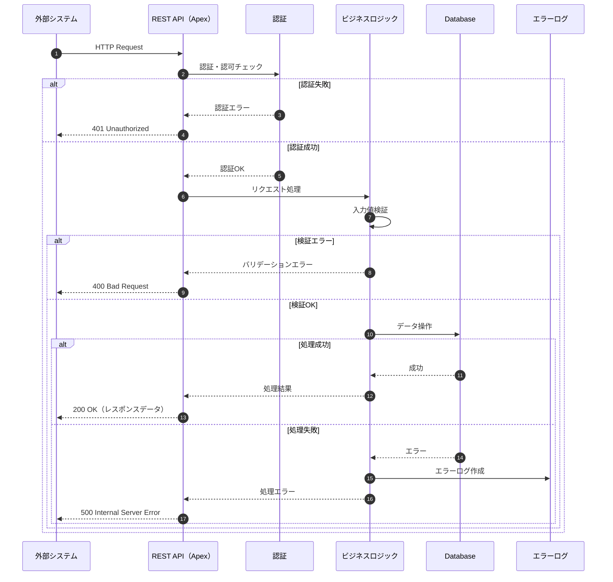
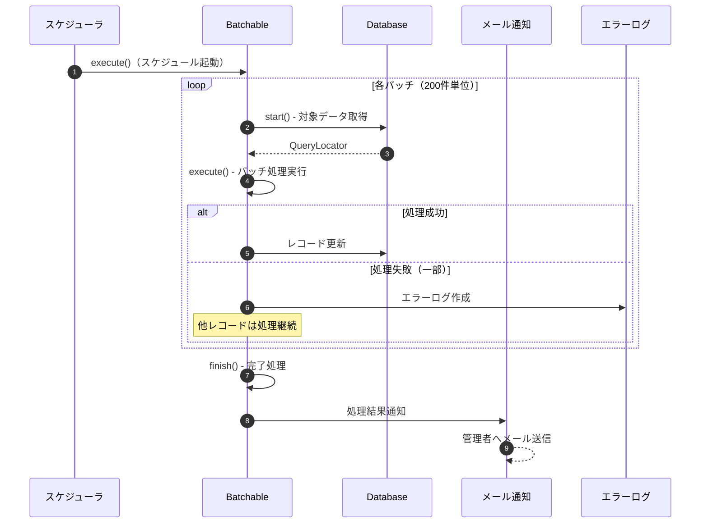
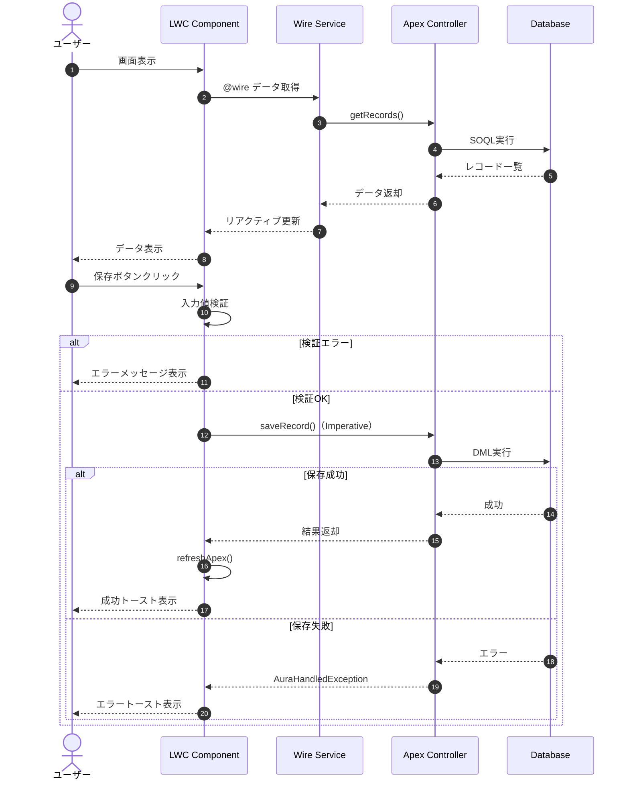

# ② 基本設計書 (Basic Design / Functional Spec)

**目的：** ユーザが見る画面、操作した時の挙動（Input/Output）の定義

---

## 1. オブジェクト定義

### 1.1 カスタムオブジェクト一覧

| No | オブジェクト名 | API名 | 説明 | 主キー | レコードタイプ |
|----|--------------|------|------|-------|-------------|
| 1 | （オブジェクト名） | ObjectName__c | （説明を記載） | Name | あり/なし |
| 2 | （オブジェクト名） | ObjectName__c | （説明を記載） | 自動採番 | あり/なし |

### 1.2 項目定義書

**オブジェクト名：（オブジェクト名を記載）**
**API名：ObjectName__c**

| No | 項目名 | API名 | データ型 | 桁数 | 必須 | 一意 | 外部ID | デフォルト値 | 説明 |
|----|-------|------|---------|-----|-----|-----|-------|------------|------|
| 1 | 名前 | Name | テキスト | 80 | ○ | - | - | - | レコード名 |
| 2 | （項目名） | FieldName__c | テキスト | 255 | - | - | - | - | （説明） |
| 3 | （項目名） | FieldName__c | 数値 | 18,0 | ○ | - | - | 0 | （説明） |
| 4 | （項目名） | FieldName__c | 選択リスト | - | - | - | - | - | （説明） |
| 5 | （項目名） | FieldName__c | 参照関係 | - | - | - | - | - | →（参照先） |
| 6 | （項目名） | FieldName__c | 主従関係 | - | ○ | - | - | - | →（参照先） |

**選択リスト値定義：**

| 項目API名 | 値（API値） | 表示ラベル | デフォルト |
|----------|-----------|----------|----------|
| Status__c | New | 新規 | ○ |
| Status__c | InProgress | 進行中 | - |
| Status__c | Completed | 完了 | - |

---

## 2. 画面設計（UI/UX）

### 2.1 アプリケーション構成

| アプリケーション名 | 説明 | 対象ユーザー | 含まれるタブ |
|-----------------|------|------------|------------|
| （アプリ名） | （説明を記載） | （ユーザーを記載） | タブ1, タブ2, タブ3 |

### 2.2 タブ構成

| タブ名 | タブ種別 | 対象オブジェクト/URL | 表示順 |
|-------|---------|-------------------|-------|
| ホーム | 標準 | Home | 1 |
| （タブ名） | カスタムオブジェクト | ObjectName__c | 2 |
| （タブ名） | Lightningページ | （ページ名） | 3 |
| （タブ名） | Webタブ | （URL） | 4 |

### 2.3 ページレイアウト定義

**オブジェクト名：（オブジェクト名）**
**レイアウト名：（レイアウト名）**

| セクション名 | 列数 | 含まれる項目 | 備考 |
|------------|-----|------------|------|
| 基本情報 | 2 | Name, Field1__c, Field2__c | - |
| 詳細情報 | 2 | Field3__c, Field4__c, Field5__c | 折りたたみ可 |
| 関連リスト | 1 | ChildObject__c, Notes | - |

### 2.4 Lightningページ構成

**ページ名：（ページ名）**
**種別：レコードページ / アプリケーションページ / ホームページ**



| 領域 | コンポーネント | 設定 |
|-----|--------------|------|
| ヘッダー | レコードハイライト | - |
| 左カラム | （コンポーネント名） | （設定内容） |
| メイン | レコード詳細 | （レイアウト名） |
| メイン | 関連リスト | （対象リスト） |

### 2.5 リストビュー定義

**オブジェクト：（オブジェクト名）**

| ビュー名 | 公開設定 | 検索条件 | 表示項目 |
|---------|---------|---------|---------|
| すべて | 全ユーザー | なし | Name, Field1, Field2, CreatedDate |
| 自分のレコード | 全ユーザー | Owner = $CurrentUser | Name, Field1, Status |
| （ビュー名） | 特定グループ | （条件を記載） | （項目を記載） |

---

## 3. ビジネスロジック設計（機能要件）

### 3.1 入力規則一覧

| オブジェクト | ルール名 | エラー条件（数式） | エラーメッセージ | エラー表示位置 |
|------------|---------|-----------------|----------------|--------------|
| （オブジェクト名） | （ルール名） | `ISBLANK(Field__c)` | 必須項目です | 項目 |
| （オブジェクト名） | （ルール名） | `Field__c < 0` | 0以上を入力してください | 項目 |

### 3.2 承認プロセス

**プロセス名：（プロセス名）**
**対象オブジェクト：（オブジェクト名）**



| ステップ | 承認者 | 承認条件 | 承認時アクション | 却下時アクション |
|---------|-------|---------|----------------|----------------|
| ステップ1 | （承認者） | （条件） | （アクション） | Status→却下 |
| ステップ2 | （承認者） | （条件） | Status→承認済 | Status→却下 |

### 3.3 Flow設計概要

| Flow名 | 種別 | トリガー条件 | 処理概要 |
|--------|-----|------------|---------|
| （Flow名） | レコードトリガー | ObjectName__c 作成時 | 関連レコード作成、メール送信 |
| （Flow名） | スケジュールトリガー | 毎日 9:00 | 条件に合致するレコードを更新 |
| （Flow名） | 画面フロー | ボタンクリック | ユーザー入力を受けてレコード作成 |
| （Flow名） | 自動起動フロー | Apexから呼び出し | サブフローとして処理実行 |

**Flow詳細：（Flow名）**

| 要素 | 種別 | 説明 | 次の要素 |
|-----|-----|------|---------|
| Start | 開始 | ObjectName__c 作成時 | 条件チェック |
| 条件チェック | 決定 | Status = 'New' | 真→レコード作成、偽→終了 |
| レコード作成 | レコード作成 | ChildObject__c作成 | メール送信 |
| メール送信 | アクション | 通知メール送信 | 終了 |

---

## 3.4 処理シーケンス図

> **本セクションでは、主要な処理パターンのシーケンス図を定義します。**
> 各機能の処理フローを視覚的に把握するための参照資料として使用してください。

---

### 3.4.1 レコード作成時の処理フロー

**概要：** ユーザーがレコードを作成/更新した際の、Salesforce内部での処理順序を示します。

<br>



<br>

---

### 3.4.2 承認プロセスのシーケンス

**概要：** 承認申請から最終承認/却下までの処理フローを示します。

<br>



<br>

---

### 3.4.3 外部システム連携シーケンス（Outbound）

**概要：** Salesforceから外部システムへデータを送信する際の処理フローを示します。

<br>



<br>

---

### 3.4.4 外部システム連携シーケンス（Inbound）

**概要：** 外部システムからSalesforce REST APIへリクエストを受信する際の処理フローを示します。

<br>



<br>

---

### 3.4.5 バッチ処理シーケンス

**概要：** スケジュール実行されるバッチ処理の処理フローを示します。

<br>



<br>

---

### 3.4.6 LWC画面操作シーケンス

**概要：** LWCコンポーネントでのユーザー操作からデータ保存までの処理フローを示します。

<br>



<br>

---

## 4. 権限設計

### 4.1 プロファイル一覧

| プロファイル名 | ベースプロファイル | 対象ユーザー | 説明 |
|--------------|-----------------|------------|------|
| システム管理者 | System Administrator | IT部門 | 全権限 |
| 営業ユーザー | Standard User | 営業部 | 営業関連機能 |
| サポートユーザー | Standard User | サポート部 | ケース管理機能 |
| 参照のみユーザー | Minimum Access | 経営層 | 参照のみ |

### 4.2 オブジェクト権限マトリクス

| オブジェクト | システム管理者 | 営業ユーザー | サポートユーザー | 参照のみ |
|------------|--------------|-------------|----------------|---------|
| Account | CRUD | CRUD | R | R |
| Contact | CRUD | CRUD | R | R |
| Opportunity | CRUD | CRUD | - | R |
| Case | CRUD | R | CRUD | R |
| CustomObject__c | CRUD | CRU | R | R |

※ C=作成, R=参照, U=編集, D=削除

### 4.3 権限セット定義

| 権限セット名 | 対象ユーザー | 含まれる権限 |
|------------|------------|------------|
| API連携権限 | 連携ユーザー | APIアクセス有効、オブジェクトCRUD |
| レポート作成権限 | 分析担当者 | レポート作成、ダッシュボード作成 |
| 特殊機能権限 | 特定ユーザー | （特殊機能へのアクセス権限） |

### 4.4 項目レベルセキュリティ

**オブジェクト：（オブジェクト名）**

| 項目名 | システム管理者 | 営業ユーザー | サポートユーザー | 参照のみ |
|-------|--------------|-------------|----------------|---------|
| Field1__c | 参照/編集 | 参照/編集 | 参照のみ | 参照のみ |
| Field2__c | 参照/編集 | 参照のみ | 非表示 | 非表示 |
| SensitiveField__c | 参照/編集 | 非表示 | 非表示 | 非表示 |

---

## 5. エラー設計

### 5.1 エラー分類

| エラー区分 | 説明 | 対象ユーザー | 対処方針 |
|----------|------|------------|---------|
| 入力エラー | ユーザー入力値の検証エラー | エンドユーザー | 画面上でエラーメッセージ表示、再入力を促す |
| ビジネスエラー | 業務ルール違反 | エンドユーザー | 画面上でエラーメッセージ表示、操作ガイド提示 |
| システムエラー | 予期しない技術的エラー | システム管理者 | ログ記録、管理者通知、ユーザーには汎用メッセージ表示 |
| 連携エラー | 外部システムとの連携失敗 | システム管理者 | リトライ処理、エラーログ記録、管理者通知 |

### 5.2 エラーメッセージ一覧

| エラーID | エラー区分 | 発生箇所 | エラー条件 | エラーメッセージ（日本語） | 対処方法 |
|---------|----------|---------|----------|------------------------|---------|
| ERR-001 | 入力エラー | （画面/項目名） | 必須項目が未入力 | 「{項目名}」は必須です。入力してください。 | 該当項目を入力 |
| ERR-002 | 入力エラー | （画面/項目名） | 文字数超過 | 「{項目名}」は{n}文字以内で入力してください。 | 文字数を調整 |
| ERR-003 | 入力エラー | （画面/項目名） | 形式不正 | 「{項目名}」の形式が正しくありません。{正しい形式}で入力してください。 | 正しい形式で再入力 |
| ERR-004 | 入力エラー | （画面/項目名） | 日付範囲エラー | 「{項目名}」は{基準日}以降の日付を入力してください。 | 有効な日付を入力 |
| ERR-005 | ビジネスエラー | （機能名） | 重複データ存在 | 同一の{データ種別}が既に登録されています。 | 既存データを確認 |
| ERR-006 | ビジネスエラー | （機能名） | ステータス不正 | 現在のステータスでは{操作名}できません。 | 正しい手順で操作 |
| ERR-007 | ビジネスエラー | （機能名） | 権限不足 | この操作を実行する権限がありません。管理者にお問い合わせください。 | 管理者に連絡 |
| ERR-008 | システムエラー | （処理名） | 予期しないエラー | システムエラーが発生しました。しばらく待ってから再度お試しください。（エラーコード：{code}） | 管理者に連絡 |
| ERR-009 | 連携エラー | （連携先名） | タイムアウト | 外部システムとの通信がタイムアウトしました。しばらく待ってから再度お試しください。 | 時間をおいて再実行 |
| ERR-010 | 連携エラー | （連携先名） | 認証エラー | 外部システムへの認証に失敗しました。管理者にお問い合わせください。 | 管理者に連絡 |

### 5.3 エラーハンドリング方針

| 処理種別 | エラー発生時の動作 | ログ出力 | 通知 | リトライ |
|---------|------------------|---------|-----|---------|
| 画面操作 | エラーメッセージ表示、入力値保持 | ○（エラー詳細） | - | ユーザー操作 |
| Flow処理 | Fault Pathで処理、エラーログ作成 | ○ | 条件により○ | 自動（設定による） |
| Apexトリガー | addError()でメッセージ表示、ロールバック | ○ | - | ユーザー操作 |
| Apexバッチ | 個別レコードエラーはスキップ、継続処理 | ○ | 完了時サマリ | 次回実行時 |
| API連携（Outbound） | リトライ後、エラーログ作成 | ○ | ○ | 自動（最大3回） |
| API連携（Inbound） | エラーレスポンス返却 | ○ | 条件により○ | 呼び出し元判断 |

### 5.4 エラーログ設計

**カスタムオブジェクト：ErrorLog__c（エラーログ）**

| 項目名 | API名 | データ型 | 説明 |
|-------|------|---------|------|
| エラーID | Name | 自動採番 | ERR-XXXXXX |
| エラー区分 | ErrorCategory__c | 選択リスト | 入力/ビジネス/システム/連携 |
| エラーコード | ErrorCode__c | テキスト | ERR-XXX |
| エラーメッセージ | ErrorMessage__c | ロングテキスト | エラー内容 |
| 発生日時 | OccurredAt__c | 日時 | エラー発生日時 |
| 発生箇所 | ErrorLocation__c | テキスト | クラス名.メソッド名 |
| スタックトレース | StackTrace__c | ロングテキスト | 詳細なエラー情報 |
| 関連レコードID | RelatedRecordId__c | テキスト | 対象レコードID |
| ユーザー | User__c | 参照関係 | 実行ユーザー |
| 解決済み | IsResolved__c | チェックボックス | 対応完了フラグ |
| 対応内容 | Resolution__c | ロングテキスト | 対応履歴 |

---

## 6. テスト設計・チェックポイント

### 6.1 テスト種別と責任範囲

| テスト種別 | 目的 | 実施者 | 環境 | 成果物 |
|-----------|-----|-------|-----|--------|
| 単体テスト（UT） | 個別機能の動作確認 | 開発者 | Developer Sandbox | テストクラス、UTレポート |
| 結合テスト（IT） | 機能間連携の確認 | 開発者/QA | Partial Sandbox | ITテストケース、結果レポート |
| システムテスト（ST） | システム全体の動作確認 | QA | Full Sandbox | STテストケース、結果レポート |
| ユーザー受入テスト（UAT） | 業務要件の充足確認 | ユーザー | Full Sandbox | UATチェックリスト、承認 |
| 性能テスト | 性能要件の確認 | 開発者/QA | Full Sandbox | 性能テスト結果 |
| セキュリティテスト | セキュリティ要件の確認 | 開発者/QA | Full Sandbox | セキュリティチェックリスト |

### 6.2 単体テストチェックポイント（Apex）

| チェック項目 | 確認内容 | 合格基準 |
|------------|---------|---------|
| コードカバレッジ | テストによる実行行数割合 | 75%以上（推奨85%以上） |
| 正常系テスト | 期待通りの結果が得られるか | 全ケースPASS |
| 異常系テスト | エラー時に適切に処理されるか | 全ケースPASS |
| 境界値テスト | 境界条件で正しく動作するか | 全ケースPASS |
| Null/空値テスト | Null・空文字の処理が適切か | 例外発生なし |
| バルクテスト | 200件データで正常動作するか | ガバナ制限内で完了 |
| 権限テスト | 異なるユーザーで正しく動作するか | 権限制御が機能 |

**Apexテストケーステンプレート：**

| テストID | テストメソッド名 | テスト対象 | 事前条件 | テスト手順 | 期待結果 |
|---------|----------------|----------|---------|----------|---------|
| UT-001 | testCreateRecord_Success | （メソッド名） | 有効なデータ準備 | メソッド実行 | レコード作成成功 |
| UT-002 | testCreateRecord_Validation | （メソッド名） | 必須項目欠損データ | メソッド実行 | ValidationException発生 |
| UT-003 | testCreateRecord_Bulk | （メソッド名） | 200件データ準備 | メソッド実行 | 全件正常処理 |
| UT-004 | testCreateRecord_NoPermission | （メソッド名） | 権限なしユーザー | メソッド実行 | 権限エラー発生 |

### 6.3 Flow テストチェックポイント

| チェック項目 | 確認内容 | 確認方法 |
|------------|---------|---------|
| トリガー条件 | 正しい条件でFlowが起動するか | Debug Log確認 |
| 分岐処理 | 全分岐パスが正しく動作するか | 各条件パターンでテスト |
| ループ処理 | 大量データで正常動作するか | 200件以上でテスト |
| エラーハンドリング | Fault Pathが正しく機能するか | 意図的にエラー発生 |
| レコード操作 | CRUD操作が正しく行われるか | データ確認 |
| メール送信 | 正しい宛先・内容で送信されるか | メールログ確認 |
| 外部サービス連携 | Calloutが正しく動作するか | モック使用でテスト |

**Flowテストケーステンプレート：**

| テストID | Flow名 | テストシナリオ | 事前条件 | 実行操作 | 期待結果 | 確認ポイント |
|---------|-------|--------------|---------|---------|---------|------------|
| FT-001 | （Flow名） | 正常系：条件A | （条件） | レコード作成 | （期待結果） | （確認項目） |
| FT-002 | （Flow名） | 正常系：条件B | （条件） | レコード更新 | （期待結果） | （確認項目） |
| FT-003 | （Flow名） | 異常系：エラー発生 | （条件） | レコード作成 | Fault Path実行 | エラーログ確認 |

### 6.4 画面テストチェックポイント

| チェック項目 | 確認内容 | 確認方法 |
|------------|---------|---------|
| レイアウト表示 | 項目・セクションが正しく表示されるか | 目視確認 |
| 必須項目 | 必須マークが表示され、未入力時にエラーとなるか | 未入力で保存 |
| 入力規則 | エラーメッセージが正しく表示されるか | 不正値で保存 |
| 項目連動 | 選択値により項目が連動するか | 操作確認 |
| ボタン動作 | 各ボタンが正しく機能するか | クリック確認 |
| レスポンシブ | 各デバイスサイズで正しく表示されるか | ブラウザサイズ変更 |
| パフォーマンス | 画面表示が3秒以内に完了するか | 計測 |

**画面テストケーステンプレート：**

| テストID | 画面名 | テスト項目 | 事前条件 | 操作手順 | 期待結果 | 結果 |
|---------|-------|----------|---------|---------|---------|-----|
| ST-001 | （画面名） | 初期表示 | ログイン済み | 画面アクセス | 正常表示 | ○/× |
| ST-002 | （画面名） | 新規作成 | 画面表示 | 必須入力→保存 | レコード作成 | ○/× |
| ST-003 | （画面名） | 入力規則 | 画面表示 | 不正値入力→保存 | エラー表示 | ○/× |
| ST-004 | （画面名） | 権限確認 | 権限なしユーザー | 画面アクセス | アクセス拒否 | ○/× |

### 6.5 結合テストチェックポイント

| チェック項目 | 確認内容 | 確認方法 |
|------------|---------|---------|
| オブジェクト間連携 | 親子関係でデータが正しく連携するか | 関連レコード確認 |
| Flow/Apex連携 | FlowからApex呼び出しが正しく動作するか | Debug Log確認 |
| トリガー連鎖 | 複数トリガーが正しい順序で動作するか | Debug Log確認 |
| 承認プロセス | 申請→承認→後処理が正しく動作するか | ステータス確認 |
| メール送信 | 各プロセスからメールが正しく送信されるか | メールログ確認 |
| 外部システム連携 | データ連携が正しく行われるか | 連携先確認 |

### 6.6 セキュリティテストチェックポイント

| チェック項目 | 確認内容 | 確認方法 | 合格基準 |
|------------|---------|---------|---------|
| プロファイル権限 | 各プロファイルで適切なアクセス制御 | 各プロファイルでログイン確認 | 設計通りのCRUD |
| 項目レベルセキュリティ | 項目の表示/非表示が正しいか | 各プロファイルで画面確認 | 設計通りの表示 |
| 共有設定 | レコードアクセスが適切か | 異なるロールでレコード確認 | 設計通りのアクセス |
| SOQL Injection | 動的SOQLで不正入力が防止されるか | 不正文字列でテスト | エスケープ処理有効 |
| XSS対策 | スクリプト埋め込みが防止されるか | スクリプトタグ入力 | サニタイズ処理有効 |
| CSRF対策 | 不正リクエストが防止されるか | 外部からのリクエスト | トークン検証有効 |
| 機密データ | 機密項目が適切に保護されているか | 画面/API確認 | マスキング/暗号化有効 |

### 6.7 性能テストチェックポイント

| チェック項目 | 確認内容 | 目標値 | 計測方法 |
|------------|---------|-------|---------|
| 画面表示速度 | ページロード時間 | 3秒以内 | ブラウザ開発者ツール |
| レコード作成 | 単一レコード作成時間 | 2秒以内 | 操作計測 |
| バルク処理 | 200件一括処理時間 | 30秒以内 | Debug Log |
| バッチ処理 | 10,000件処理時間 | 1時間以内 | バッチモニタリング |
| SOQL性能 | クエリ実行時間 | 5秒以内 | Query Plan確認 |
| API連携 | Callout応答時間 | 10秒以内 | Debug Log |

**ガバナ制限チェックリスト：**

| 制限項目 | 制限値 | 確認対象 | 確認方法 |
|---------|-------|---------|---------|
| SOQLクエリ数 | 100（同期）/ 200（非同期） | Apex処理 | Debug Log（LIMIT_USAGE） |
| SOQLクエリ行数 | 50,000 | Apex処理 | Debug Log |
| DML操作数 | 150 | Apex処理 | Debug Log |
| DML操作行数 | 10,000 | Apex処理 | Debug Log |
| Callout数 | 100 | Apex処理 | Debug Log |
| CPU時間 | 10,000ms（同期）/ 60,000ms（非同期） | Apex処理 | Debug Log |
| ヒープサイズ | 6MB（同期）/ 12MB（非同期） | Apex処理 | Debug Log |

### 6.8 受入テスト（UAT）チェックリスト

| チェック項目 | 確認内容 | 確認者 | 結果 | 備考 |
|------------|---------|-------|-----|------|
| 業務シナリオ1 | （シナリオ概要） | （担当者） | ○/×/保留 | （備考） |
| 業務シナリオ2 | （シナリオ概要） | （担当者） | ○/×/保留 | （備考） |
| データ移行確認 | 移行データが正しく表示されるか | （担当者） | ○/×/保留 | （備考） |
| 帳票出力 | 帳票が正しく出力されるか | （担当者） | ○/×/保留 | （備考） |
| メール通知 | 通知が正しく届くか | （担当者） | ○/×/保留 | （備考） |
| 外部連携 | 連携が正しく動作するか | （担当者） | ○/×/保留 | （備考） |

### 6.9 リリース前最終チェックリスト

| カテゴリ | チェック項目 | 確認内容 | 確認者 | 結果 |
|---------|------------|---------|-------|-----|
| コード品質 | コードカバレッジ | 75%以上を満たしているか | 開発者 | ○/× |
| コード品質 | ハードコーディング | 設定値がハードコードされていないか | 開発者 | ○/× |
| コード品質 | デバッグコード | System.debug等が残っていないか | 開発者 | ○/× |
| テスト | 全テストPASS | すべてのテストが成功しているか | 開発者 | ○/× |
| テスト | UAT承認 | ユーザー承認が得られているか | PM | ○/× |
| セキュリティ | 権限設定 | 本番用の権限設定が完了しているか | 開発者 | ○/× |
| セキュリティ | 機密データ | テストデータが含まれていないか | 開発者 | ○/× |
| 設定 | カスタム設定 | 本番用の設定値が登録されているか | 開発者 | ○/× |
| 設定 | リモートサイト | 本番環境のURLが登録されているか | 開発者 | ○/× |
| ドキュメント | 設計書 | 最新化されているか | 開発者 | ○/× |
| ドキュメント | リリースノート | 変更内容が記載されているか | PM | ○/× |
| 運用 | ロールバック手順 | 切り戻し手順が用意されているか | 開発者 | ○/× |
| 運用 | 監視設定 | エラー監視・通知設定が完了しているか | 開発者 | ○/× |

---

## 7. カスタムコンポーネント設計（LWC）

### 7.1 LWCコンポーネント一覧

| No | コンポーネント名 | API名 | 配置場所 | 用途 | 入力（@api） | 出力（イベント） |
|----|----------------|------|---------|------|-------------|----------------|
| 1 | （コンポーネント名） | c-component-name | レコードページ | （用途を記載） | recordId | save, cancel |
| 2 | （コンポーネント名） | c-component-name | ホームページ | （用途を記載） | - | select |

### 7.2 コンポーネント機能定義

**コンポーネント名：（コンポーネント名）**
**API名：c-component-name**

| 機能ID | 機能名 | 機能概要 | トリガー | 処理結果 |
|-------|-------|---------|---------|---------|
| F-001 | データ表示 | レコード情報を一覧表示 | 画面表示時 | データテーブル表示 |
| F-002 | 検索 | 条件に合致するレコードを絞り込み | 検索ボタンクリック | 一覧更新 |
| F-003 | 編集 | 選択レコードを編集 | 編集ボタンクリック | モーダル表示 |
| F-004 | 保存 | 編集内容を保存 | 保存ボタンクリック | レコード更新、完了トースト |

### 7.3 コンポーネントI/O定義

**コンポーネント名：（コンポーネント名）**

**入力プロパティ（@api）：**

| プロパティ名 | データ型 | 必須 | デフォルト | 説明 |
|------------|---------|-----|----------|------|
| recordId | String | ○ | - | 表示対象レコードID |
| isEditable | Boolean | - | true | 編集可否 |
| maxRecords | Number | - | 10 | 最大表示件数 |

**出力イベント：**

| イベント名 | 発火タイミング | detail内容 | 親での処理 |
|----------|--------------|-----------|-----------|
| save | 保存成功時 | { recordId, data } | 画面リフレッシュ |
| cancel | キャンセル時 | - | モーダルクローズ |
| error | エラー発生時 | { message, code } | エラー表示 |

### 7.4 画面モックアップ

**コンポーネント名：（コンポーネント名）**

```
┌─────────────────────────────────────────────────┐
│ コンポーネントタイトル                    [更新]  │
├─────────────────────────────────────────────────┤
│ ┌─────────────────────────────────────────────┐ │
│ │ 検索条件                                    │ │
│ │ [キーワード入力______] [ステータス▼] [検索] │ │
│ └─────────────────────────────────────────────┘ │
│                                                 │
│ ┌─────┬─────────────┬──────────┬──────┬─────┐  │
│ │ □  │ 名前        │ ステータス │ 日付  │ 操作│  │
│ ├─────┼─────────────┼──────────┼──────┼─────┤  │
│ │ □  │ レコード1   │ 新規     │ 12/1 │ [編集]│ │
│ │ □  │ レコード2   │ 進行中   │ 12/2 │ [編集]│ │
│ │ □  │ レコード3   │ 完了     │ 12/3 │ [編集]│ │
│ └─────┴─────────────┴──────────┴──────┴─────┘  │
│                                                 │
│ 3件表示中 / 全10件          [前へ] 1/4 [次へ]   │
└─────────────────────────────────────────────────┘
```

※ 実装詳細（コードサンプル）は「04_プログラム仕様書.md」を参照

---

## 8. トリガー・自動処理設計

### 8.1 トリガー一覧

| No | オブジェクト | トリガー名 | イベント | 処理概要 |
|----|------------|----------|---------|---------|
| 1 | Account | AccountTrigger | before insert, before update | バリデーション、正規化 |
| 2 | Account | AccountTrigger | after insert, after update | 関連レコード更新、通知 |
| 3 | （オブジェクト名） | （トリガー名） | （イベント） | （処理概要） |

### 8.2 トリガー機能定義

**トリガー名：AccountTrigger**
**対象オブジェクト：Account**

| イベント | 処理ID | 処理名 | 処理概要 | 実行条件 |
|---------|-------|-------|---------|---------|
| before insert | BI-001 | デフォルト値設定 | 業種未設定時に「その他」を設定 | Industry = null |
| before insert | BI-002 | 電話番号正規化 | ハイフン除去、形式統一 | Phone != null |
| before update | BU-001 | ステータス遷移チェック | クローズ済みからの変更を禁止 | Status変更時 |
| after insert | AI-001 | 関連担当者作成 | デフォルト担当者を自動作成 | CreateDefaultContact = true |
| after update | AU-001 | 商談同期 | 取引先情報を関連商談に反映 | Name, Industry変更時 |

### 8.3 バッチ処理一覧

| No | バッチ名 | 実行スケジュール | 対象データ | 処理概要 | 想定件数 |
|----|---------|---------------|----------|---------|---------|
| 1 | DailyCleanupBatch | 毎日 3:00 | 90日以上前の一時データ | 不要データ削除 | 〜1,000件 |
| 2 | MonthlyReportBatch | 毎月1日 6:00 | 前月の全商談 | 月次レポート生成 | 〜10,000件 |
| 3 | （バッチ名） | （スケジュール） | （対象） | （処理概要） | （件数） |

### 8.4 バッチ機能定義

**バッチ名：（バッチ名）**

| 項目 | 内容 |
|-----|------|
| 実行スケジュール | 毎日 3:00（Cron式：0 0 3 * * ?） |
| バッチサイズ | 200 |
| 対象データ条件 | CreatedDate < LAST_N_DAYS:90 AND IsTemporary__c = true |
| 処理内容 | 対象レコードの削除 |
| 完了後アクション | 処理件数をメール通知 |
| エラー時アクション | エラーログ作成、管理者通知、処理継続 |

※ 実装詳細（コードサンプル）は「04_プログラム仕様書.md」を参照

---

## 9. 改訂履歴

### 9.1 改訂履歴

| 版数 | 改訂日 | 改訂者 | 承認者 | 改訂内容 |
|-----|-------|-------|-------|---------|
| 1.0 | YYYY/MM/DD | （作成者名） | （承認者名） | 初版作成 |
| 1.1 | YYYY/MM/DD | （改訂者名） | （承認者名） | （改訂内容を記載） |

### 9.2 改訂箇所詳細

| 版数 | セクション | 改訂種別 | 改訂前 | 改訂後 | 改訂理由 |
|-----|----------|---------|-------|-------|---------|
| 1.1 | 3.1 入力規則 | 追加 | - | 日付範囲チェックルール追加 | 業務要件追加 |

---

**作成日：** YYYY年MM月DD日
**作成者：** （作成者名）
**承認者：** （承認者名）
**版数：** 1.0
