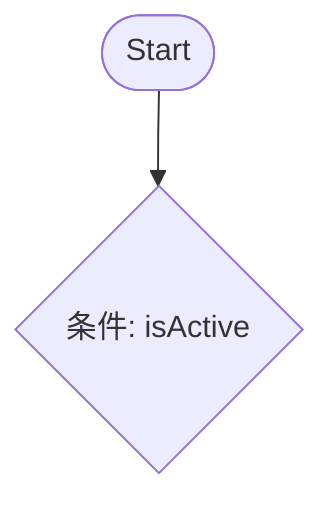

# Flow 設計書テンプレート

目的: Flow（Salesforce Flow）の各ステップを細かく設計し、Mermaid 図と各ステップのアンカーを使って相互参照できるようにするテンプレート。

---

## メタ
- title: <short title>
- feature_name: <FEATURE_NAME>
- module: flow
- source_path: flow/<FlowApiName>.flow-meta.xml
- generated_at: <ISO8601>

---

## 目次
1. [概要](#1-概要)
2. [フロー図（高レベル）](#2-フロー図高レベル)
3. [ステップ詳細（アンカー付き）](#3-ステップ詳細アンカー付き)
4. [データ設計](#4-データ設計)
5. [エラーシナリオと対策](#5-エラーシナリオと対策)
6. [テスト](#6-テスト)
7. [変更仕様マトリクス](#7-変更仕様マトリクス)
8. [改訂履歴](#8-改訂履歴)

---

## 1. 概要
- Flow の目的、トリガ条件（手動/プロセスビルダー/レコードトリガ等）、期待されるアウトカム

## 2. フロー図（高レベル）
- 高レベルの Mermaid 図を入れる（例: flowchart TD ...）
- 図中の各ノードに対して、下の詳細セクションのアンカーを作成し、図からリンクできるようにする。

- 上記のノード C, D には、それぞれ `### C - レコード更新` のようなアンカーを作ること。

 - 必須要件: Flow の設計書では、Mermaid の高レベル図と各ステップの詳細フロー（サブフロー）を必ず含めること。
 - 重要: ノードラベル内に Markdown リンクを入れず、また HTML タグ（` ` 含む）を使用しないこと。改行は `\\n` を使うこと。安全な実装方法:
   - `click` 指令でノードにアンカーを紐付ける（推奨）。例: `click A "#step-1-check-active" "詳細を見る"`。
   - ノード内改行は `\\n` を用いる。例: `C[レコード更新\\n詳細は下部参照]`。
   - ノード内に Markdown リンクを直接記述しないこと。
  - 表記ルール: 図中のオブジェクト名・項目名は表示ラベルで表記し、必要に応じ API 名を括弧併記すること。
 - オブジェクト定義参照: 設計書作成時は `doc/object/` の定義を参照し、必要情報が無ければオブジェクト定義書の更新を提案してください。

## 3. ステップ詳細（アンカー付き）
- 見出し（タイトル）は日本語で記載すること。
- Mermaid `click` 参照のため、半角英数・ハイフンのみの英小文字スラッグをアンカー名として併記すること。
  - 併記例: `### 申込可否の条件判定 (anchor: step-1-check-active)` または 見出し直下に `Anchor: step-1-check-active`
- ステップ詳細には、入力変数、出力変数、SOQL 条件、DML、例外ハンドリング、タイムアウト、再試行ポリシーなどを記載
 - 表記ルール: 本節内で記載するオブジェクト名・項目名は表示ラベルを原則とし、必要に応じ API 名を括弧で併記すること。

### 例: step-1-check-active
- 概要: レコードが isActive か確認
- 入力: record.Id, record.isActive
- 処理: 条件評価
- 出力: ブールフラグ
- 失敗時: エラーハンドリング方針

## 4. データ設計
- Flow で参照/更新する項目一覧（API 名と説明）

## 5. エラーシナリオと対策
- 例: レコードロック、同時更新、参照権限不足

## 6. テスト
- 正常系/分岐/例外/大量データでの動作検証

### プログラム仕様チェックリスト（実施すべきテスト一覧）
- 図と詳細ステップの整合性（図のノードがすべて詳細セクションに対応しているか）
- 各ステップのアンカーが正しくリンクされているか
- 実行で期待されるアウトプットが得られるか

### バグチェック（プログラム観点での必須アサーション）
- Flow の各分岐・ステップについて、前提データ・実行トリガ条件・期待されるデータ状態（DB）を定義し、以下の自動検証を想定してください:
  - レコード作成/更新後のフィールド値検証（SOQL を使った期待値チェック）
  - 条件分岐の各パスに対する結果検証（各パスで作成される/更新されるレコードの確認）
  - 失敗ケース: レコードがロールバックされること、エラーメッセージが適切に表示されること

---

## 7. 変更仕様マトリクス
| 発生場所(Where) | 発火タイミング/条件(When/If) | 方式 | 対象オブジェクト | 対象レコード特定条件 | 対象項目(Label/API/型) | 変更内容(Before→After/算出式) | 権限要件 | 例外時動作/リトライ | ログ/監査 | 備考 |
|---|---|---|---|---|---|---|---|---|---|---|

## 8. 改訂履歴
| バージョン | 日付 | セクション | 追加機能 | ヒアリング（相手/根拠） | 変更者 | 備考 |
|---|---|---|---|---|---|---|
| 0.1 | YYYY-MM-DD | 概要 | 初版 | Yes(<stakeholder>/meeting) | <author> | - |
