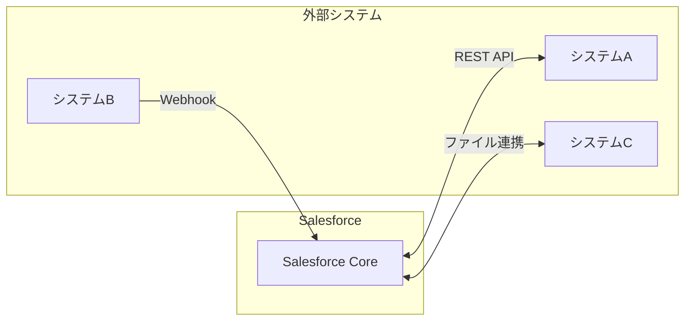
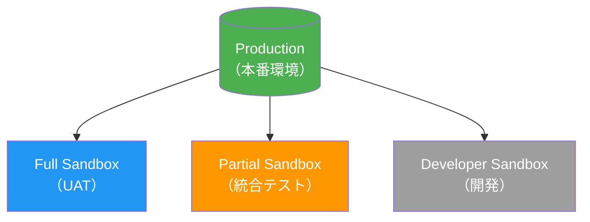
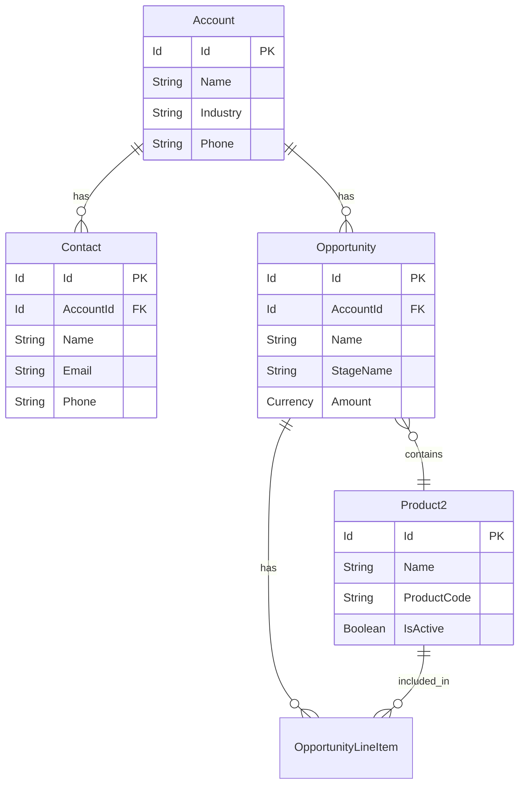
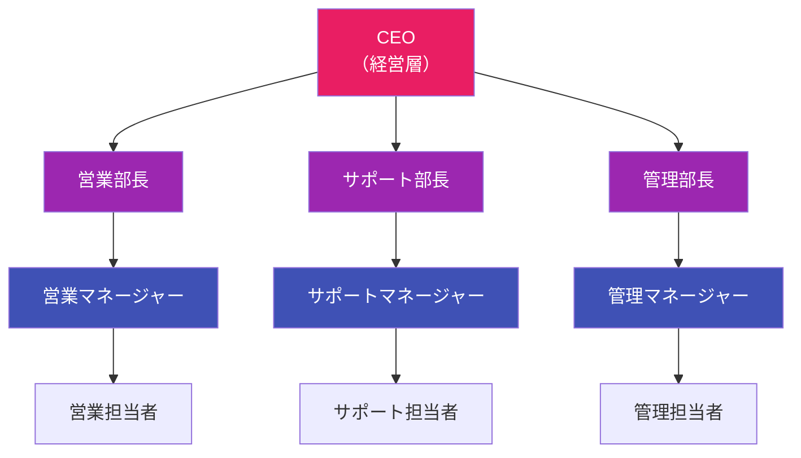
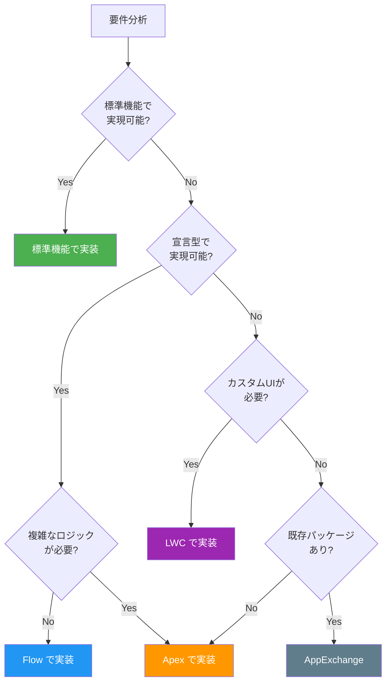

# ① 概要設計書 (High-Level Design / Architecture Design)

**目的：** システム全体の鳥瞰図、システム間連携、データ構造の確定

---

## 1. システム全体構成図

### 1.1 システム構成概要

```mermaid
flowchart TB
    subgraph Client["クライアント層"]
        Browser[ブラウザ]
        Mobile[モバイル]
        External[外部システム]
    end”

    subgraph SF["Salesforce Platform"]
        subgraph UI["Lightning Experience"]
            LWC[LWC]
            Aura[Aura]
            Flow[Flow]
        end

        subgraph Logic["Apex Layer"]
            Trigger[Trigger]
            Class[Class]
            Batch[Batch]
        end

        subgraph Data["Data Layer"]
            StdObj[標準Object]
            Files[ファイル/添付]
            BigObj[BigObjects]
        end
    end

    Browser --> UI
    Mobile --> UI
    External --> Logic

    UI --> Logic
    Logic --> Data
```

### 1.2 Salesforceと他システムとの連携図



| 連携先システム | 連携方式 | 連携方向 | 連携タイミング | 概要 |
|--------------|---------|---------|--------------|------|
| システムA     | REST API | Salesforce → 外部 | リアルタイム | （説明を記載） |
| システムB     | REST API | 外部 → Salesforce | バッチ（日次） | （説明を記載） |
| システムC     | ファイル連携 | 双方向 | バッチ（週次） | （説明を記載） |

---

## 2. システム環境定義

### 2.1 本番・Sandbox環境構成（Sandbox戦略）

| 環境名 | 種別 | 用途 | データ規模 | 更新頻度 |
|-------|-----|------|----------|---------|
| Production | 本番 | 本番運用 | 全量 | - |
| Full Sandbox | Full | UAT/本番相当テスト | 全量コピー | 四半期 |
| Partial Sandbox | Partial | 統合テスト | サンプルデータ | 月次 |
| Developer Sandbox | Developer | 開発・単体テスト | 最小限 | 随時 |

### 2.2 環境構成図



### 2.3 導入パッケージ・ライセンス定義

| パッケージ/ライセンス名 | バージョン | ライセンス数 | 用途 |
|----------------------|-----------|------------|------|
| Sales Cloud | - | XX | 営業管理 |
| Service Cloud | - | XX | カスタマーサポート |
| （AppExchangeアプリ名） | x.x.x | XX | （用途を記載） |

---

## 3. データモデル概要

### 3.1 ER図（主要オブジェクト間のリレーション）



### 3.2 主要オブジェクト一覧

| オブジェクト名（API名） | 種別 | 概要 | 主な参照元/参照先 |
|---------------------|-----|------|-----------------|
| Account | 標準 | 取引先情報 | Contact, Opportunity |
| Contact | 標準 | 取引先責任者 | Account |
| Opportunity | 標準 | 商談情報 | Account, Product2 |
| CustomObject__c | カスタム | （説明を記載） | （参照先を記載） |

---

## 4. セキュリティ設計方針

### 4.1 組織の共有設定（OWD: Organization-Wide Defaults）

| オブジェクト | 内部アクセス | 外部アクセス | 備考 |
|------------|------------|------------|------|
| Account | 非公開 | 非公開 | ロール階層で共有 |
| Contact | 親レコードに連動 | 親レコードに連動 | - |
| Opportunity | 非公開 | 非公開 | 共有ルールで補完 |
| Case | 非公開 | 非公開 | キューで管理 |
| CustomObject__c | 公開/参照のみ | 非公開 | （理由を記載） |

### 4.2 ロール階層



### 4.3 共有ルール概要

| ルール名 | 対象オブジェクト | 共有元 | 共有先 | アクセス権 |
|---------|---------------|-------|-------|----------|
| （ルール名） | Account | ロール | ロール | 参照/更新 |
| （ルール名） | Opportunity | 条件ベース | グループ | 参照のみ |

---

## 5. 機能一覧・方式定義

### 5.1 機能ごとの実装方式

| 機能ID | 機能名 | 概要 | 実装方式 | 優先度 |
|-------|-------|------|---------|-------|
| F-001 | （機能名） | （概要を記載） | 標準機能 | 高 |
| F-002 | （機能名） | （概要を記載） | Flow | 中 |
| F-003 | （機能名） | （概要を記載） | Apex | 高 |
| F-004 | （機能名） | （概要を記載） | LWC | 中 |
| F-005 | （機能名） | （概要を記載） | AppExchange | 低 |

### 5.2 実装方式選定フロー



### 5.3 実装方式選定基準

| 方式 | 選定基準 | メリット | デメリット |
|-----|---------|---------|----------|
| 標準機能 | シンプルな要件、設定のみで対応可能 | 保守性高、アップグレード影響小 | カスタマイズ制限 |
| Flow | 中程度の複雑さ、宣言型で対応可能 | ノーコード、可視化容易 | 複雑ロジックに不向き |
| Apex | 高度なロジック、大量データ処理 | 柔軟性高、複雑処理対応 | 開発コスト、テストカバレッジ必須 |
| LWC | カスタムUI、高度なユーザー体験 | モダンUI、パフォーマンス良好 | 開発コスト高 |
| AppExchange | 既存パッケージで要件充足 | 開発不要、サポート有 | ライセンス費用、カスタマイズ制限 |

---

**作成日：** YYYY年MM月DD日
**作成者：** （作成者名）
**承認者：** （承認者名）
