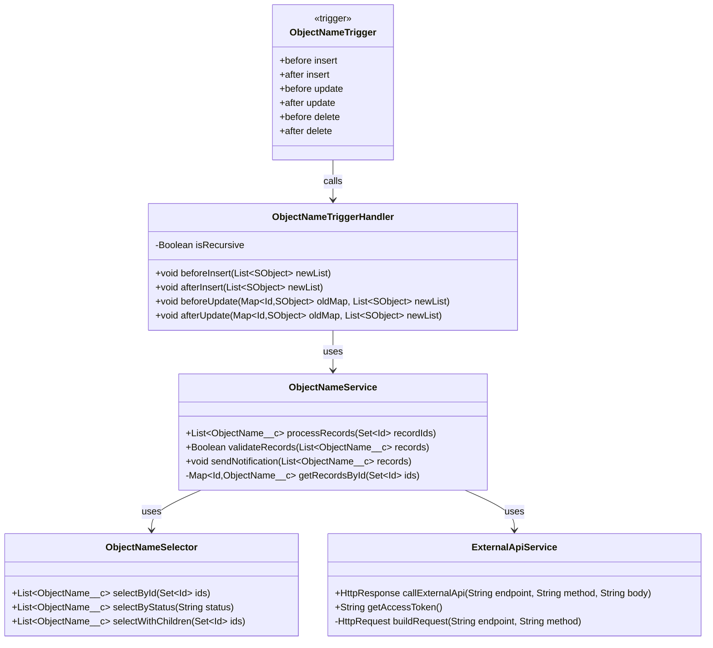
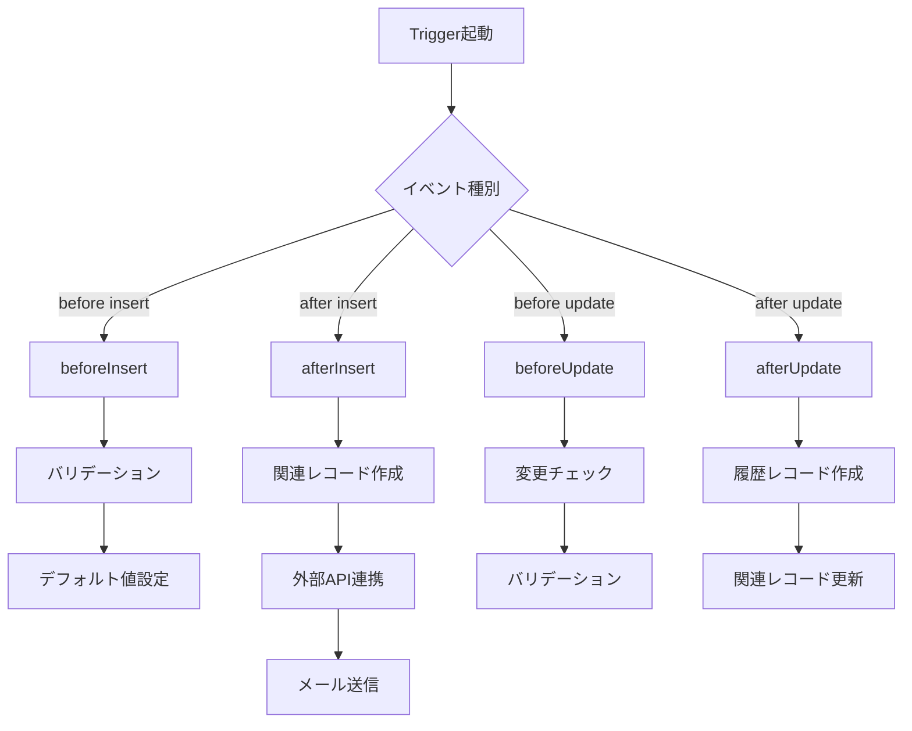
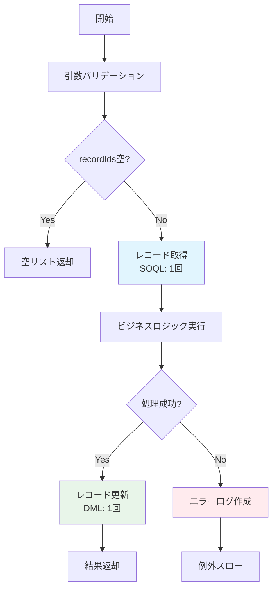
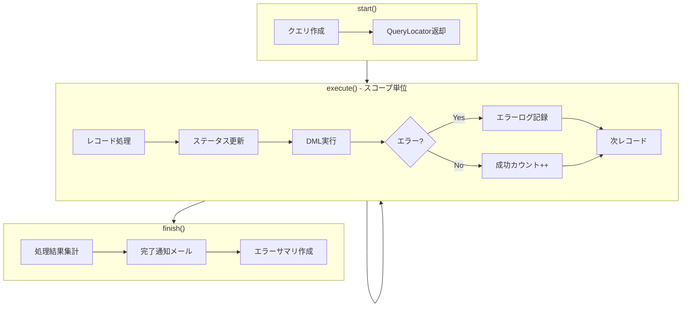
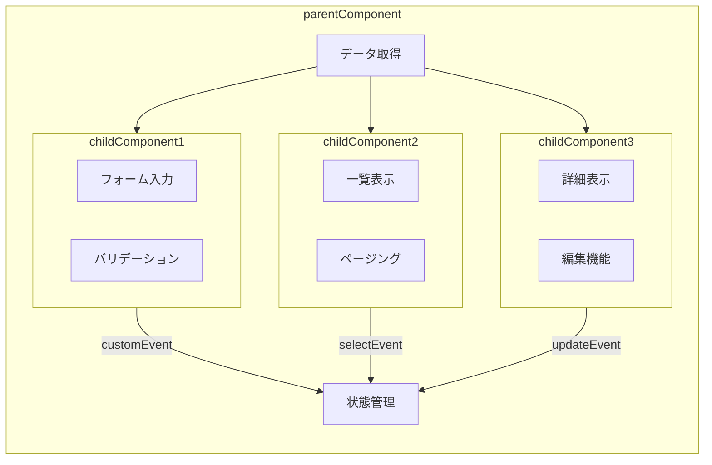
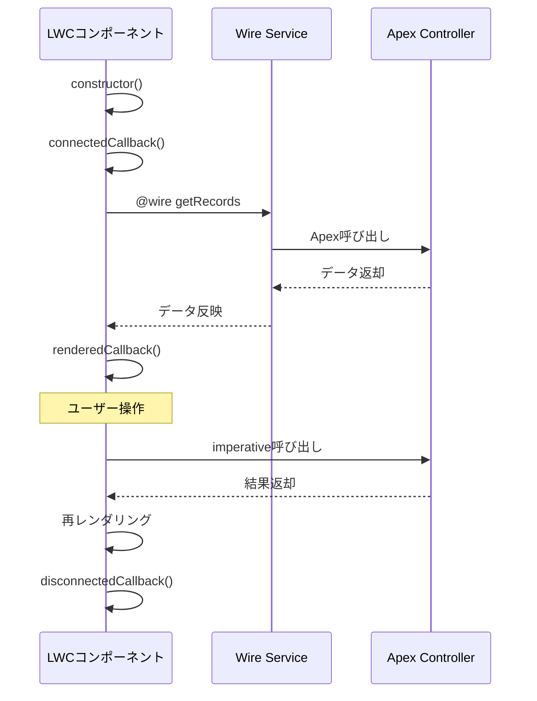
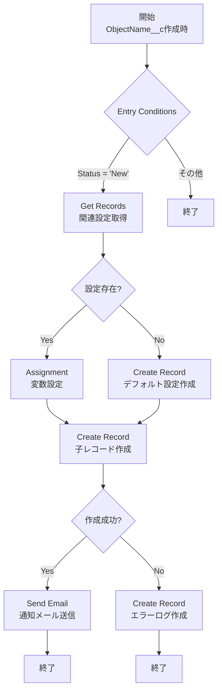
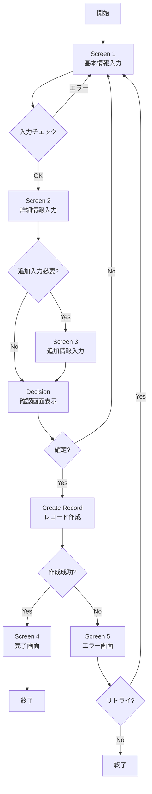
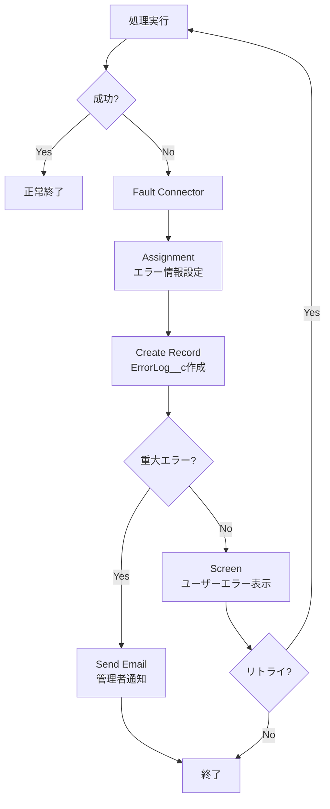
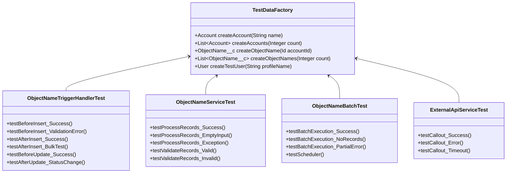

# ③-2 プログラム仕様書 (Program Specification)

**目的：** 開発者（プログラマ）への実装指示書。Apex/LWC/Flowの詳細仕様を定義

---

## 1. Apex設計

### 1.1 クラス構成図



### 1.2 クラス一覧

| クラス名 | 種別 | 説明 | 関連オブジェクト |
|---------|-----|------|----------------|
| ObjectNameTrigger | トリガー | レコード変更時の処理起点 | ObjectName__c |
| ObjectNameTriggerHandler | ハンドラ | トリガーロジック管理 | ObjectName__c |
| ObjectNameService | サービス | ビジネスロジック実装 | ObjectName__c |
| ObjectNameSelector | セレクタ | SOQLクエリ管理 | ObjectName__c |
| ExternalApiService | サービス | 外部API連携 | - |
| ObjectNameBatch | バッチ | 大量データ処理 | ObjectName__c |
| ObjectNameScheduler | スケジューラ | バッチスケジュール | - |
| ObjectNameTest | テスト | 単体テスト | - |

---

### 1.3 トリガー仕様

#### ObjectNameTrigger

```apex
trigger ObjectNameTrigger on ObjectName__c (
    before insert, after insert,
    before update, after update,
    before delete, after delete,
    after undelete
) {
    ObjectNameTriggerHandler handler = new ObjectNameTriggerHandler();

    if (Trigger.isBefore) {
        if (Trigger.isInsert) handler.beforeInsert(Trigger.new);
        if (Trigger.isUpdate) handler.beforeUpdate(Trigger.oldMap, Trigger.new);
        if (Trigger.isDelete) handler.beforeDelete(Trigger.oldMap);
    }

    if (Trigger.isAfter) {
        if (Trigger.isInsert) handler.afterInsert(Trigger.new);
        if (Trigger.isUpdate) handler.afterUpdate(Trigger.oldMap, Trigger.new);
        if (Trigger.isDelete) handler.afterDelete(Trigger.oldMap);
        if (Trigger.isUndelete) handler.afterUndelete(Trigger.new);
    }
}
```

---

### 1.4 ハンドラクラス仕様

#### ObjectNameTriggerHandler



| メソッド名 | 説明 | 処理内容 |
|-----------|------|---------|
| beforeInsert | 作成前処理 | バリデーション、デフォルト値設定 |
| afterInsert | 作成後処理 | 関連レコード作成、外部連携、通知 |
| beforeUpdate | 更新前処理 | 変更チェック、バリデーション |
| afterUpdate | 更新後処理 | 履歴作成、関連レコード更新 |
| beforeDelete | 削除前処理 | 削除可否チェック |
| afterDelete | 削除後処理 | 関連データクリーンアップ |

---

### 1.5 サービスクラス仕様

#### ObjectNameService

**メソッド詳細：processRecords**

```
メソッド名: processRecords
アクセス修飾子: public
戻り値型: List<ObjectName__c>

【シグネチャ】
public List<ObjectName__c> processRecords(Set<Id> recordIds, Map<String, Object> options)
```

| 引数名 | 型 | 必須 | 説明 |
|--------|-----|-----|------|
| recordIds | Set\<Id\> | ○ | 対象レコードIDセット |
| options | Map\<String, Object\> | - | オプション設定 |

**処理フロー：**



**例外処理：**

| 例外クラス | 発生条件 | 対処 |
|-----------|---------|------|
| IllegalArgumentException | recordIdsがnull | 呼び出し元に例外を伝播 |
| QueryException | SOQLクエリエラー | エラーログ作成、例外を伝播 |
| DmlException | DML操作失敗 | ロールバック、エラーログ作成 |
| CalloutException | 外部API呼び出し失敗 | リトライ後、エラーログ作成 |

**ガバナ制限対策：**

| 制限項目 | 対策 |
|---------|------|
| SOQLクエリ | ループ外で1回のみ実行、必要項目のみSELECT |
| DML操作 | リスト単位でバルク処理 |
| CPU時間 | 重い処理はFuture/Queueableで非同期化 |
| ヒープ | 不要な変数は早期にnull化 |

---

### 1.6 セレクタクラス仕様

#### ObjectNameSelector

```apex
public class ObjectNameSelector {

    public List<ObjectName__c> selectById(Set<Id> ids) {
        return [
            SELECT Id, Name, Status__c, Field1__c, Field2__c,
                   CreatedDate, LastModifiedDate,
                   (SELECT Id, Name FROM ChildObjects__r)
            FROM ObjectName__c
            WHERE Id IN :ids
        ];
    }

    public List<ObjectName__c> selectByStatus(String status) {
        return [
            SELECT Id, Name, Status__c
            FROM ObjectName__c
            WHERE Status__c = :status
            ORDER BY CreatedDate DESC
            LIMIT 200
        ];
    }
}
```

---

### 1.7 バッチクラス仕様

#### ObjectNameBatch



| 項目 | 値 |
|-----|-----|
| クラス名 | ObjectNameBatch |
| 実行スケジュール | 毎日 02:00 JST |
| スコープサイズ | 200 |
| 想定処理時間 | 30分以内 |
| 想定処理件数 | 最大10,000件/日 |

**対象レコード抽出条件：**
```sql
SELECT Id, Name, Status__c, Field1__c, Field2__c
FROM ObjectName__c
WHERE Status__c = 'Pending'
  AND ProcessDate__c <= TODAY
  AND IsProcessed__c = false
ORDER BY CreatedDate ASC
```

**スケジューラ設定：**
```apex
// 毎日午前2時に実行
String cronExp = '0 0 2 * * ?';
System.schedule('ObjectName Daily Batch', cronExp, new ObjectNameScheduler());
```

---

## 2. LWC設計

### 2.1 コンポーネント構成図



### 2.2 コンポーネント一覧

| コンポーネント名 | 説明 | 配置場所 | 公開設定 |
|----------------|------|---------|---------|
| parentComponent | 親コンポーネント | レコードページ | isExposed: true |
| childFormComponent | 入力フォーム | 親コンポーネント内 | isExposed: false |
| childListComponent | 一覧表示 | 親コンポーネント内 | isExposed: false |
| childDetailComponent | 詳細表示 | 親コンポーネント内 | isExposed: false |

### 2.3 コンポーネント仕様

#### parentComponent

**メタデータ設定（.js-meta.xml）：**
```xml
<?xml version="1.0" encoding="UTF-8"?>
<LightningComponentBundle xmlns="http://soap.sforce.com/2006/04/metadata">
    <apiVersion>59.0</apiVersion>
    <isExposed>true</isExposed>
    <targets>
        <target>lightning__RecordPage</target>
        <target>lightning__AppPage</target>
    </targets>
    <targetConfigs>
        <targetConfig targets="lightning__RecordPage">
            <property name="showHeader" type="Boolean" default="true" label="ヘッダー表示"/>
            <property name="maxRecords" type="Integer" default="10" label="最大表示件数"/>
        </targetConfig>
    </targetConfigs>
</LightningComponentBundle>
```

**プロパティ：**

| プロパティ名 | デコレータ | 型 | デフォルト | 説明 |
|------------|----------|-----|----------|------|
| recordId | @api | String | - | 現在のレコードID |
| objectApiName | @api | String | - | オブジェクトAPI名 |
| showHeader | @api | Boolean | true | ヘッダー表示フラグ |
| records | @track | Array | [] | 表示レコードリスト |
| isLoading | @track | Boolean | false | ローディング状態 |
| error | @track | Object | null | エラー情報 |

**ライフサイクル：**



**イベント仕様：**

| イベント名 | ディスパッチ元 | バブリング | Composed | ペイロード |
|-----------|--------------|----------|----------|----------|
| recordselect | childListComponent | true | false | { recordId: Id } |
| recordupdate | childDetailComponent | true | false | { record: Object } |
| formerror | childFormComponent | false | false | { errors: Array } |

**イベント発火例：**
```javascript
// 子コンポーネントでのイベント発火
handleSelect(event) {
    const selectEvent = new CustomEvent('recordselect', {
        detail: { recordId: event.target.dataset.id },
        bubbles: true
    });
    this.dispatchEvent(selectEvent);
}

// 親コンポーネントでのイベント受信
handleRecordSelect(event) {
    const { recordId } = event.detail;
    this.selectedRecordId = recordId;
}
```

---

## 3. Flow設計

### 3.1 Flow一覧

| Flow名 | 種別 | トリガー | 概要 |
|--------|-----|---------|------|
| ObjectName_AfterCreate | レコードトリガー | 作成後 | 関連レコード自動作成 |
| ObjectName_BeforeUpdate | レコードトリガー | 更新前 | バリデーション・項目自動設定 |
| ObjectName_EntryScreen | 画面フロー | ボタン | データ入力ウィザード |
| ObjectName_DailyProcess | スケジュール | 毎日9:00 | 日次処理 |

### 3.2 レコードトリガーフロー詳細

#### ObjectName_AfterCreate



**変数定義：**

| 変数名 | データ型 | コレクション | 入力 | 出力 | 説明 |
|-------|---------|------------|-----|-----|------|
| recordVar | Record (ObjectName__c) | No | ○ | - | トリガーレコード |
| configRecords | Record (Config__c) | Yes | - | - | 設定レコード |
| newChildRecord | Record (Child__c) | No | - | ○ | 作成する子レコード |
| errorMessage | Text | No | - | - | エラーメッセージ |

### 3.3 画面フロー詳細

#### ObjectName_EntryScreen



**画面要素定義：**

| 画面 | 要素名 | 要素タイプ | 必須 | バリデーション |
|-----|-------|----------|-----|--------------|
| Screen 1 | inputName | Text | ○ | 255文字以内 |
| Screen 1 | inputEmail | Email | ○ | メール形式 |
| Screen 1 | inputPhone | Phone | - | 電話番号形式 |
| Screen 2 | inputStatus | Picklist | ○ | - |
| Screen 2 | inputDate | Date | ○ | 今日以降 |
| Screen 3 | inputDescription | Long Text Area | - | 10000文字以内 |

### 3.4 エラーハンドリング（Fault Path）



| 要素 | エラー種別 | Fault Path処理 | 通知先 |
|-----|----------|---------------|-------|
| Get Records | NoRecordFound | デフォルト値設定、処理継続 | - |
| Create Record | DMLError | エラーログ作成、管理者通知 | システム管理者 |
| Update Record | DMLError | エラーログ作成、ユーザー通知 | ユーザー |
| Apex Action | ApexException | エラーログ作成、管理者通知 | システム管理者 |
| Send Email | EmailException | エラーログ作成 | - |

---

## 4. テストクラス設計

### 4.1 テストクラス構成



### 4.2 テストケース一覧

| テストID | テストクラス | テストメソッド | テスト内容 | 期待結果 |
|---------|------------|--------------|----------|---------|
| UT-001 | ObjectNameTriggerHandlerTest | testBeforeInsert_Success | 正常なデータで作成 | レコード作成成功 |
| UT-002 | ObjectNameTriggerHandlerTest | testBeforeInsert_ValidationError | 必須項目欠損で作成 | バリデーションエラー |
| UT-003 | ObjectNameTriggerHandlerTest | testAfterInsert_BulkTest | 200件一括作成 | 全件正常処理 |
| UT-004 | ObjectNameServiceTest | testProcessRecords_Success | 正常なIDセット | 処理成功 |
| UT-005 | ObjectNameServiceTest | testProcessRecords_EmptyInput | 空のIDセット | 空リスト返却 |
| UT-006 | ObjectNameBatchTest | testBatchExecution_Success | 対象データあり | バッチ正常完了 |
| UT-007 | ExternalApiServiceTest | testCallout_Success | 正常レスポンス | 連携成功 |
| UT-008 | ExternalApiServiceTest | testCallout_Error | エラーレスポンス | 例外処理実行 |

### 4.3 テストデータファクトリ

```apex
@isTest
public class TestDataFactory {

    public static Account createAccount(String name) {
        Account acc = new Account(
            Name = name,
            Industry = 'Technology',
            Phone = '03-1234-5678'
        );
        insert acc;
        return acc;
    }

    public static List<ObjectName__c> createObjectNames(Integer count, Id accountId) {
        List<ObjectName__c> records = new List<ObjectName__c>();
        for (Integer i = 0; i < count; i++) {
            records.add(new ObjectName__c(
                Name = 'Test Record ' + i,
                Account__c = accountId,
                Status__c = 'New',
                Field1__c = 'Value ' + i
            ));
        }
        insert records;
        return records;
    }

    public static User createTestUser(String profileName) {
        Profile p = [SELECT Id FROM Profile WHERE Name = :profileName LIMIT 1];
        User u = new User(
            FirstName = 'Test',
            LastName = 'User',
            Email = 'testuser@example.com',
            Username = 'testuser' + DateTime.now().getTime() + '@example.com',
            Alias = 'tuser',
            TimeZoneSidKey = 'Asia/Tokyo',
            LocaleSidKey = 'ja_JP',
            EmailEncodingKey = 'UTF-8',
            LanguageLocaleKey = 'ja',
            ProfileId = p.Id
        );
        insert u;
        return u;
    }
}
```

### 4.4 Mockクラス

```apex
@isTest
public class ExternalApiMock implements HttpCalloutMock {

    private Integer statusCode;
    private String responseBody;

    public ExternalApiMock(Integer statusCode, String responseBody) {
        this.statusCode = statusCode;
        this.responseBody = responseBody;
    }

    public HTTPResponse respond(HTTPRequest req) {
        HttpResponse res = new HttpResponse();
        res.setStatusCode(this.statusCode);
        res.setBody(this.responseBody);
        res.setHeader('Content-Type', 'application/json');
        return res;
    }

    // 成功レスポンス
    public static ExternalApiMock getSuccessMock() {
        String body = '{"status":"success","customer_id":"CUS-12345"}';
        return new ExternalApiMock(200, body);
    }

    // エラーレスポンス
    public static ExternalApiMock getErrorMock() {
        String body = '{"status":"error","error_code":"VALIDATION_ERROR"}';
        return new ExternalApiMock(400, body);
    }
}
```

---

**作成日：** YYYY年MM月DD日
**作成者：** （作成者名）
**承認者：** （承認者名）
