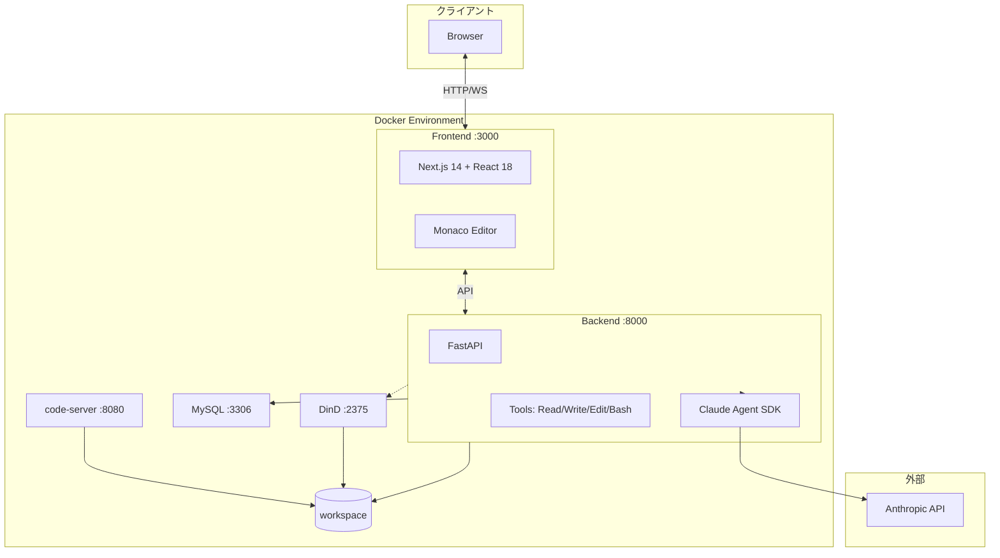
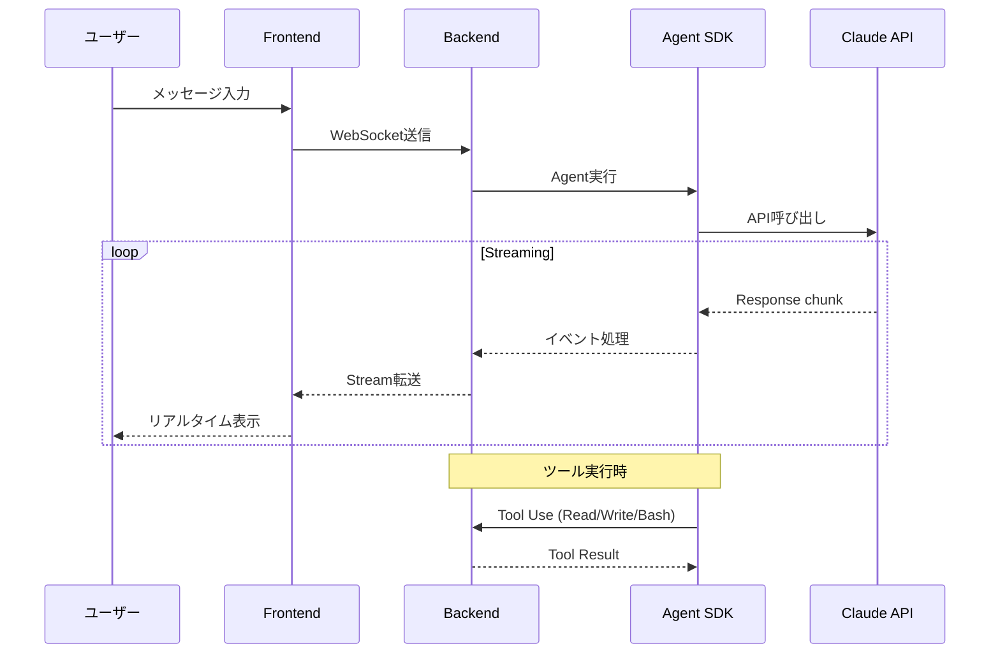
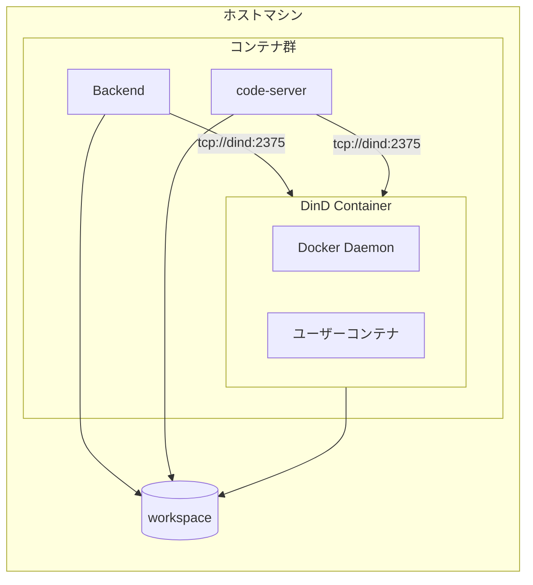
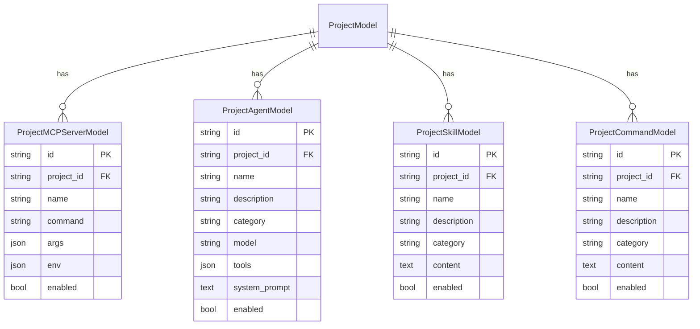
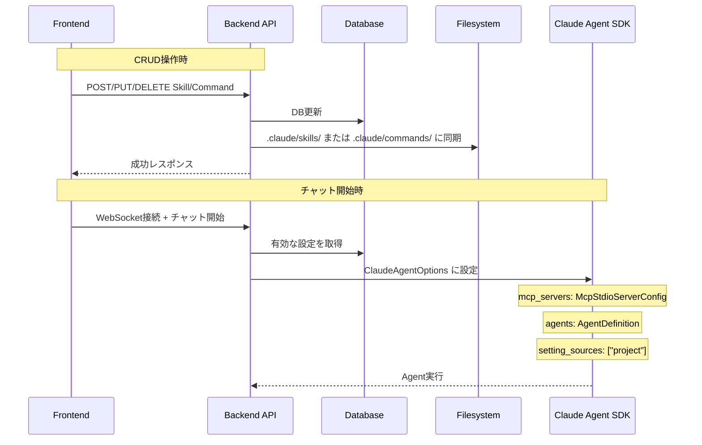
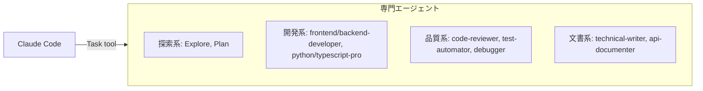
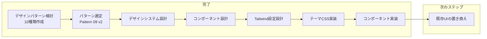
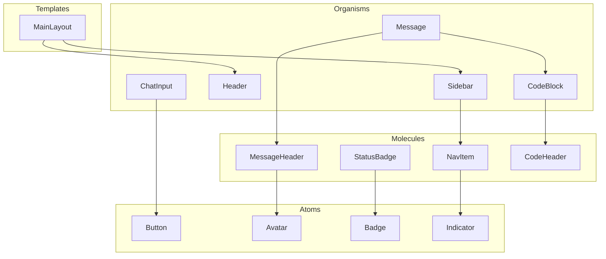

# Claude Code プロジェクト設定

このファイルは Claude Code がプロジェクトを理解するための設定ファイルです。

## プロジェクト概要

Web版Claude Codeプロジェクト - Claude Agent SDK (Python) を使用したWebベースのコーディングアシスタント

### 主な機能

- Claudeとのリアルタイムストリーミングチャット
- ファイル操作（Read/Write/Edit）
- Bashコマンド実行
- VSCode Web（code-server）統合
- プロジェクト・セッション管理
- メッセージ履歴保存
- Docker-in-Docker (DinD) によるコード実行環境

---

## ディレクトリ構造

```
AGENTSDK/
├── CLAUDE.md                    # プロジェクト設定（このファイル）
├── README.md                    # プロジェクト概要
├── Makefile                     # Docker操作コマンド
├── docker-compose.yml           # 標準構成
├── docker-compose.dind.yml      # DinD拡張構成
├── docker-compose.dev.yml       # 開発モード構成
├── .env / .env.example          # 環境変数
│
├── src/
│   ├── backend/                 # Python FastAPI
│   │   ├── app/
│   │   │   ├── main.py          # エントリポイント
│   │   │   ├── config.py        # 設定管理
│   │   │   ├── api/routes/      # APIエンドポイント
│   │   │   ├── core/            # コアロジック
│   │   │   ├── services/        # ビジネスロジック
│   │   │   ├── models/          # データモデル
│   │   │   └── utils/           # ユーティリティ
│   │   ├── tests/               # テスト
│   │   └── Dockerfile
│   │
│   ├── frontend/                # Next.js + React
│   │   ├── src/
│   │   │   ├── app/             # Next.js App Router
│   │   │   ├── components/      # UIコンポーネント
│   │   │   ├── hooks/           # カスタムフック
│   │   │   ├── stores/          # Zustand状態管理
│   │   │   └── lib/             # APIクライアント
│   │   └── Dockerfile
│   │
├── doc/                         # 設計書（確定済み）
├── doc_draft/                   # 設計書（作成中）
└── workspace/                   # ユーザープロジェクト
```

---

## システムアーキテクチャ



### データフロー



### 技術スタック

| レイヤー | 技術 |
|---------|------|
| Frontend | React 18, Next.js 14, TypeScript, Monaco Editor, TailwindCSS, Zustand |
| Backend | Python 3.11, FastAPI, Claude Agent SDK, Uvicorn, Pydantic 2.x |
| Database | MySQL 8.0 (永続化) |
| Infrastructure | Docker 24+, Docker Compose 2.x, Docker-in-Docker |

---

## Docker-in-Docker (DinD)

DinDは、Dockerコンテナ内で別のDockerデーモンを実行する技術です。安全なコード実行環境として使用されています。



### DinDの利点

| 項目 | 説明 |
|------|------|
| 分離性 | ユーザーコードをホストから完全に分離 |
| セキュリティ | 悪意のあるコードがホストに影響しない |
| 再現性 | 一貫した実行環境を提供 |
| 共有 | BackendとVSCode Webで同じDocker環境を使用 |

---

## サーバーの起動方法

### 前提条件

- Docker 24.0+
- Docker Compose 2.x
- 8GB以上のメモリ推奨
- Anthropic API Key

### 環境変数設定

```bash
# .env.exampleをコピー
cp .env.example .env

# 必須変数を設定
# ANTHROPIC_API_KEY: Claude APIキー
# SECRET_KEY: セキュリティキー (openssl rand -hex 32で生成)
```

### 起動コマンド

| コマンド | 説明 |
|----------|------|
| `make up` | 標準構成で起動 |
| `make dev` | 開発モード（ホットリロード有効） |
| `make up-with-dind` | DinD環境付きで起動 |
| `make down` | サービス停止 |
| `make logs` | ログ表示 |
| `make status` | 状態確認 |

### DinD関連コマンド

| コマンド | 説明 |
|----------|------|
| `make dind-up` | DinDのみ起動 |
| `make dind-down` | DinD停止 |
| `make dind-test` | 接続テスト |
| `make dind-stats` | 統計表示 |
| `make dind-clean` | ストレージクリーンアップ |

### アクセスURL

| サービス | URL | 説明 |
|----------|-----|------|
| Frontend | http://localhost:3000 | メインUI |
| Backend API | http://localhost:8000 | REST API |
| API Docs | http://localhost:8000/docs | Swagger UI |
| code-server | http://localhost:8080 | VSCode Web |

### コンテナリビルドルール（必須）

**変更があったコンテナのみをリビルドすること。全体リビルドは禁止。**

```bash
# フロントエンドのみ変更した場合
docker-compose -f docker-compose.yml -f docker-compose.dind.yml build frontend
docker-compose -f docker-compose.yml -f docker-compose.dind.yml up -d frontend

# バックエンドのみ変更した場合
docker-compose -f docker-compose.yml -f docker-compose.dind.yml build backend
docker-compose -f docker-compose.yml -f docker-compose.dind.yml up -d backend

# 両方変更した場合
docker-compose -f docker-compose.yml -f docker-compose.dind.yml build frontend backend
docker-compose -f docker-compose.yml -f docker-compose.dind.yml up -d frontend backend
```

| オプション | 使用タイミング |
|-----------|---------------|
| `build <service>` | 通常のリビルド（キャッシュ使用） |
| `build --no-cache <service>` | Dockerfile変更時、依存関係更新時のみ |
| `up -d <service>` | 該当サービスのみ再起動 |

**注意事項:**
- `docker-compose build` (サービス指定なし) は使用禁止
- `--no-cache` は必要な場合のみ使用（ビルド時間短縮のため）
- MySQL, DinD, code-server は通常リビルド不要

---

## プロジェクト設定管理（DB Config Management）

プロジェクトごとにMCP Server、Agent、Skill、Commandをデータベースで管理し、Claude Agent SDKに渡します。

### データモデル



### API エンドポイント

| エンドポイント | メソッド | 説明 |
|---------------|---------|------|
| `/api/projects/{id}/mcp-servers` | GET/POST | MCPサーバー一覧/作成 |
| `/api/projects/{id}/mcp-servers/{mcp_id}` | GET/PUT/DELETE | MCPサーバー詳細/更新/削除 |
| `/api/projects/{id}/agents` | GET/POST | エージェント一覧/作成 |
| `/api/projects/{id}/agents/{agent_id}` | GET/PUT/DELETE | エージェント詳細/更新/削除 |
| `/api/projects/{id}/skills` | GET/POST | スキル一覧/作成 |
| `/api/projects/{id}/skills/{skill_id}` | GET/PUT/DELETE | スキル詳細/更新/削除 |
| `/api/projects/{id}/commands` | GET/POST | コマンド一覧/作成 |
| `/api/projects/{id}/commands/{command_id}` | GET/PUT/DELETE | コマンド詳細/更新/削除 |
| `/api/projects/{id}/config` | GET | 有効な設定をJSON形式で取得 |

### SDK統合フロー



### 設定の渡し方

| 設定タイプ | SDK パラメータ | 形式 |
|-----------|---------------|------|
| MCP Servers | `mcp_servers` | `Dict[str, McpStdioServerConfig]` |
| Agents | `agents` | `Dict[str, AgentDefinition]` |
| Skills | ファイルシステム | `.claude/skills/[name]/SKILL.md` |
| Commands | ファイルシステム | `.claude/commands/[name].md` |

### Skills/Commands ファイル形式

**Skill ファイル** (`.claude/skills/[name]/SKILL.md`):
```markdown
---
description: スキルの説明
category: カテゴリ名
---

スキルの内容（プロンプト）
```

**Command ファイル** (`.claude/commands/[name].md`):
```markdown
---
description: コマンドの説明
---

コマンドの内容（プロンプト）
```

### 関連ファイル

| ファイル | 説明 |
|---------|------|
| `models/database.py` | DBモデル定義 |
| `schemas/project_config.py` | Pydanticスキーマ |
| `services/project_config_service.py` | CRUDサービス + ファイル同期 |
| `api/routes/project_config.py` | APIエンドポイント |
| `api/websocket/handlers.py` | SDK設定構築 |

---

## SubAgent（サブエージェント）

SubAgentは、Claude Agent SDKを通じて利用可能な専門エージェントです。Task toolを使用して起動し、特定のタスクに特化した支援を提供します。



### 利用可能なエージェント一覧

#### 探索・計画系

| エージェント | 説明 | デフォルト |
|-------------|------|:---------:|
| Explore | コードベース探索・ファイル検索 | ✅ |
| Plan | 実装計画の設計 | ✅ |
| general-purpose | 汎用マルチステップタスク | ✅ |
| claude-code-guide | SDK/APIガイド | - |

#### 開発系

| エージェント | 説明 | デフォルト |
|-------------|------|:---------:|
| frontend-developer | React/Next.js UI開発 | ✅ |
| backend-developer | API・サーバーサイド開発 | ✅ |
| python-pro | Python専門開発 | ✅ |
| typescript-pro | TypeScript専門開発 | ✅ |
| fullstack-developer | フルスタック開発 | - |
| nextjs-developer | Next.js専門 | - |
| django-developer | Django/FastAPI専門 | - |

#### 品質・レビュー系

| エージェント | 説明 | デフォルト |
|-------------|------|:---------:|
| code-reviewer | コードレビュー | ✅ |
| test-automator | テスト自動化 | ✅ |
| debugger | 問題診断・根本原因分析 | ✅ |
| qa-expert | QA・テスト戦略 | - |
| performance-engineer | パフォーマンス最適化 | - |

#### ドキュメント系

| エージェント | 説明 | デフォルト |
|-------------|------|:---------:|
| technical-writer | 技術文書作成 | ✅ |
| documentation-engineer | ドキュメントシステム構築 | - |
| api-documenter | APIドキュメント作成 | - |

#### DevOps・インフラ系

| エージェント | 説明 | デフォルト |
|-------------|------|:---------:|
| devops-engineer | CI/CD・自動化 | - |
| kubernetes-specialist | Kubernetes | - |
| docker | Docker環境構築 | - |
| security-engineer | セキュリティ・DevSecOps | - |

#### データ・AI系

| エージェント | 説明 | デフォルト |
|-------------|------|:---------:|
| data-analyst | データ分析・BI | - |
| sql-pro | SQL最適化 | - |
| postgres-pro | PostgreSQL専門 | - |
| prompt-engineer | プロンプト設計 | - |
| mcp-developer | MCPサーバー/クライアント | - |

### カスタムエージェント

プロジェクトごとに `.agents.json` でエージェント設定をカスタマイズできます。また、`custom_agents/` ディレクトリにPythonファイルを作成することで、独自のエージェントを定義できます。

---

## ドキュメント作成ルール（必須）

### Mermaid使用

**重要：MDファイルを利用してドキュメントを生成する際は、アーキテクチャ図やフローチャート、シーケンス図など適切な場面でMermaidを活用してください。**

**このルールはサブエージェント使用時も適用されます。**

---

## 実行ルール

project-managerを基本的に利用して最適なエージェントを実行して作業を行う

### 自動エージェント使用ルール

| タスク | 使用エージェント |
|--------|-----------------|
| コードベース探索 | `Explore` |
| 実装計画 | `Plan` |
| コードレビュー | `code-reviewer` |
| テスト作成 | `test-automator` |
| ドキュメント作成 | `technical-writer` |
| MCP開発 | `mcp-developer` |

---

## 現在の進捗

### フロントエンドリニューアル（完了）



**採用デザイン:** Pattern 09 v2（Linear Style - No Icons）
- モダンでクールでシンプルなダークテーマ
- ミニマルなUIコンポーネント
- アイコンなし、ドットインジケーター使用
- デフォルトテーマ: `linear`

**デザインの特徴:**
- 背景色: `#09090b` → `#0f0f11` → `#18181b`
- アクセント: `#5e5ce6`（インディゴ）
- フォント: システムフォント + モノスペース

### Atomic Design コンポーネント構造

フロントエンドはAtomic Designパターンに基づいて構成されています。

```
src/frontend/src/components/
├── atoms/              # 最小単位のUIコンポーネント
│   ├── Button.tsx      # ボタン（variant: primary/secondary/ghost/danger）
│   ├── Avatar.tsx      # アバター（user/assistant表示）
│   ├── Badge.tsx       # バッジ（status/count表示）
│   └── Indicator.tsx   # ドットインジケーター（状態表示）
│
├── molecules/          # Atomsを組み合わせた機能単位
│   ├── NavItem.tsx     # ナビゲーション項目
│   ├── StatusBadge.tsx # ステータス表示バッジ
│   ├── MessageHeader.tsx    # メッセージヘッダー
│   └── CodeHeader.tsx  # コードブロックヘッダー
│
├── organisms/          # 独立した機能を持つ大きなコンポーネント
│   ├── Sidebar.tsx     # サイドバー（プロジェクト/セッション一覧）
│   ├── Header.tsx      # ヘッダー（タイトル/アクション）
│   ├── Message.tsx     # メッセージ表示（user/assistant）
│   ├── CodeBlock.tsx   # コードブロック（シンタックスハイライト）
│   └── ChatInput.tsx   # チャット入力（テキストエリア/送信）
│
├── templates/          # ページレイアウト
│   └── MainLayout.tsx  # メインレイアウト（Sidebar + Content）
│
└── index.ts            # Barrel exports（一括エクスポート）
```



---

## 関連ドキュメント

### システム設計

| ドキュメント | パス | 説明 |
|-------------|------|------|
| アーキテクチャ設計書 | doc/architecture-design.md | システム全体設計 |
| Docker設計書 | doc/docker-design.md | コンテナ構成 |
| DinDセットアップ | doc/dind-setup-guide.md | DinD環境構築 |
| DinD Executor使用ガイド | doc/dind-executor-usage.md | DinDでのコード実行 |
| ユーザーガイド | doc/user-guide.md | 利用方法 |
| フロントエンド設計 | doc/frontend-design.md | UI設計 |
| バックエンド設計 | doc/backend-design.md | API設計 |

### フロントエンドデザイン（リニューアル）

| ドキュメント | パス | 説明 |
|-------------|------|------|
| デザインシステム設計書 | doc/frontend-design-system.md | カラー、タイポグラフィ、スペーシング |
| コンポーネント設計書 | doc/frontend-component-design.md | Atomic Design、コンポーネント仕様 |
| Tailwind CSS設定設計書 | doc/tailwind-config-design.md | Tailwind設定、CSS変数 |
| デザインパターン比較 | doc_draft/design-patterns/README.md | 10種類のパターン比較 |
| 採用パターンHTML | doc_draft/design-patterns/pattern-09-v2-no-icons.html | 採用デザインのプロトタイプ |
