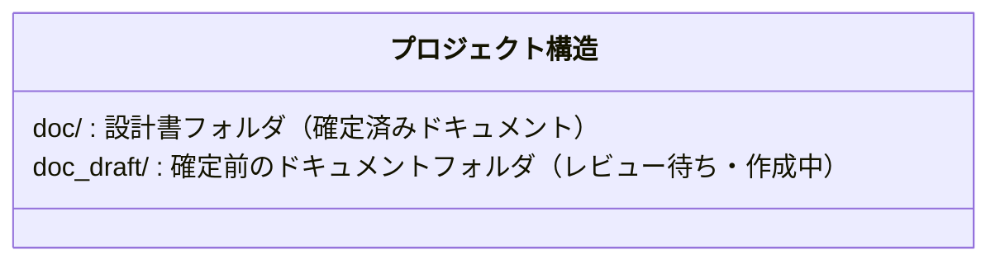
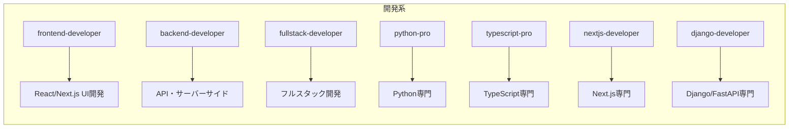
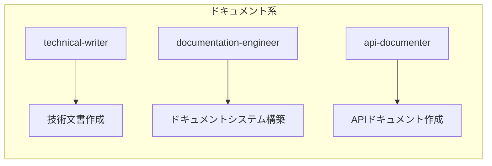

# Claude Code プロジェクト設定

このファイルは Claude Code がプロジェクトを理解するための設定ファイルです。

## プロジェクト概要

Web版Claude Codeプロジェクト - Claude Agent SDK (Python) を使用したWebベースのコーディングアシスタント

## ドキュメント作成ルール（必須）

## 実行ルール
project-managerを基本的に利用して最適なエージェントを実行して作業を行う

### Mermaid使用の強制

**重要：ドキュメント内の全てでMermaidダイアグラムを使用すること**

**このルールはサブエージェント使用時も適用されます。**

## ディレクトリ構造



## エージェント（Agent）設定

### 利用可能なエージェント一覧

Claude Codeでは、Task toolを使用して専門エージェントを起動できます。

```mermaid
flowchart LR
    subgraph 探索・計画系
        E1[Explore] --> E1D[コードベース探索]
        E2[Plan] --> E2D[実装計画の設計]
        E3[general-purpose] --> E3D[汎用調査・マルチステップ]
        E4[claude-code-guide] --> E4D[SDK/APIガイド]
    end
```



```mermaid
flowchart LR
    subgraph 品質・レビュー系
        Q1[code-reviewer] --> Q1D[コードレビュー]
        Q2[test-automator] --> Q2D[テスト自動化]
        Q3[qa-expert] --> Q3D[QA・テスト戦略]
        Q4[debugger] --> Q4D[問題診断・根本原因分析]
        Q5[performance-engineer] --> Q5D[パフォーマンス最適化]
    end
```



```mermaid
flowchart LR
    subgraph DevOps・インフラ系
        O1[devops-engineer] --> O1D[CI/CD・自動化]
        O2[kubernetes-specialist] --> O2D[Kubernetes]
        O3[docker] --> O3D[Docker環境構築]
        O4[security-engineer] --> O4D[セキュリティ・DevSecOps]
    end
```

```mermaid
flowchart LR
    subgraph データ・AI系
        A1[data-analyst] --> A1D[データ分析・BI]
        A2[sql-pro] --> A2D[SQL最適化]
        A3[postgres-pro] --> A3D[PostgreSQL専門]
        A4[prompt-engineer] --> A4D[プロンプト設計]
        A5[mcp-developer] --> A5D[MCPサーバー/クライアント]
    end
```

### 自動エージェント使用ルール

以下のタスクでは、対応するエージェントを**自動的に使用**してください：

1. **コードベース探索時** → `Explore` エージェント
   - 「〜はどこにある？」「構造を教えて」などの質問時

2. **実装計画が必要な場合** → `Plan` エージェント
   - 新機能追加、大規模リファクタリングの前

3. **コード作成後** → `code-reviewer` エージェント
   - 重要なコード変更後は自動レビュー

4. **テスト作成時** → `test-automator` エージェント
   - ユニットテスト・統合テスト作成時

5. **ドキュメント作成時** → `technical-writer` エージェント
   - 設計書・README作成時

6. **MCP開発時** → `mcp-developer` エージェント
   - MCPサーバー/クライアント実装時
