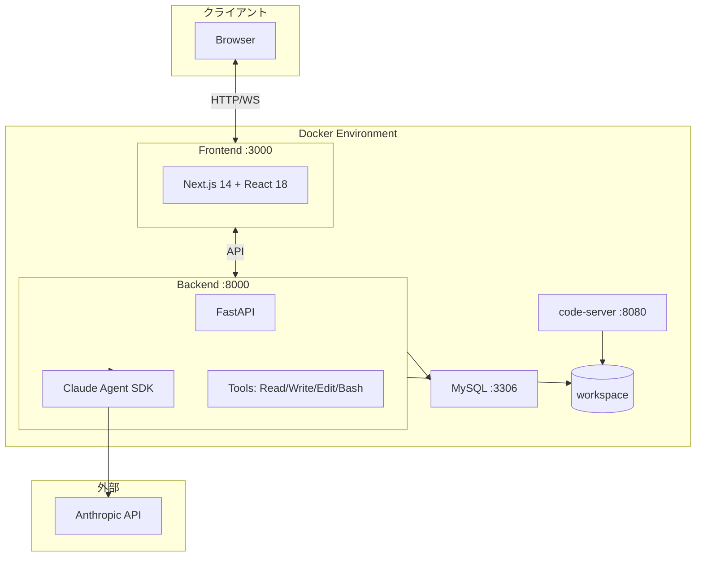
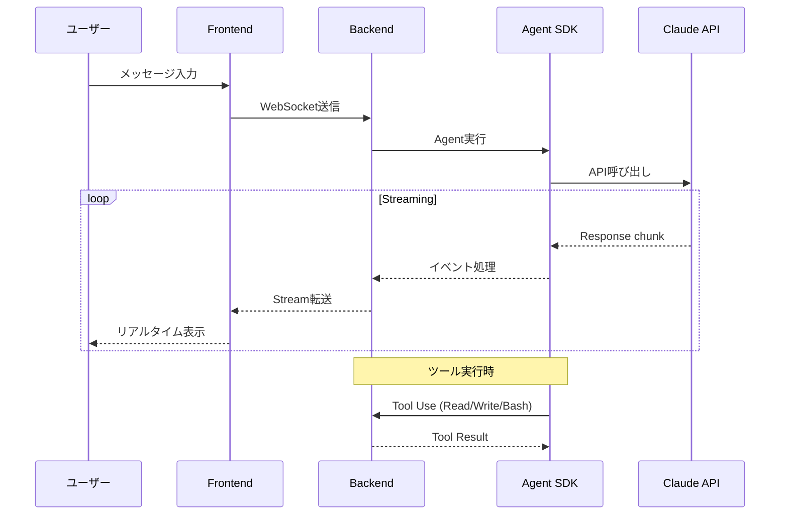

# Web版 Claude Code

Claude Agent SDK (Python) を使用したWebベースのコーディングアシスタント

---

## 目次

- [概要](#概要)
- [主な機能](#主な機能)
- [システム要件](#システム要件)
- [クイックスタート](#クイックスタート)
- [アーキテクチャ](#アーキテクチャ)
- [技術スタック](#技術スタック)
- [環境変数](#環境変数)
- [Makefileコマンド](#makefileコマンド)
- [開発環境](#開発環境)
- [トラブルシューティング](#トラブルシューティング)
- [セキュリティ](#セキュリティ)
- [ドキュメント](#ドキュメント)
- [ライセンス](#ライセンス)

---

## 概要

このプロジェクトは、ブラウザからアクセスできるClaudeベースのコーディングアシスタントです。React/Next.jsフロントエンドとFastAPIバックエンドを組み合わせ、リアルタイムでコードの質問、生成、レビュー、デバッグが可能です。

---

## 主な機能

| 機能 | 説明 |
|------|------|
| リアルタイムストリーミングチャット | Claudeとのリアルタイム会話、中断・再開対応 |
| セッション再開（Resume） | ブラウザ更新後も会話コンテキストを維持（SDK session_id使用） |
| ファイル操作 | Read/Write/Edit ツール統合 |
| Bashコマンド実行 | コンテナ内でのコマンド実行 |
| VSCode Web統合 | code-server によるブラウザベースエディタ |
| プロジェクト・セッション管理 | マルチプロジェクト、セッション履歴保存 |
| MCP サーバー統合 | Model Context Protocol サーバー連携 |
| カスタムエージェント | プロジェクト固有のエージェント設定 |
| 外部公開機能 | プロジェクトを外部ユーザーに公開 |
| APIキー管理 | プロジェクトごとのAPIキー設定 |
| Docker-in-Docker | 分離されたコード実行環境、安全なコンテナ実行 |

---

## システム要件

| 要件 | バージョン |
|------|-----------|
| Docker | 24.0+ |
| Docker Compose | 2.x |
| メモリ | 8GB以上推奨 |

---

## クイックスタート

### 1. リポジトリのクローン

```bash
git clone <repository-url>
cd AGENTSDK
```

### 2. 環境変数の設定

```bash
# .env.exampleをコピー
cp .env.example .env

# .envファイルを編集
# SECRET_KEY: セキュリティキー (openssl rand -hex 32で生成)
```

> **Note**: APIキーはプロジェクトごとにWeb UIから設定します。環境変数での設定は不要です。

### 3. サービスの起動

#### 標準構成

```bash
# Makefileを使用
make up

# または直接docker-composeを使用
docker-compose up -d
```

#### DinD環境付き（コード実行環境が必要な場合）

```bash
# DinD環境を含めて起動
make up-with-dind

# または
docker-compose -f docker-compose.yml -f docker-compose.dind.yml up -d
```

### 4. アクセス

| サービス | URL | 説明 |
|----------|-----|------|
| Frontend | http://localhost:3000 | メインUI |
| Backend API | http://localhost:8000 | REST API |
| API Documentation | http://localhost:8000/docs | Swagger UI |
| code-server | http://localhost:8080 | VSCode Web |

### 5. 初回セットアップ

1. http://localhost:3000 にアクセス
2. ユーザー登録/ログイン
3. プロジェクトを作成
4. プロジェクト設定でAPIキーを登録
5. チャットを開始

詳細な手順は [利用手順書](doc/getting-started.md) を参照してください。

---

## アーキテクチャ



### データフロー



---

## 技術スタック

| レイヤー | 技術 |
|----------|------|
| Frontend | React 18, Next.js 14, TypeScript, TailwindCSS, Zustand |
| Backend | Python 3.11, FastAPI, Claude Agent SDK, Uvicorn, SQLAlchemy 2.x |
| Database | MySQL 8.0 |
| Infrastructure | Docker 24+, Docker Compose 2.x |
| IDE | code-server (VSCode Web) |
| Optional | Docker-in-Docker (安全なコード実行環境) |

---

## 環境変数

主要な環境変数（`.env`ファイル）:

| 変数名 | 説明 | デフォルト |
|--------|------|-----------|
| SECRET_KEY | セキュリティキー (32文字以上) | **必須** |
| FRONTEND_PORT | フロントエンドポート | 3000 |
| BACKEND_PORT | バックエンドポート | 8000 |
| MYSQL_PORT | MySQLポート | 3306 |
| BUILD_TARGET | ビルドターゲット | production |
| DEBUG | デバッグモード | false |
| CLAUDE_MODEL | デフォルトモデル | claude-sonnet-4-20250514 |

> **Note**: `ANTHROPIC_API_KEY` は環境変数ではなく、プロジェクト設定画面から登録します。

完全なリストは `.env.example` を参照してください。

---

## Makefileコマンド

| コマンド | 説明 |
|----------|------|
| `make help` | ヘルプ表示 |
| `make build` | イメージビルド |
| `make up` | サービス起動 |
| `make down` | サービス停止 |
| `make restart` | サービス再起動 |
| `make logs` | ログ表示 |
| `make dev` | 開発モードで起動 |
| `make up-with-dind` | DinD環境付きで起動 |
| `make clean` | リソース削除 |
| `make status` | サービス状態確認 |

---

## 開発環境

### 開発モードで起動

```bash
# 開発モード（ホットリロード有効）
make dev

# または
docker-compose -f docker-compose.yml -f docker-compose.dev.yml up -d
```

### ログの確認

```bash
# 全サービスのログ
make logs

# バックエンドのみ
make logs-backend

# フロントエンドのみ
make logs-frontend
```

### コンテナ内でシェルを開く

```bash
# バックエンド
make shell-backend

# フロントエンド
make shell-frontend
```

---

## トラブルシューティング

### サービスが起動しない

```bash
# ログを確認
docker-compose logs backend

# 環境変数を確認
cat .env
```

### ポート競合

`.env`ファイルでポートを変更:

```
FRONTEND_PORT=3001
BACKEND_PORT=8001
```

### ワークスペースのパーミッションエラー

```bash
# ワークスペースの所有者を変更
sudo chown -R 1000:1000 ./workspace
```

### データベース接続エラー

```bash
# MySQLの状態確認
docker-compose logs mysql

# MySQLコンテナに接続
docker-compose exec mysql mysql -uclaude -p
```

---

## セキュリティ

| 項目 | 説明 |
|------|------|
| 実行ユーザー | 全サービスが非rootユーザーで実行 |
| APIキー管理 | プロジェクトごとにDB保存（暗号化推奨） |
| CORS | オリジン制限設定 |
| レート制限 | APIレート制限実装 |
| ファイルアクセス | ワークスペース外のアクセス制限 |

---

## ドキュメント

本プロジェクトには包括的な技術ドキュメントが用意されています。

### ガイド

| ドキュメント | 説明 |
|-------------|------|
| [利用手順書](doc/getting-started.md) | 初回セットアップから基本操作まで（スクリーンショット付き） |
| [ユーザーガイド](doc/user-guide.md) | 全機能の詳細説明 |
| [デプロイガイド](doc/deployment-guide.md) | 本番環境へのデプロイ手順 |

### システム設計

| ドキュメント | 説明 |
|-------------|------|
| [概要設計書](doc/overview-design.md) | プロジェクト概要、機能一覧 |
| [アーキテクチャ設計書](doc/architecture-design.md) | システム全体設計、技術スタック |
| [バックエンド設計書](doc/backend-design.md) | FastAPI、API設計、WebSocket |
| [フロントエンド設計書](doc/frontend-design.md) | React/Next.js、状態管理 |
| [データベース設計書](doc/database-design.md) | ER図、テーブル定義 |
| [Docker設計書](doc/docker-design.md) | コンテナ構成、ネットワーク |
| [認証設計書](doc/authentication-design.md) | 認証・認可、JWT |

### UI/UX設計

| ドキュメント | 説明 |
|-------------|------|
| [画面設計書](doc/screen-design.md) | 画面レイアウト、遷移 |
| [デザインシステム](doc/frontend-design-system.md) | カラー、タイポグラフィ |
| [コンポーネント設計書](doc/frontend-component-design.md) | Atomic Design、コンポーネント仕様 |
| [Tailwind CSS設定](doc/tailwind-config-design.md) | Tailwind設定、テーマ |
| [フィードバックコンポーネント](doc/frontend-feedback-components.md) | Toast、Modal等 |

### 機能設計

| ドキュメント | 説明 |
|-------------|------|
| [外部公開機能設計書](doc/public-access-design.md) | プロジェクト公開機能 |
| [ユーザー設定設計書](doc/user-settings-design.md) | ユーザー設定機能 |
| [GitHub連携設計書](doc/github-integration-design.md) | GitHub連携機能 |
| [WebSocket統合](doc/frontend-websocket-integration.md) | WebSocket実装詳細 |

### Docker-in-Docker (DinD)

| ドキュメント | 説明 |
|-------------|------|
| [DinD設計書](doc/dind-design.md) | DinDアーキテクチャ・セキュリティ |
| [DinDセットアップガイド](doc/dind-setup-guide.md) | DinD環境構築手順 |
| [DinD Executor使用ガイド](doc/dind-executor-usage.md) | コード実行環境の使い方 |
| [DinD実装概要](doc/dind-implementation-summary.md) | 実装詳細 |
| [DinD変更概要](doc/dind-changes-summary.md) | 変更履歴 |

### 開発・進捗

| ドキュメント | 説明 |
|-------------|------|
| [ユーザー操作一覧](doc/user-operations.md) | 全操作リファレンス |
| [Claude Agent SDK調査](doc/claude-agent-sdk-research.md) | SDK調査結果 |
| [開発ロードマップ](doc/development-roadmap.md) | 開発計画 |
| [実装進捗](doc/implementation-progress.md) | 実装状況 |
| [リファクタリング計画](doc/refactoring-2025-01.md) | 2025年1月 |

### 外部リソース

| リソース | URL |
|----------|-----|
| Claude Agent SDK | https://github.com/anthropics/anthropic-sdk-python |
| FastAPI | https://fastapi.tiangolo.com/ |
| Next.js | https://nextjs.org/docs |
| SQLAlchemy | https://docs.sqlalchemy.org/ |

---

## ライセンス

MIT License

---

## サポート

問題が発生した場合:

1. ログを確認: `make logs`
2. サービス状態確認: `make status`
3. [トラブルシューティング](#トラブルシューティング) を確認
4. Issueを作成
