# Web版Claude Code プロジェクト設計書

**作成日:** 2025-12-20
**最終更新:** 2025-12-21
**バージョン:** 1.1
**ステータス:** ✅ 完了（100%）

---

## 1. システム概要

### 1.1 プロジェクト目的
WebブラウザからアクセスできるClaudeベースのコーディングアシスタントを構築します。Claude Agent SDK (Python) を使用し、ユーザーがコードの質問、生成、レビュー、デバッグなどをリアルタイムで行えるWebアプリケーションです。

### 1.2 アーキテクチャ図

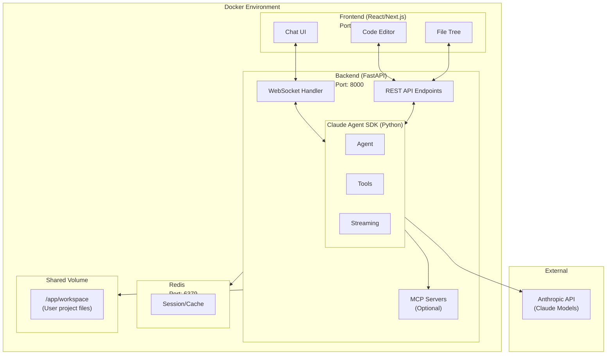

---

## 2. 技術スタック選定

### 2.1 バックエンド

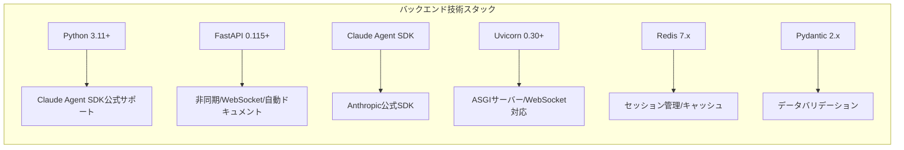

### 2.2 フロントエンド

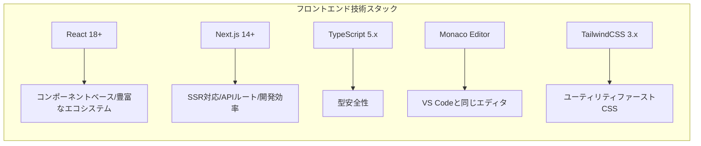

### 2.3 インフラ

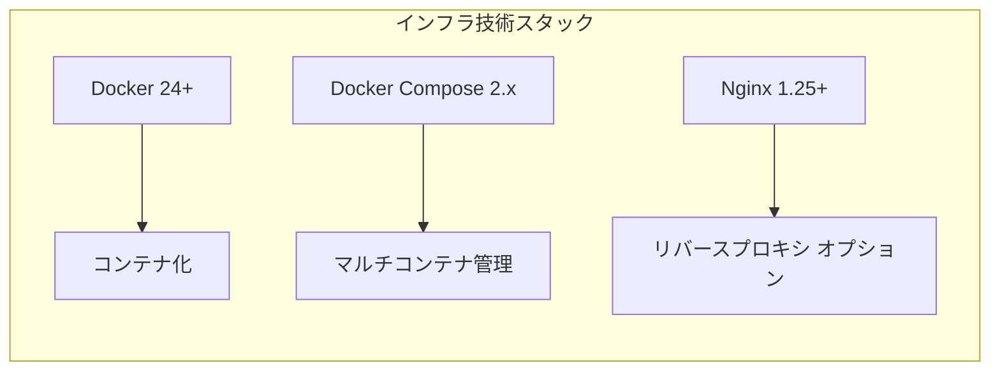

---

## 3. コンポーネント設計

### 3.1 バックエンドコンポーネント

```
backend/
├── app/
│   ├── __init__.py
│   ├── main.py                 # FastAPI アプリケーションエントリポイント
│   ├── config.py               # 環境設定
│   ├── api/
│   │   ├── __init__.py
│   │   ├── routes/
│   │   │   ├── __init__.py
│   │   │   ├── chat.py         # チャット関連エンドポイント
│   │   │   ├── files.py        # ファイル操作エンドポイント
│   │   │   ├── sessions.py     # セッション管理
│   │   │   └── health.py       # ヘルスチェック
│   │   └── websocket/
│   │       ├── __init__.py
│   │       └── handlers.py     # WebSocketハンドラー
│   ├── core/
│   │   ├── __init__.py
│   │   ├── claude_client.py    # Claude Agent SDK ラッパー
│   │   ├── session_manager.py  # セッション管理
│   │   └── tools.py            # カスタムツール定義
│   ├── models/
│   │   ├── __init__.py
│   │   ├── messages.py         # メッセージモデル
│   │   └── sessions.py         # セッションモデル
│   └── services/
│       ├── __init__.py
│       ├── chat_service.py     # チャットビジネスロジック
│       └── file_service.py     # ファイル操作ロジック
├── requirements.txt
├── Dockerfile
└── .env.example
```

### 3.2 フロントエンドコンポーネント

```
frontend/
├── src/
│   ├── app/
│   │   ├── layout.tsx          # ルートレイアウト
│   │   ├── page.tsx            # メインページ
│   │   └── globals.css
│   ├── components/
│   │   ├── chat/
│   │   │   ├── ChatContainer.tsx
│   │   │   ├── MessageList.tsx
│   │   │   ├── MessageInput.tsx
│   │   │   └── MessageBubble.tsx
│   │   ├── editor/
│   │   │   ├── CodeEditor.tsx  # Monaco Editor ラッパー
│   │   │   └── FileTree.tsx
│   │   ├── layout/
│   │   │   ├── Header.tsx
│   │   │   ├── Sidebar.tsx
│   │   │   └── MainLayout.tsx
│   │   └── common/
│   │       ├── Button.tsx
│   │       ├── Modal.tsx
│   │       └── Loading.tsx
│   ├── hooks/
│   │   ├── useWebSocket.ts     # WebSocket接続管理
│   │   ├── useChat.ts          # チャット状態管理
│   │   └── useFiles.ts         # ファイル状態管理
│   ├── lib/
│   │   ├── api.ts              # API クライアント
│   │   └── websocket.ts        # WebSocket クライアント
│   ├── stores/
│   │   ├── chatStore.ts        # Zustand ストア
│   │   └── fileStore.ts
│   └── types/
│       ├── message.ts
│       └── session.ts
├── package.json
├── Dockerfile
└── next.config.js
```

---

## 4. API設計

### 4.1 REST API エンドポイント

#### 4.1.1 セッション管理

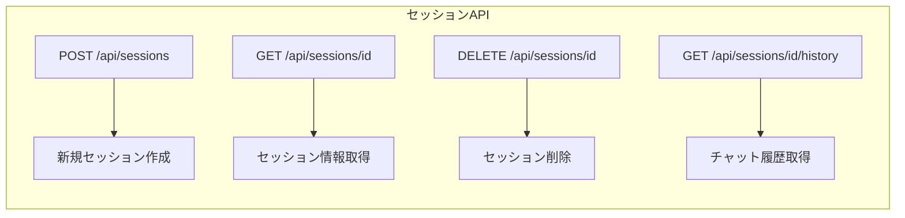

#### 4.1.2 ファイル操作

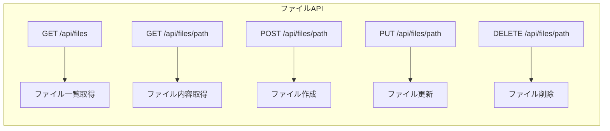

#### 4.1.3 システム

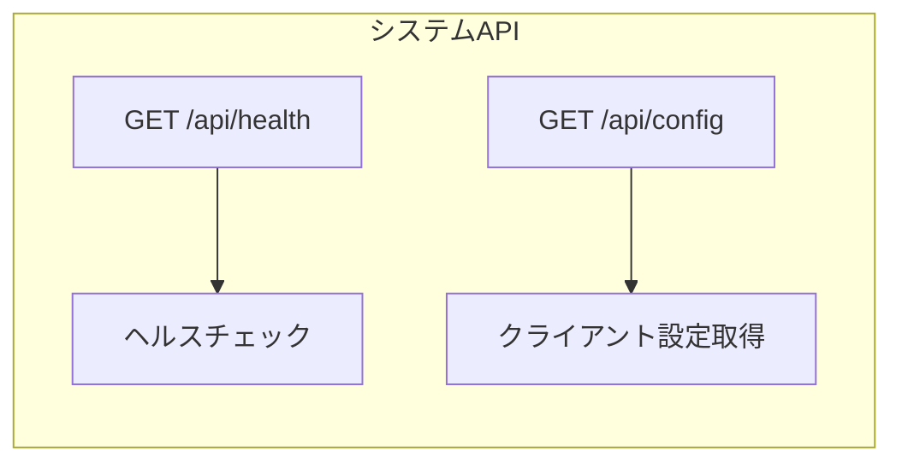

### 4.2 WebSocket API

#### 4.2.1 接続

```
ws://localhost:8000/ws/chat/{session_id}
```

#### 4.2.2 メッセージフォーマット

**クライアント -> サーバー:**

```json
// チャットメッセージ送信
{
  "type": "chat",
  "content": "Pythonでフィボナッチ数列を計算する関数を書いてください"
}

// 処理中断
{
  "type": "interrupt"
}

// ファイル添付
{
  "type": "chat",
  "content": "このコードをレビューしてください",
  "files": [
    {"path": "main.py", "content": "..."}
  ]
}
```

**サーバー -> クライアント:**

```json
// テキストレスポンス (ストリーミング)
{
  "type": "text",
  "content": "フィボナッチ数列を計算する..."
}

// ツール使用通知
{
  "type": "tool_use",
  "tool": "Write",
  "input": {"path": "fibonacci.py", "content": "..."}
}

// ツール結果
{
  "type": "tool_result",
  "tool_use_id": "xxx",
  "success": true,
  "output": "ファイルを作成しました"
}

// 完了通知
{
  "type": "result",
  "cost": 0.0123,
  "usage": {
    "input_tokens": 500,
    "output_tokens": 1200
  }
}

// エラー
{
  "type": "error",
  "message": "エラーが発生しました"
}
```

---

## 5. データフロー

### 5.1 チャットメッセージフロー

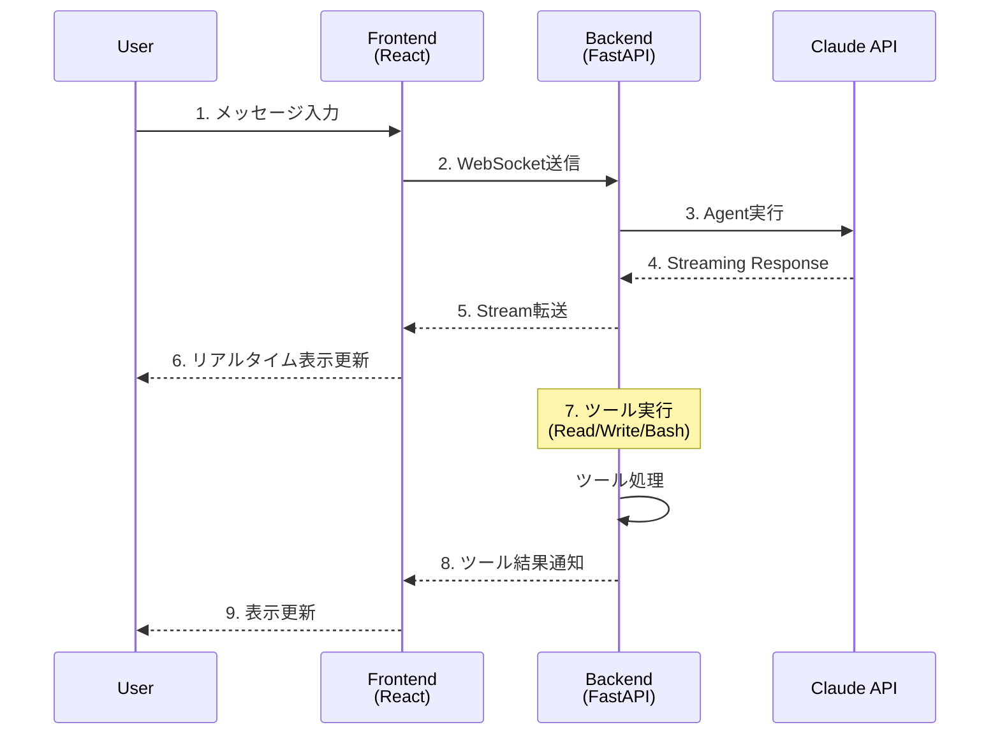

---

## 6. セキュリティ考慮事項

### 6.1 セキュリティチェックリスト

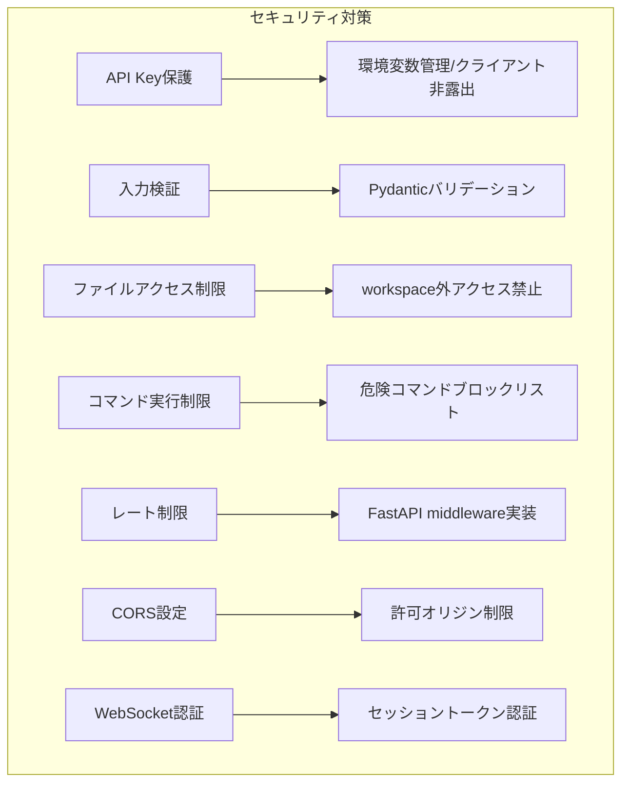

### 6.2 環境変数管理

```env
# .env.example
ANTHROPIC_API_KEY=sk-ant-xxx
REDIS_URL=redis://redis:6379
WORKSPACE_PATH=/app/workspace
MAX_SESSIONS=100
SESSION_TIMEOUT=3600
ALLOWED_ORIGINS=http://localhost:3000
DEBUG=false
```

---

## 7. Docker構成

### 7.1 docker-compose.yml

```yaml
version: '3.8'

services:
  frontend:
    build:
      context: ./frontend
      dockerfile: Dockerfile
    ports:
      - "3000:3000"
    environment:
      - NEXT_PUBLIC_API_URL=http://localhost:8000
      - NEXT_PUBLIC_WS_URL=ws://localhost:8000
    depends_on:
      - backend
    networks:
      - claude-network

  backend:
    build:
      context: ./backend
      dockerfile: Dockerfile
    ports:
      - "8000:8000"
    environment:
      - ANTHROPIC_API_KEY=${ANTHROPIC_API_KEY}
      - REDIS_URL=redis://redis:6379
      - WORKSPACE_PATH=/app/workspace
      - ALLOWED_ORIGINS=http://localhost:3000
    depends_on:
      - redis
    volumes:
      - workspace-data:/app/workspace
    networks:
      - claude-network

  redis:
    image: redis:7-alpine
    ports:
      - "6379:6379"
    volumes:
      - redis-data:/data
    command: redis-server --appendonly yes
    networks:
      - claude-network

volumes:
  workspace-data:
  redis-data:

networks:
  claude-network:
    driver: bridge
```

---

## 8. 実装優先順位

### Phase 1: MVP
1. FastAPI基本セットアップ
2. Claude Agent SDK 統合
3. WebSocket基本実装
4. シンプルなReactチャットUI
5. Docker環境構築

### Phase 2: コア機能
1. セッション管理 (Redis)
2. ファイル操作API
3. Monaco Editorの統合
4. ツール使用の可視化
5. エラーハンドリング強化

### Phase 3: 拡張機能
1. 認証・認可
2. チャット履歴保存
3. カスタムMCPツール
4. レート制限
5. モニタリング・ログ

---

## 9. 重要ファイル一覧

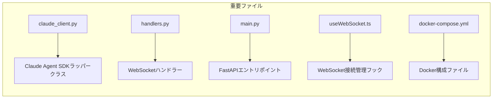

---

## 変更履歴

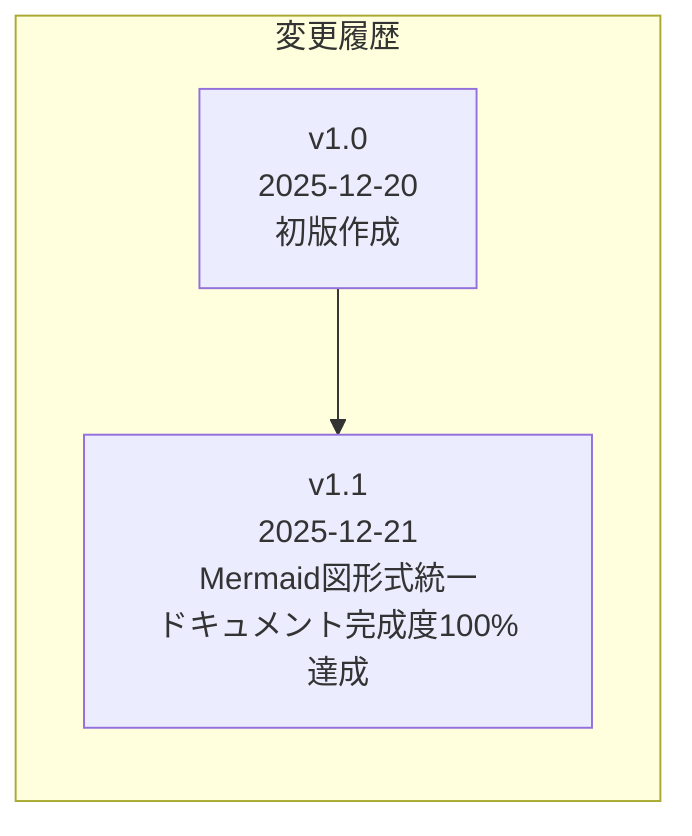

---

**ドキュメント管理情報**

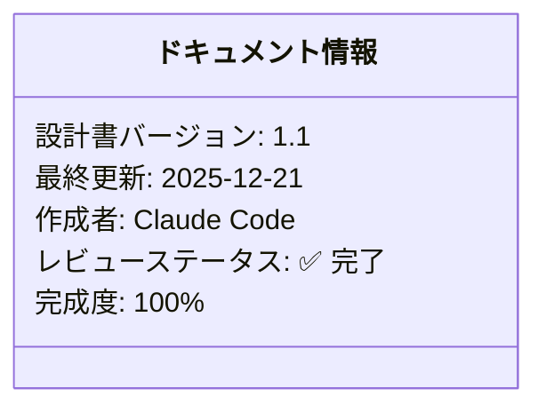
