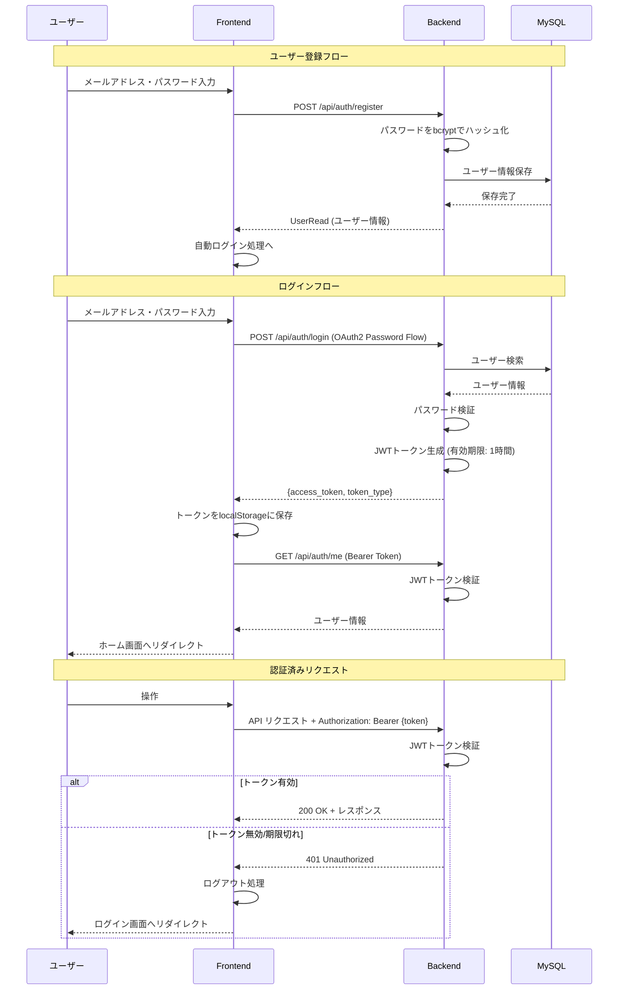
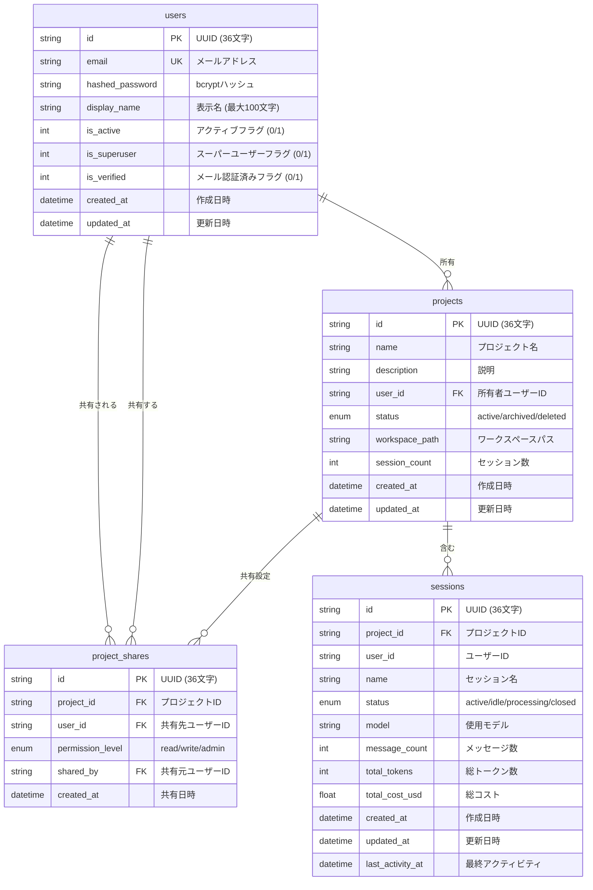
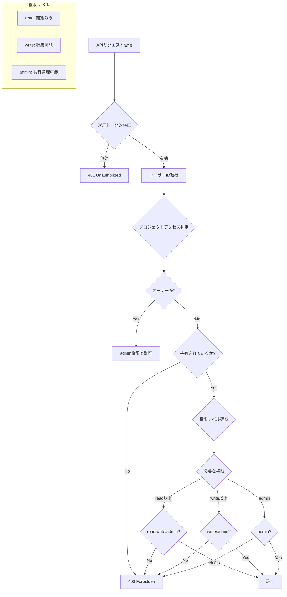
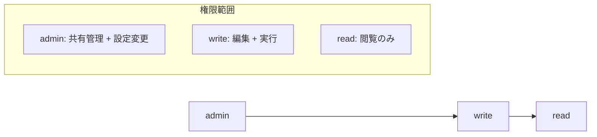

# 認証機能設計書

## 目次

- [1. 概要](#1-概要)
  - [1.1 採用技術](#11-採用技術)
  - [1.2 主要機能](#12-主要機能)
- [2. アーキテクチャ図](#2-アーキテクチャ図)
  - [2.1 認証フロー](#21-認証フロー)
  - [2.2 データモデル (ER図)](#22-データモデル-er図)
  - [2.3 プロジェクトアクセス制御フロー](#23-プロジェクトアクセス制御フロー)
- [3. データベーススキーマ](#3-データベーススキーマ)
  - [3.1 users テーブル](#31-users-テーブル)
  - [3.2 project_shares テーブル](#32-project_shares-テーブル)
  - [3.3 projects テーブル（認証関連の修正点）](#33-projects-テーブル認証関連の修正点)
- [4. APIエンドポイント一覧](#4-apiエンドポイント一覧)
  - [4.1 認証API](#41-認証api)
  - [4.2 共有API](#42-共有api)
- [5. 権限マトリックス](#5-権限マトリックス)
  - [5.1 プロジェクト操作権限](#51-プロジェクト操作権限)
  - [5.2 権限レベルの継承関係](#52-権限レベルの継承関係)
- [6. フロントエンド構成](#6-フロントエンド構成)
  - [6.1 authStore (Zustand)](#61-authstore-zustand)
  - [6.2 AuthGuard コンポーネント](#62-authguard-コンポーネント)
  - [6.3 ログイン/登録ページ](#63-ログイン登録ページ)
- [7. 使用方法](#7-使用方法)
  - [7.1 会員登録の例](#71-会員登録の例)
  - [7.2 ログインの例](#72-ログインの例)
  - [7.3 プロジェクト共有の例](#73-プロジェクト共有の例)
- [8. セキュリティ考慮事項](#8-セキュリティ考慮事項)
  - [8.1 パスワードハッシュ化](#81-パスワードハッシュ化)
  - [8.2 JWTトークン](#82-jwtトークン)
  - [8.3 HTTPステータスコードとエラーハンドリング](#83-httpステータスコードとエラーハンドリング)
  - [8.4 セキュリティベストプラクティス](#84-セキュリティベストプラクティス)
- [9. 環境変数](#9-環境変数)
  - [9.1 必須設定](#91-必須設定)
  - [9.2 シークレットキーの生成方法](#92-シークレットキーの生成方法)
  - [9.3 .env ファイル例](#93-env-ファイル例)
- [10. 関連ファイル](#10-関連ファイル)
  - [10.1 バックエンド](#101-バックエンド)
  - [10.2 フロントエンド](#102-フロントエンド)
- [11. 今後の拡張予定](#11-今後の拡張予定)

---

## 1. 概要

本ドキュメントでは、AGENTSDKプロジェクトに実装された認証機能について説明します。

### 1.1 採用技術

| 項目 | 技術/ライブラリ | 説明 |
|------|----------------|------|
| 認証フレームワーク | FastAPI Users | ユーザー認証・管理の統合ライブラリ |
| 認証方式 | JWT (JSON Web Token) | ステートレスなトークンベース認証 |
| パスワードハッシュ | bcrypt | 安全なパスワードハッシュ化 |
| データベース | MySQL 8.0 | ユーザー情報の永続化 |
| フロントエンド状態管理 | Zustand | 認証状態のクライアント側管理 |

### 1.2 主要機能

- ユーザー登録（会員登録）
- ログイン/ログアウト
- JWTトークンによるセッション管理
- プロジェクト共有機能（read/write/admin権限）
- 権限ベースのアクセス制御

---

## 2. アーキテクチャ図

### 2.1 認証フロー



### 2.2 データモデル (ER図)



### 2.3 プロジェクトアクセス制御フロー



---

## 3. データベーススキーマ

### 3.1 users テーブル

```sql
CREATE TABLE users (
    id VARCHAR(36) PRIMARY KEY,
    email VARCHAR(255) NOT NULL UNIQUE,
    hashed_password VARCHAR(255) NOT NULL,
    display_name VARCHAR(100),
    is_active INT DEFAULT 1 NOT NULL,
    is_superuser INT DEFAULT 0 NOT NULL,
    is_verified INT DEFAULT 0 NOT NULL,
    created_at DATETIME NOT NULL,
    updated_at DATETIME NOT NULL,
    INDEX ix_users_email (email)
);
```

| カラム | 型 | 説明 | 制約 |
|--------|-----|------|------|
| id | VARCHAR(36) | ユーザーID (UUID) | PRIMARY KEY |
| email | VARCHAR(255) | メールアドレス | NOT NULL, UNIQUE |
| hashed_password | VARCHAR(255) | bcryptハッシュ化パスワード | NOT NULL |
| display_name | VARCHAR(100) | 表示名 | NULL可 |
| is_active | INT | アクティブフラグ | DEFAULT 1 |
| is_superuser | INT | スーパーユーザーフラグ | DEFAULT 0 |
| is_verified | INT | メール認証済みフラグ | DEFAULT 0 |
| created_at | DATETIME | 作成日時 | NOT NULL |
| updated_at | DATETIME | 更新日時 | NOT NULL |

### 3.2 project_shares テーブル

```sql
CREATE TABLE project_shares (
    id VARCHAR(36) PRIMARY KEY,
    project_id VARCHAR(36) NOT NULL,
    user_id VARCHAR(36) NOT NULL,
    permission_level ENUM('read', 'write', 'admin') DEFAULT 'read' NOT NULL,
    shared_by VARCHAR(36),
    created_at DATETIME NOT NULL,
    FOREIGN KEY (project_id) REFERENCES projects(id) ON DELETE CASCADE,
    FOREIGN KEY (user_id) REFERENCES users(id) ON DELETE CASCADE,
    FOREIGN KEY (shared_by) REFERENCES users(id) ON DELETE SET NULL,
    UNIQUE KEY uq_project_shares_project_user (project_id, user_id),
    INDEX ix_project_shares_project_user (project_id, user_id),
    INDEX ix_project_shares_user_id (user_id)
);
```

| カラム | 型 | 説明 | 制約 |
|--------|-----|------|------|
| id | VARCHAR(36) | 共有ID (UUID) | PRIMARY KEY |
| project_id | VARCHAR(36) | プロジェクトID | NOT NULL, FK |
| user_id | VARCHAR(36) | 共有先ユーザーID | NOT NULL, FK |
| permission_level | ENUM | 権限レベル (read/write/admin) | DEFAULT 'read' |
| shared_by | VARCHAR(36) | 共有元ユーザーID | NULL可, FK |
| created_at | DATETIME | 共有日時 | NOT NULL |

### 3.3 projects テーブル（認証関連の修正点）

```sql
ALTER TABLE projects
    ADD COLUMN user_id VARCHAR(36),
    ADD FOREIGN KEY (user_id) REFERENCES users(id) ON DELETE SET NULL,
    ADD INDEX ix_projects_user_status (user_id, status);
```

| カラム | 型 | 説明 | 変更内容 |
|--------|-----|------|----------|
| user_id | VARCHAR(36) | 所有者ユーザーID | **追加**: ユーザーとの紐付け |

---

## 4. APIエンドポイント一覧

### 4.1 認証API

| メソッド | パス | 説明 | 認証 |
|---------|------|------|:----:|
| POST | `/api/auth/register` | 会員登録 | - |
| POST | `/api/auth/login` | ログイン | - |
| POST | `/api/auth/logout` | ログアウト | 必須 |
| GET | `/api/auth/me` | 現在のユーザー情報取得 | 必須 |
| GET | `/api/auth/users/me` | 現在のユーザー情報取得 (FastAPI Users標準) | 必須 |
| PATCH | `/api/auth/users/me` | 現在のユーザー情報更新 | 必須 |
| GET | `/api/auth/users/{id}` | 指定ユーザー情報取得 | スーパーユーザー |
| PATCH | `/api/auth/users/{id}` | 指定ユーザー情報更新 | スーパーユーザー |
| DELETE | `/api/auth/users/{id}` | 指定ユーザー削除 | スーパーユーザー |

#### 会員登録 (POST /api/auth/register)

**リクエスト:**
```json
{
  "email": "user@example.com",
  "password": "securepassword123",
  "display_name": "John Doe"
}
```

**レスポンス (201 Created):**
```json
{
  "id": "550e8400-e29b-41d4-a716-446655440000",
  "email": "user@example.com",
  "display_name": "John Doe",
  "is_active": true,
  "is_superuser": false,
  "is_verified": false
}
```

#### ログイン (POST /api/auth/login)

**リクエスト (application/x-www-form-urlencoded):**
```
username=user@example.com&password=securepassword123
```

**レスポンス (200 OK):**
```json
{
  "access_token": "eyJhbGciOiJIUzI1NiIsInR5cCI6IkpXVCJ9...",
  "token_type": "bearer"
}
```

#### 現在のユーザー情報取得 (GET /api/auth/me)

**ヘッダー:**
```
Authorization: Bearer {access_token}
```

**レスポンス (200 OK):**
```json
{
  "id": "550e8400-e29b-41d4-a716-446655440000",
  "email": "user@example.com",
  "display_name": "John Doe",
  "is_active": true,
  "is_superuser": false,
  "is_verified": false
}
```

### 4.2 共有API

| メソッド | パス | 説明 | 認証 | 必要権限 |
|---------|------|------|:----:|:--------:|
| POST | `/api/projects/{id}/shares` | 共有追加 | 必須 | admin |
| GET | `/api/projects/{id}/shares` | 共有一覧取得 | 必須 | read以上 |
| PUT | `/api/projects/{id}/shares/{user_id}` | 共有権限更新 | 必須 | admin |
| DELETE | `/api/projects/{id}/shares/{user_id}` | 共有解除 | 必須 | admin/自分 |

#### 共有追加 (POST /api/projects/{id}/shares)

**リクエスト:**
```json
{
  "email": "collaborator@example.com",
  "permission_level": "write"
}
```

**レスポンス (201 Created):**
```json
{
  "id": "660e8400-e29b-41d4-a716-446655440001",
  "project_id": "770e8400-e29b-41d4-a716-446655440002",
  "user_id": "880e8400-e29b-41d4-a716-446655440003",
  "user_email": "collaborator@example.com",
  "user_name": "Collaborator Name",
  "permission_level": "write",
  "shared_by": "550e8400-e29b-41d4-a716-446655440000",
  "shared_by_email": "owner@example.com",
  "created_at": "2025-01-15T10:30:00Z"
}
```

#### 共有一覧取得 (GET /api/projects/{id}/shares)

**レスポンス (200 OK):**
```json
{
  "shares": [
    {
      "id": "660e8400-e29b-41d4-a716-446655440001",
      "project_id": "770e8400-e29b-41d4-a716-446655440002",
      "user_id": "880e8400-e29b-41d4-a716-446655440003",
      "user_email": "collaborator@example.com",
      "user_name": "Collaborator Name",
      "permission_level": "write",
      "shared_by": "550e8400-e29b-41d4-a716-446655440000",
      "shared_by_email": "owner@example.com",
      "created_at": "2025-01-15T10:30:00Z"
    }
  ],
  "total": 1
}
```

---

## 5. 権限マトリックス

### 5.1 プロジェクト操作権限

| 操作 | 所有者 | admin | write | read |
|------|:------:|:-----:|:-----:|:----:|
| プロジェクト閲覧 | Yes | Yes | Yes | Yes |
| セッション一覧 | Yes | Yes | Yes | Yes |
| メッセージ閲覧 | Yes | Yes | Yes | Yes |
| セッション作成 | Yes | Yes | Yes | No |
| メッセージ送信 | Yes | Yes | Yes | No |
| ファイル編集 | Yes | Yes | Yes | No |
| プロジェクト編集 | Yes | Yes | No | No |
| 共有一覧取得 | Yes | Yes | Yes | Yes |
| 共有追加 | Yes | Yes | No | No |
| 共有権限変更 | Yes | Yes | No | No |
| 共有解除 | Yes | Yes | No | 自分のみ |
| プロジェクト削除 | Yes | No | No | No |

### 5.2 権限レベルの継承関係



---

## 6. フロントエンド構成

### 6.1 authStore (Zustand)

**ファイル:** `src/frontend/src/stores/authStore.ts`

```typescript
interface AuthState {
  user: User | null;           // 現在のユーザー情報
  accessToken: string | null;  // JWTアクセストークン
  isAuthenticated: boolean;    // 認証状態
  isLoading: boolean;          // ローディング状態
  error: string | null;        // エラーメッセージ

  login: (email: string, password: string) => Promise<void>;
  register: (email: string, password: string, displayName?: string) => Promise<void>;
  logout: () => Promise<void>;
  checkAuth: () => Promise<void>;
  clearError: () => void;
  setAccessToken: (token: string | null) => void;
}
```

**永続化設定:**
- ストレージ名: `auth-storage`
- 保存項目: `accessToken`, `user`, `isAuthenticated`
- ストレージ: localStorage

### 6.2 AuthGuard コンポーネント

**ファイル:** `src/frontend/src/components/AuthGuard.tsx`

認証が必要なページを保護するラッパーコンポーネント。

```tsx
import { AuthGuard } from '@/components/AuthGuard';

export default function ProtectedPage() {
  return (
    <AuthGuard>
      <div>認証が必要なコンテンツ</div>
    </AuthGuard>
  );
}
```

**動作フロー:**

```mermaid
flowchart TD
    A[AuthGuard マウント] --> B[checkAuth 実行]
    B --> C{トークン存在?}
    C -->|No| D[isAuthenticated = false]
    C -->|Yes| E[/api/auth/me 呼び出し]
    E --> F{レスポンス}
    F -->|200 OK| G[ユーザー情報設定]
    F -->|401 Error| H[トークンクリア]
    G --> I[isInitialized = true]
    H --> D
    D --> I
    I --> J{isAuthenticated?}
    J -->|Yes| K[children をレンダリング]
    J -->|No| L[/login へリダイレクト]
```

### 6.3 ログイン/登録ページ

| ページ | パス | ファイル |
|--------|------|----------|
| ログイン | `/login` | `src/frontend/src/app/login/page.tsx` |
| 会員登録 | `/register` | `src/frontend/src/app/register/page.tsx` |

**バリデーション:**

| フィールド | ルール |
|-----------|--------|
| email | 必須、有効なメールアドレス形式 |
| password | 必須、8文字以上 |
| confirmPassword | 登録時のみ、passwordと一致 |
| display_name | オプション、最大100文字 |

---

## 7. 使用方法

### 7.1 会員登録の例

**cURL:**
```bash
curl -X POST http://localhost:8000/api/auth/register \
  -H "Content-Type: application/json" \
  -d '{
    "email": "newuser@example.com",
    "password": "securepassword123",
    "display_name": "New User"
  }'
```

**JavaScript:**
```javascript
const response = await fetch('/api/auth/register', {
  method: 'POST',
  headers: {
    'Content-Type': 'application/json',
  },
  body: JSON.stringify({
    email: 'newuser@example.com',
    password: 'securepassword123',
    display_name: 'New User',
  }),
});

const user = await response.json();
console.log('Registered user:', user);
```

### 7.2 ログインの例

**cURL:**
```bash
curl -X POST http://localhost:8000/api/auth/login \
  -H "Content-Type: application/x-www-form-urlencoded" \
  -d "username=user@example.com&password=securepassword123"
```

**JavaScript:**
```javascript
const formData = new URLSearchParams();
formData.append('username', 'user@example.com');
formData.append('password', 'securepassword123');

const response = await fetch('/api/auth/login', {
  method: 'POST',
  headers: {
    'Content-Type': 'application/x-www-form-urlencoded',
  },
  body: formData.toString(),
});

const { access_token, token_type } = await response.json();
console.log('Access token:', access_token);
```

### 7.3 プロジェクト共有の例

**共有追加:**
```bash
curl -X POST "http://localhost:8000/api/projects/{project_id}/shares?current_user_id={your_user_id}" \
  -H "Content-Type: application/json" \
  -H "Authorization: Bearer {access_token}" \
  -d '{
    "email": "collaborator@example.com",
    "permission_level": "write"
  }'
```

**共有一覧取得:**
```bash
curl -X GET "http://localhost:8000/api/projects/{project_id}/shares?current_user_id={your_user_id}" \
  -H "Authorization: Bearer {access_token}"
```

**共有解除:**
```bash
curl -X DELETE "http://localhost:8000/api/projects/{project_id}/shares/{user_id}?current_user_id={your_user_id}" \
  -H "Authorization: Bearer {access_token}"
```

---

## 8. セキュリティ考慮事項

### 8.1 パスワードハッシュ化

- **アルゴリズム:** bcrypt
- **ソルト:** 自動生成（bcrypt内蔵）
- **ワークファクター:** FastAPI Users デフォルト値

```python
# パスワードハッシュ化は FastAPI Users が自動で行う
# 手動でのハッシュ化は不要
```

### 8.2 JWTトークン

| 項目 | 設定値 |
|------|--------|
| アルゴリズム | HS256 |
| 有効期限 | 3600秒 (1時間) |
| シークレットキー | 環境変数 `SECRET_KEY` |
| トランスポート | Bearer Token |

**トークン構造:**
```json
{
  "sub": "user_id",
  "aud": ["fastapi-users:auth"],
  "exp": 1704067200
}
```

### 8.3 HTTPステータスコードとエラーハンドリング

| ステータス | 説明 | 対応 |
|-----------|------|------|
| 401 Unauthorized | 認証失敗/トークン無効 | 再ログインを促す |
| 403 Forbidden | 権限不足 | エラーメッセージを表示 |
| 409 Conflict | メールアドレス重複 | 別のメールアドレスを使用 |

**フロントエンドでのエラーハンドリング:**
```typescript
// 401エラー時の処理
if (response.status === 401) {
  // トークンをクリアしてログイン画面へ
  set({
    user: null,
    accessToken: null,
    isAuthenticated: false,
  });
  router.push('/login');
}
```

### 8.4 セキュリティベストプラクティス

| 項目 | 実装状況 | 説明 |
|------|:--------:|------|
| パスワード最小長 | 8文字 | フロント・バックエンド両方で検証 |
| HTTPS | 本番環境で必須 | トークンの盗聴防止 |
| XSS対策 | React | JSXによる自動エスケープ |
| CSRF対策 | JWTベース | ステートレス認証のため不要 |
| トークン保存 | localStorage | HttpOnlyクッキー推奨（将来対応） |
| レート制限 | 設定可能 | DoS攻撃防止 |

---

## 9. 環境変数

### 9.1 必須設定

| 変数名 | 説明 | デフォルト値 | 本番環境での推奨 |
|--------|------|--------------|------------------|
| SECRET_KEY | JWTトークン署名用シークレットキー | `changeme-insecure-secret-key-for-development-only` | **必ず変更** |

### 9.2 シークレットキーの生成方法

```bash
# OpenSSLを使用
openssl rand -hex 32

# Pythonを使用
python -c "import secrets; print(secrets.token_hex(32))"
```

### 9.3 .env ファイル例

```env
# 認証設定
SECRET_KEY=your-generated-secret-key-here

# データベース設定
MYSQL_HOST=mysql
MYSQL_PORT=3306
MYSQL_USER=claude
MYSQL_PASSWORD=claude_password
MYSQL_DATABASE=claude_code

# セキュリティ設定
ALLOWED_ORIGINS=http://localhost:3000,https://your-domain.com
```

---

## 10. 関連ファイル

### 10.1 バックエンド

| ファイル | 説明 |
|----------|------|
| `src/backend/app/api/routes/auth.py` | 認証APIルーター |
| `src/backend/app/api/routes/shares.py` | 共有APIルーター |
| `src/backend/app/core/auth/backend.py` | JWT認証バックエンド設定 |
| `src/backend/app/core/auth/manager.py` | ユーザーマネージャー |
| `src/backend/app/core/auth/users.py` | FastAPIUsersインスタンス |
| `src/backend/app/models/database.py` | データベースモデル |
| `src/backend/app/models/user.py` | ユーザーPydanticモデル |
| `src/backend/app/schemas/user.py` | ユーザースキーマ |
| `src/backend/app/schemas/share.py` | 共有スキーマ |
| `src/backend/app/services/share_service.py` | 共有サービス |
| `src/backend/app/services/permission_service.py` | 権限サービス |

### 10.2 フロントエンド

| ファイル | 説明 |
|----------|------|
| `src/frontend/src/stores/authStore.ts` | 認証状態管理 |
| `src/frontend/src/lib/api/auth.ts` | 認証APIクライアント |
| `src/frontend/src/types/auth.ts` | 認証型定義 |
| `src/frontend/src/components/AuthGuard.tsx` | 認証ガードコンポーネント |
| `src/frontend/src/app/login/page.tsx` | ログインページ |
| `src/frontend/src/app/register/page.tsx` | 会員登録ページ |

---

## 11. 今後の拡張予定

| 機能 | 状態 | 説明 |
|------|:----:|------|
| パスワードリセット | 未実装 | メール送信機能が必要 |
| メール認証 | 未実装 | is_verified フラグの活用 |
| OAuth2ソーシャルログイン | 未実装 | Google/GitHub等との連携 |
| リフレッシュトークン | 未実装 | トークン有効期限延長 |
| HttpOnlyクッキー | 未実装 | XSS対策の強化 |
| 2要素認証 (2FA) | 未実装 | セキュリティ強化 |
