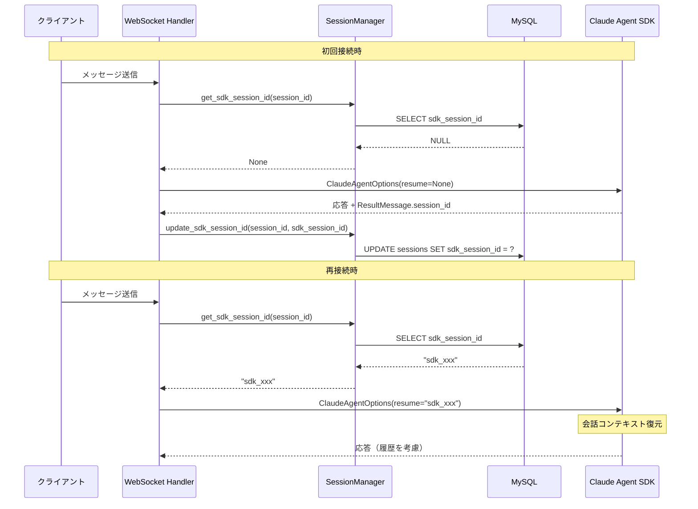
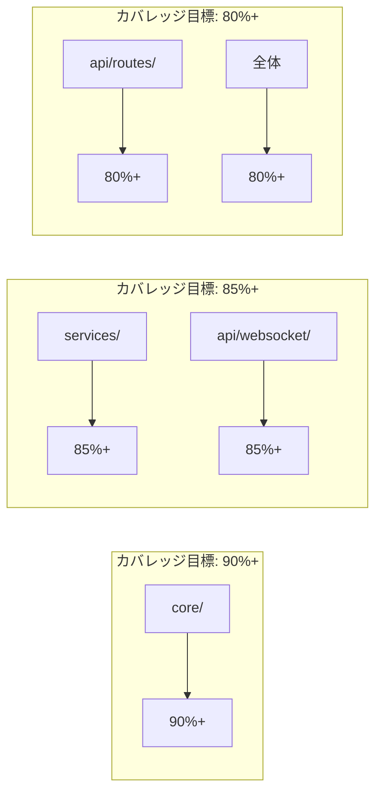
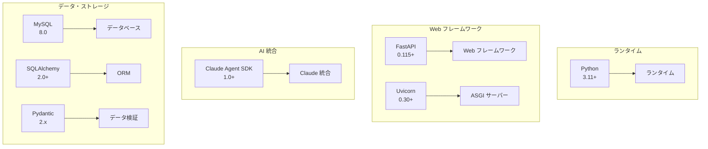

# Web版Claude Code バックエンド詳細設計書

**作成日:** 2025-12-20
**最終更新:** 2026-01-02
**バージョン:** 1.5
**ステータス:** ✅ 完了（100%）
**対象:** FastAPI + Claude Agent SDK (Python) バックエンド実装
**実行環境:** Docker Container
**関連ドキュメント:** [データベース設計書](database-design.md), [アーキテクチャ設計書](architecture-design.md), [リファクタリング記録](refactoring-2025-01.md)

---

## 目次

- [1. ディレクトリ構造](#1-ディレクトリ構造)
  - [1.1 完全なディレクトリツリー](#11-完全なディレクトリツリー)
  - [1.2 主要ファイルの役割](#12-主要ファイルの役割)
- [2. 主要クラス設計](#2-主要クラス設計)
  - [2.1 ClaudeClient](#21-claudeclient-coreclaudeclientpy)
  - [2.2 ProjectManager](#22-projectmanager-coreprojectmanagerpy)
  - [2.3 SessionManager](#23-sessionmanager-coresessionmanagerpy)
  - [2.4 WebSocketHandler](#24-websockethandler-apiwebsockethandlerspy)
- [3. API設計詳細](#3-api設計詳細)
  - [3.1 REST API エンドポイント仕様](#31-rest-api-エンドポイント仕様)
    - [3.1.0 プロジェクト管理](#310-プロジェクト管理)
    - [3.1.1 セッション管理](#311-セッション管理)
    - [3.1.2 ファイル操作](#312-ファイル操作)
    - [3.1.3 システム](#313-システム)
    - [3.1.4 code-server連携](#314-code-server連携)
  - [3.2 WebSocket API 仕様](#32-websocket-api-仕様)
- [4. エラーハンドリング](#4-エラーハンドリング)
  - [4.1 エラー階層設計](#41-エラー階層設計)
  - [4.2 グローバルエラーハンドラー](#42-グローバルエラーハンドラー)
  - [4.3 エラーハンドラー登録](#43-エラーハンドラー登録)
  - [4.4 WebSocketエラーハンドリング](#44-websocketエラーハンドリング)
- [5. セキュリティ](#5-セキュリティ)
  - [5.1 サンドボックス設定](#51-サンドボックス設定)
  - [5.2 入力検証](#52-入力検証)
  - [5.3 認証・認可](#53-認証認可-オプション実装)
  - [5.4 レート制限](#54-レート制限)
  - [5.5 CORS設定](#55-cors設定)
- [6. パフォーマンス最適化](#6-パフォーマンス最適化)
  - [6.1 データベース接続プール](#61-データベース接続プール)
  - [6.2 キャッシング戦略](#62-キャッシング戦略)
  - [6.3 非同期処理最適化](#63-非同期処理最適化)
  - [6.4 バッチ処理](#64-バッチ処理)
- [7. テスト戦略](#7-テスト戦略)
  - [7.1 ユニットテスト](#71-ユニットテスト)
  - [7.2 統合テスト](#72-統合テスト)
  - [7.3 テストカバレッジ目標](#73-テストカバレッジ目標)
- [8. デプロイメント](#8-デプロイメント)
  - [8.1 Dockerfile](#81-dockerfile)
  - [8.2 requirements.txt](#82-requirementstxt)
  - [8.3 docker-compose.yml](#83-docker-composeyml)
  - [8.4 環境変数設定](#84-環境変数設定)
- [付録](#付録)
  - [A. コード品質チェックリスト](#a-コード品質チェックリスト)
  - [B. 主要依存関係バージョン](#b-主要依存関係バージョン)
  - [C. 開発コマンド](#c-開発コマンド)
- [変更履歴](#変更履歴)

---

## 1. ディレクトリ構造

### 1.1 完全なディレクトリツリー

```
backend/
├── app/
│   ├── __init__.py
│   ├── main.py                           # FastAPI アプリケーションエントリポイント
│   ├── config.py                         # 環境設定管理
│   │
│   ├── api/                              # API層
│   │   ├── __init__.py
│   │   ├── dependencies.py               # 共通依存性注入
│   │   ├── middleware.py                 # カスタムミドルウェア
│   │   │
│   │   ├── routes/                       # REST API エンドポイント
│   │   │   ├── __init__.py
│   │   │   ├── auth.py                   # 認証API
│   │   │   ├── projects.py               # プロジェクト管理API
│   │   │   ├── sessions.py               # セッション管理API
│   │   │   ├── files.py                  # ファイル操作API
│   │   │   ├── templates.py              # テンプレート管理API
│   │   │   ├── shares.py                 # プロジェクト共有API
│   │   │   ├── project_config.py         # MCP/Agent/Skill/Command設定API
│   │   │   ├── health.py                 # ヘルスチェックAPI
│   │   │   └── code_server.py            # code-server連携API
│   │   │
│   │   └── websocket/                    # WebSocket層
│   │       ├── __init__.py
│   │       ├── handlers.py               # WebSocketハンドラー
│   │       ├── connection_manager.py     # 接続管理
│   │       └── message_handler.py        # メッセージ処理
│   │
│   ├── core/                             # コアビジネスロジック
│   │   ├── __init__.py
│   │   ├── claude_client.py              # Claude Agent SDK ラッパー
│   │   ├── project_manager.py            # プロジェクト管理
│   │   ├── session_manager.py            # セッション管理
│   │   └── security/                     # セキュリティ層
│   │       ├── __init__.py
│   │       ├── sandbox.py                # サンドボックス制御
│   │       ├── validator.py              # 入力検証
│   │       └── auth.py                   # 認証・認可
│   │
│   ├── models/                           # SQLAlchemy データモデル
│   │   ├── __init__.py
│   │   ├── database.py                   # 全モデル定義（12テーブル）
│   │   ├── user.py                       # ユーザーモデル
│   │   ├── projects.py                   # プロジェクトモデル
│   │   ├── sessions.py                   # セッションモデル
│   │   ├── messages.py                   # メッセージモデル
│   │   ├── project_share.py              # プロジェクト共有モデル
│   │   └── errors.py                     # エラーモデル
│   │
│   ├── services/                         # ビジネスロジック層
│   │   ├── __init__.py
│   │   ├── project_service.py            # プロジェクトサービス
│   │   ├── chat_service.py               # チャットサービス
│   │   ├── file_service.py               # ファイルサービス
│   │   ├── session_service.py            # セッションサービス
│   │   ├── template_service.py           # テンプレートサービス
│   │   └── project_config_service.py     # 設定管理サービス
│   │
│   ├── utils/                            # ユーティリティ
│   │   ├── __init__.py
│   │   └── logger.py                     # ロギング設定
│   │
│   └── schemas/                          # Pydantic スキーマ
│       ├── __init__.py
│       ├── request.py                    # リクエストスキーマ
│       ├── response.py                   # レスポンススキーマ
│       ├── project_config.py             # 設定スキーマ
│       ├── template.py                   # テンプレートスキーマ
│       └── websocket.py                  # WebSocketメッセージスキーマ
│
├── migrations/                           # Alembicマイグレーション
│   └── versions/                         # マイグレーションファイル
│
├── tests/                                # テストコード
│   ├── __init__.py
│   ├── conftest.py                  # pytest設定
│   ├── unit/                        # ユニットテスト
│   │   ├── test_claude_client.py
│   │   ├── test_session_manager.py
│   │   └── test_services.py
│   ├── integration/                 # 統合テスト
│   │   ├── test_api.py
│   │   └── test_websocket.py
│   └── fixtures/                    # テストフィクスチャ
│       └── sample_data.py
│
├── scripts/                         # ユーティリティスクリプト
│   ├── init_db.py                   # DB初期化
│   └── cleanup_sessions.py          # セッションクリーンアップ
│
├── requirements.txt                 # 本番依存関係
├── requirements-dev.txt             # 開発依存関係
├── Dockerfile                       # Docker イメージ定義
├── .dockerignore
├── .env.example                     # 環境変数サンプル
├── pyproject.toml                   # プロジェクト設定
└── README.md
```

### 1.2 主要ファイルの役割

| ファイル | 役割 | 重要度 |
|---------|------|:------:|
| `main.py` | FastAPIアプリ起動、ルート登録、ミドルウェア設定 | 最高 |
| `core/claude_client.py` | Claude Agent SDK統合、ストリーミング管理 | 最高 |
| `core/session_manager.py` | セッションライフサイクル管理 | 最高 |
| `api/websocket/handlers.py` | WebSocket接続・メッセージ処理 | 最高 |
| `core/security/sandbox.py` | サンドボックス環境制御 | 高 |
| `services/chat_service.py` | チャットビジネスロジック | 高 |
| `config.py` | 環境設定一元管理 | 中 |

---

## 2. 主要クラス設計

### 2.1 ClaudeClient (core/claude_client.py)

**責務:** Claude Agent SDKの薄いラッパー。ClaudeSDKClientを使用したストリーミングレスポンスの整形とエラーハンドリング。

```python
from typing import AsyncIterator, Optional, Dict, Any, List
from pathlib import Path
from claude_agent_sdk import (
    ClaudeSDKClient, ClaudeAgentOptions, AssistantMessage, ResultMessage,
    TextBlock, ToolUseBlock, ToolResultBlock, HookMatcher
)

class ClaudeClient:
    """
    Claude Agent SDK のラッパークラス

    主な機能:
    - ClaudeSDKClientを使用した継続的セッション管理
    - ストリーミングレスポンスの整形
    - エラーハンドリング
    - ResultMessageによる使用量追跡
    """

    def __init__(
        self,
        api_key: Optional[str] = None,
        model: str = "claude-sonnet-4-20250514",
        max_tokens: int = 4096,
        workspace_path: Optional[str] = None,
    ):
        """
        Args:
            api_key: Anthropic API Key (環境変数から自動取得)
            model: 使用するClaudeモデル
            max_tokens: 最大トークン数
            workspace_path: ワークスペースパス
        """
        self.api_key = api_key
        self.model = model
        self.max_tokens = max_tokens
        self.workspace_path = workspace_path
        self._client: Optional[ClaudeSDKClient] = None

    def _get_default_options(
        self,
        system_prompt: Optional[str] = None,
        allowed_tools: Optional[List[str]] = None,
        permission_mode: str = "acceptEdits",
    ) -> ClaudeAgentOptions:
        """Claude Agent オプション構築"""
        return ClaudeAgentOptions(
            system_prompt=system_prompt,
            allowed_tools=allowed_tools or ["Read", "Write", "Edit", "Bash"],
            permission_mode=permission_mode,
            cwd=Path(self.workspace_path),
        )

    async def send_message_stream(
        self,
        messages: List[Dict[str, Any]],
        system: Optional[str] = None,
        tools: Optional[List[str]] = None,
    ) -> AsyncIterator[Dict[str, Any]]:
        """
        メッセージ送信とストリーミングレスポンス受信

        ClaudeSDKClientを使用してクエリを送信し、レスポンスをストリーミング

        Args:
            messages: メッセージ履歴
            system: システムプロンプト
            tools: 使用可能なツール

        Yields:
            Dict: ストリーミングイベント (content_block_delta, tool_use, tool_result, usage, message_stop, error)
        """
        options = self._get_default_options(system_prompt=system, allowed_tools=tools)

        async with ClaudeSDKClient(options=options) as client:
            # クエリ送信
            await client.query(prompt)

            # ストリーミングレスポンス処理
            async for message in client.receive_response():
                if isinstance(message, AssistantMessage):
                    for block in message.content:
                        if isinstance(block, TextBlock):
                            yield {"type": "content_block_delta", "delta": {"type": "text_delta", "text": block.text}}
                        elif isinstance(block, ToolUseBlock):
                            yield {"type": "tool_use", "id": block.id, "name": block.name, "input": block.input}
                elif isinstance(message, ToolResultBlock):
                    yield {"type": "tool_result", "tool_use_id": message.tool_use_id, "content": message.content}
                elif isinstance(message, ResultMessage):
                    yield {
                        "type": "usage",
                        "total_cost_usd": message.total_cost_usd,
                        "duration_ms": message.duration_ms,
                        "input_tokens": message.usage.input_tokens,
                        "output_tokens": message.usage.output_tokens,
                    }

        yield {"type": "message_stop"}


# 後方互換性のためのエイリアス
ClaudeClientWrapper = ClaudeClient
```

#### 設計上の重要ポイント

1. **ClaudeSDKClient使用:** `client.query()` と `client.receive_response()` パターンでセッション管理
2. **ストリーミング変換:** SDK固有の型を統一されたDict形式に変換
3. **使用量追跡:** ResultMessageから使用量情報を取得
4. **後方互換性:** ClaudeClientWrapperエイリアスを提供

---

### 2.2 ProjectManager (core/project_manager.py)

**責務:** プロジェクトのライフサイクル管理。1つのプロジェクトに複数のセッションを紐付け。

```python
from typing import Optional, List
from datetime import datetime, timezone
import uuid
from sqlalchemy import select, func
from sqlalchemy.ext.asyncio import AsyncSession
from app.models.database import ProjectModel, SessionModel, ProjectStatus
from app.services.base_service import BaseService

class ProjectManager(BaseService):
    """
    プロジェクト管理クラス

    責務:
    - プロジェクト作成・取得・削除
    - プロジェクト配下のセッション管理
    - ワークスペースディレクトリ管理
    - MySQL永続化

    データ構造:
    - 1 Project : N Sessions (1対多の関係)
    - Projectはワークスペースディレクトリを所有
    - Sessionはproject_idを参照
    """

    def __init__(
        self,
        session: AsyncSession,
        workspace_base: str,
        max_projects: int = 50,
        max_sessions_per_project: int = 20
    ):
        """
        Args:
            session: SQLAlchemy AsyncSession
            workspace_base: ワークスペース基底ディレクトリ
            max_projects: 最大プロジェクト数
            max_sessions_per_project: プロジェクトあたり最大セッション数
        """
        super().__init__(session)
        self.workspace_base = workspace_base
        self.max_projects = max_projects
        self.max_sessions_per_project = max_sessions_per_project

    async def create_project(
        self,
        name: str,
        user_id: Optional[str] = None,
        description: Optional[str] = None
    ) -> ProjectModel:
        """
        新規プロジェクト作成

        Args:
            name: プロジェクト名
            user_id: ユーザー識別子 (オプション)
            description: プロジェクト説明 (オプション)

        Returns:
            ProjectModel: 作成されたプロジェクト

        Raises:
            MaxProjectsExceededError: 最大プロジェクト数超過
        """
        # プロジェクト数チェック
        project_count = await self._count_projects(user_id)
        if project_count >= self.max_projects:
            raise MaxProjectsExceededError(
                f"Maximum projects ({self.max_projects}) exceeded"
            )

        # プロジェクト生成
        project = ProjectModel(
            id=str(uuid.uuid4()),
            name=name,
            user_id=user_id,
            description=description,
            status=ProjectStatus.ACTIVE,
            created_at=datetime.now(timezone.utc),
            updated_at=datetime.now(timezone.utc),
        )

        # ワークスペースディレクトリ作成
        workspace_path = self._get_workspace_path(project.id)
        await self._create_workspace(workspace_path)

        # MySQL に保存
        self.session.add(project)
        await self.session.flush()

        return project

    async def get_project(self, project_id: str) -> Optional[ProjectModel]:
        """プロジェクト取得"""
        stmt = select(ProjectModel).where(ProjectModel.id == project_id)
        result = await self.session.execute(stmt)
        return result.scalar_one_or_none()

    async def list_projects(
        self,
        user_id: Optional[str] = None,
        limit: int = 50,
        offset: int = 0
    ) -> List[ProjectModel]:
        """プロジェクト一覧取得"""
        stmt = select(ProjectModel)
        if user_id:
            stmt = stmt.where(ProjectModel.user_id == user_id)
        stmt = stmt.order_by(ProjectModel.updated_at.desc())
        stmt = stmt.offset(offset).limit(limit)

        result = await self.session.execute(stmt)
        return list(result.scalars().all())

    async def update_project(
        self,
        project_id: str,
        name: Optional[str] = None,
        description: Optional[str] = None
    ) -> Optional[ProjectModel]:
        """プロジェクト更新"""
        project = await self.get_project(project_id)
        if not project:
            return None

        if name:
            project.name = name
        if description is not None:
            project.description = description
        project.updated_at = datetime.now(timezone.utc)

        await self.session.flush()
        return project

    async def delete_project(self, project_id: str):
        """
        プロジェクト削除

        注意: 配下のすべてのセッションも削除されます（CASCADE）
        """
        project = await self.get_project(project_id)
        if project:
            await self.session.delete(project)
            await self.session.flush()

    async def get_session_count(self, project_id: str) -> int:
        """プロジェクト配下のセッション数取得"""
        stmt = select(func.count(SessionModel.id)).where(
            SessionModel.project_id == project_id
        )
        result = await self.session.execute(stmt)
        return result.scalar() or 0

    async def _count_projects(self, user_id: Optional[str] = None) -> int:
        """プロジェクト数カウント"""
        stmt = select(func.count(ProjectModel.id))
        if user_id:
            stmt = stmt.where(ProjectModel.user_id == user_id)
        result = await self.session.execute(stmt)
        return result.scalar() or 0

    def _get_workspace_path(self, project_id: str) -> str:
        """ワークスペースパス取得"""
        return f"{self.workspace_base}/{project_id}"

    async def _create_workspace(self, path: str):
        """ワークスペースディレクトリ作成"""
        import os
        os.makedirs(path, exist_ok=True)
```

#### 設計上の重要ポイント

1. **1:N関係:** 1つのプロジェクトに複数のセッションを紐付け
2. **ワークスペース共有:** 同一プロジェクト内のセッションは同じワークスペースを共有
3. **カスケード削除:** プロジェクト削除時に配下のセッションも削除（MySQLのCASCADE設定）
4. **セッション数制限:** プロジェクトごとの最大セッション数を制限

---

### 2.3 SessionManager (core/session_manager.py)

**責務:** セッションのライフサイクル管理、MySQL連携、クリーンアップ。セッションは必ずプロジェクトに紐付く。

```python
from typing import Optional, Dict, List
from datetime import datetime, timezone, timedelta
import asyncio
from sqlalchemy import select, func
from sqlalchemy.ext.asyncio import AsyncSession
from app.core.claude_client import ClaudeClientWrapper
from app.core.security.sandbox import SandboxConfig
from app.core.project_manager import ProjectManager
from app.models.database import SessionModel, SessionStatus
from app.services.base_service import BaseService

class SessionManager(BaseService):
    """
    セッション管理クラス

    責務:
    - セッション作成・取得・削除 (プロジェクト配下)
    - アクティブセッションの追跡
    - セッションタイムアウト管理
    - MySQL永続化

    データ構造:
    - Sessionは必ずproject_idを持つ
    - 同一プロジェクト内のセッションはワークスペースを共有
    """

    def __init__(
        self,
        session: AsyncSession,
        project_manager: ProjectManager,
        session_timeout: int = 3600,
        max_sessions_per_project: int = 20
    ):
        """
        Args:
            session: SQLAlchemy AsyncSession
            project_manager: プロジェクトマネージャー
            session_timeout: セッションタイムアウト(秒)
            max_sessions_per_project: プロジェクトあたり最大セッション数
        """
        super().__init__(session)
        self.project_manager = project_manager
        self.session_timeout = session_timeout
        self.max_sessions_per_project = max_sessions_per_project
        self._active_clients: Dict[str, ClaudeClientWrapper] = {}
        self._cleanup_task: Optional[asyncio.Task] = None

    async def create_session(
        self,
        project_id: str,
        title: Optional[str] = None,
        sandbox_config: Optional[SandboxConfig] = None
    ) -> SessionModel:
        """
        新規セッション作成 (プロジェクト配下)

        Args:
            project_id: プロジェクトID (必須)
            title: セッションタイトル (オプション)
            sandbox_config: サンドボックス設定

        Returns:
            SessionModel: 作成されたセッション

        Raises:
            ProjectNotFoundError: プロジェクト不存在
            MaxSessionsExceededError: 最大セッション数超過
        """
        # プロジェクト存在確認
        project = await self.project_manager.get_project(project_id)
        if not project:
            raise ProjectNotFoundError(project_id)

        # プロジェクト内セッション数チェック
        session_count = await self._count_sessions_in_project(project_id)
        if session_count >= self.max_sessions_per_project:
            raise MaxSessionsExceededError(
                f"Maximum sessions per project ({self.max_sessions_per_project}) exceeded"
            )

        # セッション生成
        session_model = SessionModel(
            project_id=project_id,
            title=title or f"Chat {session_count + 1}",
            status=SessionStatus.ACTIVE,
            created_at=datetime.now(timezone.utc),
            expires_at=datetime.now(timezone.utc) + timedelta(seconds=self.session_timeout)
        )

        # ワークスペースパス (プロジェクトのワークスペースを使用)
        workspace_path = self.project_manager._get_workspace_path(project_id)

        # MySQL に保存
        self.session.add(session_model)
        await self.session.flush()

        # Claudeクライアント初期化
        client = ClaudeClientWrapper(
            session_id=session_model.id,
            workspace_path=workspace_path,
            sandbox_config=sandbox_config or SandboxConfig.default()
        )
        await client.__aenter__()
        self._active_clients[session_model.id] = client

        return session_model

    async def list_sessions(
        self,
        project_id: str,
        limit: int = 50,
        offset: int = 0
    ) -> List[SessionModel]:
        """
        プロジェクト配下のセッション一覧取得

        Args:
            project_id: プロジェクトID
            limit: 取得件数
            offset: オフセット

        Returns:
            List[SessionModel]: セッション一覧
        """
        stmt = select(SessionModel).where(
            SessionModel.project_id == project_id,
            SessionModel.expires_at > datetime.now(timezone.utc)
        ).order_by(SessionModel.updated_at.desc())
        stmt = stmt.offset(offset).limit(limit)

        result = await self.session.execute(stmt)
        return list(result.scalars().all())

    async def _count_sessions_in_project(self, project_id: str) -> int:
        """プロジェクト内のアクティブセッション数カウント"""
        stmt = select(func.count(SessionModel.id)).where(
            SessionModel.project_id == project_id,
            SessionModel.expires_at > datetime.now(timezone.utc)
        )
        result = await self.session.execute(stmt)
        return result.scalar() or 0

    async def get_session(self, session_id: str) -> Optional[SessionModel]:
        """
        セッション取得

        Args:
            session_id: セッションID

        Returns:
            SessionModel or None
        """
        stmt = select(SessionModel).where(SessionModel.id == session_id)
        result = await self.session.execute(stmt)
        session_model = result.scalar_one_or_none()

        if not session_model:
            return None

        # タイムアウトチェック
        if datetime.now(timezone.utc) > session_model.expires_at:
            await self.delete_session(session_id)
            return None

        return session_model

    async def get_client(self, session_id: str) -> Optional[ClaudeClientWrapper]:
        """
        アクティブな Claude クライアント取得

        Args:
            session_id: セッションID

        Returns:
            ClaudeClientWrapper or None
        """
        return self._active_clients.get(session_id)

    async def delete_session(self, session_id: str):
        """
        セッション削除

        Args:
            session_id: セッションID
        """
        # クライアントクリーンアップ
        if session_id in self._active_clients:
            client = self._active_clients[session_id]
            await client.__aexit__(None, None, None)
            del self._active_clients[session_id]

        # MySQL から削除
        stmt = select(SessionModel).where(SessionModel.id == session_id)
        result = await self.session.execute(stmt)
        session_model = result.scalar_one_or_none()
        if session_model:
            await self.session.delete(session_model)
            await self.session.flush()

    async def update_activity(self, session_id: str):
        """
        セッションアクティビティ更新

        Args:
            session_id: セッションID
        """
        session_model = await self.get_session(session_id)
        if session_model:
            session_model.last_activity = datetime.now(timezone.utc)
            session_model.expires_at = datetime.now(timezone.utc) + timedelta(seconds=self.session_timeout)
            await self.session.flush()

    async def start_cleanup_task(self):
        """定期クリーンアップタスク開始"""
        if self._cleanup_task is None or self._cleanup_task.done():
            self._cleanup_task = asyncio.create_task(self._cleanup_loop())

    async def stop_cleanup_task(self):
        """クリーンアップタスク停止"""
        if self._cleanup_task and not self._cleanup_task.done():
            self._cleanup_task.cancel()
            try:
                await self._cleanup_task
            except asyncio.CancelledError:
                pass

    async def _cleanup_loop(self):
        """期限切れセッションのクリーンアップループ"""
        while True:
            try:
                await asyncio.sleep(60)  # 1分ごと
                await self._cleanup_expired_sessions()
            except asyncio.CancelledError:
                break
            except Exception as e:
                # ログ記録
                print(f"Cleanup error: {e}")

    async def _cleanup_expired_sessions(self):
        """期限切れセッション削除"""
        stmt = select(SessionModel).where(
            SessionModel.expires_at < datetime.now(timezone.utc)
        )
        result = await self.session.execute(stmt)
        expired_sessions = result.scalars().all()
        for session_model in expired_sessions:
            await self.delete_session(session_model.id)

    async def _count_active_sessions(self) -> int:
        """アクティブセッション数カウント"""
        stmt = select(func.count(SessionModel.id)).where(
            SessionModel.expires_at > datetime.now(timezone.utc)
        )
        result = await self.session.execute(stmt)
        return result.scalar() or 0
```

#### 設計上の重要ポイント

1. **MySQL永続化:** セッション情報の永続化とタイムアウト管理
2. **アクティブクライアント管理:** メモリ内での高速アクセス
3. **自動クリーンアップ:** バックグラウンドタスクでの期限切れセッション削除
4. **リソース制限:** 最大セッション数の制御

#### SDK セッション再開機能 (v1.2追加)

ブラウザ更新後も会話コンテキストを維持するため、Claude Agent SDKの`resume`パラメータを使用します。

```python
# SDK セッションID管理メソッド
async def update_sdk_session_id(
    self, session_id: str, sdk_session_id: str
) -> Optional[Session]:
    """
    SDKセッションIDを更新（セッション再開用）

    Args:
        session_id: アプリケーションセッションID
        sdk_session_id: Claude Agent SDKから返されるセッションID

    Returns:
        Session: 更新されたセッション
    """
    stmt = select(SessionModel).where(SessionModel.id == session_id)
    result = await self.session.execute(stmt)
    session_model = result.scalar_one_or_none()
    if not session_model:
        return None
    session_model.sdk_session_id = sdk_session_id
    session_model.updated_at = datetime.now(timezone.utc)
    await self.session.flush()
    return self._model_to_pydantic(session_model)

async def get_sdk_session_id(self, session_id: str) -> Optional[str]:
    """
    SDKセッションIDを取得

    Args:
        session_id: アプリケーションセッションID

    Returns:
        Optional[str]: SDKセッションID（存在しない場合はNone）
    """
    stmt = select(SessionModel.sdk_session_id).where(SessionModel.id == session_id)
    result = await self.session.execute(stmt)
    return result.scalar_one_or_none()
```

**セッション再開フロー:**



---

### 2.4 WebSocketHandler (api/websocket/handlers.py)

**責務:** WebSocket接続管理、メッセージルーティング、エラーハンドリング。

```python
from fastapi import WebSocket, WebSocketDisconnect
from typing import Optional
import json
from app.core.session_manager import SessionManager
from app.models.messages import StreamMessage, MessageType
from app.schemas.websocket import (
    ClientMessage, ServerMessage, ChatMessageRequest, ErrorResponse
)
from app.core.security.validator import InputValidator
from app.utils.logger import get_logger

logger = get_logger(__name__)

class WebSocketHandler:
    """
    WebSocket接続ハンドラー

    責務:
    - WebSocket接続のライフサイクル管理
    - メッセージの検証とルーティング
    - ストリーミングレスポンスの送信
    - エラーハンドリング
    """

    def __init__(
        self,
        websocket: WebSocket,
        session_id: str,
        session_manager: SessionManager
    ):
        """
        Args:
            websocket: FastAPI WebSocket インスタンス
            session_id: セッションID
            session_manager: セッションマネージャー
        """
        self.websocket = websocket
        self.session_id = session_id
        self.session_manager = session_manager
        self.validator = InputValidator()
        self._is_processing = False

    async def handle_connection(self):
        """
        WebSocket接続メインハンドラー

        フロー:
        1. 接続確立
        2. セッション検証
        3. メッセージループ
        4. 切断処理
        """
        await self.websocket.accept()
        logger.info(f"WebSocket connected: session={self.session_id}")

        # セッション存在確認
        session = await self.session_manager.get_session(self.session_id)
        if not session:
            await self._send_error("Invalid session")
            await self.websocket.close(code=1008)
            return

        # 接続成功通知
        await self._send_message(ServerMessage(
            type="connected",
            data={"session_id": self.session_id}
        ))

        try:
            await self._message_loop()
        except WebSocketDisconnect:
            logger.info(f"WebSocket disconnected: session={self.session_id}")
        except Exception as e:
            logger.error(f"WebSocket error: {e}", exc_info=True)
            await self._send_error(str(e))
        finally:
            await self._cleanup()

    async def _message_loop(self):
        """メッセージ受信ループ"""
        while True:
            # メッセージ受信
            raw_message = await self.websocket.receive_text()

            try:
                # JSONパース
                message_data = json.loads(raw_message)
                client_message = ClientMessage(**message_data)

                # メッセージタイプ別処理
                await self._handle_message(client_message)

            except json.JSONDecodeError:
                await self._send_error("Invalid JSON format")
            except Exception as e:
                await self._send_error(f"Message handling error: {str(e)}")

    async def _handle_message(self, message: ClientMessage):
        """
        メッセージタイプ別処理

        Args:
            message: クライアントメッセージ
        """
        if message.type == "chat":
            await self._handle_chat_message(message)
        elif message.type == "interrupt":
            await self._handle_interrupt()
        elif message.type == "ping":
            await self._send_message(ServerMessage(type="pong"))
        else:
            await self._send_error(f"Unknown message type: {message.type}")

    async def _handle_chat_message(self, message: ClientMessage):
        """
        チャットメッセージ処理

        Args:
            message: チャットメッセージ
        """
        if self._is_processing:
            await self._send_error("Previous request still processing")
            return

        self._is_processing = True

        try:
            # 入力検証
            chat_request = ChatMessageRequest(**message.data)
            self.validator.validate_message(chat_request.content)

            # Claude クライアント取得
            client = await self.session_manager.get_client(self.session_id)
            if not client:
                await self._send_error("Session not found")
                return

            # アクティビティ更新
            await self.session_manager.update_activity(self.session_id)

            # ストリーミングレスポンス送信
            async for stream_message in client.send_message(
                message=chat_request.content,
                files=chat_request.files
            ):
                await self._send_stream_message(stream_message)

        except Exception as e:
            logger.error(f"Chat processing error: {e}", exc_info=True)
            await self._send_error(str(e))
        finally:
            self._is_processing = False

    async def _handle_interrupt(self):
        """処理中断ハンドラー"""
        if not self._is_processing:
            await self._send_error("No active request to interrupt")
            return

        client = await self.session_manager.get_client(self.session_id)
        if client:
            await client.interrupt()
            await self._send_message(ServerMessage(
                type="interrupted",
                data={"message": "Request interrupted"}
            ))

    async def _send_stream_message(self, stream_message: StreamMessage):
        """
        ストリーミングメッセージ送信

        Args:
            stream_message: ストリームメッセージ
        """
        server_message = ServerMessage(
            type=stream_message.type.value,
            data=stream_message.dict()
        )
        await self._send_message(server_message)

    async def _send_message(self, message: ServerMessage):
        """
        サーバーメッセージ送信

        Args:
            message: サーバーメッセージ
        """
        await self.websocket.send_text(message.json())

    async def _send_error(self, error: str):
        """
        エラーメッセージ送信

        Args:
            error: エラーメッセージ
        """
        error_response = ErrorResponse(message=error)
        await self._send_message(ServerMessage(
            type="error",
            data=error_response.dict()
        ))

    async def _cleanup(self):
        """接続終了時のクリーンアップ"""
        logger.info(f"Cleaning up WebSocket: session={self.session_id}")
        # 必要に応じてセッション削除
        # await self.session_manager.delete_session(self.session_id)
```

#### 設計上の重要ポイント

1. **スキーマ検証:** Pydanticによる型安全なメッセージ処理
2. **処理状態管理:** 同時リクエスト防止
3. **エラー境界:** 例外の適切なキャッチと通知
4. **ストリーミング対応:** 非同期イテレータでのリアルタイム送信

---

## 3. API設計詳細

### 3.1 REST API エンドポイント仕様

#### 3.1.0 プロジェクト管理

##### POST /api/projects

新規プロジェクト作成

**Request:**
```json
{
  "name": "My Python Project",
  "description": "Python FastAPI application development",
  "user_id": "user_123"
}
```

**Response (201):**
```json
{
  "project_id": "proj_abc123def456",
  "name": "My Python Project",
  "description": "Python FastAPI application development",
  "status": "active",
  "created_at": "2025-12-20T10:00:00Z",
  "updated_at": "2025-12-20T10:00:00Z",
  "workspace_path": "/app/workspace/proj_abc123def456",
  "session_count": 0
}
```

**Implementation:**
```python
from fastapi import APIRouter, Depends, HTTPException
from app.schemas.request import CreateProjectRequest
from app.schemas.response import ProjectResponse
from app.core.project_manager import ProjectManager
from app.api.dependencies import get_project_manager

router = APIRouter(prefix="/api/projects", tags=["projects"])

@router.post("", response_model=ProjectResponse, status_code=201)
async def create_project(
    request: CreateProjectRequest,
    project_manager: ProjectManager = Depends(get_project_manager)
):
    """新規プロジェクト作成"""
    try:
        project = await project_manager.create_project(
            name=request.name,
            user_id=request.user_id,
            description=request.description
        )
        return ProjectResponse.from_project(project)
    except MaxProjectsExceededError as e:
        raise HTTPException(status_code=429, detail=str(e))
```

---

##### GET /api/projects

プロジェクト一覧取得

**Query Parameters:**
- `user_id` (str, optional): ユーザーIDでフィルタ
- `limit` (int): 取得件数 (default: 50)
- `offset` (int): オフセット (default: 0)

**Response (200):**
```json
{
  "projects": [
    {
      "project_id": "proj_abc123def456",
      "name": "My Python Project",
      "description": "Python FastAPI application development",
      "status": "active",
      "created_at": "2025-12-20T10:00:00Z",
      "updated_at": "2025-12-20T10:15:00Z",
      "session_count": 3
    },
    {
      "project_id": "proj_xyz789",
      "name": "Frontend React App",
      "description": "React TypeScript project",
      "status": "active",
      "created_at": "2025-12-19T14:00:00Z",
      "updated_at": "2025-12-20T09:00:00Z",
      "session_count": 2
    }
  ],
  "total": 2,
  "has_more": false
}
```

**Implementation:**
```python
@router.get("", response_model=ProjectListResponse)
async def list_projects(
    user_id: Optional[str] = None,
    limit: int = 50,
    offset: int = 0,
    project_manager: ProjectManager = Depends(get_project_manager)
):
    """プロジェクト一覧取得"""
    projects = await project_manager.list_projects(
        user_id=user_id,
        limit=limit,
        offset=offset
    )
    return ProjectListResponse(projects=projects)
```

---

##### GET /api/projects/{project_id}

プロジェクト詳細取得

**Response (200):**
```json
{
  "project_id": "proj_abc123def456",
  "name": "My Python Project",
  "description": "Python FastAPI application development",
  "status": "active",
  "created_at": "2025-12-20T10:00:00Z",
  "updated_at": "2025-12-20T10:15:00Z",
  "workspace_path": "/app/workspace/proj_abc123def456",
  "session_count": 3,
  "sessions": [
    {
      "session_id": "sess_001",
      "title": "Initial setup",
      "message_count": 15,
      "updated_at": "2025-12-20T10:15:00Z"
    },
    {
      "session_id": "sess_002",
      "title": "API development",
      "message_count": 8,
      "updated_at": "2025-12-20T10:10:00Z"
    }
  ]
}
```

**Implementation:**
```python
@router.get("/{project_id}", response_model=ProjectDetailResponse)
async def get_project(
    project_id: str,
    project_manager: ProjectManager = Depends(get_project_manager),
    session_manager: SessionManager = Depends(get_session_manager)
):
    """プロジェクト詳細取得"""
    project = await project_manager.get_project(project_id)
    if not project:
        raise HTTPException(status_code=404, detail="Project not found")

    sessions = await session_manager.list_sessions(project_id)
    return ProjectDetailResponse.from_project(project, sessions)
```

---

##### PATCH /api/projects/{project_id}

プロジェクト更新

**Request:**
```json
{
  "name": "Updated Project Name",
  "description": "Updated description"
}
```

**Response (200):**
```json
{
  "project_id": "proj_abc123def456",
  "name": "Updated Project Name",
  "description": "Updated description",
  "updated_at": "2025-12-20T10:30:00Z"
}
```

---

##### DELETE /api/projects/{project_id}

プロジェクト削除

**注意:** 配下のすべてのセッションも削除されます

**Response (204):** No Content

**Implementation:**
```python
@router.delete("/{project_id}", status_code=204)
async def delete_project(
    project_id: str,
    project_manager: ProjectManager = Depends(get_project_manager)
):
    """プロジェクト削除（配下のセッションも削除）"""
    project = await project_manager.get_project(project_id)
    if not project:
        raise HTTPException(status_code=404, detail="Project not found")

    await project_manager.delete_project(project_id)
```

---

##### GET /api/projects/{project_id}/sessions

プロジェクト配下のセッション一覧取得

**Query Parameters:**
- `limit` (int): 取得件数 (default: 50)
- `offset` (int): オフセット (default: 0)

**Response (200):**
```json
{
  "project_id": "proj_abc123def456",
  "sessions": [
    {
      "session_id": "sess_001",
      "title": "Initial setup",
      "status": "active",
      "message_count": 15,
      "created_at": "2025-12-20T10:00:00Z",
      "updated_at": "2025-12-20T10:15:00Z"
    },
    {
      "session_id": "sess_002",
      "title": "API development",
      "status": "active",
      "message_count": 8,
      "created_at": "2025-12-20T10:05:00Z",
      "updated_at": "2025-12-20T10:10:00Z"
    }
  ],
  "total": 2,
  "has_more": false
}
```

---

#### 3.1.1 セッション管理

##### POST /api/projects/{project_id}/sessions

プロジェクト配下に新規セッション作成

**Request:**
```json
{
  "title": "Debug API issue",
  "options": {
    "model": "claude-opus-4-5",
    "max_turns": 20
  },
  "sandbox_config": {
    "allowed_tools": ["Read", "Write", "Edit", "Bash"],
    "permission_mode": "acceptEdits"
  }
}
```

**Response (200):**
```json
{
  "session_id": "sess_abc123def456",
  "project_id": "proj_xyz789",
  "title": "Debug API issue",
  "status": "active",
  "created_at": "2025-12-20T10:00:00Z",
  "expires_at": "2025-12-20T11:00:00Z",
  "workspace_path": "/app/workspace/proj_xyz789"
}
```

**Implementation:**
```python
from fastapi import APIRouter, Depends, HTTPException, Path
from app.schemas.request import CreateSessionRequest
from app.schemas.response import SessionResponse
from app.core.session_manager import SessionManager
from app.core.project_manager import ProjectManager
from app.api.dependencies import get_session_manager, get_project_manager

router = APIRouter(prefix="/api/projects/{project_id}/sessions", tags=["sessions"])

@router.post("", response_model=SessionResponse)
async def create_session(
    project_id: str = Path(..., description="プロジェクトID"),
    request: CreateSessionRequest = None,
    session_manager: SessionManager = Depends(get_session_manager),
    project_manager: ProjectManager = Depends(get_project_manager)
):
    """プロジェクト配下に新規セッション作成"""
    # プロジェクト存在確認
    project = await project_manager.get_project(project_id)
    if not project:
        raise HTTPException(status_code=404, detail="Project not found")

    try:
        session = await session_manager.create_session(
            project_id=project_id,
            title=request.title if request else None,
            sandbox_config=request.sandbox_config if request else None
        )
        return SessionResponse.from_session(session)
    except MaxSessionsExceededError as e:
        raise HTTPException(status_code=429, detail=str(e))
    except Exception as e:
        raise HTTPException(status_code=500, detail="Session creation failed")
```

---

##### GET /api/projects/{project_id}/sessions/{session_id}

セッション情報取得

**Response (200):**
```json
{
  "session_id": "sess_abc123def456",
  "project_id": "proj_xyz789",
  "title": "Debug API issue",
  "status": "active",
  "created_at": "2025-12-20T10:00:00Z",
  "last_activity": "2025-12-20T10:15:00Z",
  "expires_at": "2025-12-20T11:00:00Z",
  "message_count": 5,
  "workspace_path": "/app/workspace/proj_xyz789"
}
```

**Implementation:**
```python
@router.get("/{session_id}", response_model=SessionResponse)
async def get_session(
    project_id: str = Path(..., description="プロジェクトID"),
    session_id: str = Path(..., description="セッションID"),
    session_manager: SessionManager = Depends(get_session_manager)
):
    """セッション情報取得"""
    session = await session_manager.get_session(session_id)
    if not session:
        raise HTTPException(status_code=404, detail="Session not found")
    # プロジェクト整合性チェック
    if session.project_id != project_id:
        raise HTTPException(status_code=404, detail="Session not found in this project")
    return SessionResponse.from_session(session)
```

---

##### DELETE /api/projects/{project_id}/sessions/{session_id}

セッション削除

**Response (204):** No Content

**Implementation:**
```python
@router.delete("/{session_id}", status_code=204)
async def delete_session(
    project_id: str = Path(..., description="プロジェクトID"),
    session_id: str = Path(..., description="セッションID"),
    session_manager: SessionManager = Depends(get_session_manager)
):
    """セッション削除"""
    session = await session_manager.get_session(session_id)
    if session and session.project_id != project_id:
        raise HTTPException(status_code=404, detail="Session not found in this project")
    await session_manager.delete_session(session_id)
```

---

##### GET /api/projects/{project_id}/sessions/{session_id}/history

チャット履歴取得

**Query Parameters:**
- `limit` (int): 取得件数 (default: 50)
- `offset` (int): オフセット (default: 0)

**Response (200):**
```json
{
  "session_id": "sess_abc123def456",
  "project_id": "proj_xyz789",
  "messages": [
    {
      "role": "user",
      "content": "Hello",
      "timestamp": "2025-12-20T10:00:00Z"
    },
    {
      "role": "assistant",
      "content": "Hi! How can I help you?",
      "timestamp": "2025-12-20T10:00:02Z"
    }
  ],
  "total": 10,
  "has_more": false
}
```

---

#### 3.1.2 ファイル操作

##### GET /api/files

ファイル一覧取得

**Query Parameters:**
- `session_id` (str): セッションID
- `path` (str): ディレクトリパス (optional)

**Response (200):**
```json
{
  "files": [
    {
      "name": "main.py",
      "path": "/workspace/sess_abc/main.py",
      "size": 1024,
      "modified_at": "2025-12-20T10:00:00Z",
      "type": "file"
    },
    {
      "name": "src",
      "path": "/workspace/sess_abc/src",
      "type": "directory"
    }
  ]
}
```

**Implementation:**
```python
from app.services.file_service import FileService

@router.get("/api/files", response_model=FileListResponse)
async def list_files(
    session_id: str,
    path: Optional[str] = None,
    file_service: FileService = Depends(get_file_service)
):
    """ファイル一覧取得"""
    files = await file_service.list_files(session_id, path)
    return FileListResponse(files=files)
```

---

##### GET /api/files/{path:path}

ファイル内容取得

**Query Parameters:**
- `session_id` (str): セッションID

**Response (200):**
```json
{
  "path": "/workspace/sess_abc/main.py",
  "content": "def main():\n    print('Hello')",
  "encoding": "utf-8",
  "size": 1024
}
```

---

##### POST /api/files/{path:path}

ファイル作成

**Request:**
```json
{
  "session_id": "sess_abc123",
  "content": "print('Hello, World!')",
  "encoding": "utf-8"
}
```

**Response (201):**
```json
{
  "path": "/workspace/sess_abc/hello.py",
  "created_at": "2025-12-20T10:00:00Z"
}
```

---

##### PUT /api/files/{path:path}

ファイル更新

**Request:** (同上)

**Response (200):**
```json
{
  "path": "/workspace/sess_abc/hello.py",
  "updated_at": "2025-12-20T10:05:00Z"
}
```

---

##### DELETE /api/files/{path:path}

ファイル削除

**Response (204):** No Content

---

#### 3.1.3 システム

##### GET /api/health

ヘルスチェック

**Response (200):**
```json
{
  "status": "healthy",
  "timestamp": "2025-12-20T10:00:00Z",
  "services": {
    "database": "connected",
    "claude_sdk": "available"
  },
  "active_sessions": 5,
  "version": "1.0.0"
}
```

**Implementation:**
```python
from sqlalchemy.ext.asyncio import AsyncSession
from sqlalchemy import text
from app.api.dependencies import get_db

@router.get("/api/health")
async def health_check(db: AsyncSession = Depends(get_db)):
    """ヘルスチェック"""
    try:
        await db.execute(text("SELECT 1"))
        db_status = "connected"
    except Exception:
        db_status = "disconnected"

    return {
        "status": "healthy" if db_status == "connected" else "degraded",
        "timestamp": datetime.utcnow().isoformat(),
        "services": {
            "database": db_status,
            "claude_sdk": "available"
        }
    }
```

---

##### GET /api/config

クライアント設定取得

**Response (200):**
```json
{
  "websocket_url": "ws://localhost:8000/ws/chat",
  "code_server_url": "http://localhost:8080",
  "max_message_length": 10000,
  "allowed_file_types": [".py", ".js", ".md"],
  "max_file_size": 10485760
}
```

---

#### 3.1.4 code-server連携

##### GET /api/code-server/health

code-serverヘルスチェック

**Response (200):**
```json
{
  "status": "healthy",
  "url": "http://localhost:8080",
  "version": "4.96.2",
  "uptime_seconds": 3600
}
```

**Response (503):**
```json
{
  "status": "unavailable",
  "message": "code-server is not responding",
  "fallback_available": true
}
```

**Implementation:**
```python
from fastapi import APIRouter, HTTPException
from app.config import settings
import httpx

router = APIRouter(prefix="/api/code-server", tags=["code-server"])

@router.get("/health")
async def code_server_health():
    """code-serverヘルスチェック"""
    try:
        async with httpx.AsyncClient() as client:
            response = await client.get(
                f"{settings.CODE_SERVER_URL}/healthz",
                timeout=5.0
            )
            if response.status_code == 200:
                return {
                    "status": "healthy",
                    "url": settings.CODE_SERVER_URL,
                    "version": settings.CODE_SERVER_VERSION,
                    "uptime_seconds": await _get_uptime()
                }
    except httpx.RequestError:
        pass

    return {
        "status": "unavailable",
        "message": "code-server is not responding",
        "fallback_available": True
    }
```

---

##### GET /api/code-server/config

code-server接続設定取得

**Query Parameters:**
- `session_id` (str): セッションID

**Response (200):**
```json
{
  "url": "http://localhost:8080",
  "workspace_path": "/home/coder/workspace",
  "auth_type": "password",
  "features": {
    "terminal": true,
    "git": true,
    "extensions": true,
    "debug": true
  },
  "settings": {
    "theme": "vs-dark",
    "font_size": 14,
    "auto_save": "afterDelay"
  }
}
```

**Implementation:**
```python
@router.get("/config")
async def get_code_server_config(session_id: str):
    """code-server接続設定取得"""
    # セッション検証
    session = await session_manager.get_session(session_id)
    if not session:
        raise HTTPException(status_code=404, detail="Session not found")

    return {
        "url": settings.CODE_SERVER_URL,
        "workspace_path": settings.CODE_SERVER_WORKSPACE,
        "auth_type": settings.CODE_SERVER_AUTH_TYPE,
        "features": {
            "terminal": True,
            "git": True,
            "extensions": True,
            "debug": True
        },
        "settings": {
            "theme": "vs-dark",
            "font_size": 14,
            "auto_save": "afterDelay"
        }
    }
```

---

##### POST /api/code-server/open

code-serverでファイルを開く

**Request:**
```json
{
  "session_id": "sess_abc123",
  "file_path": "/workspace/main.py",
  "line_number": 10
}
```

**Response (200):**
```json
{
  "success": true,
  "url": "http://localhost:8080/?folder=/home/coder/workspace&file=/workspace/main.py:10"
}
```

**Implementation:**
```python
from urllib.parse import urlencode

@router.post("/open")
async def open_in_code_server(request: OpenFileRequest):
    """code-serverでファイルを開く"""
    # セッション検証
    session = await session_manager.get_session(request.session_id)
    if not session:
        raise HTTPException(status_code=404, detail="Session not found")

    # ファイルパス検証
    if not await file_service.exists(request.file_path):
        raise HTTPException(status_code=404, detail="File not found")

    # code-server URL構築
    params = {
        "folder": settings.CODE_SERVER_WORKSPACE,
        "file": request.file_path
    }
    if request.line_number:
        params["file"] += f":{request.line_number}"

    url = f"{settings.CODE_SERVER_URL}/?{urlencode(params)}"

    return {
        "success": True,
        "url": url
    }
```

---

##### GET /api/code-server/extensions

インストール済み拡張機能一覧取得

**Response (200):**
```json
{
  "extensions": [
    {
      "id": "ms-python.python",
      "name": "Python",
      "version": "2024.0.1",
      "enabled": true
    },
    {
      "id": "esbenp.prettier-vscode",
      "name": "Prettier",
      "version": "10.1.0",
      "enabled": true
    }
  ]
}
```

---

##### POST /api/code-server/extensions/install

拡張機能インストール

**Request:**
```json
{
  "extension_id": "ms-python.python"
}
```

**Response (200):**
```json
{
  "success": true,
  "extension_id": "ms-python.python",
  "message": "Extension installed successfully"
}
```

**Implementation:**
```python
@router.post("/extensions/install")
async def install_extension(request: InstallExtensionRequest):
    """拡張機能インストール"""
    try:
        # code-server CLIで拡張機能インストール
        result = await run_command(
            f"code-server --install-extension {request.extension_id}"
        )
        return {
            "success": True,
            "extension_id": request.extension_id,
            "message": "Extension installed successfully"
        }
    except Exception as e:
        raise HTTPException(
            status_code=500,
            detail=f"Failed to install extension: {str(e)}"
        )
```

---

### 3.2 WebSocket API 仕様

#### 3.2.1 接続URL

```
ws://localhost:8000/ws/chat/{session_id}
```

#### 3.2.2 メッセージフォーマット

**Client → Server メッセージスキーマ:**

```python
# schemas/websocket.py
from pydantic import BaseModel, Field
from typing import Optional, List

class FileAttachment(BaseModel):
    path: str
    content: str
    encoding: str = "utf-8"

class ChatMessageRequest(BaseModel):
    content: str = Field(..., max_length=10000)
    files: Optional[List[FileAttachment]] = None

class ClientMessage(BaseModel):
    type: str  # "chat" | "interrupt" | "ping"
    data: Optional[dict] = None
```

**実際のJSON:**
```json
{
  "type": "chat",
  "data": {
    "content": "Create a Python FastAPI app",
    "files": [
      {
        "path": "requirements.txt",
        "content": "fastapi==0.115.0"
      }
    ]
  }
}
```

---

**Server → Client メッセージスキーマ:**

```python
class ServerMessage(BaseModel):
    type: str  # "text" | "tool_use" | "tool_result" | "result" | "error"
    data: dict

class TextContent(BaseModel):
    text: str

class ToolUseContent(BaseModel):
    tool: str
    input: dict

class ResultContent(BaseModel):
    cost: float
    duration_ms: int
    usage: dict

class ErrorResponse(BaseModel):
    message: str
    code: Optional[str] = None
```

**実際のJSON (テキスト):**
```json
{
  "type": "text",
  "data": {
    "text": "I'll create a FastAPI application for you..."
  }
}
```

**実際のJSON (ツール使用):**
```json
{
  "type": "tool_use",
  "data": {
    "tool": "Write",
    "input": {
      "file_path": "/workspace/sess_abc/main.py",
      "content": "from fastapi import FastAPI\n..."
    }
  }
}
```

**実際のJSON (完了):**
```json
{
  "type": "result",
  "data": {
    "cost": 0.0245,
    "duration_ms": 3200,
    "usage": {
      "input_tokens": 512,
      "output_tokens": 1024
    }
  }
}
```

**実際のJSON (エラー):**
```json
{
  "type": "error",
  "data": {
    "message": "Tool execution failed",
    "code": "TOOL_ERROR"
  }
}
```

---

## 4. エラーハンドリング

### 4.1 エラー階層設計

```python
# models/errors.py
from typing import Optional

class BaseAPIError(Exception):
    """基底エラークラス"""
    def __init__(
        self,
        message: str,
        code: str,
        status_code: int = 500,
        details: Optional[dict] = None
    ):
        self.message = message
        self.code = code
        self.status_code = status_code
        self.details = details or {}
        super().__init__(message)

# クライアントエラー (4xx)
class ClientError(BaseAPIError):
    """クライアント起因エラー"""
    def __init__(self, message: str, code: str, details: Optional[dict] = None):
        super().__init__(message, code, status_code=400, details=details)

class ValidationError(ClientError):
    """入力検証エラー"""
    def __init__(self, message: str, details: Optional[dict] = None):
        super().__init__(message, code="VALIDATION_ERROR", details=details)

class SessionNotFoundError(ClientError):
    """セッション不存在エラー"""
    def __init__(self, session_id: str):
        super().__init__(
            message=f"Session not found: {session_id}",
            code="SESSION_NOT_FOUND",
            details={"session_id": session_id}
        )

class MaxSessionsExceededError(ClientError):
    """最大セッション数超過"""
    def __init__(self, message: str):
        super().__init__(message, code="MAX_SESSIONS_EXCEEDED")

class UnauthorizedError(ClientError):
    """認証エラー"""
    def __init__(self, message: str = "Unauthorized"):
        super().__init__(message, code="UNAUTHORIZED")
        self.status_code = 401

class ForbiddenError(ClientError):
    """認可エラー"""
    def __init__(self, message: str = "Forbidden"):
        super().__init__(message, code="FORBIDDEN")
        self.status_code = 403

# サーバーエラー (5xx)
class ServerError(BaseAPIError):
    """サーバー起因エラー"""
    def __init__(self, message: str, code: str, details: Optional[dict] = None):
        super().__init__(message, code, status_code=500, details=details)

class ClaudeSDKError(ServerError):
    """Claude SDK エラー"""
    def __init__(self, message: str, details: Optional[dict] = None):
        super().__init__(message, code="CLAUDE_SDK_ERROR", details=details)

class DatabaseConnectionError(ServerError):
    """データベース接続エラー"""
    def __init__(self, message: str):
        super().__init__(message, code="DATABASE_ERROR")

class ToolExecutionError(ServerError):
    """ツール実行エラー"""
    def __init__(self, tool_name: str, error: str):
        super().__init__(
            message=f"Tool execution failed: {tool_name}",
            code="TOOL_EXECUTION_ERROR",
            details={"tool": tool_name, "error": error}
        )
```

### 4.2 グローバルエラーハンドラー

```python
# api/middleware.py
from fastapi import Request, status
from fastapi.responses import JSONResponse
from fastapi.exceptions import RequestValidationError
from app.models.errors import BaseAPIError
from app.utils.logger import get_logger

logger = get_logger(__name__)

async def api_error_handler(request: Request, exc: BaseAPIError):
    """カスタムAPIエラーハンドラー"""
    logger.error(
        f"API Error: {exc.code}",
        extra={
            "code": exc.code,
            "message": exc.message,
            "details": exc.details,
            "path": request.url.path
        }
    )

    return JSONResponse(
        status_code=exc.status_code,
        content={
            "error": {
                "code": exc.code,
                "message": exc.message,
                "details": exc.details
            }
        }
    )

async def validation_error_handler(request: Request, exc: RequestValidationError):
    """Pydantic検証エラーハンドラー"""
    return JSONResponse(
        status_code=status.HTTP_422_UNPROCESSABLE_ENTITY,
        content={
            "error": {
                "code": "VALIDATION_ERROR",
                "message": "Request validation failed",
                "details": exc.errors()
            }
        }
    )

async def generic_error_handler(request: Request, exc: Exception):
    """汎用エラーハンドラー"""
    logger.exception("Unhandled exception", exc_info=exc)

    return JSONResponse(
        status_code=status.HTTP_500_INTERNAL_SERVER_ERROR,
        content={
            "error": {
                "code": "INTERNAL_SERVER_ERROR",
                "message": "An unexpected error occurred"
            }
        }
    )
```

### 4.3 エラーハンドラー登録

```python
# main.py
from fastapi import FastAPI
from fastapi.exceptions import RequestValidationError
from app.api.middleware import (
    api_error_handler,
    validation_error_handler,
    generic_error_handler
)
from app.models.errors import BaseAPIError

app = FastAPI()

# エラーハンドラー登録
app.add_exception_handler(BaseAPIError, api_error_handler)
app.add_exception_handler(RequestValidationError, validation_error_handler)
app.add_exception_handler(Exception, generic_error_handler)
```

### 4.4 WebSocketエラーハンドリング

```python
# api/websocket/handlers.py (一部再掲)
async def _handle_chat_message(self, message: ClientMessage):
    try:
        # 処理...
    except ValidationError as e:
        await self._send_error(e.message)
    except ClaudeSDKError as e:
        await self._send_error("AI service temporarily unavailable")
        logger.error(f"Claude SDK error: {e}")
    except ToolExecutionError as e:
        await self._send_error(f"Tool error: {e.message}")
    except Exception as e:
        await self._send_error("An unexpected error occurred")
        logger.exception("WebSocket handler error", exc_info=e)
```

---

## 5. セキュリティ

### 5.1 サンドボックス設定

```python
# core/security/sandbox.py
from typing import List, Optional, Dict
from pydantic import BaseModel

class SandboxConfig(BaseModel):
    """
    サンドボックス設定

    Claudeエージェントのツールアクセスとファイルシステム制限
    """

    # ツール制御
    allowed_tools: List[str] = [
        "Read", "Write", "Edit", "Glob", "Grep"
    ]
    disallowed_tools: List[str] = [
        "WebFetch",  # 外部ネットワークアクセス禁止
        "WebSearch"
    ]

    # 権限モード
    permission_mode: str = "acceptEdits"  # default | acceptEdits | plan | bypassPermissions

    # ファイルシステム制限
    workspace_root: Optional[str] = None
    max_file_size: int = 10 * 1024 * 1024  # 10MB
    allowed_extensions: List[str] = [
        ".py", ".js", ".ts", ".jsx", ".tsx",
        ".json", ".yaml", ".yml", ".toml",
        ".md", ".txt", ".csv",
        ".html", ".css", ".scss"
    ]
    blocked_paths: List[str] = [
        "/etc", "/sys", "/proc", "/dev",
        "/root", "/home"
    ]

    # コマンド実行制限
    blocked_commands: List[str] = [
        "rm -rf /",
        "mkfs",
        "dd",
        "chmod 777",
        "curl",
        "wget"
    ]

    # 環境変数
    env_vars: Dict[str, str] = {}

    @classmethod
    def default(cls) -> "SandboxConfig":
        """デフォルト設定"""
        return cls()

    @classmethod
    def restricted(cls) -> "SandboxConfig":
        """制限モード (読取専用)"""
        return cls(
            allowed_tools=["Read", "Glob", "Grep"],
            permission_mode="plan"
        )

    @classmethod
    def development(cls) -> "SandboxConfig":
        """開発モード (フルアクセス)"""
        return cls(
            allowed_tools=[
                "Read", "Write", "Edit", "Bash",
                "Glob", "Grep", "Task"
            ],
            permission_mode="acceptEdits",
            blocked_commands=[]  # コマンド制限なし
        )

    def validate_path(self, path: str) -> bool:
        """パス検証"""
        # ブロックされたパスチェック
        for blocked in self.blocked_paths:
            if path.startswith(blocked):
                return False

        # ワークスペース内チェック
        if self.workspace_root:
            if not path.startswith(self.workspace_root):
                return False

        return True

    def validate_command(self, command: str) -> bool:
        """コマンド検証"""
        for blocked in self.blocked_commands:
            if blocked in command:
                return False
        return True
```

### 5.2 入力検証

```python
# core/security/validator.py
import re
from typing import List
from app.models.errors import ValidationError

class InputValidator:
    """入力検証クラス"""

    # 危険なパターン
    DANGEROUS_PATTERNS = [
        r'\.\./\.\.',  # パストラバーサル
        r'/etc/passwd',
        r'/etc/shadow',
        r'`.*`',  # コマンドインジェクション
        r'\$\(.*\)',
        r';\s*rm\s+-rf',
        r'>\s*/dev/sd'
    ]

    MAX_MESSAGE_LENGTH = 10000
    MAX_FILE_SIZE = 10 * 1024 * 1024  # 10MB

    def validate_message(self, message: str):
        """メッセージ検証"""
        if not message or not message.strip():
            raise ValidationError("Message cannot be empty")

        if len(message) > self.MAX_MESSAGE_LENGTH:
            raise ValidationError(
                f"Message too long (max {self.MAX_MESSAGE_LENGTH} chars)"
            )

    def validate_file_path(self, path: str):
        """ファイルパス検証"""
        # 危険なパターンチェック
        for pattern in self.DANGEROUS_PATTERNS:
            if re.search(pattern, path):
                raise ValidationError(
                    "Potentially dangerous path pattern detected",
                    details={"path": path}
                )

        # 絶対パスチェック
        if path.startswith('/'):
            # 許可されたベースパス内かチェック
            pass

    def validate_file_content(self, content: str, max_size: int = MAX_FILE_SIZE):
        """ファイル内容検証"""
        if len(content.encode('utf-8')) > max_size:
            raise ValidationError(
                f"File too large (max {max_size} bytes)"
            )

    def validate_session_id(self, session_id: str):
        """セッションID検証"""
        # UUIDv4形式チェック
        pattern = r'^[a-f0-9]{8}-[a-f0-9]{4}-4[a-f0-9]{3}-[89ab][a-f0-9]{3}-[a-f0-9]{12}$'
        if not re.match(pattern, session_id):
            raise ValidationError("Invalid session ID format")
```

### 5.3 認証・認可 (オプション実装)

```python
# core/security/auth.py
from fastapi import Depends, HTTPException, status
from fastapi.security import HTTPBearer, HTTPAuthorizationCredentials
import jwt
from datetime import datetime, timedelta
from typing import Optional

security = HTTPBearer()

class AuthService:
    """認証サービス"""

    def __init__(self, secret_key: str, algorithm: str = "HS256"):
        self.secret_key = secret_key
        self.algorithm = algorithm

    def create_access_token(
        self,
        user_id: str,
        expires_delta: Optional[timedelta] = None
    ) -> str:
        """アクセストークン生成"""
        expire = datetime.utcnow() + (expires_delta or timedelta(hours=24))
        payload = {
            "sub": user_id,
            "exp": expire,
            "iat": datetime.utcnow()
        }
        return jwt.encode(payload, self.secret_key, algorithm=self.algorithm)

    def verify_token(self, token: str) -> dict:
        """トークン検証"""
        try:
            payload = jwt.decode(
                token,
                self.secret_key,
                algorithms=[self.algorithm]
            )
            return payload
        except jwt.ExpiredSignatureError:
            raise HTTPException(
                status_code=status.HTTP_401_UNAUTHORIZED,
                detail="Token expired"
            )
        except jwt.JWTError:
            raise HTTPException(
                status_code=status.HTTP_401_UNAUTHORIZED,
                detail="Invalid token"
            )

# 依存性注入
async def get_current_user(
    credentials: HTTPAuthorizationCredentials = Depends(security),
    auth_service: AuthService = Depends()
) -> dict:
    """現在のユーザー取得"""
    token = credentials.credentials
    return auth_service.verify_token(token)

# 使用例
@router.post("/api/sessions")
async def create_session(
    request: CreateSessionRequest,
    current_user: dict = Depends(get_current_user)
):
    # current_user["sub"] でユーザーID取得
    pass
```

### 5.4 レート制限

```python
# api/middleware.py
from fastapi import Request, HTTPException
from slowapi import Limiter, _rate_limit_exceeded_handler
from slowapi.util import get_remote_address
from slowapi.errors import RateLimitExceeded

limiter = Limiter(key_func=get_remote_address)

# FastAPI アプリに追加
app.state.limiter = limiter
app.add_exception_handler(RateLimitExceeded, _rate_limit_exceeded_handler)

# エンドポイントに適用
@router.post("/api/sessions")
@limiter.limit("10/minute")  # 1分間に10回まで
async def create_session(request: Request, ...):
    pass
```

### 5.5 CORS設定

```python
# main.py
from fastapi.middleware.cors import CORSMiddleware

app.add_middleware(
    CORSMiddleware,
    allow_origins=["http://localhost:3000"],  # フロントエンドURL
    allow_credentials=True,
    allow_methods=["*"],
    allow_headers=["*"],
)
```

---

## 6. パフォーマンス最適化

### 6.1 データベース接続プール

```python
# core/database.py
from sqlalchemy.ext.asyncio import create_async_engine, AsyncSession, async_sessionmaker
from typing import Optional

_engine = None
_session_factory = None

async def init_database(database_url: str, pool_size: int = 20, max_overflow: int = 10):
    """データベース接続プール初期化"""
    global _engine, _session_factory

    _engine = create_async_engine(
        database_url,
        pool_size=pool_size,
        max_overflow=max_overflow,
        pool_pre_ping=True,
        echo=False
    )

    _session_factory = async_sessionmaker(
        bind=_engine,
        class_=AsyncSession,
        expire_on_commit=False
    )

async def get_db() -> AsyncSession:
    """データベースセッション取得"""
    if not _session_factory:
        raise RuntimeError("Database not initialized")
    async with _session_factory() as session:
        yield session

async def close_database():
    """データベース接続クローズ"""
    global _engine
    if _engine:
        await _engine.dispose()
```

### 6.2 キャッシング戦略

```python
# services/chat_service.py
from functools import lru_cache
from cachetools import TTLCache
from typing import Optional

class ChatService:
    """チャットサービス"""

    def __init__(self):
        # メモリ内キャッシュ (TTL: 1時間, 最大1000エントリ)
        self._cache = TTLCache(maxsize=1000, ttl=3600)

    def get_cached_response(self, message_hash: str) -> Optional[str]:
        """キャッシュされたレスポンス取得"""
        return self._cache.get(f"response:{message_hash}")

    def cache_response(self, message_hash: str, response: str):
        """レスポンスをキャッシュ"""
        self._cache[f"response:{message_hash}"] = response
```

### 6.3 非同期処理最適化

```python
# core/claude_client.py
import asyncio

async def send_message_with_timeout(
    self,
    message: str,
    timeout: int = 300
) -> AsyncIterator[StreamMessage]:
    """タイムアウト付きメッセージ送信"""
    try:
        async with asyncio.timeout(timeout):
            async for msg in self.send_message(message):
                yield msg
    except asyncio.TimeoutError:
        raise TimeoutError("Request timeout")
```

### 6.4 バッチ処理

```python
# services/file_service.py
async def batch_read_files(self, file_paths: List[str]) -> List[FileContent]:
    """複数ファイルの並列読込"""
    tasks = [self.read_file(path) for path in file_paths]
    return await asyncio.gather(*tasks)
```

---

## 7. テスト戦略

### 7.1 ユニットテスト

```python
# tests/unit/test_claude_client.py
import pytest
from unittest.mock import AsyncMock, MagicMock
from app.core.claude_client import ClaudeClientWrapper
from app.core.security.sandbox import SandboxConfig

@pytest.fixture
async def claude_client():
    """テスト用Claudeクライアント"""
    client = ClaudeClientWrapper(
        session_id="test_session",
        workspace_path="/tmp/test",
        sandbox_config=SandboxConfig.default()
    )
    await client.__aenter__()
    yield client
    await client.__aexit__(None, None, None)

@pytest.mark.asyncio
async def test_send_message(claude_client, mocker):
    """メッセージ送信テスト"""
    # SDKモック
    mock_response = AsyncMock()
    mocker.patch.object(
        claude_client._client,
        "receive_response",
        return_value=mock_response
    )

    messages = []
    async for msg in claude_client.send_message("Hello"):
        messages.append(msg)

    assert len(messages) > 0
```

### 7.2 統合テスト

```python
# tests/integration/test_websocket.py
from fastapi.testclient import TestClient
from app.main import app

def test_websocket_chat():
    """WebSocketチャット統合テスト"""
    client = TestClient(app)

    with client.websocket_connect("/ws/chat/test_session") as websocket:
        # メッセージ送信
        websocket.send_json({
            "type": "chat",
            "data": {"content": "Hello"}
        })

        # レスポンス受信
        response = websocket.receive_json()
        assert response["type"] in ["text", "result"]
```

### 7.3 テストカバレッジ目標



---

## 8. デプロイメント

### 8.1 Dockerfile

```dockerfile
# backend/Dockerfile
FROM python:3.11-slim

# 作業ディレクトリ
WORKDIR /app

# システム依存関係
RUN apt-get update && apt-get install -y \
    curl \
    git \
    && rm -rf /var/lib/apt/lists/*

# Node.js インストール (Claude Code CLI用)
RUN curl -fsSL https://deb.nodesource.com/setup_18.x | bash - \
    && apt-get install -y nodejs

# Claude Code CLI インストール
RUN npm install -g @anthropic-ai/claude-code

# Python依存関係
COPY requirements.txt .
RUN pip install --no-cache-dir -r requirements.txt

# アプリケーションコピー
COPY ./app /app/app

# ワークスペースディレクトリ作成
RUN mkdir -p /app/workspace

# 非rootユーザー作成
RUN useradd -m -u 1000 appuser && \
    chown -R appuser:appuser /app
USER appuser

# ヘルスチェック
HEALTHCHECK --interval=30s --timeout=10s --start-period=5s --retries=3 \
    CMD curl -f http://localhost:8000/api/health || exit 1

# サーバー起動
CMD ["uvicorn", "app.main:app", "--host", "0.0.0.0", "--port", "8000"]
```

### 8.2 requirements.txt

```txt
# FastAPI
fastapi==0.115.0
uvicorn[standard]==0.30.0
python-multipart==0.0.9

# Claude Agent SDK
claude-agent-sdk==1.0.0

# Database (MySQL)
sqlalchemy[asyncio]==2.0.23
aiomysql==0.2.0
alembic==1.13.1

# キャッシング
cachetools==5.3.2

# データ検証
pydantic==2.5.0
pydantic-settings==2.1.0

# セキュリティ
python-jose[cryptography]==3.3.0
passlib[bcrypt]==1.7.4

# ユーティリティ
python-dotenv==1.0.0
structlog==24.1.0

# HTTP クライアント (code-server連携用)
httpx==0.27.0

# レート制限
slowapi==0.1.9

# テスト
pytest==7.4.3
pytest-asyncio==0.21.1
pytest-cov==4.1.0
httpx==0.25.2
```

### 8.3 docker-compose.yml

```yaml
version: '3.9'

services:
  backend:
    build:
      context: ./src/backend
      dockerfile: Dockerfile
    ports:
      - "8000:8000"
    environment:
      # MySQL
      - MYSQL_HOST=mysql
      - MYSQL_PORT=3306
      - MYSQL_USER=claude
      - MYSQL_PASSWORD=${MYSQL_PASSWORD:-claude_password}
      - MYSQL_DATABASE=claude_code
      # Application
      - WORKSPACE_PATH=/app/workspace
      - MAX_SESSIONS=100
      - SESSION_TIMEOUT=3600
      - ALLOWED_ORIGINS=http://localhost:3000
      - LOG_LEVEL=INFO
      - SECRET_KEY=${SECRET_KEY}
    depends_on:
      mysql:
        condition: service_healthy
    volumes:
      - workspace-data:/app/workspace
      - ./src/backend/app:/app/app:ro
    networks:
      - claude-network
    restart: unless-stopped

  mysql:
    image: mysql:8.0
    ports:
      - "3306:3306"
    environment:
      - MYSQL_ROOT_PASSWORD=${MYSQL_ROOT_PASSWORD:-root_password}
      - MYSQL_DATABASE=claude_code
      - MYSQL_USER=claude
      - MYSQL_PASSWORD=${MYSQL_PASSWORD:-claude_password}
    volumes:
      - mysql-data:/var/lib/mysql
    healthcheck:
      test: ["CMD", "mysqladmin", "ping", "-h", "localhost"]
      interval: 10s
      timeout: 5s
      retries: 5
      start_period: 30s
    networks:
      - claude-network
    restart: unless-stopped

volumes:
  workspace-data:
    driver: local
  mysql-data:
    driver: local

networks:
  claude-network:
    driver: bridge
```

### 8.4 環境変数設定

```bash
# .env.example

# MySQL Database
MYSQL_HOST=mysql
MYSQL_PORT=3306
MYSQL_USER=claude
MYSQL_PASSWORD=claude_password
MYSQL_DATABASE=claude_code
MYSQL_ROOT_PASSWORD=root_password

# Application
WORKSPACE_PATH=/app/workspace
MAX_SESSIONS=100
SESSION_TIMEOUT=3600

# code-server
CODE_SERVER_URL=http://code-server:8080
CODE_SERVER_WORKSPACE=/home/coder/workspace
CODE_SERVER_VERSION=4.96.2
CODE_SERVER_AUTH_TYPE=password
CODE_SERVER_PASSWORD=your-password-here

# Security
SECRET_KEY=your-secret-key-here
ALLOWED_ORIGINS=http://localhost:3000

# Claude Model (API keys are managed per-project in DB)
CLAUDE_MODEL=claude-sonnet-4-20250514
MAX_TOKENS=16000

# Logging
LOG_LEVEL=INFO

# Rate Limiting
RATE_LIMIT_PER_MINUTE=30

# Features
ENABLE_AUTH=false
```

---

## 付録

### A. コード品質チェックリスト

- [ ] 型ヒント 100% 適用
- [ ] Docstring すべての public メソッドに記述
- [ ] エラーハンドリング すべての async 関数
- [ ] ロギング 重要処理に適切なログレベル
- [ ] テストカバレッジ 80% 以上
- [ ] セキュリティ OWASP Top 10 対策
- [ ] パフォーマンス レスポンス時間 p95 < 100ms

### B. 主要依存関係バージョン



### C. 開発コマンド

```bash
# 開発サーバー起動
uvicorn app.main:app --reload --host 0.0.0.0 --port 8000

# テスト実行
pytest tests/ -v --cov=app --cov-report=html

# 型チェック
mypy app/

# コード整形
black app/ tests/
isort app/ tests/

# リント
ruff check app/

# Docker ビルド
docker-compose build

# Docker 起動
docker-compose up -d

# ログ確認
docker-compose logs -f backend
```

---

## 変更履歴

| バージョン | 日付 | 変更内容 |
|-----------|------|----------|
| v1.0 | 2025-12-20 | 初版作成 |
| v1.1 | 2025-12-21 | ドキュメント完成度100%達成 |
| v1.2 | 2025-12-29 | ディレクトリ構造更新、テンプレート/共有機能追加 |
| v1.3 | 2025-12-29 | テーブル形式に統一（主要ファイル、変更履歴） |
| v1.4 | 2026-01-01 | SDKセッション再開機能追加 |
| v1.5 | 2026-01-02 | 目次追加、Redis→MySQL移行に伴うドキュメント更新 |

---

**ドキュメント管理情報**

| 項目 | 値 |
|------|-----|
| 設計書バージョン | 1.5 |
| 最終更新 | 2026-01-02 |
| 作成者 | Claude Code |
| レビューステータス | 確認中 |
| 完成度 | 100% |
