# Claude Agent SDK (Python) 調査レポート

**調査日時:** 2025-12-20（更新: 2025-12-21）
**対象:** Claude Agent SDK Python版
**SDKバージョン:** 0.1.x（2025年1月リリース）

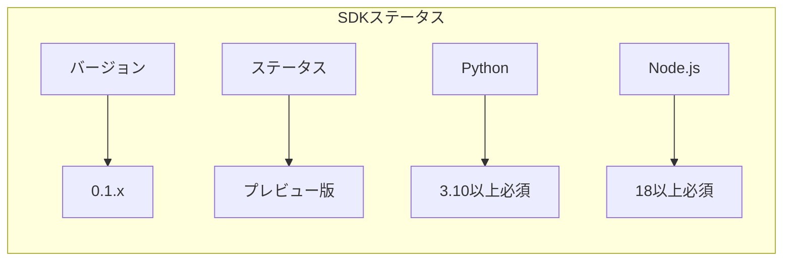

---

## 1. SDKのインストール方法

### 1.1 前提条件

- **Python:** 3.10以上
- **Node.js:** 18以上 (Claude Code CLI用)
- **Anthropic API Key:** https://console.anthropic.com/

### 1.2 インストール手順

#### ステップ1: Claude Code CLIをインストール

```bash
# macOS/Linux/WSL
curl -fsSL https://claude.ai/install.sh | bash

# npm
npm install -g @anthropic-ai/claude-code
```

#### ステップ2: Python SDKをインストール

```bash
# uv (推奨)
uv init && uv add claude-agent-sdk

# pip
pip install claude-agent-sdk
```

---

## 2. 基本的な使い方

Claude Agent SDKには**2つのメイン API**があります:

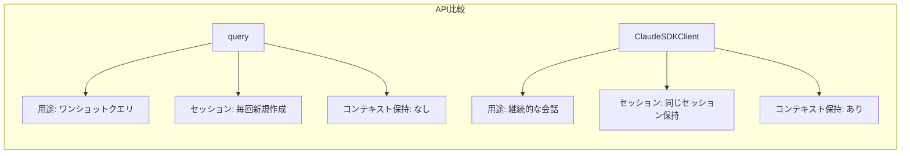

### 2.1 query() - シンプルな使い方

```python
import asyncio
from claude_agent_sdk import query, ClaudeAgentOptions, AssistantMessage, TextBlock

async def main():
    options = ClaudeAgentOptions(
        allowed_tools=["Read", "Write", "Bash"],
        permission_mode="acceptEdits",
        cwd="/path/to/project"
    )

    async for message in query(
        prompt="Create a Python project structure",
        options=options
    ):
        if isinstance(message, AssistantMessage):
            for block in message.content:
                if isinstance(block, TextBlock):
                    print(block.text)

asyncio.run(main())
```

### 2.2 ClaudeSDKClient - コンテキスト保持

```python
import asyncio
from claude_agent_sdk import ClaudeSDKClient, ClaudeAgentOptions, AssistantMessage, TextBlock

async def main():
    options = ClaudeAgentOptions(
        allowed_tools=["Read", "Write", "Edit", "Bash"],
        permission_mode="acceptEdits"
    )

    async with ClaudeSDKClient(options=options) as client:
        # クエリ1
        await client.query("What's the capital of France?")
        async for message in client.receive_response():
            if isinstance(message, AssistantMessage):
                for block in message.content:
                    if isinstance(block, TextBlock):
                        print(f"Claude: {block.text}")

        # クエリ2 - 前のコンテキストを保持
        await client.query("What's the population of that city?")
        async for message in client.receive_response():
            # ...

asyncio.run(main())
```

### 2.3 カスタムツール定義

```python
from claude_agent_sdk import tool, create_sdk_mcp_server, query, ClaudeAgentOptions

@tool("calculate", "Perform calculations", {"expression": str})
async def calculate(args: dict) -> dict:
    result = eval(args["expression"], {"__builtins__": {}})
    return {
        "content": [{"type": "text", "text": f"Result: {result}"}]
    }

# MCP サーバー作成
math_server = create_sdk_mcp_server(
    name="calculator",
    version="1.0.0",
    tools=[calculate]
)

# 使用
async def main():
    async for message in query(
        prompt="What's 123 * 456?",
        options=ClaudeAgentOptions(
            mcp_servers={"math": math_server},
            allowed_tools=["mcp__math__calculate"]
        )
    ):
        print(message)
```

### 2.4 ClaudeAgentOptions - 主要設定

```python
options = ClaudeAgentOptions(
    # ツール制御
    allowed_tools=["Read", "Write", "Edit", "Bash", "Glob", "Grep"],
    disallowed_tools=["KillBash"],

    # システムプロンプト
    system_prompt="You are an expert Python developer",

    # MCP サーバー
    mcp_servers={"calc": math_server},

    # 権限制御
    permission_mode="acceptEdits",  # default, acceptEdits, plan, bypassPermissions

    # 環境設定
    cwd="/path/to/project",
    env={"DEBUG": "true"},

    # セッション管理
    resume=None,  # セッションID で再開
    fork_session=False,
    max_turns=10,

    # モデル
    model="claude-opus-4-5",
)
```

---

## 3. ストリーミングレスポンス

### 3.1 メッセージの種類

```python
from claude_agent_sdk import (
    AssistantMessage, TextBlock, ThinkingBlock, ToolUseBlock,
    ResultMessage, SystemMessage
)

async for message in client.receive_response():
    if isinstance(message, AssistantMessage):
        for block in message.content:
            if isinstance(block, TextBlock):
                print(f"Text: {block.text}")
            elif isinstance(block, ToolUseBlock):
                print(f"Tool: {block.name}, Input: {block.input}")

    elif isinstance(message, ResultMessage):
        print(f"Cost: ${message.total_cost_usd}")
        print(f"Duration: {message.duration_ms}ms")
```

---

## 4. 利用可能なツール

### ビルトインツール

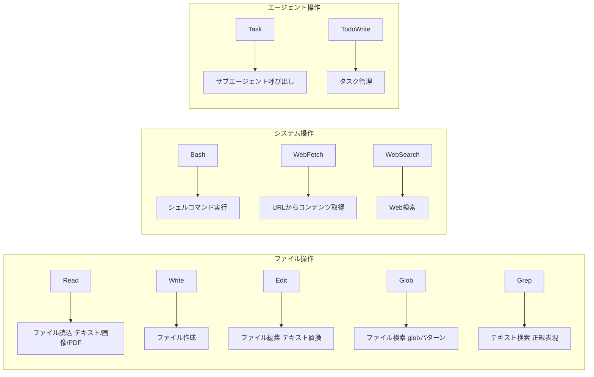

---

## 5. Webアプリケーション開発のベストプラクティス

### 5.1 アーキテクチャパターン

#### パターン1: エフェメラルセッション (一度限りのタスク)

```python
async def analyze_code_endpoint(request):
    options = ClaudeAgentOptions(
        allowed_tools=["Read", "Glob", "Grep"],
        cwd=request.project_path,
        permission_mode="bypassPermissions"
    )

    results = []
    async for message in query(prompt="Find vulnerabilities", options=options):
        if isinstance(message, AssistantMessage):
            for block in message.content:
                if isinstance(block, TextBlock):
                    results.append(block.text)

    return {"analysis": results}
```

#### パターン2: ロングランニングセッション (継続対話)

```python
class AgentService:
    def __init__(self):
        self.clients = {}

    async def chat(self, session_id: str, user_message: str):
        if session_id not in self.clients:
            self.clients[session_id] = ClaudeSDKClient(
                options=ClaudeAgentOptions(
                    allowed_tools=["Read", "Write", "Edit", "Bash"],
                    permission_mode="acceptEdits"
                )
            )

        client = self.clients[session_id]
        await client.query(user_message)

        messages = []
        async for msg in client.receive_response():
            messages.append(msg)
        return messages
```

### 5.2 プロジェクト・セッション管理

#### プロジェクトIDとセッションIDの関係

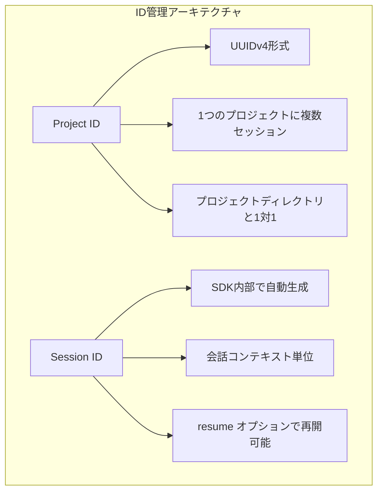

#### Webアプリでの管理パターン

```python
import uuid
from dataclasses import dataclass
from typing import Optional
from datetime import datetime

@dataclass
class Project:
    """プロジェクト（アプリケーション管理）"""
    id: str  # UUIDv4
    name: str
    path: str  # プロジェクトディレクトリパス
    created_at: datetime

@dataclass
class Session:
    """セッション（SDK連携）"""
    id: str  # アプリ内ID (UUIDv4)
    project_id: str  # 所属プロジェクト
    sdk_session_id: Optional[str]  # SDK から取得したセッションID
    created_at: datetime
    last_active_at: datetime

class ProjectSessionManager:
    """プロジェクト・セッション統合管理"""

    def __init__(self, redis_client):
        self.redis = redis_client
        self.clients: dict[str, ClaudeSDKClient] = {}

    async def create_project(self, name: str, path: str) -> Project:
        """新規プロジェクト作成"""
        project = Project(
            id=str(uuid.uuid4()),
            name=name,
            path=path,
            created_at=datetime.now()
        )
        await self.redis.hset(f"project:{project.id}", mapping=project.__dict__)
        return project

    async def create_session(self, project_id: str) -> Session:
        """新規セッション作成（プロジェクト内）"""
        session = Session(
            id=str(uuid.uuid4()),
            project_id=project_id,
            sdk_session_id=None,  # 最初のクエリ後に設定
            created_at=datetime.now(),
            last_active_at=datetime.now()
        )
        await self.redis.hset(f"session:{session.id}", mapping=session.__dict__)
        await self.redis.sadd(f"project:{project_id}:sessions", session.id)
        return session

    async def get_client(self, session: Session, project: Project) -> ClaudeSDKClient:
        """セッション用クライアント取得（再開含む）"""
        if session.id in self.clients:
            return self.clients[session.id]

        options = ClaudeAgentOptions(
            allowed_tools=["Read", "Write", "Edit", "Bash", "Glob", "Grep"],
            permission_mode="acceptEdits",
            cwd=project.path,
            resume=session.sdk_session_id  # 既存セッションの場合は再開
        )

        client = ClaudeSDKClient(options=options)
        await client.__aenter__()
        self.clients[session.id] = client
        return client
```

#### セッションID取得と保存

```python
# セッション ID の取得
async for message in query(prompt="Start task"):
    if hasattr(message, 'subtype') and message.subtype == 'init':
        session_id = message.data.get('session_id')
        save_to_database(session_id)

# セッションの再開
async for message in query(
    prompt="Continue",
    options=ClaudeAgentOptions(resume=session_id)
):
    print(message)
```

### 5.3 エラーハンドリング

#### エラータイプ階層

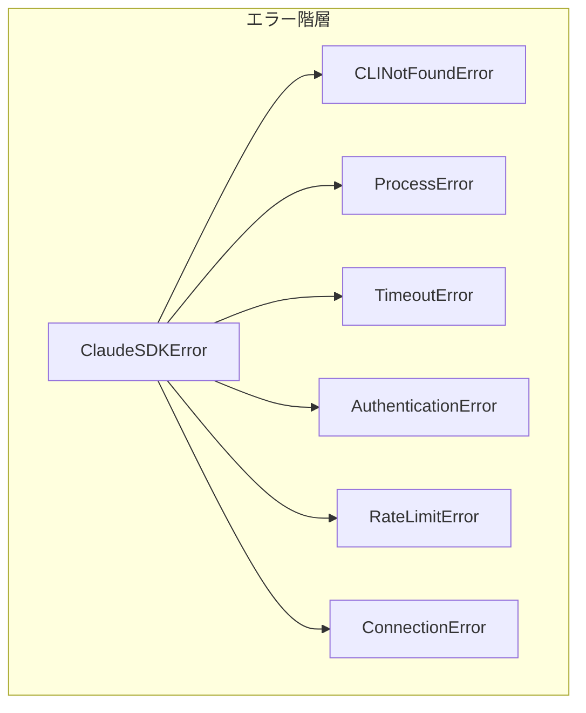

#### 包括的エラーハンドリング

```python
from claude_agent_sdk import (
    ClaudeSDKError, CLINotFoundError, ProcessError
)
import asyncio
import logging

logger = logging.getLogger(__name__)

class SDKErrorHandler:
    """SDK エラーの統合ハンドラ"""

    @staticmethod
    async def execute_with_retry(
        query_func,
        max_retries: int = 3,
        retry_delay: float = 1.0
    ):
        """リトライ付きクエリ実行"""
        last_error = None

        for attempt in range(max_retries):
            try:
                async for message in query_func():
                    yield message
                return  # 成功時は終了

            except CLINotFoundError as e:
                # CLI未インストール - リトライ不可
                logger.error(f"Claude Code CLI not found: {e.cli_path}")
                raise

            except ProcessError as e:
                # プロセスエラー - 状況により再試行
                last_error = e
                if e.exit_code in [137, 143]:  # SIGKILL, SIGTERM
                    logger.warning(f"Process killed, retrying... ({attempt + 1}/{max_retries})")
                    await asyncio.sleep(retry_delay * (attempt + 1))
                else:
                    raise

            except asyncio.TimeoutError:
                # タイムアウト - 再試行可能
                last_error = asyncio.TimeoutError()
                logger.warning(f"Timeout, retrying... ({attempt + 1}/{max_retries})")
                await asyncio.sleep(retry_delay)

            except Exception as e:
                # その他のエラー
                logger.error(f"Unexpected error: {type(e).__name__}: {e}")
                raise

        # 全リトライ失敗
        raise last_error or Exception("All retries exhausted")


# 使用例
try:
    async for message in query(prompt=prompt):
        print(message)
except CLINotFoundError as e:
    print(f"Claude Code CLI not found: {e.cli_path}")
except ProcessError as e:
    print(f"Process failed: {e.exit_code}, {e.stderr}")
```

### 5.4 権限モード

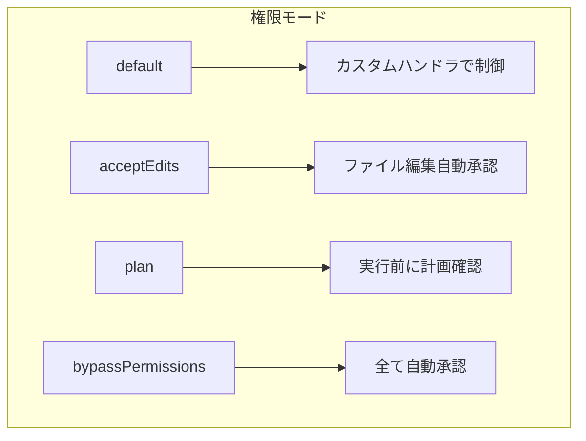

### 5.5 ホスティング要件

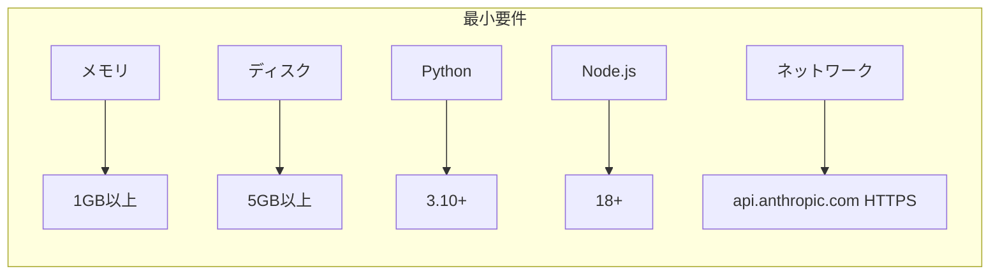

### 5.6 セキュリティ考慮事項

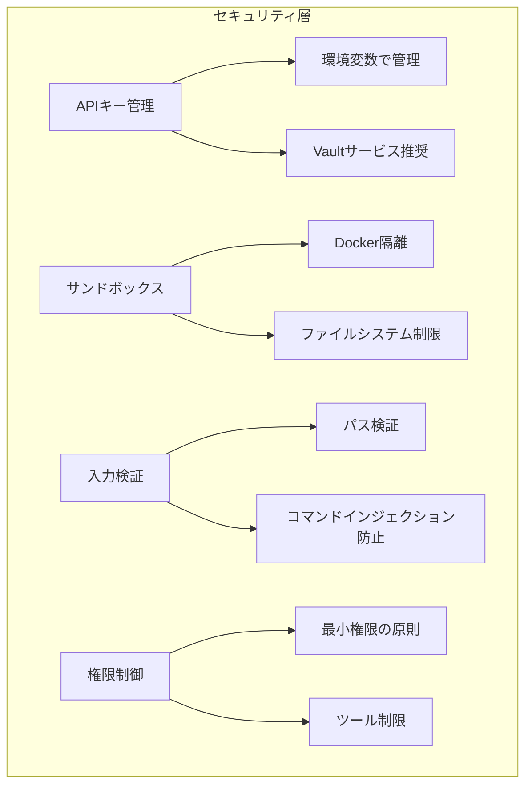

#### セキュアな実装パターン

```python
import os
import re
from pathlib import Path

class SecurityValidator:
    """セキュリティ検証ユーティリティ"""

    ALLOWED_BASE_PATHS = ["/workspace", "/projects"]
    DANGEROUS_PATTERNS = [
        r"\.\./",  # パストラバーサル
        r";\s*rm\s",  # コマンドインジェクション
        r"\$\(",  # コマンド置換
        r"`",  # バッククォート実行
    ]

    @classmethod
    def validate_path(cls, path: str, project_root: str) -> bool:
        """パスの安全性検証"""
        try:
            resolved = Path(path).resolve()
            root = Path(project_root).resolve()
            return resolved.is_relative_to(root)
        except Exception:
            return False

    @classmethod
    def validate_prompt(cls, prompt: str) -> bool:
        """プロンプトの安全性検証"""
        for pattern in cls.DANGEROUS_PATTERNS:
            if re.search(pattern, prompt):
                return False
        return True

    @classmethod
    def get_safe_options(cls, project_path: str) -> ClaudeAgentOptions:
        """セキュアなオプション生成"""
        return ClaudeAgentOptions(
            # 必要最小限のツール
            allowed_tools=["Read", "Write", "Edit", "Glob", "Grep"],
            disallowed_tools=["Bash", "WebFetch", "WebSearch"],

            # 権限制御
            permission_mode="acceptEdits",

            # 環境制限
            cwd=project_path,
            env={
                "PATH": "/usr/local/bin:/usr/bin:/bin",
                "HOME": project_path,
            },

            # ターン制限
            max_turns=50,
        )
```

### 5.7 パフォーマンス最適化

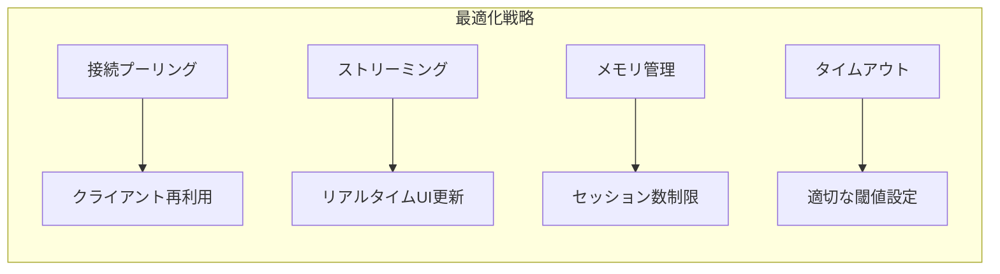

#### 最適化実装例

```python
import asyncio
from collections import OrderedDict
from typing import Optional

class OptimizedSessionPool:
    """最適化されたセッションプール"""

    def __init__(self, max_sessions: int = 100, idle_timeout: int = 1800):
        self.max_sessions = max_sessions
        self.idle_timeout = idle_timeout
        self.clients: OrderedDict[str, tuple[ClaudeSDKClient, float]] = OrderedDict()
        self._cleanup_task: Optional[asyncio.Task] = None

    async def start(self):
        """クリーンアップタスク開始"""
        self._cleanup_task = asyncio.create_task(self._cleanup_loop())

    async def stop(self):
        """プール停止"""
        if self._cleanup_task:
            self._cleanup_task.cancel()
        for session_id, (client, _) in list(self.clients.items()):
            await client.__aexit__(None, None, None)
        self.clients.clear()

    async def get_client(self, session_id: str, options: ClaudeAgentOptions) -> ClaudeSDKClient:
        """クライアント取得（LRUキャッシュ）"""
        import time

        if session_id in self.clients:
            client, _ = self.clients.pop(session_id)
            self.clients[session_id] = (client, time.time())
            return client

        # 容量超過時は最古のセッションを削除
        while len(self.clients) >= self.max_sessions:
            oldest_id, (oldest_client, _) = self.clients.popitem(last=False)
            await oldest_client.__aexit__(None, None, None)

        # 新規クライアント作成
        client = ClaudeSDKClient(options=options)
        await client.__aenter__()
        self.clients[session_id] = (client, time.time())
        return client

    async def _cleanup_loop(self):
        """アイドルセッションのクリーンアップ"""
        import time

        while True:
            await asyncio.sleep(60)  # 1分ごとにチェック
            now = time.time()
            expired = [
                sid for sid, (_, last_active) in self.clients.items()
                if now - last_active > self.idle_timeout
            ]
            for session_id in expired:
                client, _ = self.clients.pop(session_id)
                await client.__aexit__(None, None, None)
```

---

## 6. 実装例: WebSocket統合

```python
from fastapi import FastAPI, WebSocket
from claude_agent_sdk import ClaudeSDKClient, ClaudeAgentOptions, AssistantMessage, TextBlock
import json

app = FastAPI()

class SessionManager:
    def __init__(self):
        self.sessions = {}

    async def get_or_create(self, session_id: str) -> ClaudeSDKClient:
        if session_id not in self.sessions:
            client = ClaudeSDKClient(options=ClaudeAgentOptions(
                allowed_tools=["Read", "Write", "Edit", "Bash"],
                permission_mode="acceptEdits"
            ))
            await client.__aenter__()
            self.sessions[session_id] = client
        return self.sessions[session_id]

session_manager = SessionManager()

@app.websocket("/ws/chat/{session_id}")
async def websocket_endpoint(websocket: WebSocket, session_id: str):
    await websocket.accept()
    client = await session_manager.get_or_create(session_id)

    while True:
        data = await websocket.receive_json()

        if data["type"] == "chat":
            await client.query(data["content"])

            async for message in client.receive_response():
                if isinstance(message, AssistantMessage):
                    for block in message.content:
                        if isinstance(block, TextBlock):
                            await websocket.send_json({
                                "type": "text",
                                "content": block.text
                            })
```

---

## 7. テスト戦略

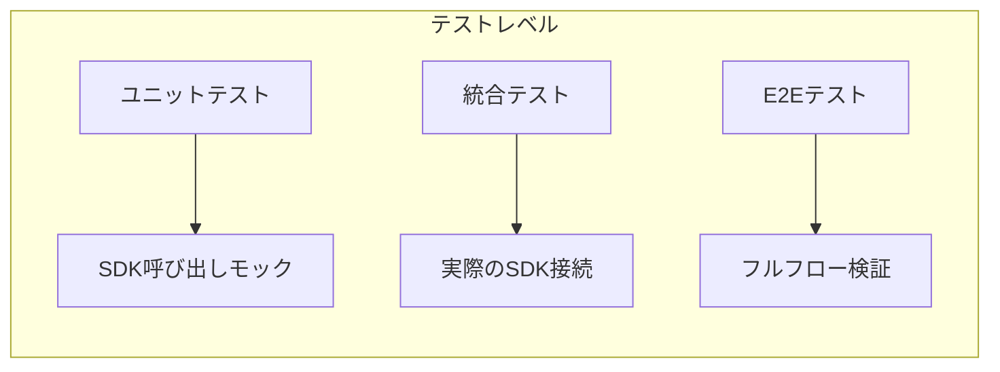

### 7.1 モックを使用したユニットテスト

```python
import pytest
from unittest.mock import AsyncMock, patch

@pytest.mark.asyncio
async def test_session_manager_create_session():
    """セッション作成のユニットテスト"""
    with patch('claude_agent_sdk.ClaudeSDKClient') as MockClient:
        mock_client = AsyncMock()
        MockClient.return_value.__aenter__.return_value = mock_client

        manager = SessionManager()
        session = await manager.create_session("project-123")

        assert session.project_id == "project-123"
        assert session.sdk_session_id is None

@pytest.mark.asyncio
async def test_query_with_mock_response():
    """クエリレスポンスのモック"""
    mock_messages = [
        AssistantMessage(content=[TextBlock(text="Hello!")])
    ]

    with patch('claude_agent_sdk.query') as mock_query:
        mock_query.return_value = AsyncMock()
        mock_query.return_value.__aiter__ = lambda self: iter(mock_messages)

        results = []
        async for msg in query(prompt="Hi"):
            results.append(msg)

        assert len(results) == 1
```

---

## 参考資料

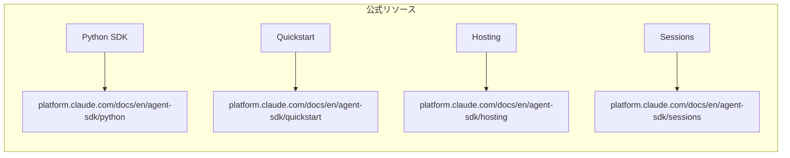

- 公式ドキュメント: https://platform.claude.com/docs/en/agent-sdk/python
- Quickstart: https://platform.claude.com/docs/en/agent-sdk/quickstart
- ホスティング: https://platform.claude.com/docs/en/agent-sdk/hosting
- セッション管理: https://platform.claude.com/docs/en/agent-sdk/sessions

---

**調査完了日:** 2025-12-20
**最終更新:** 2025-12-21
**レビュー状態:** ✅ 完了（100%）
