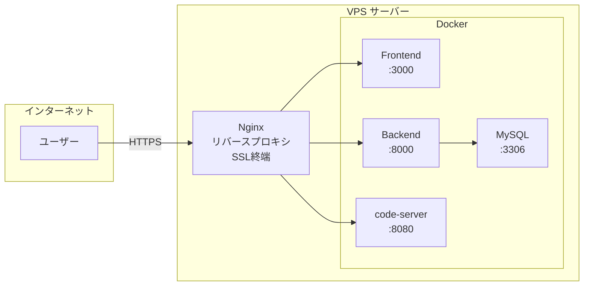

# デプロイガイド

本番環境へのデプロイ手順書です。VPSへのデプロイとドメイン設定を解説します。

---

## 目次

1. [概要](#1-概要)
2. [VPSデプロイ（DigitalOcean）](#2-vpsデプロイdigitalocean)
3. [ドメイン設定](#3-ドメイン設定)
4. [SSL証明書（Let's Encrypt）](#4-ssl証明書lets-encrypt)
5. [自動起動・バックアップ](#5-自動起動バックアップ)
6. [トラブルシューティング](#6-トラブルシューティング)

---

## 1. 概要

### システム要件

| 項目 | 最小 | 推奨 |
|------|------|------|
| CPU | 2 vCPU | 4 vCPU |
| メモリ | 4 GB | 8 GB |
| ストレージ | 30 GB SSD | 50 GB SSD |
| OS | Ubuntu 22.04 LTS | Ubuntu 22.04 LTS |

### デプロイ構成



---

## 2. VPSデプロイ（DigitalOcean）

### 2.1 Droplet作成

1. [DigitalOcean](https://www.digitalocean.com/) でアカウント作成

2. **Create Droplet** をクリック

3. 以下の設定で作成:

| 項目 | 設定値 |
|------|--------|
| Region | Singapore (sgp1) または Tokyo |
| Image | Ubuntu 22.04 LTS |
| Size | Basic → Regular → 4 vCPU / 8 GB ($48/月) |
| Authentication | SSH Key（推奨） |
| Hostname | claude-code |

4. **Create Droplet** で作成完了

### 2.2 サーバー初期設定

```bash
# SSHで接続
ssh root@<DROPLET_IP>

# システム更新
apt update && apt upgrade -y

# 必要パッケージインストール
apt install -y curl git ufw

# Dockerインストール
curl -fsSL https://get.docker.com | sh

# Docker Composeインストール
apt install -y docker-compose-plugin

# 作業ユーザー作成
adduser claude
usermod -aG sudo claude
usermod -aG docker claude
```

### 2.3 ファイアウォール設定

```bash
# SSHとHTTP/HTTPSのみ許可
ufw allow OpenSSH
ufw allow 80/tcp
ufw allow 443/tcp
ufw enable

# 確認
ufw status
```

### 2.4 プロジェクトデプロイ

```bash
# 作業ユーザーに切り替え
su - claude

# プロジェクトクローン
git clone <repository-url>
cd AGENTSDK

# 環境変数設定
cp .env.example .env

# シークレットキー生成
openssl rand -hex 32
# 出力されたキーを .env の SECRET_KEY に設定

# .envを編集
nano .env
```

**.env 設定例:**

```bash
# 必須設定
SECRET_KEY=<生成したシークレットキー>

# 本番用URL設定
NEXT_PUBLIC_API_URL=https://api.yourdomain.com
NEXT_PUBLIC_WS_URL=wss://api.yourdomain.com
ALLOWED_ORIGINS=https://yourdomain.com
```

```bash
# ビルド・起動
docker compose build
docker compose up -d

# 起動確認
docker compose ps
docker compose logs -f
```

---

## 3. ドメイン設定

### 3.1 ドメイン取得

| レジストラ | 特徴 |
|-----------|------|
| [Namecheap](https://www.namecheap.com/) | 安価、使いやすい |
| [Google Domains](https://domains.google/) | Googleアカウント統合 |
| [お名前.com](https://www.onamae.com/) | 日本語サポート |

### 3.2 DNS設定

ドメインのDNS設定で以下のAレコードを追加:

| タイプ | ホスト名 | 値 | TTL |
|--------|---------|-----|-----|
| A | @ | `<DROPLET_IP>` | 3600 |
| A | api | `<DROPLET_IP>` | 3600 |
| A | code | `<DROPLET_IP>` | 3600 |

**設定例（yourdomain.com の場合）:**

```
yourdomain.com      → <DROPLET_IP>   # フロントエンド
api.yourdomain.com  → <DROPLET_IP>   # バックエンドAPI
code.yourdomain.com → <DROPLET_IP>   # VSCode Web
```

### 3.3 Nginxリバースプロキシ設定

```bash
# Nginxインストール
sudo apt install -y nginx

# 設定ファイル作成
sudo nano /etc/nginx/sites-available/claude-code
```

**Nginx設定:**

```nginx
# Frontend
server {
    listen 80;
    server_name yourdomain.com;

    location / {
        proxy_pass http://localhost:3000;
        proxy_http_version 1.1;
        proxy_set_header Upgrade $http_upgrade;
        proxy_set_header Connection 'upgrade';
        proxy_set_header Host $host;
        proxy_set_header X-Real-IP $remote_addr;
        proxy_set_header X-Forwarded-For $proxy_add_x_forwarded_for;
        proxy_set_header X-Forwarded-Proto $scheme;
        proxy_cache_bypass $http_upgrade;
    }
}

# Backend API
server {
    listen 80;
    server_name api.yourdomain.com;

    location / {
        proxy_pass http://localhost:8000;
        proxy_http_version 1.1;
        proxy_set_header Upgrade $http_upgrade;
        proxy_set_header Connection 'upgrade';
        proxy_set_header Host $host;
        proxy_set_header X-Real-IP $remote_addr;
        proxy_set_header X-Forwarded-For $proxy_add_x_forwarded_for;
        proxy_set_header X-Forwarded-Proto $scheme;
        proxy_cache_bypass $http_upgrade;
    }

    # WebSocket
    location /ws {
        proxy_pass http://localhost:8000;
        proxy_http_version 1.1;
        proxy_set_header Upgrade $http_upgrade;
        proxy_set_header Connection "Upgrade";
        proxy_set_header Host $host;
        proxy_read_timeout 86400;
    }
}

# code-server
server {
    listen 80;
    server_name code.yourdomain.com;

    location / {
        proxy_pass http://localhost:8080;
        proxy_http_version 1.1;
        proxy_set_header Upgrade $http_upgrade;
        proxy_set_header Connection 'upgrade';
        proxy_set_header Host $host;
        proxy_cache_bypass $http_upgrade;
    }
}
```

```bash
# 設定有効化
sudo ln -s /etc/nginx/sites-available/claude-code /etc/nginx/sites-enabled/

# 設定テスト
sudo nginx -t

# Nginx再起動
sudo systemctl reload nginx
```

---

## 4. SSL証明書（Let's Encrypt）

### 4.1 Certbotインストール

```bash
sudo apt install -y certbot python3-certbot-nginx
```

### 4.2 証明書取得

```bash
# 全ドメインの証明書を一括取得
sudo certbot --nginx \
  -d yourdomain.com \
  -d api.yourdomain.com \
  -d code.yourdomain.com
```

**対話形式の質問:**

| 質問 | 回答 |
|------|------|
| メールアドレス | 有効なメールアドレスを入力 |
| 利用規約同意 | Y |
| メール配信 | N（任意） |
| HTTPSリダイレクト | 2（Redirect推奨） |

### 4.3 自動更新確認

```bash
# 更新テスト
sudo certbot renew --dry-run

# 自動更新はsystemdタイマーで設定済み
sudo systemctl status certbot.timer
```

### 4.4 .env更新

SSL設定後、`.env` のURLをHTTPSに更新:

```bash
NEXT_PUBLIC_API_URL=https://api.yourdomain.com
NEXT_PUBLIC_WS_URL=wss://api.yourdomain.com
ALLOWED_ORIGINS=https://yourdomain.com
```

```bash
# 設定反映
docker compose down
docker compose up -d
```

---

## 5. 自動起動・バックアップ

### 5.1 サービス自動起動設定

```bash
sudo nano /etc/systemd/system/claude-code.service
```

```ini
[Unit]
Description=Claude Code Docker Compose
Requires=docker.service
After=docker.service

[Service]
Type=oneshot
RemainAfterExit=yes
WorkingDirectory=/home/claude/AGENTSDK
ExecStart=/usr/bin/docker compose up -d
ExecStop=/usr/bin/docker compose down
User=claude
Group=claude

[Install]
WantedBy=multi-user.target
```

```bash
# サービス有効化
sudo systemctl enable claude-code
sudo systemctl start claude-code

# 状態確認
sudo systemctl status claude-code
```

### 5.2 バックアップスクリプト

```bash
nano ~/backup.sh
```

```bash
#!/bin/bash
BACKUP_DIR="/home/claude/backups/$(date +%Y%m%d)"
mkdir -p "$BACKUP_DIR"

cd /home/claude/AGENTSDK

# データベースバックアップ
docker compose exec -T mysql mysqldump -u root -p${MYSQL_ROOT_PASSWORD} --all-databases > "$BACKUP_DIR/mysql.sql"

# ワークスペースバックアップ
tar czf "$BACKUP_DIR/workspace.tar.gz" -C workspace .

# 環境変数バックアップ
cp .env "$BACKUP_DIR/.env.backup"

# 30日以上古いバックアップを削除
find /home/claude/backups -type d -mtime +30 -exec rm -rf {} + 2>/dev/null

echo "Backup completed: $BACKUP_DIR"
```

```bash
# 実行権限付与
chmod +x ~/backup.sh

# cron登録（毎日午前3時）
crontab -e
```

追加する行:
```
0 3 * * * /home/claude/backup.sh >> /home/claude/backup.log 2>&1
```

---

## 6. トラブルシューティング

### よくある問題

| 問題 | 確認コマンド | 解決策 |
|------|-------------|--------|
| コンテナ起動しない | `docker compose logs` | ログでエラー確認、.env設定確認 |
| 502 Bad Gateway | `docker compose ps` | 対象コンテナの起動状態確認 |
| WebSocket接続エラー | Nginx設定確認 | `proxy_http_version 1.1` と `Upgrade` ヘッダー設定 |
| SSL証明書エラー | `sudo certbot renew --dry-run` | DNS設定、ファイアウォール確認 |
| ディスク容量不足 | `docker system df` | `docker system prune -a` で不要イメージ削除 |

### デバッグコマンド

```bash
# コンテナ状態確認
docker compose ps
docker compose logs -f --tail=100

# リソース使用状況
docker stats

# Nginx設定テスト
sudo nginx -t
sudo tail -f /var/log/nginx/error.log

# SSL証明書確認
sudo certbot certificates

# ネットワーク確認
curl -I http://localhost:3000
curl -I http://localhost:8000/api/health
```

### 完全リセット

問題が解決しない場合:

```bash
# サービス停止
docker compose down -v

# キャッシュクリア
docker system prune -a

# 再ビルド・起動
docker compose build --no-cache
docker compose up -d
```

---

## コスト概算

### DigitalOcean

| 項目 | 月額 |
|------|------|
| Droplet (4 vCPU / 8 GB) | $48 |
| Block Storage 50GB（任意） | $5 |
| バックアップ（任意） | $9.60 |
| **合計** | **$48〜62** |

### その他のVPSオプション

| プロバイダ | スペック | 月額 |
|-----------|---------|------|
| Linode | 4 vCPU / 8 GB | $48 |
| Vultr | 4 vCPU / 8 GB | $48 |
| さくらVPS | 4コア / 8 GB | ¥6,400 |
| Hetzner | 4 vCPU / 8 GB | €15 |

---

## チェックリスト

デプロイ完了時の確認項目:

| 項目 | 確認 |
|------|:----:|
| Dockerコンテナ全起動 | ☐ |
| https://yourdomain.com アクセス可能 | ☐ |
| https://api.yourdomain.com/docs アクセス可能 | ☐ |
| https://code.yourdomain.com アクセス可能 | ☐ |
| ログイン・チャット動作確認 | ☐ |
| 自動起動設定済み | ☐ |
| バックアップ設定済み | ☐ |
| SSL自動更新確認済み | ☐ |

---

## 関連ドキュメント

| ドキュメント | 内容 |
|-------------|------|
| [スタートガイド](start-guide.md) | ローカル環境構築 |
| [ユーザガイド](user-guide.md) | 操作方法・設定 |

---

## 改訂履歴

| バージョン | 日付 | 変更内容 |
|-----------|------|----------|
| 1.0.0 | 2025-01 | 初版作成 |
