# Web版Claude Code - デプロイメントガイド

**作成日:** 2025-12-21
**バージョン:** 1.0
**ステータス:** ✅ 完了

---

## 目次

1. [概要](#1-概要)
2. [デプロイ先の比較分析](#2-デプロイ先の比較分析)
3. [推奨デプロイ方法](#3-推奨デプロイ方法)
4. [詳細デプロイ手順](#4-詳細デプロイ手順)
5. [セキュリティ設定](#5-セキュリティ設定)
6. [監視・運用](#6-監視運用)
7. [トラブルシューティング](#7-トラブルシューティング)

---

## 1. 概要

### 1.1 システム構成

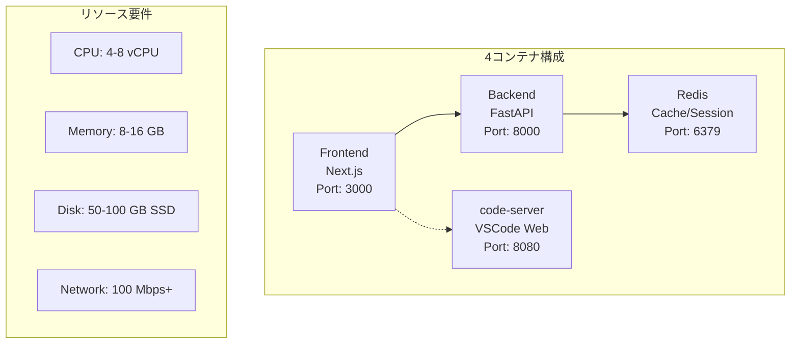

### 1.2 デプロイ要件チェックリスト

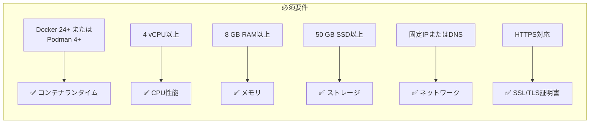

---

## 2. デプロイ先の比較分析

### 2.1 総合比較マトリクス

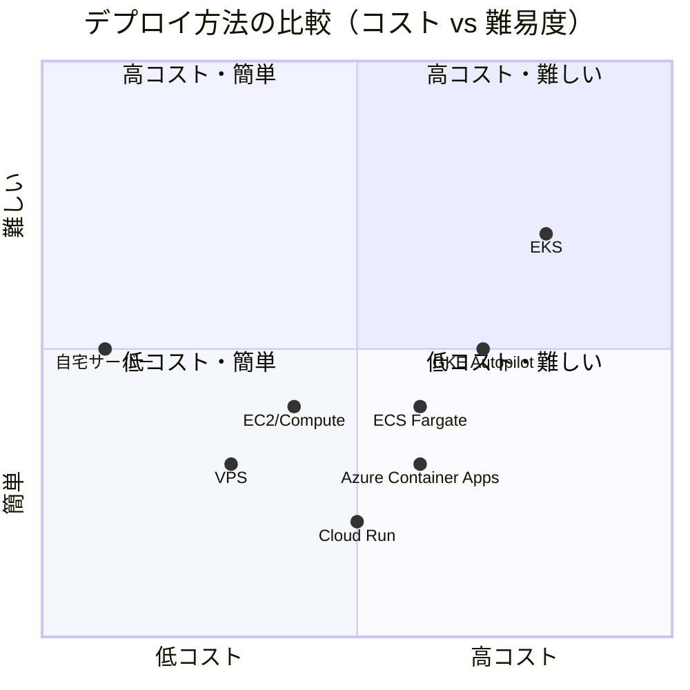

### 2.2 クラウドサービス詳細比較

#### 2.2.1 AWS オプション

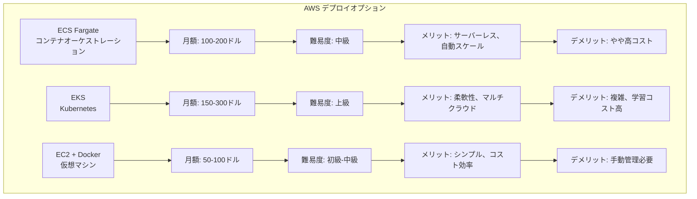

#### 2.2.2 GCP オプション

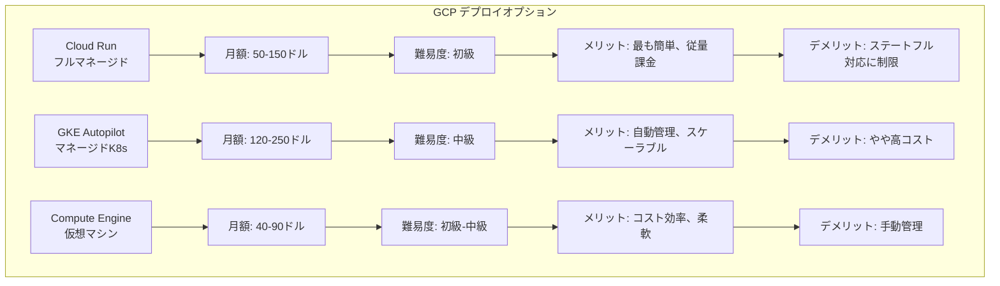

#### 2.2.3 Azure オプション

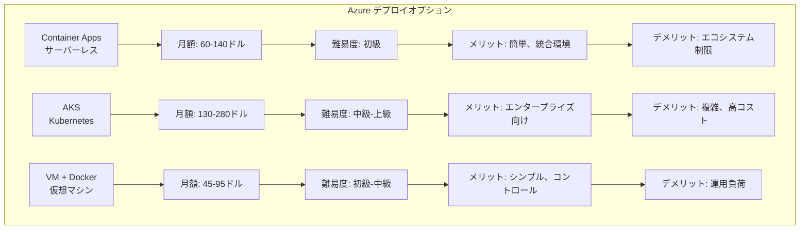

### 2.3 VPS/専用サーバー比較

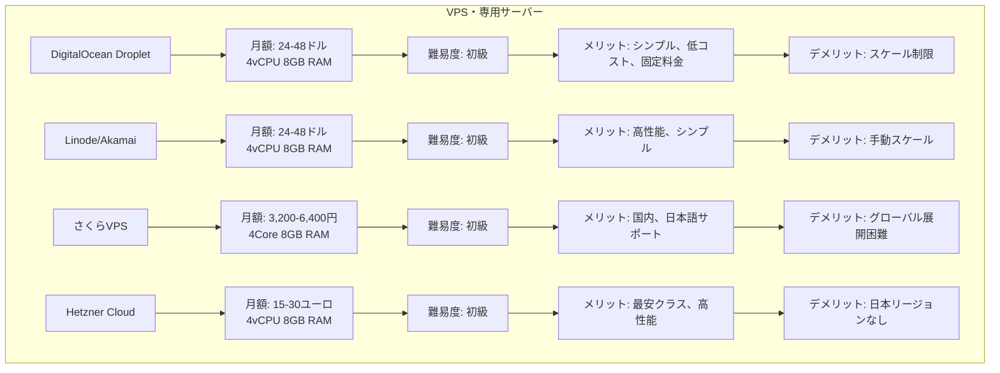

### 2.4 自宅サーバー/オンプレミス

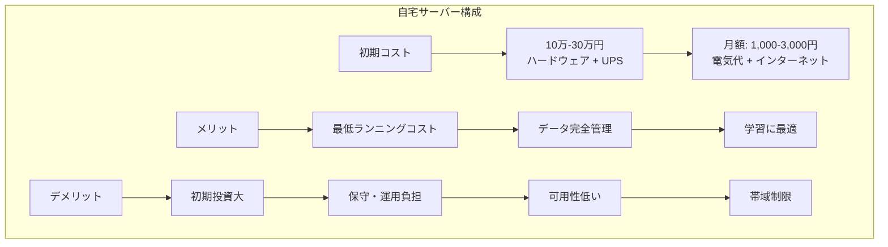

### 2.5 コスト比較（月額）

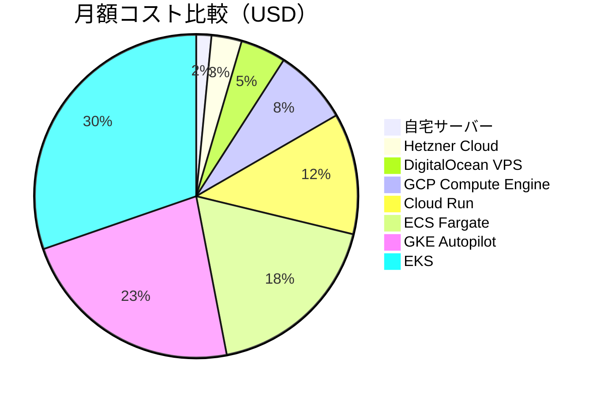

### 2.6 特徴マトリクス

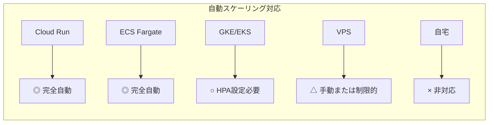

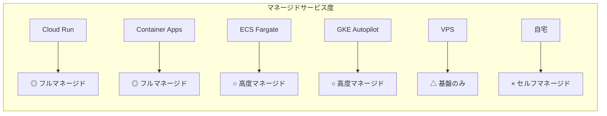

### 2.7 ユースケース別推奨度

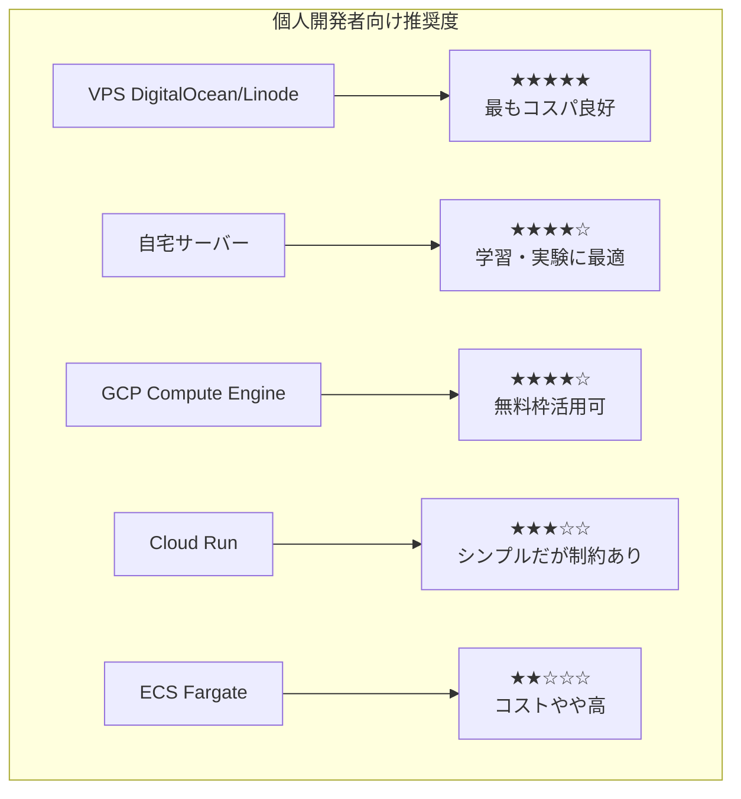

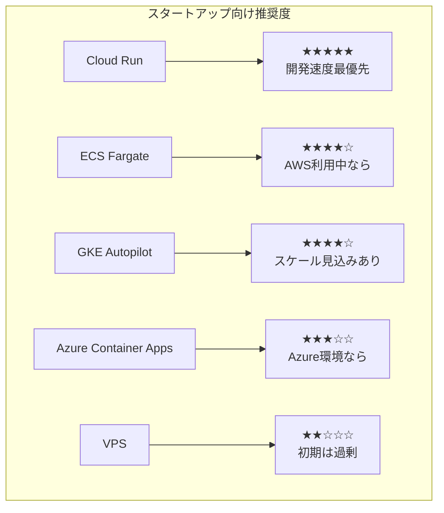

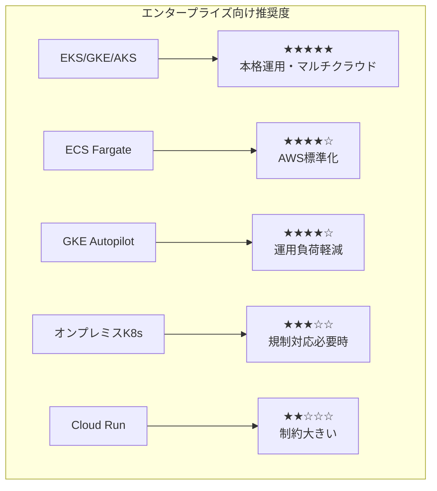

---

## 3. 推奨デプロイ方法

### 3.1 ユースケース別ベストプラクティス

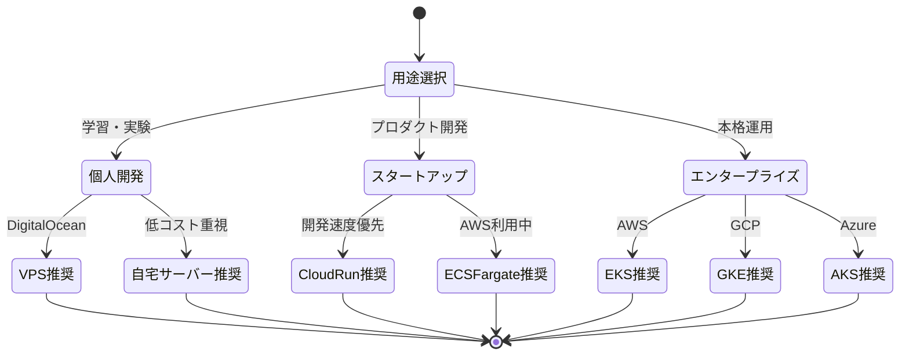

### 3.2 推奨方法の詳細

#### 個人開発者向け: DigitalOcean VPS (最推奨)

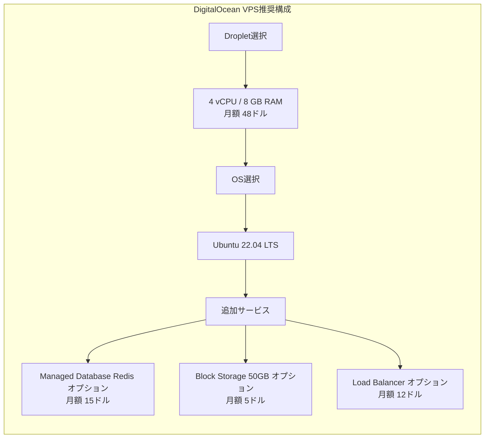

**メリット:**
- シンプルなセットアップ（30分以内）
- 固定料金で予算管理しやすい
- ワンクリックDocker対応
- スナップショット機能で簡単バックアップ
- 無料帯域1TBで十分

**推奨理由:**
- コストパフォーマンスが最高
- 学習曲線が緩やか
- 本番環境へのスムーズな移行可能

#### スタートアップ向け: GCP Cloud Run (最推奨)

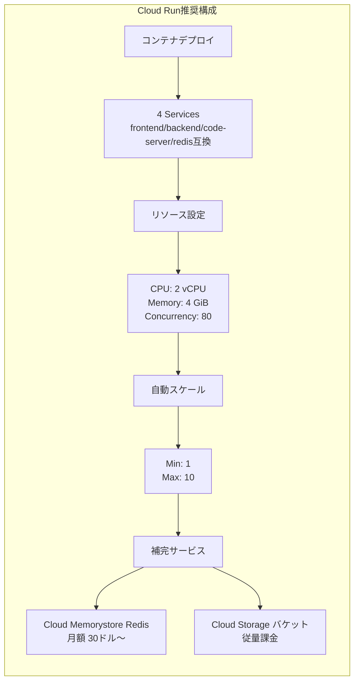

**メリット:**
- 完全マネージド（運用ほぼゼロ）
- 従量課金で初期コスト低い
- 自動スケーリング
- HTTPS自動設定

**注意点:**
- Redisとcode-serverは別サービス化必要
- WebSocket対応要確認（Cloud Runは対応済み）

#### エンタープライズ向け: AWS EKS (最推奨)

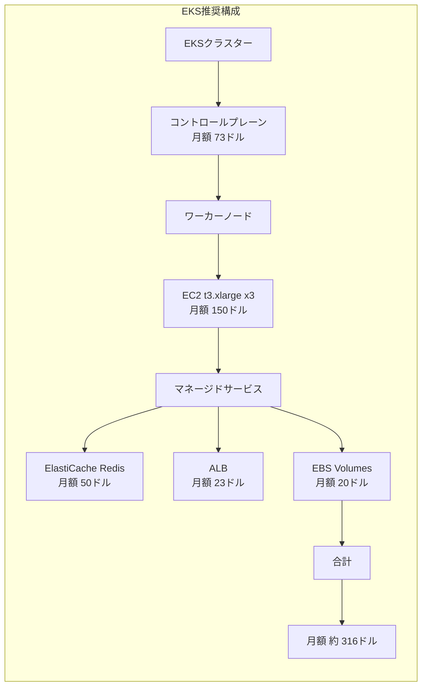

**メリット:**
- Kubernetes標準（マルチクラウド・オンプレ移行容易）
- AWSエコシステム統合
- エンタープライズグレードSLA
- 高度な監視・ログ機能

**適用条件:**
- チームにKubernetes知識がある
- マルチクラウド戦略を検討中
- 高可用性・スケーラビリティ必須

---

## 4. 詳細デプロイ手順

### 4.1 DigitalOcean VPS デプロイ（個人開発者推奨）

#### 4.1.1 前提条件

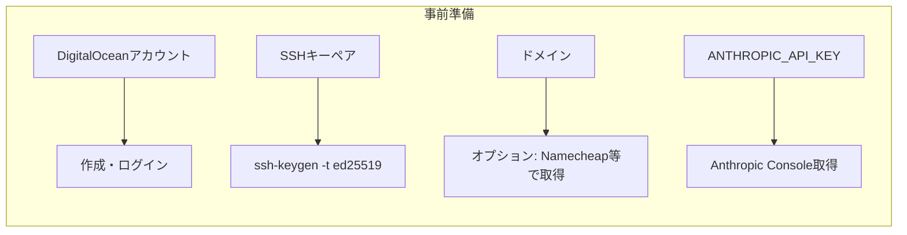

#### 4.1.2 ステップバイステップ手順

**Step 1: Droplet作成**

```bash
# DigitalOcean CLI (doctl) インストール
brew install doctl  # macOS
# または
snap install doctl  # Linux

# 認証
doctl auth init

# SSHキー登録
doctl compute ssh-key import claude-key --public-key-file ~/.ssh/id_ed25519.pub

# Droplet作成
doctl compute droplet create claude-code \
  --image ubuntu-22-04-x64 \
  --size s-4vcpu-8gb \
  --region sgp1 \
  --ssh-keys $(doctl compute ssh-key list --format ID --no-header) \
  --enable-monitoring \
  --enable-ipv6 \
  --tag-names web,production

# IPアドレス確認
doctl compute droplet list
```

**Step 2: サーバー初期設定**

```bash
# SSH接続
ssh root@<DROPLET_IP>

# システム更新
apt update && apt upgrade -y

# Docker インストール
curl -fsSL https://get.docker.com -o get-docker.sh
sh get-docker.sh

# Docker Compose インストール
apt install docker-compose-plugin -y

# 非rootユーザー作成
adduser claude
usermod -aG sudo claude
usermod -aG docker claude

# ファイアウォール設定
ufw allow OpenSSH
ufw allow 80/tcp
ufw allow 443/tcp
ufw enable
```

**Step 3: プロジェクトデプロイ**

```bash
# ユーザー切り替え
su - claude

# プロジェクトクローン
git clone https://github.com/yourusername/claude-code.git
cd claude-code

# 環境変数設定
cp .env.example .env
nano .env
# 以下を設定:
# ANTHROPIC_API_KEY=sk-ant-xxx
# SECRET_KEY=$(openssl rand -hex 32)
# ALLOWED_ORIGINS=https://yourdomain.com
# NEXT_PUBLIC_API_URL=https://api.yourdomain.com
# NEXT_PUBLIC_WS_URL=wss://api.yourdomain.com

# ワークスペースディレクトリ作成
mkdir -p workspace
chmod 755 workspace

# Docker Composeでビルド・起動
docker compose build
docker compose up -d

# ログ確認
docker compose logs -f
```

**Step 4: Nginx リバースプロキシ設定**

```bash
# Nginx インストール
sudo apt install nginx certbot python3-certbot-nginx -y

# Nginx設定ファイル作成
sudo nano /etc/nginx/sites-available/claude-code
```

Nginx設定内容:

```nginx
# Frontend
server {
    listen 80;
    server_name yourdomain.com;

    location / {
        proxy_pass http://localhost:3000;
        proxy_http_version 1.1;
        proxy_set_header Upgrade $http_upgrade;
        proxy_set_header Connection 'upgrade';
        proxy_set_header Host $host;
        proxy_cache_bypass $http_upgrade;
        proxy_set_header X-Real-IP $remote_addr;
        proxy_set_header X-Forwarded-For $proxy_add_x_forwarded_for;
        proxy_set_header X-Forwarded-Proto $scheme;
    }
}

# Backend API
server {
    listen 80;
    server_name api.yourdomain.com;

    location / {
        proxy_pass http://localhost:8000;
        proxy_http_version 1.1;
        proxy_set_header Upgrade $http_upgrade;
        proxy_set_header Connection 'upgrade';
        proxy_set_header Host $host;
        proxy_cache_bypass $http_upgrade;
        proxy_set_header X-Real-IP $remote_addr;
        proxy_set_header X-Forwarded-For $proxy_add_x_forwarded_for;
        proxy_set_header X-Forwarded-Proto $scheme;
    }

    # WebSocket特別対応
    location /ws {
        proxy_pass http://localhost:8000;
        proxy_http_version 1.1;
        proxy_set_header Upgrade $http_upgrade;
        proxy_set_header Connection "Upgrade";
        proxy_set_header Host $host;
        proxy_read_timeout 86400;
    }
}

# code-server (Optional)
server {
    listen 80;
    server_name code.yourdomain.com;

    location / {
        proxy_pass http://localhost:8080;
        proxy_http_version 1.1;
        proxy_set_header Upgrade $http_upgrade;
        proxy_set_header Connection 'upgrade';
        proxy_set_header Host $host;
        proxy_cache_bypass $http_upgrade;
    }
}
```

```bash
# 設定有効化
sudo ln -s /etc/nginx/sites-available/claude-code /etc/nginx/sites-enabled/
sudo nginx -t
sudo systemctl reload nginx

# SSL証明書取得（Let's Encrypt）
sudo certbot --nginx -d yourdomain.com -d api.yourdomain.com -d code.yourdomain.com
```

**Step 5: 自動起動設定**

```bash
# systemdサービス作成
sudo nano /etc/systemd/system/claude-code.service
```

systemdサービス内容:

```ini
[Unit]
Description=Claude Code Docker Compose
Requires=docker.service
After=docker.service

[Service]
Type=oneshot
RemainAfterExit=yes
WorkingDirectory=/home/claude/claude-code
ExecStart=/usr/bin/docker compose up -d
ExecStop=/usr/bin/docker compose down
User=claude
Group=claude

[Install]
WantedBy=multi-user.target
```

```bash
# サービス有効化
sudo systemctl enable claude-code
sudo systemctl start claude-code
```

**Step 6: バックアップ設定**

```bash
# バックアップスクリプト作成
nano ~/backup.sh
```

バックアップスクリプト:

```bash
#!/bin/bash
BACKUP_DIR="/home/claude/backups/$(date +%Y%m%d)"
mkdir -p "$BACKUP_DIR"

# Docker volumes バックアップ
cd /home/claude/claude-code
docker compose exec -T backend tar czf - /app/workspace > "$BACKUP_DIR/workspace.tar.gz"
docker compose exec -T redis redis-cli BGSAVE
docker compose cp redis:/data/dump.rdb "$BACKUP_DIR/redis-dump.rdb"

# .env バックアップ
cp .env "$BACKUP_DIR/.env.backup"

# 古いバックアップ削除（30日以前）
find /home/claude/backups -type d -mtime +30 -exec rm -rf {} +

echo "Backup completed: $BACKUP_DIR"
```

```bash
# 実行権限付与
chmod +x ~/backup.sh

# cron登録（毎日午前3時）
crontab -e
# 追加: 0 3 * * * /home/claude/backup.sh >> /home/claude/backup.log 2>&1
```

#### 4.1.3 コスト概算

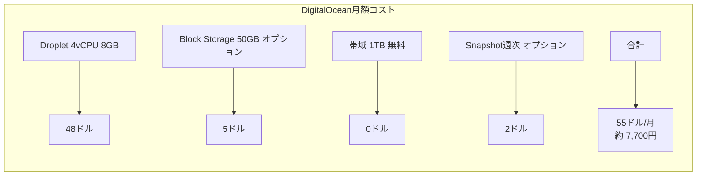

---

### 4.2 GCP Cloud Run デプロイ（スタートアップ推奨）

#### 4.2.1 アーキテクチャ調整

Cloud Runはステートレスなので、構成を調整します。

```mermaid
flowchart TB
    subgraph Cloud Run Services
        FE[Frontend Service<br/>Next.js SSR]
        BE[Backend Service<br/>FastAPI]
        CS[code-server Service<br/>VSCode Web]
    end

    subgraph Managed Services
        MR[Cloud Memorystore<br/>Redis]
        CS_Storage[Cloud Storage<br/>Workspace Files]
    end

    subgraph Networking
        LB[Cloud Load Balancer<br/>HTTPS終端]
    end

    LB --> FE
    LB --> BE
    LB --> CS
    BE --> MR
    BE --> CS_Storage
    CS --> CS_Storage
```

#### 4.2.2 デプロイ手順

**Step 1: GCP プロジェクト設定**

```bash
# gcloud CLI インストール（macOS）
brew install google-cloud-sdk

# 認証
gcloud auth login
gcloud config set project YOUR_PROJECT_ID

# APIの有効化
gcloud services enable \
  run.googleapis.com \
  redis.googleapis.com \
  storage.googleapis.com \
  artifactregistry.googleapis.com
```

**Step 2: Cloud Memorystore (Redis) 作成**

```bash
# Redisインスタンス作成
gcloud redis instances create claude-redis \
  --size=1 \
  --region=asia-northeast1 \
  --redis-version=redis_7_0 \
  --tier=basic

# 接続情報取得
gcloud redis instances describe claude-redis --region=asia-northeast1 --format="value(host,port)"
```

**Step 3: Cloud Storage バケット作成**

```bash
# バケット作成
gcloud storage buckets create gs://claude-code-workspace \
  --location=asia-northeast1 \
  --uniform-bucket-level-access

# サービスアカウント作成
gcloud iam service-accounts create claude-backend \
  --display-name="Claude Backend Service Account"

# バケットへの権限付与
gcloud storage buckets add-iam-policy-binding gs://claude-code-workspace \
  --member="serviceAccount:claude-backend@YOUR_PROJECT_ID.iam.gserviceaccount.com" \
  --role="roles/storage.objectAdmin"
```

**Step 4: コンテナイメージビルド・プッシュ**

```bash
# Artifact Registry リポジトリ作成
gcloud artifacts repositories create claude-code \
  --repository-format=docker \
  --location=asia-northeast1

# Docker認証設定
gcloud auth configure-docker asia-northeast1-docker.pkg.dev

# バックエンドイメージビルド・プッシュ
cd src/backend
docker build -t asia-northeast1-docker.pkg.dev/YOUR_PROJECT_ID/claude-code/backend:latest .
docker push asia-northeast1-docker.pkg.dev/YOUR_PROJECT_ID/claude-code/backend:latest

# フロントエンドイメージビルド・プッシュ
cd ../frontend
docker build \
  --build-arg NEXT_PUBLIC_API_URL=https://api.yourdomain.com \
  --build-arg NEXT_PUBLIC_WS_URL=wss://api.yourdomain.com \
  -t asia-northeast1-docker.pkg.dev/YOUR_PROJECT_ID/claude-code/frontend:latest .
docker push asia-northeast1-docker.pkg.dev/YOUR_PROJECT_ID/claude-code/frontend:latest

# code-serverイメージ（ビルド不要、公式イメージ使用）
```

**Step 5: Cloud Run サービスデプロイ**

```bash
# Backend Service デプロイ
gcloud run deploy claude-backend \
  --image=asia-northeast1-docker.pkg.dev/YOUR_PROJECT_ID/claude-code/backend:latest \
  --region=asia-northeast1 \
  --platform=managed \
  --allow-unauthenticated \
  --memory=4Gi \
  --cpu=2 \
  --min-instances=1 \
  --max-instances=10 \
  --set-env-vars="REDIS_URL=redis://REDIS_HOST:6379" \
  --set-env-vars="ANTHROPIC_API_KEY=sk-ant-xxx" \
  --set-env-vars="SECRET_KEY=$(openssl rand -hex 32)" \
  --set-env-vars="ENVIRONMENT=production" \
  --service-account=claude-backend@YOUR_PROJECT_ID.iam.gserviceaccount.com \
  --vpc-connector=projects/YOUR_PROJECT_ID/locations/asia-northeast1/connectors/claude-vpc \
  --vpc-egress=private-ranges-only

# Frontend Service デプロイ
gcloud run deploy claude-frontend \
  --image=asia-northeast1-docker.pkg.dev/YOUR_PROJECT_ID/claude-code/frontend:latest \
  --region=asia-northeast1 \
  --platform=managed \
  --allow-unauthenticated \
  --memory=2Gi \
  --cpu=1 \
  --min-instances=1 \
  --max-instances=5 \
  --set-env-vars="NODE_ENV=production"

# code-server Service デプロイ
gcloud run deploy claude-code-server \
  --image=codercom/code-server:4.96.2 \
  --region=asia-northeast1 \
  --platform=managed \
  --allow-unauthenticated \
  --memory=4Gi \
  --cpu=2 \
  --min-instances=0 \
  --max-instances=3 \
  --set-env-vars="PASSWORD=your-secure-password" \
  --service-account=claude-backend@YOUR_PROJECT_ID.iam.gserviceaccount.com
```

**Step 6: カスタムドメイン設定**

```bash
# ドメインマッピング
gcloud run domain-mappings create \
  --service=claude-frontend \
  --domain=yourdomain.com \
  --region=asia-northeast1

gcloud run domain-mappings create \
  --service=claude-backend \
  --domain=api.yourdomain.com \
  --region=asia-northeast1

gcloud run domain-mappings create \
  --service=claude-code-server \
  --domain=code.yourdomain.com \
  --region=asia-northeast1

# DNSレコード設定（出力されたCNAMEレコードをDNSプロバイダに追加）
```

**Step 7: VPC Connector 設定（Redis接続用）**

```bash
# VPC Connector 作成
gcloud compute networks vpc-access connectors create claude-vpc \
  --region=asia-northeast1 \
  --range=10.8.0.0/28 \
  --network=default

# Backendサービスを更新してVPC接続
gcloud run services update claude-backend \
  --region=asia-northeast1 \
  --vpc-connector=claude-vpc \
  --vpc-egress=private-ranges-only
```

#### 4.2.3 コスト概算

```mermaid
flowchart LR
    subgraph CloudRun_Cost["Cloud Run月額コスト試算"]
        C1[Backend Service<br/>2 vCPU 4GB<br/>Min 1, Max 10] --> C1D[約 60-120ドル]
        C2[Frontend Service<br/>1 vCPU 2GB<br/>Min 1, Max 5] --> C2D[約 30-60ドル]
        C3[code-server Service<br/>2 vCPU 4GB<br/>Min 0, Max 3] --> C3D[約 20-40ドル]
        C4[Cloud Memorystore Redis 1GB] --> C4D[約 30ドル]
        C5[VPC Connector] --> C5D[約 8ドル]
        C6[Cloud Storage 50GB] --> C6D[約 1ドル]
        C7[合計] --> C7D[149-259ドル/月<br/>低負荷時: 約150ドル<br/>高負荷時: 約260ドル]
    end
```

---

### 4.3 AWS ECS Fargate デプロイ（エンタープライズ推奨の簡易版）

#### 4.3.1 アーキテクチャ

```mermaid
flowchart TB
    subgraph VPC
        subgraph Public Subnet
            ALB[Application Load Balancer<br/>HTTPS終端]
        end

        subgraph Private Subnet
            FE_Task[ECS Task: Frontend<br/>2 vCPU 4GB]
            BE_Task[ECS Task: Backend<br/>2 vCPU 4GB]
            CS_Task[ECS Task: code-server<br/>2 vCPU 4GB]
        end

        subgraph Data Tier
            RDS_Redis[ElastiCache Redis]
            EFS[EFS Workspace]
        end
    end

    ALB --> FE_Task
    ALB --> BE_Task
    ALB --> CS_Task
    BE_Task --> RDS_Redis
    BE_Task --> EFS
    CS_Task --> EFS
```

#### 4.3.2 デプロイ手順（Terraform使用）

**terraform/main.tf**

```hcl
terraform {
  required_version = ">= 1.0"
  required_providers {
    aws = {
      source  = "hashicorp/aws"
      version = "~> 5.0"
    }
  }
}

provider "aws" {
  region = "ap-northeast-1"  # Tokyo
}

# VPC
module "vpc" {
  source  = "terraform-aws-modules/vpc/aws"
  version = "~> 5.0"

  name = "claude-code-vpc"
  cidr = "10.0.0.0/16"

  azs             = ["ap-northeast-1a", "ap-northeast-1c"]
  private_subnets = ["10.0.1.0/24", "10.0.2.0/24"]
  public_subnets  = ["10.0.101.0/24", "10.0.102.0/24"]

  enable_nat_gateway = true
  single_nat_gateway = true
  enable_dns_hostnames = true
  enable_dns_support   = true
}

# ECS Cluster
resource "aws_ecs_cluster" "main" {
  name = "claude-code-cluster"

  setting {
    name  = "containerInsights"
    value = "enabled"
  }
}

# ElastiCache Redis
resource "aws_elasticache_subnet_group" "redis" {
  name       = "claude-redis-subnet"
  subnet_ids = module.vpc.private_subnets
}

resource "aws_security_group" "redis" {
  name        = "claude-redis-sg"
  description = "Security group for Redis"
  vpc_id      = module.vpc.vpc_id

  ingress {
    from_port   = 6379
    to_port     = 6379
    protocol    = "tcp"
    cidr_blocks = [module.vpc.vpc_cidr_block]
  }
}

resource "aws_elasticache_cluster" "redis" {
  cluster_id           = "claude-redis"
  engine               = "redis"
  node_type            = "cache.t3.micro"
  num_cache_nodes      = 1
  parameter_group_name = "default.redis7"
  engine_version       = "7.0"
  port                 = 6379
  subnet_group_name    = aws_elasticache_subnet_group.redis.name
  security_group_ids   = [aws_security_group.redis.id]
}

# EFS for Workspace
resource "aws_efs_file_system" "workspace" {
  creation_token = "claude-workspace"
  encrypted      = true

  lifecycle_policy {
    transition_to_ia = "AFTER_30_DAYS"
  }

  tags = {
    Name = "claude-workspace"
  }
}

resource "aws_efs_mount_target" "workspace" {
  count           = length(module.vpc.private_subnets)
  file_system_id  = aws_efs_file_system.workspace.id
  subnet_id       = module.vpc.private_subnets[count.index]
  security_groups = [aws_security_group.efs.id]
}

resource "aws_security_group" "efs" {
  name        = "claude-efs-sg"
  description = "Security group for EFS"
  vpc_id      = module.vpc.vpc_id

  ingress {
    from_port   = 2049
    to_port     = 2049
    protocol    = "tcp"
    cidr_blocks = [module.vpc.vpc_cidr_block]
  }
}

# ECR Repositories
resource "aws_ecr_repository" "backend" {
  name                 = "claude-code/backend"
  image_tag_mutability = "MUTABLE"

  image_scanning_configuration {
    scan_on_push = true
  }
}

resource "aws_ecr_repository" "frontend" {
  name                 = "claude-code/frontend"
  image_tag_mutability = "MUTABLE"

  image_scanning_configuration {
    scan_on_push = true
  }
}

# IAM Role for ECS Task Execution
resource "aws_iam_role" "ecs_task_execution" {
  name = "claude-ecs-task-execution-role"

  assume_role_policy = jsonencode({
    Version = "2012-10-17"
    Statement = [{
      Action = "sts:AssumeRole"
      Effect = "Allow"
      Principal = {
        Service = "ecs-tasks.amazonaws.com"
      }
    }]
  })
}

resource "aws_iam_role_policy_attachment" "ecs_task_execution" {
  role       = aws_iam_role.ecs_task_execution.name
  policy_arn = "arn:aws:iam::aws:policy/service-role/AmazonECSTaskExecutionRolePolicy"
}

# Backend Task Definition
resource "aws_ecs_task_definition" "backend" {
  family                   = "claude-backend"
  requires_compatibilities = ["FARGATE"]
  network_mode             = "awsvpc"
  cpu                      = "2048"
  memory                   = "4096"
  execution_role_arn       = aws_iam_role.ecs_task_execution.arn
  task_role_arn            = aws_iam_role.ecs_task_execution.arn

  container_definitions = jsonencode([{
    name  = "backend"
    image = "${aws_ecr_repository.backend.repository_url}:latest"

    portMappings = [{
      containerPort = 8000
      protocol      = "tcp"
    }]

    environment = [
      { name = "REDIS_URL", value = "redis://${aws_elasticache_cluster.redis.cache_nodes[0].address}:6379" },
      { name = "ENVIRONMENT", value = "production" }
    ]

    secrets = [
      {
        name      = "ANTHROPIC_API_KEY"
        valueFrom = aws_secretsmanager_secret.anthropic_key.arn
      },
      {
        name      = "SECRET_KEY"
        valueFrom = aws_secretsmanager_secret.secret_key.arn
      }
    ]

    mountPoints = [{
      sourceVolume  = "workspace"
      containerPath = "/app/workspace"
    }]

    logConfiguration = {
      logDriver = "awslogs"
      options = {
        "awslogs-group"         = "/ecs/claude-backend"
        "awslogs-region"        = "ap-northeast-1"
        "awslogs-stream-prefix" = "ecs"
      }
    }
  }])

  volume {
    name = "workspace"
    efs_volume_configuration {
      file_system_id = aws_efs_file_system.workspace.id
      root_directory = "/"
    }
  }
}

# Frontend Task Definition
resource "aws_ecs_task_definition" "frontend" {
  family                   = "claude-frontend"
  requires_compatibilities = ["FARGATE"]
  network_mode             = "awsvpc"
  cpu                      = "1024"
  memory                   = "2048"
  execution_role_arn       = aws_iam_role.ecs_task_execution.arn

  container_definitions = jsonencode([{
    name  = "frontend"
    image = "${aws_ecr_repository.frontend.repository_url}:latest"

    portMappings = [{
      containerPort = 3000
      protocol      = "tcp"
    }]

    environment = [
      { name = "NODE_ENV", value = "production" },
      { name = "NEXT_PUBLIC_API_URL", value = "https://api.yourdomain.com" },
      { name = "NEXT_PUBLIC_WS_URL", value = "wss://api.yourdomain.com" }
    ]

    logConfiguration = {
      logDriver = "awslogs"
      options = {
        "awslogs-group"         = "/ecs/claude-frontend"
        "awslogs-region"        = "ap-northeast-1"
        "awslogs-stream-prefix" = "ecs"
      }
    }
  }])
}

# ECS Services
resource "aws_ecs_service" "backend" {
  name            = "claude-backend-service"
  cluster         = aws_ecs_cluster.main.id
  task_definition = aws_ecs_task_definition.backend.arn
  desired_count   = 2
  launch_type     = "FARGATE"

  network_configuration {
    subnets          = module.vpc.private_subnets
    security_groups  = [aws_security_group.backend.id]
    assign_public_ip = false
  }

  load_balancer {
    target_group_arn = aws_lb_target_group.backend.arn
    container_name   = "backend"
    container_port   = 8000
  }

  depends_on = [aws_lb_listener.https]
}

resource "aws_ecs_service" "frontend" {
  name            = "claude-frontend-service"
  cluster         = aws_ecs_cluster.main.id
  task_definition = aws_ecs_task_definition.frontend.arn
  desired_count   = 2
  launch_type     = "FARGATE"

  network_configuration {
    subnets          = module.vpc.private_subnets
    security_groups  = [aws_security_group.frontend.id]
    assign_public_ip = false
  }

  load_balancer {
    target_group_arn = aws_lb_target_group.frontend.arn
    container_name   = "frontend"
    container_port   = 3000
  }

  depends_on = [aws_lb_listener.https]
}

# Application Load Balancer
resource "aws_lb" "main" {
  name               = "claude-code-alb"
  internal           = false
  load_balancer_type = "application"
  security_groups    = [aws_security_group.alb.id]
  subnets            = module.vpc.public_subnets
}

resource "aws_lb_target_group" "frontend" {
  name        = "claude-frontend-tg"
  port        = 3000
  protocol    = "HTTP"
  vpc_id      = module.vpc.vpc_id
  target_type = "ip"

  health_check {
    path                = "/"
    healthy_threshold   = 2
    unhealthy_threshold = 10
  }
}

resource "aws_lb_target_group" "backend" {
  name        = "claude-backend-tg"
  port        = 8000
  protocol    = "HTTP"
  vpc_id      = module.vpc.vpc_id
  target_type = "ip"

  health_check {
    path                = "/api/health"
    healthy_threshold   = 2
    unhealthy_threshold = 10
  }
}

resource "aws_lb_listener" "https" {
  load_balancer_arn = aws_lb.main.arn
  port              = "443"
  protocol          = "HTTPS"
  ssl_policy        = "ELBSecurityPolicy-TLS13-1-2-2021-06"
  certificate_arn   = aws_acm_certificate.main.arn

  default_action {
    type             = "forward"
    target_group_arn = aws_lb_target_group.frontend.arn
  }
}

resource "aws_lb_listener_rule" "backend" {
  listener_arn = aws_lb_listener.https.arn
  priority     = 100

  action {
    type             = "forward"
    target_group_arn = aws_lb_target_group.backend.arn
  }

  condition {
    host_header {
      values = ["api.yourdomain.com"]
    }
  }
}

# Security Groups
resource "aws_security_group" "alb" {
  name        = "claude-alb-sg"
  description = "Security group for ALB"
  vpc_id      = module.vpc.vpc_id

  ingress {
    from_port   = 443
    to_port     = 443
    protocol    = "tcp"
    cidr_blocks = ["0.0.0.0/0"]
  }

  ingress {
    from_port   = 80
    to_port     = 80
    protocol    = "tcp"
    cidr_blocks = ["0.0.0.0/0"]
  }

  egress {
    from_port   = 0
    to_port     = 0
    protocol    = "-1"
    cidr_blocks = ["0.0.0.0/0"]
  }
}

resource "aws_security_group" "backend" {
  name        = "claude-backend-sg"
  description = "Security group for backend"
  vpc_id      = module.vpc.vpc_id

  ingress {
    from_port       = 8000
    to_port         = 8000
    protocol        = "tcp"
    security_groups = [aws_security_group.alb.id]
  }

  egress {
    from_port   = 0
    to_port     = 0
    protocol    = "-1"
    cidr_blocks = ["0.0.0.0/0"]
  }
}

resource "aws_security_group" "frontend" {
  name        = "claude-frontend-sg"
  description = "Security group for frontend"
  vpc_id      = module.vpc.vpc_id

  ingress {
    from_port       = 3000
    to_port         = 3000
    protocol        = "tcp"
    security_groups = [aws_security_group.alb.id]
  }

  egress {
    from_port   = 0
    to_port     = 0
    protocol    = "-1"
    cidr_blocks = ["0.0.0.0/0"]
  }
}

# Secrets Manager
resource "aws_secretsmanager_secret" "anthropic_key" {
  name = "claude-code/anthropic-api-key"
}

resource "aws_secretsmanager_secret" "secret_key" {
  name = "claude-code/secret-key"
}

# CloudWatch Log Groups
resource "aws_cloudwatch_log_group" "backend" {
  name              = "/ecs/claude-backend"
  retention_in_days = 30
}

resource "aws_cloudwatch_log_group" "frontend" {
  name              = "/ecs/claude-frontend"
  retention_in_days = 30
}

# ACM Certificate (要事前DNS検証)
resource "aws_acm_certificate" "main" {
  domain_name       = "yourdomain.com"
  validation_method = "DNS"

  subject_alternative_names = [
    "*.yourdomain.com"
  ]

  lifecycle {
    create_before_destroy = true
  }
}

# Outputs
output "alb_dns_name" {
  value = aws_lb.main.dns_name
}

output "redis_endpoint" {
  value = aws_elasticache_cluster.redis.cache_nodes[0].address
}

output "efs_id" {
  value = aws_efs_file_system.workspace.id
}
```

**デプロイ実行**

```bash
# Terraform初期化
cd terraform
terraform init

# シークレット設定
aws secretsmanager put-secret-value \
  --secret-id claude-code/anthropic-api-key \
  --secret-string "sk-ant-xxx"

aws secretsmanager put-secret-value \
  --secret-id claude-code/secret-key \
  --secret-string "$(openssl rand -hex 32)"

# プラン確認
terraform plan

# 適用
terraform apply

# イメージビルド・プッシュ
aws ecr get-login-password --region ap-northeast-1 | docker login --username AWS --password-stdin <AWS_ACCOUNT_ID>.dkr.ecr.ap-northeast-1.amazonaws.com

cd ../src/backend
docker build -t <AWS_ACCOUNT_ID>.dkr.ecr.ap-northeast-1.amazonaws.com/claude-code/backend:latest .
docker push <AWS_ACCOUNT_ID>.dkr.ecr.ap-northeast-1.amazonaws.com/claude-code/backend:latest

cd ../frontend
docker build -t <AWS_ACCOUNT_ID>.dkr.ecr.ap-northeast-1.amazonaws.com/claude-code/frontend:latest .
docker push <AWS_ACCOUNT_ID>.dkr.ecr.ap-northeast-1.amazonaws.com/claude-code/frontend:latest

# ECSサービス更新
aws ecs update-service --cluster claude-code-cluster --service claude-backend-service --force-new-deployment
aws ecs update-service --cluster claude-code-cluster --service claude-frontend-service --force-new-deployment
```

#### 4.3.3 コスト概算

```mermaid
flowchart LR
    subgraph ECS_Cost["ECS Fargate月額コスト"]
        C1[ECS Fargate Backend<br/>2 vCPU 4GB x2タスク] --> C1D[約 60ドル]
        C2[ECS Fargate Frontend<br/>1 vCPU 2GB x2タスク] --> C2D[約 30ドル]
        C3[ElastiCache Redis t3.micro] --> C3D[約 15ドル]
        C4[EFS 50GB] --> C4D[約 15ドル]
        C5[ALB] --> C5D[約 23ドル]
        C6[Data Transfer 100GB] --> C6D[約 9ドル]
        C7[合計] --> C7D[152ドル/月<br/>約 21,000円]
    end
```

---

### 4.4 自宅サーバーデプロイ（学習・実験向け）

#### 4.4.1 ハードウェア要件

```mermaid
flowchart LR
    subgraph Hardware["推奨ハードウェア構成"]
        H1[CPU] --> H1D[Intel i5/i7<br/>または AMD Ryzen 5/7<br/>4コア8スレッド以上]
        H2[メモリ] --> H2D[16 GB DDR4<br/>推奨32GB]
        H3[ストレージ] --> H3D[SSD 256GB+<br/>NVMe推奨]
        H4[ネットワーク] --> H4D[Gigabit Ethernet<br/>Wi-Fi 6対応]
        H5[UPS] --> H5D[500VA以上<br/>停電対策]
        H6[予算] --> H6D[合計: 10-20万円<br/>中古なら5-10万円]
    end
```

#### 4.4.2 ソフトウェアスタック

```mermaid
stateDiagram-v2
    [*] --> OS選択

    OS選択 --> Ubuntu_Server: 推奨
    OS選択 --> Debian: 安定重視
    OS選択 --> Rocky_Linux: RHEL互換

    Ubuntu_Server --> Docker_Install
    Debian --> Docker_Install
    Rocky_Linux --> Docker_Install

    Docker_Install --> 動的DNS設定
    動的DNS設定 --> Cloudflare_Tunnel: 推奨
    動的DNS設定 --> No_IP: 無料
    動的DNS設定 --> DuckDNS: 無料

    Cloudflare_Tunnel --> SSL証明書
    No_IP --> SSL証明書
    DuckDNS --> SSL証明書

    SSL証明書 --> デプロイ完了
    デプロイ完了 --> [*]
```

#### 4.4.3 デプロイ手順

**Step 1: OS インストール（Ubuntu Server 22.04 LTS）**

```bash
# Ubuntu Server 22.04 LTS ISOダウンロード・インストール
# https://ubuntu.com/download/server

# インストール後の初期設定
sudo apt update && sudo apt upgrade -y

# 必要パッケージインストール
sudo apt install -y \
  curl \
  git \
  vim \
  net-tools \
  htop \
  ufw

# ホスト名設定
sudo hostnamectl set-hostname claude-server

# 固定IPアドレス設定（Netplan）
sudo nano /etc/netplan/00-installer-config.yaml
```

Netplan設定例:

```yaml
network:
  version: 2
  renderer: networkd
  ethernets:
    enp0s3:  # ネットワークインターフェース名を確認
      addresses:
        - 192.168.1.100/24
      nameservers:
        addresses: [8.8.8.8, 1.1.1.1]
      routes:
        - to: default
          via: 192.168.1.1
```

```bash
sudo netplan apply
```

**Step 2: Docker インストール**

```bash
# Docker公式スクリプト使用
curl -fsSL https://get.docker.com -o get-docker.sh
sudo sh get-docker.sh

# 現在のユーザーをdockerグループに追加
sudo usermod -aG docker $USER

# ログアウト・再ログイン後、確認
docker --version
docker compose version
```

**Step 3: プロジェクトセットアップ**

```bash
# プロジェクトディレクトリ作成
mkdir -p ~/claude-code
cd ~/claude-code

# リポジトリクローン
git clone https://github.com/yourusername/claude-code.git .

# 環境変数設定
cp .env.example .env
nano .env
# ANTHROPIC_API_KEY等を設定

# Docker Compose起動
docker compose up -d

# ログ確認
docker compose logs -f
```

**Step 4: Cloudflare Tunnel設定（最推奨）**

Cloudflare Tunnelを使用すると、ポート開放不要でHTTPS接続可能。

```bash
# cloudflaredインストール
wget -q https://github.com/cloudflare/cloudflared/releases/latest/download/cloudflared-linux-amd64.deb
sudo dpkg -i cloudflared-linux-amd64.deb

# Cloudflareログイン（ブラウザで認証）
cloudflared tunnel login

# トンネル作成
cloudflared tunnel create claude-code

# トンネル設定ファイル作成
mkdir -p ~/.cloudflared
nano ~/.cloudflared/config.yml
```

config.yml内容:

```yaml
tunnel: <TUNNEL_ID>
credentials-file: /home/youruser/.cloudflared/<TUNNEL_ID>.json

ingress:
  - hostname: yourdomain.com
    service: http://localhost:3000
  - hostname: api.yourdomain.com
    service: http://localhost:8000
  - hostname: code.yourdomain.com
    service: http://localhost:8080
  - service: http_status:404
```

```bash
# DNS設定（Cloudflareダッシュボードで自動設定）
cloudflared tunnel route dns claude-code yourdomain.com
cloudflared tunnel route dns claude-code api.yourdomain.com
cloudflared tunnel route dns claude-code code.yourdomain.com

# トンネル起動
cloudflared tunnel run claude-code

# systemdサービス化
sudo cloudflared service install
sudo systemctl start cloudflared
sudo systemctl enable cloudflared
```

**Step 5: 監視・自動起動設定**

```bash
# docker-composeサービス自動起動
sudo nano /etc/systemd/system/claude-code.service
```

systemdサービス:

```ini
[Unit]
Description=Claude Code Docker Compose
Requires=docker.service
After=docker.service

[Service]
Type=oneshot
RemainAfterExit=yes
WorkingDirectory=/home/youruser/claude-code
ExecStart=/usr/bin/docker compose up -d
ExecStop=/usr/bin/docker compose down
User=youruser
Group=youruser

[Install]
WantedBy=multi-user.target
```

```bash
sudo systemctl enable claude-code
sudo systemctl start claude-code
```

**Step 6: 監視ダッシュボード（Portainer）**

```bash
# Portainer インストール
docker volume create portainer_data

docker run -d \
  -p 9000:9000 \
  --name portainer \
  --restart=always \
  -v /var/run/docker.sock:/var/run/docker.sock \
  -v portainer_data:/data \
  portainer/portainer-ce:latest

# アクセス: http://localhost:9000
```

#### 4.4.4 コスト概算

```mermaid
flowchart LR
    subgraph Home_Cost["自宅サーバー初期・月額コスト"]
        I1[初期ハードウェア] --> I1D[新品: 15万円<br/>中古: 7万円]
        I2[UPS] --> I2D[1万円]
        M1[電気代 100W x 24h] --> M1D[約 800円/月]
        M2[インターネット] --> M2D[通常の回線<br/>追加費用なし]
        M3[Cloudflare Tunnel] --> M3D[無料]
        M4[合計月額] --> M4D[800円/月<br/>初期投資: 8-16万円]
    end
```

**償却期間:**
- VPS (48ドル/月) と比較: 15万円 ÷ (48ドル × 140円 - 800円) = 約26ヶ月
- 2年以上運用なら自宅サーバーが有利

---

## 5. セキュリティ設定

### 5.1 SSL/TLS証明書

```mermaid
flowchart TD
    subgraph SSL_Cert["SSL証明書取得方法"]
        S1[Let's Encrypt Certbot] --> S1D[無料、自動更新<br/>VPS・自宅サーバー向け]
        S2[Cloudflare SSL] --> S2D[無料、自動管理<br/>Cloudflare Tunnel使用時]
        S3[AWS Certificate Manager] --> S3D[無料、自動管理<br/>AWS環境]
        S4[GCP Managed SSL] --> S4D[無料、自動管理<br/>Cloud Run・GKE]
        S5[有料証明書] --> S5D[DigiCert等<br/>EV証明書必要時]
    end
```

### 5.2 ファイアウォール設定

**VPS/自宅サーバー（UFW）**

```bash
# UFWファイアウォール設定
sudo ufw default deny incoming
sudo ufw default allow outgoing
sudo ufw allow ssh
sudo ufw allow 80/tcp
sudo ufw allow 443/tcp
sudo ufw enable
sudo ufw status
```

**AWS Security Group（Terraform例）**

```hcl
resource "aws_security_group" "backend" {
  name        = "claude-backend-sg"
  vpc_id      = module.vpc.vpc_id

  # ALBからのみ許可
  ingress {
    from_port       = 8000
    to_port         = 8000
    protocol        = "tcp"
    security_groups = [aws_security_group.alb.id]
  }

  # 全アウトバウンド許可
  egress {
    from_port   = 0
    to_port     = 0
    protocol    = "-1"
    cidr_blocks = ["0.0.0.0/0"]
  }
}
```

### 5.3 シークレット管理ベストプラクティス

```mermaid
flowchart LR
    subgraph SecretMgmt["シークレット管理方法"]
        M1[VPS/自宅] --> M1D[.env + git-crypt<br/>または docker secrets]
        M2[AWS] --> M2D[AWS Secrets Manager<br/>または Parameter Store]
        M3[GCP] --> M3D[Secret Manager]
        M4[Azure] --> M4D[Key Vault]
        M5[汎用] --> M5D[HashiCorp Vault<br/>高度な要件時]
    end
```

### 5.4 セキュリティチェックリスト

```mermaid
flowchart TD
    subgraph SecurityCheck["デプロイ前セキュリティチェック"]
        C1[✅ HTTPS/TLS有効化] --> C1D[Let's Encrypt等]
        C2[✅ ファイアウォール設定] --> C2D[不要ポート閉鎖]
        C3[✅ SSH鍵認証のみ] --> C3D[パスワード認証無効化]
        C4[✅ 非rootユーザー実行] --> C4D[全コンテナ確認]
        C5[✅ シークレット分離] --> C5D[.envをgit管理外]
        C6[✅ CORS設定] --> C6D[許可オリジン限定]
        C7[✅ レート制限] --> C7D[DDoS対策]
        C8[✅ コンテナスキャン] --> C8D[Trivy等で脆弱性確認]
        C9[✅ 定期バックアップ] --> C9D[自動化設定]
        C10[✅ 監視・アラート] --> C10D[異常検知設定]
    end
```

---

## 6. 監視・運用

### 6.1 監視スタック

```mermaid
flowchart TB
    subgraph MonitorTools["監視ツール選択"]
        L1[Lightweight 個人向け] --> L1T[Portainer<br/>+ Docker stats<br/>+ Uptime Kuma]

        L2[Medium スタートアップ向け] --> L2T[Grafana + Prometheus<br/>+ Loki ログ集約]

        L3[Enterprise 本格運用] --> L3T[Datadog<br/>または New Relic<br/>または AWS CloudWatch]
    end
```

### 6.2 基本監視設定（Prometheus + Grafana）

**docker-compose.monitoring.yml**

```yaml
version: '3.9'

services:
  prometheus:
    image: prom/prometheus:latest
    container_name: prometheus
    volumes:
      - ./monitoring/prometheus.yml:/etc/prometheus/prometheus.yml
      - prometheus-data:/prometheus
    command:
      - '--config.file=/etc/prometheus/prometheus.yml'
      - '--storage.tsdb.path=/prometheus'
    ports:
      - "9090:9090"
    networks:
      - claude-network
    restart: unless-stopped

  grafana:
    image: grafana/grafana:latest
    container_name: grafana
    volumes:
      - grafana-data:/var/lib/grafana
      - ./monitoring/grafana/dashboards:/etc/grafana/provisioning/dashboards
      - ./monitoring/grafana/datasources:/etc/grafana/provisioning/datasources
    environment:
      - GF_SECURITY_ADMIN_PASSWORD=admin
      - GF_USERS_ALLOW_SIGN_UP=false
    ports:
      - "3001:3000"
    networks:
      - claude-network
    restart: unless-stopped

  node-exporter:
    image: prom/node-exporter:latest
    container_name: node-exporter
    ports:
      - "9100:9100"
    networks:
      - claude-network
    restart: unless-stopped

volumes:
  prometheus-data:
  grafana-data:

networks:
  claude-network:
    external: true
```

**monitoring/prometheus.yml**

```yaml
global:
  scrape_interval: 15s
  evaluation_interval: 15s

scrape_configs:
  - job_name: 'prometheus'
    static_configs:
      - targets: ['localhost:9090']

  - job_name: 'node-exporter'
    static_configs:
      - targets: ['node-exporter:9100']

  - job_name: 'backend'
    static_configs:
      - targets: ['backend:8000']
    metrics_path: '/metrics'

  - job_name: 'redis'
    static_configs:
      - targets: ['redis:6379']
```

### 6.3 アラート設定

**Uptime Kuma（シンプル）**

```bash
# Uptime Kuma インストール
docker run -d \
  --name uptime-kuma \
  -p 3002:3001 \
  -v uptime-kuma:/app/data \
  --restart=always \
  louislam/uptime-kuma:1

# アクセス: http://localhost:3002
# 監視対象追加:
# - https://yourdomain.com (Frontend)
# - https://api.yourdomain.com/api/health (Backend)
# - https://code.yourdomain.com (code-server)

# 通知設定: Discord, Slack, Email等
```

### 6.4 ログ管理

```mermaid
flowchart LR
    subgraph LogMgmt["ログ管理戦略"]
        L1[開発環境] --> L1D[docker-compose logs -f<br/>シンプル]
        L2[小規模本番] --> L2D[JSON logドライバー<br/>+ ローテーション]
        L3[中規模本番] --> L3D[Loki + Grafana<br/>集約・検索]
        L4[大規模本番] --> L4D[AWS CloudWatch Logs<br/>または Datadog]
    end
```

**docker-compose.ymlでログローテーション**

```yaml
services:
  backend:
    logging:
      driver: "json-file"
      options:
        max-size: "10m"
        max-file: "3"
        labels: "service,environment"
```

---

## 7. トラブルシューティング

### 7.1 よくある問題と解決策

```mermaid
flowchart TD
    subgraph Troubleshoot["デプロイ時のトラブルシューティング"]
        P1[コンテナ起動失敗]
        P1 --> P1_1{ログ確認}
        P1_1 --> P1_2[docker compose logs backend]
        P1_2 --> P1_3[環境変数確認 .env]
        P1_3 --> P1_4[イメージ再ビルド]

        P2[WebSocketエラー]
        P2 --> P2_1{プロキシ設定確認}
        P2_1 --> P2_2[NginxでUpgrade header設定]
        P2_2 --> P2_3[CORS設定確認]

        P3[Redis接続エラー]
        P3 --> P3_1{Redisコンテナ確認}
        P3_1 --> P3_2[docker compose ps redis]
        P3_2 --> P3_3[REDIS_URL環境変数確認]

        P4[高負荷・メモリ不足]
        P4 --> P4_1{リソース監視}
        P4_1 --> P4_2[docker stats]
        P4_2 --> P4_3[リソース制限調整]
        P4_3 --> P4_4[スケールアップ]

        P5[SSL証明書エラー]
        P5 --> P5_1{証明書確認}
        P5_1 --> P5_2[certbot renew --dry-run]
        P5_2 --> P5_3[DNS設定確認]
    end
```

### 7.2 デバッグコマンド集

```bash
# =============================
# コンテナ状態確認
# =============================
docker compose ps
docker compose logs -f backend
docker compose logs -f frontend --tail=100

# =============================
# コンテナ内でシェル実行
# =============================
docker compose exec backend bash
docker compose exec frontend sh
docker compose exec redis redis-cli

# =============================
# ネットワーク診断
# =============================
docker network inspect claude-network
docker compose exec backend ping redis
docker compose exec frontend curl -I http://backend:8000/api/health

# =============================
# リソース使用状況
# =============================
docker stats
docker system df

# =============================
# ボリューム確認
# =============================
docker volume ls
docker volume inspect claude-workspace

# =============================
# ログ詳細確認
# =============================
docker compose logs --timestamps backend | grep ERROR
docker compose logs --since 30m backend

# =============================
# 完全クリーンアップ（注意）
# =============================
docker compose down -v
docker system prune -a --volumes
```

### 7.3 パフォーマンス最適化

```mermaid
flowchart LR
    subgraph PerfOptimize["パフォーマンス改善策"]
        O1[フロントエンド] --> O1D[Next.js静的最適化<br/>CDN使用<br/>画像最適化]
        O2[バックエンド] --> O2D[Redis キャッシュ活用<br/>DB接続プール<br/>非同期処理]
        O3[インフラ] --> O3D[SSD使用<br/>十分なRAM<br/>CDN配信]
        O4[Docker] --> O4D[マルチステージビルド<br/>イメージ軽量化<br/>レイヤーキャッシュ]
    end
```

---

## まとめ

### デプロイ方法の最終推奨

```mermaid
flowchart LR
    subgraph FinalRecommend["最終推奨デプロイ方法"]
        U1[個人開発者] --> U1R[DigitalOcean VPS<br/>月額48ドル<br/>★★★★★]
        U2[学習・実験] --> U2R[自宅サーバー<br/>+ Cloudflare Tunnel<br/>月額800円<br/>★★★★☆]
        U3[スタートアップ] --> U3R[GCP Cloud Run<br/>月額150-260ドル<br/>★★★★★]
        U4[エンタープライズ] --> U4R[AWS EKS<br/>月額300ドル〜<br/>★★★★★]
    end
```

### コスト比較サマリー

```mermaid
pie title デプロイ方法別月額コスト（USD）
    "自宅サーバー" : 8
    "DigitalOcean VPS" : 48
    "GCP Compute Engine" : 50
    "AWS EC2" : 60
    "ECS Fargate" : 152
    "Cloud Run" : 200
    "GKE/EKS" : 300
```

### 選択フローチャート

```mermaid
flowchart TD
    Start[デプロイ方法選択] --> Q1{予算は?}

    Q1 -->|月5000円以下| Q2{初期投資可能?}
    Q2 -->|可能 10万円| 自宅サーバー推奨
    Q2 -->|不可| Hetzner_VPS推奨

    Q1 -->|月1万円程度| DigitalOcean_VPS推奨

    Q1 -->|月2-3万円| Q3{運用負荷は?}
    Q3 -->|最小化したい| CloudRun推奨
    Q3 -->|許容できる| ECS_Fargate推奨

    Q1 -->|月5万円以上| Q4{スケール要件は?}
    Q4 -->|高スケール必要| EKS_GKE推奨
    Q4 -->|中程度| GKE_Autopilot推奨

    自宅サーバー推奨 --> End1[Section 4.4参照]
    Hetzner_VPS推奨 --> End2[Section 4.1応用]
    DigitalOcean_VPS推奨 --> End3[Section 4.1参照]
    CloudRun推奨 --> End4[Section 4.2参照]
    ECS_Fargate推奨 --> End5[Section 4.3参照]
    EKS_GKE推奨 --> End6[Kubernetes構築必要]
    GKE_Autopilot推奨 --> End7[Section 4.2応用]
```

---

## 変更履歴

```mermaid
flowchart LR
    subgraph History["変更履歴"]
        V10["v1.0 (2025-12-21)"] --> V10D["初版作成<br/>全デプロイ方法の包括的分析<br/>詳細手順書作成"]
    end
```

---

**ドキュメント管理情報**

```mermaid
classDiagram
    class ドキュメント情報 {
        ファイル名: deployment-guide.md
        保存場所: doc/
        バージョン: 1.0
        作成日: 2025-12-21
        ステータス: ✅ 完了
        関連ドキュメント: docker-design.md, architecture-design.md
    }
```
