# Web版Claude Code 開発ロードマップ

**作成日:** 2025-12-21
**バージョン:** 1.0
**ステータス:** 進行中

---

## 目次

1. [現在の実装状況](#1-現在の実装状況)
2. [実装済み機能](#2-実装済み機能)
3. [未実装・未完了機能](#3-未実装未完了機能)
4. [開発優先順位](#4-開発優先順位)
5. [フェーズ別ロードマップ](#5-フェーズ別ロードマップ)
6. [次のアクション](#6-次のアクション)

---

## 1. 現在の実装状況

### 1.1 全体進捗

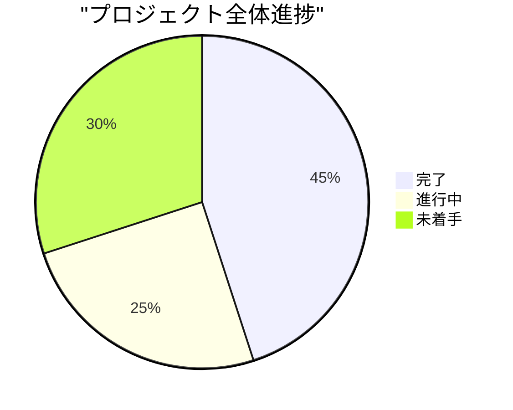
```mermaid
pie title "プロジェクト全体進捗"
    "完了" : 45
    "進行中" : 25
    "未着手" : 30
```

### 1.2 コンポーネント別進捗

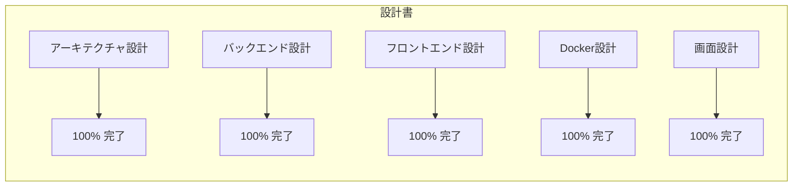
```mermaid
flowchart LR
    subgraph 設計書
        D1[アーキテクチャ設計] --> D1S[100% 完了]
        D2[バックエンド設計] --> D2S[100% 完了]
        D3[フロントエンド設計] --> D3S[100% 完了]
        D4[Docker設計] --> D4S[100% 完了]
        D5[画面設計] --> D5S[100% 完了]
    end
```

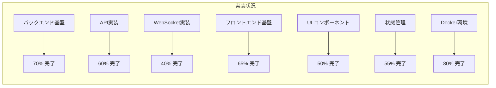
```mermaid
flowchart LR
    subgraph 実装状況
        B1[バックエンド基盤] --> B1S[70% 完了]
        B2[API実装] --> B2S[60% 完了]
        B3[WebSocket実装] --> B3S[40% 完了]
        F1[フロントエンド基盤] --> F1S[65% 完了]
        F2[UI コンポーネント] --> F2S[50% 完了]
        F3[状態管理] --> F3S[55% 完了]
        I1[Docker環境] --> I1S[80% 完了]
    end
```

---

## 2. 実装済み機能

### 2.1 バックエンド

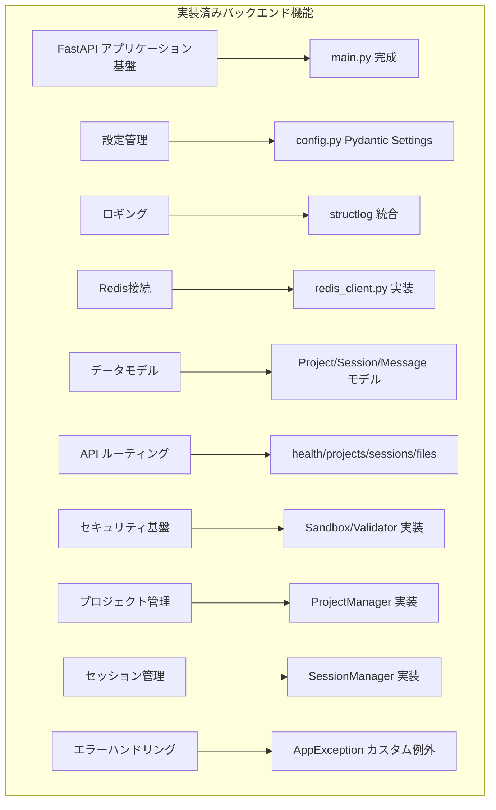
```mermaid
flowchart TD
    subgraph 実装済みバックエンド機能
        BE1[FastAPI アプリケーション基盤] --> BE1D[main.py 完成]
        BE2[設定管理] --> BE2D[config.py Pydantic Settings]
        BE3[ロギング] --> BE3D[structlog 統合]
        BE4[Redis接続] --> BE4D[redis_client.py 実装]
        BE5[データモデル] --> BE5D[Project/Session/Message モデル]
        BE6[API ルーティング] --> BE6D[health/projects/sessions/files]
        BE7[セキュリティ基盤] --> BE7D[Sandbox/Validator 実装]
        BE8[プロジェクト管理] --> BE8D[ProjectManager 実装]
        BE9[セッション管理] --> BE9D[SessionManager 実装]
        BE10[エラーハンドリング] --> BE10D[AppException カスタム例外]
    end
```

**ファイル一覧:**
- `src/backend/app/main.py` - FastAPI エントリポイント
- `src/backend/app/config.py` - 環境設定
- `src/backend/app/utils/logger.py` - ロギング
- `src/backend/app/utils/redis_client.py` - Redis接続
- `src/backend/app/models/` - データモデル
- `src/backend/app/api/routes/` - API ルート
- `src/backend/app/core/` - コアロジック
- `src/backend/pyproject.toml` - 依存関係管理

### 2.2 フロントエンド

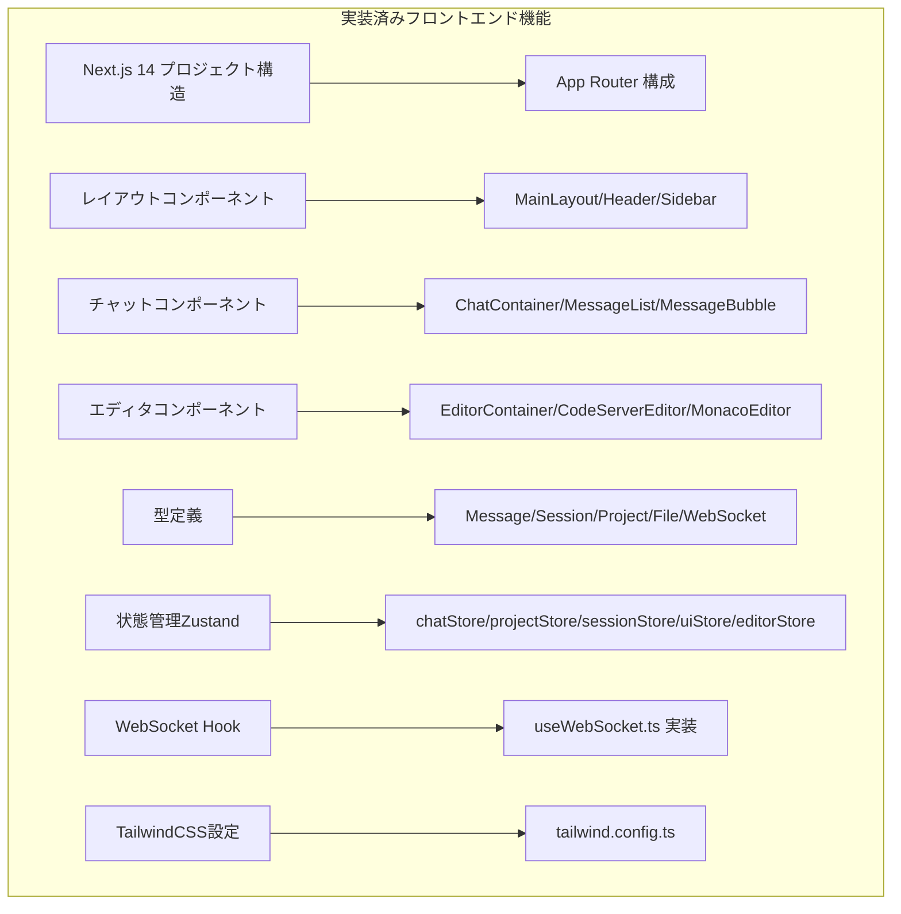
```mermaid
flowchart TD
    subgraph 実装済みフロントエンド機能
        FE1[Next.js 14 プロジェクト構造] --> FE1D[App Router 構成]
        FE2[レイアウトコンポーネント] --> FE2D[MainLayout/Header/Sidebar]
        FE3[チャットコンポーネント] --> FE3D[ChatContainer/MessageList/MessageBubble]
        FE4[エディタコンポーネント] --> FE4D[EditorContainer/CodeServerEditor/MonacoEditor]
        FE5[型定義] --> FE5D[Message/Session/Project/File/WebSocket]
        FE6[状態管理Zustand] --> FE6D[chatStore/projectStore/sessionStore/uiStore/editorStore]
        FE7[WebSocket Hook] --> FE7D[useWebSocket.ts 実装]
        FE8[TailwindCSS設定] --> FE8D[tailwind.config.ts]
    end
```

**ファイル一覧:**
- `src/frontend/src/app/` - Next.js App Router
- `src/frontend/src/components/layout/` - レイアウト
- `src/frontend/src/components/chat/` - チャットUI
- `src/frontend/src/components/editor/` - エディタUI
- `src/frontend/src/types/` - TypeScript型定義
- `src/frontend/src/stores/` - Zustand ストア
- `src/frontend/src/hooks/` - React Hooks
- `src/frontend/package.json` - 依存関係

### 2.3 インフラ

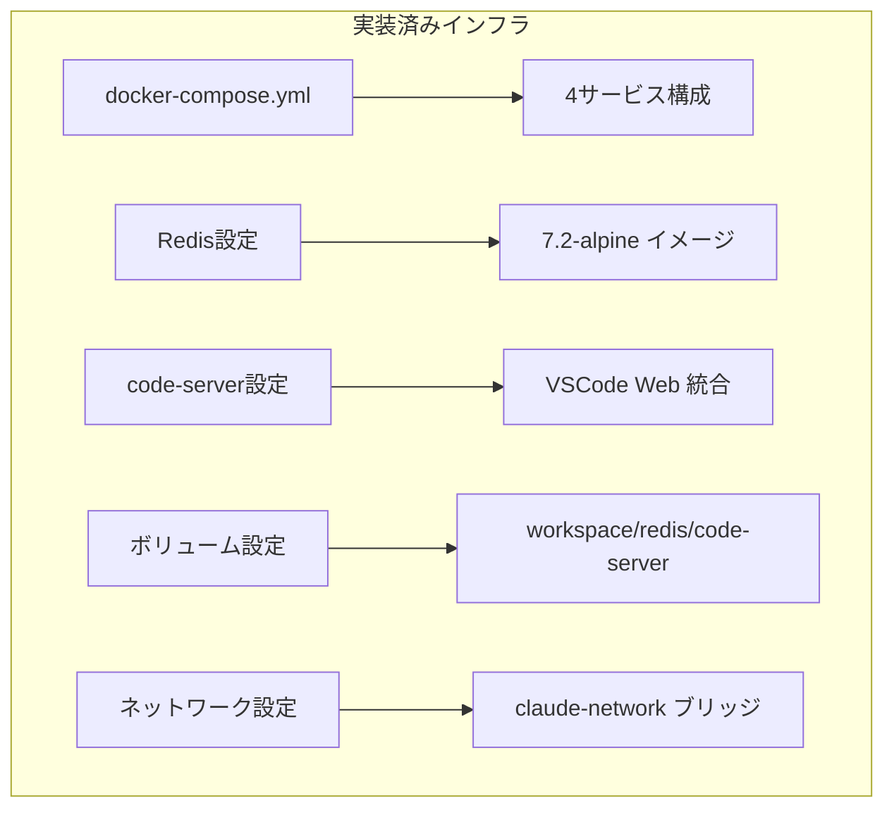
```mermaid
flowchart TD
    subgraph 実装済みインフラ
        IF1[docker-compose.yml] --> IF1D[4サービス構成]
        IF2[Redis設定] --> IF2D[7.2-alpine イメージ]
        IF3[code-server設定] --> IF3D[VSCode Web 統合]
        IF4[ボリューム設定] --> IF4D[workspace/redis/code-server]
        IF5[ネットワーク設定] --> IF5D[claude-network ブリッジ]
    end
```

**ファイル一覧:**
- `docker-compose.yml` - Docker Compose 構成
- サービス: frontend, backend, redis, code-server

---

## 3. 未実装・未完了機能

### 3.1 バックエンド未実装機能

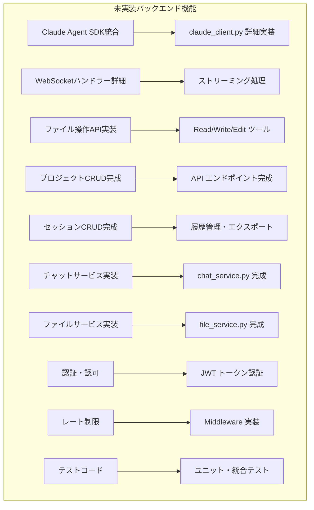
```mermaid
flowchart TD
    subgraph 未実装バックエンド機能
        BE_TODO1[Claude Agent SDK統合] --> BE_TODO1D[claude_client.py 詳細実装]
        BE_TODO2[WebSocketハンドラー詳細] --> BE_TODO2D[ストリーミング処理]
        BE_TODO3[ファイル操作API実装] --> BE_TODO3D[Read/Write/Edit ツール]
        BE_TODO4[プロジェクトCRUD完成] --> BE_TODO4D[API エンドポイント完成]
        BE_TODO5[セッションCRUD完成] --> BE_TODO5D[履歴管理・エクスポート]
        BE_TODO6[チャットサービス実装] --> BE_TODO6D[chat_service.py 完成]
        BE_TODO7[ファイルサービス実装] --> BE_TODO7D[file_service.py 完成]
        BE_TODO8[認証・認可] --> BE_TODO8D[JWT トークン認証]
        BE_TODO9[レート制限] --> BE_TODO9D[Middleware 実装]
        BE_TODO10[テストコード] --> BE_TODO10D[ユニット・統合テスト]
    end
```

### 3.2 フロントエンド未実装機能

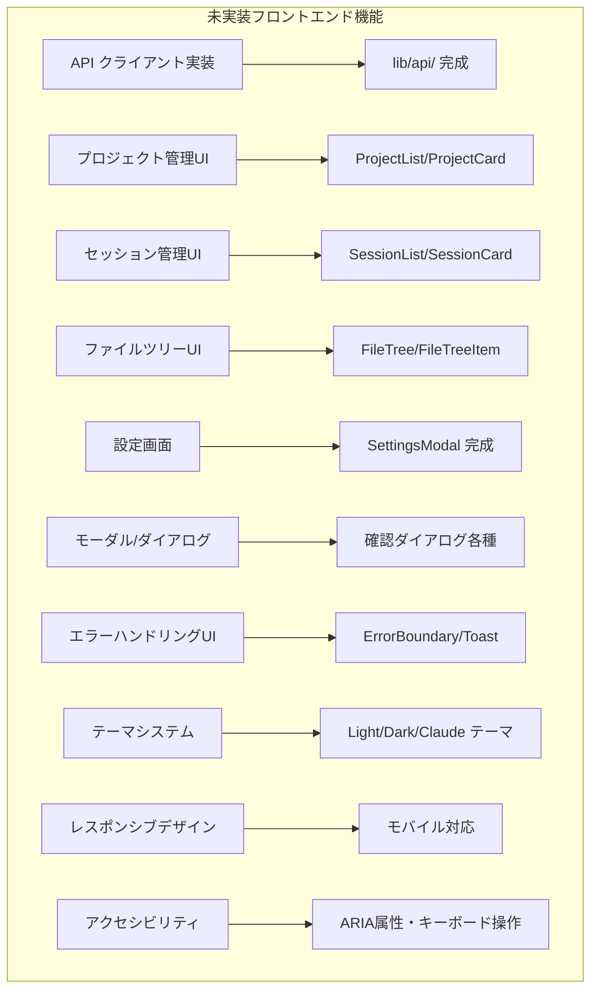
```mermaid
flowchart TD
    subgraph 未実装フロントエンド機能
        FE_TODO1[API クライアント実装] --> FE_TODO1D[lib/api/ 完成]
        FE_TODO2[プロジェクト管理UI] --> FE_TODO2D[ProjectList/ProjectCard]
        FE_TODO3[セッション管理UI] --> FE_TODO3D[SessionList/SessionCard]
        FE_TODO4[ファイルツリーUI] --> FE_TODO4D[FileTree/FileTreeItem]
        FE_TODO5[設定画面] --> FE_TODO5D[SettingsModal 完成]
        FE_TODO6[モーダル/ダイアログ] --> FE_TODO6D[確認ダイアログ各種]
        FE_TODO7[エラーハンドリングUI] --> FE_TODO7D[ErrorBoundary/Toast]
        FE_TODO8[テーマシステム] --> FE_TODO8D[Light/Dark/Claude テーマ]
        FE_TODO9[レスポンシブデザイン] --> FE_TODO9D[モバイル対応]
        FE_TODO10[アクセシビリティ] --> FE_TODO10D[ARIA属性・キーボード操作]
    end
```

### 3.3 インフラ未実装機能

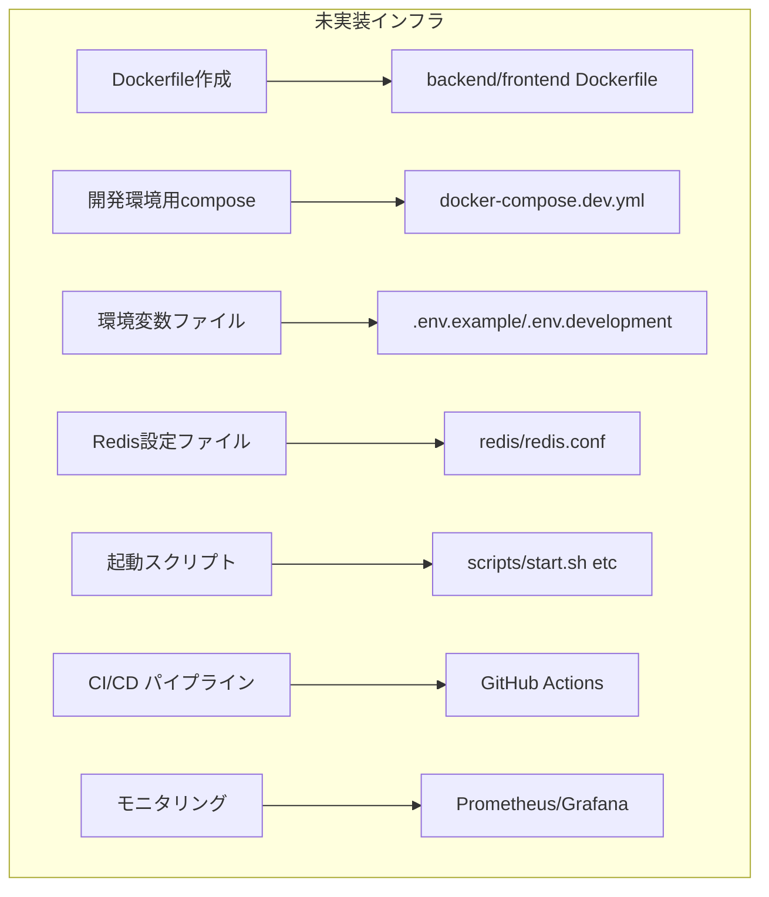
```mermaid
flowchart TD
    subgraph 未実装インフラ
        IF_TODO1[Dockerfile作成] --> IF_TODO1D[backend/frontend Dockerfile]
        IF_TODO2[開発環境用compose] --> IF_TODO2D[docker-compose.dev.yml]
        IF_TODO3[環境変数ファイル] --> IF_TODO3D[.env.example/.env.development]
        IF_TODO4[Redis設定ファイル] --> IF_TODO4D[redis/redis.conf]
        IF_TODO5[起動スクリプト] --> IF_TODO5D[scripts/start.sh etc]
        IF_TODO6[CI/CD パイプライン] --> IF_TODO6D[GitHub Actions]
        IF_TODO7[モニタリング] --> IF_TODO7D[Prometheus/Grafana]
    end
```

---

## 4. 開発優先順位

### 4.1 優先度マトリクス

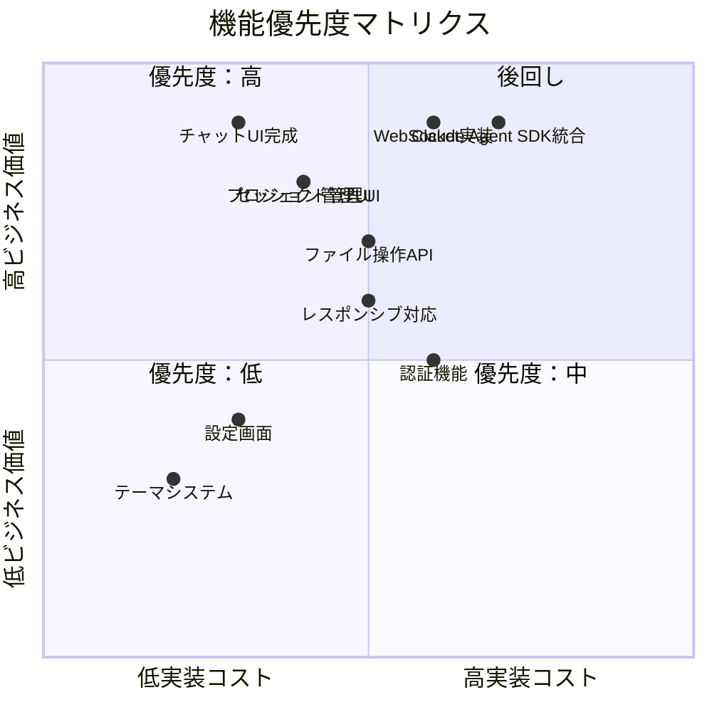
```mermaid
quadrantChart
    title 機能優先度マトリクス
    x-axis 低実装コスト --> 高実装コスト
    y-axis 低ビジネス価値 --> 高ビジネス価値
    quadrant-1 後回し
    quadrant-2 優先度：高
    quadrant-3 優先度：低
    quadrant-4 優先度：中
    Claude Agent SDK統合: [0.7, 0.9]
    WebSocket実装: [0.6, 0.9]
    プロジェクト管理UI: [0.4, 0.8]
    セッション管理UI: [0.4, 0.8]
    ファイル操作API: [0.5, 0.7]
    チャットUI完成: [0.3, 0.9]
    設定画面: [0.3, 0.4]
    テーマシステム: [0.2, 0.3]
    認証機能: [0.6, 0.5]
    レスポンシブ対応: [0.5, 0.6]
```

### 4.2 優先度ランキング

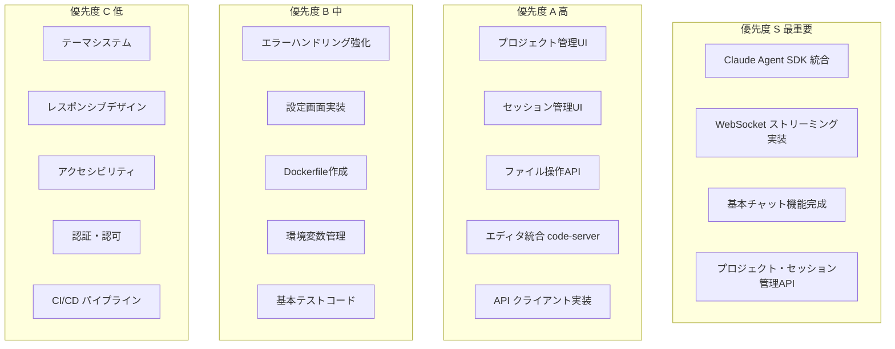
```mermaid
flowchart TD
    subgraph "優先度 S 最重要"
        P_S1[Claude Agent SDK 統合]
        P_S2[WebSocket ストリーミング実装]
        P_S3[基本チャット機能完成]
        P_S4[プロジェクト・セッション管理API]
    end

    subgraph "優先度 A 高"
        P_A1[プロジェクト管理UI]
        P_A2[セッション管理UI]
        P_A3[ファイル操作API]
        P_A4[エディタ統合 code-server]
        P_A5[API クライアント実装]
    end

    subgraph "優先度 B 中"
        P_B1[エラーハンドリング強化]
        P_B2[設定画面実装]
        P_B3[Dockerfile作成]
        P_B4[環境変数管理]
        P_B5[基本テストコード]
    end

    subgraph "優先度 C 低"
        P_C1[テーマシステム]
        P_C2[レスポンシブデザイン]
        P_C3[アクセシビリティ]
        P_C4[認証・認可]
        P_C5[CI/CD パイプライン]
    end
```

---

## 5. フェーズ別ロードマップ

### Phase 1: MVP 完成（2週間）

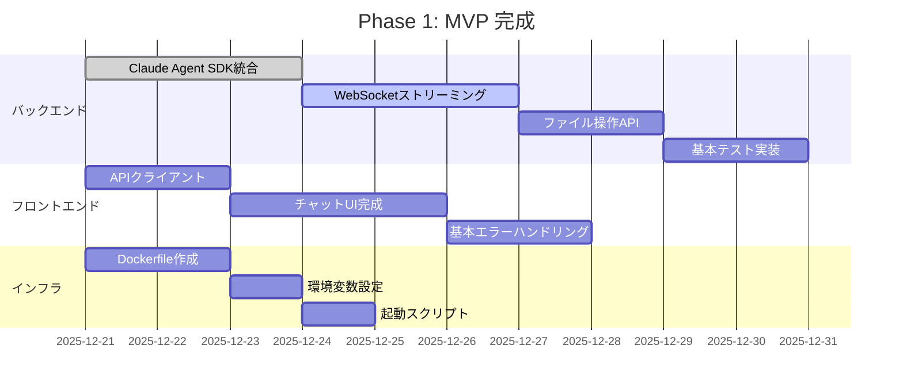
```mermaid
gantt
    title Phase 1: MVP 完成
    dateFormat YYYY-MM-DD
    section バックエンド
    Claude Agent SDK統合     :done, be1, 2025-12-21, 3d
    WebSocketストリーミング  :active, be2, after be1, 3d
    ファイル操作API         :be3, after be2, 2d
    基本テスト実装          :be4, after be3, 2d

    section フロントエンド
    APIクライアント         :fe1, 2025-12-21, 2d
    チャットUI完成          :fe2, after fe1, 3d
    基本エラーハンドリング  :fe3, after fe2, 2d

    section インフラ
    Dockerfile作成          :inf1, 2025-12-21, 2d
    環境変数設定            :inf2, after inf1, 1d
    起動スクリプト          :inf3, after inf2, 1d
```

**Phase 1 目標:**
- Claude との基本的なチャット機能動作
- ファイル読み書き可能
- Docker 環境で起動可能
- 1プロジェクト、1セッションで動作確認

**Phase 1 成果物:**
1. 動作するチャットインターフェース
2. Claude Agent SDK 統合完了
3. WebSocket ストリーミング動作
4. ファイル操作（Read/Write）動作
5. Docker Compose で起動可能

---

### Phase 2: コア機能実装（3週間）

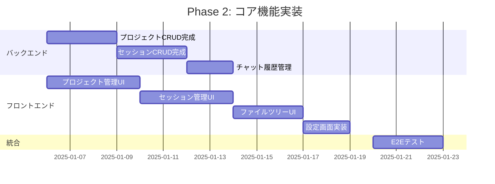
```mermaid
gantt
    title Phase 2: コア機能実装
    dateFormat YYYY-MM-DD
    section バックエンド
    プロジェクトCRUD完成    :be5, 2025-01-06, 3d
    セッションCRUD完成      :be6, after be5, 3d
    チャット履歴管理        :be7, after be6, 2d

    section フロントエンド
    プロジェクト管理UI      :fe4, 2025-01-06, 4d
    セッション管理UI        :fe5, after fe4, 4d
    ファイルツリーUI        :fe6, after fe5, 3d
    設定画面実装            :fe7, after fe6, 2d

    section 統合
    E2Eテスト               :test1, 2025-01-20, 3d
```

**Phase 2 目標:**
- 複数プロジェクト管理
- プロジェクト配下に複数セッション作成
- セッション切り替え動作
- ファイルツリー表示
- 設定画面で基本設定変更可能

**Phase 2 成果物:**
1. プロジェクト階層UI
2. セッション一覧・切り替え機能
3. ファイルツリー表示
4. 設定画面（テーマ・エディタ設定）
5. チャット履歴保存・読み込み

---

### Phase 3: エディタ統合（2週間）

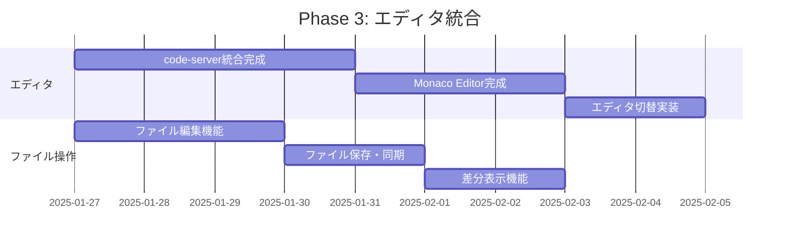
```mermaid
gantt
    title Phase 3: エディタ統合
    dateFormat YYYY-MM-DD
    section エディタ
    code-server統合完成     :ed1, 2025-01-27, 4d
    Monaco Editor完成       :ed2, after ed1, 3d
    エディタ切替実装        :ed3, after ed2, 2d

    section ファイル操作
    ファイル編集機能        :file1, 2025-01-27, 3d
    ファイル保存・同期      :file2, after file1, 2d
    差分表示機能            :file3, after file2, 2d
```

**Phase 3 目標:**
- code-server (VSCode Web) 完全統合
- Monaco Editor フォールバック動作
- ファイル編集・保存・同期
- Claudeが編集したファイルを即座に反映

**Phase 3 成果物:**
1. code-server iframe 埋め込み完成
2. エディタ切り替え機能
3. ファイル編集・保存機能
4. 差分表示機能
5. Claudeのツール実行結果をエディタに反映

---

### Phase 4: UI/UX 改善（2週間）

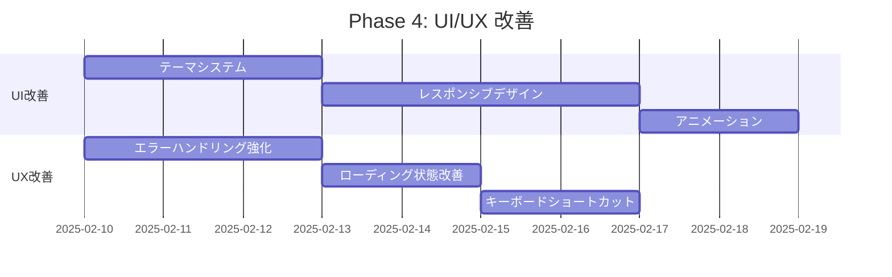
```mermaid
gantt
    title Phase 4: UI/UX 改善
    dateFormat YYYY-MM-DD
    section UI改善
    テーマシステム          :ui1, 2025-02-10, 3d
    レスポンシブデザイン    :ui2, after ui1, 4d
    アニメーション          :ui3, after ui2, 2d

    section UX改善
    エラーハンドリング強化  :ux1, 2025-02-10, 3d
    ローディング状態改善    :ux2, after ux1, 2d
    キーボードショートカット:ux3, after ux2, 2d
```

**Phase 4 目標:**
- Light/Dark/Claude テーマ切り替え
- モバイル・タブレット対応
- スムーズなアニメーション
- 優れたUX

**Phase 4 成果物:**
1. 3種類のテーマ実装
2. レスポンシブデザイン完成
3. エラーハンドリング強化
4. キーボードショートカット実装
5. アクセシビリティ対応

---

### Phase 5: 本番リリース準備（1週間）

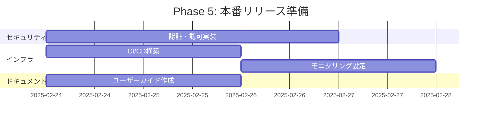
```mermaid
gantt
    title Phase 5: 本番リリース準備
    dateFormat YYYY-MM-DD
    section セキュリティ
    認証・認可実装          :sec1, 2025-02-24, 3d

    section インフラ
    CI/CD構築               :inf1, 2025-02-24, 2d
    モニタリング設定        :inf2, after inf1, 2d

    section ドキュメント
    ユーザーガイド作成      :doc1, 2025-02-24, 2d
```

**Phase 5 目標:**
- 本番環境デプロイ可能
- セキュリティ強化
- CI/CDパイプライン構築
- ドキュメント整備

**Phase 5 成果物:**
1. 認証・認可機能
2. CI/CD パイプライン
3. モニタリング・ログ収集
4. ユーザーガイド
5. 本番環境デプロイ

---

## 6. 次のアクション

### 6.1 今すぐ実装すべきタスク（優先度S）

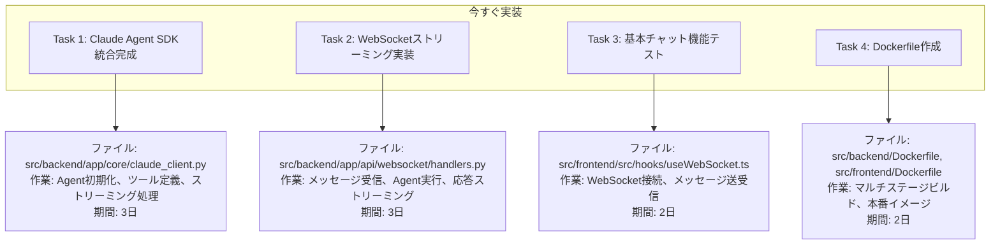
```mermaid
flowchart TD
    subgraph 今すぐ実装
        T1[Task 1: Claude Agent SDK統合完成]
        T2[Task 2: WebSocketストリーミング実装]
        T3[Task 3: 基本チャット機能テスト]
        T4[Task 4: Dockerfile作成]
    end

    T1 --> T1D["ファイル: src/backend/app/core/claude_client.py<br/>作業: Agent初期化、ツール定義、ストリーミング処理<br/>期間: 3日"]
    T2 --> T2D["ファイル: src/backend/app/api/websocket/handlers.py<br/>作業: メッセージ受信、Agent実行、応答ストリーミング<br/>期間: 3日"]
    T3 --> T3D["ファイル: src/frontend/src/hooks/useWebSocket.ts<br/>作業: WebSocket接続、メッセージ送受信<br/>期間: 2日"]
    T4 --> T4D["ファイル: src/backend/Dockerfile, src/frontend/Dockerfile<br/>作業: マルチステージビルド、本番イメージ<br/>期間: 2日"]
```

### 6.2 Task 1: Claude Agent SDK統合完成

**目標:** Claude Agent SDK を完全に統合し、ツール（Read/Write/Bash）を使用可能にする

**実装内容:**

1. **claude_client.py 完成**
   - Agent の初期化
   - ツール定義（Read, Write, Edit, Bash）
   - メッセージ送信とストリーミング処理
   - エラーハンドリング

2. **必要なコード:**

```python
# src/backend/app/core/claude_client.py
from anthropic import Anthropic, AsyncAnthropic
from anthropic.types import Message, MessageStreamEvent
from typing import AsyncIterator, Optional

class ClaudeClient:
    def __init__(self, api_key: str, model: str = "claude-opus-4-5"):
        self.client = AsyncAnthropic(api_key=api_key)
        self.model = model

    async def send_message_stream(
        self,
        messages: list,
        system: str,
        max_tokens: int = 4096
    ) -> AsyncIterator[MessageStreamEvent]:
        """メッセージを送信し、ストリーミングで応答を受信"""
        async with self.client.messages.stream(
            model=self.model,
            max_tokens=max_tokens,
            system=system,
            messages=messages,
        ) as stream:
            async for event in stream:
                yield event
```

**検収基準:**
- Claude との会話が成立する
- ツールが正しく実行される
- ストリーミングで応答が返ってくる

---

### 6.3 Task 2: WebSocketストリーミング実装

**目標:** WebSocket経由でClaudeとリアルタイムチャット

**実装内容:**

1. **handlers.py 完成**
   - WebSocket接続受付
   - クライアントからのメッセージ受信
   - Claude Agent実行
   - ストリーミング応答の転送

2. **必要なコード:**

```python
# src/backend/app/api/websocket/handlers.py
async def handle_chat_websocket(
    websocket: WebSocket,
    session_id: str,
    redis: Redis
):
    await websocket.accept()

    try:
        claude_client = ClaudeClient(api_key=settings.anthropic_api_key)

        while True:
            # クライアントからメッセージ受信
            data = await websocket.receive_json()

            if data["type"] == "chat":
                # Claudeにメッセージ送信
                async for event in claude_client.send_message_stream(
                    messages=data["messages"]
                ):
                    # イベントをクライアントに転送
                    await websocket.send_json({
                        "type": event.type,
                        "data": event.dict()
                    })

    except WebSocketDisconnect:
        logger.info("WebSocket disconnected")
```

**検収基準:**
- WebSocket接続が確立する
- メッセージがリアルタイムで表示される
- ツール実行が可視化される

---

### 6.4 Task 3: 基本チャット機能テスト

**目標:** フロントエンドでチャット動作確認

**実装内容:**

1. **useWebSocket.ts 完成**
2. **ChatContainer動作確認**
3. **MessageBubble表示確認**

**検収基準:**
- ユーザーがメッセージ入力できる
- Claudeから返答が表示される
- ツール使用が表示される

---

### 6.5 Task 4: Dockerfile作成

**目標:** Docker環境で起動可能にする

**実装内容:**

1. **src/backend/Dockerfile**
   - Python 3.11ベース
   - Poetry依存関係インストール
   - マルチステージビルド

2. **src/frontend/Dockerfile**
   - Node.js 20ベース
   - Next.js ビルド
   - 本番イメージ最適化

**検収基準:**
- `docker-compose up -d` で全サービス起動
- ブラウザから http://localhost:3000 でアクセス可能
- チャット機能が動作する

---

## 7. 開発環境セットアップ手順

### 7.1 前提条件

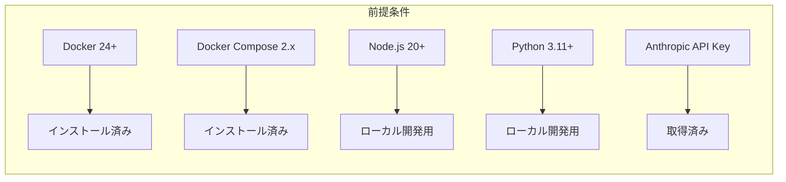
```mermaid
flowchart LR
    subgraph 前提条件
        REQ1[Docker 24+] --> REQ1D[インストール済み]
        REQ2[Docker Compose 2.x] --> REQ2D[インストール済み]
        REQ3[Node.js 20+] --> REQ3D[ローカル開発用]
        REQ4[Python 3.11+] --> REQ4D[ローカル開発用]
        REQ5[Anthropic API Key] --> REQ5D[取得済み]
    end
```

### 7.2 セットアップコマンド

```bash
# 1. リポジトリクローン（既存の場合はスキップ）
cd /Users/t.hirai/AGENTSDK

# 2. 環境変数設定
cp .env.example .env
# .env ファイルを編集してANTHROPIC_API_KEYを設定

# 3. バックエンド依存関係インストール（ローカル開発）
cd src/backend
poetry install
poetry shell

# 4. フロントエンド依存関係インストール（ローカル開発）
cd ../frontend
npm install

# 5. Docker環境起動
cd ../..
docker-compose up -d

# 6. ログ確認
docker-compose logs -f
```

---

## 8. 完成時のゴール

### 8.1 完成イメージ

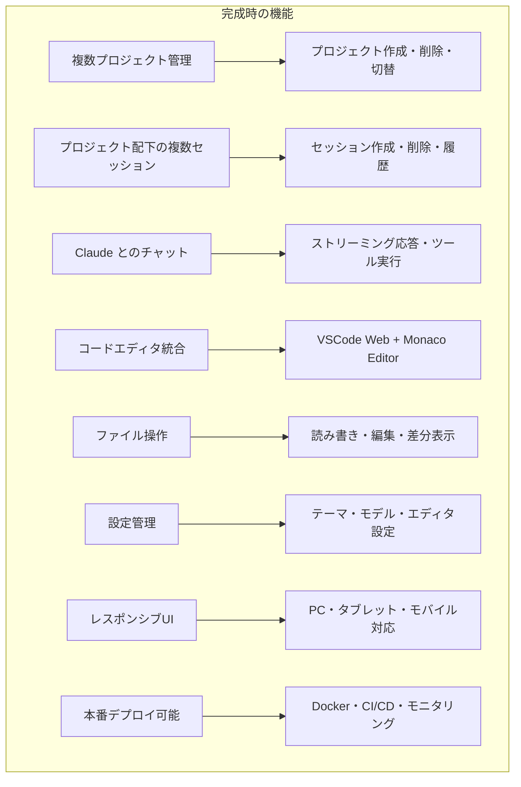
```mermaid
flowchart TD
    subgraph 完成時の機能
        G1[複数プロジェクト管理] --> G1D[プロジェクト作成・削除・切替]
        G2[プロジェクト配下の複数セッション] --> G2D[セッション作成・削除・履歴]
        G3[Claude とのチャット] --> G3D[ストリーミング応答・ツール実行]
        G4[コードエディタ統合] --> G4D[VSCode Web + Monaco Editor]
        G5[ファイル操作] --> G5D[読み書き・編集・差分表示]
        G6[設定管理] --> G6D[テーマ・モデル・エディタ設定]
        G7[レスポンシブUI] --> G7D[PC・タブレット・モバイル対応]
        G8[本番デプロイ可能] --> G8D[Docker・CI/CD・モニタリング]
    end
```

### 8.2 ユーザー体験

**理想的なユーザーフロー:**

1. ブラウザで http://localhost:3000 にアクセス
2. 新規プロジェクト「Web App」を作成
3. プロジェクト内に「API実装」セッションを作成
4. Claudeに「FastAPIでREST APIを作成して」と依頼
5. Claudeがコードを生成し、ファイルに書き込む
6. 右側のVSCode Webでコードを確認・編集
7. ターミナルで実行確認
8. 別セッション「テスト作成」でテストコード生成
9. プロジェクト切り替えで別の作業開始

---

## 9. リスクと対策

### 9.1 技術的リスク

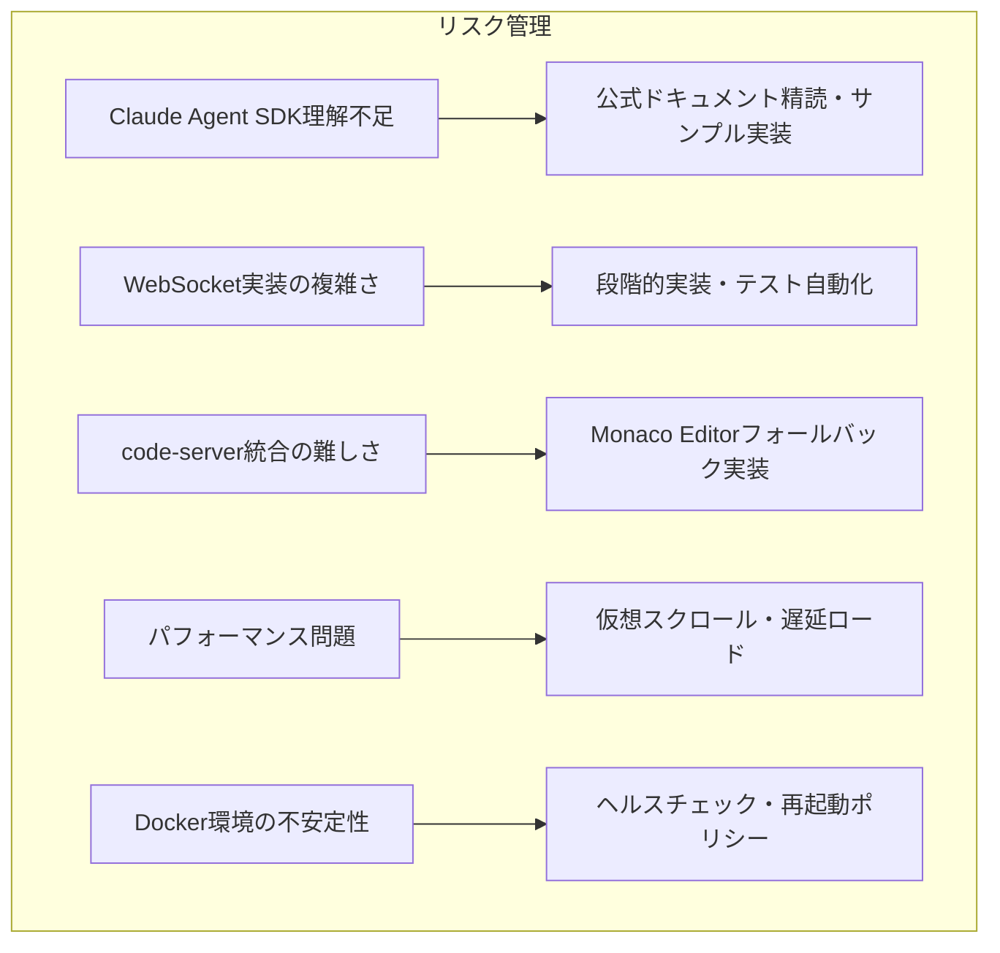
```mermaid
flowchart TD
    subgraph リスク管理
        R1[Claude Agent SDK理解不足] --> R1M[公式ドキュメント精読・サンプル実装]
        R2[WebSocket実装の複雑さ] --> R2M[段階的実装・テスト自動化]
        R3[code-server統合の難しさ] --> R3M[Monaco Editorフォールバック実装]
        R4[パフォーマンス問題] --> R4M[仮想スクロール・遅延ロード]
        R5[Docker環境の不安定性] --> R5M[ヘルスチェック・再起動ポリシー]
    end
```

### 9.2 スケジュールリスク

**対策:**
- 各フェーズに2-3日のバッファを設ける
- 優先度の低い機能は次のフェーズに延期可能
- MVP完成を最優先とする

---

## 10. まとめ

### 10.1 現在地

```mermaid
stateDiagram-v2
    [*] --> 設計完了
    設計完了 --> 基盤実装中
    基盤実装中 --> MVP開発
    MVP開発 --> コア機能実装
    コア機能実装 --> UI/UX改善
    UI/UX改善 --> 本番リリース
    本番リリース --> [*]

    note right of 基盤実装中
        現在ここ
        基盤は70%完成
        次: MVP完成へ
    end note
```

### 10.2 次の2週間の目標

**Week 1 (2025-12-21 ~ 2025-12-27):**
1. Claude Agent SDK統合完成
2. WebSocketストリーミング実装
3. 基本チャット機能動作確認

**Week 2 (2025-12-28 ~ 2026-01-03):**
1. Dockerfile作成・Docker環境完成
2. プロジェクト・セッション管理API完成
3. 基本的なUI完成

**2週間後のゴール:** Docker環境で基本的なチャット機能が動作し、プロジェクト・セッション管理ができる状態

---

**ドキュメント管理情報**

```mermaid
classDiagram
    class ドキュメント情報 {
        ファイル名: development-roadmap.md
        作成日: 2025-12-21
        バージョン: 1.0
        ステータス: 進行中
        次回更新: Phase 1完了時
    }
```
