# DinD実装 変更サマリー

Backend (Agent SDK) とcode-serverで共有のDocker実行環境を実現するための変更内容をまとめます。

## 変更日時

2025-12-24

## 目的

Backend (Agent SDK) がDinD内でコードを実行できるようにし、code-serverのターミナルからも同じDocker環境にアクセス可能にする。ワークスペースを共有し、統一された実行環境を提供する。

## 変更ファイル一覧

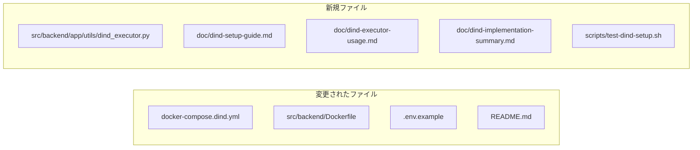

### 変更されたファイル

| ファイルパス | 変更内容 | 行数 |
|------------|---------|------|
| `/Users/t.hirai/AGENTSDK/docker-compose.dind.yml` | Backend環境変数追加 (DIND_WORKSPACE_PATH, DOCKER_BUILDKIT) | 67行 |
| `/Users/t.hirai/AGENTSDK/src/backend/Dockerfile` | Docker CLIインストール追加 (docker.io) | 122行 |
| `/Users/t.hirai/AGENTSDK/.env.example` | DinD設定セクション追加 (4変数) | 84行 |
| `/Users/t.hirai/AGENTSDK/README.md` | DinD情報追加、ドキュメントリンク追加 | 280行 |

### 新規作成ファイル

| ファイルパス | 役割 | 行数 |
|------------|------|------|
| `/Users/t.hirai/AGENTSDK/src/backend/app/utils/dind_executor.py` | DinD実行ユーティリティクラス | 353行 |
| `/Users/t.hirai/AGENTSDK/doc/dind-setup-guide.md` | セットアップ手順とトラブルシューティング | 385行 |
| `/Users/t.hirai/AGENTSDK/doc/dind-executor-usage.md` | 使用方法とベストプラクティス | 326行 |
| `/Users/t.hirai/AGENTSDK/doc/dind-implementation-summary.md` | 実装の技術詳細 | 425行 |
| `/Users/t.hirai/AGENTSDK/doc/dind-changes-summary.md` | 本ドキュメント | - |
| `/Users/t.hirai/AGENTSDK/scripts/test-dind-setup.sh` | 環境テストスクリプト | 150行 |

## 詳細な変更内容

### 1. docker-compose.dind.yml

**変更箇所**: Backend環境変数セクション (56-66行)

**変更前**:
```yaml
backend:
  environment:
    - DOCKER_HOST=tcp://dind:2375
    - DIND_ENABLED=true
  depends_on:
    redis:
      condition: service_healthy
    dind:
      condition: service_healthy
```

**変更後**:
```yaml
backend:
  environment:
    - DOCKER_HOST=tcp://dind:2375
    - DIND_ENABLED=true
    - DIND_WORKSPACE_PATH=/workspaces
    - DOCKER_BUILDKIT=1
  depends_on:
    redis:
      condition: service_healthy
    dind:
      condition: service_healthy
```

**理由**: DinD内のワークスペースパスとBuildKit有効化を明示的に設定

### 2. src/backend/Dockerfile

**変更箇所**: システム依存関係のインストール (24-31行)

**変更前**:
```dockerfile
# Install system dependencies
RUN apt-get update && apt-get install -y --no-install-recommends \
    curl \
    git \
    build-essential \
    ca-certificates \
    && rm -rf /var/lib/apt/lists/*
```

**変更後**:
```dockerfile
# Install system dependencies including Docker CLI
RUN apt-get update && apt-get install -y --no-install-recommends \
    curl \
    git \
    build-essential \
    ca-certificates \
    docker.io \
    && rm -rf /var/lib/apt/lists/*
```

**理由**: BackendコンテナからDinD経由でDockerコマンドを実行するためにDocker CLIが必要

### 3. .env.example

**変更箇所**: ワークスペース設定の後に新規セクション追加 (66-76行)

**追加内容**:
```env
# ----------------
# Docker-in-Docker (DinD) Configuration
# ----------------
# Enable DinD for isolated code execution
DIND_ENABLED=false  # Set to true when using docker-compose.dind.yml
# Docker daemon endpoint (set by docker-compose.dind.yml)
DOCKER_HOST=tcp://dind:2375
# Workspace path inside DinD container
DIND_WORKSPACE_PATH=/workspaces
# Enable Docker BuildKit
DOCKER_BUILDKIT=1
```

**理由**: DinD設定のテンプレートを提供し、ユーザーが簡単に設定できるようにする

### 4. README.md

**追加箇所1**: サービス構成 (146-149行)

```markdown
### Docker-in-Docker (DinD) (オプション)
- 分離されたコード実行環境
- Backend (Agent SDK) とcode-serverで共有
- 安全なコンテナ実行
```

**追加箇所2**: サービス起動セクション (59-69行)

```markdown
#### DinD環境付き（コード実行環境が必要な場合）

\```bash
# DinD環境を含めて起動
docker-compose -f docker-compose.yml -f docker-compose.dind.yml up -d

# .envでDinDを有効化
DIND_ENABLED=true
\```

DinD (Docker-in-Docker) を使用すると、Backend (Agent SDK) とcode-serverで共有の安全なコード実行環境を利用できます。詳細は [DinD Setup Guide](doc/dind-setup-guide.md) を参照してください。
```

**追加箇所3**: 関連ドキュメントセクション (273-276行)

```markdown
### DinD (Docker-in-Docker)
- [DinD セットアップガイド](doc/dind-setup-guide.md)
- [DinD Executor 使用ガイド](doc/dind-executor-usage.md)
- [DinD 実装概要](doc/dind-implementation-summary.md)
```

**理由**: ユーザーがDinD機能を発見し、利用方法を理解できるようにする

### 5. src/backend/app/utils/dind_executor.py (新規)

**内容**: DinD経由でコードを実行するためのPythonユーティリティクラス

**主要クラス**: `DindExecutor`

**主要メソッド**:
- `is_available()`: DinD接続確認
- `run_command()`: 汎用Docker実行
- `run_python_code()`: Python実行
- `run_shell_script()`: Shell実行
- `build_and_run()`: Dockerfileからビルドして実行

**使用例**:
```python
from app.utils.dind_executor import get_executor

executor = get_executor()
result = executor.run_python_code(
    code="print('Hello from DinD!')",
    python_version="3.11",
)
print(result['stdout'])
```

### 6. scripts/test-dind-setup.sh (新規)

**内容**: DinD環境のセットアップを検証するテストスクリプト

**テスト項目**:
1. Docker Composeファイルの存在確認
2. DinDコンテナの稼働確認
3. Backendコンテナの設定確認
4. code-serverコンテナの設定確認
5. ワークスペースボリュームの確認
6. DinD Executorの動作確認
7. ネットワーク接続確認
8. ストレージ確認

**実行方法**:
```bash
./scripts/test-dind-setup.sh
```

## 環境変数の追加

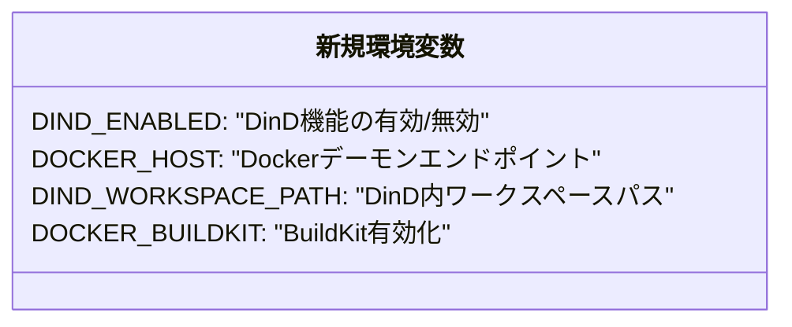

| 変数名 | デフォルト値 | 用途 |
|--------|------------|------|
| `DIND_ENABLED` | `false` | DinD機能の有効/無効切り替え |
| `DOCKER_HOST` | `tcp://dind:2375` | Dockerデーモンへの接続先 |
| `DIND_WORKSPACE_PATH` | `/workspaces` | DinD内でのワークスペースマウントパス |
| `DOCKER_BUILDKIT` | `1` | Docker BuildKitの有効化 |

## アーキテクチャの変更

### 変更前

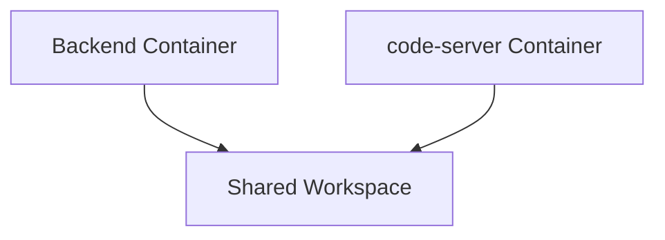

### 変更後

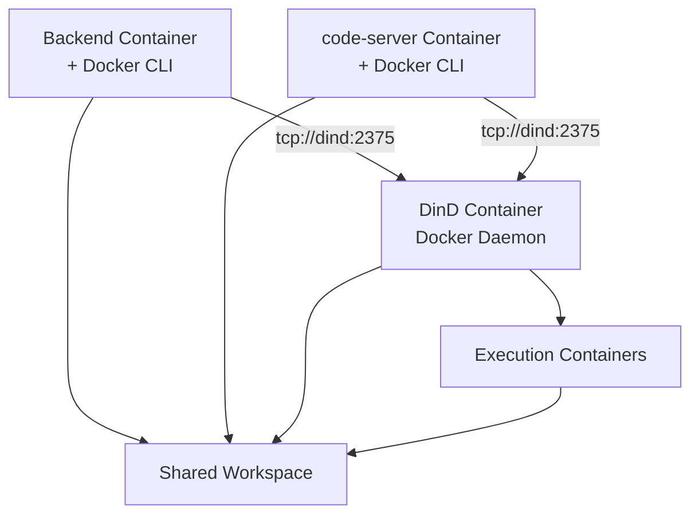

## データフロー

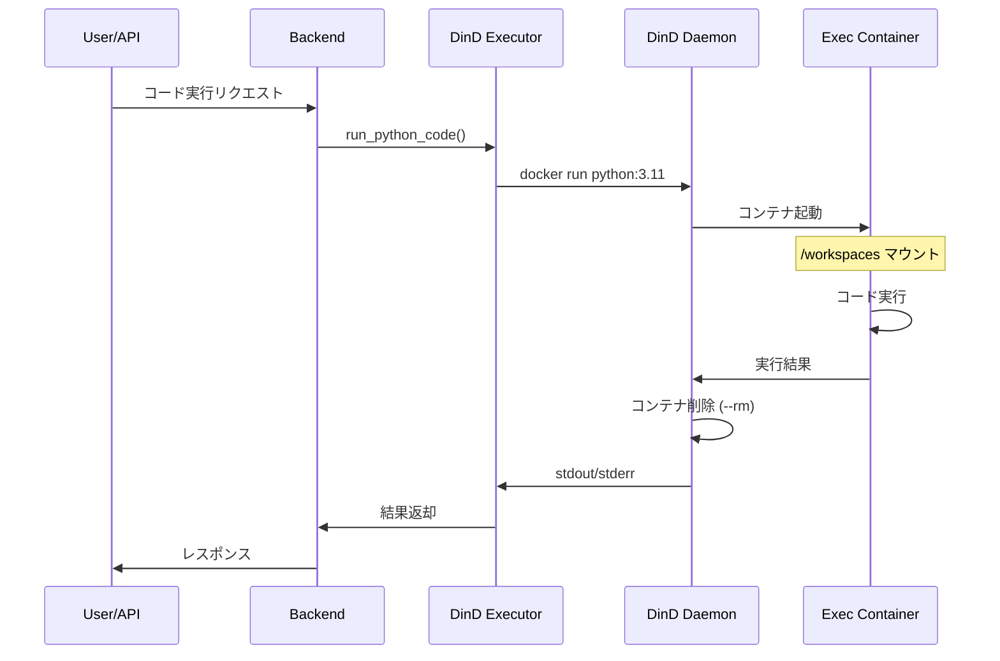

## 互換性

### 既存機能への影響

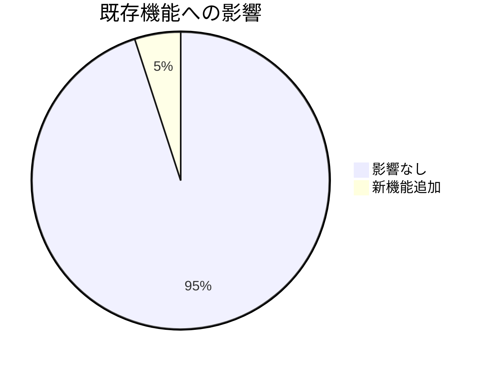

- **破壊的変更なし**: 既存のDocker Compose構成は変更なし
- **オプション機能**: DinDは`docker-compose.dind.yml`を使用した場合のみ有効
- **後方互換性**: DinD無効時も従来通り動作

### 新機能の追加

1. **Backend (Agent SDK) からのコード実行**
   - Pythonコードの実行
   - シェルスクリプトの実行
   - カスタムDockerイメージの実行
   - Dockerfileからのビルドと実行

2. **code-serverからのDocker利用**
   - ターミナルからDockerコマンド実行可能
   - 同じDinD環境を共有

3. **共有ワークスペース**
   - Backend、code-server、実行コンテナが同じワークスペースにアクセス

## セキュリティへの影響

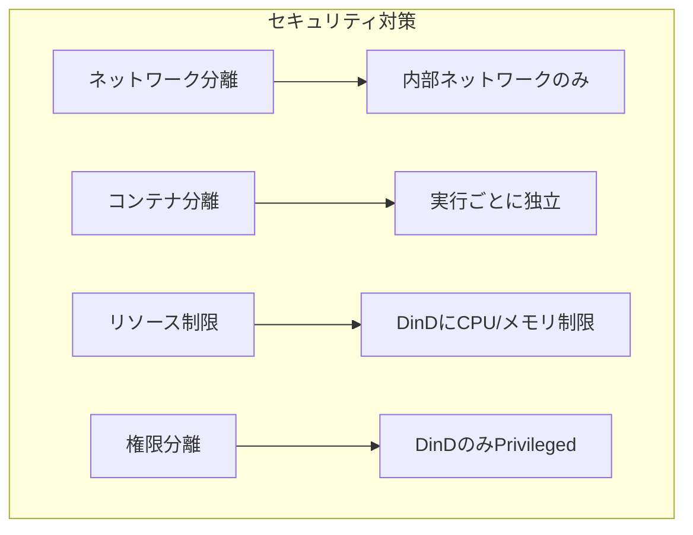

- **ネットワーク分離**: DinDは内部ネットワーク (`claude-network`) のみアクセス可能
- **コンテナ分離**: 各実行は独立したコンテナで実行
- **リソース制限**: DinDコンテナにCPU/メモリ制限を設定
- **権限分離**: DinDコンテナのみがprivileged mode、他は通常権限

## テスト方法

### 1. 環境の起動

```bash
# DinD環境を含めて起動
docker-compose -f docker-compose.yml -f docker-compose.dind.yml up -d

# 起動確認
docker-compose -f docker-compose.yml -f docker-compose.dind.yml ps
```

### 2. 自動テスト実行

```bash
# テストスクリプト実行
./scripts/test-dind-setup.sh
```

### 3. 手動テスト

```bash
# BackendからDinD接続確認
docker exec claude-backend docker info

# code-serverからDinD接続確認
docker exec claude-code-server docker info

# DinD Executor動作確認
docker exec claude-backend python3 -c '
from app.utils.dind_executor import get_executor
executor = get_executor()
result = executor.run_python_code(code="print(\"Test\")")
print(result["stdout"])
'
```

## パフォーマンスへの影響

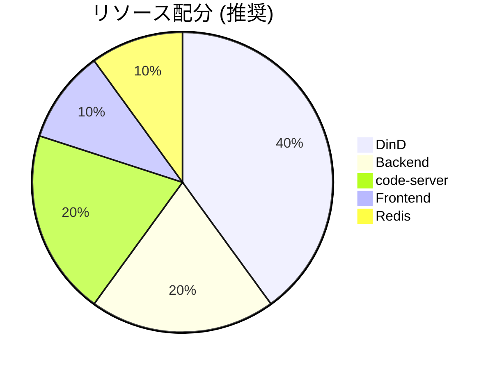

### リソース使用量

| サービス | CPU制限 | メモリ制限 | 用途 |
|---------|---------|-----------|------|
| DinD | 4 cores | 8 GB | コンテナ実行 |
| Backend | 2 cores | 4 GB | API処理 |
| code-server | 2 cores | 4 GB | Web IDE |
| Frontend | - | - | UI |
| Redis | 0.5 cores | 1 GB | キャッシュ |

## ドキュメント

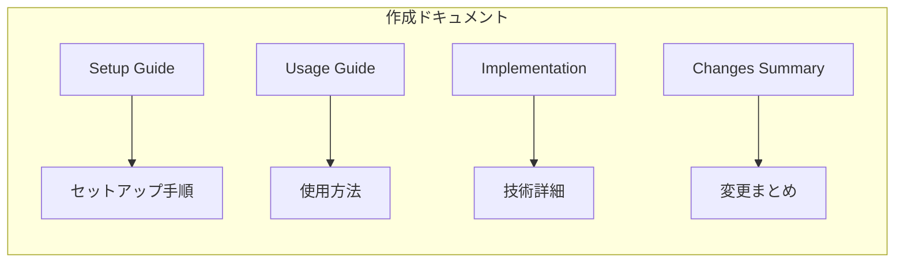

### 作成したドキュメント

1. **dind-setup-guide.md** (385行)
   - 前提条件
   - セットアップ手順
   - トラブルシューティング
   - パフォーマンスチューニング

2. **dind-executor-usage.md** (326行)
   - 使用方法
   - 実行パターン
   - ベストプラクティス
   - 実装例

3. **dind-implementation-summary.md** (425行)
   - 実装詳細
   - アーキテクチャ
   - セキュリティ
   - パフォーマンス

4. **dind-changes-summary.md** (本ドキュメント)
   - 変更内容の要約
   - ファイル一覧
   - 影響範囲

## 今後の拡張可能性

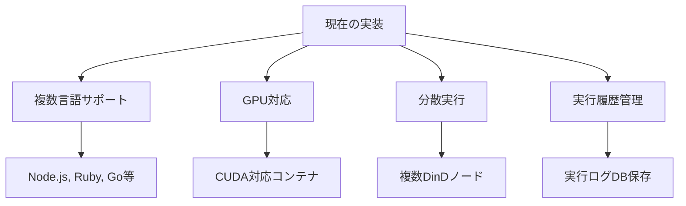

### 将来の拡張案

1. **複数言語サポート**
   - Node.js、Ruby、Go等の実行環境追加
   - 言語別のプリセット定義

2. **GPU対応**
   - CUDA対応コンテナのサポート
   - 機械学習コード実行

3. **分散実行**
   - 複数DinDノードでの負荷分散
   - スケーラビリティ向上

4. **実行履歴管理**
   - 実行ログのデータベース保存
   - 実行統計・分析機能

## まとめ

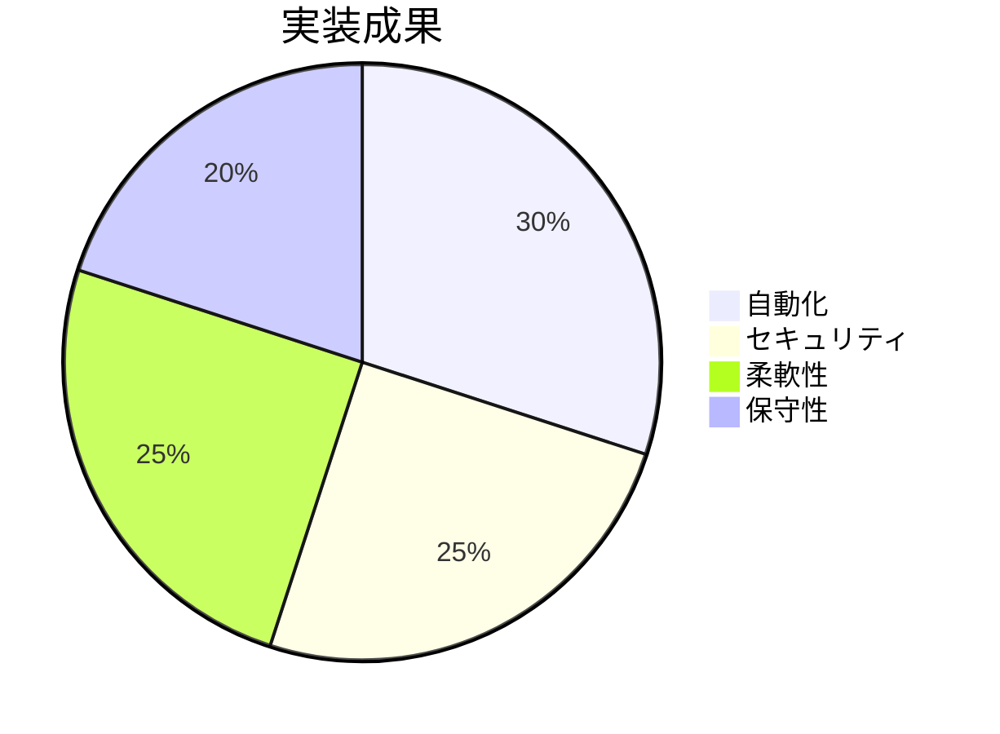

### 達成された目標

- Backend (Agent SDK) からDinD経由でコード実行可能
- code-serverのターミナルから同じDocker環境にアクセス可能
- 統一されたワークスペース共有
- セキュアで分離された実行環境
- シンプルで拡張性の高い設計
- 包括的なドキュメント作成

### 変更統計

- **変更ファイル**: 4ファイル
- **新規ファイル**: 6ファイル (コード1 + ドキュメント4 + テスト1)
- **総行数**: 約1,650行
- **ドキュメント**: 約1,500行
- **コード**: 約150行 (Python + Shell)
- **破壊的変更**: なし
- **後方互換性**: 維持

### 次のステップ

1. **セットアップ**: [DinD Setup Guide](./dind-setup-guide.md) を参照
2. **使用開始**: [DinD Executor Usage](./dind-executor-usage.md) を参照
3. **API統合**: Backend APIへの統合実装
4. **本番運用**: モニタリングとメンテナンス計画
