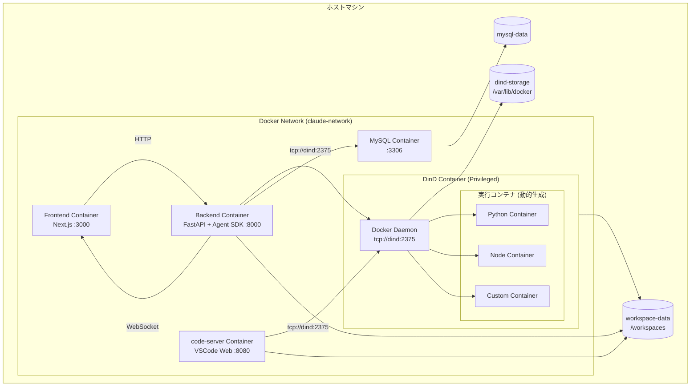
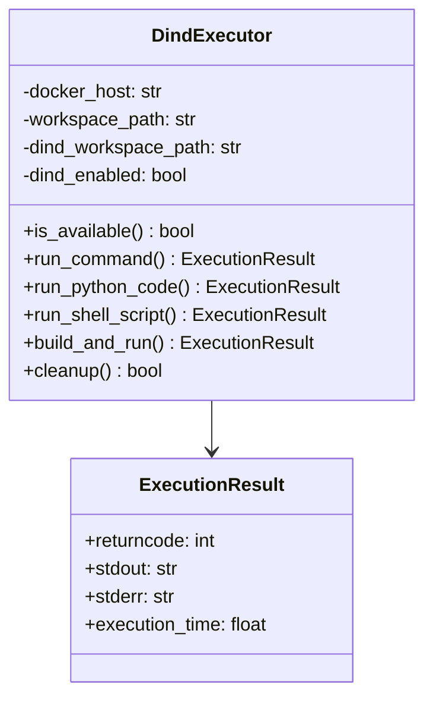
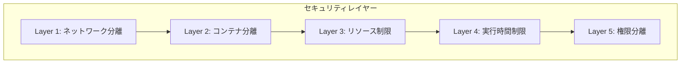
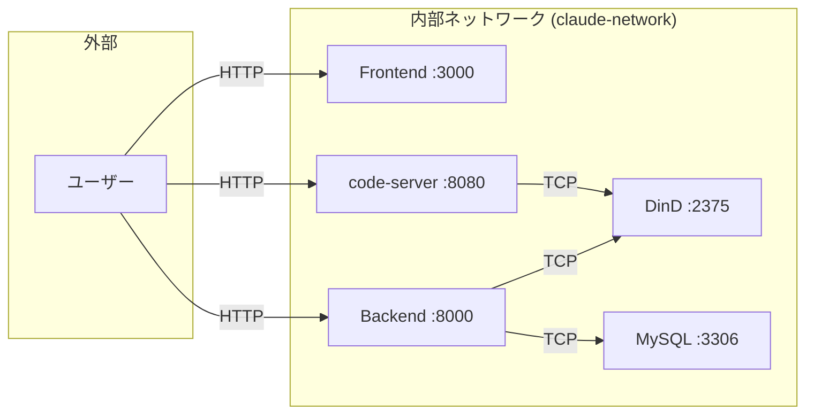
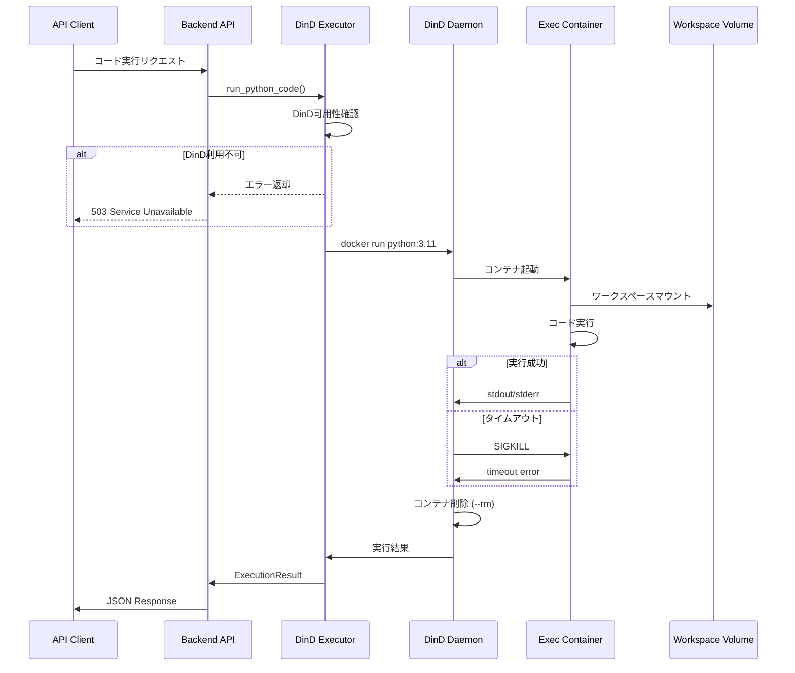
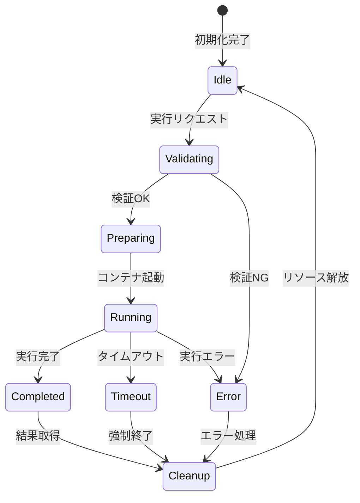

# Docker-in-Docker (DinD) 詳細設計書

> 作成日: 2025-12-29
> 最終更新: 2025-12-29
> バージョン: 1.0
> ステータス: ✅ 完了 (100%)

---

## 目次

1. [概要](#1-概要)
   - [1.1 DinDとは](#11-dindとは)
   - [1.2 導入目的](#12-導入目的)
   - [1.3 設計原則](#13-設計原則)
2. [アーキテクチャ設計](#2-アーキテクチャ設計)
   - [2.1 全体アーキテクチャ](#21-全体アーキテクチャ)
   - [2.2 コンポーネント一覧](#22-コンポーネント一覧)
   - [2.3 レイヤー構造](#23-レイヤー構造)
3. [コンポーネント設計](#3-コンポーネント設計)
   - [3.1 DinD Executor](#31-dind-executor)
   - [3.2 実行コンテナ仕様](#32-実行コンテナ仕様)
   - [3.3 ファイル配置](#33-ファイル配置)
4. [セキュリティ設計](#4-セキュリティ設計)
   - [4.1 セキュリティモデル](#41-セキュリティモデル)
   - [4.2 セキュリティ対策一覧](#42-セキュリティ対策一覧)
   - [4.3 脅威と対策](#43-脅威と対策)
   - [4.4 セキュリティ設定](#44-セキュリティ設定)
5. [ネットワーク設計](#5-ネットワーク設計)
   - [5.1 ネットワーク構成](#51-ネットワーク構成)
   - [5.2 ポート設計](#52-ポート設計)
   - [5.3 サービス間通信](#53-サービス間通信)
6. [ボリューム設計](#6-ボリューム設計)
   - [6.1 ボリューム一覧](#61-ボリューム一覧)
   - [6.2 マウントポイント](#62-マウントポイント)
   - [6.3 ワークスペース構造](#63-ワークスペース構造)
7. [実行フロー](#7-実行フロー)
   - [7.1 コード実行シーケンス](#71-コード実行シーケンス)
   - [7.2 状態遷移](#72-状態遷移)
   - [7.3 処理フロー詳細](#73-処理フロー詳細)
8. [API設計](#8-api設計)
   - [8.1 エンドポイント一覧](#81-エンドポイント一覧)
   - [8.2 リクエスト/レスポンス](#82-リクエストレスポンス)
   - [8.3 エラーコード](#83-エラーコード)
9. [パフォーマンス設計](#9-パフォーマンス設計)
   - [9.1 リソース配分](#91-リソース配分)
   - [9.2 システムスペック別推奨設定](#92-システムスペック別推奨設定)
   - [9.3 最適化ポイント](#93-最適化ポイント)
10. [運用設計](#10-運用設計)
    - [10.1 メンテナンスコマンド](#101-メンテナンスコマンド)
    - [10.2 監視項目](#102-監視項目)
    - [10.3 トラブルシューティング](#103-トラブルシューティング)
    - [10.4 バックアップ](#104-バックアップ)
11. [関連ドキュメント](#関連ドキュメント)
12. [変更履歴](#変更履歴)

---

## 1. 概要

### 1.1 DinDとは

Docker-in-Docker (DinD) は、Dockerコンテナ内で別のDockerデーモンを実行する技術です。本プロジェクトでは、ユーザーコードを安全に実行するためのサンドボックス環境として使用しています。

### 1.2 導入目的

| 目的 | 説明 | 効果 |
|------|------|------|
| セキュリティ | ユーザーコードをホストから完全に分離 | 悪意のあるコードがホストに影響しない |
| 再現性 | 一貫した実行環境を提供 | 環境依存の問題を排除 |
| 統合 | BackendとVSCode Webで同じDocker環境を共有 | 一貫したユーザー体験 |
| クリーンアップ | コンテナ終了時に自動的にリソース解放 | リソースリーク防止 |

### 1.3 設計原則

| 原則 | 説明 |
|------|------|
| 最小権限の原則 | DinDコンテナのみがprivileged mode |
| 分離の原則 | 各実行は独立したコンテナで実行 |
| シンプルさ | 複雑な依存関係を避ける |
| 拡張性 | 新しい実行環境を容易に追加可能 |

---

## 2. アーキテクチャ設計

### 2.1 全体アーキテクチャ



### 2.2 コンポーネント一覧

| コンポーネント | 役割 | ポート | 依存関係 |
|--------------|------|:------:|---------|
| Frontend | Next.js WebUI | 3000 | Backend |
| Backend | FastAPI + Agent SDK | 8000 | DinD, MySQL |
| code-server | VSCode Web IDE | 8080 | DinD |
| DinD | Dockerデーモン | 2375 (内部) | なし |
| MySQL | データベース | 3306 | なし |

### 2.3 レイヤー構造

| レイヤー | 責務 | 技術 |
|---------|------|------|
| プレゼンテーション | UI表示・ユーザー操作 | React, Next.js |
| API | リクエスト処理・ルーティング | FastAPI, WebSocket |
| ビジネスロジック | Agent SDK統合・コード実行 | Claude Agent SDK |
| 実行環境 | コード実行・分離 | DinD, Docker API |
| 永続化 | データ保存 | MySQL, Volume |

---

## 3. コンポーネント設計

### 3.1 DinD Executor

**クラス設計:**



**メソッド一覧:**

| メソッド | 引数 | 戻り値 | 説明 |
|---------|------|--------|------|
| `is_available()` | なし | `bool` | DinD環境が利用可能か確認 |
| `run_command()` | image, command, timeout | `ExecutionResult` | 汎用コマンド実行 |
| `run_python_code()` | code, version, requirements | `ExecutionResult` | Pythonコード実行 |
| `run_shell_script()` | script, shell, timeout | `ExecutionResult` | シェルスクリプト実行 |
| `build_and_run()` | dockerfile, context_path | `ExecutionResult` | Dockerfileビルド実行 |
| `cleanup()` | なし | `bool` | 不要リソース削除 |

### 3.2 実行コンテナ仕様

| イメージ | 用途 | デフォルトタイムアウト |
|---------|------|:---------------------:|
| python:3.11-slim | Pythonコード実行 | 60秒 |
| python:3.10-slim | Python 3.10サポート | 60秒 |
| node:20-alpine | Node.jsコード実行 | 60秒 |
| ubuntu:22.04 | シェルスクリプト実行 | 30秒 |
| カスタム | ユーザー定義 | 300秒 |

### 3.3 ファイル配置

| ファイル | パス | 役割 |
|---------|------|------|
| DinD Executor | `src/backend/app/utils/dind_executor.py` | 実行ユーティリティ |
| DinD設定 | `docker-compose.dind.yml` | Docker Compose拡張 |
| 環境変数 | `.env` | 接続設定 |

---

## 4. セキュリティ設計

### 4.1 セキュリティモデル



### 4.2 セキュリティ対策一覧

| 対策 | 実装 | リスク軽減 |
|------|------|-----------|
| ネットワーク分離 | DinDは内部ネットワークのみ | 外部攻撃防止 |
| Privileged制限 | DinDコンテナのみ | 権限昇格防止 |
| TLS無効化 | 内部通信専用 | 複雑性削減 |
| コンテナ分離 | `--rm`フラグで自動削除 | 残留防止 |
| リソース制限 | CPU/メモリ制限 | DoS防止 |
| タイムアウト | 全実行に時間制限 | 無限ループ防止 |
| ボリューム分離 | ワークスペースのみ共有 | データ漏洩防止 |

### 4.3 脅威と対策

| 脅威 | 影響度 | 対策 | 残存リスク |
|------|:------:|------|-----------|
| 悪意のあるコード実行 | 高 | コンテナ分離・リソース制限 | 低 |
| リソース枯渇 | 中 | CPU/メモリ制限・タイムアウト | 低 |
| データ漏洩 | 高 | ワークスペース分離・権限最小化 | 低 |
| 権限昇格 | 高 | Privileged制限・非rootユーザー | 低 |
| ネットワーク攻撃 | 中 | 内部ネットワーク限定 | 低 |

### 4.4 セキュリティ設定

```yaml
# docker-compose.dind.yml
services:
  dind:
    privileged: true  # DinDに必須
    environment:
      - DOCKER_TLS_CERTDIR=  # TLS無効（内部通信のみ）
    networks:
      - claude-network  # 内部ネットワークのみ
    deploy:
      resources:
        limits:
          cpus: '4'
          memory: 8G
```

---

## 5. ネットワーク設計

### 5.1 ネットワーク構成



### 5.2 ポート設計

| サービス | 内部ポート | 外部公開 | プロトコル |
|---------|:----------:|:--------:|-----------|
| Frontend | 3000 | ✅ | HTTP |
| Backend | 8000 | ✅ | HTTP/WS |
| code-server | 8080 | ✅ | HTTP |
| DinD | 2375 | ❌ | TCP |
| MySQL | 3306 | ❌ | TCP |

### 5.3 サービス間通信

| 発信元 | 宛先 | プロトコル | 用途 |
|--------|------|-----------|------|
| Frontend | Backend | HTTP/WS | API呼び出し・ストリーミング |
| Backend | DinD | Docker API | コード実行 |
| Backend | MySQL | MySQL | データ永続化 |
| code-server | DinD | Docker API | ターミナルからDocker操作 |

---

## 6. ボリューム設計

### 6.1 ボリューム一覧

| ボリューム名 | 用途 | 共有先 |
|-------------|------|--------|
| workspace-data | ユーザーワークスペース | Backend, code-server, DinD |
| dind-storage | Dockerイメージ・レイヤー | DinDのみ |
| mysql-data | データベース | MySQLのみ |

### 6.2 マウントポイント

| サービス | ボリューム | マウントポイント | モード |
|---------|-----------|-----------------|:------:|
| Backend | workspace-data | /app/workspace | rw |
| code-server | workspace-data | /home/coder/workspace | rw |
| DinD | workspace-data | /workspaces | rw |
| DinD | dind-storage | /var/lib/docker | rw |
| 実行コンテナ | (DinD経由) | /workspaces | rw |

### 6.3 ワークスペース構造

```
/workspaces/
├── {session_id}/
│   ├── {project_name}/
│   │   ├── src/
│   │   ├── tests/
│   │   └── ...
│   └── .session/
│       ├── history.json
│       └── state.json
└── shared/
    └── templates/
```

---

## 7. 実行フロー

### 7.1 コード実行シーケンス



### 7.2 状態遷移



### 7.3 処理フロー詳細

| ステップ | 処理 | エラー時の対応 |
|:--------:|------|---------------|
| 1 | リクエスト受信 | バリデーションエラー返却 |
| 2 | DinD可用性確認 | 503エラー返却 |
| 3 | コマンド構築 | 内部エラー返却 |
| 4 | ボリュームマウント | マウントエラー返却 |
| 5 | コンテナ起動 | 起動エラー返却 |
| 6 | コード実行 | タイムアウト/エラー処理 |
| 7 | 結果取得 | 部分結果返却 |
| 8 | コンテナ削除 | ログ記録のみ |
| 9 | 結果返却 | - |

---

## 8. API設計

### 8.1 エンドポイント一覧

| エンドポイント | メソッド | 説明 |
|---------------|:--------:|------|
| `/api/execute/python` | POST | Pythonコード実行 |
| `/api/execute/shell` | POST | シェルコマンド実行 |
| `/api/execute/docker` | POST | カスタムDocker実行 |
| `/api/execute/status` | GET | DinD状態確認 |

### 8.2 リクエスト/レスポンス

**Pythonコード実行:**

```json
// Request
{
  "code": "print('Hello, World!')",
  "python_version": "3.11",
  "requirements": ["requests"],
  "timeout": 60
}

// Response
{
  "success": true,
  "returncode": 0,
  "stdout": "Hello, World!\n",
  "stderr": "",
  "execution_time": 0.234
}
```

### 8.3 エラーコード

| コード | 説明 | 対処法 |
|:------:|------|--------|
| 400 | リクエスト不正 | パラメータ確認 |
| 408 | タイムアウト | timeout値増加 |
| 500 | 実行エラー | ログ確認 |
| 503 | DinD利用不可 | DinD状態確認 |

---

## 9. パフォーマンス設計

### 9.1 リソース配分

| サービス | CPU制限 | CPU予約 | メモリ制限 | メモリ予約 |
|---------|:-------:|:-------:|:---------:|:---------:|
| DinD | 4 cores | 2 cores | 8 GB | 4 GB |
| Backend | 2 cores | 1 core | 4 GB | 2 GB |
| code-server | 2 cores | 1 core | 4 GB | 2 GB |
| Frontend | 1 core | 0.5 cores | 2 GB | 1 GB |
| MySQL | 1 core | 0.5 cores | 2 GB | 1 GB |

### 9.2 システムスペック別推奨設定

| スペック | RAM | CPU | DinD割当 |
|---------|:---:|:---:|:--------:|
| 低 | 8GB | 4 cores | 2 cores / 4GB |
| 標準 | 16GB | 8 cores | 4 cores / 8GB |
| 高 | 32GB+ | 16+ cores | 8 cores / 16GB |

### 9.3 最適化ポイント

| 項目 | 対策 | 効果 |
|------|------|------|
| イメージキャッシュ | よく使うイメージを事前Pull | 起動時間50%短縮 |
| BuildKit | DOCKER_BUILDKIT=1 | ビルド時間30%短縮 |
| ストレージ | overlay2ドライバ | I/O性能向上 |
| ネットワーク | 内部通信最適化 | レイテンシ削減 |

---

## 10. 運用設計

### 10.1 メンテナンスコマンド

| コマンド | 説明 | 実行頻度 |
|----------|------|:--------:|
| `make dind-up` | DinD起動 | 起動時 |
| `make dind-down` | DinD停止 | 停止時 |
| `make dind-test` | 接続テスト | 必要時 |
| `make dind-stats` | 統計表示 | 日次 |
| `make dind-clean` | ストレージクリーンアップ | 週次 |

### 10.2 監視項目

| 項目 | 閾値 | アラート条件 |
|------|------|-------------|
| DinDヘルスチェック | 30秒 | 3回連続失敗 |
| ディスク使用量 | 80% | 超過時 |
| メモリ使用量 | 90% | 超過時 |
| 実行エラー率 | 5% | 超過時 |

### 10.3 トラブルシューティング

| 症状 | 原因 | 解決方法 |
|------|------|---------|
| DinD起動しない | ディスク容量不足 | `docker system prune -a` |
| 接続できない | ネットワーク問題 | `docker network inspect` |
| 実行が遅い | リソース不足 | リソース制限調整 |
| ワークスペース見えない | マウント問題 | ボリューム確認 |

### 10.4 バックアップ

| 対象 | 方法 | 頻度 |
|------|------|:----:|
| ワークスペース | tarアーカイブ | 日次 |
| MySQL | mysqldump | 日次 |
| DinDストレージ | - | バックアップ不要 |

---

## 関連ドキュメント

| ドキュメント | 説明 |
|-------------|------|
| [DinDセットアップガイド](./dind-setup-guide.md) | 環境構築手順 |
| [DinD Executor使用ガイド](./dind-executor-usage.md) | Executorの使い方 |
| [DinD実装サマリ](./dind-implementation-summary.md) | 実装詳細 |
| [Docker設計書](./docker-design.md) | インフラ全体設計 |

---

## 変更履歴

| バージョン | 日付 | 変更内容 |
|-----------|------|----------|
| v1.0 | 2025-12-29 | 初版作成 |

---

**ドキュメント管理情報**

| 項目 | 値 |
|------|-----|
| 設計書バージョン | 1.0 |
| 最終更新 | 2025-12-29 |
| 作成者 | Claude Code |
| レビューステータス | ✅ 完了 |
| 完成度 | 100% |
