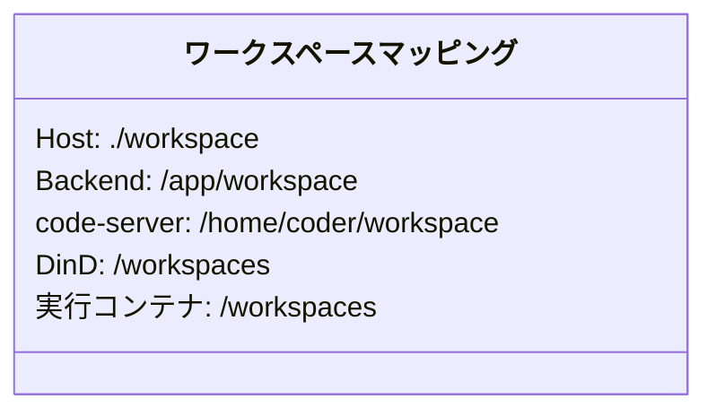
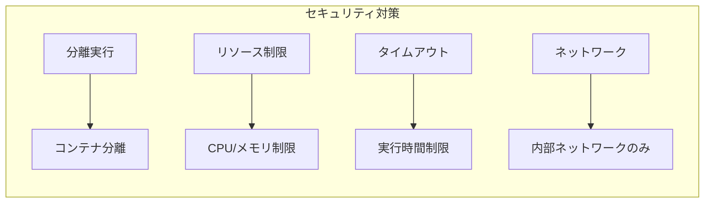
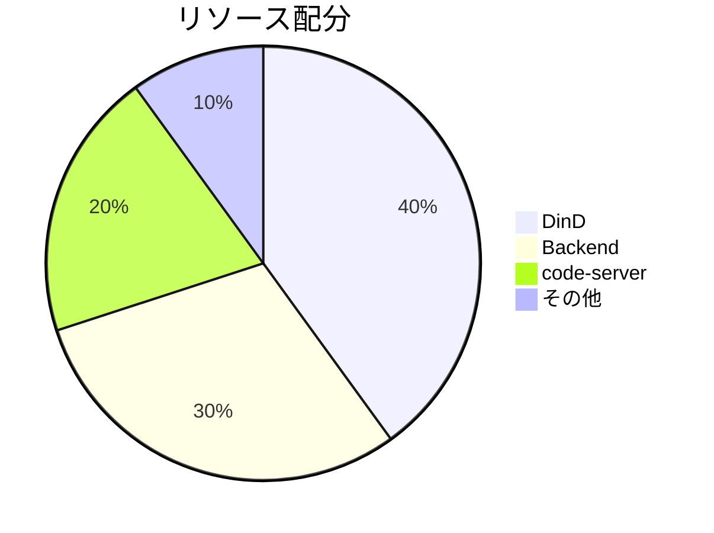
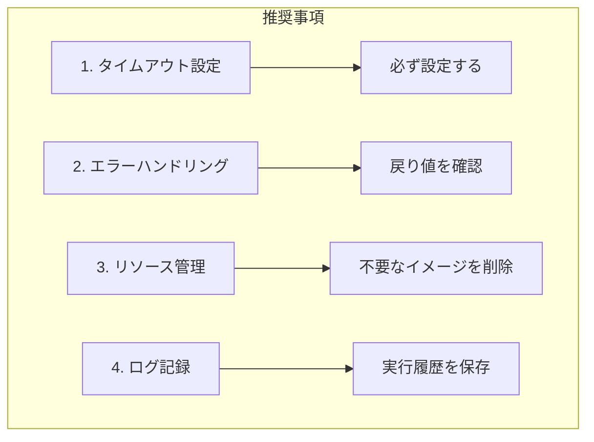
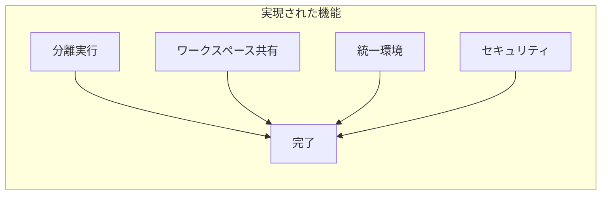

# DinD Executor - 使用ガイド

Docker-in-Docker (DinD) を使用した分離実行環境のガイドです。

## 概要

DinD Executorは、Backend (Agent SDK) とcode-serverで共有のDocker実行環境を提供します。


## アーキテクチャ


## セットアップ

### 1. DinD環境の起動

```bash
# DinDを含む全サービスを起動
docker-compose -f docker-compose.yml -f docker-compose.dind.yml up -d

# DinDの状態確認
docker-compose -f docker-compose.yml -f docker-compose.dind.yml ps
```

### 2. 環境変数の設定

`.env` ファイルに以下を追加:

```env
DIND_ENABLED=true
DOCKER_HOST=tcp://dind:2375
DIND_WORKSPACE_PATH=/workspaces
DOCKER_BUILDKIT=1
```

### 3. 動作確認

```bash
# Backendコンテナから
docker exec -it claude-backend docker info

# code-serverのターミナルから
docker info
```

## 使用方法

### Python APIでの使用

```python
from app.utils.dind_executor import get_executor

# Executorを取得
executor = get_executor()

# DinDが利用可能か確認
if not executor.is_available():
    print("DinD is not available")
    exit(1)

# Pythonコードを実行
result = executor.run_python_code(
    code='''
import sys
print(f"Python {sys.version}")
print("Hello from DinD!")
    ''',
    python_version="3.11",
)

print(f"Return code: {result['returncode']}")
print(f"Output: {result['stdout']}")
print(f"Error: {result['stderr']}")
```

### 実行パターン

#### 1. Pythonコード実行

```python
# シンプルな実行
result = executor.run_python_code(
    code="print('Hello, World!')",
    python_version="3.11",
)

# 依存パッケージ付き実行
result = executor.run_python_code(
    code='''
import requests
response = requests.get("https://api.github.com")
print(response.status_code)
    ''',
    python_version="3.11",
    requirements=["requests"],
    timeout=60,
)
```

#### 2. シェルスクリプト実行

```python
result = executor.run_shell_script(
    script='''
#!/bin/bash
echo "Current directory: $(pwd)"
ls -la
    ''',
    shell="/bin/bash",
    timeout=30,
)
```

#### 3. カスタムコマンド実行

```python
result = executor.run_command(
    image="node:20-alpine",
    command="node --version && npm --version",
    mount_workspace=True,
    timeout=30,
)
```

#### 4. ワークスペース内でのコード実行

```python
# ワークスペース内のファイルを実行
result = executor.run_command(
    image="python:3.11",
    command="python script.py",
    working_dir="/workspaces/session-id/project",
    mount_workspace=True,
)
```

#### 5. Dockerfileからビルドして実行

```python
dockerfile = '''
FROM python:3.11-slim
RUN pip install flask
COPY . /app
WORKDIR /app
CMD ["python", "app.py"]
'''

result = executor.build_and_run(
    dockerfile_content=dockerfile,
    context_path="session-id/my-project",
    timeout=300,
)
```

## ワークスペースの共有



全てのサービスが同じボリューム (`claude-workspace`) を共有:

- **Host**: `./workspace`
- **Backend**: `/app/workspace`
- **code-server**: `/home/coder/workspace`
- **DinD**: `/workspaces`
- **実行コンテナ**: `/workspaces` (DinDからマウント)

## セキュリティ考慮事項



- **分離実行**: 各実行は独立したコンテナで実行され、相互に影響しない
- **リソース制限**: DinDコンテナにCPU/メモリ制限を設定
- **タイムアウト**: 全ての実行にタイムアウトを設定
- **ネットワーク分離**: DinDは内部ネットワークのみアクセス可能
- **TLS無効化**: 内部ネットワークのためTLSは無効（外部公開しないこと）

## トラブルシューティング

### DinDに接続できない

```bash
# DinDの状態確認
docker-compose -f docker-compose.yml -f docker-compose.dind.yml ps dind

# DinDのログ確認
docker-compose -f docker-compose.yml -f docker-compose.dind.yml logs dind

# ヘルスチェック確認
docker exec claude-dind docker info
```

### ワークスペースがマウントされない

```bash
# ボリュームの確認
docker volume inspect claude-workspace

# DinD内でのマウント確認
docker exec claude-dind ls -la /workspaces
```

### パフォーマンスが遅い



DinDのリソース制限を調整:

```yaml
# docker-compose.dind.yml
deploy:
  resources:
    limits:
      cpus: '4'
      memory: 8G
    reservations:
      cpus: '2'
      memory: 4G
```

## ベストプラクティス



1. **タイムアウト設定**: 必ず適切なタイムアウトを設定
2. **エラーハンドリング**: `returncode`を確認して適切に処理
3. **リソース管理**: 定期的に不要なイメージ・コンテナを削除
4. **ログ記録**: 実行履歴を保存して問題追跡を容易に

## 実装例

### Agent SDK統合例

```python
from fastapi import APIRouter, HTTPException
from pydantic import BaseModel
from app.utils.dind_executor import get_executor

router = APIRouter()

class CodeExecuteRequest(BaseModel):
    code: str
    language: str = "python"
    timeout: int = 60

@router.post("/execute")
async def execute_code(request: CodeExecuteRequest):
    executor = get_executor()

    if not executor.is_available():
        raise HTTPException(
            status_code=503,
            detail="Code execution service is not available"
        )

    try:
        if request.language == "python":
            result = executor.run_python_code(
                code=request.code,
                timeout=request.timeout,
            )
        else:
            raise HTTPException(
                status_code=400,
                detail=f"Unsupported language: {request.language}"
            )

        return {
            "success": result["returncode"] == 0,
            "output": result["stdout"],
            "error": result["stderr"],
        }
    except Exception as e:
        raise HTTPException(
            status_code=500,
            detail=str(e)
        )
```

## まとめ

DinD Executorにより、Agent SDKとcode-serverで共有の安全な実行環境を実現しました。



この設定により:
- Backend (Agent SDK) がDinD内でコードを安全に実行可能
- code-serverのターミナルから同じDocker環境にアクセス可能
- 両者が同じワークスペースを共有
- 分離された安全な実行環境を提供
