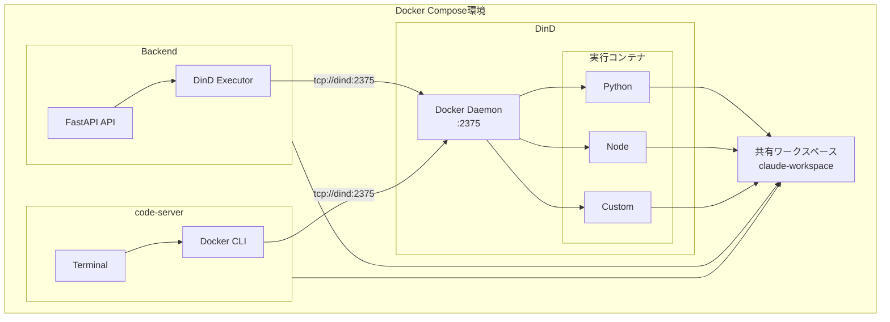
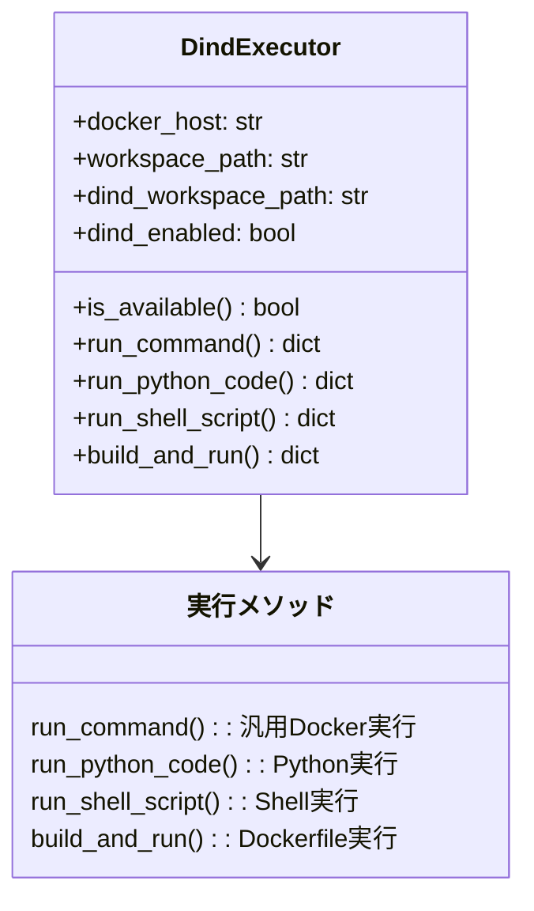
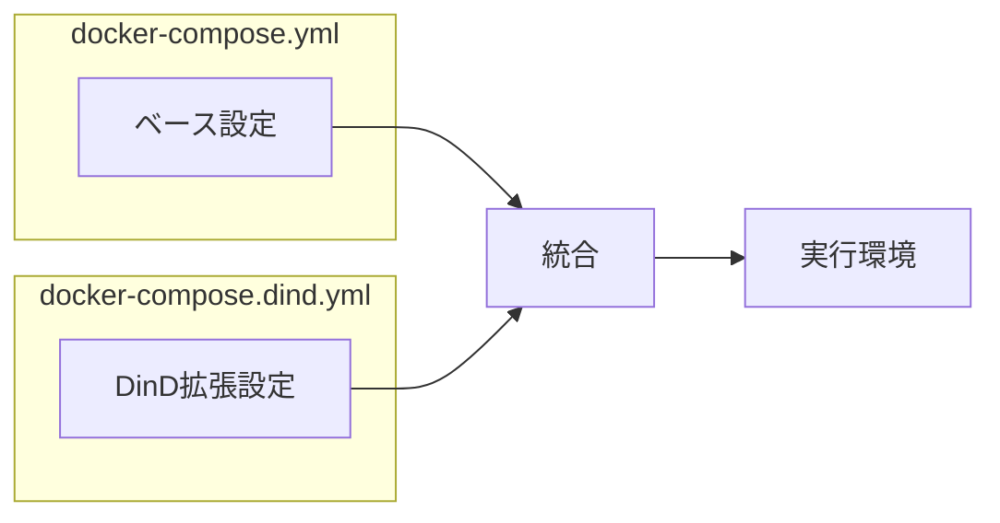
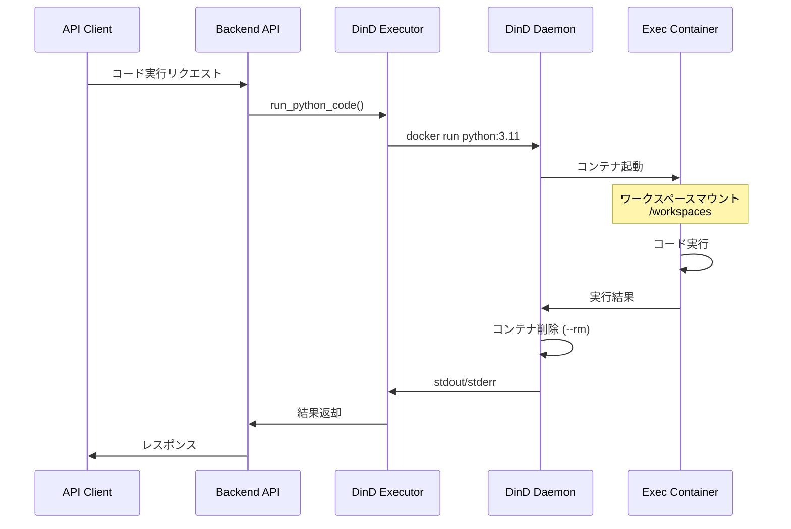
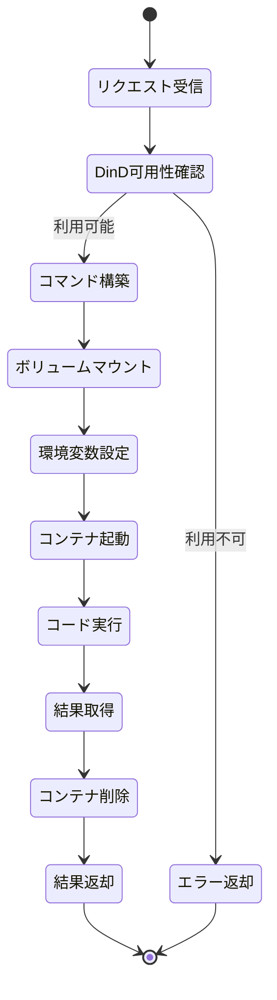

# DinD実装概要

> 作成日: 2025-12-20
> 最終更新: 2025-12-29
> バージョン: 1.1

Backend (Agent SDK) とcode-serverで共有実行環境を実現するDinD実装の概要です。

## 実装内容

### 変更ファイル一覧

| ファイル | 変更内容 | 目的 |
|---------|---------|------|
| `/Users/t.hirai/AGENTSDK/docker-compose.dind.yml` | Backend環境変数追加 | DinD接続設定 |
| `/Users/t.hirai/AGENTSDK/src/backend/Dockerfile` | Docker CLIインストール | Backend内でDocker操作 |
| `/Users/t.hirai/AGENTSDK/.env.example` | DinD設定追加 | 環境変数テンプレート |

### 新規ファイル一覧

| ファイル | 役割 |
|---------|------|
| `/Users/t.hirai/AGENTSDK/src/backend/app/utils/dind_executor.py` | DinD実行ユーティリティ |
| `/Users/t.hirai/AGENTSDK/doc/dind-executor-usage.md` | 使用ガイド |
| `/Users/t.hirai/AGENTSDK/doc/dind-setup-guide.md` | セットアップガイド |
| `/Users/t.hirai/AGENTSDK/doc/dind-implementation-summary.md` | 実装概要 (本ドキュメント) |

## アーキテクチャ



## 主要コンポーネント

### 1. DinD Executor (`dind_executor.py`)

Python APIでDinD経由のコード実行を簡単に行うためのユーティリティクラス。



主な機能:

- **接続管理**: DinDへの接続状態確認
- **汎用実行**: 任意のDockerイメージでコマンド実行
- **Python実行**: Pythonコードの簡易実行
- **Shell実行**: シェルスクリプト実行
- **ビルド実行**: Dockerfileからビルドして実行

### 2. Docker Compose設定



`docker-compose.dind.yml` の拡張設定:

- DinDサービスの追加
- code-serverへのDocker CLIインストール
- BackendへのDinD環境変数設定
- 共有ワークスペースのマウント

### 3. 環境変数

| 変数名 | デフォルト値 | 説明 |
|--------|------------|------|
| `DIND_ENABLED` | `false` | DinD機能の有効/無効 |
| `DOCKER_HOST` | `tcp://dind:2375` | Dockerデーモンのエンドポイント |
| `DIND_WORKSPACE_PATH` | `/workspaces` | DinD内のワークスペースパス |
| `DOCKER_BUILDKIT` | `1` | BuildKitの有効化 |

## ワークスペースマッピング

全てのサービスが同じボリューム (`claude-workspace`) を経由してワークスペースを共有:

| レイヤー | パス | 説明 |
|---------|------|------|
| Host | `./workspace` | ホストのディレクトリ |
| Volume | `claude-workspace` | Docker volume |
| Backend | `/app/workspace` | Backend内のマウントポイント |
| code-server | `/home/coder/workspace` | code-server内のマウントポイント |
| DinD | `/workspaces` | DinD内のマウントポイント |
| 実行コンテナ | `/workspaces` | DinDから起動されるコンテナ内のマウントポイント |

## 実行フロー



### ステップ詳細



1. **リクエスト受信**: API経由でコード実行リクエスト
2. **DinD可用性確認**: `is_available()` で接続確認
3. **コマンド構築**: `docker run` コマンドの組み立て
4. **ボリュームマウント**: `-v /workspaces:/workspaces` でワークスペースマウント
5. **環境変数設定**: 必要な環境変数を `-e` で設定
6. **コンテナ起動**: DinD経由でコンテナ起動
7. **コード実行**: コンテナ内でコード実行
8. **結果取得**: stdout/stderrを取得
9. **コンテナ削除**: `--rm` により自動削除
10. **結果返却**: API経由で結果を返却

## セキュリティ考慮事項

### 実装されたセキュリティ機能

| 対策 | 実装 | 効果 |
|------|------|------|
| ネットワーク分離 | DinDは内部ネットワーク (`claude-network`) のみ | 外部攻撃防止 |
| コンテナ分離 | 各実行は独立した一時コンテナ (`--rm`) | 相互影響排除 |
| リソース制限 | DinDコンテナにCPU/メモリ制限 | リソース枯渇防止 |
| 権限分離 | DinDコンテナのみがprivileged mode | 権限最小化 |
| TLS設定 | 内部通信のみのためTLS無効 | パフォーマンス最適化 |

## 使用例

### Basic Example

```python
from app.utils.dind_executor import get_executor

# Executorを取得
executor = get_executor()

# DinD利用可能か確認
if executor.is_available():
    # Pythonコード実行
    result = executor.run_python_code(
        code="print('Hello from DinD!')",
        python_version="3.11",
    )
    print(result['stdout'])  # Hello from DinD!
```

### Advanced Example

```python
# 依存パッケージ付きで実行
result = executor.run_python_code(
    code='''
import requests
response = requests.get("https://api.github.com")
print(f"Status: {response.status_code}")
    ''',
    requirements=["requests"],
    timeout=60,
)

# カスタムイメージで実行
result = executor.run_command(
    image="node:20-alpine",
    command="node --version && npm --version",
    working_dir="/workspaces/project",
    mount_workspace=True,
)

# Dockerfileからビルドして実行
result = executor.build_and_run(
    dockerfile_content='''
FROM python:3.11-slim
RUN pip install flask
COPY . /app
WORKDIR /app
CMD ["python", "app.py"]
    ''',
    context_path="session-id/my-app",
)
```

## パフォーマンス最適化

**最適化ポイント:**

| 項目 | 対策 | 効果 |
|------|------|------|
| イメージキャッシュ | よく使うイメージを事前Pull | 起動時間短縮 |
| BuildKit | DOCKER_BUILDKIT=1 | ビルド高速化 |
| リソース配分 | DinDに十分なリソース | 処理速度向上 |
| ストレージ | overlay2使用 | I/O性能向上 |

### 推奨設定

1. **イメージキャッシュ**
   ```bash
   # よく使うイメージを事前Pull
   docker pull python:3.11-slim
   docker pull node:20-alpine
   docker pull ubuntu:22.04
   ```

2. **BuildKit有効化**
   ```env
   DOCKER_BUILDKIT=1
   ```

3. **リソース配分**
   - DinDに十分なCPU/メモリを割り当て
   - 標準: 4 cores / 8GB
   - 高負荷: 8 cores / 16GB

4. **ストレージドライバー**
   - overlay2を使用（デフォルト設定済み）

## トラブルシューティング

**問題別対処法:**

| 症状 | 確認事項 | 解決方法 |
|------|---------|---------|
| 接続できない | DinD状態確認 | ログ確認・再起動 |
| 遅い | リソース確認 | リソース制限調整 |
| ワークスペース見えない | マウント確認 | ボリューム確認 |

### よくある問題と解決方法

1. **DinDに接続できない**
   ```bash
   docker-compose -f docker-compose.yml -f docker-compose.dind.yml logs dind
   docker exec claude-dind docker info
   ```

2. **実行が遅い**
   ```bash
   docker stats
   # docker-compose.dind.ymlのresources設定を調整
   ```

3. **ワークスペースが見えない**
   ```bash
   docker volume inspect claude-workspace
   docker exec claude-dind ls -la /workspaces
   ```

## 次のステップ

| ステップ | 作業 | 参照 |
|---------|------|------|
| 1 | セットアップ | [DinD Setup Guide](./dind-setup-guide.md) |
| 2 | 使用方法確認 | [DinD Executor Usage](./dind-executor-usage.md) |
| 3 | API統合 | Backend APIへの統合 |
| 4 | 本番運用 | モニタリングとメンテナンス |

## まとめ

**実装成果:**

| 機能 | 説明 | 状態 |
|------|------|:----:|
| 安全なコード実行 | Backend (Agent SDK) がDinD経由で実行 | ✅ |
| Docker環境共有 | code-serverから同じDocker環境にアクセス | ✅ |
| 統一ワークスペース | 両者がファイルを共有 | ✅ |
| セキュア分離 | 分離された実行環境 | ✅ |
| 拡張性 | シンプルで拡張性の高い設計 | ✅ |

---

## 関連ドキュメント

| ドキュメント | 説明 |
|-------------|------|
| [DinDセットアップガイド](./dind-setup-guide.md) | 環境構築手順 |
| [DinD Executor使用ガイド](./dind-executor-usage.md) | Executorの使い方 |
| [Docker設計書](./docker-design.md) | インフラ全体設計 |

---

## 変更履歴

| バージョン | 日付 | 変更内容 |
|-----------|------|----------|
| v1.0 | 2025-12-20 | 初版作成 |
| v1.1 | 2025-12-29 | テーブル形式に統一 |

---

**ドキュメント管理情報**

| 項目 | 値 |
|------|-----|
| バージョン | 1.1 |
| 最終更新 | 2025-12-29 |
| 作成者 | Claude Code |
| レビューステータス | ✅ 完了 |
