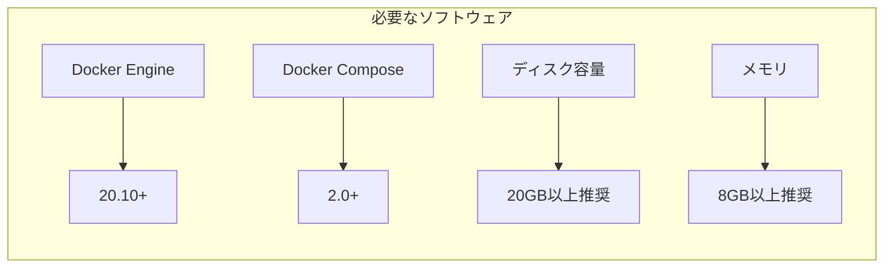
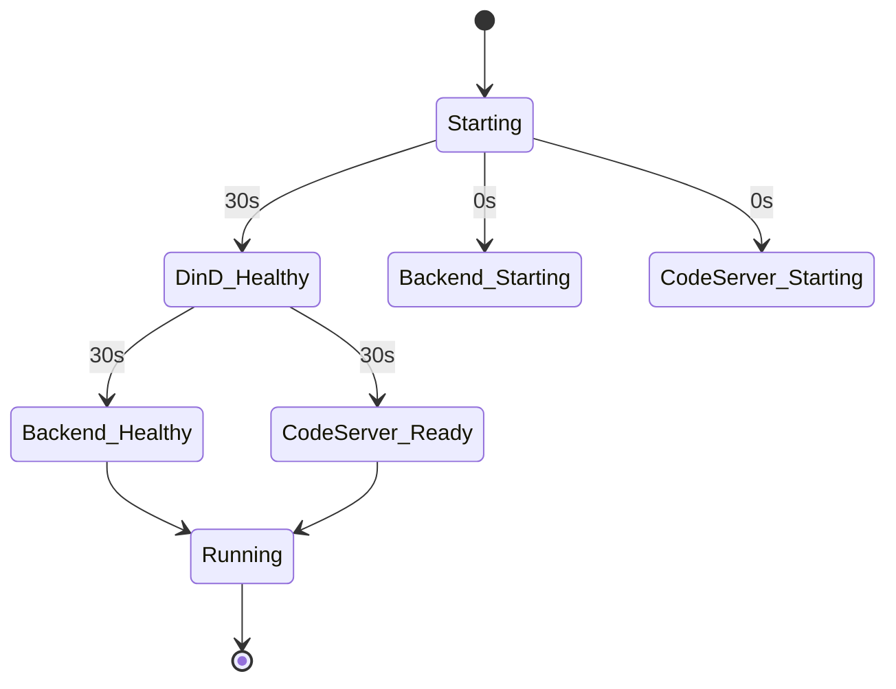
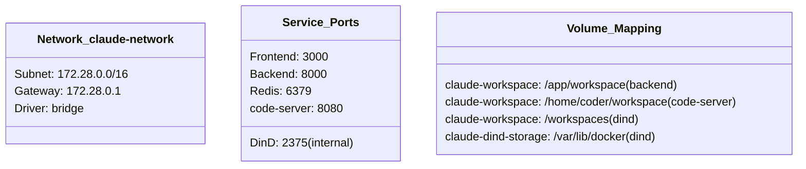
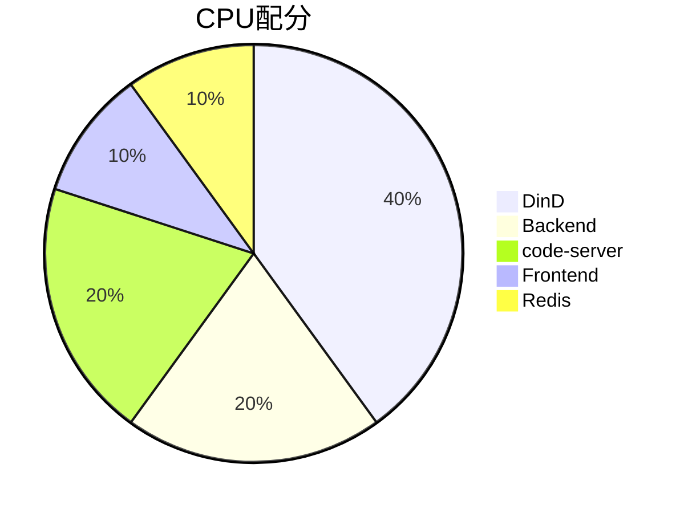
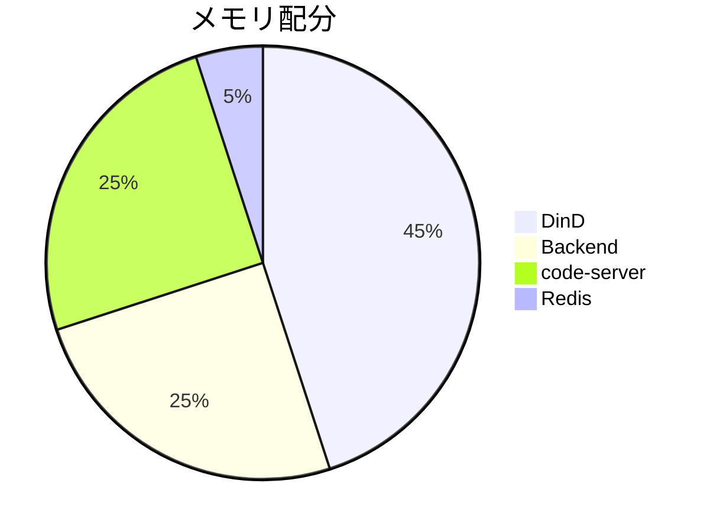
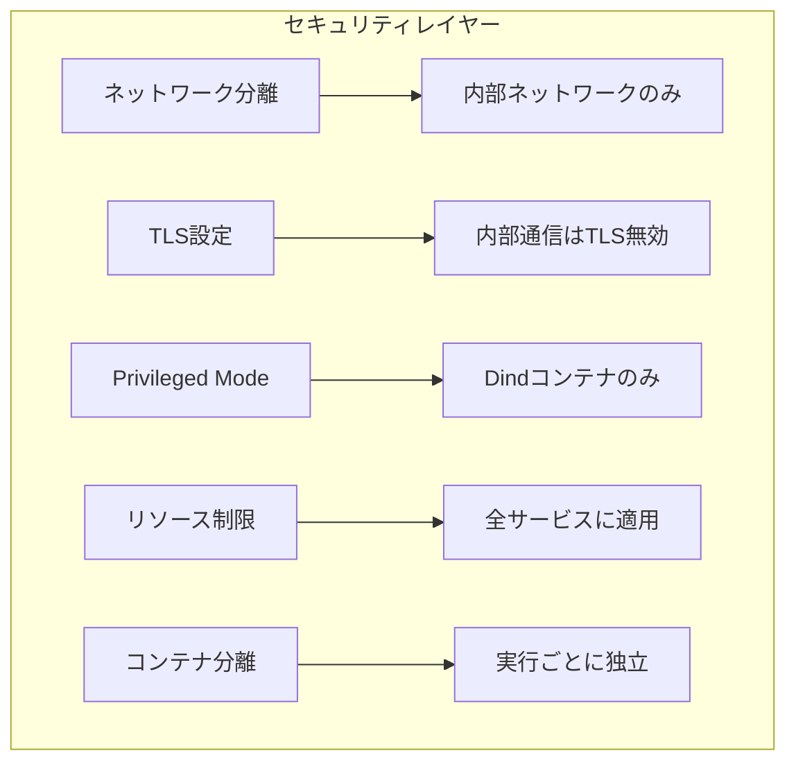
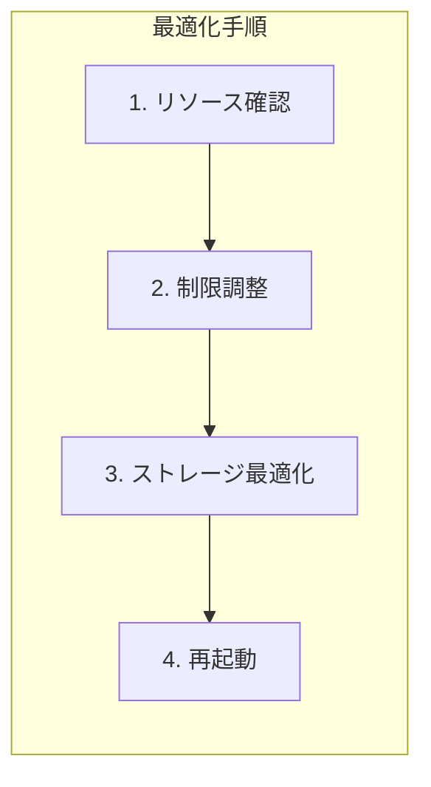
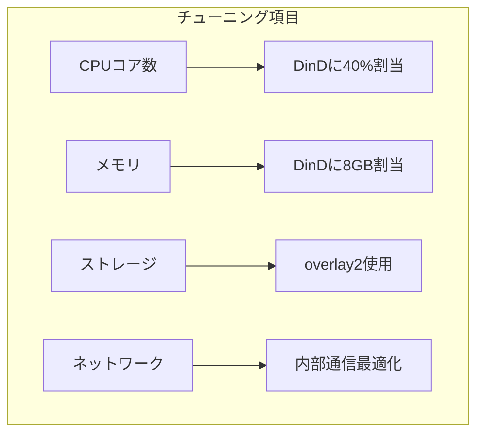
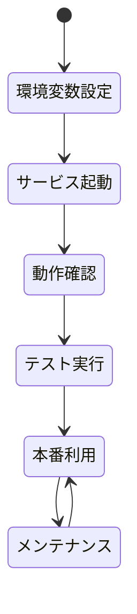

# DinD環境 セットアップガイド

Docker-in-Docker (DinD) 環境の構築と設定手順です。

## 前提条件



- Docker Engine 20.10以上
- Docker Compose 2.0以上
- 十分なディスク容量 (20GB以上推奨)
- 十分なメモリ (8GB以上推奨)

## セットアップ手順

### ステップ1: 環境変数の設定

`.env` ファイルを作成または編集:

```bash
cp .env.example .env
```

以下の設定を追加:

```env
# DinD Configuration
DIND_ENABLED=true
DOCKER_HOST=tcp://dind:2375
DIND_WORKSPACE_PATH=/workspaces
DOCKER_BUILDKIT=1
```

### ステップ2: サービスの起動

```bash
# 全サービスをDinD付きで起動
docker-compose -f docker-compose.yml -f docker-compose.dind.yml up -d

# 起動確認
docker-compose -f docker-compose.yml -f docker-compose.dind.yml ps
```

期待される出力:



### ステップ3: 動作確認

#### 3.1 DinDの確認

```bash
# DinDコンテナの状態確認
docker exec claude-dind docker info

# ワークスペースの確認
docker exec claude-dind ls -la /workspaces
```

#### 3.2 Backendからの接続確認

```bash
# Backendコンテナに入る
docker exec -it claude-backend bash

# Docker CLIが利用可能か確認
docker info

# 環境変数の確認
echo $DOCKER_HOST
echo $DIND_ENABLED
```

#### 3.3 code-serverからの接続確認

1. ブラウザで http://localhost:8080 を開く
2. ターミナルを開く
3. 以下のコマンドを実行:

```bash
# Docker CLI確認
docker info

# ワークスペース確認
ls -la /home/coder/workspace
```

### ステップ4: テスト実行

Backendコンテナ内で:

```bash
# Pythonシェルを起動
python3

# DinD Executorをテスト
>>> from app.utils.dind_executor import get_executor
>>> executor = get_executor()
>>> executor.is_available()
True
>>> result = executor.run_python_code('print("Hello from DinD!")')
>>> print(result['stdout'])
Hello from DinD!
```

## アーキテクチャ図

```mermaid
flowchart TB
    subgraph Host
        DC[Docker Compose]
        WorkspaceVol[Workspace Volume]
    end

    subgraph Docker Network - claude-network
        subgraph Backend Container
            API[FastAPI]
            SDK[Agent SDK]
            DindExec[DinD Executor]
        end

        subgraph code-server Container
            VSCode[VS Code Web]
            Terminal[Terminal]
            DockerCLI1[Docker CLI]
        end

        subgraph DinD Container - Privileged
            DockerDaemon[Docker Daemon<br/>:2375]
            DinDStorage[/var/lib/docker]

            subgraph Execution Containers
                PythonExec[Python Container]
                NodeExec[Node Container]
                CustomExec[Custom Container]
            end
        end

        subgraph Redis Container
            RedisDB[(Redis)]
        end
    end

    DC -->|manages| Backend
    DC -->|manages| code-server
    DC -->|manages| DinD
    DC -->|manages| Redis

    WorkspaceVol -->|mount| Backend
    WorkspaceVol -->|mount| code-server
    WorkspaceVol -->|mount| DinD

    SDK --> DindExec
    DindExec -->|DOCKER_HOST<br/>tcp://dind:2375| DockerDaemon
    Terminal --> DockerCLI1
    DockerCLI1 -->|DOCKER_HOST<br/>tcp://dind:2375| DockerDaemon

    DockerDaemon -->|creates| PythonExec
    DockerDaemon -->|creates| NodeExec
    DockerDaemon -->|creates| CustomExec

    PythonExec -->|access| WorkspaceVol
    NodeExec -->|access| WorkspaceVol
    CustomExec -->|access| WorkspaceVol

    API -->|cache| RedisDB
```

## ネットワーク構成



## リソース配分





現在の設定:

| サービス | CPU制限 | CPU予約 | メモリ制限 | メモリ予約 |
|---------|---------|---------|-----------|-----------|
| DinD | 4 cores | 2 cores | 8 GB | 4 GB |
| Backend | 2 cores | 1 core | 4 GB | 2 GB |
| code-server | 2 cores | 1 core | 4 GB | 2 GB |
| Redis | 0.5 cores | 0.25 cores | 1 GB | 512 MB |

## セキュリティ設定



### セキュリティのベストプラクティス

1. **ネットワーク分離**
   - DinDは内部ネットワーク (`claude-network`) のみアクセス可能
   - ポート2375は外部に公開しない

2. **TLS設定**
   - 内部通信のためTLSは無効化 (`DOCKER_TLS_CERTDIR=`)
   - 本番環境では外部アクセスを完全に遮断

3. **Privileged Mode**
   - DinDコンテナのみがprivileged mode
   - 他のコンテナは通常権限

4. **リソース制限**
   - 全サービスにCPU/メモリ制限を設定
   - DoS攻撃を防止

5. **実行コンテナの分離**
   - 各実行は独立した一時コンテナで実行
   - 実行後は自動削除 (`--rm`)

## トラブルシューティング

### 問題1: DinDが起動しない

```bash
# ログを確認
docker-compose -f docker-compose.yml -f docker-compose.dind.yml logs dind

# よくある原因:
# - ディスク容量不足
# - 他のDockerデーモンとの競合
# - privileged権限がない
```

解決方法:

```bash
# ディスク容量確認
df -h

# 不要なイメージ削除
docker system prune -a

# DinDを再起動
docker-compose -f docker-compose.yml -f docker-compose.dind.yml restart dind
```

### 問題2: Backendから接続できない

```bash
# ネットワーク確認
docker network inspect claude-network

# 環境変数確認
docker exec claude-backend env | grep DOCKER
```

解決方法:

```bash
# サービス間の疎通確認
docker exec claude-backend ping dind

# DinDのヘルスチェック
docker exec claude-backend curl http://dind:2375/version
```

### 問題3: ワークスペースが見えない

```bash
# ボリューム確認
docker volume inspect claude-workspace

# マウント確認 (各コンテナ)
docker exec claude-backend ls -la /app/workspace
docker exec claude-code-server ls -la /home/coder/workspace
docker exec claude-dind ls -la /workspaces
```

### 問題4: パフォーマンスが遅い



```bash
# リソース使用状況確認
docker stats

# DinDのリソース制限を調整 (docker-compose.dind.yml)
# deploy.resources.limits を増やす

# ストレージドライバー最適化
# overlay2使用を確認
docker exec claude-dind docker info | grep "Storage Driver"
```

## メンテナンス

### 定期メンテナンス

```bash
# 不要なコンテナ・イメージの削除
docker exec claude-dind docker system prune -f

# DinDストレージの確認
docker exec claude-dind du -sh /var/lib/docker

# ログのローテーション
docker-compose -f docker-compose.yml -f docker-compose.dind.yml logs --tail=100 dind
```

### バックアップ

```bash
# ワークスペースのバックアップ
docker run --rm -v claude-workspace:/data -v $(pwd):/backup ubuntu tar czf /backup/workspace-backup.tar.gz /data

# 復元
docker run --rm -v claude-workspace:/data -v $(pwd):/backup ubuntu tar xzf /backup/workspace-backup.tar.gz -C /
```

## パフォーマンスチューニング



### 推奨設定 (システムスペック別)

#### 低スペック (8GB RAM, 4 cores)

```yaml
# docker-compose.dind.yml
dind:
  deploy:
    resources:
      limits:
        cpus: '2'
        memory: 4G
      reservations:
        cpus: '1'
        memory: 2G
```

#### 標準スペック (16GB RAM, 8 cores)

```yaml
# docker-compose.dind.yml
dind:
  deploy:
    resources:
      limits:
        cpus: '4'
        memory: 8G
      reservations:
        cpus: '2'
        memory: 4G
```

#### 高スペック (32GB+ RAM, 16+ cores)

```yaml
# docker-compose.dind.yml
dind:
  deploy:
    resources:
      limits:
        cpus: '8'
        memory: 16G
      reservations:
        cpus: '4'
        memory: 8G
```

## まとめ



DinD環境のセットアップが完了しました。これにより:

- Agent SDKとcode-serverで共有の実行環境を利用可能
- 安全で分離されたコード実行環境を提供
- 統一されたワークスペースアクセス
- 拡張可能でメンテナンス性の高い構成

次のステップ: [DinD Executor使用ガイド](./dind-executor-usage.md)
