# Web版Claude Code - Docker/インフラ設計書

**作成日:** 2025-12-20
**最終更新:** 2025-12-21
**バージョン:** 1.1
**ステータス:** ✅ 完了（100%）

---

## 目次
1. [概要](#1-概要)
2. [Docker Compose構成](#2-docker-compose構成)
3. [Dockerfile設計](#3-dockerfile設計)
4. [環境変数設計](#4-環境変数設計)
5. [ボリューム設計](#5-ボリューム設計)
6. [ネットワーク設計](#6-ネットワーク設計)
7. [セキュリティ考慮事項](#7-セキュリティ考慮事項)
8. [運用設計](#8-運用設計)
9. [スケーリング戦略](#9-スケーリング戦略)
10. [トラブルシューティング](#10-トラブルシューティング)

---

## 1. 概要

### 1.1 インフラ構成図

```mermaid
flowchart TB
    subgraph Host["Host Machine"]
        subgraph Network["Docker Compose Network: claude-network (bridge)"]
            subgraph Containers["コンテナ群"]
                FE["frontend<br/>(Next.js)<br/>Port: 3000<br/>User: node"]
                BE["backend<br/>(FastAPI)<br/>Port: 8000<br/>User: appuser"]
                CS["code-server<br/>(VSCode)<br/>Port: 8080<br/>User: coder"]
                RD["redis<br/>(7-alpine)<br/>Port: 6379<br/>User: redis"]
            end

            subgraph Volumes["ボリューム"]
                WV["workspace-data<br/>/app/workspace<br/>(backend & code-server共有)"]
                RV["redis-data<br/>/data"]
            end
        end

        subgraph HostPorts["Host Ports"]
            HP1["3000:3000 (Frontend)"]
            HP2["8000:8000 (Backend API)"]
            HP3["8080:8080 (code-server)"]
            HP4["6379:6379 (Redis - debug用)"]
        end
    end

    BE --> WV
    CS --> WV
    RD --> RV

    HP1 -.-> FE
    HP2 -.-> BE
    HP3 -.-> CS
    HP4 -.-> RD
```



```mermaid
classDiagram
    class コンテナ構成 {
        frontend: Next.js 20.11-alpine, Port 3000, User node
        backend: FastAPI Python 3.11-slim, Port 8000, User appuser
        code-server: VSCode Web 4.96.2, Port 8080, User coder
        redis: Redis 7.2-alpine, Port 6379, User redis
    }
```

### 1.2 設計原則

```mermaid
flowchart LR
    subgraph 設計原則
        A[セキュリティファースト] --> A_D[非rootユーザー実行、シークレット分離、最小権限]
        B[再現性] --> B_D[イミュータブルなビルド、バージョン固定]
        C[スケーラビリティ] --> C_D[ステートレス設計、水平スケール対応]
        D[可観測性] --> D_D[ログ集約、ヘルスチェック、メトリクス収集]
        E[開発効率] --> E_D[ホットリロード、高速ビルド、デバッグ容易性]
    end
```

---

## 2. Docker Compose構成

### 2.1 完全版 docker-compose.yml

```yaml
version: '3.9'

services:
  # Frontend Service (Next.js)
  frontend:
    container_name: claude-frontend
    build:
      context: ./frontend
      dockerfile: Dockerfile
      target: ${BUILD_TARGET:-production}
      args:
        - NODE_VERSION=20.11
        - NEXT_PUBLIC_API_URL=${NEXT_PUBLIC_API_URL}
        - NEXT_PUBLIC_WS_URL=${NEXT_PUBLIC_WS_URL}
    ports:
      - "${FRONTEND_PORT:-3000}:3000"
    environment:
      - NODE_ENV=${NODE_ENV:-production}
      - NEXT_PUBLIC_API_URL=${NEXT_PUBLIC_API_URL:-http://localhost:8000}
      - NEXT_PUBLIC_WS_URL=${NEXT_PUBLIC_WS_URL:-ws://localhost:8000}
      - NEXT_TELEMETRY_DISABLED=1
    depends_on:
      backend:
        condition: service_healthy
    networks:
      - claude-network
    restart: unless-stopped
    healthcheck:
      test: ["CMD", "wget", "--quiet", "--tries=1", "--spider", "http://localhost:3000/api/health"]
      interval: 30s
      timeout: 10s
      retries: 3
      start_period: 40s
    labels:
      - "com.example.description=Claude Code Frontend"
      - "com.example.service=frontend"

  # Backend Service (FastAPI)
  backend:
    container_name: claude-backend
    build:
      context: ./backend
      dockerfile: Dockerfile
      target: ${BUILD_TARGET:-production}
      args:
        - PYTHON_VERSION=3.11
        - CLAUDE_CODE_VERSION=latest
    ports:
      - "${BACKEND_PORT:-8000}:8000"
    environment:
      # Application
      - ENVIRONMENT=${ENVIRONMENT:-production}
      - DEBUG=${DEBUG:-false}
      - LOG_LEVEL=${LOG_LEVEL:-info}

      # Claude API
      - ANTHROPIC_API_KEY=${ANTHROPIC_API_KEY:?ANTHROPIC_API_KEY is required}
      - CLAUDE_MODEL=${CLAUDE_MODEL:-claude-opus-4.5}
      - MAX_TOKENS=${MAX_TOKENS:-4096}

      # Redis
      - REDIS_URL=${REDIS_URL:-redis://redis:6379/0}
      - REDIS_MAX_CONNECTIONS=${REDIS_MAX_CONNECTIONS:-50}

      # Session
      - SESSION_TIMEOUT=${SESSION_TIMEOUT:-3600}
      - MAX_SESSIONS=${MAX_SESSIONS:-100}

      # Security
      - ALLOWED_ORIGINS=${ALLOWED_ORIGINS:-http://localhost:3000}
      - SECRET_KEY=${SECRET_KEY:?SECRET_KEY is required}

      # Workspace
      - WORKSPACE_PATH=/app/workspace
      - MAX_FILE_SIZE=${MAX_FILE_SIZE:-10485760}

      # Rate Limiting
      - RATE_LIMIT_PER_MINUTE=${RATE_LIMIT_PER_MINUTE:-30}
    volumes:
      - workspace-data:/app/workspace:rw
      - ./backend/app:/app/app:ro  # Development only
    depends_on:
      redis:
        condition: service_healthy
    networks:
      - claude-network
    restart: unless-stopped
    healthcheck:
      test: ["CMD", "curl", "-f", "http://localhost:8000/api/health"]
      interval: 30s
      timeout: 10s
      retries: 3
      start_period: 60s
    labels:
      - "com.example.description=Claude Code Backend API"
      - "com.example.service=backend"
    # Resource limits
    deploy:
      resources:
        limits:
          cpus: '2'
          memory: 4G
        reservations:
          cpus: '1'
          memory: 2G

  # Redis Service (Cache & Session Store)
  redis:
    container_name: claude-redis
    image: redis:7.2-alpine
    ports:
      - "${REDIS_PORT:-6379}:6379"
    volumes:
      - redis-data:/data:rw
      - ./redis/redis.conf:/usr/local/etc/redis/redis.conf:ro
    command: >
      redis-server
      /usr/local/etc/redis/redis.conf
      --requirepass ${REDIS_PASSWORD:-}
      --maxmemory 512mb
      --maxmemory-policy allkeys-lru
      --appendonly yes
      --appendfsync everysec
    networks:
      - claude-network
    restart: unless-stopped
    healthcheck:
      test: ["CMD", "redis-cli", "ping"]
      interval: 10s
      timeout: 5s
      retries: 5
      start_period: 10s
    labels:
      - "com.example.description=Redis Cache & Session Store"
      - "com.example.service=redis"
    deploy:
      resources:
        limits:
          cpus: '0.5'
          memory: 1G
        reservations:
          cpus: '0.25'
          memory: 512M

  # code-server Service (VSCode Web)
  code-server:
    container_name: claude-code-server
    image: codercom/code-server:4.96.2
    ports:
      - "${CODE_SERVER_PORT:-8080}:8080"
    environment:
      - DOCKER_USER=coder
      - PASSWORD=${CODE_SERVER_PASSWORD:-}
      - HASHED_PASSWORD=${CODE_SERVER_HASHED_PASSWORD:-}
      - SUDO_PASSWORD=${CODE_SERVER_SUDO_PASSWORD:-}
      - PROXY_DOMAIN=${CODE_SERVER_PROXY_DOMAIN:-}
      - DEFAULT_WORKSPACE=/home/coder/workspace
    volumes:
      - workspace-data:/home/coder/workspace:rw
      - code-server-data:/home/coder/.local/share/code-server:rw
      - code-server-config:/home/coder/.config/code-server:rw
    networks:
      - claude-network
    restart: unless-stopped
    healthcheck:
      test: ["CMD", "curl", "-f", "http://localhost:8080/healthz"]
      interval: 30s
      timeout: 10s
      retries: 3
      start_period: 30s
    labels:
      - "com.example.description=Claude Code - VSCode Web Editor"
      - "com.example.service=code-server"
    deploy:
      resources:
        limits:
          cpus: '2'
          memory: 4G
        reservations:
          cpus: '1'
          memory: 2G

# Volumes
volumes:
  workspace-data:
    driver: local
    name: claude-workspace
    driver_opts:
      type: none
      o: bind
      device: ${WORKSPACE_HOST_PATH:-./workspace}

  redis-data:
    driver: local
    name: claude-redis-data

  code-server-data:
    driver: local
    name: claude-code-server-data

  code-server-config:
    driver: local
    name: claude-code-server-config

# Networks
networks:
  claude-network:
    name: claude-network
    driver: bridge
    ipam:
      driver: default
      config:
        - subnet: 172.28.0.0/16
          gateway: 172.28.0.1
```

### 2.2 開発用 docker-compose.dev.yml

```yaml
version: '3.9'

services:
  frontend:
    build:
      target: development
    volumes:
      - ./frontend:/app:cached
      - /app/node_modules
      - /app/.next
    environment:
      - NODE_ENV=development
    command: npm run dev

  backend:
    build:
      target: development
    volumes:
      - ./backend:/app:cached
      - /app/.venv
    environment:
      - ENVIRONMENT=development
      - DEBUG=true
      - LOG_LEVEL=debug
      - RELOAD=true
    command: uvicorn app.main:app --host 0.0.0.0 --port 8000 --reload

  redis:
    ports:
      - "6379:6379"
```

---

## 3. Dockerfile設計

### 3.1 Backend Dockerfile

```dockerfile
# Multi-stage build for Python FastAPI backend
# Target: production, development

# ============================================
# Base Stage: Common dependencies
# ============================================
FROM python:3.11-slim as base

# Metadata
LABEL maintainer="your-team@example.com"
LABEL description="Claude Code Backend - FastAPI with Agent SDK"
LABEL version="1.0"

# Environment variables
ENV PYTHONUNBUFFERED=1 \
    PYTHONDONTWRITEBYTECODE=1 \
    PIP_NO_CACHE_DIR=1 \
    PIP_DISABLE_PIP_VERSION_CHECK=1 \
    POETRY_VERSION=1.7.1 \
    POETRY_HOME=/opt/poetry \
    POETRY_NO_INTERACTION=1 \
    POETRY_VIRTUALENVS_IN_PROJECT=true

# Install system dependencies
RUN apt-get update && apt-get install -y --no-install-recommends \
    curl \
    git \
    build-essential \
    ca-certificates \
    && rm -rf /var/lib/apt/lists/*

# Install Poetry
RUN curl -sSL https://install.python-poetry.org | python3 - \
    && ln -s /opt/poetry/bin/poetry /usr/local/bin/poetry

# Create non-root user
RUN groupadd -r appuser -g 1000 && \
    useradd -r -u 1000 -g appuser -m -s /bin/bash appuser

# Set working directory
WORKDIR /app

# ============================================
# Dependencies Stage: Install Python packages
# ============================================
FROM base as dependencies

# Copy dependency files
COPY pyproject.toml poetry.lock ./

# Install dependencies
RUN poetry install --no-root --no-dev --no-interaction --no-ansi

# ============================================
# Development Stage: Full development setup
# ============================================
FROM base as development

# Copy dependency files
COPY pyproject.toml poetry.lock ./

# Install all dependencies (including dev)
RUN poetry install --no-root --with dev

# Copy application code
COPY --chown=appuser:appuser ./app /app/app

# Create workspace directory
RUN mkdir -p /app/workspace && chown -R appuser:appuser /app/workspace

# Switch to non-root user
USER appuser

# Expose port
EXPOSE 8000

# Development command (can be overridden)
CMD ["poetry", "run", "uvicorn", "app.main:app", "--host", "0.0.0.0", "--port", "8000", "--reload"]

# ============================================
# Production Stage: Optimized production image
# ============================================
FROM base as production

# Copy virtual environment from dependencies stage
COPY --from=dependencies /app/.venv /app/.venv

# Copy application code
COPY --chown=appuser:appuser ./app /app/app

# Create workspace directory
RUN mkdir -p /app/workspace && chown -R appuser:appuser /app/workspace

# Switch to non-root user
USER appuser

# Add virtual environment to PATH
ENV PATH="/app/.venv/bin:$PATH"

# Expose port
EXPOSE 8000

# Health check
HEALTHCHECK --interval=30s --timeout=10s --start-period=60s --retries=3 \
    CMD curl -f http://localhost:8000/api/health || exit 1

# Production command
CMD ["uvicorn", "app.main:app", "--host", "0.0.0.0", "--port", "8000", "--workers", "4"]

# ============================================
# Testing Stage: For CI/CD testing
# ============================================
FROM development as testing

# Copy test files
COPY --chown=appuser:appuser ./tests /app/tests

USER appuser

# Run tests
CMD ["poetry", "run", "pytest", "-v", "--cov=app", "--cov-report=term-missing"]
```

### 3.2 Backend requirements.txt (Alternative to Poetry)

```txt
# Core Framework
fastapi==0.115.0
uvicorn[standard]==0.30.6
python-multipart==0.0.9

# Claude Agent SDK
anthropic==0.39.0
# Note: Claude Code CLI is installed separately if needed

# Database & Cache
redis==5.0.8
redis-om==0.3.1

# Data Validation
pydantic==2.9.2
pydantic-settings==2.5.2

# Security
python-jose[cryptography]==3.3.0
passlib[bcrypt]==1.7.4
python-dotenv==1.0.1

# CORS
python-cors==1.0.0

# Logging & Monitoring
structlog==24.4.0
python-json-logger==2.0.7

# Utilities
aiofiles==23.2.1
httpx==0.27.2
tenacity==9.0.0

# WebSocket
websockets==12.0
```

### 3.3 Frontend Dockerfile

```dockerfile
# Multi-stage build for Next.js frontend
# Target: production, development

# ============================================
# Base Stage: Common Node.js setup
# ============================================
FROM node:20.11-alpine as base

# Metadata
LABEL maintainer="your-team@example.com"
LABEL description="Claude Code Frontend - Next.js UI"
LABEL version="1.0"

# Install system dependencies
RUN apk add --no-cache libc6-compat curl

# Set working directory
WORKDIR /app

# Create non-root user
RUN addgroup -g 1001 -S nodejs && \
    adduser -S nextjs -u 1001

# ============================================
# Dependencies Stage: Install Node modules
# ============================================
FROM base as dependencies

# Copy package files
COPY package.json package-lock.json* ./

# Install dependencies
RUN npm ci --only=production --ignore-scripts && \
    npm cache clean --force

# ============================================
# Builder Stage: Build Next.js application
# ============================================
FROM base as builder

# Copy package files
COPY package.json package-lock.json* ./

# Install all dependencies (including dev)
RUN npm ci

# Copy source code
COPY . .

# Build arguments for environment variables
ARG NEXT_PUBLIC_API_URL
ARG NEXT_PUBLIC_WS_URL

ENV NEXT_PUBLIC_API_URL=$NEXT_PUBLIC_API_URL
ENV NEXT_PUBLIC_WS_URL=$NEXT_PUBLIC_WS_URL
ENV NEXT_TELEMETRY_DISABLED=1

# Build application
RUN npm run build

# ============================================
# Development Stage: Full development setup
# ============================================
FROM base as development

# Copy package files
COPY package.json package-lock.json* ./

# Install all dependencies
RUN npm ci

# Copy source code
COPY --chown=nextjs:nodejs . .

# Switch to non-root user
USER nextjs

# Expose port
EXPOSE 3000

# Development command
ENV NODE_ENV=development
CMD ["npm", "run", "dev"]

# ============================================
# Production Stage: Optimized production image
# ============================================
FROM base as production

# Set production environment
ENV NODE_ENV=production

# Copy production dependencies
COPY --from=dependencies --chown=nextjs:nodejs /app/node_modules ./node_modules

# Copy built application
COPY --from=builder --chown=nextjs:nodejs /app/.next ./.next
COPY --from=builder --chown=nextjs:nodejs /app/public ./public
COPY --from=builder --chown=nextjs:nodejs /app/package.json ./package.json
COPY --from=builder --chown=nextjs:nodejs /app/next.config.js ./next.config.js

# Switch to non-root user
USER nextjs

# Expose port
EXPOSE 3000

# Health check
HEALTHCHECK --interval=30s --timeout=10s --start-period=40s --retries=3 \
    CMD wget --quiet --tries=1 --spider http://localhost:3000/api/health || exit 1

# Production command
CMD ["npm", "start"]
```

### 3.4 .dockerignore (Backend)

```
# Python
__pycache__/
*.py[cod]
*$py.class
*.so
.Python
*.egg-info/
dist/
build/
.eggs/
.venv/
venv/

# Testing
.pytest_cache/
.coverage
htmlcov/
*.cover

# IDE
.vscode/
.idea/
*.swp
*.swo

# Environment
.env
.env.*
!.env.example

# Docker
Dockerfile*
docker-compose*.yml
.dockerignore

# Documentation
README.md
docs/

# Git
.git/
.gitignore
```

### 3.5 .dockerignore (Frontend)

```
# Node
node_modules/
npm-debug.log*
yarn-debug.log*
yarn-error.log*

# Next.js
.next/
out/
build/

# Testing
coverage/
.nyc_output

# IDE
.vscode/
.idea/
*.swp
*.swo

# Environment
.env*
!.env.example

# Docker
Dockerfile*
docker-compose*.yml
.dockerignore

# Git
.git/
.gitignore

# Documentation
README.md
docs/
```

---

## 4. 環境変数設計

### 4.1 .env.example (Root)

```bash
# ================================================
# Claude Code - Environment Configuration
# ================================================

# ----------------
# Build Settings
# ----------------
BUILD_TARGET=production  # production | development
COMPOSE_PROJECT_NAME=claude-code

# ----------------
# Service Ports
# ----------------
FRONTEND_PORT=3000
BACKEND_PORT=8000
REDIS_PORT=6379
CODE_SERVER_PORT=8080

# ----------------
# Frontend Environment
# ----------------
NODE_ENV=production
NEXT_PUBLIC_API_URL=http://localhost:8000
NEXT_PUBLIC_WS_URL=ws://localhost:8000

# ----------------
# Backend Environment
# ----------------
ENVIRONMENT=production  # production | development | staging
DEBUG=false
LOG_LEVEL=info  # debug | info | warning | error

# ----------------
# Claude API Configuration
# ----------------
ANTHROPIC_API_KEY=sk-ant-api03-xxxxxxxxxxxx
CLAUDE_MODEL=claude-opus-4.5
MAX_TOKENS=4096

# ----------------
# Redis Configuration
# ----------------
REDIS_URL=redis://redis:6379/0
REDIS_PASSWORD=  # Leave empty for no password
REDIS_MAX_CONNECTIONS=50

# ----------------
# Session Management
# ----------------
SESSION_TIMEOUT=3600  # seconds (1 hour)
MAX_SESSIONS=100
SECRET_KEY=your-secret-key-here-min-32-chars  # Generate: openssl rand -hex 32

# ----------------
# Security
# ----------------
ALLOWED_ORIGINS=http://localhost:3000,http://localhost:3001
CORS_ALLOW_CREDENTIALS=true

# ----------------
# Workspace Configuration
# ----------------
WORKSPACE_HOST_PATH=./workspace
MAX_FILE_SIZE=10485760  # 10MB in bytes

# ----------------
# code-server Configuration (VSCode Web)
# ----------------
CODE_SERVER_PASSWORD=  # Leave empty for no password (development only)
CODE_SERVER_HASHED_PASSWORD=  # Use argon2 hash for production: echo -n "password" | npx argon2-cli -e
CODE_SERVER_SUDO_PASSWORD=  # Optional: sudo password for terminal
CODE_SERVER_PROXY_DOMAIN=  # Optional: for subdomain proxying

# ----------------
# Rate Limiting
# ----------------
RATE_LIMIT_PER_MINUTE=30

# ----------------
# Monitoring & Logging
# ----------------
ENABLE_METRICS=true
SENTRY_DSN=  # Optional: Sentry error tracking
```

### 4.2 .env.development

```bash
# Development-specific overrides
BUILD_TARGET=development
NODE_ENV=development
ENVIRONMENT=development
DEBUG=true
LOG_LEVEL=debug

# Allow hot reload
RELOAD=true

# Development URLs
NEXT_PUBLIC_API_URL=http://localhost:8000
NEXT_PUBLIC_WS_URL=ws://localhost:8000

# Relaxed security for development
ALLOWED_ORIGINS=*
RATE_LIMIT_PER_MINUTE=1000
```

### 4.3 .env.production

```bash
# Production-specific settings
BUILD_TARGET=production
NODE_ENV=production
ENVIRONMENT=production
DEBUG=false
LOG_LEVEL=warning

# Production URLs (replace with your domain)
NEXT_PUBLIC_API_URL=https://api.claude-code.example.com
NEXT_PUBLIC_WS_URL=wss://api.claude-code.example.com

# Strict security
ALLOWED_ORIGINS=https://claude-code.example.com
RATE_LIMIT_PER_MINUTE=30
```

### 4.4 環境変数バリデーション

Backend側で環境変数を検証するPydantic設定:

```python
# backend/app/config.py
from pydantic_settings import BaseSettings, SettingsConfigDict
from typing import List, Literal

class Settings(BaseSettings):
    model_config = SettingsConfigDict(
        env_file=".env",
        env_file_encoding="utf-8",
        case_sensitive=False,
        extra="ignore"
    )

    # Application
    environment: Literal["development", "staging", "production"] = "production"
    debug: bool = False
    log_level: Literal["debug", "info", "warning", "error"] = "info"

    # Claude API
    anthropic_api_key: str
    claude_model: str = "claude-opus-4.5"
    max_tokens: int = 4096

    # Redis
    redis_url: str = "redis://redis:6379/0"
    redis_max_connections: int = 50

    # Session
    session_timeout: int = 3600
    max_sessions: int = 100
    secret_key: str

    # Security
    allowed_origins: List[str] = ["http://localhost:3000"]

    # Workspace
    workspace_path: str = "/app/workspace"
    max_file_size: int = 10485760

    # Rate Limiting
    rate_limit_per_minute: int = 30

    def __init__(self, **kwargs):
        super().__init__(**kwargs)

        # Validation
        if len(self.secret_key) < 32:
            raise ValueError("SECRET_KEY must be at least 32 characters")

        if not self.anthropic_api_key.startswith("sk-ant-"):
            raise ValueError("Invalid ANTHROPIC_API_KEY format")

settings = Settings()
```

---

## 5. ボリューム設計

### 5.1 ボリューム構成

```mermaid
flowchart TD
    subgraph ボリューム構成
        V1[workspace-data] --> V1_T[タイプ: Named/Bind]
        V1_T --> V1_M[マウント先: /app/workspace, /home/coder/workspace]
        V1_M --> V1_U[用途: ユーザーのプロジェクトファイル backend + code-server共有]
        V1_U --> V1_P[パーミッション: rw 1000:1000]

        V2[redis-data] --> V2_T[タイプ: Named]
        V2_T --> V2_M[マウント先: /data]
        V2_M --> V2_U[用途: Redis永続化データ]
        V2_U --> V2_P[パーミッション: rw redis:redis]

        V3[backend-app] --> V3_T[タイプ: Bind dev]
        V3_T --> V3_M[マウント先: /app/app]
        V3_M --> V3_U[用途: バックエンドコード 開発時]
        V3_U --> V3_P[パーミッション: ro read-only]

        V4[frontend-src] --> V4_T[タイプ: Bind dev]
        V4_T --> V4_M[マウント先: /app]
        V4_M --> V4_U[用途: フロントエンドコード 開発時]
        V4_U --> V4_P[パーミッション: cached]

        V5[code-server-data] --> V5_T[タイプ: Named]
        V5_T --> V5_M[マウント先: /home/coder/.local/share/code-server]
        V5_M --> V5_U[用途: VSCode拡張機能、設定データ]
        V5_U --> V5_P[パーミッション: rw coder:coder]

        V6[code-server-config] --> V6_T[タイプ: Named]
        V6_T --> V6_M[マウント先: /home/coder/.config/code-server]
        V6_M --> V6_U[用途: code-server設定ファイル]
        V6_U --> V6_P[パーミッション: rw coder:coder]
    end
```

### 5.2 Workspace ディレクトリ構造

```
workspace/
├── sessions/
│   ├── session-abc123/
│   │   ├── files/
│   │   │   ├── main.py
│   │   │   └── utils.py
│   │   ├── .claude/
│   │   │   └── history.json
│   │   └── metadata.json
│   └── session-def456/
├── shared/
│   ├── templates/
│   └── libraries/
└── .gitignore
```

### 5.3 ボリュームバックアップ戦略

```bash
#!/bin/bash
# backup-volumes.sh

BACKUP_DIR="/backup/$(date +%Y%m%d)"
mkdir -p "$BACKUP_DIR"

# Backup workspace
docker run --rm \
  -v claude-workspace:/data \
  -v "$BACKUP_DIR":/backup \
  alpine tar czf /backup/workspace-$(date +%H%M%S).tar.gz -C /data .

# Backup Redis
docker exec claude-redis redis-cli BGSAVE
docker run --rm \
  -v claude-redis-data:/data \
  -v "$BACKUP_DIR":/backup \
  alpine tar czf /backup/redis-$(date +%H%M%S).tar.gz -C /data .

echo "Backup completed: $BACKUP_DIR"
```

---

## 6. ネットワーク設計

### 6.1 ネットワーク構成

```yaml
networks:
  claude-network:
    driver: bridge
    ipam:
      driver: default
      config:
        - subnet: 172.28.0.0/16
          gateway: 172.28.0.1
    driver_opts:
      com.docker.network.bridge.name: br-claude
      com.docker.network.bridge.enable_icc: "true"
      com.docker.network.bridge.enable_ip_masquerade: "true"
      com.docker.network.driver.mtu: "1500"
```

### 6.2 サービス間通信

```mermaid
flowchart LR
    subgraph サービス間通信
        F[frontend] -->|HTTP/WS:8000| B[backend]
        F -->|iframe:8080| CS[code-server]
        B -->|Redis Protocol:6379| R[redis]
        H[host] -->|HTTP:3000| F
        H -->|HTTP:8000 開発時| B
        H -->|HTTP:8080| CS
    end

    subgraph 用途
        F -.-> F_D[API/WebSocket通信]
        B -.-> B_D[キャッシュ/セッション]
        CS -.-> CS_D[VSCode Web エディタ]
        H -.-> H_D1[ユーザーアクセス]
        H -.-> H_D2[直接APIアクセス]
    end
```

### 6.3 ネットワークセキュリティ

```yaml
# docker-compose.yml (セキュリティ強化版)
services:
  frontend:
    networks:
      claude-network:
        ipv4_address: 172.28.0.10

  backend:
    networks:
      claude-network:
        ipv4_address: 172.28.0.20
    expose:
      - "8000"  # 内部のみ公開
    # ports:  # 本番環境ではポート公開を削除

  code-server:
    networks:
      claude-network:
        ipv4_address: 172.28.0.25
    expose:
      - "8080"  # フロントエンドからのiframe埋め込み用
    # 本番環境ではリバースプロキシ経由でのアクセスを推奨

  redis:
    networks:
      claude-network:
        ipv4_address: 172.28.0.30
    expose:
      - "6379"  # 内部のみ公開
    # ports:  # Redisは外部公開しない
```

---

## 7. セキュリティ考慮事項

### 7.1 セキュリティチェックリスト

```mermaid
flowchart TD
    subgraph セキュリティチェックリスト
        C1[コンテナセキュリティ]
        C1 --> C1_1[✅ 非rootユーザー実行 - 全サービス]
        C1 --> C1_2[✅ 最小限のベースイメージ alpine - Redis, Node]
        C1 --> C1_3[🔄 読み取り専用ファイルシステム - 検討中]
        C1 --> C1_4[🔄 Capability削減 - 検討中]

        C2[シークレット管理]
        C2 --> C2_1[✅ .envファイル除外 .gitignore - 実装済み]
        C2 --> C2_2[🔄 Docker secrets使用 - 本番環境で検討]
        C2 --> C2_3[✅ 環境変数検証 - Pydantic]

        C3[ネットワーク]
        C3 --> C3_1[✅ 内部通信のみ許可 - 実装済み]
        C3 --> C3_2[🔄 TLS/SSL対応 - リバースプロキシで実装]

        C4[イメージ]
        C4 --> C4_1[🔄 脆弱性スキャン Trivy - CI/CDで実装]
        C4 --> C4_2[🔄 定期的な更新 - 運用プロセス]

        C5[アクセス制御]
        C5 --> C5_1[✅ CORS設定 - FastAPI]
        C5 --> C5_2[✅ レート制限 - middleware]
    end
```

### 7.2 非rootユーザー実行

すべてのサービスで非rootユーザーを使用:

```dockerfile
# Backend
RUN groupadd -r appuser -g 1000 && \
    useradd -r -u 1000 -g appuser -m -s /bin/bash appuser
USER appuser

# Frontend
RUN addgroup -g 1001 -S nodejs && \
    adduser -S nextjs -u 1001
USER nextjs

# Redis
# 公式イメージがデフォルトでredisユーザー使用
```

### 7.3 シークレット管理 (Docker Secrets)

本番環境向けDocker Secrets対応:

```yaml
# docker-compose.production.yml
version: '3.9'

services:
  backend:
    secrets:
      - anthropic_api_key
      - secret_key
      - redis_password
    environment:
      - ANTHROPIC_API_KEY_FILE=/run/secrets/anthropic_api_key
      - SECRET_KEY_FILE=/run/secrets/secret_key
      - REDIS_PASSWORD_FILE=/run/secrets/redis_password

secrets:
  anthropic_api_key:
    external: true
  secret_key:
    external: true
  redis_password:
    external: true
```

```python
# backend/app/config.py (Secrets対応)
import os
from pathlib import Path

def read_secret(name: str, default: str = "") -> str:
    """Read secret from file or environment variable"""
    secret_file = os.getenv(f"{name}_FILE")
    if secret_file and Path(secret_file).exists():
        return Path(secret_file).read_text().strip()
    return os.getenv(name, default)

class Settings(BaseSettings):
    anthropic_api_key: str = Field(default_factory=lambda: read_secret("ANTHROPIC_API_KEY"))
    secret_key: str = Field(default_factory=lambda: read_secret("SECRET_KEY"))
```

### 7.4 セキュリティスキャン

```bash
#!/bin/bash
# security-scan.sh

# Trivy によるイメージスキャン
echo "Scanning backend image..."
trivy image --severity HIGH,CRITICAL claude-backend:latest

echo "Scanning frontend image..."
trivy image --severity HIGH,CRITICAL claude-frontend:latest

echo "Scanning redis image..."
trivy image --severity HIGH,CRITICAL redis:7.2-alpine

# Dependency vulnerability check
echo "Checking Python dependencies..."
cd backend && poetry export -f requirements.txt | safety check --stdin

echo "Checking Node.js dependencies..."
cd ../frontend && npm audit --production
```

---

## 8. 運用設計

### 8.1 ヘルスチェック

各サービスのヘルスチェック実装:

```python
# backend/app/api/routes/health.py
from fastapi import APIRouter, status
from app.core.redis_client import redis_client

router = APIRouter()

@router.get("/health", status_code=status.HTTP_200_OK)
async def health_check():
    """Comprehensive health check"""
    health_status = {
        "status": "healthy",
        "services": {}
    }

    # Check Redis
    try:
        await redis_client.ping()
        health_status["services"]["redis"] = "healthy"
    except Exception as e:
        health_status["services"]["redis"] = f"unhealthy: {str(e)}"
        health_status["status"] = "degraded"

    # Check Claude API (optional)
    # Check disk space
    # Check memory usage

    return health_status

@router.get("/ready", status_code=status.HTTP_200_OK)
async def readiness_check():
    """Readiness probe for Kubernetes"""
    return {"status": "ready"}

@router.get("/live", status_code=status.HTTP_200_OK)
async def liveness_check():
    """Liveness probe for Kubernetes"""
    return {"status": "alive"}
```

### 8.2 ログ設計

構造化ログ設定:

```python
# backend/app/core/logging.py
import structlog
from app.config import settings

def configure_logging():
    structlog.configure(
        processors=[
            structlog.stdlib.filter_by_level,
            structlog.stdlib.add_logger_name,
            structlog.stdlib.add_log_level,
            structlog.stdlib.PositionalArgumentsFormatter(),
            structlog.processors.TimeStamper(fmt="iso"),
            structlog.processors.StackInfoRenderer(),
            structlog.processors.format_exc_info,
            structlog.processors.UnicodeDecoder(),
            structlog.processors.JSONRenderer()
        ],
        context_class=dict,
        logger_factory=structlog.stdlib.LoggerFactory(),
        cache_logger_on_first_use=True,
    )

logger = structlog.get_logger()
```

ログローテーション設定:

```yaml
# docker-compose.yml
services:
  backend:
    logging:
      driver: "json-file"
      options:
        max-size: "10m"
        max-file: "3"
        labels: "service,environment"
```

### 8.3 メトリクス収集

Prometheus互換のメトリクス:

```python
# backend/app/middleware/metrics.py
from prometheus_client import Counter, Histogram, Gauge
from fastapi import Request
import time

# メトリクス定義
http_requests_total = Counter(
    'http_requests_total',
    'Total HTTP requests',
    ['method', 'endpoint', 'status']
)

http_request_duration_seconds = Histogram(
    'http_request_duration_seconds',
    'HTTP request latency',
    ['method', 'endpoint']
)

active_sessions = Gauge(
    'active_sessions',
    'Number of active sessions'
)

async def metrics_middleware(request: Request, call_next):
    start_time = time.time()

    response = await call_next(request)

    duration = time.time() - start_time
    http_requests_total.labels(
        method=request.method,
        endpoint=request.url.path,
        status=response.status_code
    ).inc()

    http_request_duration_seconds.labels(
        method=request.method,
        endpoint=request.url.path
    ).observe(duration)

    return response
```

### 8.4 起動・停止スクリプト

```bash
#!/bin/bash
# scripts/start.sh

set -e

echo "Starting Claude Code services..."

# 環境変数チェック
if [ ! -f .env ]; then
    echo "Error: .env file not found"
    exit 1
fi

# Docker Composeでサービス起動
docker-compose up -d

# ヘルスチェック
echo "Waiting for services to be healthy..."
timeout 60 bash -c '
while true; do
    if curl -f http://localhost:8000/api/health > /dev/null 2>&1; then
        break
    fi
    sleep 2
done
'

echo "All services are up and healthy!"
docker-compose ps
```

```bash
#!/bin/bash
# scripts/stop.sh

echo "Stopping Claude Code services..."

docker-compose down

echo "Services stopped successfully"
```

```bash
#!/bin/bash
# scripts/restart.sh

echo "Restarting Claude Code services..."

docker-compose restart

echo "Services restarted successfully"
```

---

## 9. スケーリング戦略

### 9.1 水平スケーリング

```yaml
# docker-compose.scale.yml
services:
  backend:
    deploy:
      replicas: 3
      update_config:
        parallelism: 1
        delay: 10s
      restart_policy:
        condition: on-failure
        delay: 5s
        max_attempts: 3
```

```bash
# スケールコマンド
docker-compose up -d --scale backend=3
```

### 9.2 リソース最適化

```yaml
services:
  backend:
    deploy:
      resources:
        limits:
          cpus: '2.0'
          memory: 4G
        reservations:
          cpus: '1.0'
          memory: 2G
```

### 9.3 Kubernetes移行パス

```yaml
# kubernetes/backend-deployment.yaml
apiVersion: apps/v1
kind: Deployment
metadata:
  name: claude-backend
spec:
  replicas: 3
  selector:
    matchLabels:
      app: claude-backend
  template:
    metadata:
      labels:
        app: claude-backend
    spec:
      containers:
      - name: backend
        image: claude-backend:1.0
        ports:
        - containerPort: 8000
        env:
        - name: REDIS_URL
          value: redis://redis-service:6379
        - name: ANTHROPIC_API_KEY
          valueFrom:
            secretKeyRef:
              name: claude-secrets
              key: anthropic-api-key
        resources:
          requests:
            memory: "2Gi"
            cpu: "1000m"
          limits:
            memory: "4Gi"
            cpu: "2000m"
        livenessProbe:
          httpGet:
            path: /api/live
            port: 8000
          initialDelaySeconds: 30
          periodSeconds: 10
        readinessProbe:
          httpGet:
            path: /api/ready
            port: 8000
          initialDelaySeconds: 10
          periodSeconds: 5
```

---

## 10. トラブルシューティング

### 10.1 よくある問題と解決策

```mermaid
flowchart LR
    subgraph よくある問題と解決策
        P1[Backend起動失敗]
        P1 --> P1_C[原因: ANTHROPIC_API_KEY未設定]
        P1_C --> P1_S[解決策: .envファイル確認、環境変数設定]

        P2[Redis接続エラー]
        P2 --> P2_C[原因: Redisコンテナ未起動]
        P2_C --> P2_S[解決策: docker-compose up -d redis]

        P3[Frontend接続エラー]
        P3 --> P3_C[原因: Backend URL誤設定]
        P3_C --> P3_S[解決策: NEXT_PUBLIC_API_URL確認]

        P4[ボリュームパーミッションエラー]
        P4 --> P4_C[原因: UID/GID不一致]
        P4_C --> P4_S[解決策: chown -R 1000:1000 workspace/]

        P5[ポート競合]
        P5 --> P5_C[原因: 既に使用中のポート]
        P5_C --> P5_S[解決策: .envでポート変更]
    end
```

### 10.2 デバッグコマンド

```bash
# ログ確認
docker-compose logs -f backend
docker-compose logs -f frontend --tail=100

# コンテナ内でシェル実行
docker-compose exec backend bash
docker-compose exec frontend sh

# ネットワーク診断
docker network inspect claude-network

# ボリューム確認
docker volume ls
docker volume inspect claude-workspace

# リソース使用状況
docker stats

# サービス再起動
docker-compose restart backend
```

### 10.3 パフォーマンス診断

```bash
#!/bin/bash
# scripts/diagnostics.sh

echo "=== Docker Resource Usage ==="
docker stats --no-stream

echo -e "\n=== Service Health ==="
curl -s http://localhost:8000/api/health | jq

echo -e "\n=== Redis Info ==="
docker-compose exec redis redis-cli INFO stats

echo -e "\n=== Container Logs (Last 50 lines) ==="
docker-compose logs --tail=50 backend

echo -e "\n=== Network Connectivity ==="
docker-compose exec frontend ping -c 3 backend
docker-compose exec backend ping -c 3 redis
```

### 10.4 クリーンアップ

```bash
#!/bin/bash
# scripts/cleanup.sh

echo "Cleaning up Docker resources..."

# Stop all services
docker-compose down

# Remove volumes (注意: データが削除されます)
read -p "Remove volumes? (y/N) " -n 1 -r
echo
if [[ $REPLY =~ ^[Yy]$ ]]; then
    docker-compose down -v
fi

# Remove images
read -p "Remove images? (y/N) " -n 1 -r
echo
if [[ $REPLY =~ ^[Yy]$ ]]; then
    docker-compose down --rmi all
fi

# Clean up dangling images
docker image prune -f

echo "Cleanup completed"
```

---

## 付録

### A. Redis設定ファイル

```conf
# redis/redis.conf

# Network
bind 0.0.0.0
protected-mode yes
port 6379

# General
daemonize no
pidfile /var/run/redis_6379.pid
loglevel notice
logfile ""

# Persistence
save 900 1
save 300 10
save 60 10000
stop-writes-on-bgsave-error yes
rdbcompression yes
rdbchecksum yes
dbfilename dump.rdb
dir /data

# Append Only File
appendonly yes
appendfilename "appendonly.aof"
appendfsync everysec
no-appendfsync-on-rewrite no
auto-aof-rewrite-percentage 100
auto-aof-rewrite-min-size 64mb

# Memory Management
maxmemory 512mb
maxmemory-policy allkeys-lru
maxmemory-samples 5

# Security
# requirepass yourpassword  # Set via command line

# Limits
maxclients 10000
```

### B. Makefile

```makefile
# Makefile for Claude Code Docker operations

.PHONY: help build up down restart logs clean test

help:
	@echo "Claude Code - Docker Operations"
	@echo "================================"
	@echo "make build       - Build all Docker images"
	@echo "make up          - Start all services"
	@echo "make down        - Stop all services"
	@echo "make restart     - Restart all services"
	@echo "make logs        - View logs"
	@echo "make clean       - Clean up resources"
	@echo "make test        - Run tests"

build:
	docker-compose build --parallel

up:
	docker-compose up -d
	@echo "Waiting for services..."
	@sleep 5
	@make status

down:
	docker-compose down

restart:
	docker-compose restart

logs:
	docker-compose logs -f

logs-backend:
	docker-compose logs -f backend

logs-frontend:
	docker-compose logs -f frontend

status:
	docker-compose ps
	@curl -s http://localhost:8000/api/health | jq || echo "Backend not ready"

clean:
	docker-compose down -v --rmi local
	docker image prune -f

test:
	docker-compose run --rm backend poetry run pytest

shell-backend:
	docker-compose exec backend bash

shell-frontend:
	docker-compose exec frontend sh

redis-cli:
	docker-compose exec redis redis-cli

backup:
	./scripts/backup-volumes.sh

restore:
	./scripts/restore-volumes.sh
```

### C. CI/CD パイプライン例 (GitHub Actions)

```yaml
# .github/workflows/docker-build.yml
name: Docker Build and Test

on:
  push:
    branches: [ main, develop ]
  pull_request:
    branches: [ main ]

env:
  REGISTRY: ghcr.io
  IMAGE_NAME: ${{ github.repository }}

jobs:
  build-and-test:
    runs-on: ubuntu-latest

    steps:
    - name: Checkout code
      uses: actions/checkout@v4

    - name: Set up Docker Buildx
      uses: docker/setup-buildx-action@v3

    - name: Log in to Container Registry
      uses: docker/login-action@v3
      with:
        registry: ${{ env.REGISTRY }}
        username: ${{ github.actor }}
        password: ${{ secrets.GITHUB_TOKEN }}

    - name: Build Backend Image
      uses: docker/build-push-action@v5
      with:
        context: ./backend
        target: production
        push: false
        tags: claude-backend:test
        cache-from: type=gha
        cache-to: type=gha,mode=max

    - name: Build Frontend Image
      uses: docker/build-push-action@v5
      with:
        context: ./frontend
        target: production
        push: false
        tags: claude-frontend:test
        cache-from: type=gha
        cache-to: type=gha,mode=max

    - name: Run Trivy Scan
      uses: aquasecurity/trivy-action@master
      with:
        image-ref: claude-backend:test
        format: 'sarif'
        output: 'trivy-results.sarif'

    - name: Start Services
      run: |
        docker-compose up -d
        sleep 10

    - name: Run Health Checks
      run: |
        curl -f http://localhost:8000/api/health || exit 1
        curl -f http://localhost:3000 || exit 1

    - name: Run Backend Tests
      run: |
        docker-compose exec -T backend poetry run pytest

    - name: Cleanup
      if: always()
      run: docker-compose down -v
```

---

## まとめ

この設計書では、Web版Claude CodeのDocker/インフラ構成を包括的に定義しました。

### 主要成果物

1. **docker-compose.yml** - 本番・開発環境対応の完全な設定
2. **Dockerfile** - マルチステージビルドによる最適化されたイメージ
3. **環境変数設計** - セキュアで柔軟な設定管理
4. **ボリューム設計** - データ永続化とバックアップ戦略
5. **ネットワーク設計** - セキュアなサービス間通信
6. **セキュリティ** - 非rootユーザー、シークレット管理、スキャン
7. **運用スクリプト** - 起動・停止・バックアップ・診断

### 次のステップ

1. 実装フェーズで各ファイルを実際に作成
2. CI/CDパイプライン構築
3. モニタリング・アラート設定
4. 本番環境デプロイ戦略策定
5. Kubernetes移行検討（必要に応じて）

---

## 変更履歴

```mermaid
flowchart LR
    subgraph 変更履歴
        V10["v1.0 (2025-12-20)"] --> V10D["初版作成"]
        V11["v1.1 (2025-12-21)"] --> V11D["Mermaid形式への統一<br/>インフラ構成図のビジュアル化"]
    end
```

---

**ドキュメント管理情報**
- **ファイル名:** docker-design.md
- **保存場所:** doc_draft/ → doc/（承認後）
- **関連ドキュメント:** architecture-design.md, backend-design.md, frontend-design.md
