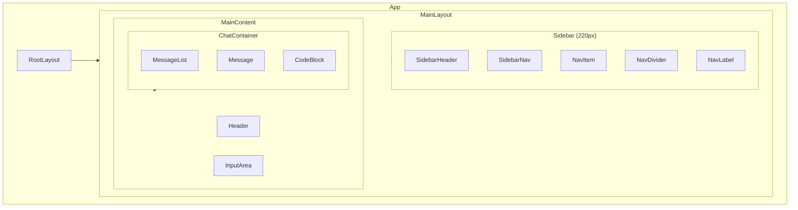
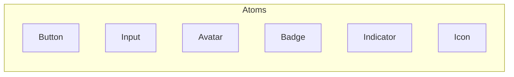
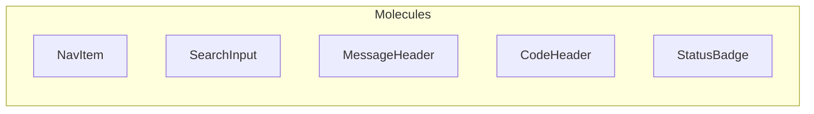
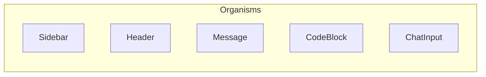
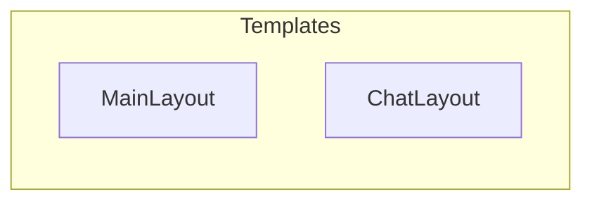
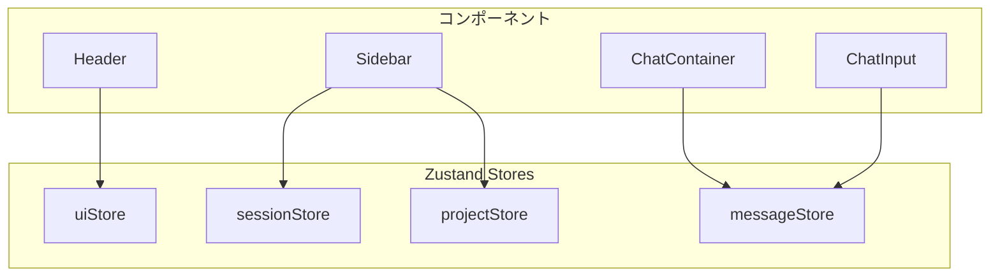
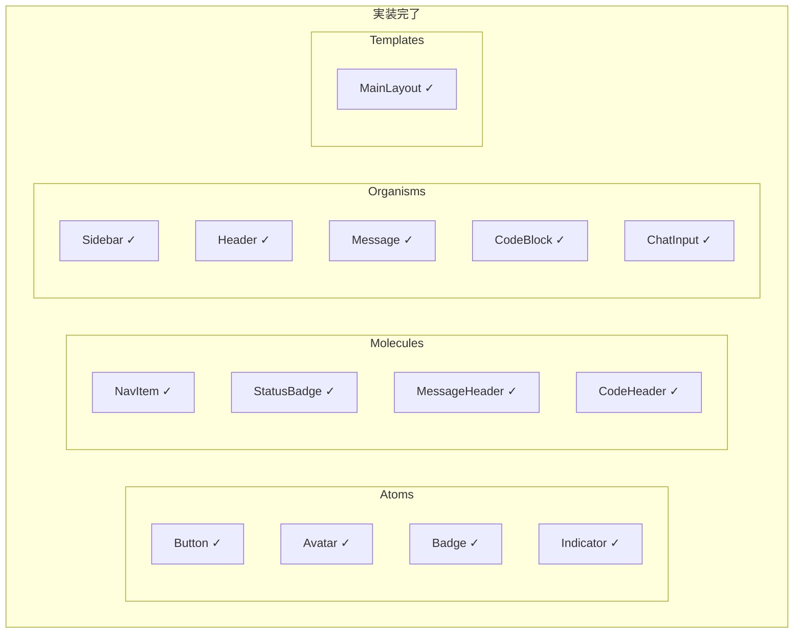

# フロントエンドコンポーネント設計書

## 概要

Claude Code Webのコンポーネント設計書です。Pattern 09 v2（Linear Style）に基づいて設計されています。

---

## 1. コンポーネント階層図



---

## 2. Atomicデザイン分類

### 2.1 Atoms（原子）

最小単位のUIコンポーネント



| コンポーネント | Props | 説明 |
|--------------|-------|------|
| `Button` | variant, size, disabled | ボタン |
| `Input` | placeholder, value, onChange | テキスト入力 |
| `Avatar` | name, variant | ユーザー/アシスタントアバター |
| `Badge` | children, variant | ステータスバッジ |
| `Indicator` | active, color | ドットインジケーター |

### 2.2 Molecules（分子）

Atomsを組み合わせた機能単位



| コンポーネント | 構成要素 | 説明 |
|--------------|---------|------|
| `NavItem` | Indicator + Text + Shortcut | ナビゲーション項目 |
| `SearchInput` | Input | 検索入力 |
| `MessageHeader` | Avatar + Name + Time | メッセージヘッダー |
| `CodeHeader` | LangDot + Filename + CopyButton | コードブロックヘッダー |
| `StatusBadge` | Indicator + Badge | ステータス表示 |

### 2.3 Organisms（有機体）

独立した機能を持つコンポーネント群



### 2.4 Templates（テンプレート）

ページレイアウトを定義



---

## 3. コンポーネント詳細仕様

### 3.1 Button

```typescript
interface ButtonProps {
  variant?: 'default' | 'primary' | 'ghost';
  size?: 'sm' | 'md' | 'lg';
  disabled?: boolean;
  children: React.ReactNode;
  onClick?: () => void;
}
```

**スタイル仕様:**

| Variant | 背景 | テキスト | ボーダー |
|---------|------|---------|---------|
| default | transparent | text-tertiary | none |
| primary | accent | white | none |
| ghost | transparent | text-secondary | border |

```css
/* default */
.btn-default {
  padding: 6px 12px;
  border-radius: 6px;
  background: transparent;
  color: var(--text-tertiary);
}

/* primary */
.btn-primary {
  background: var(--accent);
  color: white;
}

/* ghost */
.btn-ghost {
  border: 1px solid var(--border);
  background: var(--bg-tertiary);
  color: var(--text-primary);
}
```

---

### 3.2 Avatar

```typescript
interface AvatarProps {
  name: string;
  variant: 'user' | 'assistant';
  size?: 'sm' | 'md' | 'lg';
}
```

**スタイル仕様:**

| Variant | 背景 | サイズ(md) |
|---------|------|-----------|
| user | bg-tertiary | 28x28px |
| assistant | accent | 28x28px |

```css
.avatar {
  width: 28px;
  height: 28px;
  border-radius: 6px;
  display: flex;
  align-items: center;
  justify-content: center;
  font-size: 12px;
  font-weight: 600;
}

.avatar-user {
  background: var(--bg-tertiary);
  color: var(--text-secondary);
}

.avatar-assistant {
  background: var(--accent);
  color: white;
}
```

---

### 3.3 NavItem

```typescript
interface NavItemProps {
  label: string;
  active?: boolean;
  shortcut?: string;
  onClick?: () => void;
}
```

**構造:**

```jsx
<div className="nav-item">
  <span className="nav-indicator" />
  <span className="nav-label">{label}</span>
  {shortcut && <span className="nav-shortcut">{shortcut}</span>}
</div>
```

**スタイル仕様:**

```css
.nav-item {
  display: flex;
  align-items: center;
  gap: 10px;
  padding: 8px 10px;
  border-radius: 6px;
  color: var(--text-secondary);
  cursor: pointer;
  font-size: 13px;
  transition: all 0.1s ease;
}

.nav-item:hover {
  background: var(--bg-hover);
  color: var(--text-primary);
}

.nav-item.active {
  background: var(--bg-hover);
  color: var(--text-primary);
}

.nav-indicator {
  width: 6px;
  height: 6px;
  border-radius: 50%;
  background: var(--text-tertiary);
}

.nav-item.active .nav-indicator {
  background: var(--accent);
}

.nav-shortcut {
  margin-left: auto;
  font-size: 11px;
  color: var(--text-tertiary);
  background: var(--bg-tertiary);
  padding: 2px 6px;
  border-radius: 4px;
}
```

---

### 3.4 Message

```typescript
interface MessageProps {
  id: string;
  role: 'user' | 'assistant';
  content: string;
  timestamp: string;
  codeBlocks?: CodeBlockData[];
}
```

**構造:**

```jsx
<div className="message">
  <div className="message-header">
    <Avatar name={role === 'user' ? 'U' : 'C'} variant={role} />
    <div className="message-meta">
      <span className="message-role">{role === 'user' ? 'You' : 'Claude'}</span>
      <span className="message-time">{timestamp}</span>
    </div>
    <div className="message-actions">
      <Button variant="ghost" size="sm">Copy</Button>
    </div>
  </div>
  <div className="message-content">
    {content}
    {codeBlocks?.map(block => <CodeBlock key={block.id} {...block} />)}
  </div>
</div>
```

**スタイル仕様:**

```css
.message {
  margin-bottom: 20px;
  padding: 16px;
  border-radius: 8px;
  transition: background 0.1s ease;
}

.message:hover {
  background: var(--bg-secondary);
}

.message-header {
  display: flex;
  align-items: center;
  gap: 10px;
  margin-bottom: 8px;
}

.message-role {
  font-size: 13px;
  font-weight: 600;
  color: var(--text-primary);
}

.message-time {
  font-size: 12px;
  color: var(--text-tertiary);
}

.message-actions {
  margin-left: auto;
  opacity: 0;
  transition: opacity 0.1s ease;
}

.message:hover .message-actions {
  opacity: 1;
}

.message-content {
  color: var(--text-secondary);
  line-height: 1.6;
  font-size: 14px;
  padding-left: 38px;
}
```

---

### 3.5 CodeBlock

```typescript
interface CodeBlockProps {
  language: string;
  filename: string;
  code: string;
  onCopy?: () => void;
}
```

**構造:**

```jsx
<div className="code-block">
  <div className="code-header">
    <div className="code-lang">
      <span className="lang-dot" />
      <span className="code-filename">{filename}</span>
    </div>
    <Button variant="ghost" size="sm" onClick={onCopy}>Copy</Button>
  </div>
  <pre className="code-content">
    <code>{highlightedCode}</code>
  </pre>
</div>
```

**スタイル仕様:**

```css
.code-block {
  background: var(--bg-secondary);
  border: 1px solid var(--border-subtle);
  border-radius: 8px;
  margin: 12px 0;
  overflow: hidden;
}

.code-header {
  display: flex;
  justify-content: space-between;
  align-items: center;
  padding: 8px 12px;
  background: var(--bg-tertiary);
  border-bottom: 1px solid var(--border-subtle);
}

.code-lang {
  display: flex;
  align-items: center;
  gap: 8px;
}

.lang-dot {
  width: 8px;
  height: 8px;
  border-radius: 2px;
  background: var(--accent);
}

.code-filename {
  font-size: 12px;
  color: var(--text-tertiary);
  font-family: var(--font-mono);
}

.code-content {
  padding: 14px;
  font-family: var(--font-mono);
  font-size: 13px;
  line-height: 1.5;
  overflow-x: auto;
  color: var(--text-secondary);
}
```

---

### 3.6 ChatInput

```typescript
interface ChatInputProps {
  value: string;
  onChange: (value: string) => void;
  onSubmit: () => void;
  disabled?: boolean;
  placeholder?: string;
}
```

**構造:**

```jsx
<div className="input-area">
  <div className="input-wrapper">
    <textarea
      value={value}
      onChange={e => onChange(e.target.value)}
      placeholder={placeholder}
      rows={1}
    />
    <Button variant="primary" onClick={onSubmit} disabled={disabled}>
      ↑
    </Button>
  </div>
</div>
```

**スタイル仕様:**

```css
.input-area {
  padding: 16px 0;
}

.input-wrapper {
  display: flex;
  align-items: flex-end;
  gap: 10px;
  background: var(--bg-secondary);
  border: 1px solid var(--border);
  border-radius: 10px;
  padding: 12px 14px;
  transition: all 0.15s ease;
}

.input-wrapper:focus-within {
  border-color: var(--accent);
}

.input-wrapper textarea {
  flex: 1;
  background: transparent;
  border: none;
  color: var(--text-primary);
  font-size: 14px;
  font-family: inherit;
  resize: none;
  outline: none;
  min-height: 20px;
  max-height: 200px;
  line-height: 1.5;
}

.input-wrapper textarea::placeholder {
  color: var(--text-tertiary);
}

.send-btn {
  width: 32px;
  height: 32px;
  border-radius: 6px;
  background: var(--accent);
  border: none;
  color: white;
  cursor: pointer;
  display: flex;
  align-items: center;
  justify-content: center;
  font-size: 14px;
  transition: all 0.1s ease;
}

.send-btn:hover {
  background: var(--accent-hover);
}
```

---

### 3.7 Sidebar

```typescript
interface SidebarProps {
  projects: Project[];
  currentProjectId?: string;
  onProjectSelect: (id: string) => void;
}
```

**構造:**

```jsx
<aside className="sidebar">
  <div className="sidebar-header">
    <div className="logo-mark" />
    <span className="logo">Claude Code</span>
  </div>
  <div className="sidebar-content">
    <NavItem label="Inbox" shortcut="I" />
    <NavItem label="My Issues" shortcut="M" />
    <NavDivider />
    <NavLabel>Projects</NavLabel>
    {projects.map(project => (
      <NavItem
        key={project.id}
        label={project.name}
        active={project.id === currentProjectId}
        onClick={() => onProjectSelect(project.id)}
      />
    ))}
    <NavDivider />
    <NavItem label="Settings" />
  </div>
</aside>
```

**スタイル仕様:**

```css
.sidebar {
  width: 220px;
  background: var(--bg-secondary);
  border-right: 1px solid var(--border-subtle);
  display: flex;
  flex-direction: column;
}

.sidebar-header {
  padding: 16px;
  display: flex;
  align-items: center;
  gap: 8px;
  border-bottom: 1px solid var(--border-subtle);
}

.logo-mark {
  width: 20px;
  height: 20px;
  background: linear-gradient(135deg, var(--accent), #8b5cf6);
  border-radius: 5px;
}

.logo {
  font-weight: 600;
  font-size: 13px;
}

.sidebar-content {
  flex: 1;
  padding: 8px;
  overflow-y: auto;
}

.nav-divider {
  height: 1px;
  background: var(--border-subtle);
  margin: 8px 0;
}

.nav-label {
  font-size: 11px;
  font-weight: 500;
  color: var(--text-tertiary);
  padding: 8px 10px 4px;
  text-transform: uppercase;
  letter-spacing: 0.5px;
}
```

---

### 3.8 Header

```typescript
interface HeaderProps {
  title: string;
  status?: 'active' | 'idle';
}
```

**構造:**

```jsx
<header className="header">
  <div className="header-left">
    <span className="header-title">{title}</span>
    {status && <StatusBadge status={status} />}
  </div>
  <div className="header-actions">
    <Button variant="default">Search</Button>
    <Button variant="default">Settings</Button>
  </div>
</header>
```

**スタイル仕様:**

```css
.header {
  height: 48px;
  display: flex;
  align-items: center;
  justify-content: space-between;
  padding: 0 20px;
  border-bottom: 1px solid var(--border-subtle);
}

.header-left {
  display: flex;
  align-items: center;
  gap: 16px;
}

.header-title {
  font-size: 13px;
  font-weight: 500;
  color: var(--text-primary);
}

.status-badge {
  display: flex;
  align-items: center;
  gap: 6px;
  padding: 4px 10px;
  background: var(--accent-muted);
  border-radius: 12px;
  font-size: 12px;
  color: var(--accent);
}

.status-dot {
  width: 6px;
  height: 6px;
  border-radius: 50%;
  background: var(--accent);
}

.header-actions {
  display: flex;
  gap: 4px;
}
```

---

## 4. ファイル構成

```
src/
├── components/
│   ├── atoms/
│   │   ├── Button/
│   │   │   ├── Button.tsx
│   │   │   ├── Button.module.css
│   │   │   └── index.ts
│   │   ├── Avatar/
│   │   ├── Badge/
│   │   ├── Indicator/
│   │   └── Input/
│   │
│   ├── molecules/
│   │   ├── NavItem/
│   │   ├── SearchInput/
│   │   ├── MessageHeader/
│   │   ├── CodeHeader/
│   │   └── StatusBadge/
│   │
│   ├── organisms/
│   │   ├── Sidebar/
│   │   ├── Header/
│   │   ├── Message/
│   │   ├── CodeBlock/
│   │   └── ChatInput/
│   │
│   ├── templates/
│   │   ├── MainLayout/
│   │   └── ChatLayout/
│   │
│   └── index.ts
│
├── styles/
│   ├── themes/
│   │   └── linear.css
│   └── globals.css
│
└── app/
    ├── layout.tsx
    └── page.tsx
```

---

## 5. 状態管理との連携



---

## 6. 実装優先順位

| 優先度 | コンポーネント | 理由 |
|-------|--------------|------|
| P0 | Button, Avatar, Indicator | 他のすべてに依存 |
| P0 | NavItem, Message, CodeBlock | コア機能 |
| P1 | Sidebar, Header, ChatInput | レイアウト構成 |
| P1 | MainLayout | 全体統合 |
| P2 | SearchInput, StatusBadge | 補助機能 |

---

## 7. 実装ステータス

**ステータス: 全コンポーネント実装完了**

実装日: 2024年12月

### 7.1 実装済みコンポーネント一覧



### 7.2 実装ファイルパス

| レイヤー | コンポーネント | ファイルパス |
|---------|--------------|-------------|
| Atoms | Button | `src/frontend/src/components/atoms/Button/Button.tsx` |
| Atoms | Avatar | `src/frontend/src/components/atoms/Avatar/Avatar.tsx` |
| Atoms | Badge | `src/frontend/src/components/atoms/Badge/Badge.tsx` |
| Atoms | Indicator | `src/frontend/src/components/atoms/Indicator/Indicator.tsx` |
| Molecules | NavItem | `src/frontend/src/components/molecules/NavItem/NavItem.tsx` |
| Molecules | StatusBadge | `src/frontend/src/components/molecules/StatusBadge/StatusBadge.tsx` |
| Molecules | MessageHeader | `src/frontend/src/components/molecules/MessageHeader/MessageHeader.tsx` |
| Molecules | CodeHeader | `src/frontend/src/components/molecules/CodeHeader/CodeHeader.tsx` |
| Organisms | Sidebar | `src/frontend/src/components/organisms/Sidebar/Sidebar.tsx` |
| Organisms | Header | `src/frontend/src/components/organisms/Header/Header.tsx` |
| Organisms | Message | `src/frontend/src/components/organisms/Message/Message.tsx` |
| Organisms | CodeBlock | `src/frontend/src/components/organisms/CodeBlock/CodeBlock.tsx` |
| Organisms | ChatInput | `src/frontend/src/components/organisms/ChatInput/ChatInput.tsx` |
| Templates | MainLayout | `src/frontend/src/components/templates/MainLayout/MainLayout.tsx` |

### 7.3 エクスポート設定

各レイヤーにはインデックスファイルが設定されており、一括インポートが可能です:

| エクスポートファイル | パス |
|---------------------|------|
| Atoms | `src/frontend/src/components/atoms/index.ts` |
| Molecules | `src/frontend/src/components/molecules/index.ts` |
| Organisms | `src/frontend/src/components/organisms/index.ts` |
| Templates | `src/frontend/src/components/templates/index.ts` |
| 全体 | `src/frontend/src/components/index.ts` |

### 7.4 補足

- すべてのコンポーネントはTypeScriptで実装
- Props型定義は各コンポーネントファイル内に含まれる
- Tailwind CSSクラスを使用したスタイリング
- テーマCSS変数との連携により、テーマ切り替えに対応
