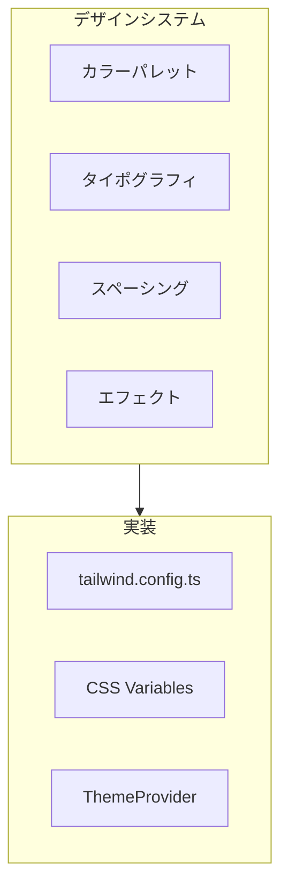
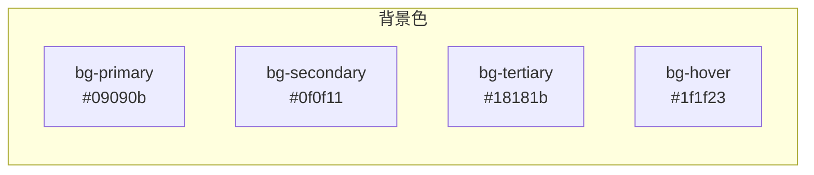
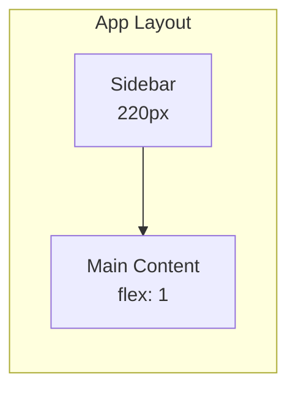
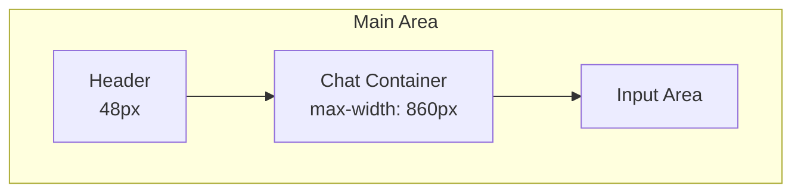

# フロントエンドデザインシステム設計書

## 目次

- [概要](#概要)
- [1. カラーパレット](#1-カラーパレット)
  - [1.1 ベースカラー](#11-ベースカラー)
  - [1.2 テキストカラー](#12-テキストカラー)
  - [1.3 アクセントカラー](#13-アクセントカラー)
  - [1.4 ボーダーカラー](#14-ボーダーカラー)
  - [1.5 シンタックスハイライト](#15-シンタックスハイライト)
- [2. タイポグラフィ](#2-タイポグラフィ)
  - [2.1 フォントファミリー](#21-フォントファミリー)
  - [2.2 フォントサイズ](#22-フォントサイズ)
  - [2.3 フォントウェイト](#23-フォントウェイト)
- [3. スペーシング](#3-スペーシング)
  - [3.1 基本単位](#31-基本単位)
  - [3.2 コンポーネント固有](#32-コンポーネント固有)
- [4. ボーダーとシャドウ](#4-ボーダーとシャドウ)
  - [4.1 ボーダー半径](#41-ボーダー半径)
  - [4.2 ボーダー幅](#42-ボーダー幅)
  - [4.3 シャドウ](#43-シャドウ)
- [5. アニメーション・トランジション](#5-アニメーショントランジション)
  - [5.1 トランジション](#51-トランジション)
  - [5.2 ホバー状態](#52-ホバー状態)
- [6. レイアウト](#6-レイアウト)
  - [6.1 全体構成](#61-全体構成)
  - [6.2 メインエリア構成](#62-メインエリア構成)
  - [6.3 レスポンシブブレークポイント](#63-レスポンシブブレークポイント)
- [7. CSS Variables定義](#7-css-variables定義)
- [8. アクセシビリティ](#8-アクセシビリティ)
  - [8.1 コントラスト比](#81-コントラスト比)
  - [8.2 フォーカス状態](#82-フォーカス状態)
  - [8.3 キーボードナビゲーション](#83-キーボードナビゲーション)
- [9. ダークモード対応](#9-ダークモード対応)
- [10. 実装ファイル](#10-実装ファイル)

---

## 概要

Pattern 09 v2（Linear Style - No Icons）をベースにした、Claude Code Webのデザインシステム設計書です。

> **実装ステータス: 完了**
>
> このデザインシステムは2024年12月に完全実装されました。すべてのカラーパレット、タイポグラフィ、スペーシング、エフェクトがTailwind CSSとCSS変数を通じて利用可能です。



---

## 1. カラーパレット

### 1.1 ベースカラー



| トークン名 | HEX値 | 用途 |
|-----------|-------|------|
| `--bg-primary` | `#09090b` | メインコンテンツ背景 |
| `--bg-secondary` | `#0f0f11` | サイドバー、入力エリア背景 |
| `--bg-tertiary` | `#18181b` | コードブロックヘッダー、バッジ |
| `--bg-hover` | `#1f1f23` | ホバー状態 |

### 1.2 テキストカラー

| トークン名 | HEX値 | 用途 |
|-----------|-------|------|
| `--text-primary` | `#fafafa` | 見出し、重要テキスト |
| `--text-secondary` | `#a1a1aa` | 本文、メッセージ内容 |
| `--text-tertiary` | `#52525b` | 補助テキスト、タイムスタンプ |

### 1.3 アクセントカラー

| トークン名 | HEX値 | 用途 |
|-----------|-------|------|
| `--accent` | `#5e5ce6` | プライマリアクション、アクティブ状態 |
| `--accent-hover` | `#6e6ce8` | ホバー状態 |
| `--accent-muted` | `rgba(94, 92, 230, 0.15)` | 背景ハイライト |

### 1.4 ボーダーカラー

| トークン名 | HEX値 | 用途 |
|-----------|-------|------|
| `--border` | `#27272a` | 標準ボーダー |
| `--border-subtle` | `#1c1c1e` | 薄いボーダー |

### 1.5 シンタックスハイライト

| トークン名 | HEX値 | 用途 |
|-----------|-------|------|
| `--syntax-keyword` | `#ff7b72` | キーワード（async, await, return） |
| `--syntax-function` | `#d2a8ff` | 関数名 |
| `--syntax-string` | `#a5d6ff` | 文字列 |
| `--syntax-comment` | `#8b949e` | コメント |

---

## 2. タイポグラフィ

### 2.1 フォントファミリー

```css
--font-sans: -apple-system, BlinkMacSystemFont, 'Segoe UI', sans-serif;
--font-mono: ui-monospace, 'SF Mono', 'JetBrains Mono', monospace;
```

### 2.2 フォントサイズ

| トークン | サイズ | 用途 |
|---------|-------|------|
| `text-xs` | 11px | ショートカット、バッジ |
| `text-sm` | 12px | 補助テキスト、タイムスタンプ |
| `text-base` | 13px | ナビゲーション、ボタン |
| `text-md` | 14px | メッセージ本文 |
| `text-lg` | 15px | ヘッダータイトル |

### 2.3 フォントウェイト

| トークン | 値 | 用途 |
|---------|---|------|
| `font-normal` | 400 | 本文 |
| `font-medium` | 500 | ラベル、タイトル |
| `font-semibold` | 600 | 見出し、ロゴ |

---

## 3. スペーシング

### 3.1 基本単位

基本単位: **4px**

| トークン | 値 | 用途 |
|---------|-----|------|
| `space-1` | 4px | 最小間隔 |
| `space-2` | 8px | アイコン間隔、インライン要素 |
| `space-3` | 12px | コンポーネント内部パディング |
| `space-4` | 16px | セクション間隔 |
| `space-5` | 20px | 大きなセクション間隔 |
| `space-6` | 24px | コンテナパディング |

### 3.2 コンポーネント固有

| コンポーネント | パディング | マージン |
|--------------|----------|---------|
| サイドバー | 8px | - |
| ナビアイテム | 8px 10px | 1px (bottom) |
| ヘッダー | 0 20px | - |
| メッセージ | 16px | 20px (bottom) |
| コードブロック | 14px | 12px (vertical) |
| 入力エリア | 12px 14px | - |

---

## 4. ボーダーとシャドウ

### 4.1 ボーダー半径

| トークン | 値 | 用途 |
|---------|-----|------|
| `rounded-sm` | 2px | インジケーター |
| `rounded` | 4px | 小さなボタン |
| `rounded-md` | 6px | ナビアイテム、ボタン |
| `rounded-lg` | 8px | コードブロック、メッセージ |
| `rounded-xl` | 10px | 入力エリア |
| `rounded-full` | 50% | ステータスドット |

### 4.2 ボーダー幅

- 標準: `1px solid var(--border)`
- サブトル: `1px solid var(--border-subtle)`

### 4.3 シャドウ

このデザインではシャドウを最小限に抑え、ボーダーで区切りを表現します。

---

## 5. アニメーション・トランジション

### 5.1 トランジション

| 用途 | 設定 |
|------|------|
| 標準 | `all 0.1s ease` |
| ゆっくり | `all 0.15s ease` |
| フォーカス | `border-color 0.15s ease` |

### 5.2 ホバー状態

```css
/* ナビアイテム */
.nav-item:hover {
  background: var(--bg-hover);
  color: var(--text-primary);
}

/* ボタン */
.btn:hover {
  background: var(--accent-hover);
}

/* メッセージ */
.message:hover {
  background: var(--bg-secondary);
}
```

---

## 6. レイアウト

### 6.1 全体構成



### 6.2 メインエリア構成



### 6.3 レスポンシブブレークポイント

| ブレークポイント | 幅 | 変更点 |
|----------------|-----|-------|
| `sm` | 640px | - |
| `md` | 768px | サイドバー表示 |
| `lg` | 1024px | エディタパネル表示 |
| `xl` | 1280px | - |

---

## 7. CSS Variables定義

```css
:root {
  /* Background */
  --bg-primary: #09090b;
  --bg-secondary: #0f0f11;
  --bg-tertiary: #18181b;
  --bg-hover: #1f1f23;

  /* Text */
  --text-primary: #fafafa;
  --text-secondary: #a1a1aa;
  --text-tertiary: #52525b;

  /* Accent */
  --accent: #5e5ce6;
  --accent-hover: #6e6ce8;
  --accent-muted: rgba(94, 92, 230, 0.15);

  /* Border */
  --border: #27272a;
  --border-subtle: #1c1c1e;

  /* Syntax Highlighting */
  --syntax-keyword: #ff7b72;
  --syntax-function: #d2a8ff;
  --syntax-string: #a5d6ff;
  --syntax-comment: #8b949e;

  /* Font */
  --font-sans: -apple-system, BlinkMacSystemFont, 'Segoe UI', sans-serif;
  --font-mono: ui-monospace, 'SF Mono', 'JetBrains Mono', monospace;

  /* Shadows */
  --shadow-sm: none;
  --shadow-md: none;
  --shadow-lg: none;
}
```

---

## 8. アクセシビリティ

### 8.1 コントラスト比

| 組み合わせ | コントラスト比 | 合否 |
|-----------|--------------|------|
| text-primary on bg-primary | 18.1:1 | WCAG AAA |
| text-secondary on bg-primary | 7.5:1 | WCAG AAA |
| text-tertiary on bg-primary | 4.6:1 | WCAG AA |
| accent on bg-primary | 5.2:1 | WCAG AA |

### 8.2 フォーカス状態

```css
*:focus-visible {
  outline: 2px solid var(--accent);
  outline-offset: 2px;
}
```

### 8.3 キーボードナビゲーション

- Tab: フォーカス移動
- Enter/Space: アクション実行
- Escape: モーダル/ドロップダウン閉じる
- ショートカットキー表示

---

## 9. ダークモード対応

このデザインシステムはダークテーマをデフォルトとしています。
将来的にライトモードを追加する場合は、CSS変数を切り替える方式で対応します。

```css
[data-theme="light"] {
  --bg-primary: #ffffff;
  --bg-secondary: #f8f9fa;
  /* ... */
}
```

---

## 10. 実装ファイル

**ステータス: 実装完了**

| ファイル | 実装パス | 状態 |
|---------|---------|------|
| Tailwind CSS設定 | `src/frontend/tailwind.config.ts` | 完了 |
| グローバルCSS | `src/frontend/src/app/globals.css` | 完了 |
| Linearテーマ | `src/frontend/src/styles/themes/linear.css` | 完了 |
| ダークテーマ | `src/frontend/src/styles/themes/dark.css` | 完了 |
| ライトテーマ | `src/frontend/src/styles/themes/light.css` | 完了 |
| Claudeテーマ | `src/frontend/src/styles/themes/claude.css` | 完了 |

### 実装詳細

**tailwind.config.ts**
- CSS変数ベースのカラー定義
- カスタムフォントサイズ（11px〜15px）
- カスタムスペーシング、幅、高さ
- カスタムボーダー半径
- カスタムアニメーション（fade-in, slide-in）
- レガシー互換性のための`primary`カラー定義

**globals.css**
- Tailwindベースレイヤーの設定
- 4つのテーマファイルのインポート
- コンポーネントクラス（`.btn`, `.nav-item`, `.message`, `.code-block`, `.input-wrapper`）
- フォーカス状態、スクロールバー、アクセシビリティスタイル
- Reduced motion対応
- High contrast mode対応

**linear.css（メインテーマ）**
- 背景色: `#09090b` 〜 `#1f1f23`
- テキスト色: `#fafafa`, `#a1a1aa`, `#52525b`
- アクセントカラー: `#5e5ce6`（インディゴ）
- シンタックスハイライトカラー
- レガシー変数マッピング（後方互換性）
