# フロントエンド実装詳細設計書

**プロジェクト:** Web版Claude Code
**作成日:** 2025-12-20
**最終更新:** 2025-12-29
**バージョン:** 1.3
**ステータス:** ✅ 完了（100%）
**技術スタック:** React 18 + Next.js 14 + TypeScript + TailwindCSS + code-server (VSCode Web) + Monaco Editor (フォールバック)
**関連ドキュメント:** [アーキテクチャ設計書](architecture-design.md), [コンポーネント設計書](frontend-component-design.md), [デザインシステム](frontend-design-system.md)

---

## 目次

1. [ディレクトリ構造](#1-ディレクトリ構造)
2. [コンポーネント設計](#2-コンポーネント設計)
3. [状態管理設計](#3-状態管理設計)
4. [WebSocket接続管理](#4-websocket接続管理)
5. [UIデザイン仕様](#5-uiデザイン仕様)
6. [型定義](#6-型定義)
7. [ルーティング設計](#7-ルーティング設計)
8. [パフォーマンス最適化](#8-パフォーマンス最適化)

---

## 1. ディレクトリ構造

```mermaid
graph TD
    Root[frontend/]

    Root --> Public[public/]
    Root --> Src[src/]
    Root --> Config[設定ファイル群]

    Public --> Icons[icons/]
    Public --> Fonts[fonts/]

    Icons --> FileIcons[file-icons/<br/>typescript.svg, python.svg<br/>javascript.svg, default.svg]
    Icons --> ToolIcons[tool-icons/<br/>read.svg, write.svg<br/>edit.svg, bash.svg]
    Icons --> ClaudeLogo[claude-logo.svg]

    Fonts --> Mono[mono/<br/>JetBrainsMono.woff2]

    Src --> App[app/]
    Src --> Components[components/]
    Src --> Hooks[hooks/]
    Src --> Stores[stores/]
    Src --> Lib[lib/]
    Src --> Types[types/]
    Src --> Styles[styles/]
    Src --> Tests[__tests__/]

    App --> AppFiles["layout.tsx<br/>page.tsx<br/>globals.css<br/>providers.tsx<br/>error.tsx"]

    Components --> Chat[chat/]
    Components --> Editor[editor/]
    Components --> Layout[layout/]
    Components --> Session[session/]
    Components --> Common[common/]
    Components --> Settings[settings/]

    Chat --> ChatFiles["ChatContainer.tsx<br/>MessageList.tsx<br/>MessageBubble.tsx<br/>MessageInput.tsx<br/>ToolUseCard.tsx<br/>ThinkingIndicator.tsx<br/>StreamingText.tsx<br/>CodeBlock.tsx"]

    Editor --> EditorFiles["CodeEditor.tsx<br/>EditorTabs.tsx<br/>FileTree.tsx<br/>FileTreeItem.tsx<br/>FileContextMenu.tsx<br/>DiffViewer.tsx<br/>SearchPanel.tsx"]

    Layout --> LayoutFiles["MainLayout.tsx<br/>Header.tsx<br/>Sidebar.tsx<br/>ResizablePanel.tsx<br/>StatusBar.tsx"]

    Components --> Project[project/]
    Project --> ProjectFiles["ProjectList.tsx<br/>ProjectCard.tsx<br/>ProjectHeader.tsx<br/>NewProjectButton.tsx<br/>ProjectContextMenu.tsx<br/>ProjectSessionTree.tsx"]

    Session --> SessionFiles["SessionList.tsx<br/>SessionCard.tsx<br/>NewSessionButton.tsx<br/>SessionContextMenu.tsx"]

    Common --> CommonFiles["Button.tsx<br/>IconButton.tsx<br/>Modal.tsx<br/>Tooltip.tsx<br/>Dropdown.tsx<br/>Loading.tsx<br/>ErrorBoundary.tsx<br/>Toast.tsx<br/>ConfirmDialog.tsx"]

    Settings --> SettingsFiles["SettingsModal.tsx<br/>ThemeSelector.tsx<br/>ModelSelector.tsx<br/>PermissionSettings.tsx"]

    Hooks --> HooksFiles["useWebSocket.ts<br/>useChat.ts<br/>useFiles.ts<br/>useProjects.ts<br/>useSessions.ts<br/>useEditor.ts<br/>useKeyboardShortcuts.ts<br/>useTheme.ts<br/>useToast.ts<br/>useLocalStorage.ts"]

    Stores --> StoresFiles["projectStore.ts<br/>chatStore.ts<br/>fileStore.ts<br/>sessionStore.ts<br/>editorStore.ts<br/>uiStore.ts<br/>settingsStore.ts"]

    Lib --> Api[api/]
    Lib --> WebSocket[websocket/]
    Lib --> Utils[utils/]
    Lib --> Constants[constants/]

    Api --> ApiFiles["client.ts<br/>projects.ts<br/>sessions.ts<br/>files.ts<br/>health.ts"]
    WebSocket --> WSFiles["client.ts<br/>messageParser.ts<br/>reconnection.ts"]
    Utils --> UtilsFiles["fileUtils.ts<br/>formatters.ts<br/>validators.ts<br/>debounce.ts<br/>clipboard.ts"]
    Constants --> ConstFiles["routes.ts<br/>themes.ts<br/>shortcuts.ts<br/>config.ts"]

    Types --> TypesFiles["message.ts<br/>project.ts<br/>session.ts<br/>file.ts<br/>websocket.ts<br/>api.ts<br/>index.ts"]

    Styles --> Themes[themes/]
    Styles --> StyleComponents[components/]

    Themes --> ThemeFiles["light.css<br/>dark.css<br/>claude.css"]
    StyleComponents --> StyleFiles["chat.css<br/>editor.css<br/>animations.css"]

    Tests --> TestDirs["components/<br/>hooks/<br/>stores/<br/>lib/"]

    Config --> ConfigFiles["package.json<br/>tsconfig.json<br/>next.config.js<br/>tailwind.config.ts<br/>postcss.config.js<br/>.eslintrc.json<br/>.prettierrc<br/>Dockerfile<br/>.dockerignore<br/>README.md"]

    style Root fill:#E8B088,stroke:#C17942,color:#2B2520
    style Src fill:#D89968,stroke:#A05F2E,color:#2B2520
    style Components fill:#F7F7F5,stroke:#E0DDD9,color:#2B2520
    style Chat fill:#EEEEEB,stroke:#C8C4BF,color:#2B2520
    style Editor fill:#EEEEEB,stroke:#C8C4BF,color:#2B2520
    style Layout fill:#EEEEEB,stroke:#C8C4BF,color:#2B2520
```



---

## 2. コンポーネント設計

### 2.1 ChatContainer.tsx

**責務:** チャットUIの全体レイアウトとメッセージフローの管理

```typescript
// src/components/chat/ChatContainer.tsx
import React, { useEffect, useRef } from 'react';
import { MessageList } from './MessageList';
import { MessageInput } from './MessageInput';
import { ThinkingIndicator } from './ThinkingIndicator';
import { useChatStore } from '@/stores/chatStore';
import { useWebSocket } from '@/hooks/useWebSocket';

interface ChatContainerProps {
  sessionId: string;
}

export const ChatContainer: React.FC<ChatContainerProps> = ({ sessionId }) => {
  const { messages, isStreaming, isThinking } = useChatStore();
  const { sendMessage, connectionStatus } = useWebSocket(sessionId);
  const containerRef = useRef<HTMLDivElement>(null);

  // 新しいメッセージが来たら自動スクロール
  useEffect(() => {
    if (containerRef.current) {
      containerRef.current.scrollTop = containerRef.current.scrollHeight;
    }
  }, [messages]);

  return (
    <div className="flex flex-col h-full bg-white dark:bg-gray-900">
      {/* ヘッダー */}
      <div className="flex items-center justify-between px-6 py-3 border-b border-gray-200 dark:border-gray-700">
        <h2 className="text-lg font-semibold text-gray-900 dark:text-white">
          Claude Code
        </h2>
        <div className="flex items-center gap-2">
          <ConnectionStatus status={connectionStatus} />
        </div>
      </div>

      {/* メッセージリスト */}
      <div
        ref={containerRef}
        className="flex-1 overflow-y-auto px-6 py-4"
      >
        <MessageList messages={messages} />
        {isThinking && <ThinkingIndicator />}
      </div>

      {/* 入力エリア */}
      <div className="border-t border-gray-200 dark:border-gray-700">
        <MessageInput
          onSend={sendMessage}
          disabled={isStreaming || connectionStatus !== 'connected'}
        />
      </div>
    </div>
  );
};
```

### 2.2 MessageBubble.tsx

**責務:** 個別メッセージの表示（テキスト、ツール使用、コードブロック）

```typescript
// src/components/chat/MessageBubble.tsx
import React from 'react';
import { Message, TextBlock, ToolUseBlock } from '@/types/message';
import { CodeBlock } from './CodeBlock';
import { ToolUseCard } from './ToolUseCard';
import { StreamingText } from './StreamingText';

interface MessageBubbleProps {
  message: Message;
  isStreaming?: boolean;
}

export const MessageBubble: React.FC<MessageBubbleProps> = ({
  message,
  isStreaming = false
}) => {
  const isUser = message.role === 'user';

  return (
    <div className={`flex ${isUser ? 'justify-end' : 'justify-start'} mb-4`}>
      <div className={`
        max-w-[80%] rounded-lg px-4 py-3
        ${isUser
          ? 'bg-blue-600 text-white'
          : 'bg-gray-100 dark:bg-gray-800 text-gray-900 dark:text-white'
        }
      `}>
        {/* アバター */}
        {!isUser && (
          <div className="flex items-center gap-2 mb-2">
            
            <span className="text-sm font-semibold">Claude</span>
          </div>
        )}

        {/* コンテンツ */}
        <div className="space-y-3">
          {message.content.map((block, index) => (
            <ContentBlock
              key={index}
              block={block}
              isStreaming={isStreaming && index === message.content.length - 1}
            />
          ))}
        </div>

        {/* タイムスタンプ */}
        <div className="text-xs opacity-70 mt-2">
          {new Date(message.timestamp).toLocaleTimeString()}
        </div>
      </div>
    </div>
  );
};

// コンテンツブロックのレンダリング
const ContentBlock: React.FC<{ block: any; isStreaming: boolean }> = ({
  block,
  isStreaming
}) => {
  if (block.type === 'text') {
    return isStreaming
      ? <StreamingText text={block.text} />
      : <div className="prose dark:prose-invert">{block.text}</div>;
  }

  if (block.type === 'tool_use') {
    return <ToolUseCard toolUse={block} />;
  }

  if (block.type === 'code') {
    return <CodeBlock code={block.code} language={block.language} />;
  }

  return null;
};
```

### 2.3 CodeServerEditor.tsx

**責務:** code-server (VSCode Web) をiframeで埋め込み、フルVSCode体験を提供

```typescript
// src/components/editor/CodeServerEditor.tsx
import React, { useState, useRef, useEffect } from 'react';
import { useEditorStore } from '@/stores/editorStore';

interface CodeServerEditorProps {
  workspacePath: string;
}

export const CodeServerEditor: React.FC<CodeServerEditorProps> = ({ workspacePath }) => {
  const iframeRef = useRef<HTMLIFrameElement>(null);
  const [isLoading, setIsLoading] = useState(true);
  const [hasError, setHasError] = useState(false);
  const { isFullscreen, setFullscreen } = useEditorStore();

  // code-server URL（環境変数から取得）
  const codeServerUrl = process.env.NEXT_PUBLIC_CODE_SERVER_URL || 'http://localhost:8080';
  const editorUrl = `${codeServerUrl}/?folder=${encodeURIComponent(workspacePath)}`;

  useEffect(() => {
    // code-serverの接続状態を監視
    const checkConnection = async () => {
      try {
        const response = await fetch(`${codeServerUrl}/healthz`, { mode: 'no-cors' });
        setHasError(false);
      } catch (error) {
        console.error('code-server connection failed:', error);
        setHasError(true);
      }
    };

    checkConnection();
    const interval = setInterval(checkConnection, 30000); // 30秒ごとにチェック

    return () => clearInterval(interval);
  }, [codeServerUrl]);

  const handleIframeLoad = () => {
    setIsLoading(false);
  };

  const handleIframeError = () => {
    setIsLoading(false);
    setHasError(true);
  };

  const handleReload = () => {
    if (iframeRef.current) {
      setIsLoading(true);
      setHasError(false);
      iframeRef.current.src = editorUrl;
    }
  };

  const handleOpenInNewTab = () => {
    window.open(editorUrl, '_blank');
  };

  const handleToggleFullscreen = () => {
    setFullscreen(!isFullscreen);
  };

  return (
    <div className={`relative h-full w-full ${isFullscreen ? 'fixed inset-0 z-50' : ''}`}>
      {/* ツールバー */}
      <div className="flex items-center justify-between px-3 py-2 bg-gray-100 dark:bg-gray-800 border-b">
        <div className="flex items-center gap-2">
          <span className="text-sm font-medium text-gray-700 dark:text-gray-300">
            VSCode Editor
          </span>
          {isLoading && (
            <span className="text-xs text-gray-500">読み込み中...</span>
          )}
        </div>
        <div className="flex items-center gap-1">
          <button
            onClick={handleReload}
            className="p-2 hover:bg-gray-200 dark:hover:bg-gray-700 rounded"
            title="再読み込み"
          >
            <RefreshIcon className="w-4 h-4" />
          </button>
          <button
            onClick={handleToggleFullscreen}
            className="p-2 hover:bg-gray-200 dark:hover:bg-gray-700 rounded"
            title={isFullscreen ? '元に戻す' : 'フルスクリーン'}
          >
            <FullscreenIcon className="w-4 h-4" />
          </button>
          <button
            onClick={handleOpenInNewTab}
            className="p-2 hover:bg-gray-200 dark:hover:bg-gray-700 rounded"
            title="新しいタブで開く"
          >
            <ExternalLinkIcon className="w-4 h-4" />
          </button>
        </div>
      </div>

      {/* エディタエリア */}
      <div className="relative h-[calc(100%-44px)]">
        {/* ローディングオーバーレイ */}
        {isLoading && (
          <div className="absolute inset-0 flex items-center justify-center bg-gray-50 dark:bg-gray-900 z-10">
            <div className="flex flex-col items-center gap-3">
              <div className="animate-spin rounded-full h-8 w-8 border-b-2 border-primary"></div>
              <span className="text-sm text-gray-600 dark:text-gray-400">
                VSCode を起動中...
              </span>
            </div>
          </div>
        )}

        {/* エラー表示 */}
        {hasError && !isLoading && (
          <div className="absolute inset-0 flex items-center justify-center bg-gray-50 dark:bg-gray-900 z-10">
            <div className="flex flex-col items-center gap-4 text-center p-6">
              <div className="text-red-500 text-4xl">⚠️</div>
              <h3 className="text-lg font-semibold text-gray-900 dark:text-white">
                VSCode に接続できません
              </h3>
              <p className="text-sm text-gray-600 dark:text-gray-400 max-w-md">
                code-server が起動していることを確認してください。
                問題が続く場合は、シンプルエディタモードをお試しください。
              </p>
              <div className="flex gap-3">
                <button
                  onClick={handleReload}
                  className="px-4 py-2 bg-primary text-white rounded hover:bg-primary-dark"
                >
                  再接続
                </button>
                <button
                  onClick={() => useEditorStore.getState().setEditorMode('simple')}
                  className="px-4 py-2 bg-gray-200 text-gray-900 rounded hover:bg-gray-300"
                >
                  シンプルエディタを使用
                </button>
              </div>
            </div>
          </div>
        )}

        {/* code-server iframe */}
        <iframe
          ref={iframeRef}
          src={editorUrl}
          className="w-full h-full border-0"
          onLoad={handleIframeLoad}
          onError={handleIframeError}
          allow="clipboard-read; clipboard-write"
          sandbox="allow-scripts allow-same-origin allow-forms allow-modals allow-popups"
        />
      </div>
    </div>
  );
};
```

### 2.4 EditorContainer.tsx

**責務:** code-serverとMonaco Editorの切り替え管理

```typescript
// src/components/editor/EditorContainer.tsx
import React from 'react';
import dynamic from 'next/dynamic';
import { useEditorStore } from '@/stores/editorStore';

// code-serverエディタを動的インポート
const CodeServerEditor = dynamic(
  () => import('./CodeServerEditor').then(mod => ({ default: mod.CodeServerEditor })),
  { ssr: false, loading: () => <EditorSkeleton /> }
);

// Monaco Editorを動的インポート（フォールバック用）
const MonacoEditor = dynamic(
  () => import('./MonacoEditor').then(mod => ({ default: mod.MonacoEditor })),
  { ssr: false, loading: () => <EditorSkeleton /> }
);

interface EditorContainerProps {
  workspacePath: string;
  filePath?: string;
}

export const EditorContainer: React.FC<EditorContainerProps> = ({
  workspacePath,
  filePath
}) => {
  const { editorMode, setEditorMode } = useEditorStore();

  return (
    <div className="h-full flex flex-col">
      {/* エディタモード切替タブ */}
      <div className="flex items-center border-b bg-gray-50 dark:bg-gray-900">
        <button
          onClick={() => setEditorMode('vscode')}
          className={`px-4 py-2 text-sm font-medium border-b-2 transition-colors ${
            editorMode === 'vscode'
              ? 'border-primary text-primary'
              : 'border-transparent text-gray-600 hover:text-gray-900'
          }`}
        >
          VSCode
        </button>
        <button
          onClick={() => setEditorMode('simple')}
          className={`px-4 py-2 text-sm font-medium border-b-2 transition-colors ${
            editorMode === 'simple'
              ? 'border-primary text-primary'
              : 'border-transparent text-gray-600 hover:text-gray-900'
          }`}
        >
          シンプル
        </button>
      </div>

      {/* エディタ本体 */}
      <div className="flex-1 overflow-hidden">
        {editorMode === 'vscode' ? (
          <CodeServerEditor workspacePath={workspacePath} />
        ) : (
          <div className="flex h-full">
            <FileTree />
            <div className="flex-1">
              {filePath && <MonacoEditor filePath={filePath} />}
            </div>
          </div>
        )}
      </div>
    </div>
  );
};

// ローディングスケルトン
const EditorSkeleton: React.FC = () => (
  <div className="h-full w-full flex items-center justify-center bg-gray-50 dark:bg-gray-900">
    <div className="animate-pulse space-y-4">
      <div className="h-4 w-48 bg-gray-200 dark:bg-gray-700 rounded"></div>
      <div className="h-4 w-64 bg-gray-200 dark:bg-gray-700 rounded"></div>
      <div className="h-4 w-56 bg-gray-200 dark:bg-gray-700 rounded"></div>
    </div>
  </div>
);
```

### 2.5 MonacoEditor.tsx（フォールバック用）

**責務:** Monaco Editorベースの軽量エディタ（code-server利用不可時のフォールバック）

```typescript
// src/components/editor/MonacoEditor.tsx
import React, { useRef, useEffect } from 'react';
import * as monaco from 'monaco-editor';
import { useEditorStore } from '@/stores/editorStore';
import { useFiles } from '@/hooks/useFiles';

interface MonacoEditorProps {
  filePath: string;
}

export const MonacoEditor: React.FC<MonacoEditorProps> = ({ filePath }) => {
  const editorRef = useRef<monaco.editor.IStandaloneCodeEditor | null>(null);
  const containerRef = useRef<HTMLDivElement>(null);
  const { getFileContent, updateFile } = useFiles();
  const { theme, fontSize } = useEditorStore();

  useEffect(() => {
    if (!containerRef.current) return;

    // Monaco Editor の初期化
    const editor = monaco.editor.create(containerRef.current, {
      value: getFileContent(filePath) || '',
      language: getLanguageFromPath(filePath),
      theme: theme === 'dark' ? 'vs-dark' : 'vs-light',
      fontSize,
      automaticLayout: true,
      minimap: { enabled: true },
      scrollBeyondLastLine: false,
      renderWhitespace: 'selection',
      tabSize: 2,
      insertSpaces: true,
      wordWrap: 'on',
    });

    editorRef.current = editor;

    // 変更イベントリスナー
    const disposable = editor.onDidChangeModelContent(() => {
      const value = editor.getValue();
      updateFile(filePath, value);
    });

    return () => {
      disposable.dispose();
      editor.dispose();
    };
  }, [filePath]);

  // テーマ変更
  useEffect(() => {
    if (editorRef.current) {
      monaco.editor.setTheme(theme === 'dark' ? 'vs-dark' : 'vs-light');
    }
  }, [theme]);

  return (
    <div className="h-full w-full relative">
      <div ref={containerRef} className="h-full w-full" />
    </div>
  );
};

// ファイルパスから言語を推測
function getLanguageFromPath(path: string): string {
  const ext = path.split('.').pop()?.toLowerCase();
  const languageMap: Record<string, string> = {
    'ts': 'typescript',
    'tsx': 'typescript',
    'js': 'javascript',
    'jsx': 'javascript',
    'py': 'python',
    'json': 'json',
    'md': 'markdown',
    'css': 'css',
    'html': 'html',
    'yml': 'yaml',
    'yaml': 'yaml',
  };
  return languageMap[ext || ''] || 'plaintext';
}
```

### 2.6 FileTree.tsx

**責務:** ファイルツリーの表示とナビゲーション

```typescript
// src/components/editor/FileTree.tsx
import React, { useState } from 'react';
import { FileTreeItem } from './FileTreeItem';
import { useFileStore } from '@/stores/fileStore';
import { FileNode } from '@/types/file';

export const FileTree: React.FC = () => {
  const { fileTree, selectedFile, setSelectedFile, refreshFiles } = useFileStore();
  const [expandedDirs, setExpandedDirs] = useState<Set<string>>(new Set(['/']));

  const toggleDir = (path: string) => {
    setExpandedDirs(prev => {
      const next = new Set(prev);
      if (next.has(path)) {
        next.delete(path);
      } else {
        next.add(path);
      }
      return next;
    });
  };

  const handleFileClick = (node: FileNode) => {
    if (node.type === 'file') {
      setSelectedFile(node.path);
    } else {
      toggleDir(node.path);
    }
  };

  return (
    <div className="h-full bg-gray-50 dark:bg-gray-900 border-r border-gray-200 dark:border-gray-700">
      {/* ヘッダー */}
      <div className="flex items-center justify-between px-3 py-2 border-b border-gray-200 dark:border-gray-700">
        <h3 className="text-sm font-semibold text-gray-700 dark:text-gray-300">
          FILES
        </h3>
        <button
          onClick={refreshFiles}
          className="p-1 hover:bg-gray-200 dark:hover:bg-gray-800 rounded"
          aria-label="Refresh files"
        >
          <RefreshIcon className="w-4 h-4" />
        </button>
      </div>

      {/* ツリー */}
      <div className="overflow-y-auto h-[calc(100%-40px)] p-2">
        {fileTree && (
          <FileTreeItem
            node={fileTree}
            level={0}
            isExpanded={expandedDirs.has(fileTree.path)}
            isSelected={selectedFile === fileTree.path}
            onToggle={toggleDir}
            onClick={handleFileClick}
          />
        )}
      </div>
    </div>
  );
};
```

### 2.7 MainLayout.tsx

**責務:** 3カラムレイアウトの管理（サイドバー、チャット、エディタ）

```typescript
// src/components/layout/MainLayout.tsx
import React from 'react';
import { Header } from './Header';
import { Sidebar } from './Sidebar';
import { ChatContainer } from '@/components/chat/ChatContainer';
import { CodeEditor } from '@/components/editor/CodeEditor';
import { FileTree } from '@/components/editor/FileTree';
import { ResizablePanel } from './ResizablePanel';
import { useUIStore } from '@/stores/uiStore';
import { useSessionStore } from '@/stores/sessionStore';

export const MainLayout: React.FC = () => {
  const {
    isSidebarOpen,
    isFileTreeOpen,
    chatWidth,
    setChatWidth
  } = useUIStore();
  const { currentSessionId } = useSessionStore();

  return (
    <div className="h-screen flex flex-col">
      {/* ヘッダー */}
      <Header />

      {/* メインコンテンツ */}
      <div className="flex-1 flex overflow-hidden">
        {/* サイドバー（セッション一覧） */}
        {isSidebarOpen && (
          <aside className="w-64 border-r border-gray-200 dark:border-gray-700">
            <Sidebar />
          </aside>
        )}

        {/* チャットエリア */}
        <ResizablePanel
          initialWidth={chatWidth}
          minWidth={400}
          maxWidth={800}
          onResize={setChatWidth}
        >
          {currentSessionId && (
            <ChatContainer sessionId={currentSessionId} />
          )}
        </ResizablePanel>

        {/* エディタエリア */}
        <div className="flex-1 flex overflow-hidden">
          {/* ファイルツリー */}
          {isFileTreeOpen && (
            <aside className="w-64">
              <FileTree />
            </aside>
          )}

          {/* コードエディタ */}
          <main className="flex-1">
            <CodeEditor filePath="/workspace/main.py" />
          </main>
        </div>
      </div>
    </div>
  );
};
```

---

## 3. 状態管理設計

### 3.1 chatStore.ts

**責務:** チャット状態の一元管理

```typescript
// src/stores/chatStore.ts
import { create } from 'zustand';
import { devtools, persist } from 'zustand/middleware';
import { Message, ToolUseBlock } from '@/types/message';

interface ChatState {
  // 状態
  messages: Message[];
  isStreaming: boolean;
  isThinking: boolean;
  currentStreamingMessage: string;
  toolUsages: ToolUseBlock[];

  // アクション
  addMessage: (message: Message) => void;
  updateStreamingMessage: (text: string) => void;
  addToolUsage: (toolUse: ToolUseBlock) => void;
  setStreaming: (isStreaming: boolean) => void;
  setThinking: (isThinking: boolean) => void;
  clearMessages: () => void;
}

export const useChatStore = create<ChatState>()(
  devtools(
    persist(
      (set) => ({
        // 初期状態
        messages: [],
        isStreaming: false,
        isThinking: false,
        currentStreamingMessage: '',
        toolUsages: [],

        // メッセージ追加
        addMessage: (message) =>
          set((state) => ({
            messages: [...state.messages, message]
          })),

        // ストリーミングメッセージ更新
        updateStreamingMessage: (text) =>
          set({ currentStreamingMessage: text }),

        // ツール使用追加
        addToolUsage: (toolUse) =>
          set((state) => ({
            toolUsages: [...state.toolUsages, toolUse]
          })),

        // ストリーミング状態
        setStreaming: (isStreaming) =>
          set({ isStreaming }),

        // 思考中状態
        setThinking: (isThinking) =>
          set({ isThinking }),

        // メッセージクリア
        clearMessages: () =>
          set({
            messages: [],
            currentStreamingMessage: '',
            toolUsages: []
          }),
      }),
      {
        name: 'chat-storage',
        partialize: (state) => ({ messages: state.messages }),
      }
    )
  )
);
```

### 3.2 fileStore.ts

**責務:** ファイルシステム状態の管理

```typescript
// src/stores/fileStore.ts
import { create } from 'zustand';
import { FileNode, FileContent } from '@/types/file';
import { apiClient } from '@/lib/api/client';

interface FileState {
  // 状態
  fileTree: FileNode | null;
  openFiles: Map<string, FileContent>;
  selectedFile: string | null;
  isDirty: Set<string>;

  // アクション
  setFileTree: (tree: FileNode) => void;
  setSelectedFile: (path: string) => void;
  openFile: (path: string, content: FileContent) => void;
  closeFile: (path: string) => void;
  updateFileContent: (path: string, content: string) => void;
  markDirty: (path: string) => void;
  markClean: (path: string) => void;
  saveFile: (path: string) => Promise<void>;
  refreshFiles: () => Promise<void>;
}

export const useFileStore = create<FileState>((set, get) => ({
  // 初期状態
  fileTree: null,
  openFiles: new Map(),
  selectedFile: null,
  isDirty: new Set(),

  // ファイルツリー設定
  setFileTree: (tree) => set({ fileTree: tree }),

  // ファイル選択
  setSelectedFile: (path) => set({ selectedFile: path }),

  // ファイルを開く
  openFile: (path, content) =>
    set((state) => {
      const newOpenFiles = new Map(state.openFiles);
      newOpenFiles.set(path, content);
      return { openFiles: newOpenFiles, selectedFile: path };
    }),

  // ファイルを閉じる
  closeFile: (path) =>
    set((state) => {
      const newOpenFiles = new Map(state.openFiles);
      newOpenFiles.delete(path);
      const newDirty = new Set(state.isDirty);
      newDirty.delete(path);
      return {
        openFiles: newOpenFiles,
        isDirty: newDirty,
        selectedFile: state.selectedFile === path ? null : state.selectedFile
      };
    }),

  // ファイル内容更新
  updateFileContent: (path, content) =>
    set((state) => {
      const newOpenFiles = new Map(state.openFiles);
      const file = newOpenFiles.get(path);
      if (file) {
        newOpenFiles.set(path, { ...file, content });
      }
      return { openFiles: newOpenFiles };
    }),

  // ダーティマーク
  markDirty: (path) =>
    set((state) => {
      const newDirty = new Set(state.isDirty);
      newDirty.add(path);
      return { isDirty: newDirty };
    }),

  // クリーンマーク
  markClean: (path) =>
    set((state) => {
      const newDirty = new Set(state.isDirty);
      newDirty.delete(path);
      return { isDirty: newDirty };
    }),

  // ファイル保存
  saveFile: async (path) => {
    const { openFiles } = get();
    const file = openFiles.get(path);
    if (!file) return;

    await apiClient.files.update(path, file.content);
    get().markClean(path);
  },

  // ファイルツリー更新
  refreshFiles: async () => {
    const tree = await apiClient.files.getTree();
    set({ fileTree: tree });
  },
}));
```

### 3.3 projectStore.ts

**責務:** プロジェクト管理（1プロジェクト:Nセッション）

```typescript
// src/stores/projectStore.ts
import { create } from 'zustand';
import { persist } from 'zustand/middleware';
import { Project } from '@/types/project';
import { apiClient } from '@/lib/api/client';

interface ProjectState {
  // 状態
  projects: Project[];
  currentProjectId: string | null;
  isLoading: boolean;
  error: string | null;

  // アクション
  loadProjects: () => Promise<void>;
  createProject: (name: string, description?: string) => Promise<Project>;
  updateProject: (projectId: string, name?: string, description?: string) => Promise<void>;
  deleteProject: (projectId: string) => Promise<void>;
  setCurrentProject: (projectId: string | null) => void;
  getCurrentProject: () => Project | undefined;
}

export const useProjectStore = create<ProjectState>()(
  persist(
    (set, get) => ({
      // 初期状態
      projects: [],
      currentProjectId: null,
      isLoading: false,
      error: null,

      // プロジェクト一覧読み込み
      loadProjects: async () => {
        set({ isLoading: true, error: null });
        try {
          const response = await apiClient.projects.list();
          set({ projects: response.projects, isLoading: false });
        } catch (error) {
          set({ error: 'Failed to load projects', isLoading: false });
        }
      },

      // 新規プロジェクト作成
      createProject: async (name, description) => {
        const project = await apiClient.projects.create({ name, description });
        set((state) => ({
          projects: [project, ...state.projects],
          currentProjectId: project.id
        }));
        return project;
      },

      // プロジェクト更新
      updateProject: async (projectId, name, description) => {
        await apiClient.projects.update(projectId, { name, description });
        set((state) => ({
          projects: state.projects.map(p =>
            p.id === projectId
              ? { ...p, name: name ?? p.name, description: description ?? p.description }
              : p
          )
        }));
      },

      // プロジェクト削除（配下のセッションも削除）
      deleteProject: async (projectId) => {
        await apiClient.projects.delete(projectId);
        set((state) => ({
          projects: state.projects.filter(p => p.id !== projectId),
          currentProjectId: state.currentProjectId === projectId
            ? null
            : state.currentProjectId
        }));
      },

      // 現在のプロジェクト設定
      setCurrentProject: (projectId) =>
        set({ currentProjectId: projectId }),

      // 現在のプロジェクト取得
      getCurrentProject: () => {
        const { projects, currentProjectId } = get();
        return projects.find(p => p.id === currentProjectId);
      },
    }),
    {
      name: 'project-storage',
      partialize: (state) => ({
        currentProjectId: state.currentProjectId
      }),
    }
  )
);
```

---

### 3.4 sessionStore.ts

**責務:** セッション管理（プロジェクト配下）

```typescript
// src/stores/sessionStore.ts
import { create } from 'zustand';
import { persist } from 'zustand/middleware';
import { Session } from '@/types/session';
import { apiClient } from '@/lib/api/client';
import { useProjectStore } from './projectStore';

interface SessionState {
  // 状態
  sessions: Session[];  // 現在のプロジェクトのセッション一覧
  currentSessionId: string | null;
  isLoading: boolean;

  // アクション
  loadSessions: (projectId: string) => Promise<void>;
  createSession: (projectId: string, title?: string) => Promise<Session>;
  deleteSession: (projectId: string, sessionId: string) => Promise<void>;
  setCurrentSession: (sessionId: string | null) => void;
  updateSessionTitle: (projectId: string, sessionId: string, title: string) => void;
  clearSessions: () => void;
}

export const useSessionStore = create<SessionState>()(
  persist(
    (set, get) => ({
      // 初期状態
      sessions: [],
      currentSessionId: null,
      isLoading: false,

      // セッション一覧読み込み（プロジェクト配下）
      loadSessions: async (projectId) => {
        set({ isLoading: true });
        const response = await apiClient.projects.getSessions(projectId);
        set({ sessions: response.sessions, isLoading: false });
      },

      // 新規セッション作成（プロジェクト配下）
      createSession: async (projectId, title) => {
        const session = await apiClient.projects.createSession(projectId, { title });
        set((state) => ({
          sessions: [session, ...state.sessions],
          currentSessionId: session.id
        }));
        return session;
      },

      // セッション削除
      deleteSession: async (projectId, sessionId) => {
        await apiClient.projects.deleteSession(projectId, sessionId);
        set((state) => ({
          sessions: state.sessions.filter(s => s.id !== sessionId),
          currentSessionId: state.currentSessionId === sessionId
            ? null
            : state.currentSessionId
        }));
      },

      // 現在のセッション設定
      setCurrentSession: (sessionId) =>
        set({ currentSessionId: sessionId }),

      // セッションタイトル更新
      updateSessionTitle: (projectId, sessionId, title) =>
        set((state) => ({
          sessions: state.sessions.map(s =>
            s.id === sessionId ? { ...s, title } : s
          )
        })),

      // セッションクリア（プロジェクト切替時）
      clearSessions: () =>
        set({ sessions: [], currentSessionId: null }),
    }),
    {
      name: 'session-storage',
      partialize: (state) => ({
        currentSessionId: state.currentSessionId
      }),
    }
  )
);
```

---

### 3.5 uiStore.ts

**責務:** UI状態の管理（レイアウト、テーマなど）

```typescript
// src/stores/uiStore.ts
import { create } from 'zustand';
import { persist } from 'zustand/middleware';

type Theme = 'light' | 'dark' | 'claude';

interface UIState {
  // 状態
  theme: Theme;
  isSidebarOpen: boolean;
  isFileTreeOpen: boolean;
  chatWidth: number;
  fontSize: number;

  // アクション
  setTheme: (theme: Theme) => void;
  toggleSidebar: () => void;
  toggleFileTree: () => void;
  setChatWidth: (width: number) => void;
  setFontSize: (size: number) => void;
}

export const useUIStore = create<UIState>()(
  persist(
    (set) => ({
      // 初期状態
      theme: 'claude',
      isSidebarOpen: true,
      isFileTreeOpen: true,
      chatWidth: 600,
      fontSize: 14,

      // テーマ変更
      setTheme: (theme) => {
        set({ theme });
        document.documentElement.setAttribute('data-theme', theme);
      },

      // サイドバートグル
      toggleSidebar: () =>
        set((state) => ({ isSidebarOpen: !state.isSidebarOpen })),

      // ファイルツリートグル
      toggleFileTree: () =>
        set((state) => ({ isFileTreeOpen: !state.isFileTreeOpen })),

      // チャット幅設定
      setChatWidth: (width) =>
        set({ chatWidth: Math.max(400, Math.min(800, width)) }),

      // フォントサイズ設定
      setFontSize: (size) =>
        set({ fontSize: Math.max(10, Math.min(24, size)) }),
    }),
    {
      name: 'ui-storage',
    }
  )
);
```

---

## 4. WebSocket接続管理

### 4.1 useWebSocket.ts

**責務:** WebSocket接続の管理と再接続ロジック

```typescript
// src/hooks/useWebSocket.ts
import { useEffect, useRef, useCallback, useState } from 'react';
import { useChatStore } from '@/stores/chatStore';
import { WebSocketMessage, WSClientMessage, WSServerMessage } from '@/types/websocket';

type ConnectionStatus = 'connecting' | 'connected' | 'disconnected' | 'error';

export const useWebSocket = (sessionId: string) => {
  const wsRef = useRef<WebSocket | null>(null);
  const [connectionStatus, setConnectionStatus] = useState<ConnectionStatus>('disconnected');
  const reconnectTimeoutRef = useRef<NodeJS.Timeout>();
  const reconnectAttemptsRef = useRef(0);

  const {
    addMessage,
    updateStreamingMessage,
    addToolUsage,
    setStreaming,
    setThinking
  } = useChatStore();

  // メッセージ送信
  const sendMessage = useCallback((content: string, files?: any[]) => {
    if (wsRef.current?.readyState === WebSocket.OPEN) {
      const message: WSClientMessage = {
        type: 'chat',
        content,
        files
      };
      wsRef.current.send(JSON.stringify(message));
      setStreaming(true);
    }
  }, [setStreaming]);

  // 中断
  const interrupt = useCallback(() => {
    if (wsRef.current?.readyState === WebSocket.OPEN) {
      wsRef.current.send(JSON.stringify({ type: 'interrupt' }));
    }
  }, []);

  // WebSocket接続
  const connect = useCallback(() => {
    if (wsRef.current?.readyState === WebSocket.OPEN) return;

    setConnectionStatus('connecting');

    const wsUrl = `${process.env.NEXT_PUBLIC_WS_URL}/ws/chat/${sessionId}`;
    const ws = new WebSocket(wsUrl);

    ws.onopen = () => {
      console.log('[WebSocket] Connected');
      setConnectionStatus('connected');
      reconnectAttemptsRef.current = 0;
    };

    ws.onmessage = (event) => {
      try {
        const message: WSServerMessage = JSON.parse(event.data);
        handleServerMessage(message);
      } catch (error) {
        console.error('[WebSocket] Parse error:', error);
      }
    };

    ws.onerror = (error) => {
      console.error('[WebSocket] Error:', error);
      setConnectionStatus('error');
    };

    ws.onclose = () => {
      console.log('[WebSocket] Disconnected');
      setConnectionStatus('disconnected');

      // 自動再接続（最大5回）
      if (reconnectAttemptsRef.current < 5) {
        const delay = Math.min(1000 * Math.pow(2, reconnectAttemptsRef.current), 30000);
        reconnectTimeoutRef.current = setTimeout(() => {
          reconnectAttemptsRef.current++;
          connect();
        }, delay);
      }
    };

    wsRef.current = ws;
  }, [sessionId]);

  // サーバーメッセージ処理
  const handleServerMessage = (message: WSServerMessage) => {
    switch (message.type) {
      case 'text':
        updateStreamingMessage(message.content);
        break;

      case 'tool_use':
        addToolUsage({
          type: 'tool_use',
          id: crypto.randomUUID(),
          name: message.tool,
          input: message.input
        });
        break;

      case 'tool_result':
        // ツール結果を表示
        console.log('[Tool Result]', message);
        break;

      case 'result':
        // 完了
        setStreaming(false);
        setThinking(false);
        console.log('[Result]', {
          cost: message.cost,
          usage: message.usage
        });
        break;

      case 'error':
        setStreaming(false);
        setThinking(false);
        console.error('[Error]', message.message);
        break;

      case 'thinking':
        setThinking(true);
        break;
    }
  };

  // 接続開始
  useEffect(() => {
    connect();

    return () => {
      if (reconnectTimeoutRef.current) {
        clearTimeout(reconnectTimeoutRef.current);
      }
      if (wsRef.current) {
        wsRef.current.close();
      }
    };
  }, [connect]);

  return {
    sendMessage,
    interrupt,
    connectionStatus,
    reconnect: connect
  };
};
```

### 4.2 WebSocketクライアント

```typescript
// src/lib/websocket/client.ts
export class WebSocketClient {
  private ws: WebSocket | null = null;
  private reconnectAttempts = 0;
  private maxReconnectAttempts = 5;
  private reconnectDelay = 1000;

  constructor(
    private url: string,
    private onMessage: (message: any) => void,
    private onStatusChange: (status: ConnectionStatus) => void
  ) {}

  connect() {
    this.ws = new WebSocket(this.url);

    this.ws.onopen = () => {
      this.onStatusChange('connected');
      this.reconnectAttempts = 0;
    };

    this.ws.onmessage = (event) => {
      try {
        const message = JSON.parse(event.data);
        this.onMessage(message);
      } catch (error) {
        console.error('WebSocket parse error:', error);
      }
    };

    this.ws.onerror = () => {
      this.onStatusChange('error');
    };

    this.ws.onclose = () => {
      this.onStatusChange('disconnected');
      this.attemptReconnect();
    };
  }

  send(message: any) {
    if (this.ws?.readyState === WebSocket.OPEN) {
      this.ws.send(JSON.stringify(message));
    }
  }

  disconnect() {
    this.ws?.close();
  }

  private attemptReconnect() {
    if (this.reconnectAttempts >= this.maxReconnectAttempts) {
      console.error('Max reconnect attempts reached');
      return;
    }

    const delay = Math.min(
      this.reconnectDelay * Math.pow(2, this.reconnectAttempts),
      30000
    );

    setTimeout(() => {
      this.reconnectAttempts++;
      this.onStatusChange('connecting');
      this.connect();
    }, delay);
  }
}
```

---

## 5. UIデザイン仕様

### 5.1 カラースキーム

#### Claude テーマ (デフォルト)

```css
/* src/styles/themes/claude.css */
:root[data-theme='claude'] {
  /* プライマリカラー */
  --color-primary: #C17942;
  --color-primary-light: #D89968;
  --color-primary-dark: #A05F2E;

  /* 背景 */
  --color-bg-primary: #FFFFFF;
  --color-bg-secondary: #F7F7F5;
  --color-bg-tertiary: #EEEEEB;

  /* テキスト */
  --color-text-primary: #2B2520;
  --color-text-secondary: #6B6662;
  --color-text-tertiary: #9E9A96;

  /* ボーダー */
  --color-border: #E0DDD9;
  --color-border-hover: #C8C4BF;

  /* アクセント */
  --color-accent-blue: #4A90E2;
  --color-accent-green: #7CB342;
  --color-accent-red: #E74C3C;
  --color-accent-yellow: #F39C12;

  /* シャドウ */
  --shadow-sm: 0 1px 2px 0 rgba(0, 0, 0, 0.05);
  --shadow-md: 0 4px 6px -1px rgba(0, 0, 0, 0.1);
  --shadow-lg: 0 10px 15px -3px rgba(0, 0, 0, 0.1);

  /* フォント */
  --font-sans: -apple-system, BlinkMacSystemFont, 'Segoe UI', Roboto, sans-serif;
  --font-mono: 'JetBrains Mono', 'Fira Code', Consolas, monospace;
}
```

#### ダークテーマ

```css
/* src/styles/themes/dark.css */
:root[data-theme='dark'] {
  /* プライマリカラー */
  --color-primary: #D89968;
  --color-primary-light: #E8B088;
  --color-primary-dark: #C17942;

  /* 背景 */
  --color-bg-primary: #1A1A1A;
  --color-bg-secondary: #242424;
  --color-bg-tertiary: #2E2E2E;

  /* テキスト */
  --color-text-primary: #E5E5E5;
  --color-text-secondary: #B3B3B3;
  --color-text-tertiary: #808080;

  /* ボーダー */
  --color-border: #3A3A3A;
  --color-border-hover: #4A4A4A;

  /* アクセント */
  --color-accent-blue: #5AA4E8;
  --color-accent-green: #8BC34A;
  --color-accent-red: #EF5350;
  --color-accent-yellow: #FFA726;

  /* シャドウ */
  --shadow-sm: 0 1px 2px 0 rgba(0, 0, 0, 0.3);
  --shadow-md: 0 4px 6px -1px rgba(0, 0, 0, 0.4);
  --shadow-lg: 0 10px 15px -3px rgba(0, 0, 0, 0.5);
}
```

### 5.2 レイアウト仕様

```mermaid
flowchart TD
    subgraph Main["メインレイアウト構造"]
        Header["Header (h: 48px)"]

        subgraph Content["コンテンツエリア (flex-1)"]
            direction LR

            subgraph Sidebar["Sidebar (w: 256px)"]
                SL1[Session List]
                SL2[+ New Session]
                SL3[Recent:<br/>• Chat 1<br/>• Chat 2]
            end

            subgraph Chat["Chat Container (w: 400-800px)"]
                direction TB
                ML[Message List<br/>━━━━━━━━━━<br/>- User Message<br/>- Claude Reply<br/>- Tool Usage<br/>- Streaming...]
                MI[Message Input<br/>Type here...]
                CS[Status: Connected ●]
                ML --> MI
                MI --> CS
            end

            subgraph Editor["Editor Area (flex: 1)"]
                direction LR
                subgraph FT["File Tree"]
                    FT1[ファイルツリー]
                end
                subgraph CE["Code Editor (Monaco)"]
                    CE1["1  const x =<br/>2<br/>3"]
                    CE2[Tabs: file1.py]
                    CE1 --> CE2
                end
                FT --> CE
                ES[Status: UTF-8 | Python | Ln 1]
            end

            Sidebar --> Chat
            Chat --> Editor
        end

        Header --> Content
    end

    style Header fill:#E8B088,stroke:#C17942,color:#2B2520
    style Sidebar fill:#F7F7F5,stroke:#E0DDD9,color:#2B2520
    style Chat fill:#F7F7F5,stroke:#E0DDD9,color:#2B2520
    style Editor fill:#F7F7F5,stroke:#E0DDD9,color:#2B2520
    style FT fill:#EEEEEB,stroke:#C8C4BF,color:#2B2520
    style CE fill:#FFFFFF,stroke:#E0DDD9,color:#2B2520
```

### 5.3 コンポーネントスタイル

#### ボタン

```typescript
// src/components/common/Button.tsx
type ButtonVariant = 'primary' | 'secondary' | 'ghost' | 'danger';
type ButtonSize = 'sm' | 'md' | 'lg';

const buttonStyles = {
  base: 'inline-flex items-center justify-center font-medium rounded-lg transition-colors focus:outline-none focus:ring-2 focus:ring-offset-2',

  variants: {
    primary: 'bg-primary text-white hover:bg-primary-dark focus:ring-primary',
    secondary: 'bg-gray-200 text-gray-900 hover:bg-gray-300 focus:ring-gray-500 dark:bg-gray-700 dark:text-white dark:hover:bg-gray-600',
    ghost: 'text-gray-700 hover:bg-gray-100 dark:text-gray-300 dark:hover:bg-gray-800',
    danger: 'bg-red-600 text-white hover:bg-red-700 focus:ring-red-500',
  },

  sizes: {
    sm: 'px-3 py-1.5 text-sm',
    md: 'px-4 py-2 text-base',
    lg: 'px-6 py-3 text-lg',
  }
};
```

#### メッセージバブル

```css
/* src/styles/components/chat.css */
.message-bubble {
  @apply rounded-lg px-4 py-3 max-w-[80%] shadow-sm;
}

.message-bubble.user {
  @apply bg-blue-600 text-white ml-auto;
}

.message-bubble.assistant {
  @apply bg-gray-100 text-gray-900 dark:bg-gray-800 dark:text-white;
}

.message-bubble.streaming {
  @apply animate-pulse;
}

@keyframes pulse {
  0%, 100% { opacity: 1; }
  50% { opacity: 0.7; }
}
```

---

## 6. 型定義

### 6.1 message.ts

```typescript
// src/types/message.ts
export type MessageRole = 'user' | 'assistant' | 'system';

export interface TextBlock {
  type: 'text';
  text: string;
}

export interface ThinkingBlock {
  type: 'thinking';
  content: string;
}

export interface ToolUseBlock {
  type: 'tool_use';
  id: string;
  name: string;
  input: Record<string, any>;
}

export interface ToolResultBlock {
  type: 'tool_result';
  tool_use_id: string;
  content: string;
  is_error?: boolean;
}

export type ContentBlock = TextBlock | ThinkingBlock | ToolUseBlock | ToolResultBlock;

export interface Message {
  id: string;
  role: MessageRole;
  content: ContentBlock[];
  timestamp: string;
}

export interface StreamingMessage extends Message {
  isComplete: boolean;
}
```

### 6.2 websocket.ts

```typescript
// src/types/websocket.ts
export type ConnectionStatus = 'connecting' | 'connected' | 'disconnected' | 'error';

// クライアント -> サーバー
export interface WSChatMessage {
  type: 'chat';
  content: string;
  files?: Array<{
    path: string;
    content: string;
  }>;
}

export interface WSInterruptMessage {
  type: 'interrupt';
}

export type WSClientMessage = WSChatMessage | WSInterruptMessage;

// サーバー -> クライアント
export interface WSTextMessage {
  type: 'text';
  content: string;
}

export interface WSToolUseMessage {
  type: 'tool_use';
  tool: string;
  input: Record<string, any>;
}

export interface WSToolResultMessage {
  type: 'tool_result';
  tool_use_id: string;
  success: boolean;
  output: string;
}

export interface WSResultMessage {
  type: 'result';
  cost: number;
  usage: {
    input_tokens: number;
    output_tokens: number;
  };
}

export interface WSErrorMessage {
  type: 'error';
  message: string;
}

export interface WSThinkingMessage {
  type: 'thinking';
}

export type WSServerMessage =
  | WSTextMessage
  | WSToolUseMessage
  | WSToolResultMessage
  | WSResultMessage
  | WSErrorMessage
  | WSThinkingMessage;
```

### 6.3 file.ts

```typescript
// src/types/file.ts
export interface FileNode {
  name: string;
  path: string;
  type: 'file' | 'directory';
  children?: FileNode[];
  size?: number;
  modified?: string;
}

export interface FileContent {
  path: string;
  content: string;
  language: string;
  encoding: string;
}

export interface FileDiff {
  path: string;
  oldContent: string;
  newContent: string;
  additions: number;
  deletions: number;
}
```

### 6.4 project.ts

```typescript
// src/types/project.ts
export interface Project {
  id: string;
  name: string;
  description?: string;
  created_at: string;
  updated_at: string;
  session_count: number;
  workspace_path: string;
}

export interface ProjectWithSessions extends Project {
  sessions: Session[];
}

export interface CreateProjectRequest {
  name: string;
  description?: string;
}

export interface UpdateProjectRequest {
  name?: string;
  description?: string;
}
```

---

### 6.5 session.ts

```typescript
// src/types/session.ts
export interface Session {
  id: string;
  project_id: string;  // プロジェクト参照
  title: string;
  status: 'active' | 'expired' | 'terminated';
  created_at: string;
  updated_at: string;
  expires_at: string;
  message_count: number;
  model: string;
  workspace_path: string;
}

export interface SessionHistory {
  session_id: string;
  project_id: string;
  messages: Message[];
  total_cost: number;
  total_tokens: {
    input: number;
    output: number;
  };
}

export interface CreateSessionRequest {
  title?: string;
  options?: {
    model?: string;
    max_turns?: number;
  };
  sandbox_config?: {
    allowed_tools?: string[];
    permission_mode?: string;
  };
}
```

---

## 7. ルーティング設計

### 7.1 App Router構造

```typescript
// src/app/layout.tsx
import { Providers } from './providers';
import './globals.css';

export const metadata = {
  title: 'Claude Code - Web Edition',
  description: 'Web-based coding assistant powered by Claude',
};

export default function RootLayout({ children }: { children: React.ReactNode }) {
  return (
    <html lang="ja" suppressHydrationWarning>
      <body>
        <Providers>
          {children}
        </Providers>
      </body>
    </html>
  );
}
```

```typescript
// src/app/page.tsx
import { MainLayout } from '@/components/layout/MainLayout';

export default function HomePage() {
  return <MainLayout />;
}
```

```typescript
// src/app/providers.tsx
'use client';

import { useEffect } from 'react';
import { useUIStore } from '@/stores/uiStore';
import { useSessionStore } from '@/stores/sessionStore';

export function Providers({ children }: { children: React.ReactNode }) {
  const { theme } = useUIStore();
  const { loadSessions } = useSessionStore();

  useEffect(() => {
    // テーマ適用
    document.documentElement.setAttribute('data-theme', theme);

    // セッション読み込み
    loadSessions();
  }, [theme, loadSessions]);

  return <>{children}</>;
}
```

---

## 8. パフォーマンス最適化

### 8.1 仮想スクロール

```typescript
// src/components/chat/MessageList.tsx
import { useVirtualizer } from '@tanstack/react-virtual';

export const MessageList: React.FC<{ messages: Message[] }> = ({ messages }) => {
  const parentRef = useRef<HTMLDivElement>(null);

  const virtualizer = useVirtualizer({
    count: messages.length,
    getScrollElement: () => parentRef.current,
    estimateSize: () => 100,
    overscan: 5,
  });

  return (
    <div ref={parentRef} className="h-full overflow-auto">
      <div
        style={{
          height: `${virtualizer.getTotalSize()}px`,
          width: '100%',
          position: 'relative',
        }}
      >
        {virtualizer.getVirtualItems().map((virtualItem) => (
          <div
            key={virtualItem.key}
            style={{
              position: 'absolute',
              top: 0,
              left: 0,
              width: '100%',
              transform: `translateY(${virtualItem.start}px)`,
            }}
          >
            <MessageBubble message={messages[virtualItem.index]} />
          </div>
        ))}
      </div>
    </div>
  );
};
```

### 8.2 コード分割

```typescript
// src/components/editor/CodeEditor.tsx
import dynamic from 'next/dynamic';

// Monaco Editorを動的インポート（SSR回避）
const MonacoEditor = dynamic(
  () => import('@monaco-editor/react'),
  {
    ssr: false,
    loading: () => <div>Loading editor...</div>
  }
);
```

### 8.3 メモ化

```typescript
// src/components/chat/MessageBubble.tsx
import { memo } from 'react';

export const MessageBubble = memo<MessageBubbleProps>(({ message }) => {
  // レンダリングロジック
}, (prevProps, nextProps) => {
  return prevProps.message.id === nextProps.message.id &&
         prevProps.isStreaming === nextProps.isStreaming;
});
```

### 8.4 デバウンス

```typescript
// src/lib/utils/debounce.ts
export function debounce<T extends (...args: any[]) => any>(
  func: T,
  wait: number
): (...args: Parameters<T>) => void {
  let timeout: NodeJS.Timeout;

  return (...args: Parameters<T>) => {
    clearTimeout(timeout);
    timeout = setTimeout(() => func(...args), wait);
  };
}

// 使用例：ファイル保存
const debouncedSave = debounce((path: string, content: string) => {
  apiClient.files.update(path, content);
}, 1000);
```

---

## 9. パッケージ構成

### 9.1 package.json

```json
{
  "name": "claude-code-web-frontend",
  "version": "1.0.0",
  "private": true,
  "scripts": {
    "dev": "next dev",
    "build": "next build",
    "start": "next start",
    "lint": "next lint",
    "test": "jest",
    "test:watch": "jest --watch",
    "type-check": "tsc --noEmit"
  },
  "dependencies": {
    "next": "^14.2.0",
    "react": "^18.3.0",
    "react-dom": "^18.3.0",
    "@monaco-editor/react": "^4.6.0",
    "monaco-editor": "^0.50.0",
    "zustand": "^4.5.0",
    "@tanstack/react-virtual": "^3.5.0",
    "clsx": "^2.1.0",
    "tailwind-merge": "^2.3.0"
  },
  "devDependencies": {
    "@types/node": "^20.0.0",
    "@types/react": "^18.3.0",
    "@types/react-dom": "^18.3.0",
    "typescript": "^5.4.0",
    "tailwindcss": "^3.4.0",
    "postcss": "^8.4.0",
    "autoprefixer": "^10.4.0",
    "eslint": "^8.57.0",
    "eslint-config-next": "^14.2.0",
    "@testing-library/react": "^15.0.0",
    "@testing-library/jest-dom": "^6.4.0",
    "jest": "^29.7.0",
    "jest-environment-jsdom": "^29.7.0"
  }
}
```

### 9.2 tsconfig.json

```json
{
  "compilerOptions": {
    "target": "ES2022",
    "lib": ["dom", "dom.iterable", "esnext"],
    "allowJs": true,
    "skipLibCheck": true,
    "strict": true,
    "noEmit": true,
    "esModuleInterop": true,
    "module": "esnext",
    "moduleResolution": "bundler",
    "resolveJsonModule": true,
    "isolatedModules": true,
    "jsx": "preserve",
    "incremental": true,
    "plugins": [
      {
        "name": "next"
      }
    ],
    "paths": {
      "@/*": ["./src/*"]
    },
    "strictNullChecks": true,
    "noImplicitAny": true,
    "noUnusedLocals": true,
    "noUnusedParameters": true,
    "noImplicitReturns": true,
    "noFallthroughCasesInSwitch": true
  },
  "include": ["next-env.d.ts", "**/*.ts", "**/*.tsx", ".next/types/**/*.ts"],
  "exclude": ["node_modules"]
}
```

### 9.3 tailwind.config.ts

```typescript
import type { Config } from 'tailwindcss';

const config: Config = {
  content: [
    './src/pages/**/*.{js,ts,jsx,tsx,mdx}',
    './src/components/**/*.{js,ts,jsx,tsx,mdx}',
    './src/app/**/*.{js,ts,jsx,tsx,mdx}',
  ],
  darkMode: ['class', '[data-theme="dark"]'],
  theme: {
    extend: {
      colors: {
        primary: {
          DEFAULT: 'var(--color-primary)',
          light: 'var(--color-primary-light)',
          dark: 'var(--color-primary-dark)',
        },
        bg: {
          primary: 'var(--color-bg-primary)',
          secondary: 'var(--color-bg-secondary)',
          tertiary: 'var(--color-bg-tertiary)',
        },
        text: {
          primary: 'var(--color-text-primary)',
          secondary: 'var(--color-text-secondary)',
          tertiary: 'var(--color-text-tertiary)',
        },
      },
      fontFamily: {
        sans: 'var(--font-sans)',
        mono: 'var(--font-mono)',
      },
      boxShadow: {
        sm: 'var(--shadow-sm)',
        md: 'var(--shadow-md)',
        lg: 'var(--shadow-lg)',
      },
    },
  },
  plugins: [],
};

export default config;
```

---

## 10. 実装優先順位

### Phase 1: 基本構造（1-2週間）

1. Next.js プロジェクトセットアップ
2. ディレクトリ構造作成
3. 型定義の実装
4. Zustand ストアの基本実装
5. MainLayout コンポーネント
6. 基本的なルーティング

### Phase 2: チャット機能（2-3週間）

1. WebSocket接続管理
2. ChatContainer コンポーネント
3. MessageList と MessageBubble
4. MessageInput コンポーネント
5. ストリーミングテキスト表示
6. ツール使用の可視化

### Phase 3: エディタ機能（2-3週間）

1. Monaco Editor 統合
2. FileTree コンポーネント
3. ファイル操作API統合
4. エディタタブ管理
5. 差分表示機能
6. 検索機能

### Phase 4: UI/UX改善（1-2週間）

1. テーマシステム実装
2. レスポンシブデザイン
3. キーボードショートカット
4. アクセシビリティ対応
5. アニメーション追加
6. エラーハンドリング強化

### Phase 5: 最適化（1週間）

1. パフォーマンス測定
2. 仮想スクロール実装
3. コード分割最適化
4. バンドルサイズ削減
5. テスト実装
6. ドキュメント作成

---

## 11. 開発環境セットアップ

### 11.1 必要な環境

- Node.js 18+
- npm または yarn
- VS Code (推奨)

### 11.2 推奨VS Code拡張機能

- ES7+ React/Redux/React-Native snippets
- Tailwind CSS IntelliSense
- TypeScript Importer
- Prettier - Code formatter
- ESLint

### 11.3 開発開始コマンド

```bash
# プロジェクト作成
npx create-next-app@latest frontend --typescript --tailwind --app

# 依存関係インストール
cd frontend
npm install zustand @monaco-editor/react @tanstack/react-virtual

# 開発サーバー起動
npm run dev
```

---

## 変更履歴

| バージョン | 日付 | 変更内容 |
|-----------|------|----------|
| v1.0 | 2025-12-20 | 初版作成 |
| v1.1 | 2025-12-21 | ドキュメント形式の統一、ステータス情報追加 |
| v1.2 | 2025-12-29 | code-server統合、テンプレート機能追加 |
| v1.3 | 2025-12-29 | テーブル形式に統一（変更履歴、管理情報） |

---

**ドキュメント管理情報**

| 項目 | 値 |
|------|-----|
| 設計書バージョン | 1.3 |
| 最終更新 | 2025-12-29 |
| 作成者 | Claude Code |
| レビューステータス | ✅ 完了 |
| 完成度 | 100% |
