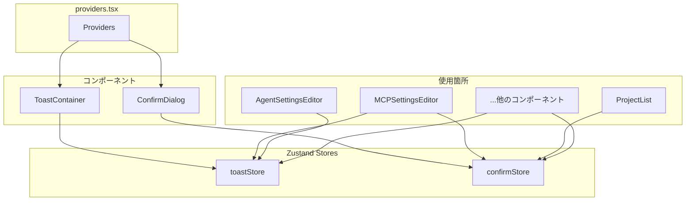

# フロントエンド フィードバックコンポーネント設計書

本ドキュメントでは、ユーザーへのフィードバック表示に使用するグローバルコンポーネント（Toast通知、確認ダイアログ）について説明します。

---

## 概要

| コンポーネント | 用途 | 状態管理 |
|---------------|------|----------|
| Toast | 操作結果の通知（成功/エラー/警告/情報） | `toastStore` |
| ConfirmDialog | 破壊的操作前の確認 | `confirmStore` |



---

## Toast通知

### ファイル構成

| ファイル | 説明 |
|---------|------|
| `src/stores/toastStore.ts` | Toast状態管理 |
| `src/components/common/Toast.tsx` | Toastコンポーネント |

### 使用方法

```typescript
import { toast } from '@/stores/toastStore';

// 成功通知
toast.success('保存しました');

// エラー通知
toast.error('保存に失敗しました');

// 警告通知（バリデーションエラーなど）
toast.warning('名前は必須です');

// 情報通知
toast.info('新しいバージョンがあります');
```

### Toast種別

| 種別 | メソッド | 用途 | 自動消去 |
|-----|---------|------|---------|
| Success | `toast.success(message)` | 操作成功時 | 3秒 |
| Error | `toast.error(message)` | APIエラー、操作失敗時 | 5秒 |
| Warning | `toast.warning(message)` | バリデーション警告、注意喚起 | 4秒 |
| Info | `toast.info(message)` | 情報提供 | 3秒 |

### デザイン

```
┌─────────────────────────────────────┐
│ ✓ Server saved successfully    [×] │
└─────────────────────────────────────┘
```

- 画面右下に表示
- 複数のToastはスタック表示
- アニメーション付きで表示/非表示
- クリックで即座に閉じる

---

## 確認ダイアログ (ConfirmDialog)

### ファイル構成

| ファイル | 説明 |
|---------|------|
| `src/stores/confirmStore.ts` | 確認ダイアログ状態管理 |
| `src/components/common/ConfirmDialog.tsx` | 確認ダイアログコンポーネント |

### 使用方法

```typescript
import { confirm } from '@/stores/confirmStore';

// 削除確認
const handleDelete = async () => {
  const confirmed = await confirm({
    title: 'Delete Item',
    message: 'Are you sure you want to delete this item?',
    confirmLabel: 'Delete',
    variant: 'danger',
  });

  if (!confirmed) return;

  // 削除処理
  await deleteItem(id);
};
```

### オプション

| オプション | 型 | デフォルト | 説明 |
|-----------|-----|----------|------|
| `title` | `string` | 必須 | ダイアログタイトル |
| `message` | `string` | 必須 | 確認メッセージ |
| `confirmLabel` | `string` | `'Confirm'` | 確認ボタンのラベル |
| `cancelLabel` | `string` | `'Cancel'` | キャンセルボタンのラベル |
| `variant` | `'danger' \| 'warning' \| 'info'` | `'danger'` | ダイアログの種類 |

### Variant の使い分け

| Variant | 用途 | ボタン色 | アイコン |
|---------|------|---------|---------|
| `danger` | 削除、取り消し不可の操作 | 赤 | ゴミ箱 |
| `warning` | 設定クリア、再生成など | アクセント色 | 警告三角 |
| `info` | 情報確認 | アクセント色 | 情報アイコン |

### デザイン

```
┌─────────────────────────────────────────┐
│  🗑️  Delete Server                      │
│                                         │
│      Are you sure you want to delete    │
│      "my-server"?                       │
│                                         │
│              [Cancel]  [Delete]         │
└─────────────────────────────────────────┘
```

- 画面中央にモーダル表示
- バックドロップクリックでキャンセル
- Escapeキーでキャンセル
- 確認ボタンに自動フォーカス

---

## グローバル設定

### providers.tsx

```typescript
import { ToastContainer } from '@/components/common/Toast';
import { ConfirmDialog } from '@/components/common/ConfirmDialog';

export function Providers({ children }: { children: React.ReactNode }) {
  return (
    <I18nextProvider i18n={i18n}>
      {children}
      <ToastContainer />
      <ConfirmDialog />
    </I18nextProvider>
  );
}
```

---

## 使用例

### CRUD操作での使用パターン

```typescript
import { toast } from '@/stores/toastStore';
import { confirm } from '@/stores/confirmStore';

// 作成
const handleCreate = async () => {
  try {
    await api.create(data);
    toast.success('Created successfully');
  } catch (err) {
    toast.error(err.message);
  }
};

// 更新
const handleUpdate = async () => {
  if (!validate()) {
    toast.warning('Name is required');
    return;
  }

  try {
    await api.update(id, data);
    toast.success('Updated successfully');
  } catch (err) {
    toast.error(err.message);
  }
};

// 削除
const handleDelete = async (item: Item) => {
  const confirmed = await confirm({
    title: 'Delete Item',
    message: `Delete "${item.name}"?`,
    confirmLabel: 'Delete',
    variant: 'danger',
  });

  if (!confirmed) return;

  try {
    await api.delete(item.id);
    toast.success(`"${item.name}" deleted`);
  } catch (err) {
    toast.error(err.message);
  }
};
```

---

## 翻訳対応

**重要**: すべてのconfirm呼び出しで翻訳キーを使用し、`cancelLabel`を必ず指定してください。

```typescript
import { useTranslation } from 'react-i18next';

const { t } = useTranslation();

// Toast
toast.success(t('common.saveSuccess'));
toast.error(t('common.saveError'));

// ConfirmDialog - 必須パターン
const confirmed = await confirm({
  title: t('editor.mcp.deleteServerTitle'),
  message: t('editor.mcp.confirmDeleteServer', { name: server.name }),
  confirmLabel: t('common.delete'),
  cancelLabel: t('common.cancel'),  // 必須！
  variant: 'danger',
});
```

### 既存の翻訳キー

| 用途 | 翻訳キー |
|-----|---------|
| キャンセルボタン | `common.cancel` |
| 削除ボタン | `common.delete` |
| プロジェクト削除タイトル | `project.deleteTitle` |
| プロジェクト削除確認 | `project.confirmDelete` |
| セッション削除タイトル | `session.deleteTitle` |
| セッション削除確認 | `session.confirmDelete` |
| MCPサーバー削除タイトル | `editor.mcp.deleteServerTitle` |
| MCPサーバー削除確認 | `editor.mcp.confirmDeleteServer` |
| コマンド削除タイトル | `editor.commands.deleteTitle` |
| コマンド削除確認 | `editor.commands.confirmDelete` |
| スケジュール削除タイトル | `editor.cron.deleteSchedule` |
| スケジュール削除確認 | `editor.cron.confirmDelete` |
| テンプレート削除タイトル | `template.deleteTitle` |
| テンプレート削除確認 | `template.confirmDelete` |
| 公開設定削除タイトル | `editor.publicAccess.deleteTitle` |
| トークン再生成タイトル | `editor.publicAccess.regenerateTitle` |
| チャットクリアタイトル | `chat.clearHistoryTitle` |
| チャットクリア確認 | `chat.confirmClearHistory` |

---

## マイグレーションガイド

### インラインエラー表示からToastへの移行

**Before:**
```typescript
const [error, setError] = useState<string | null>(null);

const handleSave = async () => {
  try {
    await api.save(data);
  } catch (err) {
    setError(err.message);
  }
};

// JSX
{error && <div className="text-red-500">{error}</div>}
```

**After:**
```typescript
import { toast } from '@/stores/toastStore';

const handleSave = async () => {
  try {
    await api.save(data);
    toast.success('Saved successfully');
  } catch (err) {
    toast.error(err.message);
  }
};
```

### ブラウザconfirm()からConfirmDialogへの移行

**Before:**
```typescript
const handleDelete = () => {
  if (!confirm('Delete this item?')) return;
  deleteItem(id);
};
```

**After:**
```typescript
import { confirm } from '@/stores/confirmStore';

const handleDelete = async () => {
  const confirmed = await confirm({
    title: 'Delete Item',
    message: 'Delete this item?',
    confirmLabel: 'Delete',
    variant: 'danger',
  });
  if (!confirmed) return;
  await deleteItem(id);
};
```

---

## Z-Index階層

| コンポーネント | z-index | 説明 |
|---------------|---------|------|
| Modal | 100 | 通常のモーダル |
| ConfirmDialog | 200 | 確認ダイアログ（モーダルの上） |
| Toast | 300 | Toast通知（最上位） |
