# フロントエンドWebSocket統合ドキュメント

## 概要

Web版Claude CodeプロジェクトにおけるWebSocket統合実装の完全なドキュメントです。バックエンドのFastAPI WebSocketエンドポイントと、Next.jsフロントエンドのリアルタイム通信機能を統合しました。

## 実装完了項目

### 1. 型定義の更新

#### `/src/frontend/src/types/websocket.ts`

バックエンド仕様に完全対応したWebSocketメッセージ型を定義しました。

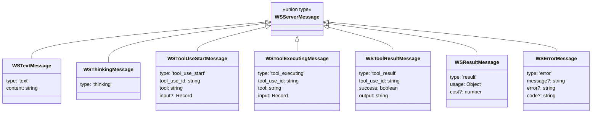

#### `/src/frontend/src/types/tool.ts` (新規作成)

ツール実行状態を管理するための型定義を追加しました。

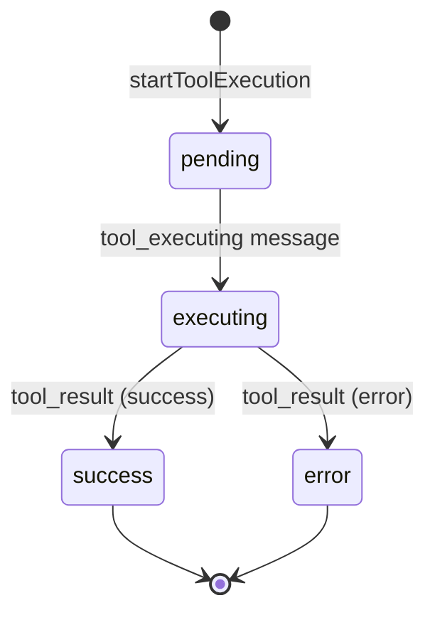

### 2. State管理の実装

#### `/src/frontend/src/stores/chatStore.ts`

Zustandを使用したグローバル状態管理を実装しました。

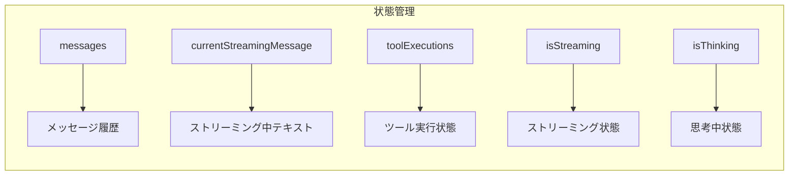

主要な機能:

- `addMessage()`: メッセージ履歴への追加
- `updateStreamingMessage()`: ストリーミングテキストの蓄積
- `finalizeStreamingMessage()`: ストリーミング完了時の確定
- `startToolExecution()`: ツール実行の開始
- `updateToolExecution()`: ツール実行状態の更新

### 3. WebSocketフックの完成

#### `/src/frontend/src/hooks/useWebSocket.ts`

WebSocket接続とメッセージハンドリングを実装しました。

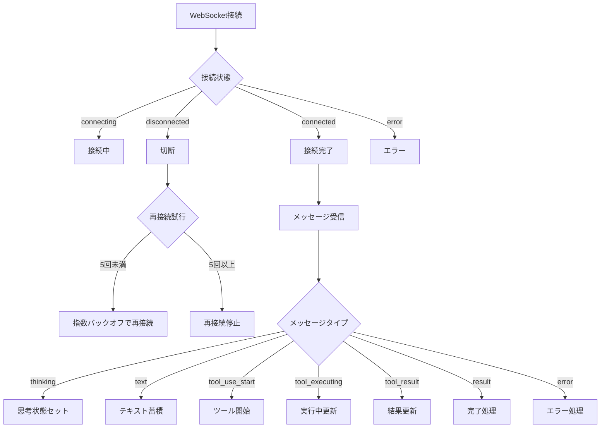

主要な機能:

- 自動再接続（指数バックオフ）
- メッセージタイプ別処理
- エラーハンドリング
- 接続状態管理

### 4. 統合フックの作成

#### `/src/frontend/src/hooks/useChat.ts` (新規作成)

`useWebSocket`と`useChatStore`を統合した高レベルインターフェースを提供します。

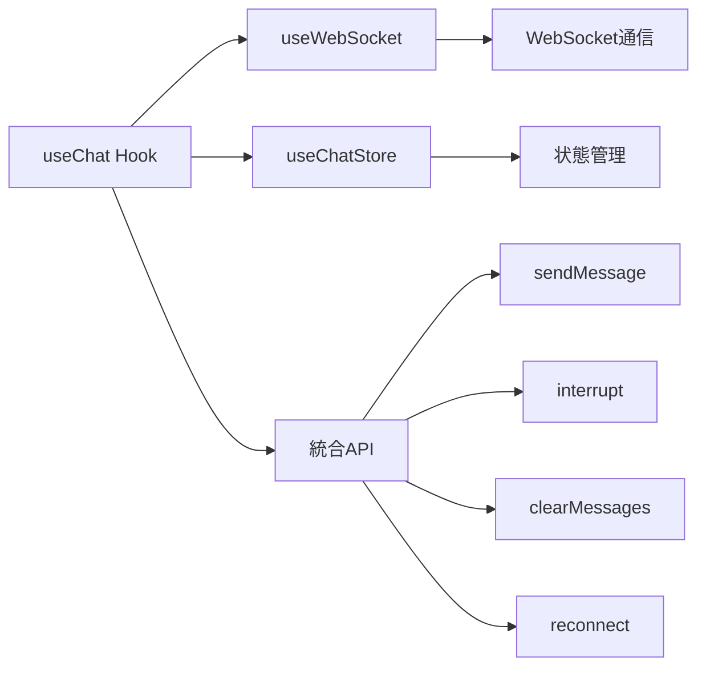

### 5. UIコンポーネントの実装

#### `/src/frontend/src/components/chat/ToolExecutionDisplay.tsx` (新規作成)

ツール実行状態を視覚的に表示するコンポーネントです。

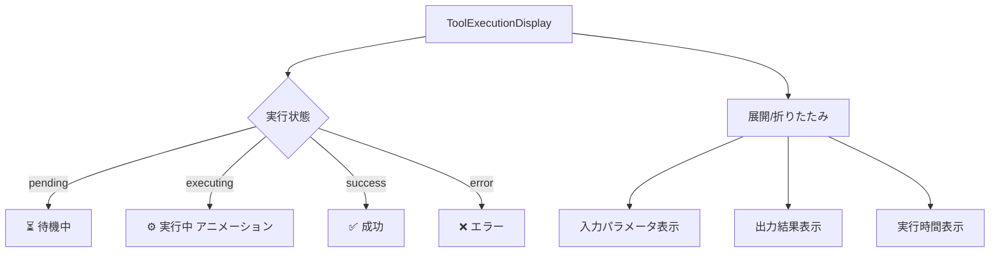

特徴:

- ツールアイコン表示（Read, Write, Edit, Bash, etc.）
- ステータス別の色分け
- 実行時間の表示
- 入力/出力の折りたたみ表示

#### `/src/frontend/src/components/chat/ChatContainer.tsx` (更新)

すべての機能を統合したメインチャットコンテナです。

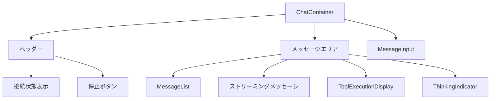

## WebSocket通信フロー

### メッセージ送信フロー

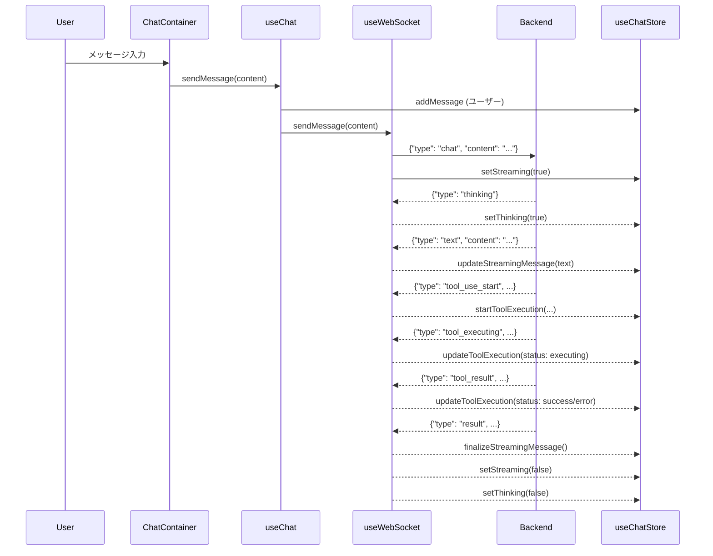

### ツール実行フロー

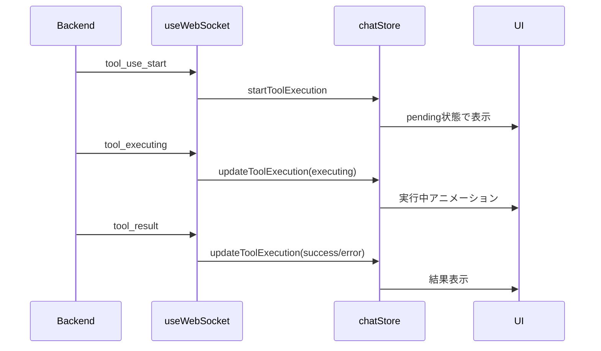

## 主要ファイル一覧

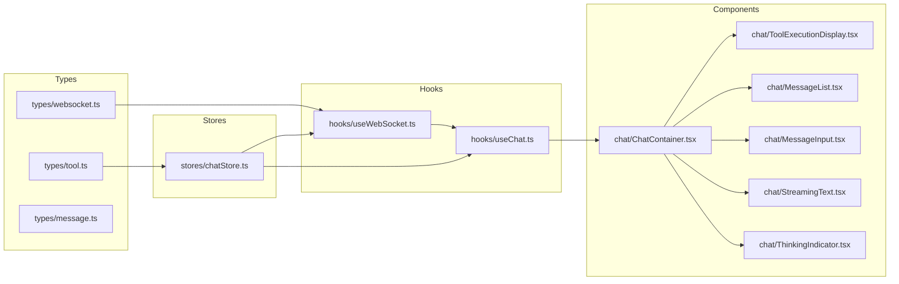

## 動作確認手順

### 1. 環境変数の確認

`/src/frontend/.env.local`:
```
NEXT_PUBLIC_API_URL=http://localhost:8000
NEXT_PUBLIC_WS_URL=ws://localhost:8000
```

### 2. バックエンドの起動

```bash
cd /Users/t.hirai/AGENTSDK/src/backend
uvicorn app.main:app --reload
```

### 3. フロントエンドの起動

```bash
cd /Users/t.hirai/AGENTSDK/src/frontend
npm run dev
```

### 4. 動作確認項目

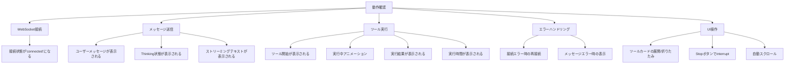

## 実装の特徴

### パフォーマンス最適化

1. **効率的な状態更新**
   - ストリーミングメッセージは蓄積され、完了時に一度だけメッセージ配列に追加
   - ツール実行状態はRecordで管理し、個別更新が可能

2. **再レンダリング最小化**
   - useCallbackによる関数メモ化
   - 必要最小限の状態更新

3. **自動再接続**
   - 指数バックオフによる再接続（最大5回）
   - ユーザーの手動再接続も可能

### アクセシビリティ

1. **キーボード操作**
   - Enter: メッセージ送信
   - Shift+Enter: 改行

2. **視覚的フィードバック**
   - 接続状態の色分け表示
   - ツール実行状態のアイコン表示
   - ストリーミング中のカーソルアニメーション

### エラーハンドリング

1. **接続エラー**
   - 自動再接続
   - エラー状態の視覚的表示

2. **メッセージエラー**
   - エラーメッセージの表示
   - ストリーミング状態のクリア

3. **ツール実行エラー**
   - エラー状態の視覚的表示
   - エラー詳細の表示

## 今後の拡張可能性

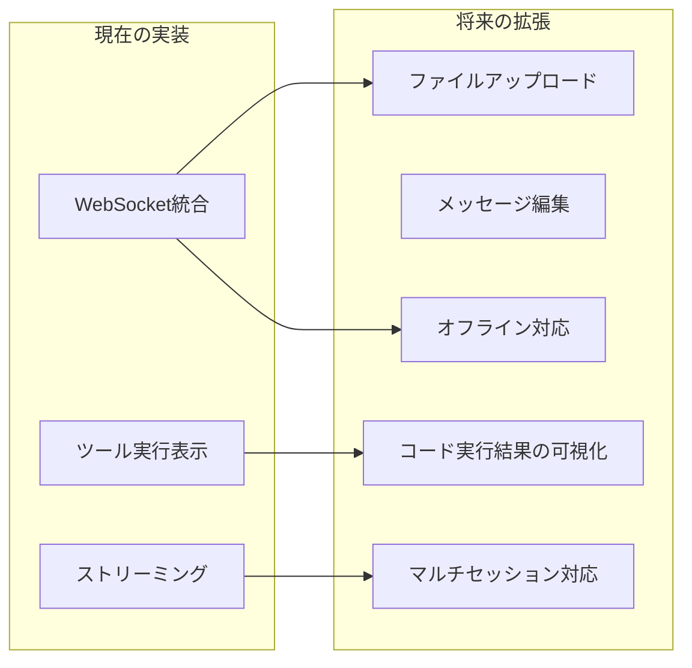

## まとめ

フロントエンドWebSocket統合は以下の項目を完了しました:

1. バックエンド仕様に完全対応した型定義
2. 効率的な状態管理（Zustand）
3. 再接続機能付きWebSocketフック
4. 統合されたuseChatフック
5. ツール実行の完全な可視化
6. リアルタイムストリーミング表示
7. エラーハンドリングとユーザーフィードバック

すべての実装はTypeScript strict modeでコンパイルが通り、型安全性が保証されています。
