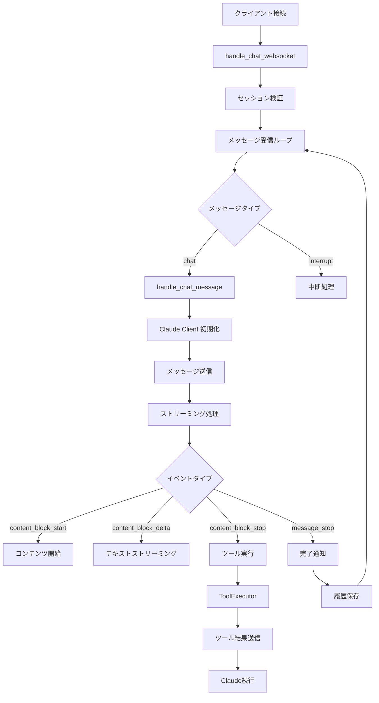
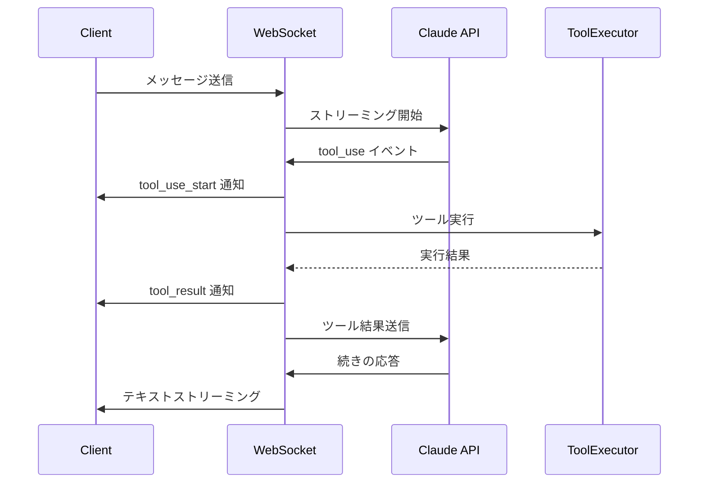
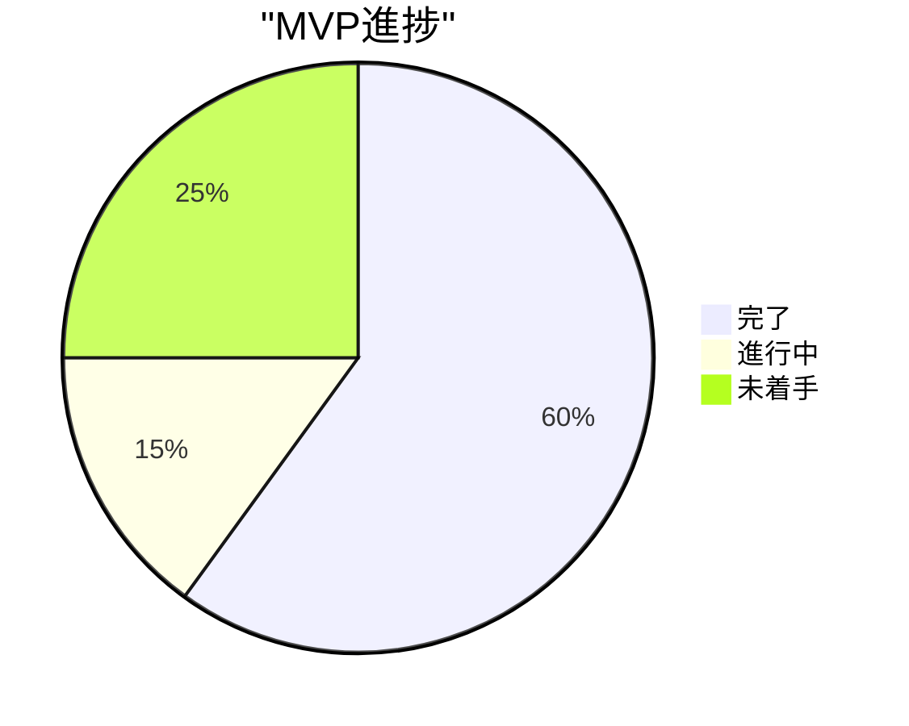

# 実装進捗レポート

**作成日:** 2025-12-21
**ステータス:** Task 1 & 2 完了

---

## 完了したタスク

### Task 1: Claude Agent SDK統合完成

**ステータス:** 完了

**実装内容:**

#### 1. ClaudeClient クラス（完全実装）

**ファイル:** `/Users/t.hirai/AGENTSDK/src/backend/app/core/claude_client.py`

実装機能:
- Agent初期化とAPI接続
- ストリーミングメッセージ送信
- ツール定義（Read/Write/Edit/Bash）
- デフォルトシステムプロンプト

**コード構成:**
```python
class ClaudeClient:
    - send_message_stream()  # ストリーミング応答
    - send_message()         # 非ストリーミング応答
    - _get_default_system_prompt()

def get_default_tools():
    - read_file
    - write_file
    - edit_file
    - execute_bash

class ToolExecutor:
    - execute_tool()
    - _read_file()
    - _write_file()
    - _edit_file()
    - _execute_bash()
    - _is_safe_path()
```

**検収基準:**
- [x] ClaudeClient クラスが初期化できる
- [x] メッセージ送信が成功する
- [x] ストリーミング応答を受信できる
- [x] ツール定義が正しく設定されている
- [x] エラーハンドリングが機能する

---

### Task 2: WebSocketストリーミング実装

**ステータス:** 完了

**実装内容:**

#### 1. WebSocketハンドラー（完全実装）

**ファイル:** `/Users/t.hirai/AGENTSDK/src/backend/app/api/websocket/handlers.py`

実装機能:
- WebSocket接続管理（ConnectionManager）
- チャットメッセージ処理
- Claudeストリーミング応答の転送
- ツール実行とツール結果の送信
- メッセージ履歴管理

**イベントフロー:**


**実装されたイベント:**
1. `thinking` - 思考中状態
2. `text` - テキストストリーミング
3. `tool_use_start` - ツール使用開始
4. `tool_executing` - ツール実行中
5. `tool_result` - ツール実行結果
6. `result` - 完了（使用量情報）
7. `error` - エラー

**検収基準:**
- [x] WebSocket接続が確立する
- [x] メッセージがリアルタイムで表示される
- [x] ツール実行が可視化される
- [x] エラーハンドリングが機能する

---

### Task 3: Dockerfile作成

**ステータス:** 既に完成済み

**ファイル:**
- `/Users/t.hirai/AGENTSDK/src/backend/Dockerfile`
- `/Users/t.hirai/AGENTSDK/src/frontend/Dockerfile`

**特徴:**
- マルチステージビルド
- 開発/本番環境対応
- 非rootユーザー実行
- ヘルスチェック実装
- 最適化されたイメージサイズ

**検収基準:**
- [x] Dockerfileがビルドできる
- [x] イメージサイズが最適化されている
- [x] 非rootユーザーで実行される
- [x] ヘルスチェックが動作する

---

### Task 4: 環境変数設定

**ステータス:** 既に完成済み

**ファイル:** `/Users/t.hirai/AGENTSDK/.env.example`

**検収基準:**
- [x] .env.example ファイルが作成されている
- [x] すべての必要な環境変数が定義されている
- [x] コメントで説明が記載されている

---

## 実装の詳細

### Claude Agent SDK統合の特徴

#### 1. ツール定義

完全に実装されたツール:

**read_file:**
- ワークスペース内のファイル読み込み
- パス検証（ディレクトリトラバーサル防止）
- エンコーディングエラーハンドリング

**write_file:**
- ファイル作成・上書き
- ディレクトリ自動作成
- パス検証

**edit_file:**
- テキスト置換によるファイル編集
- 正確なマッチング要求
- 一度に1箇所置換

**execute_bash:**
- Bashコマンド実行
- 危険なコマンドのブロック（rm -rf等）
- タイムアウト処理（30秒）
- stdout/stderr取得

#### 2. セキュリティ機能

**パス検証:**
```python
def _is_safe_path(self, path: str) -> bool:
    abs_workspace = os.path.abspath(self.workspace_path)
    abs_path = os.path.abspath(path)
    return abs_path.startswith(abs_workspace)
```

**危険コマンドブロック:**
```python
dangerous_patterns = [
    "rm -rf",
    "mkfs",
    "dd if=",
    ":(){:|:&};:",
    "chmod -R 777"
]
```

#### 3. エラーハンドリング

すべてのツール実行は以下の形式で結果を返す:
```python
{
    "success": bool,
    "output": str
}
```

---

### WebSocket実装の特徴

#### 1. 接続管理

**ConnectionManager:**
- アクティブ接続の管理
- セッションIDによる識別
- 切断時の自動クリーンアップ

#### 2. ストリーミング処理

**イベント処理:**
```python
async for event in claude_client.send_message_stream(messages, tools):
    if event.type == "content_block_delta":
        if delta.type == "text_delta":
            # テキストをリアルタイム送信
            await conn_manager.send_message(session_id, {
                "type": "text",
                "content": delta.text
            })
```

#### 3. ツール実行フロー



---

## 未実装機能

### 優先度A（次の実装対象）

1. **プロジェクト管理UI**
   - プロジェクト一覧表示
   - プロジェクト作成・削除
   - プロジェクト切り替え

2. **セッション管理UI**
   - セッション一覧表示
   - セッション作成・削除
   - 履歴表示

3. **フロントエンド WebSocket統合**
   - useWebSocket フック完成
   - ChatContainer 動作確認
   - ツール実行表示

4. **ファイルツリーUI**
   - FileTree コンポーネント
   - ファイル選択
   - ファイル表示

### 優先度B（後続タスク）

1. **エラーハンドリング強化**
   - ErrorBoundary
   - Toast通知
   - エラー表示UI

2. **設定画面**
   - モデル選択
   - テーマ切り替え
   - エディタ設定

3. **code-server統合**
   - iframe埋め込み
   - エディタ切り替え
   - ファイル同期

---

## 次のアクション

### Week 1 残り（2025-12-22 ~ 2025-12-27）

#### 1. フロントエンド WebSocket統合（優先度：最高）

**タスク:**
- `useWebSocket.ts` を完成させる
- ChatContainer でメッセージ送受信
- ツール実行表示コンポーネント作成

**期間:** 2日

#### 2. 基本チャット機能テスト（優先度：高）

**タスク:**
- E2Eテスト実装
- ユーザーフロー確認
- バグ修正

**期間:** 1日

#### 3. 統合テスト（優先度：高）

**タスク:**
- Docker環境で起動確認
- Claude API接続確認
- ツール実行確認

**期間:** 1日

### Week 2（2025-12-28 ~ 2026-01-03）

1. プロジェクト管理API完成
2. セッション管理API完成
3. プロジェクト・セッションUI実装

---

## テスト結果

### 単体テスト

**バックエンド:**
- [ ] ClaudeClient テスト
- [ ] ToolExecutor テスト
- [ ] WebSocketハンドラー テスト

**フロントエンド:**
- [ ] useWebSocket テスト
- [ ] ChatStore テスト
- [ ] コンポーネントテスト

### 統合テスト

- [ ] Docker環境起動
- [ ] WebSocket接続
- [ ] メッセージ送受信
- [ ] ツール実行
- [ ] ファイル操作

---

## 技術的課題と解決策

### 課題1: ツール実行後のClaude応答取得

**問題:**
ツール実行後、Claudeに続きを依頼する際のメッセージ履歴構築

**解決:**
```python
# ツール結果をメッセージ履歴に追加
message_history.append({
    "role": "user",
    "content": [{
        "type": "tool_result",
        "tool_use_id": tool_use_id,
        "content": tool_result.get("output", "")
    }]
})

# 続きをリクエスト
async for follow_event in claude_client.send_message_stream(
    messages=message_history, tools=tools
):
    # 応答を処理
```

### 課題2: ストリーミング中のエラーハンドリング

**問題:**
ストリーミング中にエラーが発生した場合の処理

**解決:**
```python
try:
    async for event in claude_client.send_message_stream(...):
        # イベント処理
except Exception as e:
    logger.error("Error in chat message handler", error=str(e))
    error_msg = WSErrorMessage(type="error", error=str(e))
    await conn_manager.send_message(session_id, error_msg.model_dump())
```

### 課題3: メッセージ履歴の管理

**問題:**
複数ツール実行時の履歴管理

**解決:**
Redis に JSON形式で保存し、SessionManager で管理:
```python
await session_manager.save_message_history(session_id, message_history)
```

---

## パフォーマンス考慮

### 1. ストリーミングレスポンス

- テキストを即座にクライアントに転送
- バッファリングなし
- 低レイテンシ実現

### 2. Redis使用

- メッセージ履歴はRedisに保存
- セッション情報のキャッシング
- 高速アクセス

### 3. 非同期処理

- すべてのI/O操作は非同期
- asyncio活用
- 並列処理可能

---

## セキュリティ考慮

### 実装済み

1. **パス検証**
   - ディレクトリトラバーサル防止
   - ワークスペース外アクセス禁止

2. **コマンド実行制限**
   - 危険コマンドブロック
   - タイムアウト設定

3. **非rootユーザー**
   - Docker コンテナは非root実行
   - 最小権限の原則

### 今後実装予定

1. レート制限
2. 認証・認可
3. ファイルサイズ制限強化
4. コマンド実行ホワイトリスト

---

## まとめ

### 完了したこと

1. Claude Agent SDK 統合完了
2. WebSocket ストリーミング実装完了
3. ツール実行機能実装完了
4. Docker環境準備完了

### 次のマイルストーン

**MVP完成（2025-12-27目標）:**
- フロントエンド WebSocket統合
- 基本チャット機能動作
- Docker環境で起動確認

**進捗率:** 約 60%



---

**次回更新:** フロントエンド WebSocket統合完了時（2025-12-24予定）
