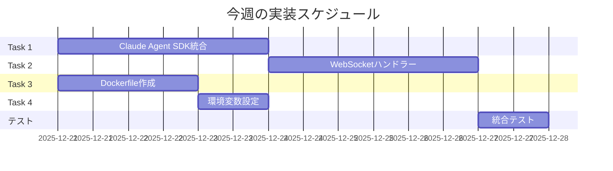

# 次に実装すべきタスク

**作成日:** 2025-12-21
**優先度:** 最高
**期限:** 2025-12-27 (1週間以内)

---

## 今週の目標

**Claude Agent SDK統合を完成させ、基本的なチャット機能を動作させる**

---

## Task 1: Claude Agent SDK統合完成（最優先）

### 概要
`src/backend/app/core/claude_client.py` を完全に実装し、Claude Agent SDKとの統合を完成させる。

### 実装内容

**ファイル:** `/Users/t.hirai/AGENTSDK/src/backend/app/core/claude_client.py`

#### 必要な機能

1. **Agent初期化**
   - Anthropic クライアント初期化
   - モデル設定（claude-opus-4-5）
   - ツール定義

2. **メッセージ送信とストリーミング**
   - 非同期メッセージ送信
   - ストリーミング応答受信
   - イベント処理

3. **ツール実行**
   - Read ツール（ファイル読み込み）
   - Write ツール（ファイル書き込み）
   - Edit ツール（ファイル編集）
   - Bash ツール（コマンド実行）

4. **エラーハンドリング**
   - API エラー処理
   - タイムアウト処理
   - リトライロジック

### 実装例

```python
# src/backend/app/core/claude_client.py
"""
Claude Agent SDK クライアント

Anthropic Claude API を使用したエージェント実装
"""

import asyncio
from typing import AsyncIterator, Optional, List, Dict, Any
from anthropic import AsyncAnthropic
from anthropic.types import Message, MessageStreamEvent, TextBlock, ToolUseBlock

from app.config import settings
from app.utils.logger import get_logger

logger = get_logger(__name__)


class ClaudeClient:
    """Claude Agent SDK クライアント"""

    def __init__(
        self,
        api_key: Optional[str] = None,
        model: str = "claude-opus-4-5",
        max_tokens: int = 4096,
    ):
        """
        初期化

        Args:
            api_key: Anthropic API Key
            model: 使用するClaudeモデル
            max_tokens: 最大トークン数
        """
        self.api_key = api_key or settings.anthropic_api_key
        self.model = model
        self.max_tokens = max_tokens
        self.client = AsyncAnthropic(api_key=self.api_key)

        logger.info("ClaudeClient initialized", model=self.model)

    async def send_message_stream(
        self,
        messages: List[Dict[str, Any]],
        system: Optional[str] = None,
        tools: Optional[List[Dict[str, Any]]] = None,
    ) -> AsyncIterator[MessageStreamEvent]:
        """
        メッセージを送信し、ストリーミングで応答を受信

        Args:
            messages: メッセージ履歴
            system: システムプロンプト
            tools: 使用可能なツール定義

        Yields:
            MessageStreamEvent: ストリーミングイベント
        """
        logger.info(
            "Sending message to Claude",
            message_count=len(messages),
            has_system=bool(system),
            has_tools=bool(tools),
        )

        try:
            async with self.client.messages.stream(
                model=self.model,
                max_tokens=self.max_tokens,
                system=system or "You are Claude, a helpful AI assistant.",
                messages=messages,
                tools=tools or [],
            ) as stream:
                async for event in stream:
                    yield event

                # 最終メッセージ取得
                final_message = await stream.get_final_message()
                logger.info(
                    "Message completed",
                    stop_reason=final_message.stop_reason,
                    usage=final_message.usage.model_dump(),
                )

        except Exception as e:
            logger.error("Error sending message to Claude", error=str(e), exc_info=True)
            raise

    async def send_message(
        self,
        messages: List[Dict[str, Any]],
        system: Optional[str] = None,
        tools: Optional[List[Dict[str, Any]]] = None,
    ) -> Message:
        """
        メッセージを送信し、完全な応答を受信（非ストリーミング）

        Args:
            messages: メッセージ履歴
            system: システムプロンプト
            tools: 使用可能なツール定義

        Returns:
            Message: Claude の応答
        """
        logger.info("Sending non-streaming message", message_count=len(messages))

        try:
            response = await self.client.messages.create(
                model=self.model,
                max_tokens=self.max_tokens,
                system=system or "You are Claude, a helpful AI assistant.",
                messages=messages,
                tools=tools or [],
            )

            logger.info(
                "Message completed",
                stop_reason=response.stop_reason,
                usage=response.usage.model_dump(),
            )

            return response

        except Exception as e:
            logger.error("Error sending message to Claude", error=str(e), exc_info=True)
            raise


def get_default_tools() -> List[Dict[str, Any]]:
    """
    デフォルトツール定義を取得

    Returns:
        List[Dict]: ツール定義リスト
    """
    return [
        {
            "name": "read_file",
            "description": "Read the contents of a file",
            "input_schema": {
                "type": "object",
                "properties": {
                    "path": {
                        "type": "string",
                        "description": "The path to the file to read",
                    }
                },
                "required": ["path"],
            },
        },
        {
            "name": "write_file",
            "description": "Write content to a file",
            "input_schema": {
                "type": "object",
                "properties": {
                    "path": {
                        "type": "string",
                        "description": "The path to the file to write",
                    },
                    "content": {
                        "type": "string",
                        "description": "The content to write to the file",
                    },
                },
                "required": ["path", "content"],
            },
        },
        {
            "name": "edit_file",
            "description": "Edit a file by replacing text",
            "input_schema": {
                "type": "object",
                "properties": {
                    "path": {
                        "type": "string",
                        "description": "The path to the file to edit",
                    },
                    "old_text": {
                        "type": "string",
                        "description": "The text to replace",
                    },
                    "new_text": {
                        "type": "string",
                        "description": "The new text",
                    },
                },
                "required": ["path", "old_text", "new_text"],
            },
        },
        {
            "name": "execute_bash",
            "description": "Execute a bash command",
            "input_schema": {
                "type": "object",
                "properties": {
                    "command": {
                        "type": "string",
                        "description": "The bash command to execute",
                    }
                },
                "required": ["command"],
            },
        },
    ]
```

### 検収基準

- [ ] ClaudeClient クラスが初期化できる
- [ ] メッセージ送信が成功する
- [ ] ストリーミング応答を受信できる
- [ ] ツール定義が正しく設定されている
- [ ] エラーハンドリングが機能する

### 所要時間
**2-3日**

---

## Task 2: WebSocketハンドラー実装（優先度：高）

### 概要
WebSocket経由でクライアントとClaude Agent SDKを接続し、リアルタイムチャットを実現する。

### 実装内容

**ファイル:** `/Users/t.hirai/AGENTSDK/src/backend/app/api/websocket/handlers.py`

#### 必要な機能

1. **WebSocket接続管理**
   - 接続受付
   - 切断処理
   - エラーハンドリング

2. **メッセージ処理**
   - クライアントからのメッセージ受信
   - Claude Agent実行
   - ストリーミング応答の転送

3. **ツール実行**
   - ツール呼び出しの検出
   - ツール実行
   - 結果の返送

### 実装例

```python
# src/backend/app/api/websocket/handlers.py
"""
WebSocketハンドラー

チャットWebSocketの処理を実装
"""

import asyncio
import json
from typing import Dict, Any, List
from fastapi import WebSocket, WebSocketDisconnect
from redis.asyncio import Redis

from app.core.claude_client import ClaudeClient, get_default_tools
from app.core.session_manager import SessionManager
from app.services.file_service import FileService
from app.utils.logger import get_logger
from app.config import settings

logger = get_logger(__name__)


async def handle_chat_websocket(
    websocket: WebSocket, session_id: str, redis: Redis
) -> None:
    """
    チャットWebSocketハンドラー

    Args:
        websocket: WebSocketインスタンス
        session_id: セッションID
        redis: Redisクライアント
    """
    await websocket.accept()
    logger.info("WebSocket connected", session_id=session_id)

    # 初期化
    claude_client = ClaudeClient()
    session_manager = SessionManager(redis)
    file_service = FileService()

    # セッション情報取得
    try:
        session = await session_manager.get_session(session_id)
        if not session:
            await websocket.send_json({
                "type": "error",
                "message": f"Session not found: {session_id}"
            })
            await websocket.close()
            return

        workspace_path = session.workspace_path
        logger.info("Session loaded", session_id=session_id, workspace=workspace_path)

    except Exception as e:
        logger.error("Failed to load session", error=str(e))
        await websocket.send_json({
            "type": "error",
            "message": "Failed to load session"
        })
        await websocket.close()
        return

    # メッセージループ
    try:
        while True:
            # クライアントからメッセージ受信
            data = await websocket.receive_json()
            logger.debug("Received message", data=data)

            if data.get("type") == "chat":
                await handle_chat_message(
                    websocket,
                    data,
                    claude_client,
                    session_manager,
                    file_service,
                    session_id,
                    workspace_path,
                )
            elif data.get("type") == "interrupt":
                # 中断処理
                logger.info("Chat interrupted", session_id=session_id)
                await websocket.send_json({
                    "type": "interrupted",
                    "message": "Processing interrupted"
                })
            else:
                logger.warning("Unknown message type", type=data.get("type"))

    except WebSocketDisconnect:
        logger.info("WebSocket disconnected", session_id=session_id)
    except Exception as e:
        logger.error("WebSocket error", error=str(e), exc_info=True)
        try:
            await websocket.send_json({
                "type": "error",
                "message": "Internal server error"
            })
        except:
            pass
    finally:
        try:
            await websocket.close()
        except:
            pass


async def handle_chat_message(
    websocket: WebSocket,
    data: Dict[str, Any],
    claude_client: ClaudeClient,
    session_manager: SessionManager,
    file_service: FileService,
    session_id: str,
    workspace_path: str,
) -> None:
    """
    チャットメッセージ処理

    Args:
        websocket: WebSocketインスタンス
        data: メッセージデータ
        claude_client: Claudeクライアント
        session_manager: セッションマネージャー
        file_service: ファイルサービス
        session_id: セッションID
        workspace_path: ワークスペースパス
    """
    user_message = data.get("content", "")
    logger.info("Processing chat message", session_id=session_id)

    # メッセージ履歴取得
    message_history = await session_manager.get_message_history(session_id)

    # ユーザーメッセージ追加
    message_history.append({
        "role": "user",
        "content": user_message
    })

    # Thinking状態通知
    await websocket.send_json({
        "type": "thinking"
    })

    # Claudeにメッセージ送信
    tools = get_default_tools()
    current_content = []

    try:
        async for event in claude_client.send_message_stream(
            messages=message_history,
            system=get_system_prompt(workspace_path),
            tools=tools,
        ):
            # イベントタイプに応じた処理
            if event.type == "content_block_start":
                # コンテンツブロック開始
                block = event.content_block
                if block.type == "text":
                    current_content.append({
                        "type": "text",
                        "text": ""
                    })
                elif block.type == "tool_use":
                    current_content.append({
                        "type": "tool_use",
                        "id": block.id,
                        "name": block.name,
                        "input": {}
                    })

            elif event.type == "content_block_delta":
                # コンテンツ更新
                delta = event.delta
                if delta.type == "text_delta":
                    # テキストストリーミング
                    await websocket.send_json({
                        "type": "text",
                        "content": delta.text
                    })
                    if current_content:
                        current_content[-1]["text"] += delta.text

                elif delta.type == "input_json_delta":
                    # ツール入力更新
                    if current_content and current_content[-1]["type"] == "tool_use":
                        # JSON パース
                        import json
                        try:
                            partial_input = json.loads(delta.partial_json)
                            current_content[-1]["input"].update(partial_input)
                        except:
                            pass

            elif event.type == "content_block_stop":
                # ツール実行
                if current_content and current_content[-1].get("type") == "tool_use":
                    tool_block = current_content[-1]
                    tool_name = tool_block["name"]
                    tool_input = tool_block["input"]

                    # ツール実行通知
                    await websocket.send_json({
                        "type": "tool_use",
                        "tool": tool_name,
                        "input": tool_input
                    })

                    # ツール実行
                    tool_result = await execute_tool(
                        tool_name,
                        tool_input,
                        file_service,
                        workspace_path
                    )

                    # 結果送信
                    await websocket.send_json({
                        "type": "tool_result",
                        "tool_use_id": tool_block["id"],
                        "success": tool_result.get("success", True),
                        "output": tool_result.get("output", "")
                    })

            elif event.type == "message_stop":
                # メッセージ完了
                logger.info("Message completed", session_id=session_id)

        # 完了通知
        await websocket.send_json({
            "type": "result",
            "cost": 0.0,  # TODO: コスト計算
            "usage": {
                "input_tokens": 0,
                "output_tokens": 0
            }
        })

        # メッセージ履歴保存
        message_history.append({
            "role": "assistant",
            "content": current_content
        })
        await session_manager.save_message_history(session_id, message_history)

    except Exception as e:
        logger.error("Error processing message", error=str(e), exc_info=True)
        await websocket.send_json({
            "type": "error",
            "message": str(e)
        })


async def execute_tool(
    tool_name: str,
    tool_input: Dict[str, Any],
    file_service: FileService,
    workspace_path: str,
) -> Dict[str, Any]:
    """
    ツール実行

    Args:
        tool_name: ツール名
        tool_input: ツール入力
        file_service: ファイルサービス
        workspace_path: ワークスペースパス

    Returns:
        Dict: 実行結果
    """
    logger.info("Executing tool", tool=tool_name, input=tool_input)

    try:
        if tool_name == "read_file":
            content = await file_service.read_file(
                workspace_path,
                tool_input["path"]
            )
            return {
                "success": True,
                "output": content
            }

        elif tool_name == "write_file":
            await file_service.write_file(
                workspace_path,
                tool_input["path"],
                tool_input["content"]
            )
            return {
                "success": True,
                "output": f"File written: {tool_input['path']}"
            }

        elif tool_name == "edit_file":
            await file_service.edit_file(
                workspace_path,
                tool_input["path"],
                tool_input["old_text"],
                tool_input["new_text"]
            )
            return {
                "success": True,
                "output": f"File edited: {tool_input['path']}"
            }

        elif tool_name == "execute_bash":
            # TODO: Bash実行実装
            return {
                "success": False,
                "output": "Bash execution not yet implemented"
            }

        else:
            return {
                "success": False,
                "output": f"Unknown tool: {tool_name}"
            }

    except Exception as e:
        logger.error("Tool execution failed", tool=tool_name, error=str(e))
        return {
            "success": False,
            "output": f"Error: {str(e)}"
        }


def get_system_prompt(workspace_path: str) -> str:
    """
    システムプロンプト生成

    Args:
        workspace_path: ワークスペースパス

    Returns:
        str: システムプロンプト
    """
    return f"""You are Claude Code, an AI coding assistant.

Your workspace is located at: {workspace_path}

You have access to the following tools:
- read_file: Read file contents
- write_file: Create or overwrite a file
- edit_file: Edit a file by replacing text
- execute_bash: Execute bash commands

Always provide clear explanations of what you're doing.
When creating or modifying files, explain your changes.
"""
```

### 検収基準

- [ ] WebSocket接続が確立できる
- [ ] メッセージ送受信が動作する
- [ ] Claudeからのストリーミング応答を受信できる
- [ ] ツール実行が動作する
- [ ] エラーハンドリングが機能する

### 所要時間
**3-4日**

---

## Task 3: Dockerfile作成（優先度：高）

### 概要
バックエンドとフロントエンドのDockerfileを作成し、Docker環境で起動可能にする。

### 実装内容

#### 3.1 バックエンドDockerfile

**ファイル:** `/Users/t.hirai/AGENTSDK/src/backend/Dockerfile`

```dockerfile
# Multi-stage build for Python FastAPI backend

# ============================================
# Base Stage: Common dependencies
# ============================================
FROM python:3.11-slim as base

# Metadata
LABEL maintainer="claude-code@example.com"
LABEL description="Claude Code Backend - FastAPI with Agent SDK"
LABEL version="1.0"

# Environment variables
ENV PYTHONUNBUFFERED=1 \
    PYTHONDONTWRITEBYTECODE=1 \
    PIP_NO_CACHE_DIR=1 \
    PIP_DISABLE_PIP_VERSION_CHECK=1 \
    POETRY_VERSION=1.7.1 \
    POETRY_HOME=/opt/poetry \
    POETRY_NO_INTERACTION=1 \
    POETRY_VIRTUALENVS_IN_PROJECT=true

# Install system dependencies
RUN apt-get update && apt-get install -y --no-install-recommends \
    curl \
    git \
    build-essential \
    ca-certificates \
    && rm -rf /var/lib/apt/lists/*

# Install Poetry
RUN curl -sSL https://install.python-poetry.org | python3 - \
    && ln -s /opt/poetry/bin/poetry /usr/local/bin/poetry

# Create non-root user
RUN groupadd -r appuser -g 1000 && \
    useradd -r -u 1000 -g appuser -m -s /bin/bash appuser

# Set working directory
WORKDIR /app

# ============================================
# Dependencies Stage: Install Python packages
# ============================================
FROM base as dependencies

# Copy dependency files
COPY pyproject.toml poetry.lock ./

# Install dependencies
RUN poetry install --no-root --no-dev --no-interaction --no-ansi

# ============================================
# Development Stage: Full development setup
# ============================================
FROM base as development

# Copy dependency files
COPY pyproject.toml poetry.lock ./

# Install all dependencies (including dev)
RUN poetry install --no-root --with dev

# Copy application code
COPY --chown=appuser:appuser ./app /app/app

# Create workspace directory
RUN mkdir -p /app/workspace && chown -R appuser:appuser /app/workspace

# Switch to non-root user
USER appuser

# Expose port
EXPOSE 8000

# Development command (can be overridden)
CMD ["poetry", "run", "uvicorn", "app.main:app", "--host", "0.0.0.0", "--port", "8000", "--reload"]

# ============================================
# Production Stage: Optimized production image
# ============================================
FROM base as production

# Copy virtual environment from dependencies stage
COPY --from=dependencies /app/.venv /app/.venv

# Copy application code
COPY --chown=appuser:appuser ./app /app/app

# Create workspace directory
RUN mkdir -p /app/workspace && chown -R appuser:appuser /app/workspace

# Switch to non-root user
USER appuser

# Add virtual environment to PATH
ENV PATH="/app/.venv/bin:$PATH"

# Expose port
EXPOSE 8000

# Health check
HEALTHCHECK --interval=30s --timeout=10s --start-period=60s --retries=3 \
    CMD curl -f http://localhost:8000/api/health || exit 1

# Production command
CMD ["uvicorn", "app.main:app", "--host", "0.0.0.0", "--port", "8000", "--workers", "4"]
```

#### 3.2 フロントエンドDockerfile

**ファイル:** `/Users/t.hirai/AGENTSDK/src/frontend/Dockerfile`

```dockerfile
# Multi-stage build for Next.js frontend

# ============================================
# Base Stage: Common Node.js setup
# ============================================
FROM node:20.11-alpine as base

# Metadata
LABEL maintainer="claude-code@example.com"
LABEL description="Claude Code Frontend - Next.js UI"
LABEL version="1.0"

# Install system dependencies
RUN apk add --no-cache libc6-compat curl

# Set working directory
WORKDIR /app

# Create non-root user
RUN addgroup -g 1001 -S nodejs && \
    adduser -S nextjs -u 1001

# ============================================
# Dependencies Stage: Install Node modules
# ============================================
FROM base as dependencies

# Copy package files
COPY package.json package-lock.json* ./

# Install dependencies
RUN npm ci --only=production --ignore-scripts && \
    npm cache clean --force

# ============================================
# Builder Stage: Build Next.js application
# ============================================
FROM base as builder

# Copy package files
COPY package.json package-lock.json* ./

# Install all dependencies (including dev)
RUN npm ci

# Copy source code
COPY . .

# Build arguments for environment variables
ARG NEXT_PUBLIC_API_URL
ARG NEXT_PUBLIC_WS_URL

ENV NEXT_PUBLIC_API_URL=$NEXT_PUBLIC_API_URL
ENV NEXT_PUBLIC_WS_URL=$NEXT_PUBLIC_WS_URL
ENV NEXT_TELEMETRY_DISABLED=1

# Build application
RUN npm run build

# ============================================
# Development Stage: Full development setup
# ============================================
FROM base as development

# Copy package files
COPY package.json package-lock.json* ./

# Install all dependencies
RUN npm ci

# Copy source code
COPY --chown=nextjs:nodejs . .

# Switch to non-root user
USER nextjs

# Expose port
EXPOSE 3000

# Development command
ENV NODE_ENV=development
CMD ["npm", "run", "dev"]

# ============================================
# Production Stage: Optimized production image
# ============================================
FROM base as production

# Set production environment
ENV NODE_ENV=production

# Copy production dependencies
COPY --from=dependencies --chown=nextjs:nodejs /app/node_modules ./node_modules

# Copy built application
COPY --from=builder --chown=nextjs:nodejs /app/.next ./.next
COPY --from=builder --chown=nextjs:nodejs /app/public ./public
COPY --from=builder --chown=nextjs:nodejs /app/package.json ./package.json
COPY --from=builder --chown=nextjs:nodejs /app/next.config.js ./next.config.js

# Switch to non-root user
USER nextjs

# Expose port
EXPOSE 3000

# Health check
HEALTHCHECK --interval=30s --timeout=10s --start-period=40s --retries=3 \
    CMD wget --quiet --tries=1 --spider http://localhost:3000/api/health || exit 1

# Production command
CMD ["npm", "start"]
```

### 検収基準

- [ ] Dockerfileがビルドできる
- [ ] イメージサイズが最適化されている
- [ ] 非rootユーザーで実行される
- [ ] ヘルスチェックが動作する
- [ ] docker-compose up -d で起動できる

### 所要時間
**1-2日**

---

## Task 4: 環境変数設定（優先度：中）

### 概要
`.env.example` ファイルを作成し、必要な環境変数を定義する。

### 実装内容

**ファイル:** `/Users/t.hirai/AGENTSDK/.env.example`

```bash
# ================================================
# Claude Code - Environment Configuration
# ================================================

# ----------------
# Build Settings
# ----------------
BUILD_TARGET=production  # production | development
COMPOSE_PROJECT_NAME=claude-code

# ----------------
# Service Ports
# ----------------
FRONTEND_PORT=3000
BACKEND_PORT=8000
REDIS_PORT=6379
CODE_SERVER_PORT=8080

# ----------------
# Frontend Environment
# ----------------
NODE_ENV=production
NEXT_PUBLIC_API_URL=http://localhost:8000
NEXT_PUBLIC_WS_URL=ws://localhost:8000

# ----------------
# Backend Environment
# ----------------
ENVIRONMENT=production  # production | development | staging
DEBUG=false
LOG_LEVEL=info  # debug | info | warning | error

# ----------------
# Claude API Configuration
# ----------------
ANTHROPIC_API_KEY=sk-ant-api03-xxxxxxxxxxxx  # REQUIRED: Your Anthropic API Key
CLAUDE_MODEL=claude-opus-4-5
MAX_TOKENS=4096

# ----------------
# Redis Configuration
# ----------------
REDIS_URL=redis://redis:6379/0
REDIS_PASSWORD=  # Leave empty for no password
REDIS_MAX_CONNECTIONS=50

# ----------------
# Session Management
# ----------------
SESSION_TIMEOUT=3600  # seconds (1 hour)
MAX_SESSIONS=100
SECRET_KEY=  # REQUIRED: Generate with: openssl rand -hex 32

# ----------------
# Security
# ----------------
ALLOWED_ORIGINS=http://localhost:3000,http://localhost:3001
CORS_ALLOW_CREDENTIALS=true

# ----------------
# Workspace Configuration
# ----------------
WORKSPACE_HOST_PATH=./workspace
MAX_FILE_SIZE=10485760  # 10MB in bytes

# ----------------
# code-server Configuration (VSCode Web)
# ----------------
CODE_SERVER_PASSWORD=  # Leave empty for no password (development only)
CODE_SERVER_HASHED_PASSWORD=  # Use argon2 hash for production
CODE_SERVER_SUDO_PASSWORD=  # Optional: sudo password for terminal
CODE_SERVER_PROXY_DOMAIN=  # Optional: for subdomain proxying

# ----------------
# Rate Limiting
# ----------------
RATE_LIMIT_PER_MINUTE=30

# ----------------
# Monitoring & Logging
# ----------------
ENABLE_METRICS=true
SENTRY_DSN=  # Optional: Sentry error tracking
```

### 検収基準

- [ ] .env.example ファイルが作成されている
- [ ] すべての必要な環境変数が定義されている
- [ ] コメントで説明が記載されている

### 所要時間
**0.5日**

---

## 実装順序と期間



---

## 今週のゴール

**2025-12-27までに以下を達成:**

1. Claude Agent SDKが正しく動作する
2. WebSocket経由でリアルタイムチャット可能
3. Dockerコンテナで起動できる
4. 基本的なファイル読み書きができる

---

## 次週以降の予定

**Week 2 (2025-12-28 ~ 2026-01-03):**
- プロジェクト管理API完成
- セッション管理API完成
- プロジェクト・セッションUIの実装開始

**Week 3-4 (2026-01-04 ~ 2026-01-17):**
- エディタ統合（code-server）
- ファイルツリーUI
- 基本的なUI/UX改善

---

## 開発時の注意点

### コーディング規約

**Python (Backend):**
- Black でフォーマット
- isort でインポート整理
- 型ヒントを必ず付ける
- Docstring は Google スタイル

**TypeScript (Frontend):**
- Prettier でフォーマット
- ESLint ルールに従う
- 型定義を厳密に
- コンポーネントは関数型で

### Git ワークフロー

```bash
# 機能ブランチ作成
git checkout -b feature/claude-agent-sdk

# 実装・コミット
git add .
git commit -m "feat: implement Claude Agent SDK integration"

# プッシュ
git push origin feature/claude-agent-sdk
```

### テスト

実装後は必ずテストを実行:

```bash
# バックエンドテスト
cd src/backend
poetry run pytest

# フロントエンド型チェック
cd src/frontend
npm run type-check
```

---

## サポートリソース

### ドキュメント
- [Anthropic API Documentation](https://docs.anthropic.com/claude/docs)
- [FastAPI Documentation](https://fastapi.tiangolo.com/)
- [Next.js Documentation](https://nextjs.org/docs)

### 参考実装
- Claude Code CLI (Python版)
- 既存の設計書: `/Users/t.hirai/AGENTSDK/doc/`

---

**次回更新:** Task 1完了時（2025-12-24予定）
