# AGENTSDK 概要設計書

## 目次

- [1. プロジェクト概要](#1-プロジェクト概要)
- [2. システムアーキテクチャ](#2-システムアーキテクチャ)
  - [2.1 全体構成](#21-全体構成)
  - [2.2 コンテナ構成](#22-コンテナ構成)
- [3. コンポーネント設計](#3-コンポーネント設計)
  - [3.1 バックエンド構成](#31-バックエンド構成)
  - [3.2 フロントエンド構成](#32-フロントエンド構成)
- [4. データフロー](#4-データフロー)
  - [4.1 チャットメッセージフロー](#41-チャットメッセージフロー)
  - [4.2 設定読込フロー](#42-設定読込フロー)
  - [4.3 Cronスケジュール実行フロー](#43-cronスケジュール実行フロー)
- [5. API設計](#5-api設計)
  - [5.1 REST API エンドポイント](#51-rest-api-エンドポイント)
  - [5.2 WebSocket メッセージ](#52-websocket-メッセージ)
- [6. 設定ファイル形式](#6-設定ファイル形式)
  - [6.1 MCPサーバー設定](#61-mcpサーバー設定-mcpjson)
  - [6.2 エージェント設定](#62-エージェント設定-agentsmd)
  - [6.3 Cronスケジュール設定](#63-cronスケジュール設定-cronjson)
- [7. 技術スタック](#7-技術スタック)
  - [7.1 バックエンド](#71-バックエンド)
  - [7.2 フロントエンド](#72-フロントエンド)
- [8. セキュリティ設計](#8-セキュリティ設計)
  - [8.1 セキュリティレイヤー](#81-セキュリティレイヤー)
- [9. デプロイメント](#9-デプロイメント)
  - [9.1 環境変数](#91-環境変数)
  - [9.2 リソース制限](#92-リソース制限)
- [10. 拡張ポイント](#10-拡張ポイント)
  - [10.1 カスタマイズ可能な要素](#101-カスタマイズ可能な要素)
- [11. ファイル構成](#11-ファイル構成)
- [改訂履歴](#改訂履歴)

---

## 1. プロジェクト概要

Web版Claude Code - Claude Agent SDK (Python) を使用したWebベースのAIコーディングアシスタント

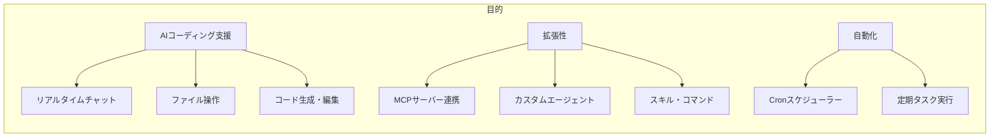
```mermaid
flowchart LR
    subgraph 目的
        A[AIコーディング支援] --> A1[リアルタイムチャット]
        A --> A2[ファイル操作]
        A --> A3[コード生成・編集]
        B[拡張性] --> B1[MCPサーバー連携]
        B --> B2[カスタムエージェント]
        B --> B3[スキル・コマンド]
        C[自動化] --> C1[Cronスケジューラー]
        C --> C2[定期タスク実行]
    end
```

---

## 2. システムアーキテクチャ

### 2.1 全体構成

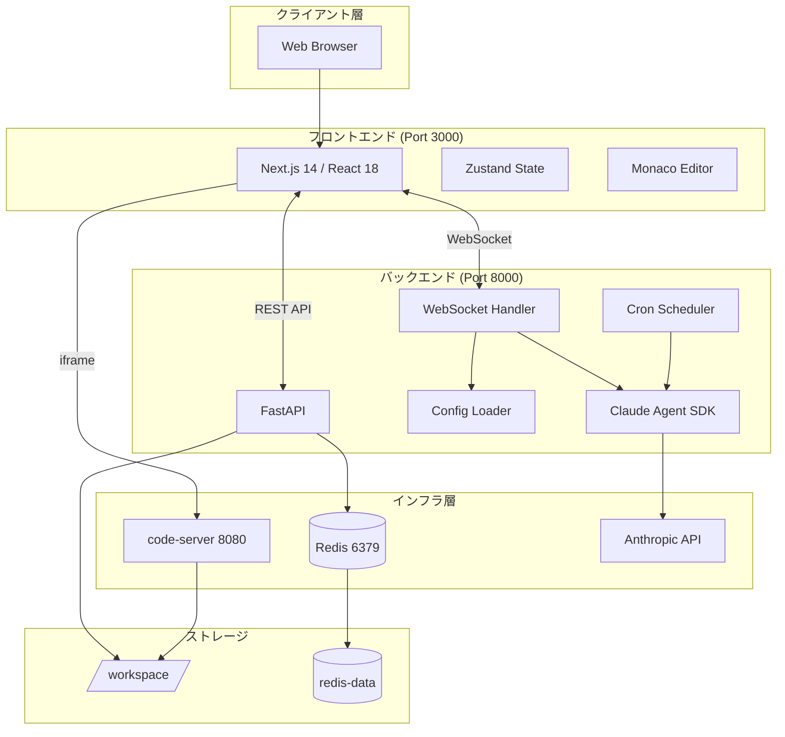
```mermaid
flowchart TB
    subgraph Client["クライアント層"]
        Browser[Web Browser]
    end

    subgraph Frontend["フロントエンド (Port 3000)"]
        NextJS[Next.js 14 / React 18]
        Zustand[Zustand State]
        Monaco[Monaco Editor]
    end

    subgraph Backend["バックエンド (Port 8000)"]
        FastAPI[FastAPI]
        WebSocket[WebSocket Handler]
        CronScheduler[Cron Scheduler]
        ConfigLoader[Config Loader]
        ClaudeSDK[Claude Agent SDK]
    end

    subgraph Infrastructure["インフラ層"]
        Redis[(Redis 6379)]
        CodeServer[code-server 8080]
        Anthropic[Anthropic API]
    end

    subgraph Storage["ストレージ"]
        Workspace[/workspace/]
        RedisData[(redis-data)]
    end

    Browser --> NextJS
    NextJS <-->|REST API| FastAPI
    NextJS <-->|WebSocket| WebSocket
    NextJS -->|iframe| CodeServer

    FastAPI --> Redis
    WebSocket --> ClaudeSDK
    WebSocket --> ConfigLoader
    CronScheduler --> ClaudeSDK
    ClaudeSDK --> Anthropic

    FastAPI --> Workspace
    CodeServer --> Workspace
    Redis --> RedisData
```

### 2.2 コンテナ構成

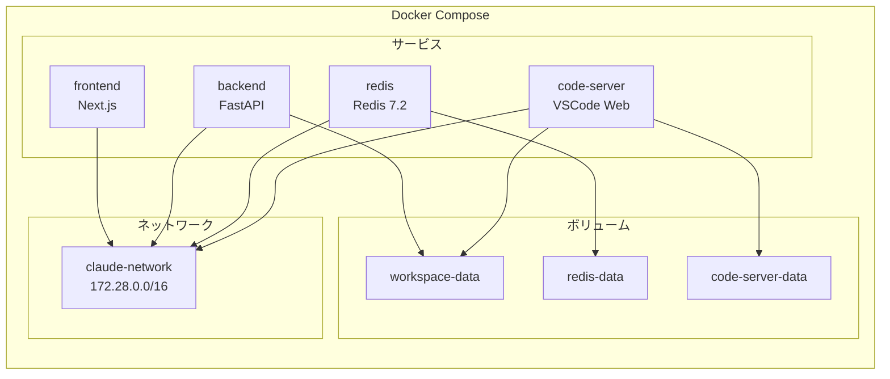
```mermaid
flowchart LR
    subgraph Docker["Docker Compose"]
        subgraph Services["サービス"]
            FE[frontend<br/>Next.js]
            BE[backend<br/>FastAPI]
            RD[redis<br/>Redis 7.2]
            CS[code-server<br/>VSCode Web]
        end

        subgraph Volumes["ボリューム"]
            WS[workspace-data]
            RDS[redis-data]
            CSD[code-server-data]
        end

        subgraph Network["ネットワーク"]
            NET[claude-network<br/>172.28.0.0/16]
        end
    end

    FE --> NET
    BE --> NET
    RD --> NET
    CS --> NET

    BE --> WS
    CS --> WS
    RD --> RDS
    CS --> CSD
```

---

## 3. コンポーネント設計

### 3.1 バックエンド構成

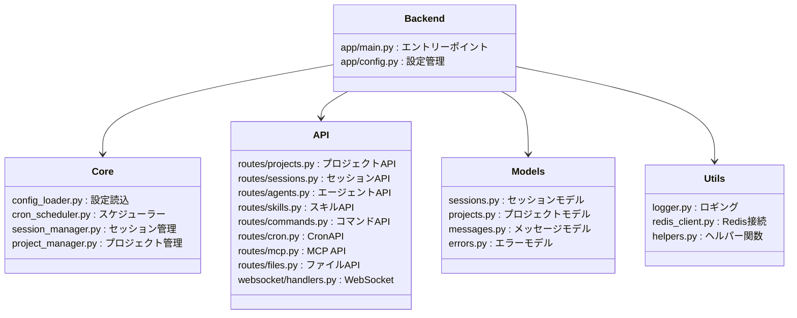
```mermaid
classDiagram
    class Backend {
        app/main.py : エントリーポイント
        app/config.py : 設定管理
    }

    class Core {
        config_loader.py : 設定読込
        cron_scheduler.py : スケジューラー
        session_manager.py : セッション管理
        project_manager.py : プロジェクト管理
    }

    class API {
        routes/projects.py : プロジェクトAPI
        routes/sessions.py : セッションAPI
        routes/agents.py : エージェントAPI
        routes/skills.py : スキルAPI
        routes/commands.py : コマンドAPI
        routes/cron.py : CronAPI
        routes/mcp.py : MCP API
        routes/files.py : ファイルAPI
        websocket/handlers.py : WebSocket
    }

    class Models {
        sessions.py : セッションモデル
        projects.py : プロジェクトモデル
        messages.py : メッセージモデル
        errors.py : エラーモデル
    }

    class Utils {
        logger.py : ロギング
        redis_client.py : Redis接続
        helpers.py : ヘルパー関数
    }

    Backend --> Core
    Backend --> API
    Backend --> Models
    Backend --> Utils
```

### 3.2 フロントエンド構成

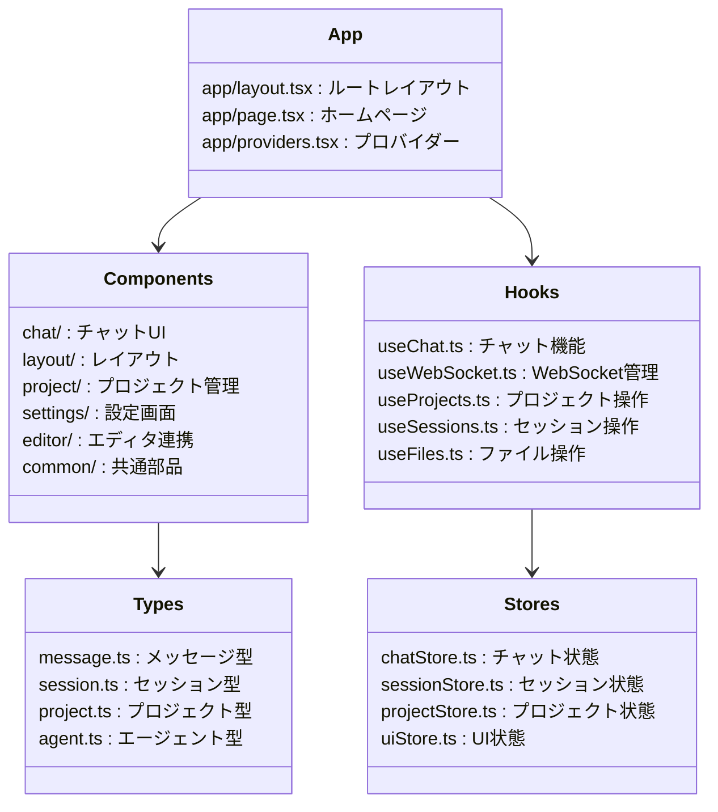
```mermaid
classDiagram
    class App {
        app/layout.tsx : ルートレイアウト
        app/page.tsx : ホームページ
        app/providers.tsx : プロバイダー
    }

    class Components {
        chat/ : チャットUI
        layout/ : レイアウト
        project/ : プロジェクト管理
        settings/ : 設定画面
        editor/ : エディタ連携
        common/ : 共通部品
    }

    class Hooks {
        useChat.ts : チャット機能
        useWebSocket.ts : WebSocket管理
        useProjects.ts : プロジェクト操作
        useSessions.ts : セッション操作
        useFiles.ts : ファイル操作
    }

    class Stores {
        chatStore.ts : チャット状態
        sessionStore.ts : セッション状態
        projectStore.ts : プロジェクト状態
        uiStore.ts : UI状態
    }

    class Types {
        message.ts : メッセージ型
        session.ts : セッション型
        project.ts : プロジェクト型
        agent.ts : エージェント型
    }

    App --> Components
    App --> Hooks
    Hooks --> Stores
    Components --> Types
```

---

## 4. データフロー

### 4.1 チャットメッセージフロー

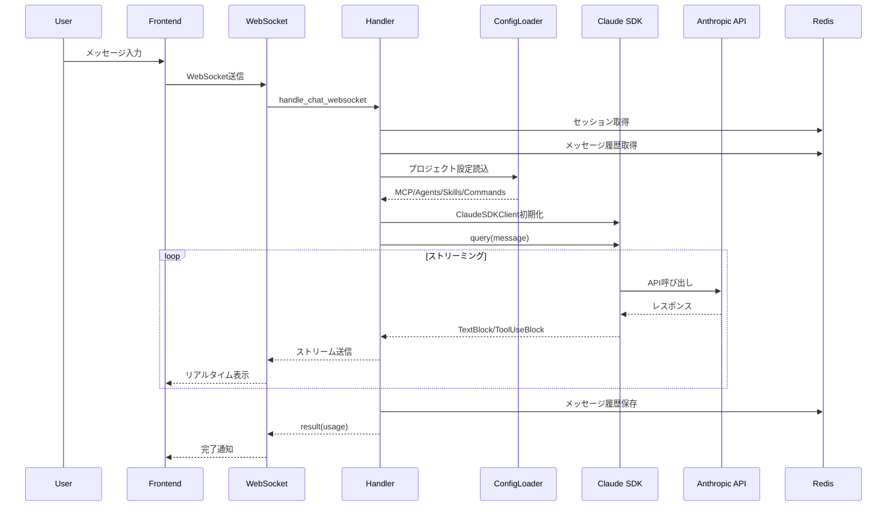
```mermaid
sequenceDiagram
    participant U as User
    participant FE as Frontend
    participant WS as WebSocket
    participant H as Handler
    participant CL as ConfigLoader
    participant SDK as Claude SDK
    participant API as Anthropic API
    participant RD as Redis

    U->>FE: メッセージ入力
    FE->>WS: WebSocket送信
    WS->>H: handle_chat_websocket

    H->>RD: セッション取得
    H->>RD: メッセージ履歴取得
    H->>CL: プロジェクト設定読込

    CL-->>H: MCP/Agents/Skills/Commands

    H->>SDK: ClaudeSDKClient初期化
    H->>SDK: query(message)

    loop ストリーミング
        SDK->>API: API呼び出し
        API-->>SDK: レスポンス
        SDK-->>H: TextBlock/ToolUseBlock
        H-->>WS: ストリーム送信
        WS-->>FE: リアルタイム表示
    end

    H->>RD: メッセージ履歴保存
    H-->>WS: result(usage)
    WS-->>FE: 完了通知
```

### 4.2 設定読込フロー

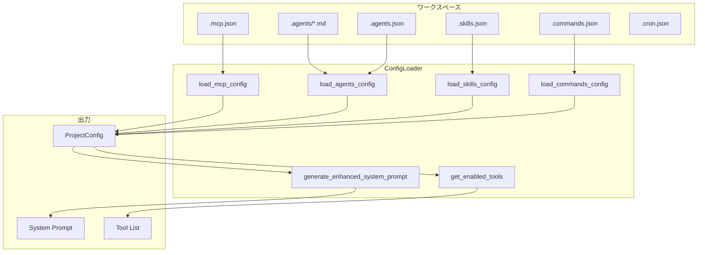
```mermaid
flowchart TB
    subgraph Workspace["ワークスペース"]
        MCP[.mcp.json]
        AGENTS[.agents/*.md]
        AGENTSJSON[.agents.json]
        SKILLS[.skills.json]
        COMMANDS[.commands.json]
        CRON[.cron.json]
    end

    subgraph ConfigLoader["ConfigLoader"]
        LoadMCP[load_mcp_config]
        LoadAgents[load_agents_config]
        LoadSkills[load_skills_config]
        LoadCommands[load_commands_config]
        GenPrompt[generate_enhanced_system_prompt]
        GetTools[get_enabled_tools]
    end

    subgraph Output["出力"]
        ProjectConfig[ProjectConfig]
        SystemPrompt[System Prompt]
        ToolList[Tool List]
    end

    MCP --> LoadMCP
    AGENTS --> LoadAgents
    AGENTSJSON --> LoadAgents
    SKILLS --> LoadSkills
    COMMANDS --> LoadCommands

    LoadMCP --> ProjectConfig
    LoadAgents --> ProjectConfig
    LoadSkills --> ProjectConfig
    LoadCommands --> ProjectConfig

    ProjectConfig --> GenPrompt
    ProjectConfig --> GetTools

    GenPrompt --> SystemPrompt
    GetTools --> ToolList
```

### 4.3 Cronスケジュール実行フロー

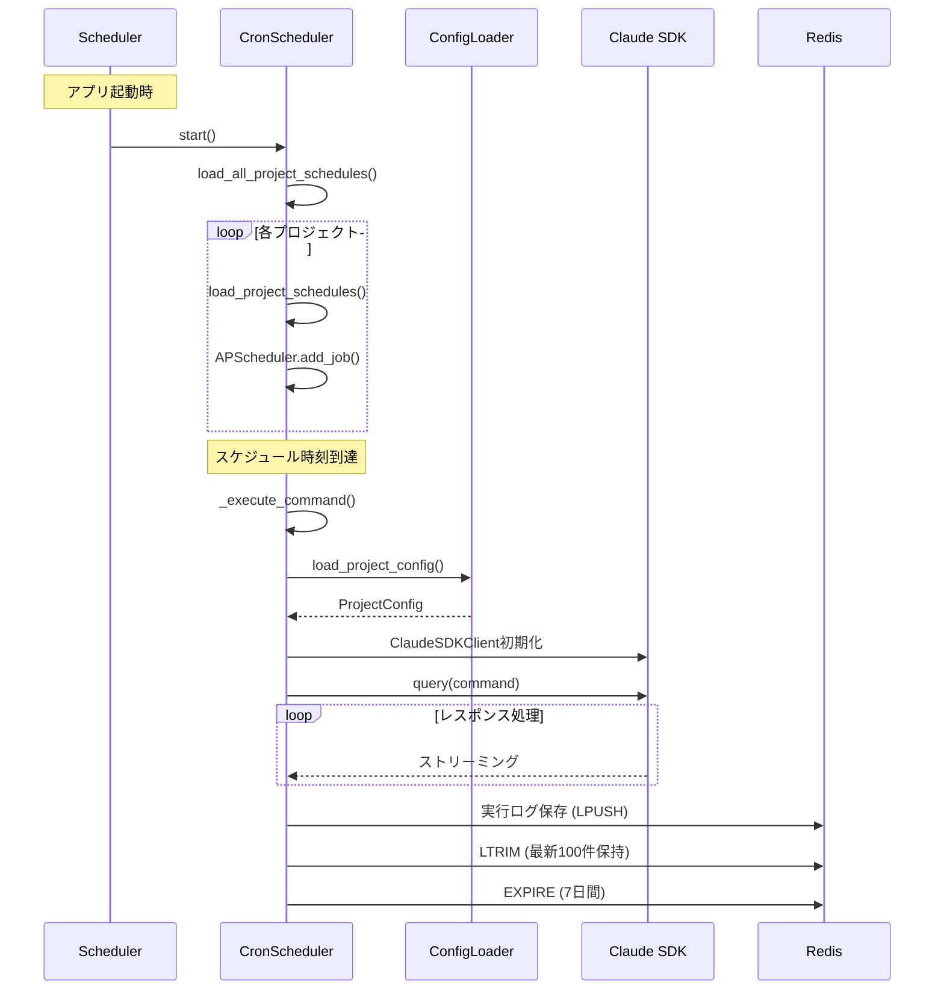
```mermaid
sequenceDiagram
    participant S as Scheduler
    participant CR as CronScheduler
    participant CL as ConfigLoader
    participant SDK as Claude SDK
    participant RD as Redis

    Note over S: アプリ起動時
    S->>CR: start()
    CR->>CR: load_all_project_schedules()

    loop 各プロジェクト
        CR->>CR: load_project_schedules()
        CR->>CR: APScheduler.add_job()
    end

    Note over CR: スケジュール時刻到達
    CR->>CR: _execute_command()
    CR->>CL: load_project_config()
    CL-->>CR: ProjectConfig

    CR->>SDK: ClaudeSDKClient初期化
    CR->>SDK: query(command)

    loop レスポンス処理
        SDK-->>CR: ストリーミング
    end

    CR->>RD: 実行ログ保存 (LPUSH)
    CR->>RD: LTRIM (最新100件保持)
    CR->>RD: EXPIRE (7日間)
```

---

## 5. API設計

### 5.1 REST API エンドポイント

```mermaid
flowchart LR
    subgraph Projects["プロジェクト /api/projects"]
        P1[POST / 作成]
        P2[GET / 一覧]
        P3[GET /:id 詳細]
        P4[PATCH /:id 更新]
        P5[DELETE /:id 削除]
    end

    subgraph Sessions["セッション /api/sessions"]
        S1[POST / 作成]
        S2[GET / 一覧]
        S3[GET /:id 詳細]
        S4[PATCH /:id 更新]
        S5[DELETE /:id 削除]
    end

    subgraph Config["設定 /api"]
        C1[/agents エージェント]
        C2[/skills スキル]
        C3[/commands コマンド]
        C4[/mcp MCPサーバー]
    end

    subgraph Cron["Cron /api/cron"]
        CR1[GET /projects/:id/schedules 一覧]
        CR2[POST /projects/:id/schedules 作成]
        CR3[PUT /.../schedules/:name 更新]
        CR4[DELETE /.../schedules/:name 削除]
        CR5[POST /.../schedules/:name/run 即時実行]
        CR6[GET /projects/:id/logs ログ]
        CR7[GET /presets プリセット]
    end
```

### 5.2 WebSocket メッセージ

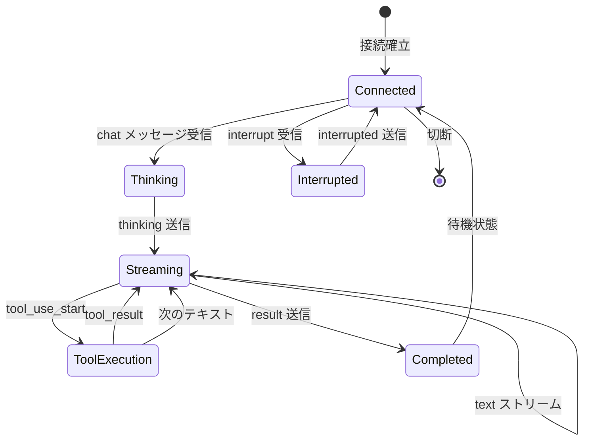
```mermaid
stateDiagram-v2
    [*] --> Connected: 接続確立

    Connected --> Thinking: chat メッセージ受信
    Thinking --> Streaming: thinking 送信

    Streaming --> Streaming: text ストリーム
    Streaming --> ToolExecution: tool_use_start

    ToolExecution --> Streaming: tool_result
    ToolExecution --> Streaming: 次のテキスト

    Streaming --> Completed: result 送信
    Completed --> Connected: 待機状態

    Connected --> Interrupted: interrupt 受信
    Interrupted --> Connected: interrupted 送信

    Connected --> [*]: 切断
```

---

## 6. 設定ファイル形式

### 6.1 MCPサーバー設定 (.mcp.json)

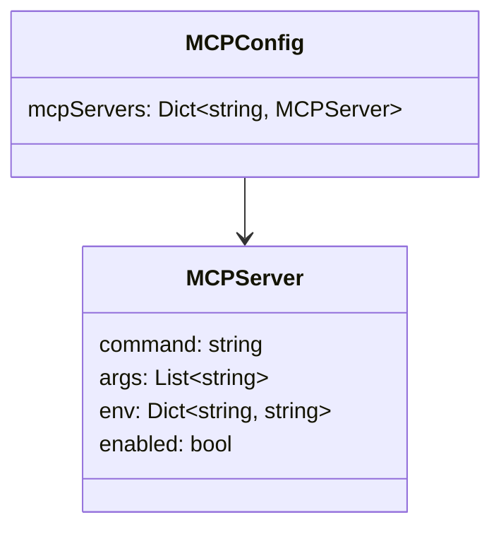
```mermaid
classDiagram
    class MCPConfig {
        mcpServers: Dict~string, MCPServer~
    }

    class MCPServer {
        command: string
        args: List~string~
        env: Dict~string, string~
        enabled: bool
    }

    MCPConfig --> MCPServer
```

### 6.2 エージェント設定 (.agents/*.md)

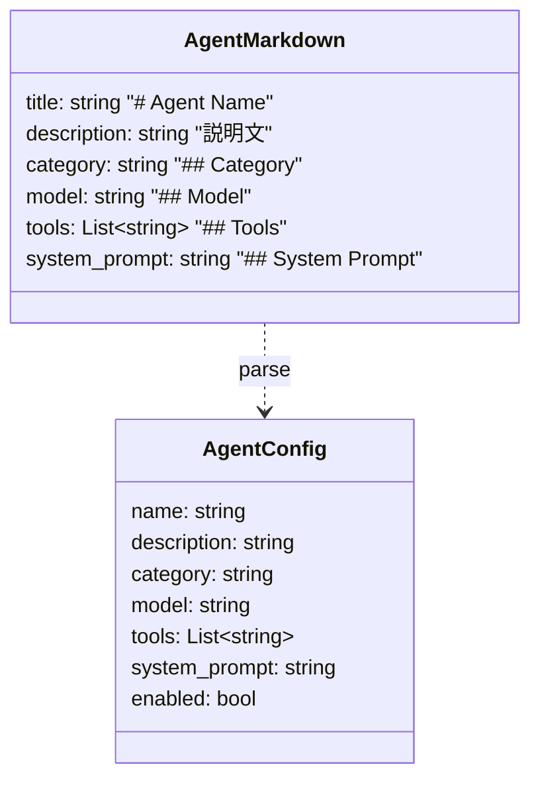
```mermaid
classDiagram
    class AgentMarkdown {
        title: string "# Agent Name"
        description: string "説明文"
        category: string "## Category"
        model: string "## Model"
        tools: List~string~ "## Tools"
        system_prompt: string "## System Prompt"
    }

    class AgentConfig {
        name: string
        description: string
        category: string
        model: string
        tools: List~string~
        system_prompt: string
        enabled: bool
    }

    AgentMarkdown ..> AgentConfig: parse
```

### 6.3 Cronスケジュール設定 (.cron.json)

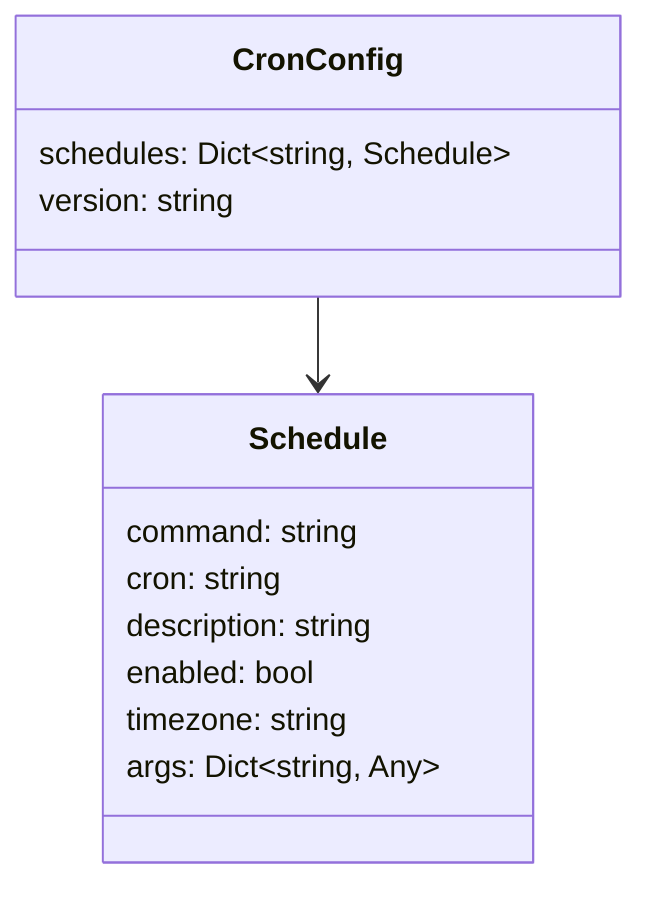
```mermaid
classDiagram
    class CronConfig {
        schedules: Dict~string, Schedule~
        version: string
    }

    class Schedule {
        command: string
        cron: string
        description: string
        enabled: bool
        timezone: string
        args: Dict~string, Any~
    }

    CronConfig --> Schedule
```

---

## 7. 技術スタック

### 7.1 バックエンド

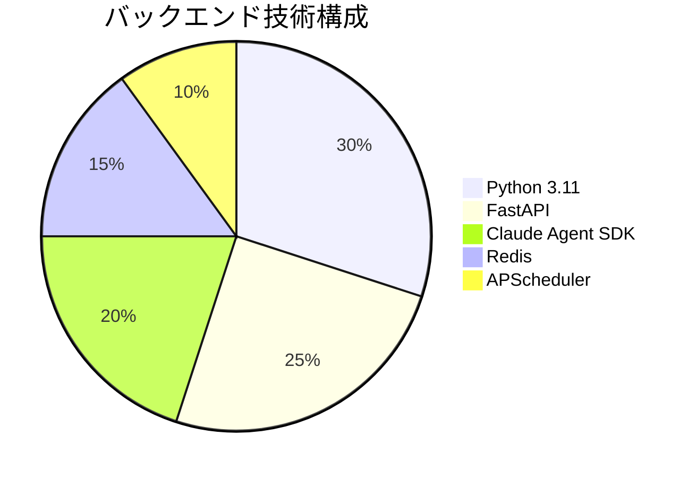
```mermaid
pie title バックエンド技術構成
    "Python 3.11" : 30
    "FastAPI" : 25
    "Claude Agent SDK" : 20
    "Redis" : 15
    "APScheduler" : 10
```

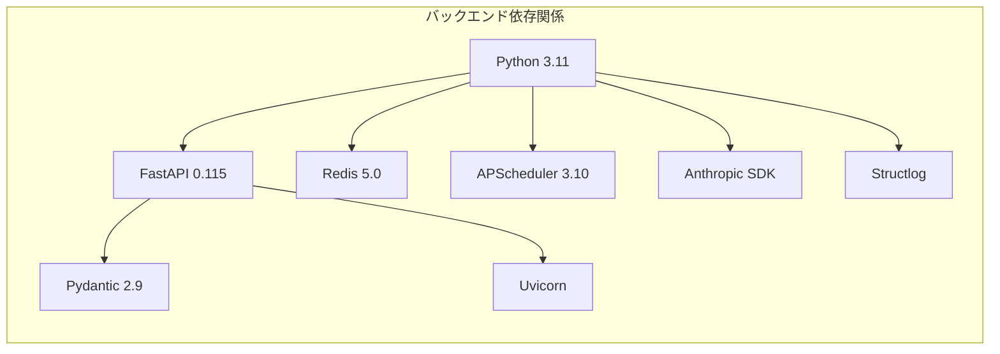
```mermaid
flowchart LR
    subgraph Backend["バックエンド依存関係"]
        PY[Python 3.11]
        FA[FastAPI 0.115]
        PD[Pydantic 2.9]
        RD[Redis 5.0]
        AP[APScheduler 3.10]
        AN[Anthropic SDK]
        UV[Uvicorn]
        SL[Structlog]
    end

    PY --> FA
    FA --> PD
    FA --> UV
    PY --> RD
    PY --> AP
    PY --> AN
    PY --> SL
```

### 7.2 フロントエンド

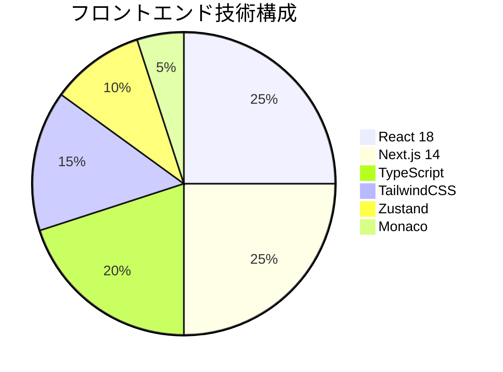
```mermaid
pie title フロントエンド技術構成
    "React 18" : 25
    "Next.js 14" : 25
    "TypeScript" : 20
    "TailwindCSS" : 15
    "Zustand" : 10
    "Monaco" : 5
```

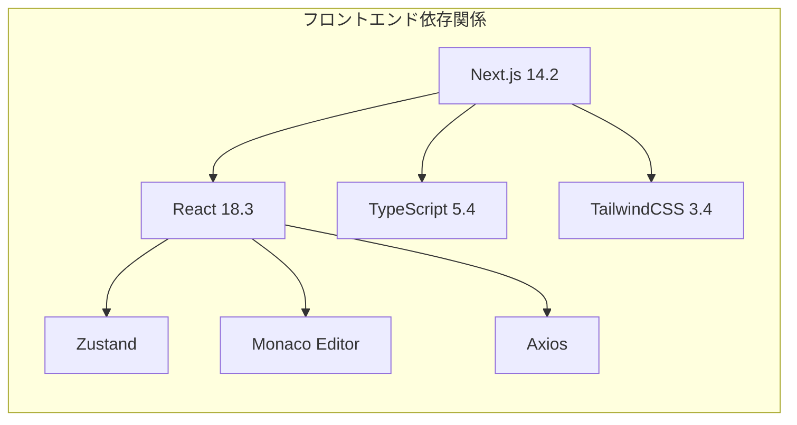
```mermaid
flowchart LR
    subgraph Frontend["フロントエンド依存関係"]
        NX[Next.js 14.2]
        RC[React 18.3]
        TS[TypeScript 5.4]
        TW[TailwindCSS 3.4]
        ZS[Zustand]
        MN[Monaco Editor]
        AX[Axios]
    end

    NX --> RC
    NX --> TS
    RC --> ZS
    RC --> MN
    NX --> TW
    RC --> AX
```

---

## 8. セキュリティ設計

### 8.1 セキュリティレイヤー

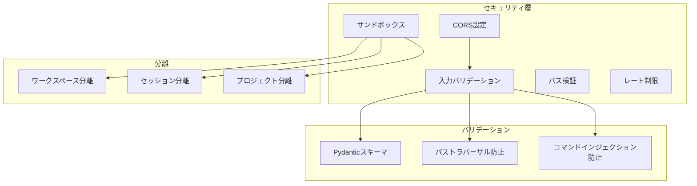
```mermaid
flowchart TB
    subgraph Security["セキュリティ層"]
        CORS[CORS設定]
        VAL[入力バリデーション]
        SANDBOX[サンドボックス]
        PATH[パス検証]
        LIMIT[レート制限]
    end

    subgraph Validation["バリデーション"]
        V1[Pydanticスキーマ]
        V2[パストラバーサル防止]
        V3[コマンドインジェクション防止]
    end

    subgraph Isolation["分離"]
        I1[ワークスペース分離]
        I2[セッション分離]
        I3[プロジェクト分離]
    end

    CORS --> VAL
    VAL --> V1
    VAL --> V2
    VAL --> V3

    SANDBOX --> I1
    SANDBOX --> I2
    SANDBOX --> I3
```

---

## 9. デプロイメント

### 9.1 環境変数

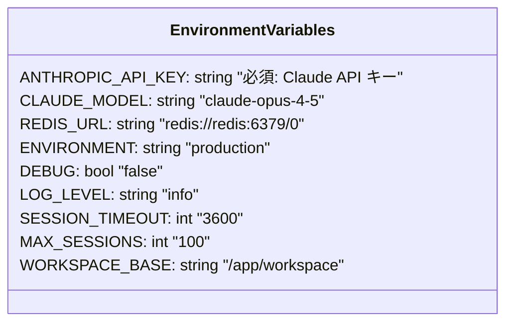
```mermaid
classDiagram
    class EnvironmentVariables {
        ANTHROPIC_API_KEY: string "必須: Claude API キー"
        CLAUDE_MODEL: string "claude-opus-4-5"
        REDIS_URL: string "redis://redis:6379/0"
        ENVIRONMENT: string "production"
        DEBUG: bool "false"
        LOG_LEVEL: string "info"
        SESSION_TIMEOUT: int "3600"
        MAX_SESSIONS: int "100"
        WORKSPACE_BASE: string "/app/workspace"
    }
```

### 9.2 リソース制限

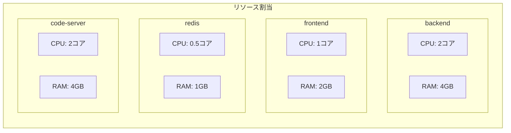
```mermaid
flowchart LR
    subgraph Resources["リソース割当"]
        subgraph Backend["backend"]
            BE_CPU[CPU: 2コア]
            BE_MEM[RAM: 4GB]
        end

        subgraph Frontend["frontend"]
            FE_CPU[CPU: 1コア]
            FE_MEM[RAM: 2GB]
        end

        subgraph Redis["redis"]
            RD_CPU[CPU: 0.5コア]
            RD_MEM[RAM: 1GB]
        end

        subgraph CodeServer["code-server"]
            CS_CPU[CPU: 2コア]
            CS_MEM[RAM: 4GB]
        end
    end
```

---

## 10. 拡張ポイント

### 10.1 カスタマイズ可能な要素

```mermaid
flowchart TB
    subgraph Extensibility["拡張ポイント"]
        MCP[MCPサーバー追加<br/>.mcp.json]
        AGENT[カスタムエージェント<br/>.agents/*.md]
        SKILL[カスタムスキル<br/>custom_skills/*.md]
        CMD[カスタムコマンド<br/>custom_commands/*.md]
        CRON[定期タスク<br/>.cron.json]
    end

    subgraph Usage["利用方法"]
        U1[外部ツール連携]
        U2[専門AIアシスタント]
        U3[ワークフロー自動化]
        U4[コマンドショートカット]
        U5[バッチ処理]
    end

    MCP --> U1
    AGENT --> U2
    SKILL --> U3
    CMD --> U4
    CRON --> U5
```

---

## 11. ファイル構成

```mermaid
classDiagram
    class ProjectRoot {
        docker-compose.yml : コンテナ定義
        .env : 環境変数
        CLAUDE.md : プロジェクト設定
    }

    class SrcBackend {
        app/main.py : エントリー
        app/config.py : 設定
        app/core/ : コアロジック
        app/api/ : APIエンドポイント
        app/models/ : データモデル
        app/utils/ : ユーティリティ
        requirements.txt : 依存関係
        Dockerfile : ビルド定義
    }

    class SrcFrontend {
        src/app/ : Next.jsアプリ
        src/components/ : UIコンポーネント
        src/hooks/ : カスタムフック
        src/stores/ : 状態管理
        src/types/ : 型定義
        package.json : 依存関係
        Dockerfile : ビルド定義
    }

    class Workspace {
        project-id/ : プロジェクト
        .mcp.json : MCP設定
        .agents/ : エージェント
        .cron.json : スケジュール
    }

    ProjectRoot --> SrcBackend
    ProjectRoot --> SrcFrontend
    ProjectRoot --> Workspace
```

---

## 改訂履歴

```mermaid
gitGraph
    commit id: "v1.0.0" tag: "初版作成"
    commit id: "MCP対応"
    commit id: "Agent対応"
    commit id: "Skill/Command対応"
    commit id: "v1.1.0" tag: "Cron対応"
```

| バージョン | 日付 | 変更内容 |
|-----------|------|----------|
| 1.0.0 | 2024-12 | 初版作成 |
| 1.1.0 | 2025-12 | Cronスケジューラー追加 |
