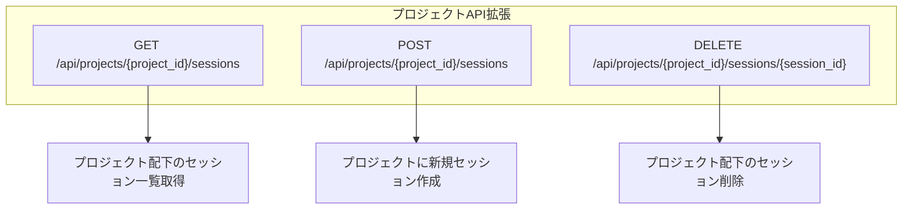
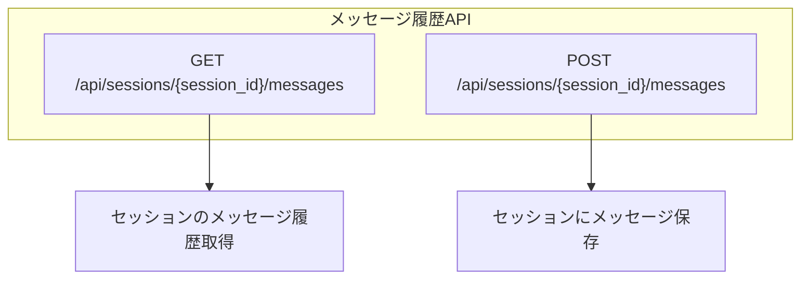
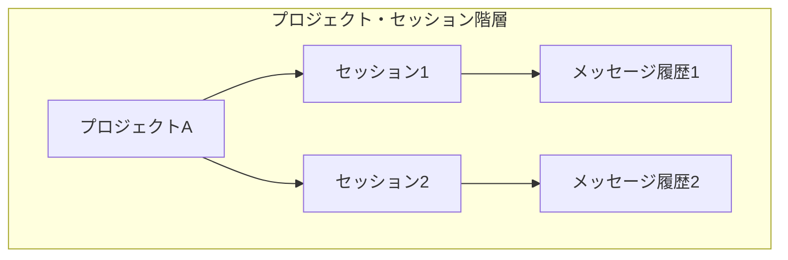
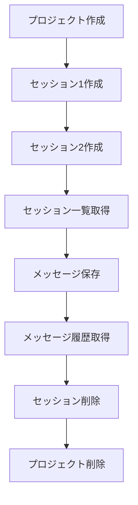
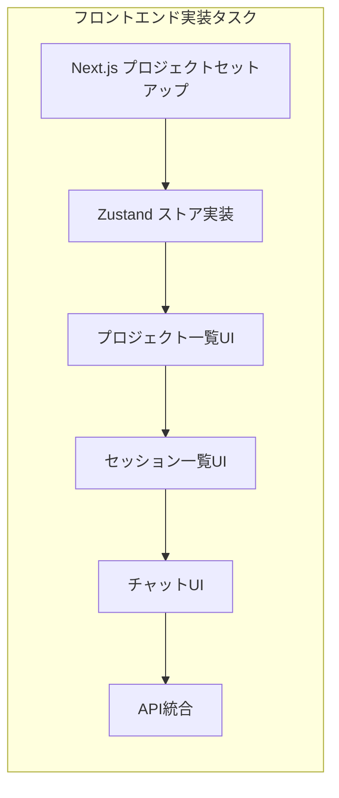

# Phase 2 実装完了レポート

**実装日:** 2025-12-21
**対象:** Web版Claude Code - プロジェクト/セッション管理機能
**ステータス:** バックエンドAPI完成

---

## 実装内容

### 1. プロジェクト管理API拡張

#### 新規エンドポイント



#### 実装ファイル
- `/Users/t.hirai/AGENTSDK/src/backend/app/api/routes/projects.py`

#### 追加機能
1. **プロジェクト配下のセッション一覧取得**
   - エンドポイント: `GET /api/projects/{project_id}/sessions`
   - プロジェクト存在確認
   - セッション一覧を返却（ページネーション対応）

2. **プロジェクト配下にセッション作成**
   - エンドポイント: `POST /api/projects/{project_id}/sessions`
   - プロジェクト存在確認
   - セッション作成
   - プロジェクトのセッション数を自動インクリメント

3. **プロジェクト配下のセッション削除**
   - エンドポイント: `DELETE /api/projects/{project_id}/sessions/{session_id}`
   - セッション所属確認
   - セッション削除
   - プロジェクトのセッション数を自動デクリメント

---

### 2. メッセージ履歴機能

#### 新規エンドポイント



#### 実装ファイル
- `/Users/t.hirai/AGENTSDK/src/backend/app/api/routes/sessions.py`
- `/Users/t.hirai/AGENTSDK/src/backend/app/core/session_manager.py`

#### SessionManager拡張

```python
# 新規追加メソッド
async def save_message(
    session_id: str,
    role: MessageRole,
    content: str,
    tokens: Optional[int]
) -> ChatMessage

async def get_messages(
    session_id: str,
    limit: Optional[int],
    offset: int
) -> List[ChatMessage]

async def delete_messages(session_id: str) -> None
```

#### データ構造

Redisキー構造:
```
messages:{session_id}  # Redisリスト構造で時系列保存
- message_1 (JSON)
- message_2 (JSON)
- message_3 (JSON)
...
```

---

### 3. スキーマ拡張

#### リクエストスキーマ

`/Users/t.hirai/AGENTSDK/src/backend/app/schemas/request.py`

```python
class SaveMessageRequest(BaseModel):
    """メッセージ保存リクエスト"""
    role: str  # user/assistant
    content: str
    tokens: Optional[int]
```

#### レスポンススキーマ

`/Users/t.hirai/AGENTSDK/src/backend/app/schemas/response.py`

```python
class ChatMessageResponse(BaseModel):
    """チャットメッセージレスポンス"""
    id: str
    session_id: str
    role: str
    content: str
    tokens: Optional[int]
    created_at: str

class MessageHistoryResponse(BaseModel):
    """メッセージ履歴レスポンス"""
    messages: List[ChatMessageResponse]
    total: int
    session_id: str
```

---

## API仕様

### プロジェクト配下のセッション管理

#### 1. セッション一覧取得

```http
GET /api/projects/{project_id}/sessions?limit=50&offset=0
```

**レスポンス例:**
```json
{
  "sessions": [
    {
      "id": "sess_abc123",
      "project_id": "proj_xyz789",
      "name": "API設計の相談",
      "status": "active",
      "message_count": 15,
      "created_at": "2025-12-21T10:30:00Z"
    }
  ],
  "total": 1,
  "limit": 50,
  "offset": 0
}
```

#### 2. セッション作成

```http
POST /api/projects/{project_id}/sessions
Content-Type: application/json

{
  "name": "新規セッション",
  "user_id": "user_123",
  "model": "claude-opus-4-5"
}
```

**レスポンス:** 作成されたセッション情報

#### 3. セッション削除

```http
DELETE /api/projects/{project_id}/sessions/{session_id}
```

**レスポンス:** 204 No Content

---

### メッセージ履歴管理

#### 1. メッセージ履歴取得

```http
GET /api/sessions/{session_id}/messages?limit=100&offset=0
```

**レスポンス例:**
```json
{
  "session_id": "sess_abc123",
  "messages": [
    {
      "id": "msg_001",
      "session_id": "sess_abc123",
      "role": "user",
      "content": "こんにちは",
      "tokens": 5,
      "created_at": "2025-12-21T10:30:00Z"
    },
    {
      "id": "msg_002",
      "session_id": "sess_abc123",
      "role": "assistant",
      "content": "こんにちは！どのようにお手伝いできますか？",
      "tokens": 15,
      "created_at": "2025-12-21T10:30:05Z"
    }
  ],
  "total": 2
}
```

#### 2. メッセージ保存

```http
POST /api/sessions/{session_id}/messages
Content-Type: application/json

{
  "role": "user",
  "content": "プロジェクトの構造を教えてください",
  "tokens": 10
}
```

**レスポンス:** 保存されたメッセージ情報

---

## データフロー



### Redisデータ構造

```
project:{project_id}           # プロジェクト情報 (JSON)
session:{session_id}           # セッション情報 (JSON)
messages:{session_id}          # メッセージ履歴 (Redis List)
```

---

## テスト方法

### 1. バックエンドサーバー起動

```bash
cd /Users/t.hirai/AGENTSDK/src/backend
docker-compose up -d redis
uvicorn app.main:app --reload
```

### 2. API動作確認

```bash
python test_phase2_api.py
```

### テストシナリオ



---

## 次のステップ

### フロントエンド実装



### 優先順位

1. **最高優先度**
   - Next.jsプロジェクトセットアップ
   - 基本レイアウト実装
   - プロジェクト管理UI

2. **高優先度**
   - セッション管理UI
   - チャットコンテナ
   - API統合

3. **中優先度**
   - エディタ統合
   - WebSocket接続
   - レスポンシブデザイン

---

## 実装済みAPI一覧

### プロジェクトAPI

| メソッド | エンドポイント | 説明 | ステータス |
|---------|--------------|------|----------|
| POST | `/api/projects` | プロジェクト作成 | ✅ |
| GET | `/api/projects` | プロジェクト一覧 | ✅ |
| GET | `/api/projects/{id}` | プロジェクト取得 | ✅ |
| PUT | `/api/projects/{id}` | プロジェクト更新 | ✅ |
| DELETE | `/api/projects/{id}` | プロジェクト削除 | ✅ |
| GET | `/api/projects/{id}/sessions` | プロジェクト配下のセッション一覧 | ✅ |
| POST | `/api/projects/{id}/sessions` | プロジェクト配下にセッション作成 | ✅ |
| DELETE | `/api/projects/{id}/sessions/{sid}` | プロジェクト配下のセッション削除 | ✅ |

### セッションAPI

| メソッド | エンドポイント | 説明 | ステータス |
|---------|--------------|------|----------|
| POST | `/api/sessions` | セッション作成 | ✅ |
| GET | `/api/sessions` | セッション一覧 | ✅ |
| GET | `/api/sessions/{id}` | セッション取得 | ✅ |
| PUT | `/api/sessions/{id}` | セッション更新 | ✅ |
| POST | `/api/sessions/{id}/close` | セッションクローズ | ✅ |
| DELETE | `/api/sessions/{id}` | セッション削除 | ✅ |
| GET | `/api/sessions/{id}/messages` | メッセージ履歴取得 | ✅ |
| POST | `/api/sessions/{id}/messages` | メッセージ保存 | ✅ |

---

## 変更ファイル一覧

### 新規作成
- `/Users/t.hirai/AGENTSDK/src/backend/test_phase2_api.py`
- `/Users/t.hirai/AGENTSDK/doc/phase2-implementation-summary.md`

### 更新
- `/Users/t.hirai/AGENTSDK/src/backend/app/api/routes/projects.py`
  - プロジェクト配下のセッション管理エンドポイント追加
- `/Users/t.hirai/AGENTSDK/src/backend/app/api/routes/sessions.py`
  - メッセージ履歴エンドポイント追加
- `/Users/t.hirai/AGENTSDK/src/backend/app/core/session_manager.py`
  - メッセージ保存/取得/削除メソッド追加
- `/Users/t.hirai/AGENTSDK/src/backend/app/schemas/request.py`
  - `SaveMessageRequest` スキーマ追加
- `/Users/t.hirai/AGENTSDK/src/backend/app/schemas/response.py`
  - `ChatMessageResponse`, `MessageHistoryResponse` スキーマ追加

---

## まとめ

Phase 2のバックエンドAPI実装が完了しました。

### 完成した機能

1. プロジェクト階層構造管理
   - 1プロジェクト : N セッション
   - プロジェクト配下のセッション一覧取得
   - セッション数の自動管理

2. メッセージ履歴管理
   - セッションごとのメッセージ保存
   - メッセージ履歴取得（ページネーション対応）
   - セッション削除時のメッセージ自動削除

3. データ整合性
   - プロジェクト削除時のセッション連鎖削除
   - セッション数の自動カウント
   - 適切なエラーハンドリング

### 次のアクション

フロントエンド実装を開始してください:

```bash
# フロントエンドプロジェクト作成
cd /Users/t.hirai/AGENTSDK/src
npx create-next-app@latest frontend --typescript --tailwind --app
```

設計書に基づいて、プロジェクト/セッション管理UIを実装してください。
