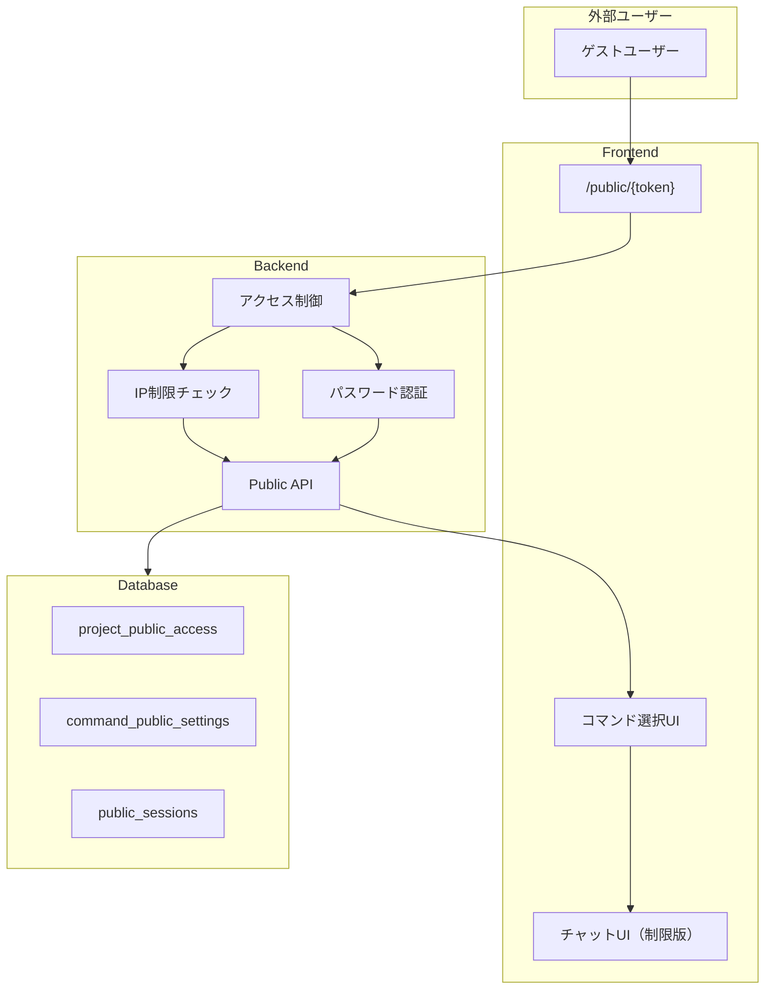
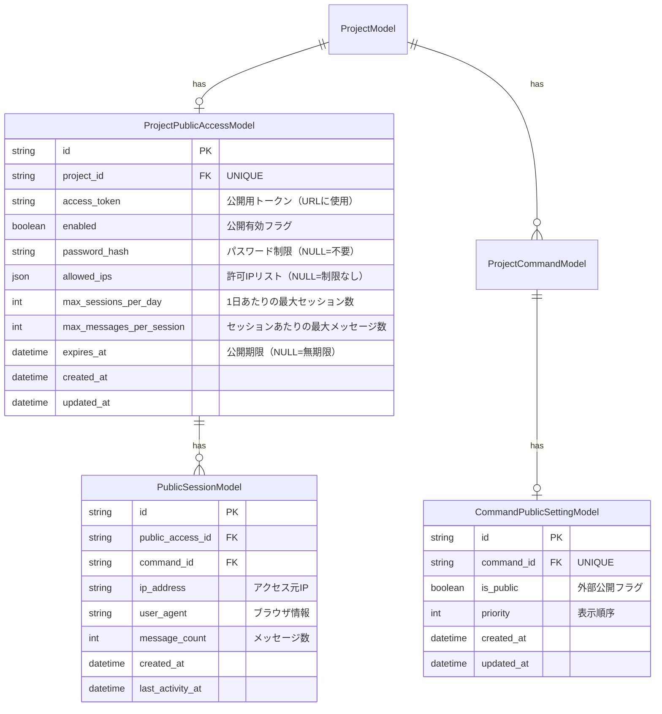
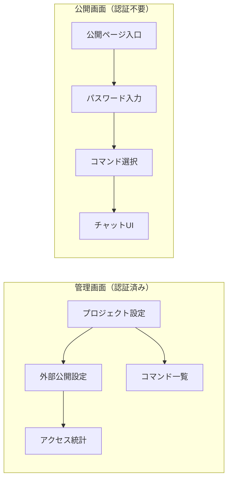
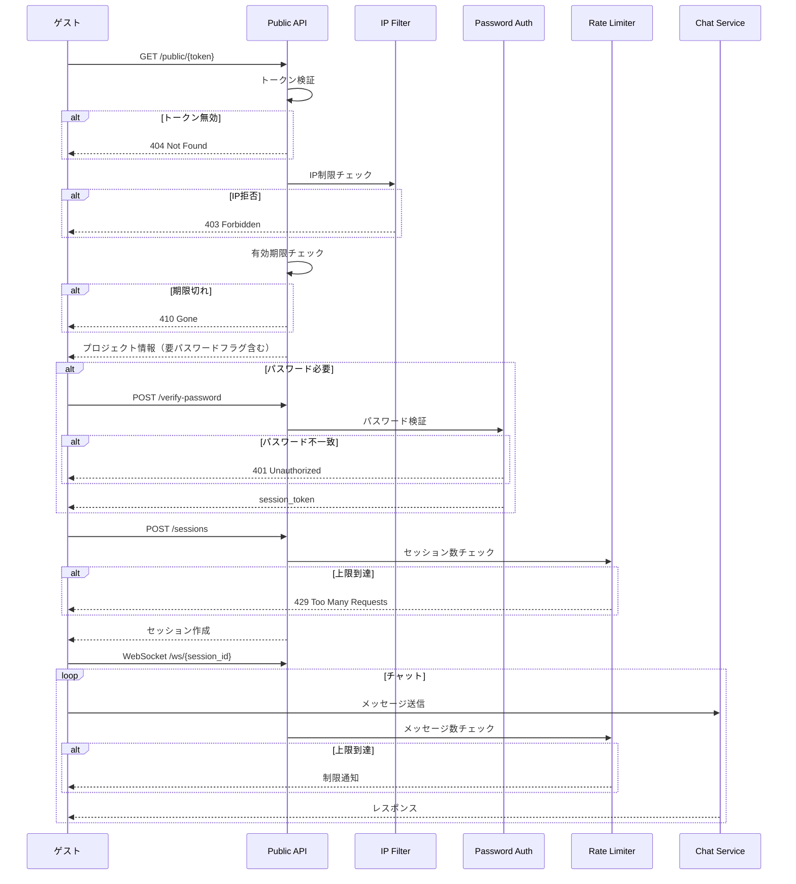

# プロジェクト外部公開機能 設計書

## 概要

プロジェクトのコマンド機能を外部（ログイン不要）に公開する機能。
公開単位はプロジェクトだが、利用単位はコマンド。

### 機能要件

| 項目 | 説明 |
|------|------|
| 公開単位 | プロジェクト単位で公開設定 |
| 利用単位 | コマンド単位（公開コマンドのみ利用可能） |
| 認証 | ログイン不要（ゲストアクセス） |
| 制限 | IP制限、パスワード保護 |
| 機能 | チャット部分のみ公開（設定画面等は非公開） |

### 実装済み機能一覧

| 機能 | 説明 | 状態 |
|------|------|------|
| URL発行 | 共有URL生成、ワンクリックでコピー | ✅ 実装済 |
| パスワード保護 | オプションのパスワード認証 | ✅ 実装済 |
| IP制限 | CIDR対応の複数IP許可設定 | ✅ 実装済 |
| 現在のIP取得 | ワンクリックで現在のIPアドレスを入力 | ✅ 実装済 |
| コマンド公開設定 | コマンド単位の公開ON/OFF（トグル） | ✅ 実装済 |
| 共有の停止/再開 | 一時的な共有の停止と再開 | ✅ 実装済 |
| URL再発行 | アクセストークンの再生成 | ✅ 実装済 |
| 外部共有削除 | 公開設定の完全削除 | ✅ 実装済 |
| コマンド選択必須 | 初回設定時にコマンド選択が必須 | ✅ 実装済 |
| 機能説明 | 外部共有機能の説明表示 | ✅ 実装済 |

---

## システムアーキテクチャ



---

## データモデル

### ER図



### テーブル定義

#### project_public_access（プロジェクト外部公開設定）

| カラム | 型 | NULL | 説明 |
|--------|-----|------|------|
| id | VARCHAR(36) | NO | 主キー（UUID） |
| project_id | VARCHAR(36) | NO | プロジェクトID（UNIQUE） |
| access_token | VARCHAR(64) | NO | 公開用トークン（URL用、UNIQUE） |
| enabled | BOOLEAN | NO | 公開有効フラグ |
| password_hash | VARCHAR(255) | YES | パスワードハッシュ（NULL=不要） |
| allowed_ips | JSON | YES | 許可IPリスト（NULL=制限なし） |
| max_sessions_per_day | INT | YES | 1日あたり最大セッション数（NULL=無制限） |
| max_messages_per_session | INT | YES | セッションあたり最大メッセージ数（NULL=無制限） |
| expires_at | DATETIME | YES | 公開期限（NULL=無期限） |
| created_at | DATETIME | NO | 作成日時 |
| updated_at | DATETIME | NO | 更新日時 |

#### command_public_settings（コマンド公開設定）

| カラム | 型 | NULL | 説明 |
|--------|-----|------|------|
| id | VARCHAR(36) | NO | 主キー（UUID） |
| command_id | VARCHAR(36) | NO | コマンドID（UNIQUE） |
| is_public | BOOLEAN | NO | 外部公開フラグ（デフォルト: false） |
| priority | INT | NO | 表示優先順位（小さいほど優先） |
| created_at | DATETIME | NO | 作成日時 |
| updated_at | DATETIME | NO | 更新日時 |

#### public_sessions（外部公開セッション）

| カラム | 型 | NULL | 説明 |
|--------|-----|------|------|
| id | VARCHAR(36) | NO | 主キー（UUID） |
| public_access_id | VARCHAR(36) | NO | 外部公開設定ID |
| command_id | VARCHAR(36) | NO | 使用コマンドID |
| ip_address | VARCHAR(45) | NO | アクセス元IP |
| user_agent | VARCHAR(500) | YES | ブラウザ情報 |
| message_count | INT | NO | メッセージ数 |
| created_at | DATETIME | NO | 作成日時 |
| last_activity_at | DATETIME | NO | 最終アクティビティ日時 |

---

## API設計

### エンドポイント一覧

#### 管理API（認証必須）

| メソッド | エンドポイント | 説明 |
|----------|---------------|------|
| GET | `/api/projects/{id}/public-access` | 外部公開設定取得 |
| POST | `/api/projects/{id}/public-access` | 外部公開設定作成 |
| PUT | `/api/projects/{id}/public-access` | 外部公開設定更新 |
| DELETE | `/api/projects/{id}/public-access` | 外部公開設定削除 |
| POST | `/api/projects/{id}/public-access/regenerate-token` | トークン再生成 |
| GET | `/api/projects/{id}/commands/{cmd_id}/public-setting` | コマンド公開設定取得 |
| PUT | `/api/projects/{id}/commands/{cmd_id}/public-setting` | コマンド公開設定更新 |
| GET | `/api/projects/{id}/public-access/sessions` | 外部セッション一覧 |
| GET | `/api/projects/{id}/public-access/stats` | アクセス統計 |

#### 公開API（認証不要）

| メソッド | エンドポイント | 説明 |
|----------|---------------|------|
| GET | `/api/public/{token}` | 公開プロジェクト情報取得 |
| POST | `/api/public/{token}/verify-password` | パスワード認証 |
| GET | `/api/public/{token}/commands` | 公開コマンド一覧 |
| POST | `/api/public/{token}/sessions` | 公開セッション作成 |
| WebSocket | `/api/public/{token}/ws/{session_id}` | チャットWebSocket |

### API詳細

#### GET /api/public/{token}

公開プロジェクト情報を取得（パスワード認証前でもアクセス可能な情報のみ）

**リクエスト**
- Path: `token` - アクセストークン
- Header: `X-Forwarded-For` または `X-Real-IP` - クライアントIP

**レスポンス**
```json
{
  "project_name": "My Project",
  "description": "Project description",
  "requires_password": true,
  "is_accessible": true,
  "error": null
}
```

**エラーケース**

| ステータス | 条件 |
|-----------|------|
| 404 | トークンが無効 |
| 403 | IP制限で拒否 |
| 410 | 公開期限切れ |
| 503 | 本日の上限到達 |

#### POST /api/public/{token}/verify-password

パスワード認証（パスワード設定時のみ必要）

**リクエスト**
```json
{
  "password": "secret123"
}
```

**レスポンス**
```json
{
  "verified": true,
  "session_token": "eyJhbGciOiJIUzI1NiIs..."
}
```

**注意**: session_token はCookieまたはlocalStorageに保存し、以降のリクエストで使用

#### GET /api/public/{token}/commands

公開コマンド一覧取得

**ヘッダー**
- `Authorization: Bearer {session_token}` （パスワード認証後）

**レスポンス**
```json
{
  "commands": [
    {
      "id": "cmd-123",
      "name": "translate",
      "description": "テキストを翻訳します"
    },
    {
      "id": "cmd-456",
      "name": "summarize",
      "description": "文章を要約します"
    }
  ]
}
```

#### POST /api/public/{token}/sessions

公開セッション作成

**リクエスト**
```json
{
  "command_id": "cmd-123"
}
```

**レスポンス**
```json
{
  "session_id": "pub-sess-789",
  "command": {
    "id": "cmd-123",
    "name": "translate",
    "content": "..."
  },
  "limits": {
    "max_messages": 10,
    "remaining_messages": 10
  }
}
```

---

## フロントエンド設計

### 画面構成



### 公開ページURL構造

| URL | 説明 |
|-----|------|
| `/public/{token}` | 公開ページ入口 |
| `/public/{token}/chat` | チャット画面 |

### 管理画面コンポーネント

#### 外部公開設定パネル（実装済みUI）

##### 初回設定画面（コマンドなし）

```
┌─────────────────────────────────────────────────────────┐
│                        ⚠️                               │
│               コマンドがありません                        │
│                                                         │
│       外部共有するには、まずコマンドを作成してください。    │
│       コマンドは外部ユーザーが実行できる機能です。         │
└─────────────────────────────────────────────────────────┘
```

##### 初回設定画面（コマンドあり）

```
┌─────────────────────────────────────────────────────────┐
│ ℹ️ 外部共有について                                      │
├─────────────────────────────────────────────────────────┤
│ URLを発行すると、ログインなしでブラウザからアクセスでき    │
│ るようになります。選択したコマンドのみが外部ユーザーに     │
│ 公開され、実行可能になります。                            │
├─────────────────────────────────────────────────────────┤
│ 公開するコマンドを選択                        [必須]     │
│ ─────────────────────────────────────────────────────── │
│ コマンド名1                                [●──] OFF    │
│ コマンドの説明...                                        │
│ ─────────────────────────────────────────────────────── │
│ コマンド名2                                [──●] ON     │
│ コマンドの説明...                                        │
├─────────────────────────────────────────────────────────┤
│ [コマンドを選択してください]  (無効)                      │
│         ↓ 1件以上選択後                                 │
│ [共有URLを取得]  (有効)                                  │
└─────────────────────────────────────────────────────────┘
```

##### 設定済み画面

```
┌─────────────────────────────────────────────────────────┐
│ ● 共有中                                    [停止]      │
│ ┌─────────────────────────────────────────────────────┐ │
│ │ https://example.com/public/abc123...       [コピー] │ │
│ └─────────────────────────────────────────────────────┘ │
├─────────────────────────────────────────────────────────┤
│ パスワード保護                              [設定済]     │
│ [____________] [設定/解除]                              │
├─────────────────────────────────────────────────────────┤
│ IP制限                                    [2件設定済]   │
│ 指定したIPアドレスからのみアクセスを許可します。          │
│ 未設定の場合は全てのIPからアクセス可能です。              │
│                                                         │
│ [________________] [現在のIP] [追加]                    │
│                                                         │
│ 指定中のIPアドレス                                       │
│ ┌─────────────────────────────────────────┐             │
│ │ 192.168.1.100                   [削除]  │             │
│ └─────────────────────────────────────────┘             │
│ ┌─────────────────────────────────────────┐             │
│ │ 10.0.0.0/24                     [削除]  │             │
│ └─────────────────────────────────────────┘             │
│                                                         │
│ ※ IPが0件の場合:                                        │
│ ┌─────────────────────────────────────────┐             │
│ │ IPアドレスが指定されていません            │             │
│ │ （全てのIPからアクセス可能）              │             │
│ └─────────────────────────────────────────┘             │
├─────────────────────────────────────────────────────────┤
│ 公開コマンド                                             │
│ ─────────────────────────────────────────────────────── │
│ コマンド名1                                [──●] ON     │
│ コマンドの説明...                                        │
│ ─────────────────────────────────────────────────────── │
│ コマンド名2                                [●──] OFF    │
│ コマンドの説明...                                        │
├─────────────────────────────────────────────────────────┤
│ 詳細設定                                          ▼     │
│   URLを再発行                                           │
│   外部共有を削除                                        │
└─────────────────────────────────────────────────────────┘
```

#### コマンド公開設定

```
┌─────────────────────────────────────────────────────────┐
│ コマンド一覧                                             │
├─────────────────────────────────────────────────────────┤
│ ┌───┬────────────┬────────────────────┬────────┬──────┐ │
│ │ # │ コマンド名  │ 説明               │ 外部公開 │ 順序 │ │
│ ├───┼────────────┼────────────────────┼────────┼──────┤ │
│ │ 1 │ translate  │ テキストを翻訳     │ ☑      │ [1]  │ │
│ │ 2 │ summarize  │ 文章を要約         │ ☑      │ [2]  │ │
│ │ 3 │ code-review│ コードレビュー     │ ☐      │ [-]  │ │
│ │ 4 │ debug      │ デバッグ支援       │ ☐      │ [-]  │ │
│ └───┴────────────┴────────────────────┴────────┴──────┘ │
│                                                         │
│ ※ 外部公開にチェックを入れたコマンドのみ公開されます      │
└─────────────────────────────────────────────────────────┘
```

### 公開画面コンポーネント

#### 公開ページ入口

```
┌─────────────────────────────────────────────────────────┐
│                                                         │
│                    ┌──────────────┐                     │
│                    │   🤖 Logo    │                     │
│                    └──────────────┘                     │
│                                                         │
│                    My Project Name                      │
│                                                         │
│              このプロジェクトの説明文が                   │
│              ここに表示されます。                         │
│                                                         │
│           ┌─────────────────────────────┐               │
│           │ パスワードを入力してください  │               │
│           │ ┌───────────────────────┐   │               │
│           │ │ ••••••••••            │   │               │
│           │ └───────────────────────┘   │               │
│           │                             │               │
│           │      [アクセスする]          │               │
│           └─────────────────────────────┘               │
│                                                         │
│                                                         │
└─────────────────────────────────────────────────────────┘
```

#### コマンド選択画面

```
┌─────────────────────────────────────────────────────────┐
│                                                         │
│                   利用するサービスを選択                  │
│                                                         │
│   ┌─────────────────────────────────────────────────┐   │
│   │  📝 翻訳                                         │   │
│   │  テキストを日本語から英語に翻訳します              │   │
│   └─────────────────────────────────────────────────┘   │
│                                                         │
│   ┌─────────────────────────────────────────────────┐   │
│   │  📄 要約                                         │   │
│   │  長い文章を短く要約します                         │   │
│   └─────────────────────────────────────────────────┘   │
│                                                         │
│   ┌─────────────────────────────────────────────────┐   │
│   │  🔍 分析                                         │   │
│   │  データを分析してレポートを作成します              │   │
│   └─────────────────────────────────────────────────┘   │
│                                                         │
└─────────────────────────────────────────────────────────┘
```

#### 公開チャット画面

```
┌─────────────────────────────────────────────────────────┐
│ 📝 翻訳                              残りメッセージ: 8/10 │
├─────────────────────────────────────────────────────────┤
│                                                         │
│  ┌─────────────────────────────────────────────────┐    │
│  │ 👤 こんにちは、これを英語に翻訳してください        │    │
│  └─────────────────────────────────────────────────┘    │
│                                                         │
│  ┌─────────────────────────────────────────────────┐    │
│  │ 🤖 "Hello" - 「こんにちは」の英語訳です。         │    │
│  │                                                   │    │
│  │    フォーマルな場面では "Good afternoon" や       │    │
│  │    "Greetings" も使えます。                       │    │
│  └─────────────────────────────────────────────────┘    │
│                                                         │
│                                                         │
├─────────────────────────────────────────────────────────┤
│ ┌─────────────────────────────────────────────────┐     │
│ │ メッセージを入力...                              │ 📤  │
│ └─────────────────────────────────────────────────┘     │
└─────────────────────────────────────────────────────────┘
```

---

## セキュリティ設計

### アクセス制御フロー



### セキュリティ対策

| 対策 | 説明 |
|------|------|
| トークンの推測困難性 | 64文字のランダム文字列（crypto-safe） |
| パスワードハッシュ | bcrypt（コスト12） |
| IP制限 | CIDR記法対応、X-Forwarded-For考慮 |
| レート制限 | セッション数、メッセージ数の上限 |
| 期限設定 | 公開期限による自動無効化 |
| セッション分離 | 公開セッションは通常セッションと分離 |
| CORS制限 | 公開ページ用の専用CORS設定 |
| CSP | Content Security Policy設定 |

### 監査ログ

| イベント | 記録内容 |
|----------|----------|
| アクセス | IP、User-Agent、タイムスタンプ |
| パスワード認証失敗 | IP、試行回数 |
| セッション作成 | IP、コマンドID |
| メッセージ送信 | セッションID、メッセージ数 |
| 制限到達 | 制限種別、IP |

---

## 実装状況

### Phase 1: 基盤実装 ✅ 完了

| タスク | 説明 | 状態 |
|--------|------|------|
| DBモデル作成 | ProjectPublicAccessModel, CommandPublicSettingModel, PublicSessionModel | ✅ |
| マイグレーション | Alembicマイグレーション作成・実行 | ✅ |
| スキーマ定義 | Pydanticスキーマ作成 | ✅ |
| サービス層 | PublicAccessService作成 | ✅ |

### Phase 2: 管理API ✅ 完了

| タスク | 説明 | 状態 |
|--------|------|------|
| 管理API実装 | 外部公開設定のCRUD | ✅ |
| コマンド公開設定API | コマンドごとの公開設定 | ✅ |
| 統計API | アクセス統計取得 | ✅ |

### Phase 3: 公開API ✅ 完了

| タスク | 説明 | 状態 |
|--------|------|------|
| 公開API実装 | トークン検証、コマンド取得 | ✅ |
| 認証フロー | パスワード認証、セッショントークン | ✅ |
| WebSocket | 公開チャット用WebSocket | ✅ |
| アクセス制御 | IP制限、レート制限 | ✅ |

### Phase 4: フロントエンド ✅ 完了

| タスク | 説明 | 状態 |
|--------|------|------|
| 管理画面 | 外部公開設定UI（UXリニューアル済み） | ✅ |
| 公開ページ | 入口、コマンド選択、チャット | ✅ |
| 制限表示 | 残りメッセージ数等の表示 | ✅ |

### Phase 5: テスト・ドキュメント

| タスク | 説明 | 状態 |
|--------|------|------|
| 単体テスト | サービス層、API層 | 🔲 未着手 |
| E2Eテスト | 公開フロー全体 | 🔲 未着手 |
| ドキュメント | 使用方法、API仕様 | ✅ |

---

## 関連ファイル

### バックエンド

| ファイル | 説明 |
|----------|------|
| `app/models/database.py` | DBモデル（ProjectPublicAccessModel等） |
| `app/schemas/public_access.py` | Pydanticスキーマ |
| `app/services/public_access_service.py` | ビジネスロジック（IP制限チェック含む） |
| `app/api/routes/public_api.py` | 公開API（認証不要） |
| `app/api/routes/public_access.py` | 管理API（認証必須） |

### フロントエンド

| ファイル | 説明 |
|----------|------|
| `components/project/PublicAccessSettings.tsx` | 外部公開設定UI |
| `components/atoms/Toggle/Toggle.tsx` | トグルスイッチコンポーネント |
| `lib/api/publicAccess.ts` | APIクライアント |
| `app/public/[token]/page.tsx` | 公開ページ |

---

## 関連ドキュメント

| ドキュメント | 説明 |
|-------------|------|
| doc/database-design.md | データベース設計 |
| doc/backend-design.md | バックエンド設計 |
| doc/frontend-design.md | フロントエンド設計 |
| doc/authentication-design.md | 認証設計 |

---

## 更新履歴

| 日付 | 内容 |
|------|------|
| 2026-01-02 | UXリニューアル：初回設定画面改善、コマンド選択必須化、IP制限UI改善 |
| 2026-01-01 | 初期実装完了 |
