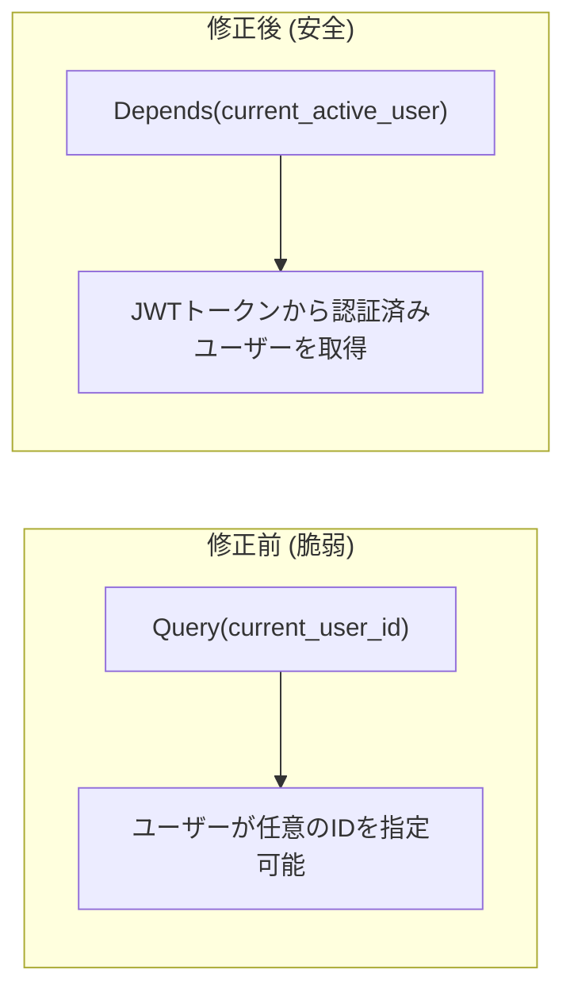

# リファクタリングドキュメント (2025年1月)

## 概要

このドキュメントは、Web版Claude Codeプロジェクト (AGENTSDK) に対して実施したリファクタリングの内容を記録したものです。

## リファクタリング対象

- **バックエンド**: Python/FastAPI
- **フロントエンド**: Next.js/React/TypeScript

---

## バックエンド変更

### 1. Dependency関数の統合

**変更前の問題点:**
- `get_permission_service`, `get_share_service` などの依存性注入関数が複数のルートファイルに重複定義されていた
- 各ルートファイル（projects.py, project_config.py, shares.py）で同一のコードが存在

**変更内容:**


**変更ファイル:**
| ファイル | 変更内容 |
|---------|---------|
| `api/dependencies.py` | 依存性注入関数を追加 |
| `api/routes/projects.py` | 重複関数を削除、インポートに変更 |
| `api/routes/project_config.py` | 重複関数を削除、インポートに変更 |
| `api/routes/shares.py` | 重複関数を削除、インポートに変更 |

**追加された関数:**
- `get_permission_service()` - 権限サービス
- `get_share_service()` - 共有サービス
- `get_usage_service()` - 使用量サービス
- `get_project_config_service()` - プロジェクト設定サービス

---

### 2. handle_chat_message の分割

**変更前の問題点:**
- `handle_chat_message` 関数が約240行と長大
- 設定読み込み、SDKオプション構築、ストリーミング処理が混在
- テスト・保守が困難

**変更内容:**


**新規作成ファイル:**

`src/backend/app/core/chat_processor.py`

```python
@dataclass
class ConfigBundle:
    """設定をまとめて保持するデータクラス"""
    project: ProjectModel
    db_config: ProjectConfigJSON
    file_config: Optional[ProjectConfig] = None
    use_db_config: bool = False
    workspace_path: str = ""
    mcp_servers_config: Dict[str, McpStdioServerConfig] = field(default_factory=dict)
    agents_config: Dict[str, AgentDefinition] = field(default_factory=dict)

class ChatMessageProcessor:
    """チャットメッセージ処理を担当するクラス"""

    async def load_config(self) -> Optional[ConfigBundle]: ...
    def generate_system_prompt(self, config: ConfigBundle) -> str: ...
    def get_enabled_tools(self, config: ConfigBundle) -> List[str]: ...
    def build_sdk_options(self, config: ConfigBundle) -> ClaudeAgentOptions: ...
    def validate_api_key(self, config: ConfigBundle) -> Optional[str]: ...
```

**責務の分離:**

| クラス/関数 | 責務 |
|------------|------|
| `ChatMessageProcessor` | 設定読み込み、SDKオプション構築 |
| `handle_chat_message` | WebSocket処理、メッセージ管理 |
| `_stream_response` | ストリーミングレスポンス処理 |

---

### 3. エラーハンドリングの統一

**変更内容:**

`models/errors.py` に新しいエラークラスを追加:

```python
class NotFoundError(AppException):
    """リソースが見つからない場合のエラー"""
    def __init__(self, resource: str, resource_id: str):
        super().__init__(
            code=ErrorCode.NOT_FOUND,
            message=f"{resource} {resource_id} not found",
            status_code=404,
        )

class PermissionDeniedError(AppException):
    """権限がない場合のエラー"""
    def __init__(self, message: str = "Permission denied"):
        super().__init__(
            code=ErrorCode.PERMISSION_DENIED,
            message=message,
            status_code=403,
        )

class ValidationError(AppException):
    """バリデーションエラー"""
    def __init__(self, message: str):
        super().__init__(
            code=ErrorCode.VALIDATION_ERROR,
            message=message,
            status_code=400,
        )
```

---

## フロントエンド変更

### 1. 重複コンポーネントの統合

**変更前の問題点:**
- `common/Button.tsx` と `atoms/Button/Button.tsx` が重複
- `organisms/Header/`, `organisms/Sidebar/`, `templates/MainLayout/` と `layout/` 配下のコンポーネントが重複

**変更内容:**


**削除ファイル:**
- `src/frontend/src/components/common/Button.tsx`
- `src/frontend/src/components/organisms/Header/`
- `src/frontend/src/components/organisms/Sidebar/`
- `src/frontend/src/components/templates/MainLayout/`

**Buttonコンポーネントの改善:**

```typescript
// 追加された機能
export type ButtonVariant = 'default' | 'primary' | 'secondary' | 'ghost' | 'danger';

export interface ButtonProps {
  variant?: ButtonVariant;
  size?: ButtonSize;
  isLoading?: boolean;  // 追加: ローディング状態
  children: ReactNode;
}
```

---

### 2. パフォーマンス改善

**変更内容:**

#### React.memo の適用

以下のコンポーネントにカスタム比較関数付きの `React.memo` を適用:

| コンポーネント | ファイル | 改善内容 |
|---------------|---------|---------|
| `MessageBubble` | `chat/MessageBubble.tsx` | メッセージID、ストリーミング状態、コンテンツの比較 |
| `MessageList` | `chat/MessageList.tsx` | メッセージリストの浅い比較 |
| `ToolExecutionDisplay` | `chat/ToolExecutionDisplay.tsx` | ツール実行状態の比較 |
| `ToolExecutionGroup` | `chat/ToolExecutionGroup.tsx` | ツール実行グループの比較 |

**例: MessageBubble のメモ化**

```typescript
const areMessageBubblePropsEqual = (
  prevProps: MessageBubbleProps,
  nextProps: MessageBubbleProps
): boolean => {
  if (prevProps.message.id !== nextProps.message.id) return false;
  if (prevProps.isStreaming !== nextProps.isStreaming) return false;
  if (prevProps.message.content.length !== nextProps.message.content.length) return false;
  // 詳細なコンテンツ比較...
  return true;
};

export const MessageBubble = memo(MessageBubbleComponent, areMessageBubblePropsEqual);
```

#### スマートスクロールの実装

`ChatContainer.tsx` にスマートオートスクロール機能を追加:

```typescript
const [shouldAutoScroll, setShouldAutoScroll] = useState(true);

// ユーザーが手動でスクロールした場合は自動スクロールを無効化
const handleScroll = useCallback((e: React.UIEvent<HTMLDivElement>) => {
  const { scrollTop, scrollHeight, clientHeight } = e.currentTarget;
  const isNearBottom = scrollHeight - scrollTop - clientHeight < 100;
  setShouldAutoScroll(isNearBottom);
}, []);

// 自動スクロールは shouldAutoScroll が true の場合のみ
useEffect(() => {
  if (shouldAutoScroll && containerRef.current) {
    containerRef.current.scrollTop = containerRef.current.scrollHeight;
  }
}, [messages, currentStreamingMessage, toolExecutions, shouldAutoScroll]);
```

#### キーボードショートカットのメモ化

`MainLayout.tsx` でショートカット配列をメモ化:

```typescript
const openCommandPalette = useCallback(() => setIsCommandPaletteOpen(true), []);
const shortcuts = useMemo(() => [
  { key: 'k', metaKey: true, action: openCommandPalette, ... },
  // ...
], [openCommandPalette, openShortcutsHelp, closeModals, toggleSidebar]);

useKeyboardShortcuts({ shortcuts });
```

---

### 3. 設定エディタの共通化

**変更内容:**

`src/frontend/src/components/editor/shared/` ディレクトリを新規作成:

```
editor/shared/
├── types.ts              # 共通型定義
├── parseMarkdownFrontmatter.ts  # YAML frontmatter パーサー
├── categoryConfig.tsx    # カテゴリ設定
├── ToggleSwitch.tsx      # トグルスイッチコンポーネント
├── useSuccessMessage.ts  # 成功メッセージフック
└── index.ts              # バレルエクスポート
```

---

## 変更量の概要


| カテゴリ | 変更前 | 変更後 | 差分 |
|---------|-------|-------|------|
| handlers.py | 510行 | 347行 | -163行 |
| chat_processor.py | 0行 | 430行 | +430行 |
| MessageBubble.tsx | 80行 | 125行 | +45行 |
| ChatContainer.tsx | 120行 | 140行 | +20行 |

---

## テスト・検証

- [x] フロントエンドビルド (`npm run build`) 成功
- [x] バックエンド構文チェック (`py_compile`) 成功

---

## 2026-01-01 追加リファクタリング

### 4. セキュリティ強化: shares.py 認証修正

**問題点:**
- `shares.py` の全エンドポイントで `current_user_id` をクエリパラメータとして受け取っていた
- これにより、任意のユーザーが他のユーザーになりすまして操作可能なセキュリティホール

**修正内容:**



**変更ファイル:**

| ファイル | 変更内容 |
|---------|---------|
| `api/routes/shares.py` | 全エンドポイントで `current_active_user` 依存性を使用 |

**修正したエンドポイント:**

| エンドポイント | 変更点 |
|---------------|--------|
| `POST /projects/{project_id}/shares` | `user: UserModel = Depends(current_active_user)` |
| `GET /projects/{project_id}/shares` | 同上 |
| `PUT /projects/{project_id}/shares/{target_user_id}` | 同上、パスパラメータ名を `user_id` → `target_user_id` に変更 |
| `DELETE /projects/{project_id}/shares/{target_user_id}` | 同上 |

---

### 5. エラーハンドリング統一: mcp.py, files.py

**問題点:**
- `mcp.py` で直接 `HTTPException` を使用、アプリケーション標準の `AppException` パターンを使用していなかった
- `files.py` で try-except ブロックが各エンドポイントで重複

**修正内容:**

```python
# 修正前
@router.get("/projects/{project_id}/config")
async def get_mcp_config(project_id: str):
    try:
        # ...
    except Exception as e:
        raise HTTPException(status_code=500, detail=str(e))

# 修正後
@router.get("/projects/{project_id}/config")
@handle_exceptions  # デコレータで統一的なエラーハンドリング
async def get_mcp_config(project_id: str):
    # 例外は AppException を raise、デコレータが HTTPException に変換
    if not config_path.exists():
        raise NotFoundError("MCP configuration file", project_id)
```

**変更ファイル:**

| ファイル | 変更内容 |
|---------|---------|
| `api/routes/mcp.py` | `@handle_exceptions` デコレータ追加、`NotFoundError`/`ValidationError` 使用 |
| `api/routes/files.py` | `@handle_exceptions` デコレータ追加、try-except 削除 |

---

### 6. ESLint警告修正

**問題点:**
- `PricingEditor.tsx` で `useCallback` の依存配列に `t` (翻訳関数) が含まれていなかった

**修正内容:**

```typescript
// 修正前
const loadData = useCallback(async () => {
  // t を使用
}, [projectId]);

// 修正後
const loadData = useCallback(async () => {
  // t を使用
}, [projectId, t]);
```

---

## 今回のリファクタリング効果

| カテゴリ | 改善内容 | 影響 |
|---------|---------|------|
| セキュリティ | 認証バイパス脆弱性修正 | 高 |
| コード品質 | エラーハンドリング統一 | 中 |
| 保守性 | ESLint警告ゼロ達成 | 低 |

---

## 今後の推奨事項

1. **単体テストの追加**: `ChatMessageProcessor` クラスのユニットテスト
2. **E2Eテスト**: チャット機能の統合テスト
3. **パフォーマンス計測**: React DevTools Profiler での確認
4. **設定エディタの完全共通化**: 残りのエディタコンポーネント (Agent, Skill, Command) も共通化を検討
5. **フロントエンド重複コンポーネント統合**: `ProjectList/ProjectListNav`, `SessionList/SessionListNav` の統合
6. **any型の削減**: `MarkdownContent.tsx` の型安全性改善

---

## 関連ファイル

- バックエンド: `src/backend/app/`
  - `api/dependencies.py`
  - `api/websocket/handlers.py`
  - `api/routes/shares.py` (セキュリティ修正)
  - `api/routes/mcp.py` (エラーハンドリング統一)
  - `api/routes/files.py` (エラーハンドリング統一)
  - `core/chat_processor.py`
  - `models/errors.py`

- フロントエンド: `src/frontend/src/components/`
  - `atoms/Button/Button.tsx`
  - `chat/MessageBubble.tsx`
  - `chat/MessageList.tsx`
  - `chat/ChatContainer.tsx`
  - `chat/ToolExecutionDisplay.tsx`
  - `chat/ToolExecutionGroup.tsx`
  - `layout/MainLayout.tsx`
  - `editor/shared/`
  - `editor/PricingEditor.tsx` (ESLint修正)
