# Web版Claude Code 画面設計書

**プロジェクト:** Web版Claude Code
**作成日:** 2025-12-20
**最終更新:** 2025-12-21
**バージョン:** 1.1
**ステータス:** ✅ 完了（100%）

---

## 目次

1. [画面一覧](#1-画面一覧)
2. [画面遷移図](#2-画面遷移図)
3. [画面個別設計](#3-画面個別設計)
   - 3.1 [メイン画面（ワークスペース）](#31-メイン画面ワークスペース)
   - 3.2 [プロジェクト・セッション管理画面](#32-プロジェクトセッション管理画面)
   - 3.3 [設定画面](#33-設定画面)
   - 3.4 [モーダル/ダイアログ](#34-モーダルダイアログ)
4. [共通UI要素](#4-共通ui要素)
5. [レスポンシブデザイン](#5-レスポンシブデザイン)
6. [アクセシビリティ](#6-アクセシビリティ)

---

## 1. 画面一覧

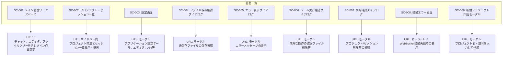

---

## 2. 画面遷移図

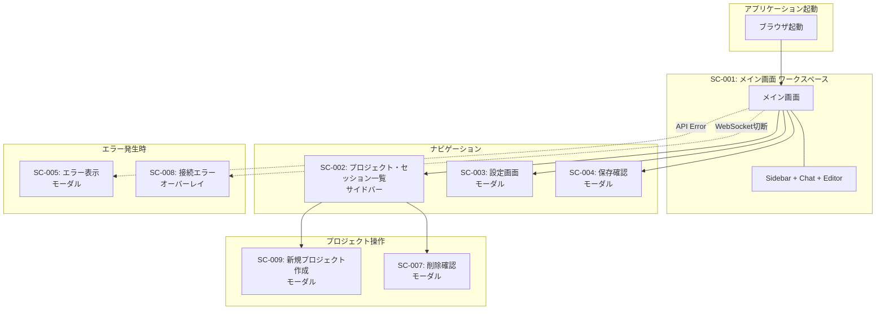

### 2.1 画面構成図

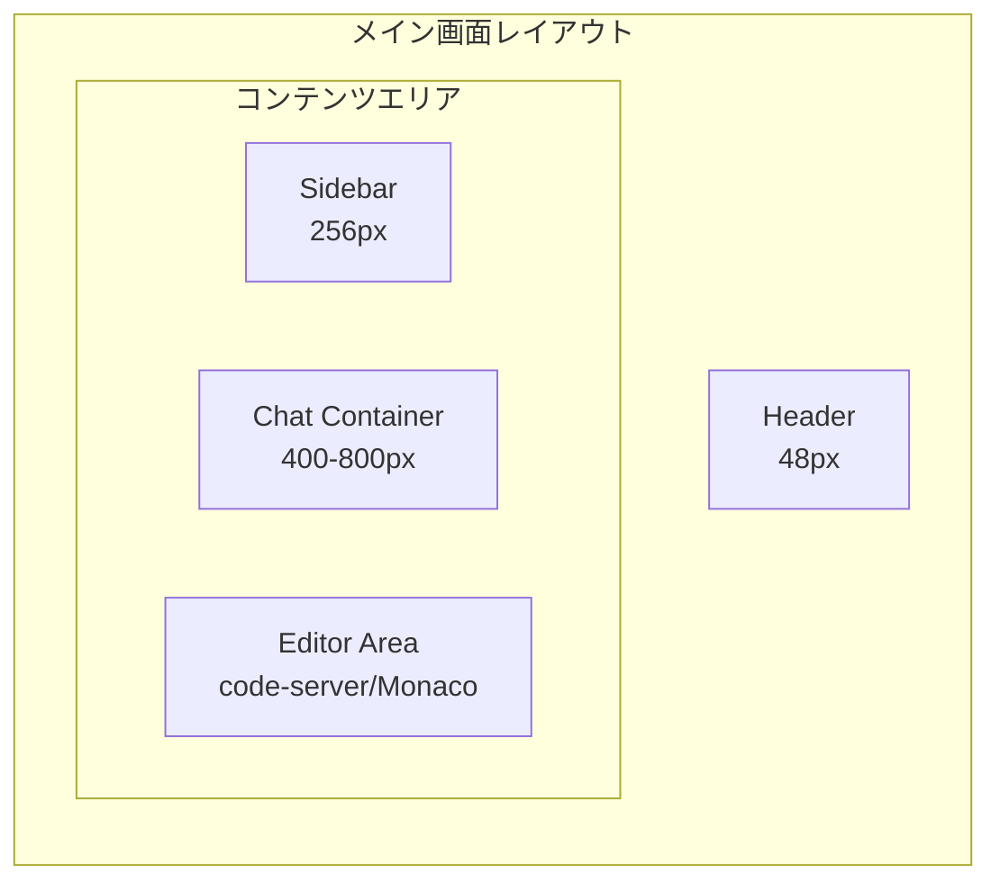

---

## 3. 画面個別設計

### 3.1 メイン画面（ワークスペース）

#### 基本情報

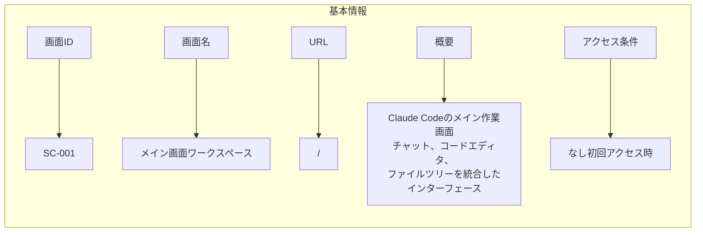

#### ワイヤーフレーム

```
┌─────────────────────────────────────────────────────────────────────────┐
│  Header (h: 48px)                                                       │
│  ┌──────────────────┐  Claude Code    [Theme] [Settings] [Model: Opus] │
│  │ ≡ Claude Code    │                                                   │
│  └──────────────────┘                                                   │
├─────────┬───────────────────────────┬───────────────────────────────────┤
│         │                           │                                   │
│ Sidebar │   Chat Container          │   Editor Area (code-server)       │
│ (256px) │   (Resizable: 400-800px)  │   (Flexible)                      │
│         │                           │                                   │
│ ┌─────┐ │ ┌───────────────────────┐ │ ┌─────────────────────────────┐  │
│ │[New]│ │ │ Message List          │ │ │ [VSCode] [Simple] [⛶] [↗]  │  │
│ └─────┘ │ │                       │ │ ├─────────────────────────────┤  │
│         │ │ ┌───────────────────┐ │ │ │                             │  │
│ Today   │ │ │ User: こんにちは   │ │ │ │   ┌─────────────────────┐  │  │
│ ─────── │ │ │ 10:30 AM          │ │ │ │   │  code-server        │  │  │
│ □ Chat1 │ │ └───────────────────┘ │ │ │   │  (VSCode Web)       │  │  │
│   3 msg │ │                       │ │ │   │                     │  │  │
│         │ │ ┌───────────────────┐ │ │ │   │  ┌───┬───────────┐  │  │  │
│ □ Chat2 │ │ │ 🤖 Claude         │ │ │ │   │  │📁│ main.py   │  │  │  │
│   12 msg│ │ │ こんにちは！...   │ │ │ │   │  │   │ utils.py  │  │  │  │
│         │ │ │ 10:30 AM          │ │ │ │   │  ├───┴───────────┤  │  │  │
│ Yester. │ │ └───────────────────┘ │ │ │   │  │ 1│import os  │  │  │  │
│ ─────── │ │                       │ │ │   │  │ 2│           │  │  │  │
│ □ Debug │ │ ┌───────────────────┐ │ │ │   │  │ 3│def main():│  │  │  │
│   5 msg │ │ │ 🛠️ Tool: Write    │ │ │ │   │  └─────────────┘  │  │  │
│         │ │ │ Creating file...  │ │ │ │   │                     │  │  │
│ [Trash] │ │ └───────────────────┘ │ │ │   │  [TERMINAL] [OUTPUT]│  │  │
│         │ │                       │ │ │   │  $ python main.py   │  │  │
│         │ │ ┌───────────────────┐ │ │ │   │  Hello World!       │  │  │
│         │ │ │ 💭 Thinking...    │ │ │ │   └─────────────────────┘  │  │
│         │ │ └───────────────────┘ │ │ │                             │  │
│         │ └───────────────────────┘ │ └─────────────────────────────┘  │
│         │                           │                                   │
│         │ ┌───────────────────────┐ │  ⛶ = フルスクリーン             │
│         │ │ Type your message...  │ │  ↗ = 新しいタブで開く            │
│         │ │ [Attach] [Code]  [→]  │ │                                   │
│         │ └───────────────────────┘ │                                   │
│         │ ● Connected | Tokens: 5k │                                   │
└─────────┴───────────────────────────┴───────────────────────────────────┘
```

#### UI要素一覧

##### ヘッダー（Header）

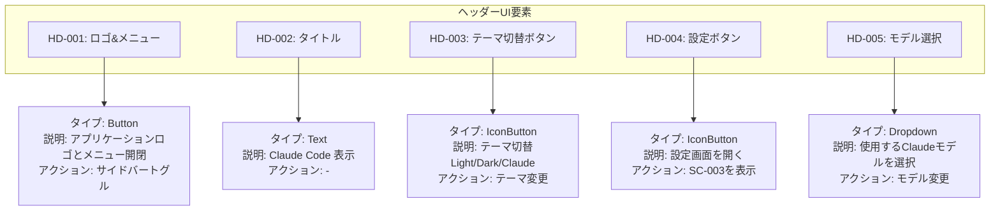

##### サイドバー（Sidebar） - プロジェクト階層構造

```mermaid
flowchart TD
    subgraph "サイドバーUI要素 - プロジェクト階層"
        subgraph "プロジェクト管理"
            PJ001[PJ-001: 新規プロジェクトボタン]
            PJ002[PJ-002: プロジェクト検索]
            PJ003[PJ-003: プロジェクトリスト]
            PJ004[PJ-004: プロジェクトカード]
            PJ005[PJ-005: プロジェクトコンテキストメニュー]
        end

        subgraph "セッション管理 - プロジェクト配下"
            SB001[SB-001: 新規セッションボタン]
            SB003[SB-003: セッションリスト]
            SB004[SB-004: セッションカード]
            SB005[SB-005: セッションコンテキストメニュー]
        end

        SB006[SB-006: ゴミ箱ボタン]
    end

    PJ001 --> PJ001_D["タイプ: Button<br/>説明: 新しいプロジェクトを作成<br/>アクション: プロジェクト作成モーダル表示"]
    PJ002 --> PJ002_D["タイプ: Input<br/>説明: プロジェクトを検索<br/>アクション: フィルタリング"]
    PJ003 --> PJ003_D["タイプ: TreeList<br/>説明: 作成日時順のプロジェクト一覧<br/>展開すると配下のセッション表示<br/>アクション: プロジェクト選択/展開"]
    PJ004 --> PJ004_D["タイプ: Card<br/>説明: プロジェクト情報<br/>名前、セッション数、作成日時<br/>アクション: プロジェクト選択"]
    PJ005 --> PJ005_D["タイプ: Menu<br/>説明: 右クリックで表示<br/>名前変更、削除、新規セッション等<br/>アクション: 各種操作"]
    SB001 --> SB001_D["タイプ: Button<br/>説明: 選択中プロジェクトに新規セッション作成<br/>アクション: セッション作成"]
    SB003 --> SB003_D["タイプ: List<br/>説明: プロジェクト配下のセッション一覧<br/>日付別にグループ化<br/>アクション: セッション選択"]
    SB004 --> SB004_D["タイプ: Card<br/>説明: セッション情報<br/>タイトル、メッセージ数、日時<br/>アクション: セッション選択"]
    SB005 --> SB005_D["タイプ: Menu<br/>説明: 右クリックで表示<br/>名前変更、削除、複製等<br/>アクション: 各種操作"]
    SB006 --> SB006_D["タイプ: IconButton<br/>説明: 削除済み項目一覧<br/>アクション: ゴミ箱表示"]
```

**プロジェクト・セッション階層構造:**

```
📁 プロジェクト一覧
├── 📂 プロジェクトA (3セッション)
│   ├── 💬 セッション1: "API設計の相談"
│   ├── 💬 セッション2: "バグ修正依頼"
│   └── 💬 セッション3: "テスト作成"
├── 📂 プロジェクトB (2セッション)
│   ├── 💬 セッション1: "新機能の実装"
│   └── 💬 セッション2: "コードレビュー"
└── ➕ 新規プロジェクト作成
```

##### チャットコンテナ（Chat Container）

```mermaid
flowchart TD
    subgraph "チャットコンテナUI要素"
        CH001[CH-001: メッセージリスト]
        CH002[CH-002: ユーザーメッセージバブル]
        CH003[CH-003: Claudeメッセージバブル]
        CH004[CH-004: ツール使用カード]
        CH005[CH-005: 思考中インジケーター]
        CH006[CH-006: ストリーミングテキスト]
        CH007[CH-007: コードブロック]
        CH008[CH-008: メッセージ入力エリア]
        CH009[CH-009: ファイル添付ボタン]
        CH010[CH-010: コード挿入ボタン]
        CH011[CH-011: 送信ボタン]
        CH012[CH-012: 中断ボタン]
        CH013[CH-013: 接続ステータス]
        CH014[CH-014: トークンカウンター]
    end

    CH001 --> CH001_D["タイプ: ScrollableList<br/>説明: チャット履歴の表示仮想スクロール対応<br/>アクション: -"]
    CH002 --> CH002_D["タイプ: MessageBubble<br/>説明: ユーザーのメッセージ右寄せ、青背景<br/>アクション: -"]
    CH003 --> CH003_D["タイプ: MessageBubble<br/>説明: Claudeの返答左寄せ、グレー背景<br/>アクション: -"]
    CH004 --> CH004_D["タイプ: Card<br/>説明: ツール実行内容の表示Read/Write/Bash等<br/>アクション: 詳細表示"]
    CH005 --> CH005_D["タイプ: Indicator<br/>説明: Claude思考中の表示<br/>アクション: -"]
    CH006 --> CH006_D["タイプ: Text<br/>説明: リアルタイムで表示される返答<br/>アクション: -"]
    CH007 --> CH007_D["タイプ: CodeBlock<br/>説明: シンタックスハイライト付きコード<br/>アクション: コピー、適用"]
    CH008 --> CH008_D["タイプ: Textarea<br/>説明: メッセージ入力フィールド<br/>アクション: テキスト入力"]
    CH009 --> CH009_D["タイプ: IconButton<br/>説明: ファイルをチャットに添付<br/>アクション: ファイル選択"]
    CH010 --> CH010_D["タイプ: IconButton<br/>説明: エディタからコードを挿入<br/>アクション: コード挿入"]
    CH011 --> CH011_D["タイプ: IconButton<br/>説明: メッセージ送信<br/>アクション: 送信処理"]
    CH012 --> CH012_D["タイプ: IconButton<br/>説明: 実行中の処理を中断<br/>アクション: 中断処理"]
    CH013 --> CH013_D["タイプ: StatusIndicator<br/>説明: WebSocket接続状態表示<br/>アクション: -"]
    CH014 --> CH014_D["タイプ: Text<br/>説明: 使用トークン数表示<br/>アクション: -"]
```

##### エディタエリア（Editor Area） - code-server統合

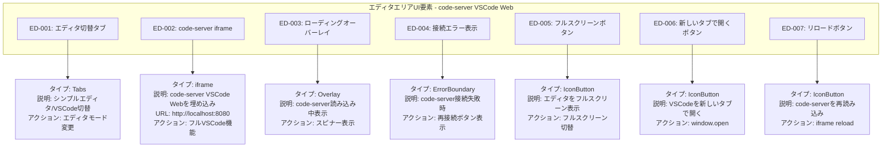

##### code-server機能一覧

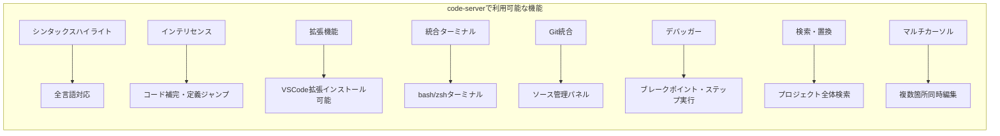

##### フォールバック: シンプルエディタ（Monaco Editor）

code-serverが利用できない場合のフォールバックとして、Monaco Editorベースのシンプルエディタも提供:

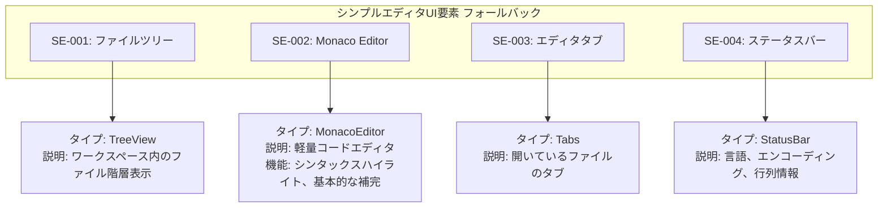

#### 状態遷移

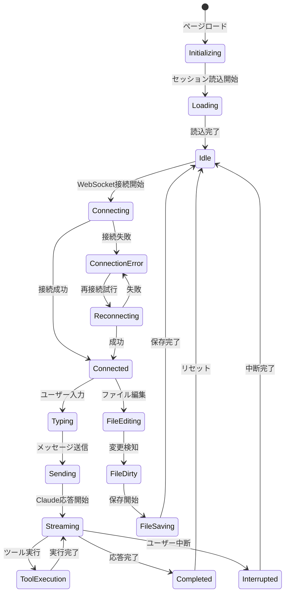

#### API連携

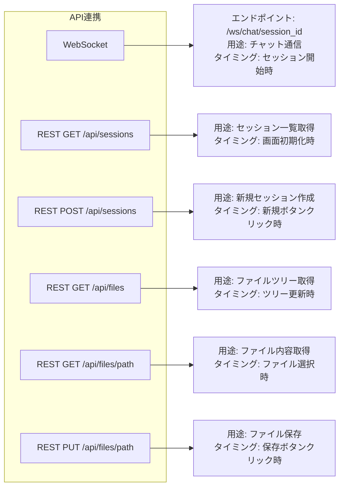

#### バリデーション

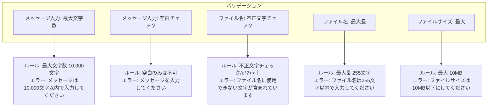

#### エラーハンドリング

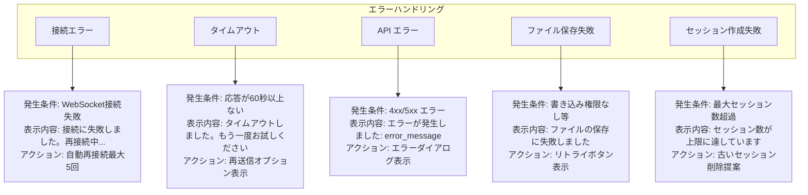

#### キーボードショートカット

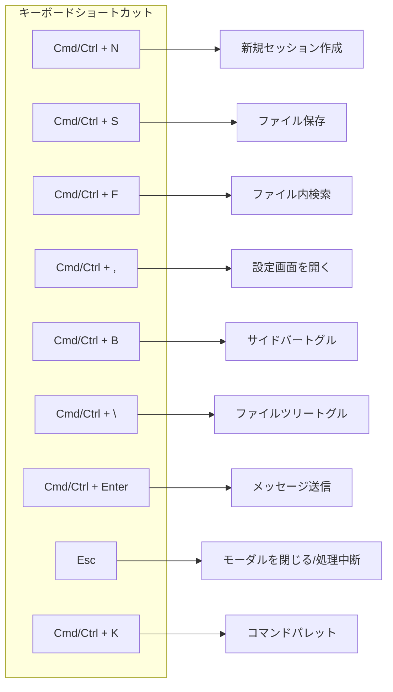

---

### 3.2 プロジェクト・セッション管理画面

#### 基本情報

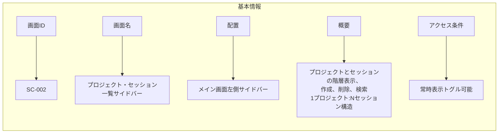

#### ワイヤーフレーム

```
┌─────────────────────────────┐
│ Projects & Sessions         │
│                             │
│ ┌─────────────────────────┐ │
│ │ 🔍 Search...            │ │
│ └─────────────────────────┘ │
│                             │
│ ┌─────────────────────────┐ │
│ │ ➕ New Project          │ │
│ └─────────────────────────┘ │
│                             │
│ ▼ 📂 Web App Project        │
│   │  3 sessions • Dec 20   │
│   │                         │
│   ├── 💬 API設計の相談      │
│   │   5 messages • 10:45   │
│   │                         │
│   ├── 💬 バグ修正依頼       │
│   │   12 messages • 9:30   │
│   │                         │
│   └── [➕ New Session]      │
│                             │
│ ▶ 📂 CLI Tool Project       │
│   │  2 sessions • Dec 19   │
│                             │
│ ▶ 📂 Data Pipeline          │
│   │  5 sessions • Dec 18   │
│                             │
│ ┌─────────────────────────┐ │
│ │ 🗑️ Trash (3)            │ │
│ └─────────────────────────┘ │
└─────────────────────────────┘

※ プロジェクトを展開すると配下のセッション表示
※ ▼ = 展開中、▶ = 折りたたみ中
```

#### UI要素一覧

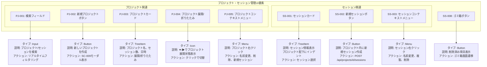

#### プロジェクトコンテキストメニュー項目

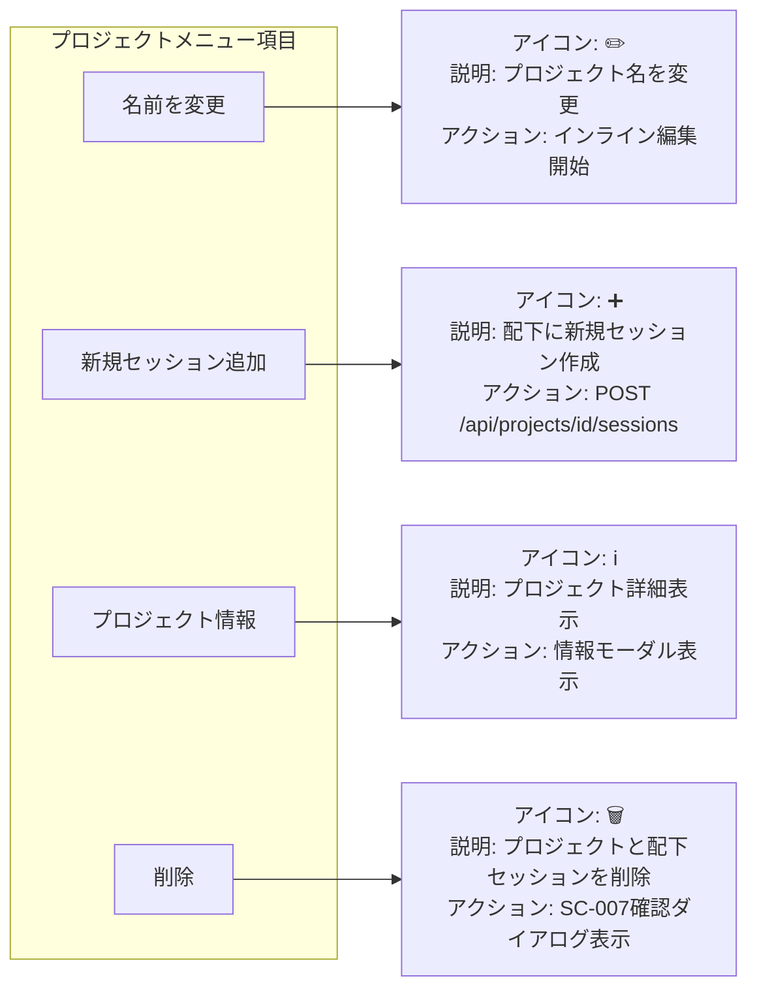

#### セッションコンテキストメニュー項目

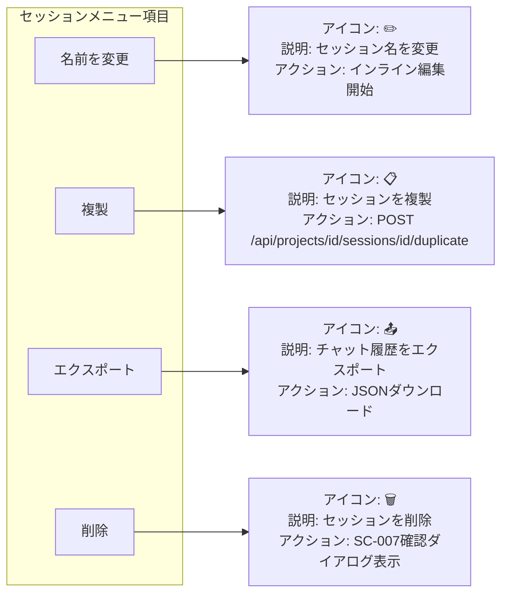

#### 状態

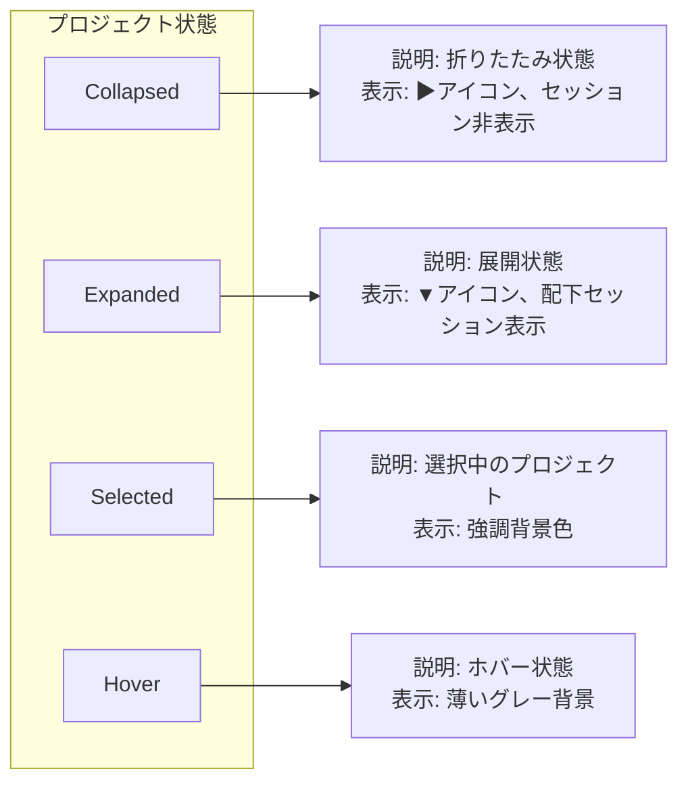

```mermaid
flowchart LR
    subgraph "セッション状態"
        SS1[Default]
        SS2[Selected]
        SS3[Hover]
        SS4[Active]
    end

    SS1 --> SS1_D["説明: 通常状態<br/>表示: 通常の背景色"]
    SS2 --> SS2_D["説明: 選択中のセッション<br/>表示: 青背景でハイライト"]
    SS3 --> SS3_D["説明: ホバー状態<br/>表示: 薄いグレー背景"]
    SS4 --> SS4_D["説明: アクティブセッション<br/>表示: チャット中のセッション表示"]
```

#### API連携

```mermaid
flowchart LR
    subgraph "プロジェクトAPI"
        PA1[GET /api/projects]
        PA2[POST /api/projects]
        PA3[GET /api/projects/id]
        PA4[PATCH /api/projects/id]
        PA5[DELETE /api/projects/id]
    end

    PA1 --> PA1_D["用途: プロジェクト一覧取得"]
    PA2 --> PA2_D["用途: 新規プロジェクト作成"]
    PA3 --> PA3_D["用途: プロジェクト詳細取得"]
    PA4 --> PA4_D["用途: プロジェクト名変更"]
    PA5 --> PA5_D["用途: プロジェクト削除<br/>配下セッションもカスケード削除"]
```

```mermaid
flowchart LR
    subgraph "セッションAPI - プロジェクト配下"
        SA1[GET /api/projects/id/sessions]
        SA2[POST /api/projects/id/sessions]
        SA3[GET /api/projects/id/sessions/sid]
        SA4[PATCH /api/projects/id/sessions/sid]
        SA5[DELETE /api/projects/id/sessions/sid]
    end

    SA1 --> SA1_D["用途: プロジェクト配下のセッション一覧取得"]
    SA2 --> SA2_D["用途: プロジェクト内に新規セッション作成"]
    SA3 --> SA3_D["用途: セッション詳細取得"]
    SA4 --> SA4_D["用途: セッション名変更"]
    SA5 --> SA5_D["用途: セッション削除"]
```

---

### 3.3 設定画面

#### 基本情報

```mermaid
flowchart LR
    subgraph "基本情報"
        STI1[画面ID] --> STV1["SC-003"]
        STI2[画面名] --> STV2["設定画面"]
        STI3[タイプ] --> STV3["モーダルダイアログ"]
        STI4[概要] --> STV4["アプリケーション全体の設定を管理"]
        STI5[アクセス] --> STV5["ヘッダーの設定ボタン、<br/>または Cmd/Ctrl + ,"]
    end
```

#### ワイヤーフレーム

```
┌─────────────────────────────────────────────────────────────┐
│ ⚙️ Settings                                          [✕]    │
├──────────────┬──────────────────────────────────────────────┤
│              │                                              │
│ 🎨 Appearance│  Theme                                       │
│              │  ┌──────┐ ┌──────┐ ┌──────┐                │
│ ✏️ Editor    │  │Light │ │ Dark │ │Claude│  ← Selected     │
│              │  └──────┘ └──────┘ └──────┘                │
│ 🤖 Model     │                                              │
│              │  Font Size                                   │
│ 🔧 Advanced  │  [─────●────────]  14px                     │
│              │                                              │
│              │  Compact Mode                                │
│              │  [ ] Enable compact UI                       │
│              │                                              │
│              │  Animations                                  │
│              │  [✓] Enable animations                       │
│              │                                              │
├──────────────┴──────────────────────────────────────────────┤
│                                     [Cancel] [Save Changes] │
└─────────────────────────────────────────────────────────────┘
```

#### タブ構成

##### 🎨 Appearance（外観）

```mermaid
flowchart TD
    subgraph "Appearance外観設定"
        AP1[Theme]
        AP2[Font Size]
        AP3[Compact Mode]
        AP4[Animations]
        AP5[Show Line Numbers]
    end

    AP1 --> AP1_D["タイプ: RadioGroup<br/>デフォルト: Claude<br/>説明: Light/Dark/Claudeテーマ選択"]
    AP2 --> AP2_D["タイプ: Slider<br/>デフォルト: 14px<br/>説明: フォントサイズ10-24px"]
    AP3 --> AP3_D["タイプ: Checkbox<br/>デフォルト: false<br/>説明: コンパクトUI表示"]
    AP4 --> AP4_D["タイプ: Checkbox<br/>デフォルト: true<br/>説明: アニメーション有効化"]
    AP5 --> AP5_D["タイプ: Checkbox<br/>デフォルト: true<br/>説明: エディタ行番号表示"]
```

##### ✏️ Editor（エディタ）

```mermaid
flowchart TD
    subgraph "Editorエディタ設定"
        ED1[Tab Size]
        ED2[Insert Spaces]
        ED3[Word Wrap]
        ED4[Auto Save]
        ED5[Auto Save Delay]
        ED6[Format On Save]
        ED7[Minimap]
        ED8[Font Family]
    end

    ED1 --> ED1_D["タイプ: Number<br/>デフォルト: 2<br/>説明: タブサイズ2/4/8"]
    ED2 --> ED2_D["タイプ: Checkbox<br/>デフォルト: true<br/>説明: タブをスペースに変換"]
    ED3 --> ED3_D["タイプ: Select<br/>デフォルト: On<br/>説明: 行の折り返しOn/Off/Word Boundary"]
    ED4 --> ED4_D["タイプ: Select<br/>デフォルト: afterDelay<br/>説明: 自動保存off/afterDelay/onFocusChange"]
    ED5 --> ED5_D["タイプ: Number<br/>デフォルト: 1000<br/>説明: 自動保存までの遅延ms"]
    ED6 --> ED6_D["タイプ: Checkbox<br/>デフォルト: true<br/>説明: 保存時に自動フォーマット"]
    ED7 --> ED7_D["タイプ: Checkbox<br/>デフォルト: true<br/>説明: ミニマップ表示"]
    ED8 --> ED8_D["タイプ: Input<br/>デフォルト: JetBrains Mono<br/>説明: エディタフォント"]
```

##### 🤖 Model（モデル）

```mermaid
flowchart TD
    subgraph "Modelモデル設定"
        MD1[Default Model]
        MD2[Temperature]
        MD3[Max Tokens]
        MD4[Stream Response]
        MD5[Auto Tool Approval]
    end

    MD1 --> MD1_D["タイプ: Select<br/>デフォルト: claude-opus-4-5<br/>説明: デフォルトモデル"]
    MD2 --> MD2_D["タイプ: Slider<br/>デフォルト: 1.0<br/>説明: 生成の多様性0.0-1.0"]
    MD3 --> MD3_D["タイプ: Number<br/>デフォルト: 4096<br/>説明: 最大生成トークン数"]
    MD4 --> MD4_D["タイプ: Checkbox<br/>デフォルト: true<br/>説明: ストリーミング応答"]
    MD5 --> MD5_D["タイプ: Checkbox<br/>デフォルト: false<br/>説明: ツール自動承認危険な操作を除く"]
```

##### 🔧 Advanced（詳細）

```mermaid
flowchart TD
    subgraph "Advanced詳細設定"
        AD1[API Base URL]
        AD2[WebSocket URL]
        AD3[Max Sessions]
        AD4[Debug Mode]
        AD5[Telemetry]
        AD6[Clear Cache]
        AD7[Export Settings]
        AD8[Import Settings]
    end

    AD1 --> AD1_D["タイプ: Input<br/>デフォルト: default<br/>説明: カスタムAPIエンドポイント"]
    AD2 --> AD2_D["タイプ: Input<br/>デフォルト: default<br/>説明: WebSocketエンドポイント"]
    AD3 --> AD3_D["タイプ: Number<br/>デフォルト: 100<br/>説明: 最大セッション数"]
    AD4 --> AD4_D["タイプ: Checkbox<br/>デフォルト: false<br/>説明: デバッグログ表示"]
    AD5 --> AD5_D["タイプ: Checkbox<br/>デフォルト: true<br/>説明: 使用状況データ送信"]
    AD6 --> AD6_D["タイプ: Button<br/>デフォルト: -<br/>説明: キャッシュクリア"]
    AD7 --> AD7_D["タイプ: Button<br/>デフォルト: -<br/>説明: 設定をエクスポート"]
    AD8 --> AD8_D["タイプ: Button<br/>デフォルト: -<br/>説明: 設定をインポート"]
```

#### UI要素一覧

```mermaid
flowchart TD
    subgraph "設定画面UI要素"
        ST001[ST-001: タブナビゲーション]
        ST002[ST-002: テーマ選択]
        ST003[ST-003: フォントサイズスライダー]
        ST004[ST-004: モデル選択]
        ST005[ST-005: キャンセルボタン]
        ST006[ST-006: 保存ボタン]
    end

    ST001 --> ST001_D["タイプ: Tabs<br/>説明: 設定カテゴリの切り替え<br/>アクション: タブ切り替え"]
    ST002 --> ST002_D["タイプ: RadioGroup<br/>説明: テーマ選択Light/Dark/Claude<br/>アクション: テーマ変更"]
    ST003 --> ST003_D["タイプ: Slider<br/>説明: フォントサイズ調整<br/>アクション: サイズ変更"]
    ST004 --> ST004_D["タイプ: Select<br/>説明: Claudeモデル選択<br/>アクション: モデル変更"]
    ST005 --> ST005_D["タイプ: Button<br/>説明: 変更を破棄して閉じる<br/>アクション: モーダルを閉じる"]
    ST006 --> ST006_D["タイプ: Button<br/>説明: 設定を保存<br/>アクション: 設定保存 + モーダルを閉じる"]
```

#### バリデーション

```mermaid
flowchart TD
    subgraph "設定バリデーション"
        VL1[Font Size]
        VL2[Tab Size]
        VL3[Auto Save Delay]
        VL4[Max Tokens]
        VL5[API Base URL]
    end

    VL1 --> VL1_D["ルール: 10-24の範囲<br/>エラー: フォントサイズは10〜24pxの範囲で指定してください"]
    VL2 --> VL2_D["ルール: 2/4/8のいずれか<br/>エラー: タブサイズは2、4、8のいずれかを選択してください"]
    VL3 --> VL3_D["ルール: 100-10000の範囲<br/>エラー: 自動保存の遅延は100〜10000msの範囲で指定してください"]
    VL4 --> VL4_D["ルール: 1-200000の範囲<br/>エラー: 最大トークン数は1〜200000の範囲で指定してください"]
    VL5 --> VL5_D["ルール: URL形式<br/>エラー: 正しいURL形式で入力してください"]
```

#### ストレージ

設定はブラウザのLocalStorageに保存されます。

```typescript
// LocalStorage Key
const SETTINGS_KEY = 'claude-code-settings';

// 設定の構造
interface Settings {
  appearance: {
    theme: 'light' | 'dark' | 'claude';
    fontSize: number;
    compactMode: boolean;
    animations: boolean;
    showLineNumbers: boolean;
  };
  editor: {
    tabSize: number;
    insertSpaces: boolean;
    wordWrap: 'on' | 'off' | 'wordWrapColumn';
    autoSave: 'off' | 'afterDelay' | 'onFocusChange';
    autoSaveDelay: number;
    formatOnSave: boolean;
    minimap: boolean;
    fontFamily: string;
  };
  model: {
    defaultModel: string;
    temperature: number;
    maxTokens: number;
    streamResponse: boolean;
    autoToolApproval: boolean;
  };
  advanced: {
    apiBaseUrl: string;
    websocketUrl: string;
    maxSessions: number;
    debugMode: boolean;
    telemetry: boolean;
  };
}
```

---

### 3.4 モーダル/ダイアログ

#### 3.4.1 ファイル保存確認ダイアログ（SC-004）

##### 基本情報

```mermaid
flowchart LR
    subgraph "基本情報"
        DI1[画面ID] --> DV1["SC-004"]
        DI2[画面名] --> DV2["ファイル保存確認ダイアログ"]
        DI3[タイプ] --> DV3["モーダルダイアログ"]
        DI4[トリガー] --> DV4["ファイルを閉じる/セッション切替時に<br/>未保存ファイルがある場合"]
    end
```

##### ワイヤーフレーム

```
┌─────────────────────────────────────┐
│ 💾 Unsaved Changes                 │
├─────────────────────────────────────┤
│                                     │
│ You have unsaved changes in:        │
│                                     │
│ • main.py                          │
│ • utils/helper.py                  │
│                                     │
│ Do you want to save these files?    │
│                                     │
├─────────────────────────────────────┤
│  [Don't Save] [Cancel] [Save All]  │
└─────────────────────────────────────┘
```

##### UI要素

```mermaid
flowchart TD
    subgraph "ファイル保存ダイアログUI要素"
        DL001[DL-001: ファイルリスト]
        DL002[DL-002: 保存しないボタン]
        DL003[DL-003: キャンセルボタン]
        DL004[DL-004: すべて保存ボタン]
    end

    DL001 --> DL001_D["タイプ: List<br/>説明: 未保存ファイルの一覧<br/>アクション: -"]
    DL002 --> DL002_D["タイプ: Button<br/>説明: 保存せずに続行<br/>アクション: 変更を破棄して続行"]
    DL003 --> DL003_D["タイプ: Button<br/>説明: 操作をキャンセル<br/>アクション: ダイアログを閉じる"]
    DL004 --> DL004_D["タイプ: Button Primary<br/>説明: すべてのファイルを保存<br/>アクション: ファイル保存後に続行"]
```

#### 3.4.2 エラー表示ダイアログ（SC-005）

##### 基本情報

```mermaid
flowchart LR
    subgraph "基本情報"
        EI1[画面ID] --> EV1["SC-005"]
        EI2[画面名] --> EV2["エラー表示ダイアログ"]
        EI3[タイプ] --> EV3["モーダルダイアログ"]
        EI4[トリガー] --> EV4["API エラー、操作エラー等"]
    end
```

##### ワイヤーフレーム

```
┌─────────────────────────────────────┐
│ ⚠️ Error                           │
├─────────────────────────────────────┤
│                                     │
│ Failed to save file                 │
│                                     │
│ Error: Permission denied           │
│ File: /workspace/main.py           │
│                                     │
│ Please check file permissions      │
│ and try again.                     │
│                                     │
│ [Show Details]                     │
│                                     │
├─────────────────────────────────────┤
│                  [Retry]  [Close]  │
└─────────────────────────────────────┘
```

##### エラーレベル

```mermaid
flowchart LR
    subgraph "エラーレベル"
        EL1[Error]
        EL2[Warning]
        EL3[Info]
    end

    EL1 --> EL1_D["アイコン: ⚠️<br/>色: Red<br/>用途: 致命的なエラー"]
    EL2 --> EL2_D["アイコン: ⚠️<br/>色: Yellow<br/>用途: 警告メッセージ"]
    EL3 --> EL3_D["アイコン: ℹ️<br/>色: Blue<br/>用途: 情報メッセージ"]
```

#### 3.4.3 ツール実行確認ダイアログ（SC-006）

##### 基本情報

```mermaid
flowchart LR
    subgraph "基本情報"
        TI1[画面ID] --> TV1["SC-006"]
        TI2[画面名] --> TV2["ツール実行確認ダイアログ"]
        TI3[タイプ] --> TV3["モーダルダイアログ"]
        TI4[トリガー] --> TV4["危険な操作ファイル削除、<br/>Bashコマンド等の実行前"]
    end
```

##### ワイヤーフレーム

```
┌─────────────────────────────────────┐
│ 🛠️ Confirm Tool Execution          │
├─────────────────────────────────────┤
│                                     │
│ Claude wants to execute:            │
│                                     │
│ Tool: Bash                         │
│ Command: rm -rf ./dist             │
│                                     │
│ ⚠️ This action cannot be undone.   │
│                                     │
│ [ ] Don't ask again for this      │
│     session (Bash only)            │
│                                     │
├─────────────────────────────────────┤
│         [Deny]  [Allow Once]       │
└─────────────────────────────────────┘
```

##### 危険な操作の定義

```mermaid
flowchart LR
    subgraph "危険な操作の定義"
        DO1[Bash: ファイル削除]
        DO2[Bash: システム変更]
        DO3[Edit: 大規模変更]
        DO4[Write: 上書き]
    end

    DO1 --> DO1_D["判定基準: rm, rmdir コマンド"]
    DO2 --> DO2_D["判定基準: sudo, chmod, chown 等"]
    DO3 --> DO3_D["判定基準: 100行以上の変更"]
    DO4 --> DO4_D["判定基準: 既存ファイルへの書き込み"]
```

#### 3.4.4 セッション削除確認ダイアログ（SC-007）

##### ワイヤーフレーム

```
┌─────────────────────────────────────┐
│ 🗑️ Delete Session?                 │
├─────────────────────────────────────┤
│                                     │
│ Are you sure you want to delete    │
│ this session?                      │
│                                     │
│ Session: "Debug Python error"      │
│ Messages: 15                       │
│ Created: Dec 20, 2025 10:30 AM    │
│                                     │
│ This action cannot be undone.      │
│                                     │
├─────────────────────────────────────┤
│              [Cancel]  [Delete]    │
└─────────────────────────────────────┘
```

#### 3.4.5 接続エラー画面（SC-008）

##### 基本情報

```mermaid
flowchart LR
    subgraph "基本情報"
        CI1[画面ID] --> CV1["SC-008"]
        CI2[画面名] --> CV2["接続エラー画面"]
        CI3[タイプ] --> CV3["オーバーレイ"]
        CI4[トリガー] --> CV4["WebSocket接続が切断された場合"]
    end
```

##### ワイヤーフレーム

```
┌─────────────────────────────────────┐
│                                     │
│          🔌 Connection Lost         │
│                                     │
│     Reconnecting to server...      │
│                                     │
│     ━━━━●━━━━━━━━ Attempt 2/5     │
│                                     │
│         [Retry Now] [Go Offline]   │
│                                     │
└─────────────────────────────────────┘
```

##### 接続状態

```mermaid
flowchart LR
    subgraph "接続状態"
        CS1[Connecting]
        CS2[Reconnecting]
        CS3[Failed]
        CS4[Offline]
    end

    CS1 --> CS1_D["表示: 接続中...<br/>アクション: ローディングアニメーション"]
    CS2 --> CS2_D["表示: 再接続中... 試行 n/5<br/>アクション: プログレスバー表示"]
    CS3 --> CS3_D["表示: 接続に失敗しました<br/>アクション: リトライボタン表示"]
    CS4 --> CS4_D["表示: オフラインモード<br/>アクション: 読み取り専用モード"]
```

---

## 4. 共通UI要素

### 4.1 ボタン

#### バリアント

```mermaid
flowchart LR
    subgraph "ボタンバリアント"
        BV1[Primary]
        BV2[Secondary]
        BV3[Ghost]
        BV4[Danger]
        BV5[Icon]
    end

    BV1 --> BV1_D["用途: 主要アクション<br/>スタイル: 青背景、白テキスト"]
    BV2 --> BV2_D["用途: 副次的アクション<br/>スタイル: グレー背景、黒テキスト"]
    BV3 --> BV3_D["用途: 控えめなアクション<br/>スタイル: 透明背景、テキストのみ"]
    BV4 --> BV4_D["用途: 削除等の危険な操作<br/>スタイル: 赤背景、白テキスト"]
    BV5 --> BV5_D["用途: アイコンのみ<br/>スタイル: 透明背景、アイコン"]
```

#### サイズ

```mermaid
flowchart LR
    subgraph "ボタンサイズ"
        BS1[sm]
        BS2[md]
        BS3[lg]
    end

    BS1 --> BS1_D["高さ: 32px<br/>パディング: 12px 16px<br/>用途: コンパクトなUI"]
    BS2 --> BS2_D["高さ: 40px<br/>パディング: 16px 24px<br/>用途: 標準"]
    BS3 --> BS3_D["高さ: 48px<br/>パディング: 20px 32px<br/>用途: 強調したいアクション"]
```

### 4.2 入力フィールド

#### タイプ

```mermaid
flowchart LR
    subgraph "入力フィールドタイプ"
        IT1[Text Input]
        IT2[Textarea]
        IT3[Select]
        IT4[Checkbox]
        IT5[Radio]
        IT6[Slider]
    end

    IT1 --> IT1_D["用途: 単一行テキスト<br/>特徴: 検索、ファイル名等"]
    IT2 --> IT2_D["用途: 複数行テキスト<br/>特徴: メッセージ入力"]
    IT3 --> IT3_D["用途: 選択<br/>特徴: ドロップダウン"]
    IT4 --> IT4_D["用途: ON/OFF<br/>特徴: 設定項目"]
    IT5 --> IT5_D["用途: 択一選択<br/>特徴: テーマ選択等"]
    IT6 --> IT6_D["用途: 数値範囲<br/>特徴: フォントサイズ等"]
```

#### 状態

```mermaid
flowchart LR
    subgraph "入力フィールド状態"
        IS1[Default]
        IS2[Focus]
        IS3[Error]
        IS4[Disabled]
        IS5[Read-only]
    end

    IS1 --> IS1_D["表示: 通常のボーダー"]
    IS2 --> IS2_D["表示: 青いボーダー、シャドウ"]
    IS3 --> IS3_D["表示: 赤いボーダー、エラーメッセージ"]
    IS4 --> IS4_D["表示: グレーアウト、入力不可"]
    IS5 --> IS5_D["表示: 背景グレー、編集不可"]
```

### 4.3 トースト通知

#### タイプ

```mermaid
flowchart LR
    subgraph "トースト通知タイプ"
        TT1[Success]
        TT2[Error]
        TT3[Warning]
        TT4[Info]
    end

    TT1 --> TT1_D["アイコン: ✓<br/>色: Green<br/>表示時間: 3秒"]
    TT2 --> TT2_D["アイコン: ✕<br/>色: Red<br/>表示時間: 5秒"]
    TT3 --> TT3_D["アイコン: ⚠️<br/>色: Yellow<br/>表示時間: 4秒"]
    TT4 --> TT4_D["アイコン: ℹ️<br/>色: Blue<br/>表示時間: 3秒"]
```

#### 配置

- 画面右上に表示
- 複数のトーストはスタック表示
- 最大同時表示: 3件

### 4.4 ローディング状態

#### タイプ

```mermaid
flowchart LR
    subgraph "ローディング状態タイプ"
        LT1[Spinner]
        LT2[Skeleton]
        LT3[Progress Bar]
        LT4[Inline Spinner]
    end

    LT1 --> LT1_D["用途: 全体的な読み込み<br/>表示: 回転アニメーション"]
    LT2 --> LT2_D["用途: コンテンツ読み込み<br/>表示: グレーのプレースホルダー"]
    LT3 --> LT3_D["用途: 進捗がわかる処理<br/>表示: プログレスバー"]
    LT4 --> LT4_D["用途: インライン処理<br/>表示: 小さいスピナー"]
```

---

## 5. レスポンシブデザイン

### 5.1 ブレークポイント

```mermaid
flowchart LR
    subgraph "ブレークポイント"
        BP1[Mobile]
        BP2[Tablet]
        BP3[Desktop]
        BP4[Wide]
    end

    BP1 --> BP1_D["幅: < 768px<br/>レイアウト: 1カラムモバイル最適化"]
    BP2 --> BP2_D["幅: 768px - 1024px<br/>レイアウト: 2カラム"]
    BP3 --> BP3_D["幅: > 1024px<br/>レイアウト: 3カラム標準"]
    BP4 --> BP4_D["幅: > 1440px<br/>レイアウト: 3カラムワイド"]
```

### 5.2 モバイルレイアウト

```
┌─────────────────────────┐
│ Header                  │
├─────────────────────────┤
│                         │
│  Chat Container         │
│  (全画面)               │
│                         │
│  [Tab: Chat | Editor]   │
│                         │
│  ┌───────────────────┐  │
│  │ Message List      │  │
│  │                   │  │
│  └───────────────────┘  │
│                         │
│  ┌───────────────────┐  │
│  │ Input             │  │
│  └───────────────────┘  │
│                         │
├─────────────────────────┤
│ Bottom Nav              │
│ [Chat] [Files] [Menu]  │
└─────────────────────────┘
```

### 5.3 タブレットレイアウト

```
┌───────────────────────────────────┐
│ Header                            │
├─────────────┬─────────────────────┤
│             │                     │
│ Sidebar     │  Main Content       │
│ (240px)     │  (Flexible)         │
│             │                     │
│ - Sessions  │  ┌───────────────┐  │
│             │  │ Chat or Editor│  │
│             │  │ (Toggle)      │  │
│             │  └───────────────┘  │
│             │                     │
└─────────────┴─────────────────────┘
```

---

## 6. アクセシビリティ

### 6.1 キーボードナビゲーション

すべてのインタラクティブ要素はキーボードでアクセス可能にします。

```mermaid
flowchart LR
    subgraph "キーボードナビゲーション"
        KN1[次の要素へ]
        KN2[前の要素へ]
        KN3[選択/実行]
        KN4[閉じる/キャンセル]
        KN5[メニュー展開]
        KN6[メニュー項目選択]
    end

    KN1 --> KN1_D["キー: Tab"]
    KN2 --> KN2_D["キー: Shift + Tab"]
    KN3 --> KN3_D["キー: Enter / Space"]
    KN4 --> KN4_D["キー: Esc"]
    KN5 --> KN5_D["キー: Arrow Down"]
    KN6 --> KN6_D["キー: Arrow Up/Down"]
```

### 6.2 スクリーンリーダー対応

#### ARIA属性

すべてのコンポーネントに適切なARIA属性を付与します。

```html
<!-- ボタン例 -->
<button
  aria-label="Send message"
  aria-disabled="false"
>
  →
</button>

<!-- セッションカード例 -->
<div
  role="listitem"
  aria-label="Chat session: Debug Python error, 3 messages"
  tabindex="0"
>
  ...
</div>

<!-- メッセージリスト例 -->
<div
  role="log"
  aria-live="polite"
  aria-relevant="additions"
>
  ...
</div>
```

### 6.3 カラーコントラスト

WCAG 2.1 AA基準を満たすコントラスト比を確保します。

```mermaid
flowchart LR
    subgraph "カラーコントラスト"
        CC1[本文テキスト]
        CC2[リンク]
        CC3[ボタンPrimary]
        CC4[エラーテキスト]
    end

    CC1 --> CC1_D["背景色: #FFFFFF<br/>テキスト色: #2B2520<br/>コントラスト比: 12.6:1"]
    CC2 --> CC2_D["背景色: #FFFFFF<br/>テキスト色: #4A90E2<br/>コントラスト比: 4.8:1"]
    CC3 --> CC3_D["背景色: #4A90E2<br/>テキスト色: #FFFFFF<br/>コントラスト比: 4.5:1"]
    CC4 --> CC4_D["背景色: #FFFFFF<br/>テキスト色: #E74C3C<br/>コントラスト比: 4.9:1"]
```

### 6.4 フォーカスインジケーター

すべてのフォーカス可能な要素に明確なフォーカスリングを表示します。

```css
:focus-visible {
  outline: 2px solid var(--color-accent-blue);
  outline-offset: 2px;
  border-radius: 4px;
}
```

### 6.5 代替テキスト

すべての画像、アイコンに代替テキストを提供します。

```mermaid
flowchart LR
    subgraph "代替テキスト"
        AT1[Claudeロゴ]
        AT2[ツールアイコン]
        AT3[ステータスインジケーター]
    end

    AT1 --> AT1_D["alt/aria-label: Claude Code logo"]
    AT2 --> AT2_D["alt/aria-label: Read file, Write file, Execute bash"]
    AT3 --> AT3_D["alt/aria-label: Connected, Disconnected"]
```

---

## 7. デザイントークン

### 7.1 カラーパレット

#### Claudeテーマ

```css
:root[data-theme='claude'] {
  /* Primary */
  --color-primary-50: #FAF3EC;
  --color-primary-100: #F5E7D9;
  --color-primary-200: #EBCFB3;
  --color-primary-300: #E0B78D;
  --color-primary-400: #D89968;
  --color-primary-500: #C17942; /* Main */
  --color-primary-600: #A05F2E;
  --color-primary-700: #7A4722;
  --color-primary-800: #543117;
  --color-primary-900: #2E1A0C;

  /* Neutral */
  --color-neutral-50: #FAFAFA;
  --color-neutral-100: #F7F7F5;
  --color-neutral-200: #EEEEEB;
  --color-neutral-300: #E0DDD9;
  --color-neutral-400: #C8C4BF;
  --color-neutral-500: #9E9A96;
  --color-neutral-600: #6B6662;
  --color-neutral-700: #4A4642;
  --color-neutral-800: #2B2520;
  --color-neutral-900: #1A1512;

  /* Semantic */
  --color-success: #7CB342;
  --color-error: #E74C3C;
  --color-warning: #F39C12;
  --color-info: #4A90E2;
}
```

### 7.2 タイポグラフィ

```css
:root {
  /* Font Families */
  --font-sans: -apple-system, BlinkMacSystemFont, 'Segoe UI', Roboto, sans-serif;
  --font-mono: 'JetBrains Mono', 'Fira Code', Consolas, monospace;

  /* Font Sizes */
  --text-xs: 0.75rem;    /* 12px */
  --text-sm: 0.875rem;   /* 14px */
  --text-base: 1rem;     /* 16px */
  --text-lg: 1.125rem;   /* 18px */
  --text-xl: 1.25rem;    /* 20px */
  --text-2xl: 1.5rem;    /* 24px */
  --text-3xl: 1.875rem;  /* 30px */

  /* Line Heights */
  --leading-tight: 1.25;
  --leading-normal: 1.5;
  --leading-relaxed: 1.75;

  /* Font Weights */
  --font-normal: 400;
  --font-medium: 500;
  --font-semibold: 600;
  --font-bold: 700;
}
```

### 7.3 スペーシング

```css
:root {
  --space-1: 0.25rem;  /* 4px */
  --space-2: 0.5rem;   /* 8px */
  --space-3: 0.75rem;  /* 12px */
  --space-4: 1rem;     /* 16px */
  --space-5: 1.25rem;  /* 20px */
  --space-6: 1.5rem;   /* 24px */
  --space-8: 2rem;     /* 32px */
  --space-10: 2.5rem;  /* 40px */
  --space-12: 3rem;    /* 48px */
  --space-16: 4rem;    /* 64px */
}
```

### 7.4 ボーダー半径

```css
:root {
  --radius-sm: 0.25rem;   /* 4px */
  --radius-md: 0.5rem;    /* 8px */
  --radius-lg: 0.75rem;   /* 12px */
  --radius-xl: 1rem;      /* 16px */
  --radius-full: 9999px;  /* Pill shape */
}
```

### 7.5 シャドウ

```css
:root {
  --shadow-xs: 0 1px 2px 0 rgba(0, 0, 0, 0.05);
  --shadow-sm: 0 1px 3px 0 rgba(0, 0, 0, 0.1), 0 1px 2px 0 rgba(0, 0, 0, 0.06);
  --shadow-md: 0 4px 6px -1px rgba(0, 0, 0, 0.1), 0 2px 4px -1px rgba(0, 0, 0, 0.06);
  --shadow-lg: 0 10px 15px -3px rgba(0, 0, 0, 0.1), 0 4px 6px -2px rgba(0, 0, 0, 0.05);
  --shadow-xl: 0 20px 25px -5px rgba(0, 0, 0, 0.1), 0 10px 10px -5px rgba(0, 0, 0, 0.04);
}
```

### 7.6 アニメーション

```css
:root {
  /* Duration */
  --duration-fast: 150ms;
  --duration-normal: 250ms;
  --duration-slow: 350ms;

  /* Easing */
  --ease-in: cubic-bezier(0.4, 0, 1, 1);
  --ease-out: cubic-bezier(0, 0, 0.2, 1);
  --ease-in-out: cubic-bezier(0.4, 0, 0.2, 1);
}
```

---

## 8. 実装チェックリスト

### 8.1 必須要件

- [ ] すべての画面が正しく表示される
- [ ] WebSocket接続が正常に動作する
- [ ] ファイル操作（作成、編集、保存、削除）が動作する
- [ ] セッション管理（作成、削除、切り替え）が動作する
- [ ] エラーハンドリングが適切に実装されている
- [ ] ローディング状態が適切に表示される

### 8.2 UI/UX要件

- [ ] レスポンシブデザインが実装されている
- [ ] すべてのボタンにホバー/フォーカス状態がある
- [ ] アニメーションが滑らかに動作する
- [ ] フォントサイズ・カラーコントラストが適切
- [ ] モーダルが正しく開閉する

### 8.3 アクセシビリティ要件

- [ ] すべての要素がキーボードで操作可能
- [ ] ARIA属性が適切に設定されている
- [ ] フォーカスインジケーターが明確に表示される
- [ ] スクリーンリーダーでの読み上げが適切
- [ ] カラーコントラストがWCAG AA基準を満たす

### 8.4 パフォーマンス要件

- [ ] 初回ロード時間が3秒以内
- [ ] メッセージリストが仮想スクロールを使用
- [ ] Monaco Editorが遅延ロードされる
- [ ] 画像・アイコンが最適化されている
- [ ] バンドルサイズが最小化されている

---

## 9. 参考資料

### 9.1 デザインリファレンス

- [Claude.ai 公式UI](https://claude.ai)
- [VS Code Web](https://vscode.dev)
- [GitHub Copilot Chat](https://github.com/features/copilot)

### 9.2 デザインシステム

- [Material Design 3](https://m3.material.io/)
- [Radix UI Primitives](https://www.radix-ui.com/)
- [Tailwind CSS](https://tailwindcss.com/)

### 9.3 アクセシビリティガイドライン

- [WCAG 2.1](https://www.w3.org/WAI/WCAG21/quickref/)
- [ARIA Authoring Practices](https://www.w3.org/WAI/ARIA/apg/)

---

**設計書バージョン:** 1.1
**最終更新日:** 2025-12-21
**次のステップ:** プロトタイプ実装、ユーザビリティテスト

**変更履歴:**

```mermaid
flowchart TD
    subgraph ChangeHistory["変更履歴"]
        Change1["2025-12-20<br/>バージョン: 1.0<br/>変更内容: 初版作成"]
        Change2["2025-12-21<br/>バージョン: 1.1<br/>変更内容: 画面遷移図Mermaid化<br/>画面構成図追加"]
    end
```

