# AGENTSDK ユーザーガイド

## 目次

- [1. 利用イメージ](#1-利用イメージ)
- [2. 機能一覧](#2-機能一覧)
  - [2.1 コア機能](#21-コア機能)
  - [2.2 拡張機能](#22-拡張機能)
  - [2.3 統合機能](#23-統合機能)
- [3. 機能詳細](#3-機能詳細)
  - [3.1 プロジェクト管理](#31-プロジェクト管理)
  - [3.2 セッション管理](#32-セッション管理)
  - [3.3 AIチャット機能](#33-aiチャット機能)
  - [3.4 ファイル操作機能](#34-ファイル操作機能)
  - [3.5 MCPサーバー連携](#35-mcpサーバー連携)
  - [3.6 カスタムエージェント](#36-カスタムエージェント)
  - [3.7 コマンド機能](#37-コマンド機能)
  - [3.8 Cronスケジューラー](#38-cronスケジューラー)
  - [3.9 VSCode統合](#39-vscode統合)
- [4. 画面一覧](#4-画面一覧)
  - [4.1 画面構成](#41-画面構成)
  - [4.2 各画面の説明](#42-各画面の説明)
  - [4.3 チャット画面レイアウト](#43-チャット画面レイアウト)
  - [4.4 画面遷移図](#44-画面遷移図)
- [5. 操作リファレンス](#5-操作リファレンス)
  - [5.1 キーボードショートカット](#51-キーボードショートカット)
  - [5.2 APIエンドポイント](#52-apiエンドポイント)
- [6. 用語集](#6-用語集)
- [改訂履歴](#改訂履歴)

---

## 1. 利用イメージ

本システムの基本的な利用フローを示します。

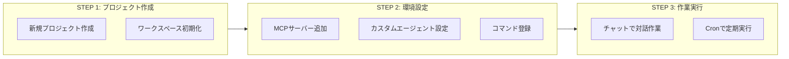

### 利用フロー詳細

| ステップ | 内容 | 説明 |
|----------|------|------|
| 1. プロジェクト作成 | 新規プロジェクトを作成 | ワークスペースディレクトリが自動生成され、設定ファイルが初期化されます |
| 2. 環境設定 | MCP・エージェント・コマンドを追加 | プロジェクト固有の外部連携やカスタムAIアシスタントを設定します |
| 3-A. チャット作業 | AIとの対話で作業実行 | リアルタイムでコード生成・編集・ファイル操作を行います |
| 3-B. 定期実行 | Cronでコマンドをスケジュール化 | 日次レポートや定期ビルドなどを自動実行します |

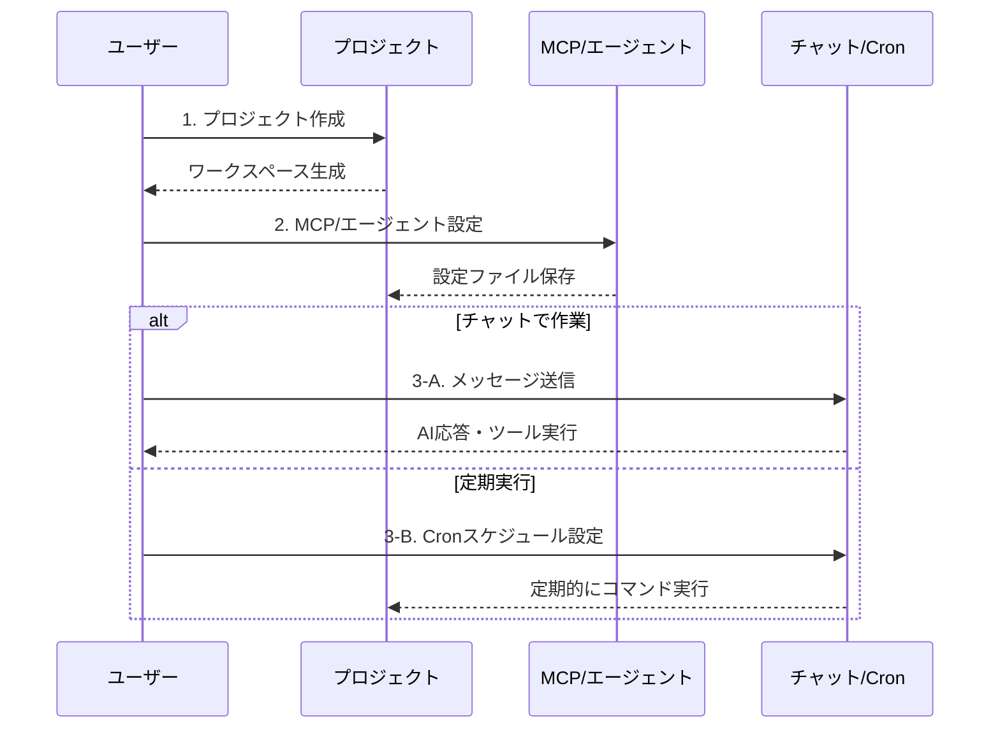

---

## 2. 機能一覧

本システムで利用可能な全機能の一覧です。

### 2.1 コア機能

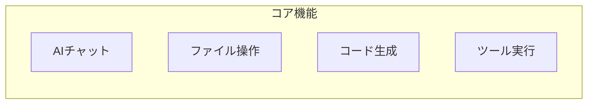

| 機能名 | 説明 | 主な用途 |
|--------|------|----------|
| AIチャット | Claude AIとのリアルタイム対話 | コード生成、質問応答、問題解決 |
| ファイル読込 (Read) | ファイル内容の表示・取得 | コードレビュー、内容確認 |
| ファイル作成 (Write) | 新規ファイル作成・上書き | コード生成、設定ファイル作成 |
| ファイル編集 (Edit) | 既存ファイルの部分編集 | バグ修正、機能追加 |
| コマンド実行 (Bash) | シェルコマンドの実行 | ビルド、テスト、Git操作 |
| ファイル検索 (Glob) | パターンによるファイル検索 | ファイル探索、一括操作 |
| 文字列検索 (Grep) | ファイル内の文字列検索 | コード検索、リファクタリング |

### 2.2 拡張機能

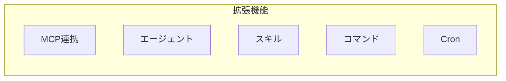

| 機能名 | 説明 | 主な用途 |
|--------|------|----------|
| MCPサーバー連携 | 外部ツール・サービスとの連携 | Slack、GitHub、DB接続等 |
| カスタムエージェント | 専門分野に特化したAIアシスタント | Laravel開発、API設計等 |
| スキル | 特定タスクの自動化処理 | 分析、テスト、ドキュメント生成 |
| コマンド | ショートカットによる機能呼出 | 頻繁に使う操作の効率化 |
| Cronスケジューラー | 定期的なタスク自動実行 | 日次レポート、定期バックアップ |

### 2.3 統合機能

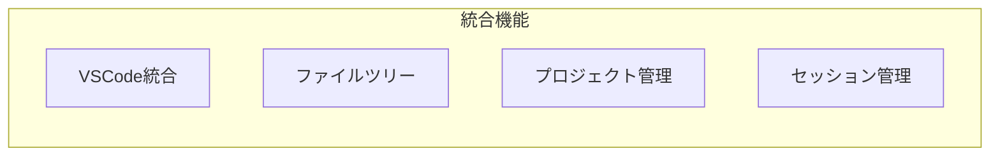

| 機能名 | 説明 | 主な用途 |
|--------|------|----------|
| VSCode統合 | ブラウザ内でのVSCode利用 | 高度なコード編集、デバッグ |
| ファイルツリー | プロジェクト構造の可視化 | ファイル管理、ナビゲーション |
| プロジェクト管理 | 複数プロジェクトの管理 | 作業の分離、整理 |
| セッション管理 | 会話履歴の保持・復元 | コンテキスト維持、作業継続 |

---

## 3. 機能詳細

### 3.1 プロジェクト管理

プロジェクトは**永続的な作業フォルダ**を生成する単位です。MCP接続やカスタムエージェントなどの設定はすべてプロジェクトに紐づきます。

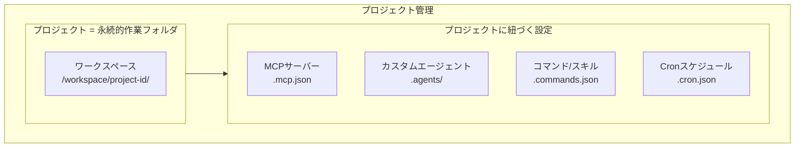

| 操作 | 説明 | API |
|------|------|-----|
| 作成 | 新規プロジェクトを作成し、ワークスペースを初期化 | POST /api/projects |
| 一覧取得 | 全プロジェクトの一覧を取得 | GET /api/projects |
| 詳細取得 | プロジェクトの詳細情報を取得 | GET /api/projects/{id} |
| 更新 | プロジェクト名・説明を更新 | PATCH /api/projects/{id} |
| 削除 | プロジェクトとワークスペースを削除 | DELETE /api/projects/{id} |

#### プロジェクトで管理されるファイル

| ファイル | 説明 |
|----------|------|
| .mcp.json | MCPサーバー接続設定 |
| .agents/*.md | カスタムエージェント定義 |
| .agents.json | エージェント有効/無効設定 |
| .commands.json | コマンド設定 |
| .skills.json | スキル設定 |
| .cron.json | 定期実行スケジュール |

### 3.2 セッション管理

セッションは**プロジェクトに対するチャット作業**の単位です。1つのプロジェクトに対して複数のセッションを作成でき、それぞれ独立した会話履歴を保持します。

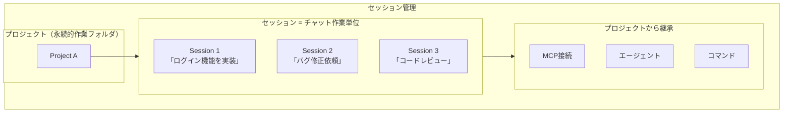

| 操作 | 説明 | API |
|------|------|-----|
| 作成 | 新規セッションを作成 | POST /api/sessions |
| 一覧取得 | プロジェクト内のセッション一覧 | GET /api/sessions?project_id={id} |
| 詳細取得 | セッションの詳細（メッセージ履歴含む） | GET /api/sessions/{id} |
| 更新 | セッション名を更新 | PATCH /api/sessions/{id} |
| 削除 | セッションと履歴を削除 | DELETE /api/sessions/{id} |

| 保存データ | 説明 | 保持期間 |
|------------|------|----------|
| メッセージ履歴 | ユーザー/AI間の全メッセージ | セッション削除まで |
| ツール実行結果 | ファイル操作等の結果 | セッション削除まで |
| トークン使用量 | API使用量の統計 | セッション削除まで |

### 3.3 AIチャット機能

AIとの対話を通じてコーディング作業を支援します。

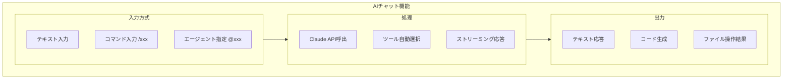

| 操作 | 説明 | 例 |
|------|------|-----|
| 通常メッセージ | 自然言語で指示 | 「ログイン機能を作成して」 |
| コマンド実行 | /で始まる特殊コマンド | `/sc:analyze` |
| エージェント指定 | @で専門エージェント呼出 | `@laravel-expert` |
| ファイル参照 | パスを含めて質問 | 「src/app.tsを説明して」 |

### 3.4 ファイル操作機能

6種類のツールでファイル操作を行います。

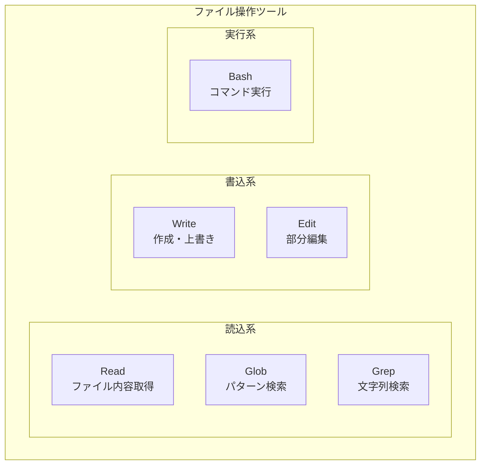

| ツール | 機能 | 使用例 |
|--------|------|--------|
| Read | ファイル全体または一部を読込 | コードレビュー、内容確認 |
| Write | ファイルを新規作成または上書き | 新規コード生成、設定作成 |
| Edit | ファイルの特定部分を編集 | バグ修正、コード追加 |
| Bash | シェルコマンドを実行 | npm install, git commit |
| Glob | ワイルドカードでファイル検索 | `*.ts`, `src/**/*.tsx` |
| Grep | 正規表現で文字列検索 | 関数定義検索、TODO検索 |

### 3.5 MCPサーバー連携

外部ツール・サービスと連携します。

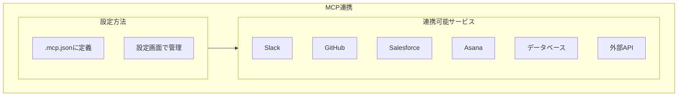

| 連携先 | 機能 | 設定ファイル |
|--------|------|-------------|
| Slack | メッセージ送受信、チャンネル操作 | .mcp.json |
| GitHub | リポジトリ操作、Issue管理 | .mcp.json |
| Salesforce | オブジェクト操作、Apex実行 | .mcp.json |
| Asana | タスク管理、プロジェクト操作 | .mcp.json |
| Context7 | ライブラリドキュメント取得 | .mcp.json |
| Serena | コード解析、シンボル操作 | .mcp.json |

#### MCP設定例

```json
{
  "mcpServers": {
    "slack": {
      "command": "npx",
      "args": ["slack-mcp-server"],
      "env": { "SLACK_TOKEN": "xoxb-..." }
    }
  }
}
```

### 3.6 カスタムエージェント

専門分野に特化したAIアシスタントを定義できます。

```mermaid
flowchart TB
    subgraph AgentSystem["エージェントシステム"]
        subgraph Definition["定義"]
            D1[.agents/xxx.md]
            D2[Markdown形式]
        end

        subgraph Components["構成要素"]
            C1[名前・説明]
            C2[使用モデル]
            C3[利用ツール]
            C4[システムプロンプト]
        end

        subgraph Usage["利用"]
            U1[AIが自動選択]
            U2[@agent名で指定]
        end

        Definition --> Components --> Usage
    end
```

| 項目 | 説明 | 設定値例 |
|------|------|----------|
| 名前 | エージェント識別名 | Laravel Expert |
| カテゴリ | 分類 | development, analysis |
| モデル | 使用するClaudeモデル | sonnet, opus, haiku |
| ツール | 使用可能なツール | Read, Write, Edit, Bash |
| プロンプト | 専門知識・振る舞い定義 | 自由記述 |

#### エージェント定義例 (.agents/laravel-expert.md)

```markdown
# Laravel Expert

Laravel開発の専門家

## Category
development

## Model
sonnet

## Tools
- Read
- Write
- Edit
- Bash

## System Prompt
あなたはLaravel開発の専門家です...
```

### 3.7 コマンド機能

よく使う操作をコマンドとして登録・実行できます。

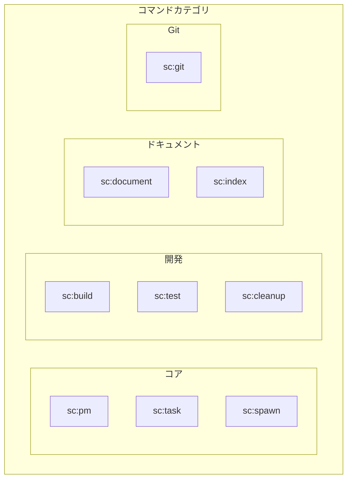

| カテゴリ | コマンド | 説明 |
|----------|----------|------|
| コア | sc:pm | プロジェクトマネージャー起動 |
| コア | sc:task | タスク実行 |
| コア | sc:spawn | サブタスク分解・実行 |
| 計画 | sc:brainstorm | 対話的要件定義 |
| 計画 | sc:design | システム設計 |
| 開発 | sc:implement | 機能実装 |
| 開発 | sc:build | ビルド実行 |
| 開発 | sc:test | テスト実行 |
| 分析 | sc:analyze | コード分析 |
| Git | sc:git | Git操作 |
| ヘルプ | sc:help | コマンド一覧表示 |

### 3.8 Cronスケジューラー

コマンドを定期的に自動実行できます。

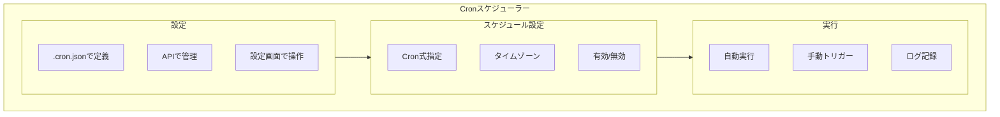

| 設定項目 | 説明 | 例 |
|----------|------|-----|
| name | スケジュール名 | daily-analysis |
| command | 実行コマンド | /sc:analyze |
| cron | Cron式 | 0 9 * * * |
| description | 説明 | 毎日9時に分析 |
| enabled | 有効/無効 | true |
| timezone | タイムゾーン | Asia/Tokyo |

#### Cron式プリセット

| プリセット | Cron式 | 説明 |
|-----------|--------|------|
| every_minute | * * * * * | 毎分実行 |
| every_5_minutes | */5 * * * * | 5分毎 |
| hourly | 0 * * * * | 毎時00分 |
| daily_9am | 0 9 * * * | 毎日9:00 |
| daily_6pm | 0 18 * * * | 毎日18:00 |
| weekly_monday | 0 9 * * 1 | 毎週月曜9:00 |
| weekly_friday | 0 17 * * 5 | 毎週金曜17:00 |
| monthly_1st | 0 0 1 * * | 毎月1日0:00 |

#### Cron設定例 (.cron.json)

```json
{
  "schedules": {
    "daily-analysis": {
      "command": "/sc:analyze",
      "cron": "0 9 * * *",
      "description": "毎日9時にコード分析",
      "enabled": true,
      "timezone": "Asia/Tokyo"
    }
  }
}
```

### 3.9 VSCode統合

ブラウザ内でVSCodeを利用できます。

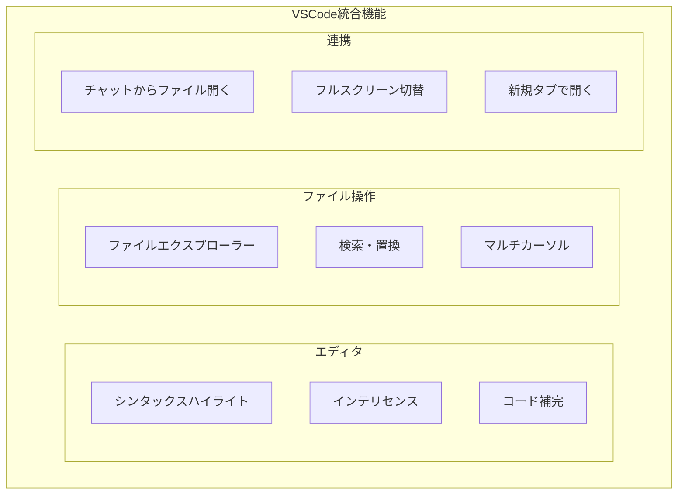

| 機能 | 説明 | 操作 |
|------|------|------|
| ファイル編集 | 高度なコード編集 | クリックで開く |
| 検索 | ファイル内/プロジェクト全体検索 | Ctrl+F / Ctrl+Shift+F |
| ターミナル | 統合ターミナル | Ctrl+` |
| フルスクリーン | 全画面表示 | ボタンクリック |
| 新規タブ | 別タブで開く | ボタンクリック |

---

## 4. 画面一覧

### 4.1 画面構成

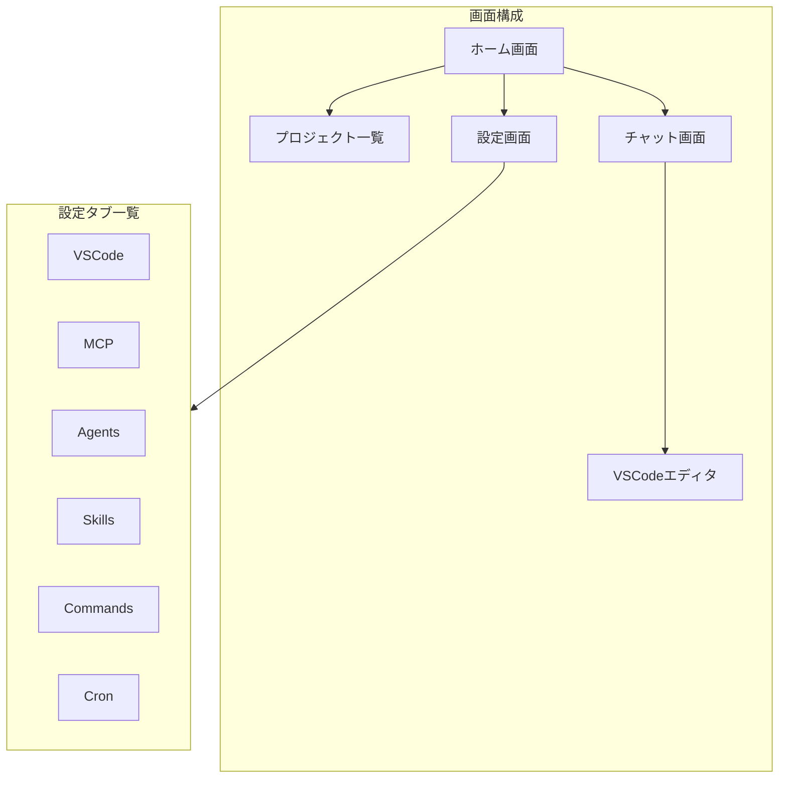

### 4.2 各画面の説明

| 画面 | 説明 | 主な機能 |
|------|------|----------|
| ホーム | アプリケーションのトップ画面 | プロジェクト選択、新規作成 |
| プロジェクト一覧 | 全プロジェクトの表示 | 一覧表示、検索、フィルタ |
| チャット | AIとの対話画面 | メッセージ送受信、ツール実行 |
| VSCodeエディタ | コード編集画面 | ファイル編集、検索 |
| MCP設定 | MCPサーバー管理 | 追加、削除、有効/無効 |
| エージェント設定 | エージェント管理 | 一覧、有効/無効、新規作成 |
| スキル設定 | スキル管理 | 有効/無効切替 |
| コマンド設定 | コマンド管理 | 有効/無効切替 |
| Cron設定 | スケジュール管理 | 追加、編集、削除、手動実行 |

### 4.3 チャット画面レイアウト

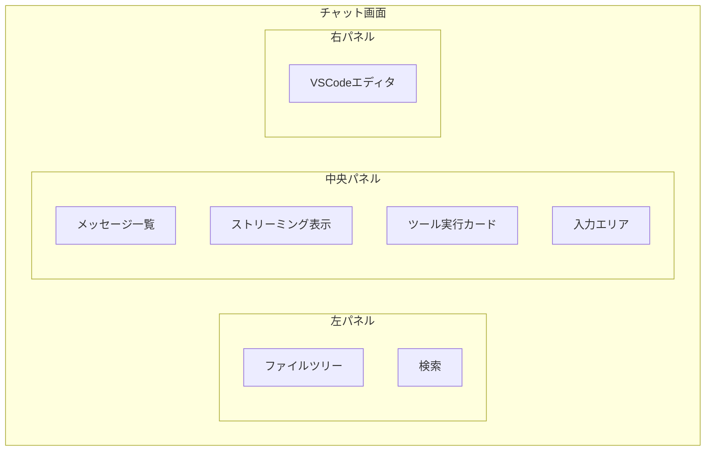

### 4.4 画面遷移図

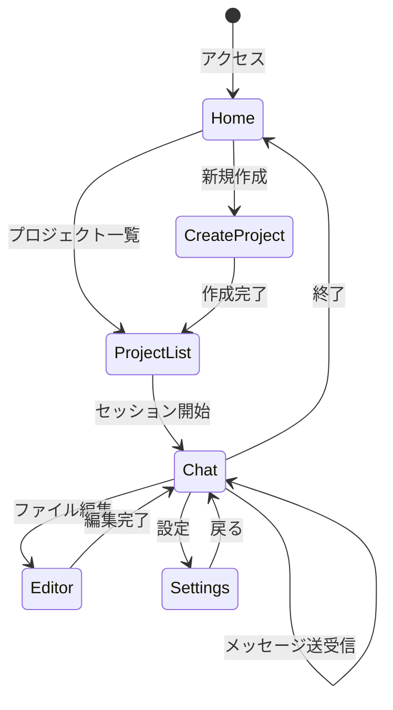

---

## 5. 操作リファレンス

### 5.1 キーボードショートカット

| カテゴリ | ショートカット | 機能 |
|----------|---------------|------|
| チャット | Enter | メッセージ送信 |
| チャット | Shift+Enter | 改行 |
| チャット | Escape | 入力キャンセル |
| チャット | Ctrl+/ | コマンドパレット |
| ナビ | Ctrl+P | プロジェクト切替 |
| ナビ | Ctrl+B | サイドバー切替 |
| エディタ | Ctrl+S | 保存 |
| エディタ | Ctrl+F | 検索 |
| エディタ | F11 | フルスクリーン |

### 5.2 APIエンドポイント

| エンドポイント | メソッド | 説明 |
|---------------|---------|------|
| /api/projects | GET | プロジェクト一覧 |
| /api/projects | POST | プロジェクト作成 |
| /api/sessions | GET | セッション一覧 |
| /api/sessions | POST | セッション作成 |
| /api/cron/projects/{id}/schedules | GET | スケジュール一覧 |
| /api/cron/projects/{id}/schedules | POST | スケジュール作成 |
| /api/cron/projects/{id}/logs | GET | 実行ログ取得 |
| /ws/chat/{session_id} | WebSocket | チャット接続 |

---

## 6. 用語集

| 用語 | 説明 |
|------|------|
| Project | 永続的な作業フォルダ。MCP・エージェント・コマンド等の設定を保持 |
| Session | プロジェクトに対するチャット作業単位。メッセージ履歴を保持 |
| MCP | Model Context Protocol。外部ツール連携規格 |
| Agent | 専門分野に特化したAIアシスタント（プロジェクトに紐づく） |
| Command | 登録されたコマンド（プロジェクトに紐づく） |
| Cron | 定期実行スケジューラー（プロジェクトに紐づく） |
| Tool | AIが使用するファイル操作等の機能 |
| Streaming | リアルタイムでの逐次応答表示 |

---

## 改訂履歴

| バージョン | 日付 | 変更内容 |
|-----------|------|----------|
| 1.0.0 | 2024-12 | 初版作成 |
| 1.1.0 | 2025-12 | Cronスケジューラー追加、機能一覧整理 |
