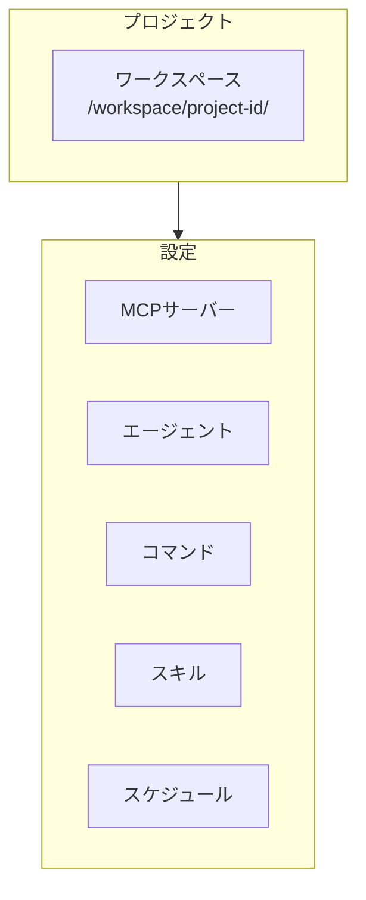
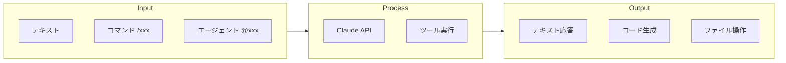

# ユーザガイド

Web版Claude Codeの使い方を説明します。

---

## 目次

### Part 1: チュートリアル
- [1. ユーザー登録・ログイン](#1-ユーザー登録ログイン)
- [2. プロジェクト作成](#2-プロジェクト作成)
- [3. APIキーの設定](#3-apiキーの設定)
- [4. MCPサーバーの追加](#4-mcpサーバーの追加)
- [5. サブエージェントの追加](#5-サブエージェントの追加)
- [6. コマンドの追加](#6-コマンドの追加)
- [7. チャットを開始](#7-チャットを開始)

### Part 2: その他の機能
- [8. 外部共有](#8-外部共有)
- [9. スケジュール実行](#9-スケジュール実行)
- [10. スキル](#10-スキル)
- [11. VSCode統合](#11-vscode統合)

### Part 3: 詳細リファレンス
- [12. 機能詳細](#12-機能詳細)
- [13. ツール一覧](#13-ツール一覧)
- [14. キーボードショートカット](#14-キーボードショートカット)
- [15. 用語集](#15-用語集)

---

# Part 1: チュートリアル

このセクションでは、実際の設定例を使ってハンズオン形式で学びます。

---

## 1. ユーザー登録・ログイン

### 新規登録

1. ブラウザで http://localhost:3000 にアクセス
2. 「新規登録」をクリック
3. 必要情報を入力
   - メールアドレス: `test@example.com`
   - パスワード: 8文字以上
   - 表示名: 任意
4. 「登録」ボタンをクリック

### ログイン

1. 登録したメールアドレスとパスワードを入力
2. 「ログイン」ボタンをクリック
3. ダッシュボードが表示されます

---

## 2. プロジェクト作成

1. サイドバーの「+」ボタンをクリック
2. プロジェクト名を入力（例: `my-laravel-app`）
3. 説明を入力（例: `Laravelで作るWebアプリケーション`）
4. 「作成」ボタンをクリック

プロジェクトが作成されると、自動的にワークスペースディレクトリが生成されます。

```
workspace/
└── {project-id}/
    ├── .claude/           # Claude設定
    └── (ユーザーファイル)
```

---

## 3. APIキーの設定

プロジェクトでClaudeを利用するには、APIキーの設定が必要です。

1. 右パネルの「設定」タブをクリック
2. Anthropic APIキーを入力
3. 「保存」ボタンをクリック

> **Note**: APIキーは [Anthropic Console](https://console.anthropic.com/) で取得できます。

---

## 4. MCPサーバーの追加

MCPサーバーを追加すると、外部ツール（Slack, GitHub等）と連携できます。

### 実例: Context7（ドキュメント検索）の追加

1. 右パネルの「MCP」タブをクリック
2. 「サーバー追加」ボタンをクリック
3. 以下の情報を入力:

| 項目 | 値 |
|------|-----|
| サーバー名 | `context7` |
| コマンド | `npx` |
| 引数 | `["-y", "@context7/mcp"]` |
| 環境変数 | `{}` |
| 有効 | ✓ |

4. 「保存」をクリック

### 実例: GitHub MCPの追加

1. 「サーバー追加」ボタンをクリック
2. 以下の情報を入力:

| 項目 | 値 |
|------|-----|
| サーバー名 | `github` |
| コマンド | `npx` |
| 引数 | `["-y", "@modelcontextprotocol/server-github"]` |
| 環境変数 | `{"GITHUB_PERSONAL_ACCESS_TOKEN": "ghp_xxxx"}` |
| 有効 | ✓ |

3. 「保存」をクリック

### 実例: Slack MCPの追加

| 項目 | 値 |
|------|-----|
| サーバー名 | `slack` |
| コマンド | `npx` |
| 引数 | `["-y", "@modelcontextprotocol/server-slack"]` |
| 環境変数 | `{"SLACK_BOT_TOKEN": "xoxb-xxxx", "SLACK_TEAM_ID": "T01234567"}` |

---

## 5. サブエージェントの追加

専門分野に特化したAIアシスタントを作成できます。

### 実例: Laravel Expertエージェントの追加

1. 右パネルの「サブエージェント」タブをクリック
2. 「エージェント追加」ボタンをクリック
3. 以下の情報を入力:

| 項目 | 値 |
|------|-----|
| 名前 | `laravel-expert` |
| 説明 | `Laravelの専門家。ベストプラクティスに従った開発を支援` |
| カテゴリ | `development` |
| モデル | `sonnet` |
| 有効 | ✓ |

4. システムプロンプトを入力:

```
あなたはLaravel開発の専門家です。

## 専門知識
- Laravel 10/11の最新機能
- Eloquent ORMのベストプラクティス
- Artisanコマンドの活用
- テスト駆動開発（TDD）
- PSR-12コーディング規約

## 行動指針
- 常にLaravelの規約に従う
- セキュリティを最優先に考慮
- パフォーマンスを意識したコード
- 日本語でわかりやすく説明

## 使用するツール
- Read: ファイル読み込み
- Write: ファイル作成
- Edit: ファイル編集
- Bash: コマンド実行
```

5. 「保存」をクリック

### 実例: Code Reviewerエージェントの追加

| 項目 | 値 |
|------|-----|
| 名前 | `code-reviewer` |
| 説明 | `コードレビューの専門家。品質とセキュリティを重視` |
| カテゴリ | `quality` |
| モデル | `sonnet` |

システムプロンプト:
```
あなたはシニアエンジニアとしてコードレビューを行います。

## レビュー観点
- コードの可読性
- パフォーマンス
- セキュリティ脆弱性
- テストカバレッジ
- SOLID原則の遵守

## 出力形式
- 問題点は具体的に指摘
- 改善案を必ず提示
- 良い点も褒める
```

---

## 6. コマンドの追加

よく使う操作をコマンドとして登録できます。

### 実例: コード分析コマンドの追加

1. 右パネルの「コマンド」タブをクリック
2. 「新規コマンド作成」ボタンをクリック
3. 以下の情報を入力:

| 項目 | 値 |
|------|-----|
| 名前 | `analyze` |
| 説明 | `プロジェクトのコード分析を実行` |
| カテゴリ | `analysis` |
| 有効 | ✓ |

4. 内容を入力:

```
プロジェクト全体のコード分析を行ってください。

## 分析項目
1. ディレクトリ構造の確認
2. 主要ファイルの特定
3. 依存関係の確認
4. 潜在的な問題点の検出

## 出力形式
- Markdownテーブルで整理
- 問題点は優先度付きでリスト化
- 改善提案を含める
```

5. 「保存」をクリック

### 実例: テスト実行コマンドの追加

| 項目 | 値 |
|------|-----|
| 名前 | `test` |
| 説明 | `テストを実行して結果を報告` |
| カテゴリ | `development` |

内容:
```
テストを実行して結果を報告してください。

1. テストコマンドを実行
2. 失敗したテストがあれば原因を分析
3. 修正案を提示
```

### コマンドの使い方

チャットで `/analyze` または `/test` と入力すると、登録したコマンドが実行されます。

---

## 7. チャットを開始

設定が完了したら、チャットを開始しましょう。

### 新規セッションの作成

1. プロジェクトを選択
2. 「+ 新規セッション」をクリック
3. セッション名を入力（任意）
4. モデルを選択
5. 「作成」をクリック

### メッセージの送信

1. 下部の入力エリアにメッセージを入力
2. Enterキーで送信（Shift+Enterで改行）

**実例:**
```
Laravelで簡単なTodoアプリを作成してください。
- マイグレーション
- モデル
- コントローラー
- ルーティング
```

### コマンドの実行

```
/analyze
```

### エージェントの呼び出し

```
@laravel-expert このコードをレビューしてください
```

---

# Part 2: その他の機能

---

## 8. 外部共有

プロジェクトを外部ユーザーに公開できます。

### 設定方法

1. 右パネルの「外部公開」タブをクリック
2. 「外部公開を有効化」をクリック
3. 公開するコマンドを選択
4. セキュリティ設定を行う

| 設定項目 | 説明 |
|----------|------|
| パスワード保護 | アクセス時にパスワードを要求 |
| IP制限 | 特定のIPアドレスのみ許可 |
| 1日の最大セッション数 | 1日あたりのセッション数制限 |
| メッセージ数制限 | セッションあたりのメッセージ数制限 |
| 公開期限 | 公開終了日時を設定 |

### 共有URLの取得

設定完了後、共有URLが表示されます。このURLを外部ユーザーに共有してください。

---

## 9. スケジュール実行

コマンドを定期的に自動実行できます。

### 設定方法

1. 右パネルの「スケジュール」タブをクリック
2. 「スケジュール追加」をクリック
3. 以下の情報を入力:

| 項目 | 説明 | 例 |
|------|------|-----|
| 名前 | スケジュール名 | `daily-analysis` |
| コマンド | 実行するコマンド | `/analyze` |
| Cron式 | 実行タイミング | `0 9 * * *` |
| タイムゾーン | タイムゾーン | `Asia/Tokyo` |
| 説明 | 説明文 | `毎日9時にコード分析` |

### Cron式の例

| 式 | 説明 |
|-----|------|
| `* * * * *` | 毎分 |
| `0 * * * *` | 毎時0分 |
| `0 9 * * *` | 毎日9:00 |
| `0 9 * * 1` | 毎週月曜9:00 |
| `0 0 1 * *` | 毎月1日0:00 |

---

## 10. スキル

スキルは特定のタスクに対するプロンプトテンプレートです。

### 設定方法

1. 右パネルの「スキル」タブをクリック
2. 「スキル作成」をクリック
3. スキル情報を入力

### 実例: ドキュメント生成スキル

| 項目 | 値 |
|------|-----|
| 名前 | `document` |
| 説明 | `ドキュメントを自動生成` |
| カテゴリ | `documentation` |

内容:
```
指定されたコードのドキュメントを生成してください。

## 出力形式
- Markdown形式
- 関数/クラスごとに説明
- 使用例を含める
- 日本語で記述
```

---

## 11. VSCode統合

ブラウザ内でVSCodeを利用できます。

### 使い方

1. 右パネルの「VSCode」タブをクリック
2. ブラウザ内でVSCodeが起動
3. ファイルの編集、検索、ターミナル操作が可能

### 主な機能

| 機能 | 説明 |
|------|------|
| ファイル編集 | シンタックスハイライト、インテリセンス |
| 検索 | ファイル内/プロジェクト全体検索 |
| ターミナル | 統合ターミナル |
| フルスクリーン | 全画面表示 |

---

# Part 3: 詳細リファレンス

---

## 12. 機能詳細

### 12.1 プロジェクト管理

プロジェクトは**永続的な作業フォルダ**を生成する単位です。



| 操作 | 説明 | API |
|------|------|-----|
| 作成 | 新規プロジェクトを作成 | POST /api/projects |
| 一覧取得 | 全プロジェクトの一覧を取得 | GET /api/projects |
| 詳細取得 | プロジェクトの詳細情報を取得 | GET /api/projects/{id} |
| 更新 | プロジェクト名・説明を更新 | PATCH /api/projects/{id} |
| 削除 | プロジェクトとワークスペースを削除 | DELETE /api/projects/{id} |

### 12.2 セッション管理

セッションは**プロジェクトに対するチャット作業**の単位です。

| 保存データ | 説明 |
|------------|------|
| メッセージ履歴 | ユーザー/AI間の全メッセージ |
| ツール実行結果 | ファイル操作等の結果 |
| トークン使用量 | API使用量の統計 |
| SDKセッションID | Claude SDKの会話コンテキスト |

**セッション再開機能:**

ブラウザを更新したり、ページを閉じて再度開いた場合でも、AIとの会話コンテキストは維持されます。

### 12.3 AIチャット



| 操作 | 説明 | 例 |
|------|------|-----|
| 通常メッセージ | 自然言語で指示 | 「ログイン機能を作成して」 |
| コマンド実行 | /で始まる特殊コマンド | `/analyze` |
| エージェント指定 | @で専門エージェント呼出 | `@laravel-expert` |
| ファイル参照 | パスを含めて質問 | 「src/app.tsを説明して」 |

---

## 13. ツール一覧

AIが使用できるファイル操作ツールです。

### 読込系

| ツール | 機能 | 使用例 |
|--------|------|--------|
| Read | ファイル全体または一部を読込 | コードレビュー、内容確認 |
| Glob | ワイルドカードでファイル検索 | `*.ts`, `src/**/*.tsx` |
| Grep | 正規表現で文字列検索 | 関数定義検索、TODO検索 |

### 書込系

| ツール | 機能 | 使用例 |
|--------|------|--------|
| Write | ファイルを新規作成または上書き | 新規コード生成、設定作成 |
| Edit | ファイルの特定部分を編集 | バグ修正、コード追加 |

### 実行系

| ツール | 機能 | 使用例 |
|--------|------|--------|
| Bash | シェルコマンドを実行 | npm install, git commit |

---

## 14. キーボードショートカット

### チャット

| ショートカット | 機能 |
|---------------|------|
| Enter | メッセージ送信 |
| Shift+Enter | 改行 |
| Escape | 入力キャンセル |
| Ctrl+/ | コマンドパレット |

### ナビゲーション

| ショートカット | 機能 |
|---------------|------|
| Ctrl+P | プロジェクト切替 |
| Ctrl+B | サイドバー切替 |

### VSCode

| ショートカット | 機能 |
|---------------|------|
| Ctrl+S | 保存 |
| Ctrl+F | 検索 |
| Ctrl+Shift+F | 全体検索 |
| Ctrl+` | ターミナル |
| F11 | フルスクリーン |

---

## 15. 用語集

| 用語 | 説明 |
|------|------|
| Project | 永続的な作業フォルダ。設定を保持 |
| Session | プロジェクトに対するチャット作業単位 |
| MCP | Model Context Protocol。外部ツール連携規格 |
| Agent | 専門分野に特化したAIアシスタント |
| Command | /で呼び出すプロンプトテンプレート |
| Skill | タスク用のプロンプトテンプレート |
| Tool | AIが使用するファイル操作機能 |
| Streaming | リアルタイムでの逐次応答表示 |

---

## 改訂履歴

| バージョン | 日付 | 変更内容 |
|-----------|------|----------|
| 1.0.0 | 2025-01 | 初版作成 |
