# Web版Claude Code ユーザー運用設計書

**作成日:** 2025-12-20
**最終更新:** 2025-12-21
**バージョン:** 1.1
**対象:** Web版Claude Codeプロジェクト
**ステータス:** ✅ 完了（100%）

---

## 目次

1. [概要](#1-概要)
2. [ユーザーロール定義](#2-ユーザーロール定義)
3. [ユーザーフロー](#3-ユーザーフロー)
4. [認証・認可](#4-認証認可)
5. [ユースケース](#5-ユースケース)
6. [運用ルール](#6-運用ルール)
7. [データ管理ポリシー](#7-データ管理ポリシー)
8. [セキュリティガイドライン](#8-セキュリティガイドライン)
9. [トラブルシューティング](#9-トラブルシューティング)
10. [サポート体制](#10-サポート体制)
11. [モニタリング・メトリクス](#11-モニタリングメトリクス)

---

## 1. 概要

### 1.1 目的

Web版Claude Codeは、ブラウザからアクセス可能なAIコーディングアシスタントです。本設計書は、システムの安全で効率的な運用を実現するためのユーザー管理、権限設定、運用ルール、トラブルシューティング手順を定義します。

### 1.2 対象読者

- システム管理者
- プロダクトマネージャー
- カスタマーサポート担当者
- 開発チーム

### 1.3 システム構成概要

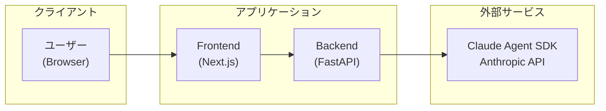

### 1.4 プロジェクト・セッション階層

本システムは **1 Project : N Sessions** アーキテクチャを採用しています。

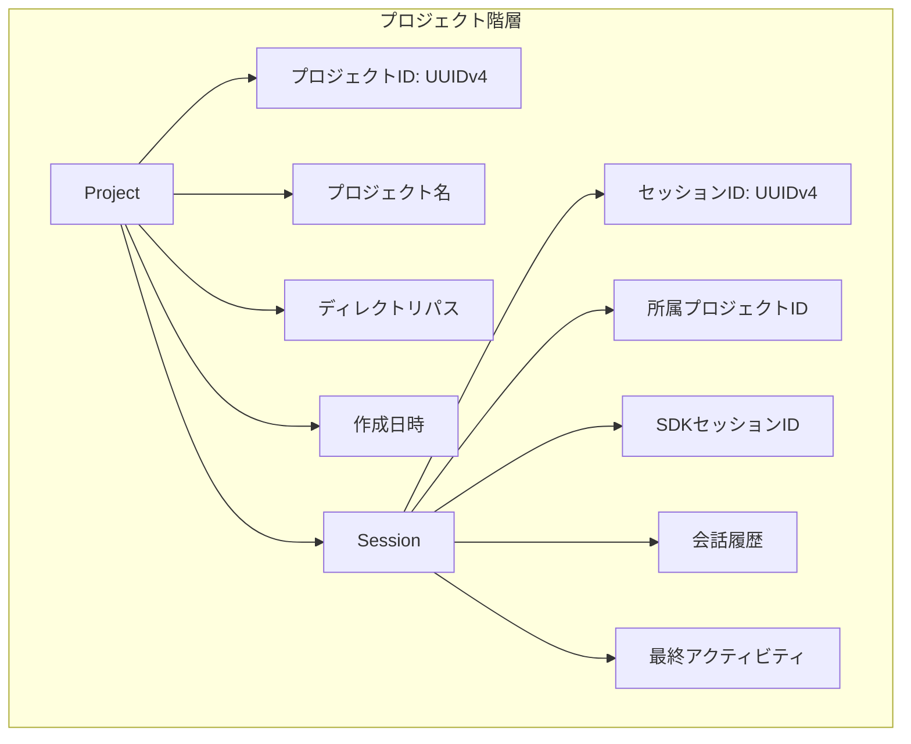

#### プロジェクト管理

**プロジェクト:**
- 1つのプロジェクトは1つのディレクトリに紐づく
- 複数のセッションを持つことが可能
- 同じプロジェクト内のセッションはディレクトリを共有

**セッション:**
- 1つのセッションはClaude Agent SDKの1つの会話に対応
- セッションごとに独立した会話履歴を保持
- 同一プロジェクト内でファイルを共有

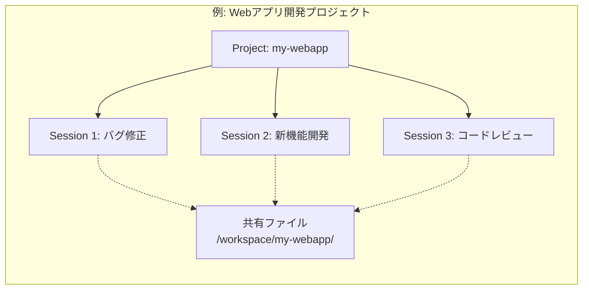

---

## 2. ユーザーロール定義

### 2.1 ロール一覧

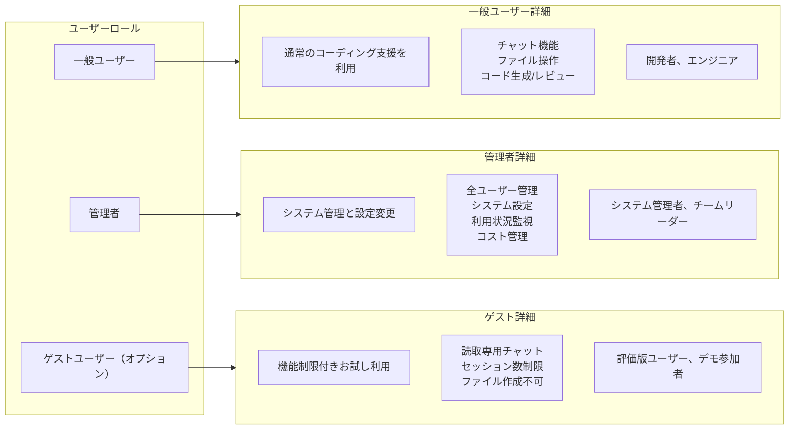

### 2.2 ロール詳細

#### 2.2.1 一般ユーザー

**目的:** 日常的なコーディング作業の支援

**できること:**
- 新規セッション作成（最大10セッション/ユーザー）
- Claudeとの対話（コード生成、レビュー、質問）
- ワークスペース内のファイル操作（読取、作成、編集、削除）
- セッション履歴の参照
- 自分のセッションの管理（削除、タイトル変更）
- テーマ・設定のカスタマイズ

**制限事項:**
- 他ユーザーのセッションへのアクセス不可
- システム設定の変更不可
- 外部ネットワークアクセス制限（WebFetch, WebSearch無効）
- 1セッションあたりの最大継続時間: 1時間（無操作でタイムアウト）
- 1日あたりのAPI呼び出し上限: 500回

**データアクセス範囲:**
- 自身のワークスペース: `/app/workspace/{user_id}/{session_id}/`
- 自身のセッション履歴
- 自身の利用統計

#### 2.2.2 管理者

**目的:** システム全体の管理と最適化

**できること:**
- 全ユーザーのアカウント管理（作成、無効化、削除）
- ロール割り当て変更
- システム設定の変更（レート制限、最大セッション数等）
- 全セッションの閲覧・削除
- 利用統計・コスト分析の参照
- セキュリティポリシーの設定
- バックアップ・復元操作
- 監査ログの閲覧

**制限事項:**
- ユーザーのワークスペース内のファイル内容は暗号化されている場合閲覧不可
- システムクリティカルな操作には二要素認証が必要

**アクセス範囲:**
- 管理ダッシュボード: `/admin`
- 全ユーザーのメタデータ（ファイル内容を除く）
- システムログ・監査ログ

#### 2.2.3 ゲストユーザー (オプション機能)

**目的:** 製品評価とデモンストレーション

**できること:**
- 1つのセッションのみ作成可能
- 読取専用モードでのコード参照
- 限定的なチャット機能（1日10回まで）
- テンプレートプロジェクトの閲覧

**制限事項:**
- ファイル作成・編集不可（読取のみ）
- セッション保存不可（ブラウザクローズで削除）
- 高度な機能へのアクセス不可（Bash実行、外部API連携等）
- 利用時間: 最大30分

**データアクセス範囲:**
- 共有デモワークスペース: `/app/workspace/demo/`（読取専用）
- 一時セッション領域（自動削除）

---

## 3. ユーザーフロー

### 3.1 初回アクセスフロー

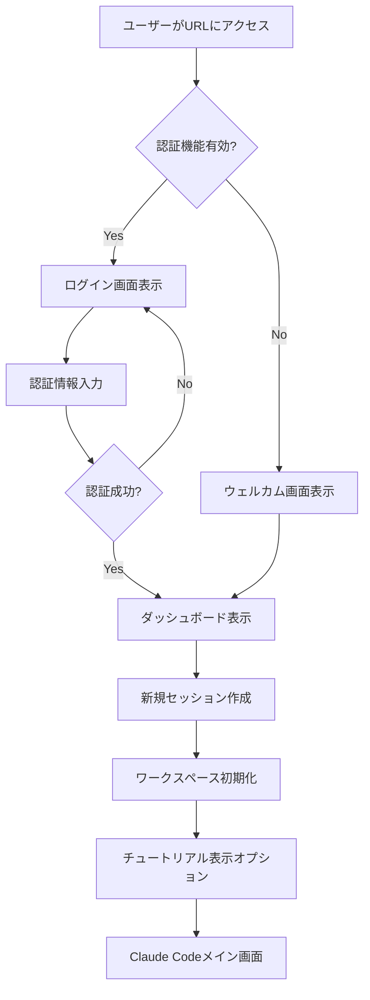

#### 3.1.1 ステップ詳細

**Step 1: アクセス**
- URL: `https://your-domain.com/`
- 初回アクセス時にブラウザ互換性チェック
- 必要なJavaScript機能の確認

**Step 2: 認証（有効な場合）**
- ログインフォーム表示
- サポートされる認証方式:
  - メールアドレス + パスワード
  - OAuth (Google, GitHub等) - オプション
  - API Key認証 - プログラマティックアクセス用

**Step 3: 初期設定**
- ユーザープロファイル作成
- デフォルトテーマ選択
- 初期ワークスペース作成

**Step 4: オンボーディング**
- インタラクティブチュートリアル（スキップ可能）
  1. 基本的なチャット操作
  2. ファイル操作方法
  3. コード生成デモ
  4. ツール使用の理解

### 3.2 通常利用フロー

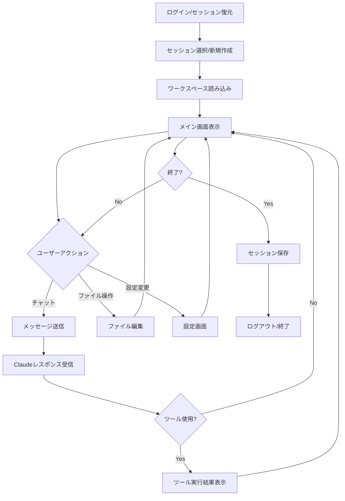

#### 3.2.1 セッション管理

**セッション作成:**
1. サイドバーの「+ 新規セッション」ボタンクリック
2. セッション名の入力（オプション、デフォルト: "新しいチャット"）
3. モデル選択（claude-opus-4-5, claude-sonnet-4等）
4. 権限モード選択:
   - **デフォルト:** 通常の対話式許可
   - **自動承認:** ファイル編集を自動承認
   - **プランモード:** 実行前に計画を確認
5. セッション初期化（約1-2秒）

**セッション切り替え:**
- サイドバーからセッションをクリック
- ワークスペースとチャット履歴が自動読み込み
- 複数タブでの同時セッションサポート

**セッション削除:**
1. セッションカード右クリック → 「削除」
2. 確認ダイアログ表示
3. 削除実行（ワークスペースファイルも削除）

### 3.3 セッション復元フロー

**自動保存:**
- チャット履歴はリアルタイムでRedisに保存
- ファイル変更は1秒のデバウンス後に自動保存
- セッション状態（開いているファイル、カーソル位置等）も保存

**復元:**
1. ログイン後、前回のセッション一覧を表示
2. 最後に使用したセッションを自動選択
3. ワークスペース状態を復元:
   - 開いていたファイル
   - エディタのスクロール位置
   - チャット履歴
   - 未送信のメッセージ（下書き）

### 3.4 エラーリカバリーフロー

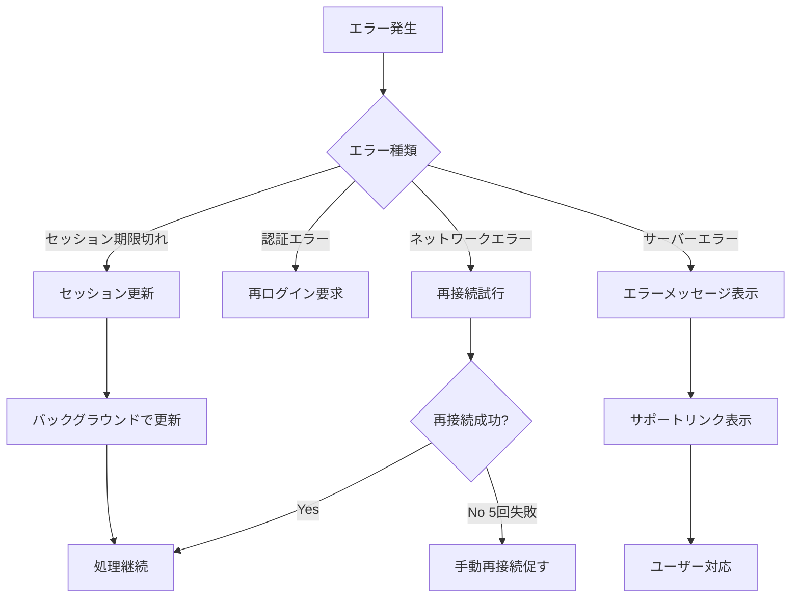

---

## 4. 認証・認可

### 4.1 認証方式

#### 4.1.1 パスワード認証（基本）

**実装仕様:**
```python
# backend/app/core/security/auth.py
from passlib.context import CryptContext
from jose import JWTError, jwt
from datetime import datetime, timedelta

pwd_context = CryptContext(schemes=["bcrypt"], deprecated="auto")

class AuthService:
    def __init__(self, secret_key: str):
        self.secret_key = secret_key
        self.algorithm = "HS256"
        self.access_token_expire = 24  # 24時間

    def create_access_token(self, user_id: str) -> str:
        expire = datetime.utcnow() + timedelta(hours=self.access_token_expire)
        payload = {
            "sub": user_id,
            "exp": expire,
            "iat": datetime.utcnow(),
            "type": "access"
        }
        return jwt.encode(payload, self.secret_key, algorithm=self.algorithm)

    def verify_password(self, plain_password: str, hashed_password: str) -> bool:
        return pwd_context.verify(plain_password, hashed_password)
```

**パスワード要件:**
- 最小長: 12文字
- 必須要素: 大文字、小文字、数字、特殊文字
- 過去3回のパスワード再利用不可
- 90日ごとの変更推奨

**ログインフロー:**
1. メールアドレス + パスワード入力
2. reCAPTCHA検証（3回以上失敗時）
3. 認証成功 → JWTトークン発行
4. トークンをlocalStorageに保存
5. 認証失敗 → エラーメッセージ表示（最大5回まで、その後15分ロック）

#### 4.1.2 API Key認証（プログラマティックアクセス）

**用途:**
- CI/CDパイプラインからのアクセス
- 自動化スクリプト
- サードパーティ統合

**API Key生成:**
```bash
POST /api/auth/api-keys
Authorization: Bearer {access_token}

{
  "name": "CI/CD Pipeline",
  "permissions": ["read", "write"],
  "expires_in_days": 90
}

Response:
{
  "api_key": "sk_live_abc123...",
  "created_at": "2025-12-20T10:00:00Z",
  "expires_at": "2026-03-20T10:00:00Z"
}
```

**使用方法:**
```bash
curl -H "X-API-Key: sk_live_abc123..." \
     https://your-domain.com/api/sessions
```

**セキュリティ:**
- プレフィックス `sk_live_` で本番環境キーを識別
- 1ユーザーあたり最大5個のAPIキー
- 未使用キーは90日後に自動無効化
- IPホワイトリスト設定可能

#### 4.1.3 OAuth 2.0（オプション）

**サポートプロバイダー:**
- Google Workspace
- GitHub
- Microsoft Azure AD

**実装例（GitHub OAuth）:**
```typescript
// frontend/src/lib/auth/oauth.ts
export const initiateGitHubOAuth = () => {
  const clientId = process.env.NEXT_PUBLIC_GITHUB_CLIENT_ID;
  const redirectUri = `${window.location.origin}/auth/callback/github`;
  const scope = 'user:email';

  const authUrl = `https://github.com/login/oauth/authorize?` +
    `client_id=${clientId}&redirect_uri=${redirectUri}&scope=${scope}`;

  window.location.href = authUrl;
};
```

### 4.2 セッション管理

#### 4.2.1 セッション識別子

**フォーマット:**
- セッションID: UUIDv4 形式 (`sess_abc123def456`)
- ワークスペースパス: `/app/workspace/{user_id}/{session_id}/`

**セッションライフサイクル:**
```python
# backend/app/models/sessions.py
from enum import Enum
from datetime import datetime
from pydantic import BaseModel

class SessionStatus(str, Enum):
    ACTIVE = "active"
    IDLE = "idle"
    EXPIRED = "expired"
    TERMINATED = "terminated"

class Session(BaseModel):
    id: str
    user_id: str
    status: SessionStatus
    created_at: datetime
    last_activity: datetime
    expires_at: datetime
    metadata: dict = {}
```

**タイムアウト設定:**
- アクティブセッション: 1時間無操作でIDLE状態
- IDLE状態: さらに1時間でEXPIRED（自動削除候補）
- 最大セッション時間: 24時間（その後強制終了）

#### 4.2.2 並行セッション管理

**制限:**
- 一般ユーザー: 最大10セッション同時保持
- ゲストユーザー: 1セッションのみ
- 管理者: 制限なし

**超過時の動作:**
1. 警告メッセージ表示: "セッション上限に達しました"
2. 最も古いIDLEセッションを自動削除
3. 新規セッション作成

### 4.3 権限モデル

#### 4.3.1 ロールベースアクセス制御（RBAC）

**権限マトリクス:**

```mermaid
flowchart TD
    subgraph Operations["操作"]
        Op1["セッション作成"]
        Op2["セッション削除"]
        Op3["ファイル読取"]
        Op4["ファイル作成/編集"]
        Op5["ファイル削除"]
        Op6["Bash実行"]
        Op7["外部API呼び出し"]
        Op8["ユーザー管理"]
        Op9["システム設定"]
        Op10["監査ログ閲覧"]
    end

    subgraph RegularUser["一般ユーザー"]
        R1["✓ 最大10"]
        R2["✓ 自分のみ"]
        R3["✓"]
        R4["✓"]
        R5["✓"]
        R6["✓ 制限付き"]
        R7["✗"]
        R8["✗"]
        R9["✗"]
        R10["✗"]
    end

    subgraph AdminUser["管理者"]
        A1["✓"]
        A2["✓ 全て"]
        A3["✓"]
        A4["✓"]
        A5["✓"]
        A6["✓"]
        A7["✓"]
        A8["✓"]
        A9["✓"]
        A10["✓"]
    end

    subgraph GuestUser["ゲスト"]
        G1["✓ 1のみ"]
        G2["✗"]
        G3["✓"]
        G4["✗"]
        G5["✗"]
        G6["✗"]
        G7["✗"]
        G8["✗"]
        G9["✗"]
        G10["✗"]
    end

    Op1 --> R1 & A1 & G1
    Op2 --> R2 & A2 & G2
    Op3 --> R3 & A3 & G3
    Op4 --> R4 & A4 & G4
    Op5 --> R5 & A5 & G5
    Op6 --> R6 & A6 & G6
    Op7 --> R7 & A7 & G7
    Op8 --> R8 & A8 & G8
    Op9 --> R9 & A9 & G9
    Op10 --> R10 & A10 & G10
```

#### 4.3.2 ツール権限管理

**サンドボックス設定:**
```python
# backend/app/core/security/sandbox.py
class PermissionMode(str, Enum):
    DEFAULT = "default"           # 対話式確認
    ACCEPT_EDITS = "acceptEdits"  # ファイル編集自動承認
    PLAN = "plan"                 # 実行前に計画確認
    BYPASS = "bypass"             # 全て自動承認（管理者のみ）

class SandboxConfig(BaseModel):
    allowed_tools: List[str] = ["Read", "Write", "Edit", "Glob", "Grep"]
    disallowed_tools: List[str] = ["WebFetch", "WebSearch"]
    permission_mode: PermissionMode = PermissionMode.DEFAULT
    max_file_size: int = 10 * 1024 * 1024  # 10MB
    blocked_commands: List[str] = [
        "rm -rf /",
        "curl",
        "wget",
        "nc",  # netcat
        "chmod 777"
    ]
```

**ユーザー種別ごとのデフォルト設定:**

**一般ユーザー:**
```json
{
  "allowed_tools": ["Read", "Write", "Edit", "Glob", "Grep", "Bash"],
  "disallowed_tools": ["WebFetch", "WebSearch", "Task"],
  "permission_mode": "acceptEdits",
  "blocked_commands": ["rm -rf", "curl", "wget", "nc", "sudo"]
}
```

**管理者:**
```json
{
  "allowed_tools": ["*"],
  "disallowed_tools": [],
  "permission_mode": "bypass",
  "blocked_commands": []
}
```

**ゲスト:**
```json
{
  "allowed_tools": ["Read", "Glob", "Grep"],
  "disallowed_tools": ["Write", "Edit", "Bash", "WebFetch", "WebSearch"],
  "permission_mode": "plan",
  "blocked_commands": ["*"]
}
```

---

## 5. ユースケース

### 5.1 コード生成

**シナリオ:** ユーザーが新しい機能を実装したい

**ステップ:**
1. セッションを開く
2. 要件を自然言語で説明
   ```
   ユーザー: "Pythonで、CSVファイルを読み込んで
   データを集計し、グラフを生成する関数を作成してください"
   ```
3. Claudeが実装を提案
4. ツール使用で自動的にファイル作成
   - `data_processor.py`: データ処理ロジック
   - `visualizer.py`: グラフ生成ロジック
   - `requirements.txt`: 依存関係
5. ユーザーがコードレビュー
6. 必要に応じて修正依頼

**期待される成果:**
- 完全に動作するコード
- 適切なエラーハンドリング
- ドキュメント化されたコード
- テストケース（オプション）

**運用上の注意:**
- 生成されたコードは必ずレビュー
- セキュリティ上の問題がないか確認
- 本番環境への適用前にテスト実施

### 5.2 コードレビュー

**シナリオ:** 既存コードの品質改善

**ステップ:**
1. レビュー対象ファイルを開く
2. ファイルツリーからファイルを選択
3. チャットで依頼
   ```
   ユーザー: "このファイルをレビューして、
   改善点を教えてください"
   ```
4. Claudeが分析結果を提示:
   - コードの品質評価
   - 潜在的なバグ
   - パフォーマンス改善案
   - ベストプラクティス違反
5. 修正案の適用（自動またはユーザー選択）

**レビュー観点:**
- コード品質（可読性、保守性）
- セキュリティ脆弱性
- パフォーマンスボトルネック
- テストカバレッジ
- ドキュメント不足

### 5.3 バグ修正

**シナリオ:** エラーメッセージを元にバグを修正

**ステップ:**
1. エラーログをチャットに貼り付け
   ```
   ユーザー: "このエラーを修正してください:
   TypeError: 'NoneType' object is not subscriptable
   at line 45 in process_data()"
   ```
2. Claudeが該当箇所を特定
3. ツール使用でファイルを読取
4. 原因分析と修正案の提示
5. ユーザーの承認後、自動修正
6. テストコードの提案（オプション）

**ベストプラクティス:**
- エラーメッセージ全体を共有
- 再現手順を提供
- 期待される動作を明示

### 5.4 ドキュメント作成

**シナリオ:** プロジェクトのREADME作成

**ステップ:**
1. プロジェクト構造を共有
2. 依頼内容の指定
   ```
   ユーザー: "このプロジェクトの包括的なREADME.mdを
   作成してください。セットアップ手順、使用方法、
   API仕様を含めてください"
   ```
3. Claudeがプロジェクトを分析
4. README.mdを自動生成
5. 必要に応じてユーザーがカスタマイズ

**生成される内容:**
- プロジェクト概要
- インストール手順
- 使い方・サンプルコード
- API仕様
- コントリビューションガイド
- ライセンス情報

### 5.5 ファイル操作

**シナリオ:** ワークスペース内のファイル管理

#### 5.5.1 ファイル作成

**方法1: チャット経由**
```
ユーザー: "config.ymlファイルを作成して、
デフォルト設定を追加してください"
```

**方法2: UI操作**
1. ファイルツリーで右クリック
2. 「新規ファイル」を選択
3. ファイル名を入力
4. エディタで内容を記述

#### 5.5.2 ファイル編集

**リアルタイム編集:**
- Monaco Editorで直接編集
- 自動保存（1秒のデバウンス）
- 変更インジケーター表示

**Claude経由の編集:**
```
ユーザー: "main.pyのparse_data関数に
エラーハンドリングを追加してください"
```
- Claudeが差分を生成
- ユーザーが差分を確認
- 承認後に適用

#### 5.5.3 ファイル削除

**UI操作:**
1. ファイルツリーでファイル右クリック
2. 「削除」を選択
3. 確認ダイアログで承認

**注意事項:**
- 削除は復元不可（バックアップがない場合）
- 重要なファイルは確認ダイアログで警告

### 5.6 コラボレーション（将来機能）

**シナリオ:** チームメンバーとの共同作業

**機能:**
- セッション共有リンク生成
- 読取専用/編集可能権限の設定
- リアルタイム共同編集
- コメント・アノテーション機能

**実装ステータス:** Phase 3で検討

---

## 6. 運用ルール

### 6.1 利用制限

#### 6.1.1 レート制限

**目的:** システムリソースの公平な配分とコスト管理

**制限内容:**

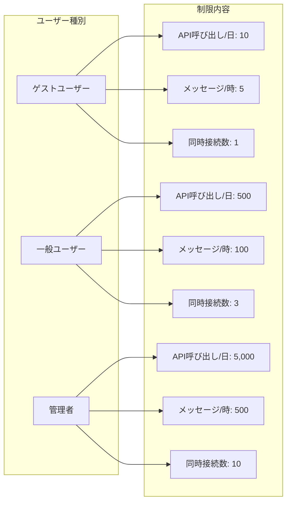

**実装:**
```python
# backend/app/api/middleware.py
from slowapi import Limiter
from slowapi.util import get_remote_address

limiter = Limiter(key_func=get_remote_address)

@router.post("/api/sessions")
@limiter.limit("10/minute")  # 1分間に10回まで
async def create_session(request: Request):
    pass
```

**超過時の動作:**
```json
// Response: HTTP 429 Too Many Requests
{
  "error": {
    "code": "RATE_LIMIT_EXCEEDED",
    "message": "リクエスト制限を超過しました。1分後に再試行してください。",
    "retry_after": 60
  }
}
```

#### 6.1.2 ファイルサイズ制限

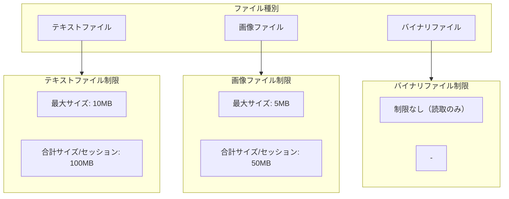

**超過時:**
- エラーメッセージ表示
- ファイル分割の提案
- 外部ストレージ利用の推奨

#### 6.1.3 セッション数制限

**目的:** リソース枯渇の防止

**制限:**
- 一般ユーザー: 10セッション/ユーザー
- ゲストユーザー: 1セッション
- 管理者: 制限なし

**超過時の自動処理:**
1. 最も古いIDLEセッションを特定
2. ユーザーに通知
3. 24時間後に自動削除

#### 6.1.4 コスト制限

**月次予算管理:**
```python
# backend/app/core/cost_manager.py
class CostManager:
    def __init__(self, monthly_budget_usd: float = 100.0):
        self.monthly_budget = monthly_budget_usd

    async def check_budget(self, user_id: str) -> bool:
        """ユーザーの月次利用額をチェック"""
        current_usage = await self.get_monthly_usage(user_id)
        return current_usage < self.monthly_budget

    async def record_usage(self, user_id: str, cost_usd: float):
        """利用額を記録"""
        key = f"cost:{user_id}:{datetime.now().strftime('%Y-%m')}"
        await redis.incrbyfloat(key, cost_usd)
```

**予算超過時:**
- 警告メッセージ（80%到達時）
- 一時停止（100%到達時）
- 管理者への通知

### 6.2 利用可能時間

#### 6.2.1 サービス稼働時間

**基本:** 24時間365日稼働

**定期メンテナンス:**
- 頻度: 毎月第2日曜日 02:00-04:00 (JST)
- 事前通知: 7日前にメール・ダッシュボード通知
- ダウンタイム: 最大2時間

**緊急メンテナンス:**
- セキュリティパッチ適用時
- システム障害発生時
- 事前通知: 可能な限り24時間前

#### 6.2.2 セッションタイムアウト

**アイドルタイムアウト:**
- 無操作時間: 60分
- 警告表示: 55分経過時
- 自動保存: タイムアウト前に実行

**アクティビティ判定:**
- メッセージ送信
- ファイル編集
- ファイルツリー操作
- エディタでのカーソル移動

**タイムアウト時の動作:**
1. 現在の状態を自動保存
2. WebSocket接続を切断
3. セッションステータスをIDLEに変更
4. 次回アクセス時に復元可能

### 6.3 禁止事項

#### 6.3.1 絶対禁止行為

1. **不正アクセス・権限昇格**
   - 他ユーザーのセッション・ファイルへのアクセス試行
   - SQL Injection、XSSなどの攻撃
   - 管理者権限の不正取得試行

2. **システムリソースの悪用**
   - 意図的な高負荷生成
   - マイニング等の計算リソース悪用
   - 無限ループの意図的な実行

3. **不適切なコンテンツ**
   - マルウェア・ウイルスの作成
   - 違法コンテンツの生成
   - 個人情報の不正取得

4. **商用利用違反**
   - ライセンス違反の再配布
   - サービスのリバースエンジニアリング

#### 6.3.2 制限行為

1. **外部ネットワークアクセス**
   - 一般ユーザーはWebFetch, WebSearch無効
   - 許可: 管理者のみ、明示的な承認が必要

2. **システムファイルへのアクセス**
   - ワークスペース外のディレクトリアクセス禁止
   - `/etc`, `/sys`, `/proc`等のブロック

3. **危険なコマンド実行**
   - `rm -rf /`, `mkfs`, `dd`等のブロック
   - `curl`, `wget`の制限（管理者は許可）

### 6.4 違反時の対応

**段階的な対応:**

**警告レベル1（初回違反）:**
- システムメッセージでの警告
- 操作のブロック
- 監査ログに記録

**警告レベル2（2回目）:**
- メール通知
- 24時間の一時アカウント停止
- 管理者への報告

**警告レベル3（3回目以上）:**
- アカウント無効化
- データの保全（調査用）
- 再発防止策の検討

**即時停止対象:**
- セキュリティ脅威の検出
- 不正アクセスの証拠
- 法的問題の可能性

---

## 7. データ管理ポリシー

### 7.1 データ保持期間

#### 7.1.1 セッションデータ

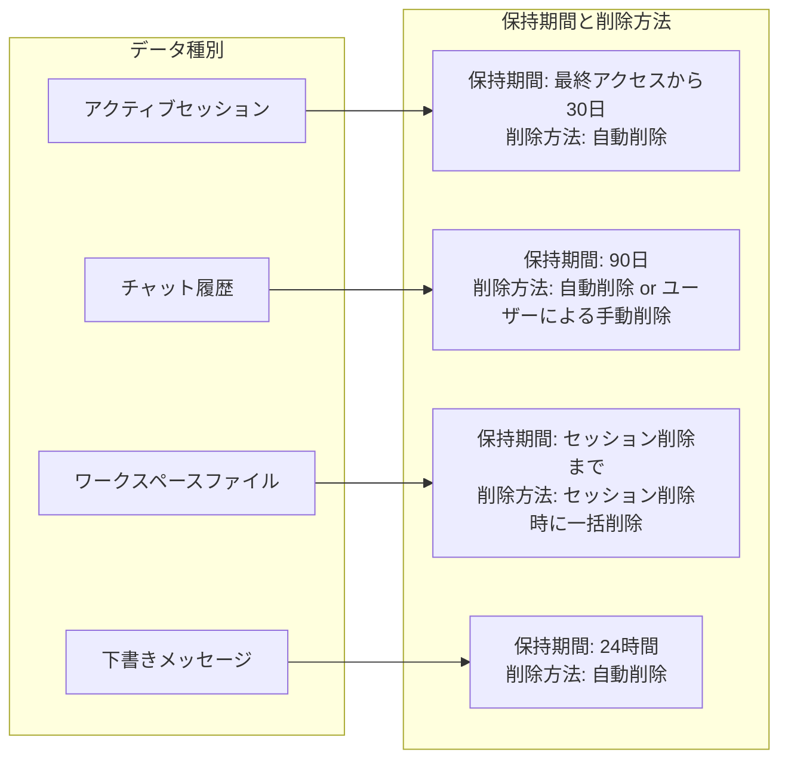

**データ削除スクリプト:**
```python
# backend/scripts/cleanup_sessions.py
import asyncio
from datetime import datetime, timedelta
from app.core.session_manager import SessionManager
from app.utils.redis_client import get_redis

async def cleanup_expired_sessions():
    """期限切れセッションの削除"""
    redis = await get_redis()
    session_manager = SessionManager(redis)

    # 30日以上アクセスのないセッションを削除
    cutoff_date = datetime.utcnow() - timedelta(days=30)

    async for session_key in redis.scan_iter(match="session:*"):
        session_id = session_key.decode().split(":")[1]
        session = await session_manager.get_session(session_id)

        if session and session.last_activity < cutoff_date:
            print(f"Deleting expired session: {session_id}")
            await session_manager.delete_session(session_id)

if __name__ == "__main__":
    asyncio.run(cleanup_expired_sessions())
```

**Cron設定:**
```bash
# 毎日午前3時に実行
0 3 * * * /usr/bin/python /app/scripts/cleanup_sessions.py
```

#### 7.1.2 監査ログ

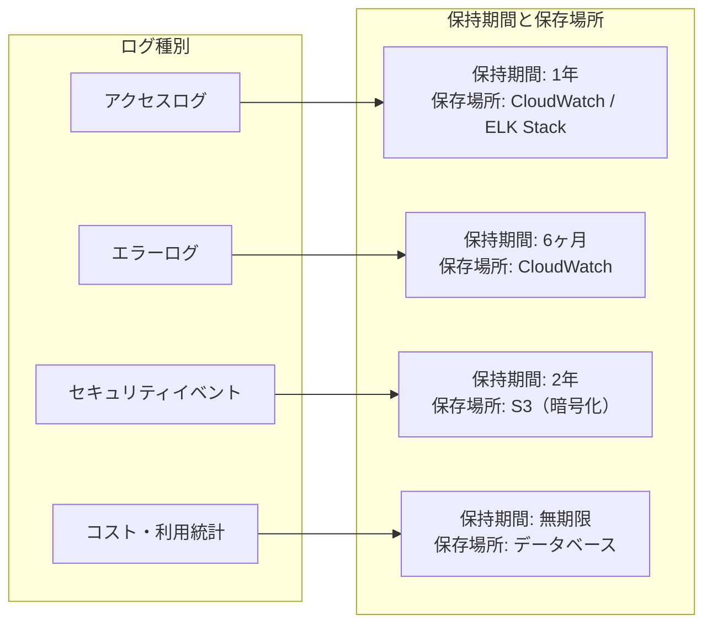

#### 7.1.3 ユーザーアカウント

**アカウント削除:**
- ユーザー自身による削除: 即時実行
- 管理者による削除: 即時実行
- 非アクティブアカウント: 180日後に削除候補通知 → 30日後に自動削除

**削除時の処理:**
1. 全セッションの削除
2. ワークスペースファイルの削除
3. 個人情報の匿名化（監査ログ用）
4. APIキーの無効化

### 7.2 バックアップ・リストア

#### 7.2.1 バックアップ戦略

**Redisデータ:**
- 頻度: 1時間ごとの増分バックアップ
- フルバックアップ: 1日1回
- 保持期間: 7日間
- 保存先: S3バケット（暗号化）

**ワークスペースファイル:**
- 方式: スナップショット（Dockerボリューム）
- 頻度: セッション終了時
- 保持期間: 30日間

**データベース:**
- 方式: PostgreSQL WAL-based continuous archiving
- RPO (Recovery Point Objective): 5分
- RTO (Recovery Time Objective): 1時間

**バックアップコマンド:**
```bash
# Redisバックアップ
redis-cli --rdb /backup/redis/dump_$(date +%Y%m%d_%H%M%S).rdb

# Dockerボリュームバックアップ
docker run --rm \
  -v workspace-data:/data \
  -v /backup:/backup \
  alpine tar czf /backup/workspace_$(date +%Y%m%d).tar.gz -C /data .
```

#### 7.2.2 リストア手順

**セッションリストア:**
1. バックアップファイルの特定
2. Redisへのデータインポート
3. セッション整合性チェック
4. ユーザーへの通知

**ワークスペースリストア:**
```bash
# ユーザーリクエストによるリストア
docker run --rm \
  -v workspace-data:/data \
  -v /backup:/backup \
  alpine tar xzf /backup/workspace_20251220.tar.gz -C /data
```

**災害復旧（DR）:**
- DR環境: 別リージョンでのスタンバイ環境
- 切り替え時間: 1時間以内
- データ損失: 最大5分

### 7.3 データエクスポート

**ユーザー自身によるエクスポート:**

```bash
# セッションデータのエクスポート
GET /api/sessions/{session_id}/export

Response:
{
  "session_id": "sess_abc123",
  "created_at": "2025-12-20T10:00:00Z",
  "messages": [...],
  "files": [
    {
      "path": "main.py",
      "content": "...",
      "encoding": "utf-8"
    }
  ],
  "metadata": {
    "total_cost_usd": 0.52,
    "total_messages": 45
  }
}
```

**エクスポート形式:**
- JSON: 完全なデータ構造
- Markdown: チャット履歴のみ
- ZIP: ファイル一式

**GDPR対応:**
- ユーザーリクエストによる全データエクスポート
- 30日以内に対応
- 機械可読形式での提供

---

## 8. セキュリティガイドライン

### 8.1 アクセス制御

#### 8.1.1 最小権限の原則

**実装:**
- デフォルトでは最小限の権限のみ付与
- 必要に応じて明示的に権限を追加
- 一時的な権限昇格機能（管理者承認必要）

**権限昇格フロー:**
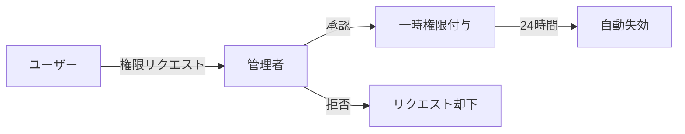

#### 8.1.2 多層防御

**レイヤー:**
1. **ネットワーク層:** ファイアウォール、DDoS保護
2. **アプリケーション層:** WAF、レート制限
3. **認証層:** MFA、セッション管理
4. **データ層:** 暗号化、アクセス監査

### 8.2 データ暗号化

#### 8.2.1 転送時の暗号化

**TLS/SSL:**
- プロトコル: TLS 1.3
- 証明書: Let's Encrypt / AWS ACM
- 強制HTTPS: HTTP→HTTPSリダイレクト

**WebSocket:**
- プロトコル: WSS (WebSocket Secure)
- 同一のTLS証明書を使用

#### 8.2.2 保存時の暗号化

**ファイルシステム:**
- 方式: AES-256-GCM
- キー管理: AWS KMS / HashiCorp Vault
- ワークスペースファイルの暗号化（オプション）

**データベース:**
- PostgreSQL: pgcrypto拡張
- Redis: Redis 6.0 ACL + TLS

**実装例:**
```python
# backend/app/utils/encryption.py
from cryptography.fernet import Fernet
import os

class FileEncryption:
    def __init__(self):
        # 環境変数から暗号化キーを読み込み
        key = os.getenv("ENCRYPTION_KEY").encode()
        self.cipher = Fernet(key)

    def encrypt_file(self, content: bytes) -> bytes:
        """ファイル内容の暗号化"""
        return self.cipher.encrypt(content)

    def decrypt_file(self, encrypted_content: bytes) -> bytes:
        """ファイル内容の復号化"""
        return self.cipher.decrypt(encrypted_content)
```

### 8.3 セキュリティ監査

#### 8.3.1 監査ログ

**記録対象:**
- ユーザー認証（成功/失敗）
- セッション作成/削除
- ファイル操作（作成、編集、削除）
- 権限変更
- システム設定変更
- APIアクセス（異常なパターン）

**ログフォーマット:**
```json
{
  "timestamp": "2025-12-20T10:30:45.123Z",
  "event_type": "file_access",
  "user_id": "user_123",
  "session_id": "sess_abc",
  "action": "read",
  "resource": "/workspace/user_123/sess_abc/config.yml",
  "ip_address": "192.168.1.100",
  "user_agent": "Mozilla/5.0...",
  "result": "success"
}
```

**ログ解析:**
- 自動アラート: 異常なアクセスパターン検出
- 定期レポート: 週次でセキュリティサマリー
- 保存期間: 2年（規制要件に応じて延長可能）

#### 8.3.2 脆弱性スキャン

**定期スキャン:**
- 頻度: 週次
- ツール: OWASP ZAP, Snyk, npm audit
- 対象: 依存関係、コンテナイメージ、API

**継続的モニタリング:**
```yaml
# .github/workflows/security-scan.yml
name: Security Scan
on:
  schedule:
    - cron: '0 2 * * 1'  # 毎週月曜2AM
  push:
    branches: [main]

jobs:
  scan:
    runs-on: ubuntu-latest
    steps:
      - uses: actions/checkout@v3
      - name: Run Snyk Security Scan
        run: |
          npm install -g snyk
          snyk test --all-projects
      - name: Run OWASP Dependency Check
        run: |
          docker run --rm -v $(pwd):/src \
            owasp/dependency-check:latest \
            --scan /src --format JSON
```

### 8.4 インシデント対応

#### 8.4.1 インシデントレベル

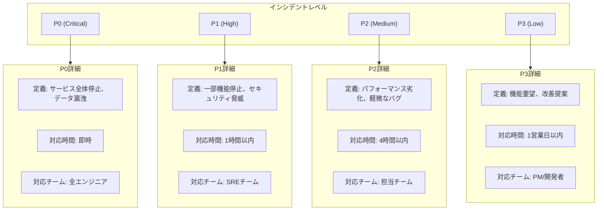

#### 8.4.2 対応フロー

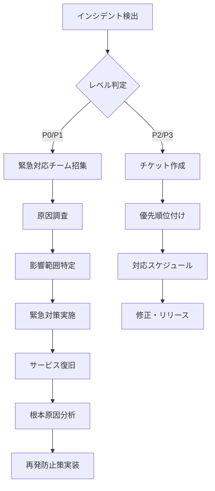

**P0インシデント対応例:**
1. **検出（0分）:** モニタリングアラート発火
2. **招集（5分）:** Slackで緊急対応チーム招集
3. **調査（15分）:** ログ解析、原因特定
4. **対策（30分）:** 一時的な回避策実施
5. **復旧（45分）:** サービス正常化確認
6. **報告（60分）:** ステークホルダーへの初期報告
7. **事後対応（24時間）:** 根本原因分析、恒久対策

---

## 9. トラブルシューティング

### 9.1 よくある問題と対処法

#### 9.1.1 接続関連

**問題1: WebSocket接続が切れる**

**症状:**
- チャットメッセージが送信できない
- "接続が切断されました" のエラー表示
- ストリーミング中に中断

**原因:**
- ネットワーク不安定
- セッションタイムアウト
- サーバー側のエラー

**対処法:**

**ユーザー側:**
1. ページをリロード（Ctrl+R / Cmd+R）
2. ブラウザのコンソールでエラー確認（F12）
3. 別のネットワークで試行（モバイルホットスポット等）

**システム側:**
```typescript
// frontend/src/hooks/useWebSocket.ts
// 自動再接続ロジック
const attemptReconnect = () => {
  if (reconnectAttempts < MAX_RECONNECT_ATTEMPTS) {
    const delay = Math.min(1000 * Math.pow(2, reconnectAttempts), 30000);
    setTimeout(() => {
      reconnectAttempts++;
      connect();
    }, delay);
  } else {
    // 最大試行回数超過
    showError("接続できません。サポートにお問い合わせください。");
  }
};
```

**予防策:**
- Pingメッセージの定期送信（30秒ごと）
- 接続状態のUI表示
- バックグラウンドでの自動再接続

---

**問題2: ログインできない**

**症状:**
- "認証に失敗しました" エラー
- パスワードリセットメールが届かない
- アカウントがロックされた

**対処法:**

**パスワード忘れ:**
1. ログイン画面の「パスワードを忘れた場合」をクリック
2. 登録メールアドレスを入力
3. 受信したメールのリンクから再設定

**アカウントロック（5回失敗）:**
- 自動: 15分後に自動解除
- 手動: サポートに連絡して即時解除リクエスト

**管理者による対応:**
```python
# backend/app/cli/unlock_user.py
import asyncio
from app.core.auth_service import AuthService

async def unlock_user(email: str):
    """ユーザーアカウントのロック解除"""
    auth = AuthService()
    await auth.reset_failed_attempts(email)
    print(f"Account unlocked: {email}")

# 使用例
# python -m app.cli.unlock_user user@example.com
```

#### 9.1.2 パフォーマンス関連

**問題3: エディタの動作が遅い**

**症状:**
- タイピングの遅延
- ファイル切り替えが遅い
- 構文ハイライトが効かない

**原因:**
- 大きなファイルを開いている
- ブラウザのメモリ不足
- 拡張機能の競合

**対処法:**

**即時対応:**
1. ブラウザタブを閉じて新規タブで開く
2. ブラウザキャッシュをクリア
3. 不要なタブを閉じる

**設定変更:**
```typescript
// Monaco Editorの最適化設定
const editorOptions = {
  // 大きなファイルでは minimap を無効化
  minimap: { enabled: fileSize < 1024 * 100 },

  // 構文チェックの無効化（大きなファイル）
  validate: fileSize < 1024 * 500,

  // 仮想スクロール有効化
  scrollBeyondLastLine: false,

  // レンダリング最適化
  renderLineHighlight: 'line',
  occurrencesHighlight: false,
};
```

**管理者による対応:**
- ファイルサイズ上限の調整
- エディタ設定のプリセット提供

---

**問題4: メッセージ送信後、レスポンスが返ってこない**

**症状:**
- 送信後、ずっとローディング表示
- "Thinking..." が続く
- タイムアウトエラー

**診断手順:**

1. **ネットワーク確認:**
   - ブラウザのネットワークタブでリクエスト状態確認
   - WebSocket接続が "Open" 状態か確認

2. **サーバー状態確認:**
   ```bash
   # 管理者
   curl https://your-domain.com/api/health

   # 期待されるレスポンス
   {
     "status": "healthy",
     "services": {
       "redis": "connected",
       "claude_sdk": "available"
     }
   }
   ```

3. **Claude API状態確認:**
   - Anthropic Status Page: https://status.anthropic.com/

**対処法:**

**ユーザー側:**
- 中断ボタン（Stop）をクリック
- セッションをリフレッシュ
- メッセージを再送信

**システム側:**
```python
# backend/app/core/claude_client.py
# タイムアウト設定
async def send_message_with_timeout(
    self,
    message: str,
    timeout: int = 300  # 5分
):
    try:
        async with asyncio.timeout(timeout):
            async for msg in self.send_message(message):
                yield msg
    except asyncio.TimeoutError:
        raise TimeoutError("Claude API response timeout")
```

#### 9.1.3 ファイル関連

**問題5: ファイルが保存されない**

**症状:**
- エディタでの変更が反映されない
- 「保存に失敗しました」エラー
- リロード後に変更が消える

**原因:**
- ネットワーク切断
- ディスク容量不足
- 権限エラー

**対処法:**

**ユーザー側:**
1. ブラウザのローカルストレージを確認（一時保存されている可能性）
2. ファイル内容をクリップボードにコピー
3. 新しいファイルに貼り付けて保存

**システム側:**
```typescript
// frontend/src/hooks/useFiles.ts
const saveFile = async (path: string, content: string) => {
  try {
    // ローカルストレージにバックアップ
    localStorage.setItem(`draft_${path}`, content);

    // サーバーに保存
    await apiClient.files.update(path, content);

    // 成功したらローカルバックアップを削除
    localStorage.removeItem(`draft_${path}`);

    toast.success("ファイルを保存しました");
  } catch (error) {
    toast.error("保存に失敗しました。ローカルに下書きを保存しました。");
    console.error(error);
  }
};
```

**復旧手順:**
```typescript
// ページロード時にローカルバックアップをチェック
useEffect(() => {
  const drafts = Object.keys(localStorage)
    .filter(key => key.startsWith('draft_'));

  if (drafts.length > 0) {
    showNotification({
      title: "下書きが見つかりました",
      message: `${drafts.length}個の未保存ファイルがあります。復元しますか?`,
      actions: [
        { label: "復元", onClick: () => restoreDrafts(drafts) },
        { label: "破棄", onClick: () => clearDrafts(drafts) }
      ]
    });
  }
}, []);
```

---

**問題6: ファイルツリーが更新されない**

**症状:**
- 新しく作成したファイルが表示されない
- 削除したファイルが残っている
- ディレクトリ構造が古い

**対処法:**

**ユーザー側:**
1. ファイルツリーの更新ボタン（↻）をクリック
2. セッションをリロード

**自動更新の実装:**
```typescript
// frontend/src/components/editor/FileTree.tsx
useEffect(() => {
  // ファイル変更をリッスン
  const handleFileChange = (event: CustomEvent) => {
    if (event.detail.action === 'create' || event.detail.action === 'delete') {
      refreshFileTree();
    }
  };

  window.addEventListener('filechange', handleFileChange);
  return () => window.removeEventListener('filechange', handleFileChange);
}, []);
```

### 9.2 エラーコード一覧

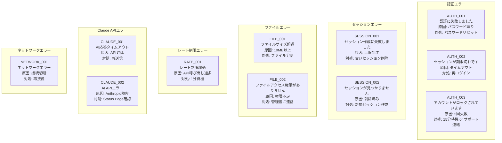

### 9.3 ログ確認方法

#### 9.3.1 ユーザー側

**ブラウザコンソール:**
1. F12キーを押す（またはCmd+Option+I / Ctrl+Shift+I）
2. "Console" タブを選択
3. エラーメッセージを確認

**よくあるエラーメッセージ:**
```
WebSocket connection to 'wss://...' failed: Error in connection establishment
→ ネットワークまたはサーバー問題

Failed to load resource: the server responded with a status of 429
→ レート制限超過

TypeError: Cannot read property 'content' of undefined
→ フロントエンドバグ（サポートに報告）
```

#### 9.3.2 管理者側

**バックエンドログ:**
```bash
# Dockerログ確認
docker-compose logs -f backend --tail=100

# 特定エラーの検索
docker-compose logs backend | grep "ERROR"

# ユーザー別ログフィルタ
docker-compose logs backend | grep "user_id=user_123"
```

**Redis接続確認:**
```bash
# Redisに接続
docker-compose exec redis redis-cli

# セッション一覧
KEYS session:*

# 特定セッションの詳細
GET session:sess_abc123
```

**Claude API呼び出しログ:**
```bash
# CloudWatch Logs Insights (AWS環境の場合)
fields @timestamp, user_id, cost_usd, duration_ms
| filter action = "claude_api_call"
| sort @timestamp desc
| limit 100
```

---

## 10. サポート体制

### 10.1 サポートチャネル

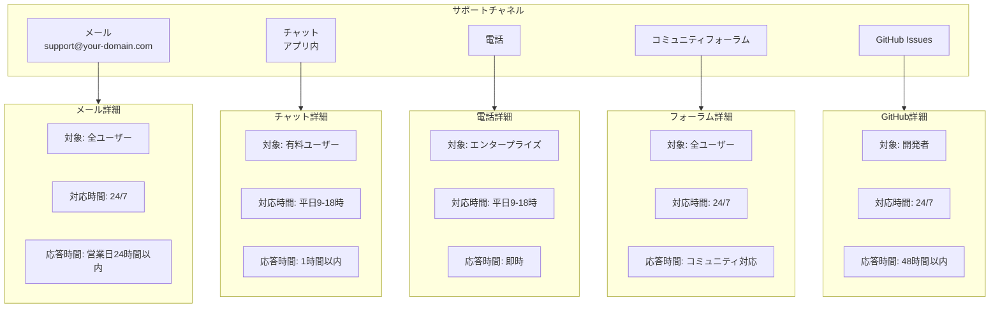

### 10.2 サポートリクエスト手順

#### 10.2.1 問い合わせ前の準備

**必要情報:**
1. ユーザーID / メールアドレス
2. セッションID（該当する場合）
3. 発生日時
4. エラーメッセージ（スクリーンショット）
5. 再現手順
6. 期待される動作

**テンプレート:**
```markdown
## 問題の概要
[簡潔に記述]

## 発生日時
2025-12-20 14:30 JST

## 環境情報
- ブラウザ: Chrome 120.0.6099.129
- OS: macOS 14.2
- セッションID: sess_abc123def456

## 再現手順
1. セッションを作成
2. "main.py"を開く
3. ファイルを編集
4. 保存ボタンをクリック

## 期待される動作
ファイルが保存される

## 実際の動作
「保存に失敗しました」エラーが表示される

## エラーメッセージ
[スクリーンショット添付]

## 追加情報
- 初めて発生 / 以前は正常動作していた
- 他のファイルでは問題なし
```

#### 10.2.2 問い合わせフロー

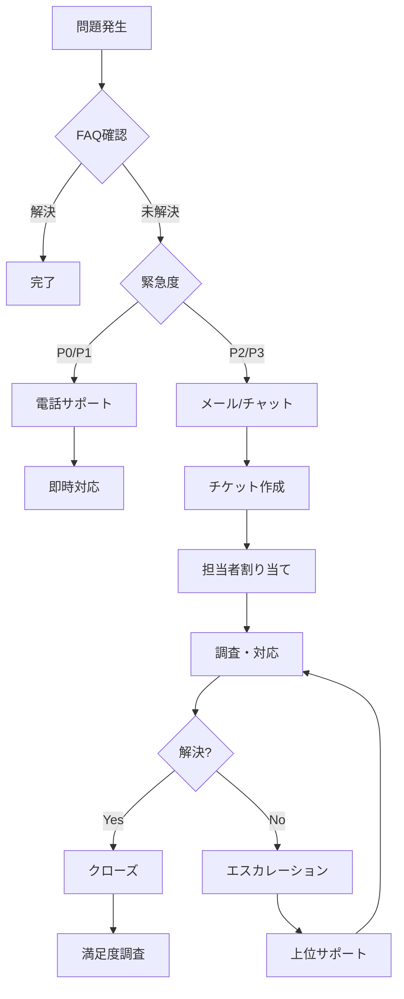

### 10.3 エスカレーション基準

**Level 1 (L1) - 一般サポート:**
- 対象: 基本的な質問、設定変更
- 対応者: サポートスタッフ
- 解決率目標: 80%

**Level 2 (L2) - 技術サポート:**
- 対象: バグ調査、高度な技術質問
- 対応者: エンジニア
- エスカレーション条件: L1で30分以内に解決できない

**Level 3 (L3) - 開発チーム:**
- 対象: コードレベルのバグ、新機能要望
- 対応者: 開発チームリーダー
- エスカレーション条件: L2で2時間以内に解決できない

### 10.4 FAQ

**Q1: パスワードを忘れました。どうすればいいですか?**

A: ログイン画面の「パスワードを忘れた場合」をクリックし、登録済みメールアドレスを入力してください。パスワードリセット用のリンクが送信されます。メールが届かない場合は、迷惑メールフォルダを確認してください。

---

**Q2: セッションが削除されてしまいました。復元できますか?**

A: 削除後30日以内であれば、バックアップから復元可能です。サポート（support@your-domain.com）に以下の情報を記載してご連絡ください:
- セッションID（分かる場合）
- 削除日時（おおよそで可）
- セッション名

---

**Q3: ファイルの自動保存はどのように動作しますか?**

A: エディタでの変更は、タイピング停止後1秒で自動的に保存されます。保存状態は画面右上のインジケーターで確認できます:
- 白丸: 保存済み
- 黄丸: 保存中
- 赤丸: 保存失敗（要手動再試行）

---

**Q4: 他のユーザーとセッションを共有できますか?**

A: 現在はセッション共有機能は実装されていません。将来のアップデートで追加予定です（Phase 3ロードマップを参照）。

---

**Q5: 利用料金はいくらですか?**

A: 利用プランは以下の通りです:
- **無料プラン:** 月10回のメッセージ、1セッション
- **スタンダード:** $20/月、500回/日、10セッション
- **プロ:** $50/月、無制限、優先サポート
- **エンタープライズ:** カスタム価格、専用環境

詳細: https://your-domain.com/pricing

---

**Q6: Claude Code CLIとの違いは何ですか?**

A: Web版の特徴:
- ブラウザからアクセス可能（インストール不要）
- ビジュアルなコードエディタ
- セッション管理機能
- チーム共有機能（将来実装）

CLI版の特徴:
- ターミナルから直接操作
- ローカル環境で完結
- スクリプト統合が容易

---

**Q7: API利用制限を増やすことはできますか?**

A: はい、プラン変更またはカスタムプランで対応可能です。管理画面の「設定」→「プラン変更」から申請してください。

---

**Q8: データはどこに保存されますか?**

A:
- セッションデータ: Redisクラスタ（AWS ElastiCache等）
- ファイル: Dockerボリューム（S3バックアップ）
- 監査ログ: CloudWatch / S3
- リージョン: 東京（ap-northeast-1）または指定リージョン

詳細はプライバシーポリシーを参照: https://your-domain.com/privacy

---

**Q9: モバイルデバイスでも使えますか?**

A: 基本的な機能は使用可能ですが、最適化されていません。推奨環境:
- デスクトップブラウザ（Chrome, Firefox, Safari, Edge）
- 画面解像度: 1280x720以上

モバイル対応はPhase 4で強化予定です。

---

**Q10: オフラインでも使えますか?**

A: 現在はオンライン接続必須です。将来的にPWA（Progressive Web App）化を検討中です。

---

## 11. モニタリング・メトリクス

### 11.1 システムメトリクス

#### 11.1.1 可用性メトリクス

**SLA目標:**
- 稼働率: 99.9%（月間ダウンタイム43分以内）
- API可用性: 99.95%
- WebSocket接続成功率: 99.5%

**モニタリング:**
```yaml
# prometheus.yml
scrape_configs:
  - job_name: 'backend'
    static_configs:
      - targets: ['backend:8000']
    metrics_path: '/metrics'
    scrape_interval: 15s

  - job_name: 'redis'
    static_configs:
      - targets: ['redis:6379']
```

**アラート設定:**
```yaml
# alertmanager.yml
groups:
  - name: availability
    rules:
      - alert: HighErrorRate
        expr: rate(http_requests_total{status=~"5.."}[5m]) > 0.05
        for: 5m
        annotations:
          summary: "Error rate > 5% for 5 minutes"

      - alert: WebSocketConnectionFailure
        expr: rate(websocket_connection_failures[5m]) > 0.1
        for: 2m
        annotations:
          summary: "WebSocket connection failure rate > 10%"
```

#### 11.1.2 パフォーマンスメトリクス

**測定項目:**
- API応答時間（p50, p95, p99）
- WebSocketメッセージレイテンシー
- Claude API呼び出し時間
- ファイル操作時間

**目標値:**

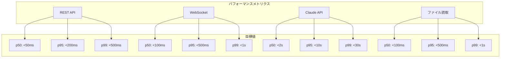

**ダッシュボード:**
```sql
-- Grafanaクエリ例
SELECT
  percentile(response_time_ms, 50) AS p50,
  percentile(response_time_ms, 95) AS p95,
  percentile(response_time_ms, 99) AS p99
FROM api_metrics
WHERE time > now() - 1h
GROUP BY time(1m)
```

### 11.2 ビジネスメトリクス

#### 11.2.1 利用統計

**日次レポート:**
- DAU (Daily Active Users)
- MAU (Monthly Active Users)
- 新規ユーザー登録数
- セッション作成数
- メッセージ送信数
- ファイル操作数

**収集:**
```python
# backend/app/services/analytics_service.py
class AnalyticsService:
    async def track_event(
        self,
        user_id: str,
        event_type: str,
        properties: dict = {}
    ):
        """イベント追跡"""
        event = {
            "user_id": user_id,
            "event_type": event_type,
            "timestamp": datetime.utcnow().isoformat(),
            "properties": properties
        }

        # Redisに記録
        await redis.lpush(f"events:{date.today()}", json.dumps(event))

        # 外部分析ツールに送信（オプション）
        await send_to_mixpanel(event)
```

**可視化:**
```python
# 日次集計
async def daily_summary():
    today = date.today()
    events = await redis.lrange(f"events:{today}", 0, -1)

    summary = {
        "dau": len(set(e["user_id"] for e in events)),
        "sessions_created": sum(1 for e in events if e["event_type"] == "session_create"),
        "messages_sent": sum(1 for e in events if e["event_type"] == "message_send"),
        "files_edited": sum(1 for e in events if e["event_type"] == "file_edit")
    }

    return summary
```

#### 11.2.2 コストメトリクス

**Claude APIコスト:**
```python
# backend/app/services/cost_service.py
class CostService:
    # 料金体系（2025年12月時点）
    PRICING = {
        "claude-opus-4-5": {
            "input": 0.015 / 1000,   # $0.015 per 1K tokens
            "output": 0.075 / 1000   # $0.075 per 1K tokens
        },
        "claude-sonnet-4": {
            "input": 0.003 / 1000,
            "output": 0.015 / 1000
        }
    }

    async def calculate_cost(
        self,
        model: str,
        input_tokens: int,
        output_tokens: int
    ) -> float:
        """コスト計算"""
        pricing = self.PRICING[model]
        cost = (
            input_tokens * pricing["input"] +
            output_tokens * pricing["output"]
        )
        return round(cost, 4)

    async def get_monthly_cost(self, user_id: str = None) -> float:
        """月次コスト取得"""
        key = f"cost:{user_id or 'total'}:{datetime.now().strftime('%Y-%m')}"
        cost = await redis.get(key)
        return float(cost) if cost else 0.0
```

**コストダッシュボード:**
- 総コスト（日次/月次）
- ユーザー別コスト
- モデル別コスト分布
- コスト予測（トレンド分析）

#### 11.2.3 ユーザーエンゲージメント

**測定指標:**
- セッションあたりのメッセージ数
- 平均セッション時間
- ユーザーリテンション率（7日、30日）
- 機能利用率（コード生成、レビュー、ファイル操作等）

**リテンション計算:**
```python
# 7日リテンション
def calculate_retention(cohort_date: date) -> float:
    """コホート分析"""
    new_users = get_new_users(cohort_date)
    returned_users = get_active_users(
        cohort_date + timedelta(days=7),
        user_ids=new_users
    )
    return len(returned_users) / len(new_users) * 100
```

### 11.3 運用レポート

#### 11.3.1 週次レポート

**配信先:** 開発チーム、プロダクトマネージャー

**内容:**
1. システムヘルス
   - 稼働率
   - エラー率
   - パフォーマンス指標
2. 利用統計
   - DAU/MAU推移
   - 新規ユーザー数
   - セッション作成数
3. コスト分析
   - Claude APIコスト
   - インフラコスト
   - 予算との比較
4. インシデント報告
   - 発生件数
   - 平均解決時間
   - 主要インシデントの詳細

**テンプレート:**
```markdown
# 週次運用レポート (2025/12/15 - 12/21)

## ハイライト
- DAU: 1,234 (+15% WoW)
- 新規ユーザー: 89
- 稼働率: 99.98%

## システムヘルス
- ✅ API稼働率: 99.98%
- ✅ 平均応答時間: 45ms (p95: 150ms)
- ⚠️ WebSocket切断率: 2.3% (目標: <2%)

## コスト
- Claude API: $1,234.56 (予算内)
- インフラ: $567.89
- 合計: $1,802.45

## インシデント
- P1: 0件
- P2: 2件（WebSocket接続問題、ファイル保存遅延）
- P3: 5件

## アクション項目
- [ ] WebSocket再接続ロジックの改善
- [ ] ファイル保存のバッチ処理最適化
```

#### 11.3.2 月次レポート

**配信先:** 経営層、ステークホルダー

**内容:**
1. ビジネスKPI
   - MAU成長率
   - ユーザーリテンション
   - コンバージョン率（無料→有料）
2. システムパフォーマンス
   - SLA達成状況
   - システム改善実績
3. コスト最適化
   - 月次コスト推移
   - コスト削減施策の効果
4. ロードマップ進捗
   - 完了した機能
   - 次月の計画

---

## 付録

### A. 用語集

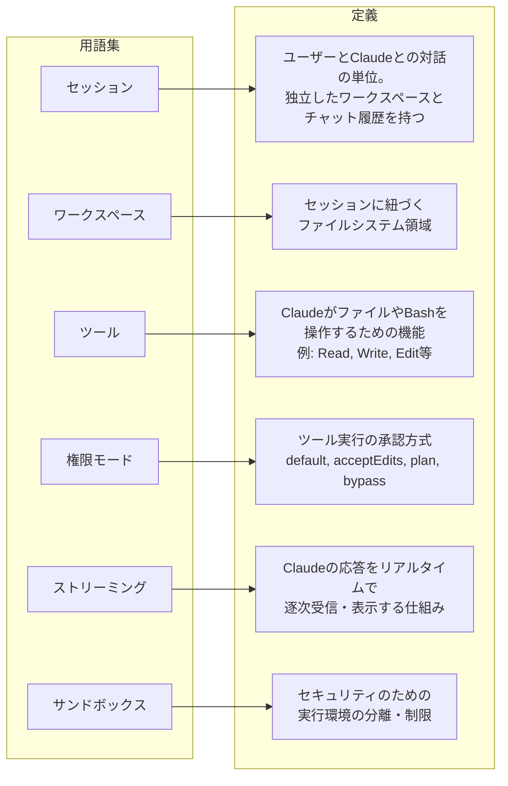

### B. 環境変数リファレンス

```bash
# .env.example

# === 認証 ===
SECRET_KEY=your-secret-key-here
JWT_ALGORITHM=HS256
ACCESS_TOKEN_EXPIRE_HOURS=24

# === Anthropic ===
ANTHROPIC_API_KEY=sk-ant-xxx

# === Redis ===
REDIS_URL=redis://redis:6379
REDIS_PASSWORD=
REDIS_DB=0

# === Application ===
WORKSPACE_PATH=/app/workspace
MAX_SESSIONS_PER_USER=10
SESSION_TIMEOUT_SECONDS=3600
MAX_FILE_SIZE_MB=10

# === Security ===
ALLOWED_ORIGINS=http://localhost:3000,https://your-domain.com
ENABLE_AUTH=true
ENABLE_CORS=true

# === Rate Limiting ===
RATE_LIMIT_PER_MINUTE=10
RATE_LIMIT_PER_DAY=500

# === Cost Management ===
MONTHLY_BUDGET_USD=100
COST_ALERT_THRESHOLD=0.8

# === Monitoring ===
LOG_LEVEL=INFO
ENABLE_METRICS=true
SENTRY_DSN=

# === Feature Flags ===
ENABLE_GUEST_MODE=false
ENABLE_FILE_ENCRYPTION=false
ENABLE_WEBSEARCH=false
```

### C. API エンドポイント一覧

**認証:**
- `POST /api/auth/login` - ログイン
- `POST /api/auth/logout` - ログアウト
- `POST /api/auth/refresh` - トークン更新
- `POST /api/auth/password-reset` - パスワードリセット

**セッション:**
- `POST /api/sessions` - セッション作成
- `GET /api/sessions` - セッション一覧
- `GET /api/sessions/{id}` - セッション詳細
- `DELETE /api/sessions/{id}` - セッション削除
- `GET /api/sessions/{id}/history` - チャット履歴

**ファイル:**
- `GET /api/files?session_id={id}` - ファイル一覧
- `GET /api/files/{path}?session_id={id}` - ファイル取得
- `POST /api/files/{path}` - ファイル作成
- `PUT /api/files/{path}` - ファイル更新
- `DELETE /api/files/{path}` - ファイル削除

**WebSocket:**
- `ws://domain/ws/chat/{session_id}` - チャット接続

**管理:**
- `GET /api/admin/users` - ユーザー一覧
- `GET /api/admin/stats` - システム統計
- `GET /api/admin/logs` - 監査ログ

### D. ショートカットキー

```mermaid
flowchart TD
    subgraph Operations["操作"]
        Op1["新規セッション"]
        Op2["セッション切り替え"]
        Op3["ファイル保存"]
        Op4["メッセージ送信"]
        Op5["検索"]
        Op6["コマンドパレット"]
        Op7["ファイルツリートグル"]
        Op8["設定を開く"]
    end

    subgraph WindowsLinux["Windows/Linux"]
        Win1["Ctrl+N"]
        Win2["Ctrl+Tab"]
        Win3["Ctrl+S"]
        Win4["Ctrl+Enter"]
        Win5["Ctrl+F"]
        Win6["Ctrl+Shift+P"]
        Win7["Ctrl+B"]
        Win8["Ctrl+,"]
    end

    subgraph MacOS["macOS"]
        Mac1["Cmd+N"]
        Mac2["Cmd+Tab"]
        Mac3["Cmd+S"]
        Mac4["Cmd+Enter"]
        Mac5["Cmd+F"]
        Mac6["Cmd+Shift+P"]
        Mac7["Cmd+B"]
        Mac8["Cmd+,"]
    end

    Op1 --> Win1 & Mac1
    Op2 --> Win2 & Mac2
    Op3 --> Win3 & Mac3
    Op4 --> Win4 & Mac4
    Op5 --> Win5 & Mac5
    Op6 --> Win6 & Mac6
    Op7 --> Win7 & Mac7
    Op8 --> Win8 & Mac8
```

### E. サポート連絡先

**一般問い合わせ:**
- Email: support@your-domain.com
- チャット: アプリ内サポートボタン

**緊急問い合わせ（P0/P1）:**
- 電話: +81-3-XXXX-XXXX（平日9-18時）
- Email: urgent@your-domain.com

**営業・ライセンス:**
- Email: sales@your-domain.com

**開発者コミュニティ:**
- GitHub: https://github.com/your-org/claude-code-web
- Discord: https://discord.gg/your-server
- フォーラム: https://forum.your-domain.com

---

**文書管理情報**

```mermaid
flowchart LR
    subgraph DocumentInfo["文書管理情報"]
        DocID["文書ID: USER-OPS-001"]
        Version["バージョン: 1.1"]
        Created["作成日: 2025-12-20"]
        Updated["最終更新日: 2025-12-21"]
        Approver["承認者: [承認済み]"]
        NextReview["次回レビュー: 2026-01-21"]
    end
```

**変更履歴**

```mermaid
flowchart TD
    subgraph ChangeHistory["変更履歴"]
        Change1["2025-12-20<br/>バージョン: 1.0<br/>変更内容: 初版作成<br/>担当者: Product Manager"]
        Change2["2025-12-21<br/>バージョン: 1.1<br/>変更内容: プロジェクト・セッション階層追加<br/>システム構成図Mermaid化<br/>担当者: Development Team"]
    end
```

---

**このドキュメントに関するフィードバックをお待ちしています。**
連絡先: documentation@your-domain.com
