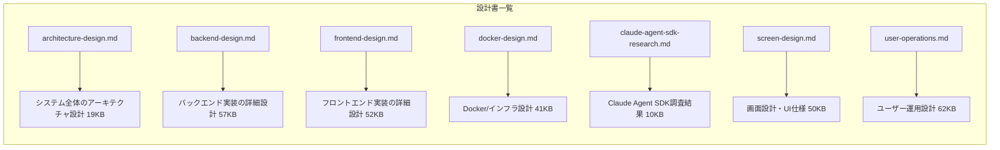

# Web版Claude Code 設計書

## 概要

Claude Agent SDK (Python) を使用したWebベースのコーディングアシスタントの設計書です。

## ドキュメント一覧



## システム構成

```
+-------------------+     +-------------------+     +-------------------+
|    Frontend       |     |    Backend        |     |    Redis          |
|    (Next.js)      |<--->|    (FastAPI)      |<--->|    (Cache)        |
|    Port: 3000     |     |    Port: 8000     |     |    Port: 6379     |
+-------------------+     +-------------------+     +-------------------+
                                   |
                                   v
                          +-------------------+
                          |  Claude Agent SDK |
                          |  (Python)         |
                          +-------------------+
                                   |
                                   v
                          +-------------------+
                          |  Anthropic API    |
                          +-------------------+
```

## 技術スタック

### バックエンド
- Python 3.11+
- FastAPI + Uvicorn
- Claude Agent SDK
- Redis (セッション管理)
- Pydantic (バリデーション)

### フロントエンド
- React 18 + Next.js 14
- TypeScript
- TailwindCSS
- Monaco Editor
- Zustand (状態管理)

### インフラ
- Docker + Docker Compose
- マルチステージビルド
- 非rootユーザー実行

## 主要機能

1. **リアルタイムチャット** - WebSocketによるストリーミング通信
2. **コードエディタ** - Monaco Editor (VS Codeと同等)
3. **ファイル操作** - 読み取り/書き込み/編集
4. **ツール実行** - Bash, Grep, Glob等
5. **セッション管理** - 会話履歴の保持

## 実装フェーズ

### Phase 1: MVP
- FastAPI基本セットアップ
- Claude Agent SDK統合
- WebSocket基本実装
- シンプルなチャットUI
- Docker環境構築

### Phase 2: コア機能
- セッション管理
- ファイル操作API
- Monaco Editor統合
- ツール使用可視化

### Phase 3: 拡張機能
- 認証・認可
- チャット履歴保存
- カスタムMCPツール
- レート制限

## 開発開始手順

```bash
# 1. リポジトリをクローン
cd /Users/t.hirai/AGENTSDK

# 2. 環境変数を設定
cp .env.example .env
# ANTHROPIC_API_KEY を設定

# 3. Docker Compose で起動
docker-compose up -d

# 4. ブラウザでアクセス
open http://localhost:3000
```

## ステータス

- [x] アーキテクチャ設計
- [x] Claude Agent SDK調査
- [x] バックエンド詳細設計
- [x] フロントエンド詳細設計
- [x] Docker/インフラ設計
- [ ] 設計レビュー・確定
- [ ] 実装開始

---

**作成日:** 2025-12-20
**ステータス:** 設計レビュー待ち (doc_draft)
