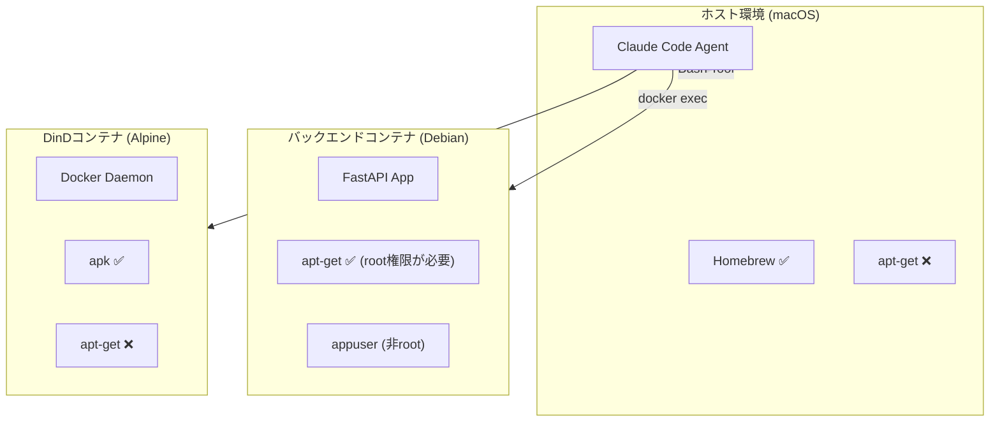
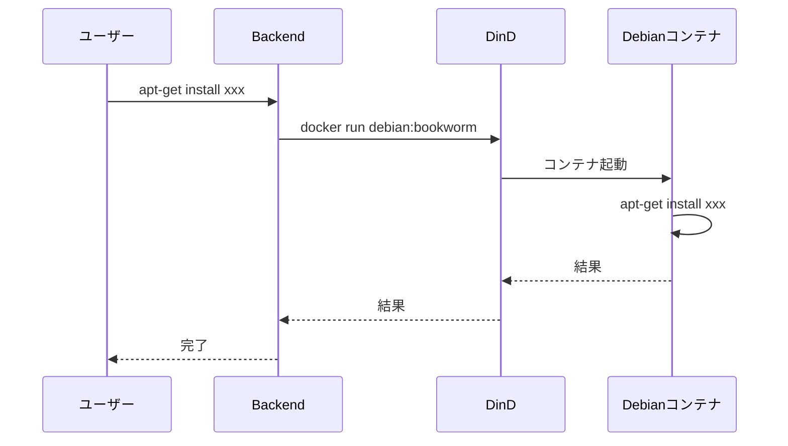
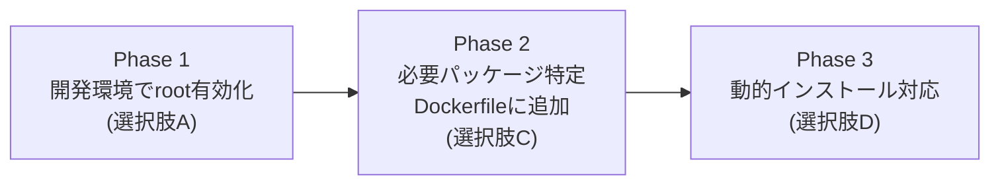

# apt-get 使用可能化 提案書（ドラフト）

## 概要

Claude Code環境でapt-getコマンドを使用してパッケージをインストールできるようにするための提案です。

## 現状分析

### 環境構成

| 環境 | OS | パッケージマネージャー | 状態 |
|------|-----|---------------------|------|
| ホスト（macOS） | Darwin 25.0.0 | Homebrew | apt-get不可 |
| バックエンドコンテナ | Debian 13 (trixie) | apt-get | インストール済み |
| フロントエンドコンテナ | Node.js (Debian系) | apt-get | インストール済み |
| DinDコンテナ | Alpine Linux | apk | apt-get不可 |

### 現在の制約



| 制約 | 詳細 |
|------|------|
| ホスト環境 | macOSのためapt-get自体が存在しない |
| バックエンドコンテナ | 非rootユーザーで動作、sudo未インストール |
| DinDコンテナ | Alpine LinuxベースのためAPKを使用 |
| セキュリティ | 本番環境でのroot権限付与はリスクあり |

---

## 解決策の選択肢

### 選択肢比較表

| 選択肢 | 実装難易度 | セキュリティ | 柔軟性 | 推奨度 |
|--------|:----------:|:----------:|:------:|:------:|
| A. 開発モードでroot実行 | ★☆☆ | ★☆☆ | ★★★ | ⭐ 開発用 |
| B. sudoインストール | ★★☆ | ★★☆ | ★★★ | ⭐⭐ |
| C. Dockerfileで事前インストール | ★★☆ | ★★★ | ★★☆ | ⭐⭐⭐ 推奨 |
| D. DinD内でDebianコンテナ起動 | ★★★ | ★★★ | ★★★ | ⭐⭐ 柔軟性重視 |
| E. 専用サービスコンテナ追加 | ★★★ | ★★★ | ★★★ | ⭐⭐ |

---

### 選択肢A: 開発モードでroot実行

開発環境でのみ、バックエンドコンテナをrootユーザーで実行する。

**実装方法：**

```yaml
# docker-compose.dev.yml に追加
services:
  backend:
    user: root  # 開発環境のみ
```

**メリット・デメリット：**

| 項目 | 評価 |
|------|------|
| 実装コスト | 最小（1行追加） |
| セキュリティ | 開発環境のみなら許容可 |
| 本番環境 | 非推奨 |

---

### 選択肢B: sudoをインストール

バックエンドコンテナにsudoをインストールし、appuserに権限を付与する。

**Dockerfile変更：**

```dockerfile
# Dockerfileに追加
RUN apt-get update && apt-get install -y sudo \
    && echo "appuser ALL=(ALL) NOPASSWD: /usr/bin/apt-get, /usr/bin/apt" >> /etc/sudoers.d/appuser \
    && chmod 0440 /etc/sudoers.d/appuser
```

**使用方法：**

```bash
# コンテナ内で
sudo apt-get update
sudo apt-get install <package-name>
```

**メリット・デメリット：**

| 項目 | 評価 |
|------|------|
| セキュリティ | apt-getのみに制限可能 |
| 柔軟性 | 動的にパッケージ追加可能 |
| リスク | sudoers設定ミスによる脆弱性 |

---

### 選択肢C: Dockerfileで事前インストール（推奨）

必要なパッケージをDockerfileで事前にインストールする。

**Dockerfile変更例：**

```dockerfile
# 必要なパッケージを事前インストール
RUN apt-get update && apt-get install -y --no-install-recommends \
    # 開発ツール
    vim \
    wget \
    jq \
    # ネットワークツール
    iputils-ping \
    net-tools \
    dnsutils \
    # その他必要なツール
    tree \
    htop \
    && rm -rf /var/lib/apt/lists/*
```

**メリット・デメリット：**

| 項目 | 評価 |
|------|------|
| セキュリティ | 最も安全（ビルド時のみroot使用） |
| 再現性 | イメージに含まれるため一貫性あり |
| 柔軟性 | 新規パッケージはリビルド必要 |
| 推奨 | ✅ 本番環境に最適 |

---

### 選択肢D: DinD内でDebianコンテナを起動

DinD環境内で必要に応じてDebianコンテナを起動し、その中でapt-getを使用する。

**実行フロー：**



**実装方法：**

```python
# バックエンドで実装
async def run_apt_in_container(packages: list[str]):
    cmd = [
        "docker", "run", "--rm",
        "-v", "/workspace:/workspace",
        "debian:bookworm",
        "bash", "-c",
        f"apt-get update && apt-get install -y {' '.join(packages)}"
    ]
    # DinD経由で実行
```

**メリット・デメリット：**

| 項目 | 評価 |
|------|------|
| 分離性 | 完全に分離された環境 |
| 柔軟性 | 任意のパッケージをオンデマンドで |
| オーバーヘッド | コンテナ起動のコスト |
| 永続性 | workspaceボリュームにインストール可能 |

---

### 選択肢E: 専用サービスコンテナ追加

apt-get実行専用のDebianコンテナをdocker-composeに追加する。

**docker-compose.yml追加：**

```yaml
services:
  apt-runner:
    image: debian:bookworm
    container_name: claude-apt-runner
    volumes:
      - workspace:/workspace
      - apt-cache:/var/cache/apt
    command: ["tail", "-f", "/dev/null"]
    networks:
      - claude-network
```

**使用方法：**

```bash
docker exec claude-apt-runner apt-get update
docker exec claude-apt-runner apt-get install -y <package>
```

**メリット・デメリット：**

| 項目 | 評価 |
|------|------|
| 可用性 | 常時起動で即座に利用可能 |
| リソース | 追加コンテナのメモリ使用 |
| 管理 | docker-composeで一元管理 |

---

## 推奨アプローチ

### 用途別推奨

| 用途 | 推奨選択肢 | 理由 |
|------|-----------|------|
| 開発環境での一時的な使用 | A または B | 迅速な導入 |
| 本番環境での固定パッケージ | C | セキュリティ最優先 |
| 動的なパッケージインストール | D または E | 柔軟性重視 |
| Claude Agent からの利用 | D | DinD統合済み |

### 段階的導入案



| フェーズ | 内容 | 期間目安 |
|---------|------|---------|
| Phase 1 | 開発環境でrootユーザー有効化、必要パッケージの洗い出し | 即時 |
| Phase 2 | 頻繁に使うパッケージをDockerfileに追加 | 1週間後 |
| Phase 3 | 動的インストールが必要な場合はDinD統合を検討 | 必要時 |

---

## 実装手順（選択肢A + C の組み合わせ）

### Step 1: 開発モードでroot有効化

```yaml
# docker-compose.dev.yml
services:
  backend:
    user: root
    environment:
      - DEV_MODE=true
```

### Step 2: 必要パッケージの特定

開発中に必要になったパッケージを記録：

```bash
# 例：必要になったパッケージ
vim, wget, jq, tree, htop, iputils-ping, net-tools
```

### Step 3: Dockerfileに反映

```dockerfile
# src/backend/Dockerfile の base ステージに追加
RUN apt-get update && apt-get install -y --no-install-recommends \
    vim \
    wget \
    jq \
    tree \
    htop \
    iputils-ping \
    net-tools \
    && rm -rf /var/lib/apt/lists/*
```

### Step 4: リビルド

```bash
# バックエンドのみリビルド
docker-compose -f docker-compose.yml -f docker-compose.dind.yml build backend
docker-compose -f docker-compose.yml -f docker-compose.dind.yml up -d backend
```

---

## セキュリティ考慮事項

| リスク | 対策 |
|--------|------|
| rootユーザーでの実行 | 開発環境のみに限定、本番はnon-root |
| 不要なパッケージ | 最小限のパッケージのみインストール |
| キャッシュの肥大化 | `rm -rf /var/lib/apt/lists/*` で削除 |
| 脆弱性のあるパッケージ | 定期的なイメージ更新 |

---

## 質問事項

以下の点について確認させてください：

1. **主な用途は何ですか？**
   - 開発時のデバッグツール？
   - 特定のライブラリの依存関係？
   - ユーザーからの動的なリクエスト対応？

2. **環境の優先度は？**
   - 開発環境のみで十分？
   - 本番環境でも必要？

3. **具体的に必要なパッケージはありますか？**
   - 事前にリスト化できるものは？

---

## 次のステップ

1. 上記の質問への回答
2. 要件に基づいた最適な選択肢の決定
3. 実装計画の詳細化
4. 実装・テスト
