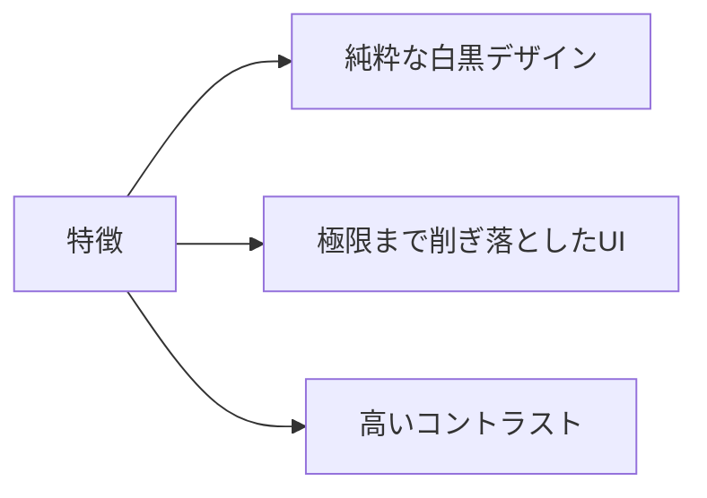
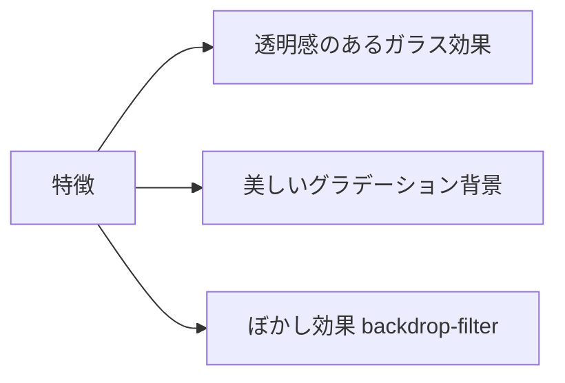
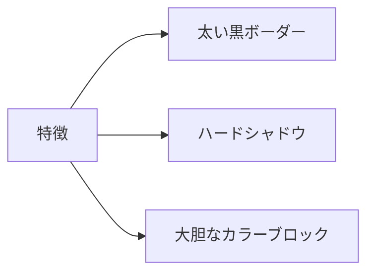
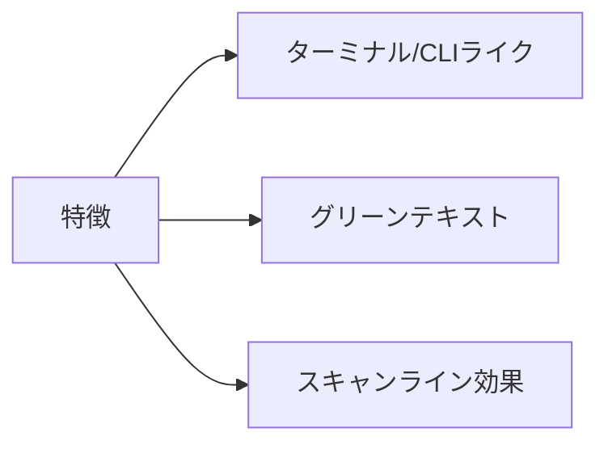
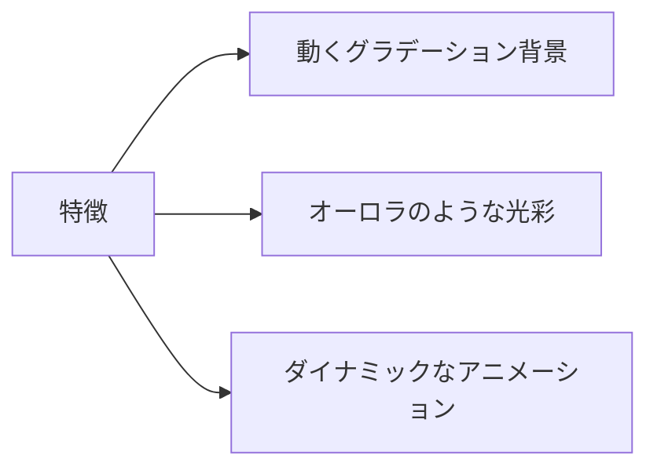
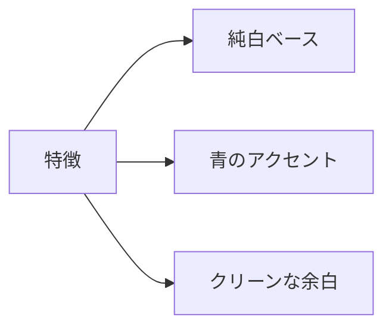
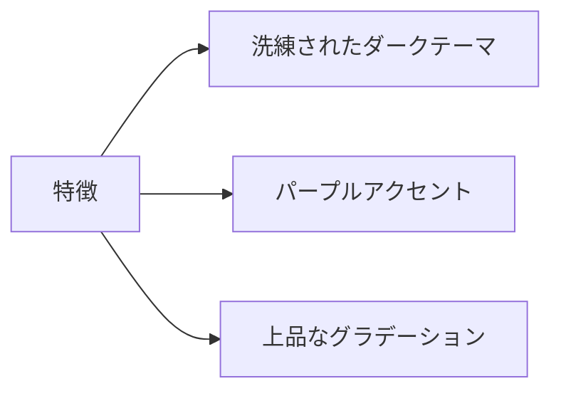
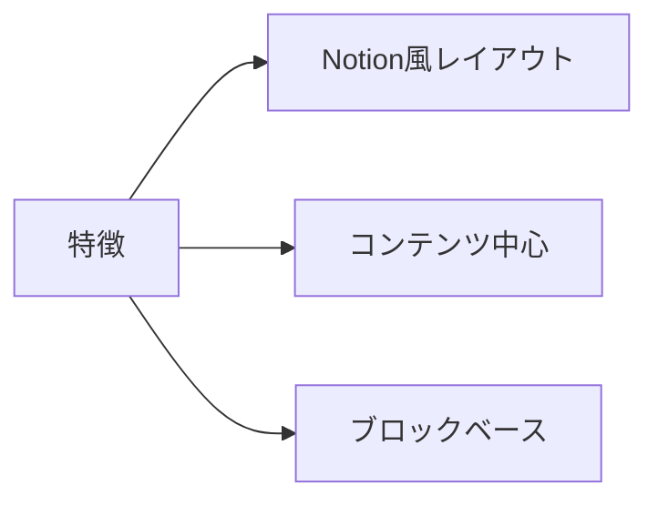
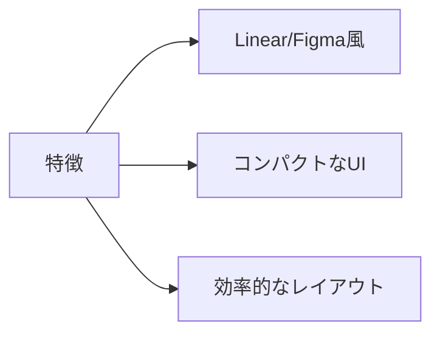
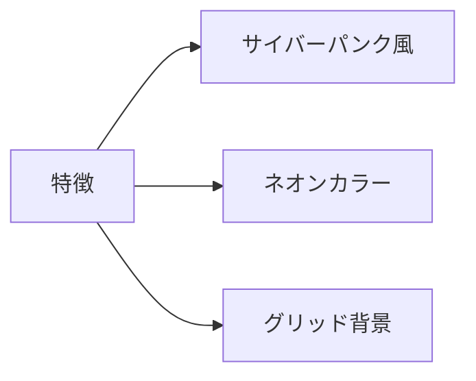

# フロントエンドデザインパターン比較

## 概要

Claude Code Webプロジェクトのフロントエンドリニューアルに向けた10種類のデザインパターン提案です。
全てモダン・クール・シンプルをコンセプトに設計しています。

---

## パターン一覧

### Pattern 01: Minimalist Monochrome
**ファイル:** `pattern-01-minimalist-monochrome.html`



| 項目 | 評価 |
|------|------|
| モダン度 | ★★★★★ |
| クール度 | ★★★★☆ |
| シンプル度 | ★★★★★ |
| 実装難易度 | 低 |
| 適合性 | 開発者向けツール |

**特徴:**
- ダークテーマベース
- 白とグレーのみの配色
- ミニマリストな typography
- 高い可読性

---

### Pattern 02: Glass Morphism
**ファイル:** `pattern-02-glass-morphism.html`



| 項目 | 評価 |
|------|------|
| モダン度 | ★★★★★ |
| クール度 | ★★★★★ |
| シンプル度 | ★★★☆☆ |
| 実装難易度 | 中 |
| 適合性 | デザイン重視のアプリ |

**特徴:**
- グラスモーフィズム効果
- 紫・青のグラデーション背景
- フローティングオーブ装飾
- 洗練されたUI

---

### Pattern 03: Neo Brutalism
**ファイル:** `pattern-03-neo-brutalism.html`



| 項目 | 評価 |
|------|------|
| モダン度 | ★★★★☆ |
| クール度 | ★★★★★ |
| シンプル度 | ★★★★☆ |
| 実装難易度 | 低 |
| 適合性 | インパクト重視 |

**特徴:**
- 太いボーダーとドロップシャドウ
- レトロモダンな配色
- 大胆なタイポグラフィ
- 視認性が非常に高い

---

### Pattern 04: Terminal Style
**ファイル:** `pattern-04-terminal-style.html`



| 項目 | 評価 |
|------|------|
| モダン度 | ★★★☆☆ |
| クール度 | ★★★★★ |
| シンプル度 | ★★★★★ |
| 実装難易度 | 低 |
| 適合性 | 開発者・エンジニア向け |

**特徴:**
- ハッカー/CRT風デザイン
- モノスペースフォント統一
- ブリンクカーソル
- コマンドライン形式のUI

---

### Pattern 05: Gradient Aurora
**ファイル:** `pattern-05-gradient-aurora.html`



| 項目 | 評価 |
|------|------|
| モダン度 | ★★★★★ |
| クール度 | ★★★★★ |
| シンプル度 | ★★★☆☆ |
| 実装難易度 | 中 |
| 適合性 | プレミアム感のあるアプリ |

**特徴:**
- 浮遊するグラデーションブロブ
- ダークテーマ + 鮮やかな差し色
- スムーズなアニメーション
- 未来的な印象

---

### Pattern 06: Clean White
**ファイル:** `pattern-06-clean-white.html`



| 項目 | 評価 |
|------|------|
| モダン度 | ★★★★☆ |
| クール度 | ★★★☆☆ |
| シンプル度 | ★★★★★ |
| 実装難易度 | 低 |
| 適合性 | ビジネス・SaaS |

**特徴:**
- Apple/Google風のクリーンデザイン
- 白ベースでアイケア対応
- 微細なシャドウで奥行き
- 標準的で使いやすい

---

### Pattern 07: Dark Elegant
**ファイル:** `pattern-07-dark-elegant.html`



| 項目 | 評価 |
|------|------|
| モダン度 | ★★★★★ |
| クール度 | ★★★★★ |
| シンプル度 | ★★★★☆ |
| 実装難易度 | 低 |
| 適合性 | プロフェッショナル向け |

**特徴:**
- 深みのあるダークグレー
- 紫のアクセントカラー
- 繊細なホバーエフェクト
- 長時間使用に適した配色

---

### Pattern 08: Notion Style
**ファイル:** `pattern-08-notion-style.html`



| 項目 | 評価 |
|------|------|
| モダン度 | ★★★★☆ |
| クール度 | ★★★☆☆ |
| シンプル度 | ★★★★★ |
| 実装難易度 | 低 |
| 適合性 | ドキュメント・ナレッジ管理 |

**特徴:**
- ブロック編集スタイル
- コンテンツファースト
- アイコンによる視覚的整理
- 親しみやすいUI

---

### Pattern 09: Linear Style
**ファイル:** `pattern-09-linear-style.html`



| 項目 | 評価 |
|------|------|
| モダン度 | ★★★★★ |
| クール度 | ★★★★☆ |
| シンプル度 | ★★★★★ |
| 実装難易度 | 低 |
| 適合性 | プロダクト管理・開発ツール |

**特徴:**
- Linear/GitHub風のミニマルUI
- コンパクトなサイドバー
- ステータスバッジ
- キーボードショートカット表示

---

### Pattern 10: Futuristic Cyber
**ファイル:** `pattern-10-futuristic-cyber.html`



| 項目 | 評価 |
|------|------|
| モダン度 | ★★★★★ |
| クール度 | ★★★★★ |
| シンプル度 | ★★★☆☆ |
| 実装難易度 | 中 |
| 適合性 | 先進的・テック系 |

**特徴:**
- シアン・パープル・ピンクのネオン
- グリッド背景
- グローエフェクト
- SF/テック感

---

## 総合比較表

| パターン | モダン | クール | シンプル | 実装難易度 | おすすめ度 |
|---------|:------:|:------:|:-------:|:----------:|:----------:|
| 01 Minimalist Monochrome | ★★★★★ | ★★★★☆ | ★★★★★ | 低 | ★★★★☆ |
| 02 Glass Morphism | ★★★★★ | ★★★★★ | ★★★☆☆ | 中 | ★★★★★ |
| 03 Neo Brutalism | ★★★★☆ | ★★★★★ | ★★★★☆ | 低 | ★★★☆☆ |
| 04 Terminal Style | ★★★☆☆ | ★★★★★ | ★★★★★ | 低 | ★★★★☆ |
| 05 Gradient Aurora | ★★★★★ | ★★★★★ | ★★★☆☆ | 中 | ★★★★★ |
| 06 Clean White | ★★★★☆ | ★★★☆☆ | ★★★★★ | 低 | ★★★★☆ |
| 07 Dark Elegant | ★★★★★ | ★★★★★ | ★★★★☆ | 低 | ★★★★★ |
| 08 Notion Style | ★★★★☆ | ★★★☆☆ | ★★★★★ | 低 | ★★★★☆ |
| 09 Linear Style | ★★★★★ | ★★★★☆ | ★★★★★ | 低 | ★★★★★ |
| 10 Futuristic Cyber | ★★★★★ | ★★★★★ | ★★★☆☆ | 中 | ★★★★☆ |

---

## 推奨パターン（TOP 3）

### 1位: Pattern 07 - Dark Elegant
**理由:** モダン・クール・シンプルのバランスが最も優れている。開発者向けツールとして長時間使用しても疲れにくい配色。実装も容易。

### 2位: Pattern 09 - Linear Style
**理由:** 情報密度が高くても見やすい。プロダクト管理ツールとして実績のあるデザインパターン。ミニマルで洗練されている。

### 3位: Pattern 02 - Glass Morphism / Pattern 05 - Gradient Aurora
**理由:** 視覚的なインパクトが強く、先進的な印象を与える。ただし、パフォーマンスへの影響（backdrop-filter等）に注意が必要。

---

## 確認方法

各HTMLファイルをブラウザで直接開くことで確認できます。

```bash
# macOS
open doc_draft/design-patterns/pattern-01-minimalist-monochrome.html

# Windows
start doc_draft/design-patterns/pattern-01-minimalist-monochrome.html

# Linux
xdg-open doc_draft/design-patterns/pattern-01-minimalist-monochrome.html
```

---

## 次のステップ

1. **パターン選定**: 上記10パターンから1〜2つを選択
2. **コンポーネント設計**: 選択したパターンに基づきTailwindCSS設定を更新
3. **プロトタイプ作成**: Next.jsで実装
4. **レビュー＆調整**: フィードバックを反映
