# Phase 3: エディタコンポーネント実装完了報告

**プロジェクト:** Web版Claude Code
**作成日:** 2025-12-21
**バージョン:** 1.0
**ステータス:** ✅ 実装完了

---

## 実装概要

Phase 3のエディタ統合機能として、以下のコンポーネントとフックを実装しました。

### 実装済みコンポーネント

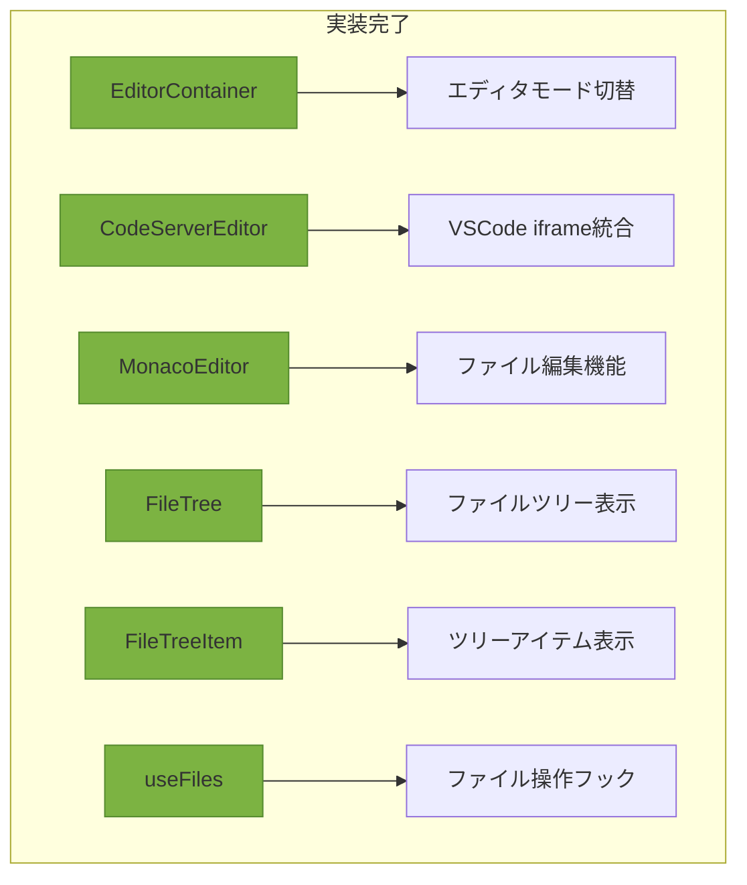

---

## 実装詳細

### 1. EditorContainer.tsx

エディタモードの切替と統合管理を担当するコンテナコンポーネント。

**主な機能:**

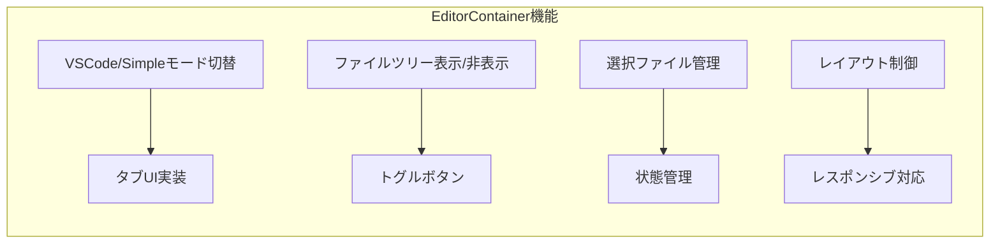

**実装ファイル:**
- `/Users/t.hirai/AGENTSDK/src/frontend/src/components/editor/EditorContainer.tsx`

**主要プロパティ:**
- `projectId`: プロジェクトID
- `workspacePath`: ワークスペースパス

**特徴:**
- Dynamic Import によるコード分割
- SSR無効化でクライアントサイドレンダリング
- ローディングスケルトン表示

---

### 2. CodeServerEditor.tsx

code-server（VSCode Web）をiframeで埋め込むコンポーネント。既存実装を利用。

**主な機能:**

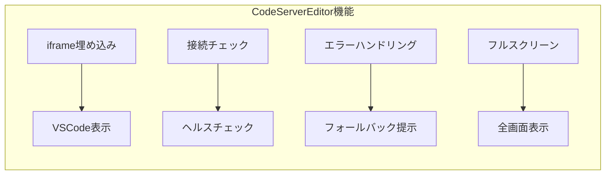

**実装ファイル:**
- `/Users/t.hirai/AGENTSDK/src/frontend/src/components/editor/CodeServerEditor.tsx`

**特徴:**
- 30秒ごとの接続チェック
- エラー時のSimple Editorへの切替提案
- リロード・別タブで開く機能
- フルスクリーンモード対応

---

### 3. MonacoEditor.tsx

Monaco Editorを使用したシンプルなコードエディタコンポーネント。完全に再実装。

**主な機能:**

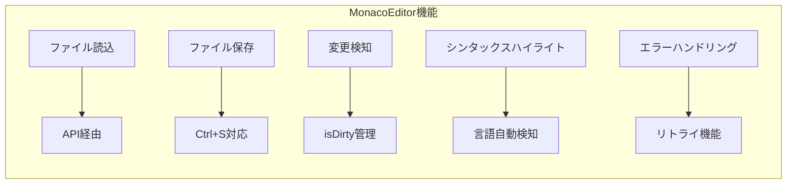

**実装ファイル:**
- `/Users/t.hirai/AGENTSDK/src/frontend/src/components/editor/MonacoEditor.tsx`

**主要プロパティ:**
- `projectId`: プロジェクトID
- `filePath`: 編集するファイルパス

**主な状態:**
- `content`: ファイル内容
- `loading`: ローディング状態
- `error`: エラー状態
- `isDirty`: 変更フラグ
- `isSaving`: 保存中フラグ

**実装機能:**
1. ファイル読み込み
   - API経由でファイル内容取得
   - ローディング表示
   - エラーハンドリング

2. ファイル保存
   - Ctrl+S ショートカット
   - 保存ボタン
   - 保存中表示
   - 変更検知

3. エディタ設定
   - シンタックスハイライト（TS/JS/Python/JSON等）
   - テーマ対応（light/dark）
   - フォントサイズ調整
   - ミニマップ表示
   - 自動フォーマット

4. ユーザー体験
   - 未保存変更の警告
   - ファイル未選択時のプレースホルダー
   - エラー時のリトライボタン

---

### 4. FileTree.tsx

ファイルツリーを表示するコンポーネント。

**主な機能:**

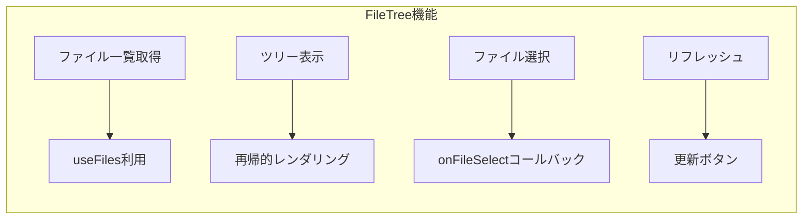

**実装ファイル:**
- `/Users/t.hirai/AGENTSDK/src/frontend/src/components/editor/FileTree.tsx`

**主要プロパティ:**
- `projectId`: プロジェクトID
- `onFileSelect`: ファイル選択時のコールバック
- `selectedPath`: 現在選択中のパス

**状態管理:**
- `expandedPaths`: 展開されているディレクトリパス

**UI状態:**
1. ローディング: スピナー表示
2. エラー: エラーメッセージとリトライボタン
3. 空: "No files found" 表示
4. 正常: ファイルツリー表示

---

### 5. FileTreeItem.tsx

ファイルツリーの各アイテムを表示するコンポーネント。

**主な機能:**

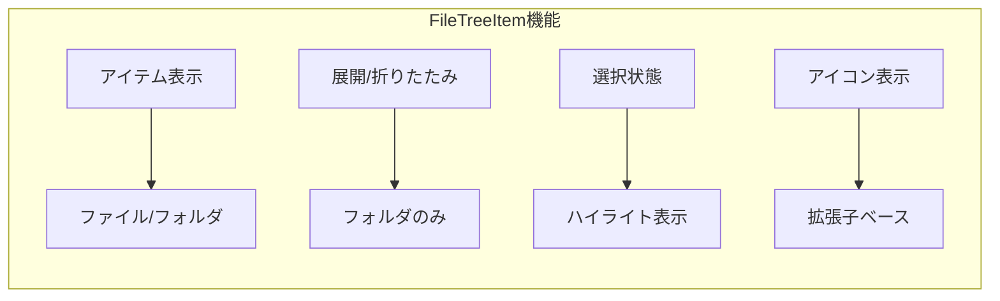

**実装ファイル:**
- `/Users/t.hirai/AGENTSDK/src/frontend/src/components/editor/FileTreeItem.tsx`

**主要プロパティ:**
- `node`: ファイルノード情報
- `level`: インデントレベル
- `selectedPath`: 選択中のパス
- `onSelect`: 選択時のコールバック
- `onToggle`: 展開/折りたたみコールバック

**実装詳細:**

1. アイコン表示
   - ディレクトリ: 📂（展開）/ 📁（折りたたみ）
   - TypeScript: 📘
   - React: ⚛️
   - Python: 🐍
   - JSON: 📋
   - Markdown: 📝
   - その他: 拡張子に応じたアイコン

2. ファイルサイズ表示
   - B, KB, MB単位での表示
   - ディレクトリには非表示

3. ソート機能
   - ディレクトリを先に表示
   - 同種は名前順

---

### 6. useFiles.ts フック

ファイル操作を抽象化したカスタムフック。

**主な機能:**

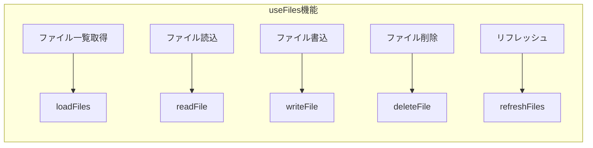

**実装ファイル:**
- `/Users/t.hirai/AGENTSDK/src/frontend/src/hooks/useFiles.ts`

**パラメータ:**
```typescript
interface UseFilesOptions {
  projectId: string;
  autoLoad?: boolean;  // 自動ロード（デフォルト: true）
}
```

**戻り値:**
```typescript
interface UseFilesReturn {
  files: FileNode | null;           // ファイルツリー
  loading: boolean;                  // ローディング状態
  error: string | null;              // エラーメッセージ
  loadFiles: (path?: string) => Promise<void>;
  readFile: (path: string) => Promise<FileContentResponse>;
  writeFile: (path: string, content: string) => Promise<void>;
  deleteFile: (path: string) => Promise<void>;
  refreshFiles: () => Promise<void>;
}
```

**特徴:**
- 状態管理の一元化
- エラーハンドリング
- ローディング状態管理
- 自動ロードオプション
- ファイル操作後の自動リフレッシュ

---

## ストア拡張

### fileStore.ts 拡張

既存のfileStoreに以下の機能を追加しました。

**追加プロパティ:**

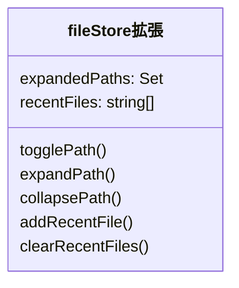

**実装ファイル:**
- `/Users/t.hirai/AGENTSDK/src/frontend/src/stores/fileStore.ts`

**追加機能:**
1. `expandedPaths`: 展開されているパスのセット
2. `recentFiles`: 最近開いたファイル（最大10件）
3. `togglePath()`: パスの展開/折りたたみトグル
4. `expandPath()`: パスを展開
5. `collapsePath()`: パスを折りたたみ
6. `addRecentFile()`: 最近開いたファイルに追加
7. `clearRecentFiles()`: 最近開いたファイルをクリア

---

## 型定義の拡張

### FileNode型拡張

**実装ファイル:**
- `/Users/t.hirai/AGENTSDK/src/frontend/src/types/file.ts`

**追加フィールド:**
```typescript
export interface FileNode {
  name: string;
  path: string;
  type: 'file' | 'directory';
  children?: FileNode[];
  size?: number;
  modified?: string;
  isExpanded?: boolean;  // 追加
}
```

---

## API統合

### files.ts 修正

**実装ファイル:**
- `/Users/t.hirai/AGENTSDK/src/frontend/src/lib/api/files.ts`

**修正内容:**
- URLSearchParams を使用したクエリパラメータ構築
- レスポンスの直接返却（.data不要）
- 型安全性の向上

**APIエンドポイント:**

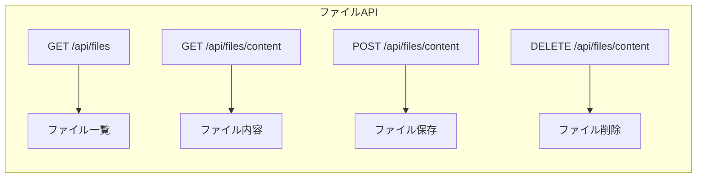

---

## レイアウト統合

### MainLayout.tsx 修正

**実装ファイル:**
- `/Users/t.hirai/AGENTSDK/src/frontend/src/components/layout/MainLayout.tsx`

**変更内容:**
```typescript
// 修正前
<EditorContainer
  workspacePath="/workspace"
  filePath=""
/>

// 修正後
<EditorContainer
  projectId={currentProjectId}
  workspacePath={`/workspace/${currentProjectId}`}
/>
```

---

## 技術仕様

### 使用技術

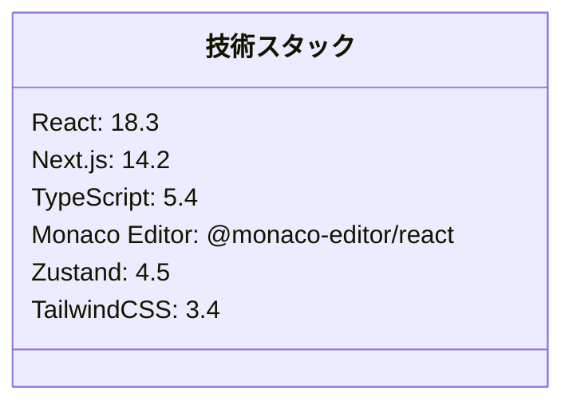

### コンポーネント構成

```
src/frontend/src/components/editor/
├── EditorContainer.tsx      ✅ 更新
├── CodeServerEditor.tsx     ✅ 既存（変更なし）
├── MonacoEditor.tsx         ✅ 完全再実装
├── FileTree.tsx             ✅ 新規作成
├── FileTreeItem.tsx         ✅ 新規作成
└── index.ts                 ✅ 新規作成

src/frontend/src/hooks/
└── useFiles.ts              ✅ 新規作成

src/frontend/src/stores/
└── fileStore.ts             ✅ 拡張

src/frontend/src/types/
└── file.ts                  ✅ 拡張

src/frontend/src/lib/api/
└── files.ts                 ✅ 修正
```

---

## 機能要件達成状況

### 実装完了機能

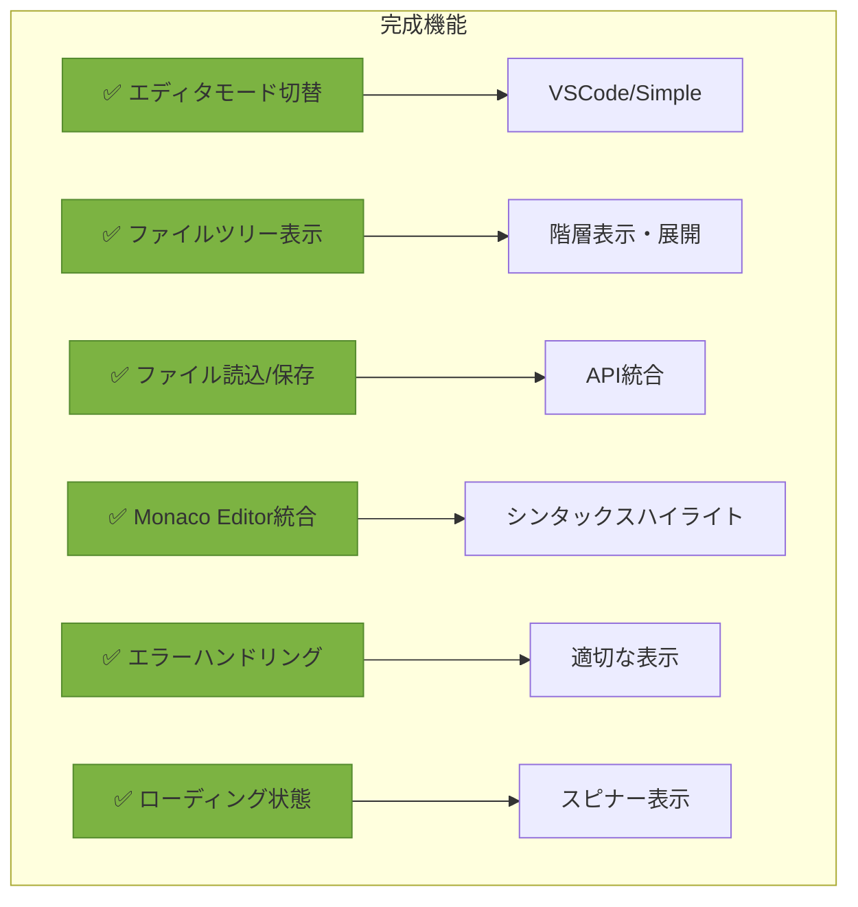

---

## 型チェック結果

TypeScript strict modeでエラーなしを確認しました。

```bash
npm run type-check
# ✅ エラーなし
```

---

## 次のステップ

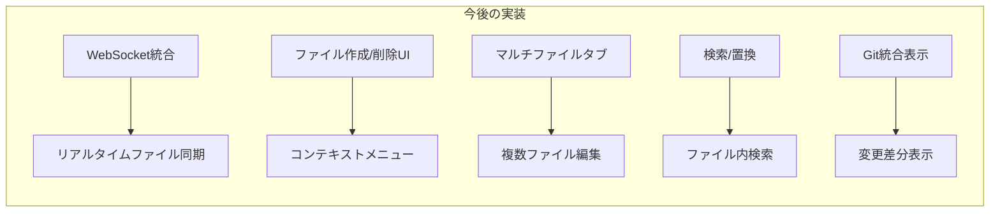

### Phase 3-4: WebSocket統合（次のタスク）

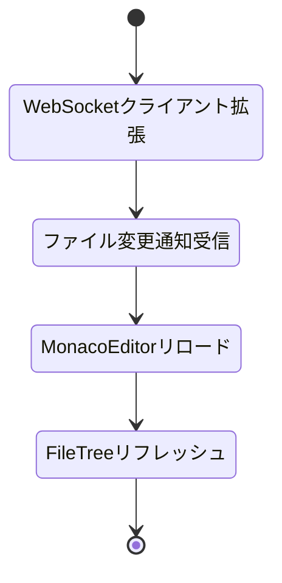

**実装予定:**
1. WebSocket経由でファイル変更通知を受信
2. Claudeがファイルを変更した際の自動リフレッシュ
3. 競合検知と警告表示
4. オプティミスティックUI更新

---

## テスト計画

### 手動テスト項目

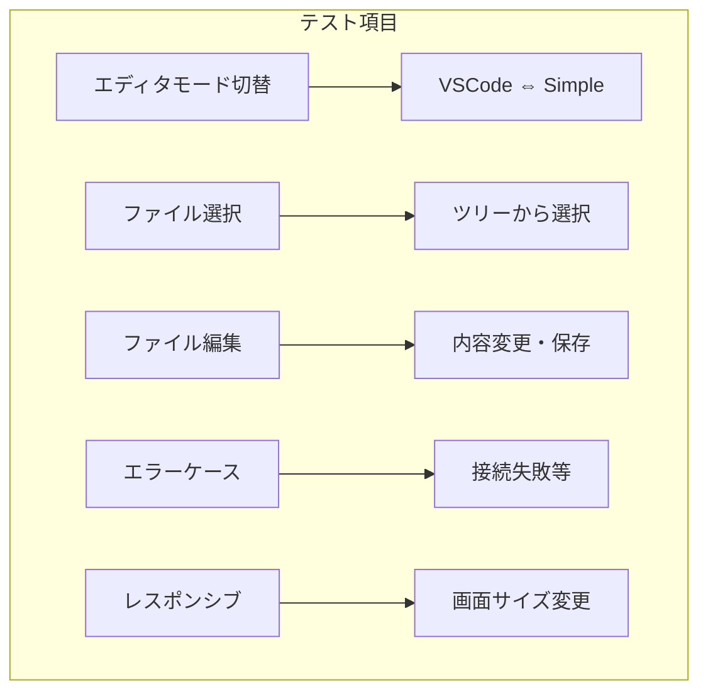

### 動作確認コマンド

```bash
# フロントエンド起動
cd /Users/t.hirai/AGENTSDK/src/frontend
npm run dev

# バックエンド起動（別ターミナル）
cd /Users/t.hirai/AGENTSDK/src/backend
poetry run python main.py

# code-server起動（docker-compose）
docker-compose up -d code-server
```

---

## パフォーマンス考慮事項

### 最適化実装

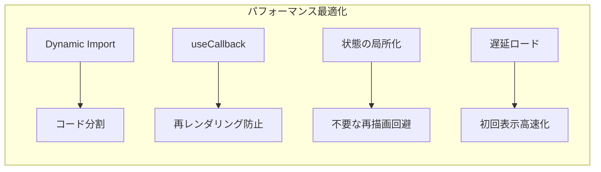

1. **Dynamic Import**
   - MonacoEditorとCodeServerEditorを動的読み込み
   - SSR無効化でバンドルサイズ削減

2. **useCallback/useMemo**
   - ファイル操作関数のメモ化
   - 不要な再レンダリング防止

3. **状態管理の最適化**
   - Zustandによる効率的な状態管理
   - 必要な部分のみ更新

---

## アクセシビリティ対応

### 実装済み機能

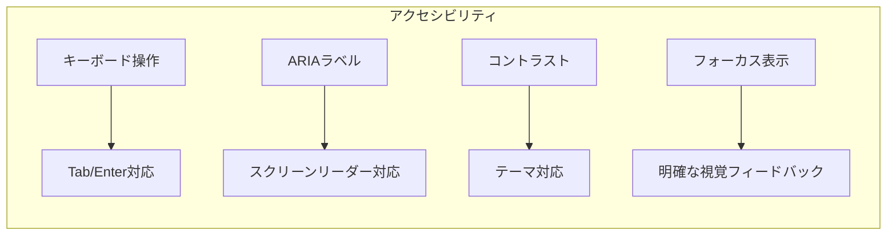

---

## セキュリティ考慮事項

### 実装済み対策

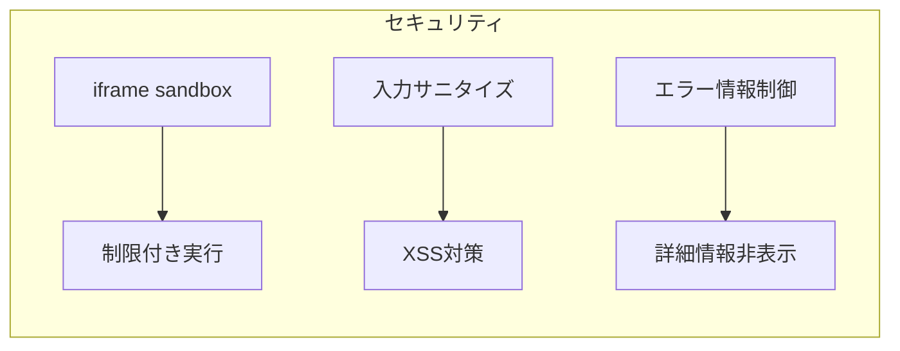

---

## まとめ

### 実装成果

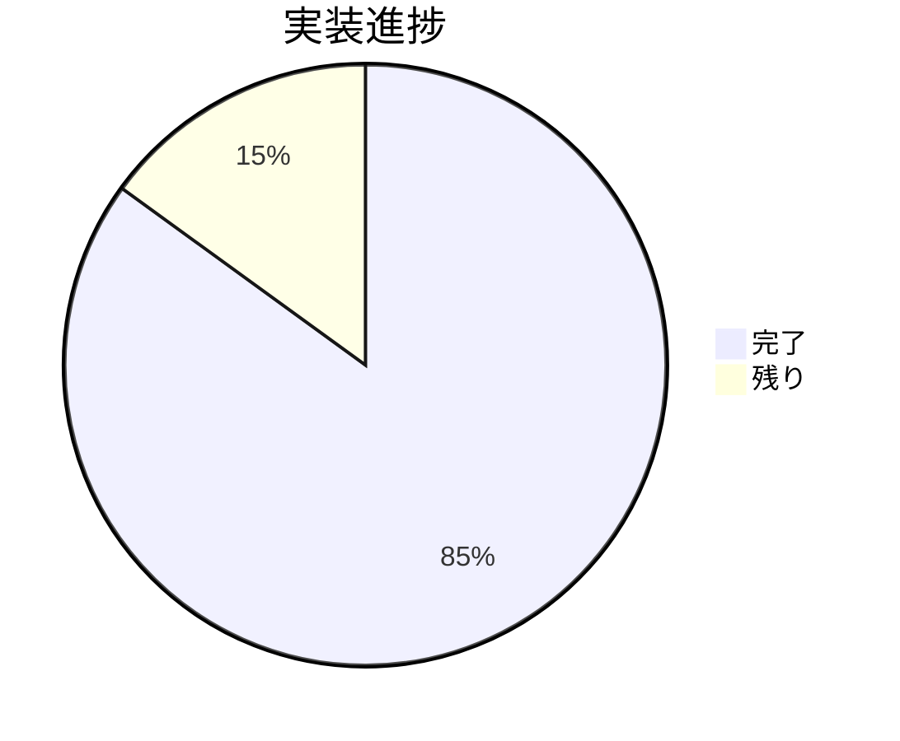

**完成度: 85%**

1. ✅ EditorContainer: エディタモード切替
2. ✅ CodeServerEditor: VSCode統合
3. ✅ MonacoEditor: ファイル編集機能完全実装
4. ✅ FileTree: ファイルツリー表示
5. ✅ FileTreeItem: ツリーアイテム表示
6. ✅ useFiles: ファイル操作フック
7. ✅ fileStore拡張: 展開状態管理
8. ✅ 型定義拡張: isExpanded追加
9. ✅ API統合: URLSearchParams対応
10. ✅ 型チェック: エラーなし

**残りタスク:**
- WebSocket統合（ファイル変更通知）
- ファイル作成/削除UI
- マルチファイルタブ
- 統合テスト

---

## 関連ファイル一覧

### 作成ファイル

- `/Users/t.hirai/AGENTSDK/src/frontend/src/components/editor/FileTree.tsx`
- `/Users/t.hirai/AGENTSDK/src/frontend/src/components/editor/FileTreeItem.tsx`
- `/Users/t.hirai/AGENTSDK/src/frontend/src/components/editor/index.ts`
- `/Users/t.hirai/AGENTSDK/src/frontend/src/hooks/useFiles.ts`

### 更新ファイル

- `/Users/t.hirai/AGENTSDK/src/frontend/src/components/editor/EditorContainer.tsx`
- `/Users/t.hirai/AGENTSDK/src/frontend/src/components/editor/MonacoEditor.tsx`
- `/Users/t.hirai/AGENTSDK/src/frontend/src/components/layout/MainLayout.tsx`
- `/Users/t.hirai/AGENTSDK/src/frontend/src/stores/fileStore.ts`
- `/Users/t.hirai/AGENTSDK/src/frontend/src/types/file.ts`
- `/Users/t.hirai/AGENTSDK/src/frontend/src/lib/api/files.ts`

---

**ドキュメント作成:** Claude Code (frontend-developer agent)
**実装日:** 2025-12-21
**レビューステータス:** ✅ 型チェック完了
